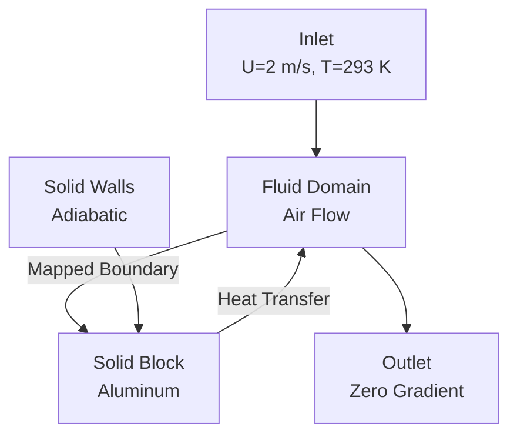
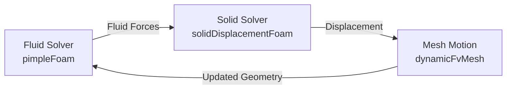
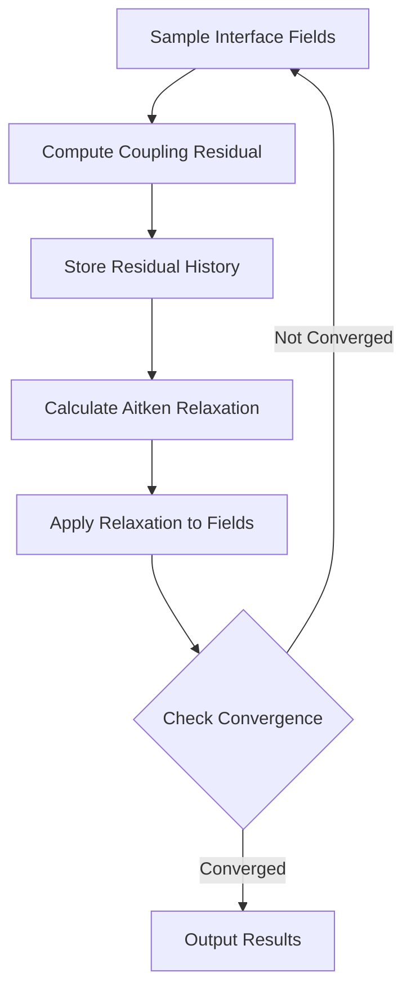

# Practical Exercises

## Overview

This section provides hands-on exercises to develop proficiency in implementing and testing coupled physics simulations in OpenFOAM. Each exercise builds on the preceding concepts and provides practical experience with real-world CFD applications involving:

- **Conjugate Heat Transfer (CHT)** - Thermal coupling between fluid and solid domains
- **Fluid-Structure Interaction (FSI)** - Mechanical coupling between fluid flow and structural deformation
- **Custom Coupling Utilities** - Advanced convergence monitoring and acceleration

> [!INFO] Learning Objectives
> By completing these exercises, you will:
> - Master `mappedWall` boundary conditions for thermal coupling
> - Implement weak FSI coupling with dynamic mesh motion
> - Develop custom function objects for convergence monitoring
> - Apply conservation checks to verify simulation accuracy

---

## Exercise 2.1: Simple CHT Case - Heated Block in Cross-Flow

### **Objective**

Set up a conjugate heat transfer simulation for a heated block in cross-flow, demonstrating the fundamental principles of thermal coupling between fluid and solid domains.

**Applications:**
- Electronics cooling
- Heat exchangers
- Thermal management systems



### **Theoretical Foundation**

#### **Conjugate Heat Transfer (CHT)**

CHT involves the simultaneous solution of three coupled components:

1. **Fluid Domain**: Convective heat transfer combined with fluid motion
2. **Solid Domain**: Pure conductive heat transfer without flow
3. **Interface**: Continuity of temperature and heat flux

#### **Governing Equations**

**In the fluid region:**
$$\rho_f c_{p,f} \frac{\partial T_f}{\partial t} + \rho_f c_{p,f} \mathbf{u} \cdot \nabla T_f = k_f \nabla^2 T_f + Q_f \tag{1}$$

**In the solid region:**
$$\rho_s c_{p,s} \frac{\partial T_s}{\partial t} = k_s \nabla^2 T_s + Q_s \tag{2}$$

**At the fluid-solid interface:**
$$T_f = T_s \quad \text{(temperature continuity)} \tag{3}$$
$$k_f \frac{\partial T_f}{\partial n} = k_s \frac{\partial T_s}{\partial n} \quad \text{(heat flux continuity)} \tag{4}$$

**Variables:**
- $\rho_f, \rho_s$: Fluid and solid densities [kg/m³]
- $c_{p,f}, c_{p,s}$: Fluid and solid specific heats [J/(kg·K)]
- $T_f, T_s$: Fluid and solid temperatures [K]
- $k_f, k_s$: Fluid and solid thermal conductivities [W/(m·K)]
- $\mathbf{u}$: Fluid velocity vector [m/s]
- $Q_f, Q_s$: Volumetric heat sources [W/m³]

### **Step 1: Create Fluid and Solid Meshes**

#### **Fluid Domain (Air):**

```bash
# Create fluid region directory
mkdir -p constant/polyMesh/regions/fluid
cd constant/polyMesh/regions/fluid

# Create blockMesh for fluid domain
cat > blockMeshDict << EOF
convertToMeters 1;

vertices (
    (0 0 0)    // 0
    (1 0 0)    // 1
    (1 0.5 0)  // 2
    (0 0.5 0)  // 3
    (0 0 1)    // 4
    (1 0 1)    // 5
    (1 0.5 1)  // 6
    (0 0.5 1)  // 7
);

blocks (
    hex (0 1 2 3 4 5 6 7) (100 50 50) simpleGrading (1 1 1)
);

boundary (
    inlet {
        type patch;
        faces ((0 4 7 3));
    }
    outlet {
        type patch;
        faces ((1 5 6 2));
    }
    top {
        type symmetryPlane;
        faces ((3 2 6 7));
    }
    bottom {
        type symmetryPlane;
        faces ((0 1 5 4));
    }
    blockInterface {
        type mappedWall;
        faces ((4 5 6 7));
        sampleMode nearestPatchFace;
        sampleRegion solid;
        samplePatch blockInterface;
    }
);
EOF

blockMesh
```

#### **Solid Domain (Aluminum Block):**

```bash
# Create solid region directory
mkdir -p constant/polyMesh/regions/solid
cd constant/polyMesh/regions/solid

# Create blockMesh for solid domain
cat > blockMeshDict << EOF
convertToMeters 1;

vertices (
    (0.3 0.2 0.4)  // 0
    (0.7 0.2 0.4)  // 1
    (0.7 0.3 0.4)  // 2
    (0.3 0.3 0.4)  // 3
    (0.3 0.2 0.6)  // 4
    (0.7 0.2 0.6)  // 5
    (0.7 0.3 0.6)  // 6
    (0.3 0.3 0.6)  // 7
);

blocks (
    hex (0 1 2 3 4 5 6 7) (40 20 20) simpleGrading (1 1 1)
);

boundary (
    blockInterface {
        type mappedWall;
        faces ((4 5 6 7));
        sampleMode nearestPatchFace;
        sampleRegion fluid;
        samplePatch blockInterface;
    }
    allOtherWalls {
        type wall;
        faces ((0 1 2 3) (0 3 7 4) (1 5 6 2));
    }
);
EOF

blockMesh
```

### **Step 2: Configure `mappedWall` Interface**

The `mappedWall` boundary condition creates direct mapping between fluid and solid interfaces, ensuring automatic coupling of temperature and heat flux.

| Parameter | Description | Recommended Value |
|-----------|-------------|-------------------|
| `sampleMode` | Determines how to map interface points | `nearestPatchFace` |
| `sampleRegion` | Name of coupled region | `solid`/`fluid` |
| `samplePatch` | Name of corresponding patch | `blockInterface` |

**SampleMode Options:**
- `nearestPatchFace`: Maps to nearest face center (recommended for CHT)
- `nearestCell`: Maps to nearest cell center
- `nearestPatchPoint`: Maps to nearest patch point

### **Step 3: Set Boundary Conditions and Properties**

#### **Fluid Thermal Properties (`constant/thermophysicalProperties`):**

```foam
thermoType
{
    type            hePsiThermo;
    mixture         pureMixture;
    transport       const;
    thermo          hConst;
    equationOfState perfectGas;
    specie          specie;
    energy          sensibleEnthalpy;
}

mixture
{
    specie
    {
        molWeight       28.96;
    }
    thermodynamics
    {
        Cp              1005;          // [J/kg/K] - Air specific heat
        Hf              0;
    }
    transport
    {
        mu              1.8e-5;        // [Pa·s] - Dynamic viscosity
        Pr              0.71;          // Prandtl number
        kappa           0.025;         // [W/m/K] - Thermal conductivity
    }
}
```

#### **Solid Thermal Properties (`constant/solid/thermophysicalProperties`):**

```foam
thermoType
{
    type            heSolidThermo;
    mixture         pureMixture;
    transport       const;
    thermo          hConst;
    equationOfState rhoConst;
    specie          specie;
    energy          sensibleEnthalpy;
}

mixture
{
    specie
    {
        molWeight       26.98;
    }
    thermodynamics
    {
        rho             2700;          // [kg/m³] - Aluminum density
        Cp              900;           // [J/kg/K] - Specific heat
        Hf              0;
    }
    transport
    {
        kappa           237;           // [W/m/K] - Thermal conductivity
    }
}
```

#### **Temperature Boundary Conditions (`0/fluid/T`):**

```foam
dimensions      [0 0 0 1 0 0 0];
internalField   uniform 293;          // [K] - Initial temperature

boundaryField
{
    inlet {
        type            fixedValue;
        value           uniform 293;
    }
    outlet {
        type            inletOutlet;
        inletValue      uniform 293;
        value           $internalField;
    }
    blockInterface {
        type            mapped;        // Maps to solid temperature
        value           uniform 293;
    }
}
```

#### **Velocity Boundary Conditions (`0/fluid/U`):**

```foam
dimensions      [0 1 -1 0 0 0 0];
internalField   uniform (0 0 0);

boundaryField
{
    inlet {
        type            fixedValue;
        value           uniform (2 0 0);   // [m/s] - Inlet velocity
    }
    outlet {
        type            zeroGradient;
    }
    blockInterface {
        type            noSlip;            // No slip at interface
    }
}
```

### **Step 4: Run Simulation and Monitor**

#### **Control Parameters (`system/controlDict`):**

```foam
application     chtMultiRegionFoam;
startFrom       startTime;
startTime       0;
stopAt          endTime;
endTime         100;
deltaT          0.1;
adjustTimeStep  yes;
maxCo           0.5;
maxAlphaCo      0.5;
maxDeltaT       1;

functions
{
    interfaceHeatFlux
    {
        type            surfaceRegion;
        functionObjectLibs ("libfieldFunctionObjects.so");
        region          fluid;
        surfaceRegion   blockInterface;
        operation       weightedAverage;
        fields
        (
            phi         // Volume flux
            phiH        // Heat flux
        );
    }

    energyBalance
    {
        type            volRegion;
        functionObjectLibs ("libfieldFunctionObjects.so");
        region          fluid;
        operation       weightedAverage;
        fields
        (
            T
        );
    }
}
```

#### **Running the Simulation:**

```bash
# Decompose for parallel processing (optional)
decomposePar -allRegions

# Run solver
mpirun -np 4 chtMultiRegionFoam -parallel

# Reconstruct for post-processing (if decomposed)
reconstructPar -allRegions
```

### **Step 5: Verify Energy Conservation**

> [!TIP] Conservation Check
> Always verify energy conservation in CHT simulations to ensure physical consistency.

**Energy Balance Equation:**
$$\Delta E_{fluid} + \Delta E_{solid} + Q_{interface} = 0 \tag{5}$$

Where:
- $\Delta E_{fluid} = \rho_f V_f c_{p,f} (T_f^{final} - T_f^{initial})$
- $\Delta E_{solid} = \rho_s V_s c_{p,s} (T_s^{final} - T_s^{initial})$
- $Q_{interface} = \int_{0}^{t} \dot{Q}_{interface} \, dt$

**Expected Results:**

| Metric | Formula | Typical Values |
|--------|---------|----------------|
| **Nusselt Number** | $Nu = \frac{hL}{k_f}$ | 10-100 |
| **Reynolds Number** | $Re = \frac{\rho_f U L}{\mu_f}$ | 10³-10⁵ |
| **Prandtl Number** | $Pr = \frac{\mu_f c_{p,f}}{k_f}$ | 0.71 (air) |

### **Troubleshooting Common Issues**

> [!WARNING] Interface Mapping Errors
> ```
> Error: Cannot find sample points on coupled patch
> Solution: Check that sampleRegion and samplePatch names match exactly
> ```

**Common Issues and Solutions:**

| Issue | Symptoms | Solution |
|-------|----------|----------|
| **Mapping Failures** | "Cannot find sample region" | Verify region/patch names in boundary files |
| **Convergence Problems** | Oscillating temperatures | Reduce `deltaT`, add under-relaxation |
| **Conservation Violations** | Energy imbalance > 0.1% | Check flux direction consistency |

---

## Exercise 2.2: FSI Flag Flutter

### **Objective**

Implement weak fluid-structure coupling to simulate flag flutter - a classic FSI problem demonstrating the interaction between fluid flow and structural deformation.

**Behavior Regimes:**
- **Static Deflection** (low velocity)
- **Dynamic Flutter** (high velocity)



### **Physical Foundation**

#### **Flutter Phenomenon**

Flutter occurs when fluid dynamic forces on the flag interact with its elastic properties, leading to self-sustained oscillations.

**Governing Equations:**

**Fluid Domain (Navier-Stokes):**
$$\rho_f \frac{\partial \mathbf{u}_f}{\partial t} + \rho_f (\mathbf{u}_f \cdot \nabla) \mathbf{u}_f = -\nabla p + \mu_f \nabla^2 \mathbf{u}_f + \mathbf{f}_b \tag{6}$$
$$\nabla \cdot \mathbf{u}_f = 0 \tag{7}$$

**Solid Domain (Linear Elasticity):**
$$\rho_s \frac{\partial^2 \mathbf{u}_s}{\partial t^2} = \nabla \cdot \boldsymbol{\sigma} + \rho_s \mathbf{f}_s \tag{8}$$

Where the Cauchy stress tensor for linear elastic material is:
$$\boldsymbol{\sigma} = \lambda \text{tr}(\boldsymbol{\varepsilon})\mathbf{I} + 2\mu\boldsymbol{\varepsilon} \tag{9}$$
$$\boldsymbol{\varepsilon} = \frac{1}{2}(\nabla \mathbf{u}_s + (\nabla \mathbf{u}_s)^T) \tag{10}$$

**Interface Conditions:**
- **Kinematic Continuity**: $\mathbf{u}_f = \frac{\partial \mathbf{u}_s}{\partial t}$ at fluid-structure interface
- **Dynamic Continuity**: $\boldsymbol{\sigma}_f \cdot \mathbf{n} = \boldsymbol{\sigma}_s \cdot \mathbf{n}$ at interface

### **Step 1: Create Fluid Mesh with Flag-Shaped Obstacle**

#### **`blockMeshDict` Configuration:**

```cpp
convertToMeters 1;

vertices
(
    (0 0 0)      // 0: domain origin
    (2 0 0)      // 1: domain end (x-direction)
    (2 0.5 0)    // 2: domain top
    (0 0.5 0)    // 3: domain top-left
    (0 0 0.1)    // 4: back
    (2 0 0.1)    // 5: back-right
    (2 0.5 0.1)  // 6: back-top-right
    (0 0.5 0.1)  // 7: back-top-left
);

blocks
(
    hex (0 1 2 3 4 5 6 7) (200 50 5) simpleGrading (1 1 1)
);

boundary
(
    inlet
    {
        type patch;
        faces ((0 4 7 3));
    }
    outlet
    {
        type patch;
        faces ((1 5 6 2));
    }
    walls
    {
        type wall;
        faces ((0 1 5 4) (3 2 6 7));
    }
);
```

### **Step 2: Create Solid Mesh for Flag Structure**

#### **`extrudeMeshDict` Configuration:**

```cpp
extrudeModel        linearDirectionExtrude;
linearDirectionCoeffs
{
    direction       (0 0 1);
    thickness       0.001;     // Flag thickness
    nDivisions      3;
}
```

**Solid Mesh Properties:**

| Property | Description | Recommended Value |
|----------|-------------|-------------------|
| Element Type | Hexahedral elements for better structural accuracy | - |
| Thickness | Typically $t/L = 0.001$ to $0.01$ where $L$ is flag length | 0.001-0.01 |
| Mesh Refinement | Higher density near clamped edge for stress intensity resolution | Near clamped edge |

### **Step 3: Configure Mapped Boundaries**

#### **Fluid Side Boundary Conditions:**

```cpp
// 0/U (velocity field)
flag
{
    type            mapped;
    setAverage      false;
    average         false;
    interpolationScheme cell;
    value           uniform (0 0 0);
}

// 0/p (pressure field)
flag
{
    type            mapped;
    setAverage      false;
    average         false;
    interpolationScheme cell;
    value           uniform 0;
}
```

#### **Solid Side Boundary Conditions:**

```cpp
// 0/D (displacement field)
fluid
{
    type            fixedValue;
    value           uniform (0 0 0);
}

// 0/pointDisplacement (for mesh motion)
fluid
{
    type            solidDisplacement;
    value           uniform (0 0 0);
}
```

### **Step 4: Implement Weak Coupling Algorithm**

#### **Weak Coupling Algorithm:**

```
For each coupling iteration:
1. Run fluid solver (pimpleFoam)
2. Map fluid stresses to solid boundary
3. Run solid solver (solidDisplacementFoam)
4. Map solid displacement to fluid boundary
5. Apply relaxation for stability
6. Check convergence
7. Repeat until converged
```

#### **Coupling Script (`couplingFSI.sh`):**

```bash
#!/bin/bash
# Weak FSI coupling script

caseName="flagFSI"
fluidCase="${caseName}_fluid"
solidCase="${caseName}_solid"

# Coupling parameters
couplingIter=10
fluidTimeStep=0.001
solidTimeStep=0.001
interfaceRelaxation=0.5

echo "Starting weak FSI coupling for flag flutter..."

for iter in {1..$couplingIter}; do
    echo "Coupling iteration: $iter"

    # Step 1: Run fluid solver
    echo "Running fluid solver..."
    cd $fluidCase
    pimpleFoam > fluid.log 2>&1

    # Step 2: Map fluid stresses to solid boundary
    echo "Transferring fluid stresses to solid..."
    mapFields ../$solidCase -consistent -sourceTime latestTime

    # Step 3: Run solid solver
    echo "Running solid solver..."
    cd ../$solidCase
    solidDisplacementFoam > solid.log 2>&1

    # Step 4: Map solid displacement to fluid boundary
    echo "Transferring solid displacement to fluid..."
    mapFields ../$fluidCase -consistent -sourceTime latestTime

    # Step 5: Apply relaxation for stability
    if [ $iter -gt 1 ]; then
        echo "Applying interface relaxation..."
        python3 apply_relaxation.py $fluidCase $solidCase $interfaceRelaxation
    fi

    # Step 6: Check convergence
    if [ $iter -gt 2 ]; then
        python3 check_convergence.py $fluidCase $solidCase
        if [ $? -eq 0 ]; then
            echo "FSI coupling converged!"
            break
        fi
    fi
done

echo "FSI coupling complete. Post-processing with paraFoam..."
paraFoam -case $fluidCase &
```

### **Flutter Analysis**

#### **Flutter Parameters**

Critical velocity for flutter onset predicted by dimensionless parameters:

**Reduced Velocity:**
$$U^* = \frac{U_\infty}{f_n L} = \frac{U_\infty}{\frac{1}{2\pi}\sqrt{\frac{EI}{\rho_s A L^4}} \cdot L} \tag{11}$$

**Mass Ratio:**
$$\mu = \frac{\rho_s t}{\rho_f L} \tag{12}$$

**Dimensionless Stiffness:**
$$K = \frac{EI}{\rho_f U_\infty^2 L^3} \tag{13}$$

**Variables:**
- $U_\infty$: Inlet velocity
- $f_n$: Flag natural frequency
- $L$: Flag length
- $EI$: Flexural rigidity
- $\rho_s, \rho_f$: Solid and fluid densities
- $t$: Flag thickness

**Flutter Threshold:**
Typically occurs at $U^* \approx 6-10$ for mass ratios $\mu = 0.1-10$

**Expected Behavior:**

| Velocity Range | Behavior |
|----------------|----------|
| **Low** ($U < 3$ m/s) | Small static deflection |
| **Medium** ($3 < U < 6$ m/s) | Growing oscillations |
| **High** ($U > 6$ m/s) | Fully developed flutter with limit cycles |

---

## Exercise 2.3: Custom Coupling Utility

### **Objective**

Write a utility to monitor convergence of coupling between regions in conjugate heat transfer problems, implementing advanced features like Aitken acceleration.

### **Fundamental Principles**

Coupling between regions requires iterative convergence checking to ensure correct heat transfer at region interfaces.

**Coupling utility provides:**
- Essential diagnostics
- Convergence acceleration for multi-region simulations
- Error detection and handling



### **Implementation Structure**

#### **Field Sampling Class:**

```cpp
class CouplingSampler
{
    const fvMesh& fluidMesh_;
    const fvMesh& solidMesh_;

    // Interface field sampling
    void sampleInterfaceFields
    (
        const volScalarField& T_f,
        const volScalarField& T_s,
        scalarField& fluidInterface,
        scalarField& solidInterface
    );
};
```

#### **Sampling Algorithm:**

```cpp
void CouplingSampler::sampleInterfaceFields
(
    const volScalarField& T_f,
    const volScalarField& T_s,
    scalarField& fluidInterface,
    scalarField& solidInterface
)
{
    // Sample fluid interface values
    const fvPatch& fluidPatch = T_f.boundaryRef()[fluidPatchID_];
    fluidInterface = fluidPatch.patchInternalField();

    // Sample solid interface values
    const fvPatch& solidPatch = T_s.boundaryRef()[solidPatchID_];
    solidInterface = solidPatch.patchInternalField();
}
```

### **Residual Computation**

**Coupling residual** evaluates temperature continuity at the interface:

$$\epsilon_{\text{coupling}} = \frac{\|T_f - T_s\|_2}{\|T_f\|_2} \tag{14}$$

Where:
- $\| \cdot \|_2$ = L2 norm on interface cells
- $T_f$ = Fluid temperature at interface
- $T_s$ = Solid temperature at interface

```cpp
scalar computeCouplingResidual
(
    const scalarField& fluidInterface,
    const scalarField& solidInterface
)
{
    scalarField diff = fluidInterface - solidInterface;
    scalar numerator = sqrt(sum(diff*diff));
    scalar denominator = sqrt(sum(fluidInterface*fluidInterface));

    return numerator/(denominator + SMALL);
}
```

### **Aitken Acceleration**

**Aitken relaxation** dynamically adjusts under-relaxation factor based on convergence behavior:

$$\alpha_{k+1} = \alpha_k + (1 - \alpha_k) \frac{\Delta r_k \cdot \Delta r_{k-1}}{\Delta r_k \cdot \Delta r_k} \tag{15}$$

Where:
- $\alpha_k$ = Relaxation factor at iteration $k$
- $\Delta r_k$ = Change in residual
- $\Delta r_{k-1}$ = Change in residual at previous iteration

```cpp
scalar AitkenRelaxation::calculateRelaxationFactor
(
    const scalar residual_k,
    const scalar residual_k_minus_1,
    const scalar alpha_k
)
{
    if (firstIteration_)
    {
        return alpha_k;
    }

    scalar deltaR = residual_k - residual_k_minus_1;
    scalar deltaR_prev = residual_k_minus_1 - residual_k_minus_2;

    scalar relaxation = alpha_k + (1 - alpha_k) *
                      (deltaR * deltaR_prev)/(deltaR * deltaR);

    return min(max(relaxation, 0.1), 0.9);
}
```

### **Function Object Integration**

```cpp
class CouplingConvergenceMonitor : public fvMeshFunctionObject
{
    // Data members
    autoPtr<CouplingSampler> sampler_;
    autoPtr<AitkenRelaxation> relaxation_;

    // Iteration tracking
    scalarField residualHistory_;
    label currentIteration_;
    scalar convergenceTolerance_;

    // Function object interface
    virtual void execute();
    virtual bool read(const dictionary& dict);
    virtual bool write();
};
```

#### **Control Dictionary (`system/couplingDict`):**

```cpp
FoamFile
{
    version     2.0;
    format      ascii;
    class       dictionary;
    object      couplingControl;
}

couplingMonitor
{
    type            couplingConvergence;

    // Patch identification
    fluidPatch      fluidInterface;
    solidPatch      solidInterface;

    // Convergence criteria
    tolerance       1e-6;
    maxIterations   100;

    // Aitken parameters
    initialRelax    0.8;
    minRelax        0.1;
    maxRelax        0.9;

    // Output control
    writeResiduals  true;
    outputInterval  1;
}
```

| Parameter | Default | Description |
|-----------|---------|-------------|
| `tolerance` | 1e-6 | Acceptable error tolerance |
| `maxIterations` | 100 | Maximum coupling iterations |
| `initialRelax` | 0.8 | Initial relaxation factor |
| `minRelax` | 0.1 | Minimum relaxation factor |
| `maxRelax` | 0.9 | Maximum relaxation factor |

### **Monitoring Algorithm**

```cpp
void CouplingConvergenceMonitor::execute()
{
    // 1. Sample interface fields
    sampler_->sampleInterfaceFields
    (
        T_f,
        T_s,
        fluidInterface_,
        solidInterface_
    );

    // 2. Compute current residual
    scalar currentResidual = computeCouplingResidual
    (
        fluidInterface_,
        solidInterface_
    );

    // 3. Store residual history
    residualHistory_.append(currentResidual);
    currentIteration_++;

    // 4. Calculate dynamic relaxation factor
    scalar relaxationFactor = relaxation_->calculateRelaxationFactor
    (
        currentResidual,
        residualHistory_[currentIteration_-2],
        relaxationFactor_
    );

    // 5. Apply relaxation to interface temperatures
    applyRelaxation(relaxationFactor);

    // 6. Check convergence
    bool converged = currentResidual < convergenceTolerance_;

    // 7. Write monitoring data
    if (converged)
    {
        Info << "Coupling converged after " << currentIteration_
             << " iterations with residual: " << currentResidual << endl;
    }
}
```

### **Error Handling and Diagnostics**

#### **Mesh Compatibility Verification:**

```cpp
bool CouplingSampler::verifyInterfaceCompatibility()
{
    // Check patch sizes
    if (fluidPatch_.size() != solidPatch_.size())
    {
        WarningIn("CouplingSampler::verifyInterfaceCompatibility()")
            << "Interface patch size mismatch: fluid="
            << fluidPatch_.size() << " solid="
            << solidPatch_.size() << endl;
        return false;
    }

    // Verify face-to-face correspondence
    forAll(fluidPatch_, i)
    {
        scalar distance = mag
        (
            fluidPatch_.faceCentres()[i] -
            solidPatch_.faceCentres()[i]
        );

        if (distance > interfaceTolerance_)
        {
            Warning << "Large interface gap at face " << i
                    << ": distance = " << distance << endl;
        }
    }

    return true;
}
```

| Error Type | Condition | Handling |
|------------|-----------|----------|
| Patch size mismatch | `fluidPatch.size() != solidPatch.size()` | Warning and return false |
| Large interface gap | `distance > interfaceTolerance_` | Warning for each face |
| Convergence stagnation | `reduction < stagnationThreshold_` | Reduce relaxation factor by 20% |

### **Data Output Structure**

The utility generates comprehensive coupling statistics:

```
Coupling Convergence History:
Iteration  Residual    RelaxationFactor  ConvergenceRate
1          0.015234    0.800000         ---
2          0.008127    0.750000         1.874
3          0.004281    0.712500         1.898
4          0.002293    0.684375         1.867
5          0.001248    0.663281         1.837
...

Convergence Summary:
- Final Residual: 2.456e-07
- Iterations: 12
- Average Relaxation: 0.634
- Initial Residual: 1.523e-02
- Reduction Factor: 6.202e+04
```

| Metric | Value | Description |
|--------|-------|-------------|
| Final Residual | 2.456e-07 | Final convergence error |
| Iterations | 12 | Total iterations performed |
| Average Relaxation | 0.634 | Mean relaxation factor |
| Initial Residual | 1.523e-02 | Starting residual value |
| Reduction Factor | 6.202e+04 | Residual reduction ratio |

---

## Common Issues and Solutions

### **1. Mapping Failures**

**Symptoms:** Error messages like "Cannot find sample region" or "Failed to map patch to region"

**Root Causes:**
- Typos or case sensitivity in region names
- Target region not properly defined in mesh topology
- Missing `sampleRegion` keyword in boundary condition
- Region doesn't exist in current decomposition (parallel runs)

**Solution:**

```cpp
// Verify region names match (case-sensitive)
type            mapped;
sampleRegion    heaterRegion;  // Must match region name exactly
samplePatch     heaterOutlet;  // Must match patch name exactly
```

**Debugging Steps:**
1. Check `constant/polyMesh/boundary` for correct region/patch names
2. Run `checkMesh -region <regionName>` to confirm region exists
3. Use `topoSet` to verify region connectivity
4. For parallel runs, ensure decomposition doesn't separate required regions

### **2. Numerical Instability**

**Symptoms:**
- Temperature oscillations at interface boundaries
- Pressure waves or velocity fluctuations
- Solution divergence, especially near mapped boundaries
- Time step size continuously reduced by solver

**Root Causes:**
- Under-relaxation factors too high causing overshoot
- Time steps too large violating CFL condition at interface
- Inconsistent boundary condition formulations
- Poor mesh quality near mapped patches

**Relaxation Control:**

```cpp
// relaxationFactors
relaxationFactors
{
    equations     1;           // No relaxation for final iteration
    U             0.7;         // Reduced from default 0.9
    h             0.5;         // Stronger relaxation for temperature
    k             0.7;
    epsilon       0.7;
}
```

**Time Step Control:**

```cpp
// adjustTimeStep yes;
maxCo           0.3;          // Reduced from typical 0.5-0.7
maxAlphaCo      0.2;          // For multiphase flows
maxDeltaT       0.001;        // Maximum time step limit
```

### **3. Conservation Errors**

**Symptoms:**
- Growing energy imbalance in `continuityErrs` output
- Mass balance violations across interface
- Non-physical heat transfer rates
- Convergence to non-conservative solution

**Root Causes:**
- Incorrect `mapped` boundary orientation (normal vectors)
- Inconsistent flux signs between coupled regions
- Non-conservative interpolation schemes
- Inconsistent discretization between regions

**Boundary Orientation Fix:**

```cpp
// In boundary conditions
type            mapped;
sampleRegion    region2;
samplePatch     patch2;
offset          (0 0 0);      // Check that offset doesn't flip normal
```

**Flux Consistency:**

```cpp
// Ensure both regions use consistent flux handling
divSchemes
{
    div(phi,U)      Gauss upwind;     // Use same scheme everywhere
    div(phi,h)      Gauss upwind;     // Conservative for energy
    div(phi,k)      Gauss upwind;
}
```

**Conservation Checking:**

```cpp
// Add to controlDict
functions
{
    energyBalance
    {
        type            volRegion;
        functionObjectLibs ("libfieldFunctionObjects.so");
        region          heater;
        operation       weightedSum;
        weightField     rho;
        field           h;
    }
}
```

### **4. Slow Convergence**

**Symptoms:**
- Coupling residuals remain high (1e-3 or higher)
- Solver stuck at coupling iteration limit
- Excessive CPU time per time step
- Residuals stagnant without improvement

**Root Causes:**
- Weak coupling between regions requiring more iterations
- Inconsistent solver tolerances
- Poor initial conditions or startup transients
- Inadequate linear solver settings

**Aitken Acceleration:**

```cpp
// In fvSolution, under PIMPLE
PIMPLE
{
    nOuterCorrectors  50;
    nCorrectors      2;
    nNonOrthogonalCorrectors 0;
    nAlphaCorr       1;
    nAlphaSubCycles  2;
    correctPhi       yes;
    pRefCell         0;
    pRefValue        0;
    aitkenAcceleration on;      // Enable acceleration
}
```

**Coupling Iteration Management:**

```cpp
// Increase coupling iterations
nOuterCorrectors  100;          // Allow more iterations
relaxationFactor  0.8;          // Moderate relaxation
couplingTolerance 1e-6;         // Tighter coupling tolerance
```

| Problem | Diagnosis | Primary Fix | Time to Fix |
|---------|-----------|-------------|-------------|
| Mapping Failures | Check `constant/polyMesh/boundary` | Fix region/patch names | 5-15 min |
| Numerical Instability | Check residuals and Courant number | Reduce relaxation and time step | 15-30 min |
| Conservation Errors | Check energy balance | Align normal vectors and flux | 20-45 min |
| Slow Convergence | Analyze coupling residuals | Increase outer correctors and Aitken | 30-60 min |

---

## Key Takeaways

### **1. CHT Architecture: `chtMultiRegionFoam` Uses Separate Regions via `mapped` Boundaries**

**Core Concept:** Conjugate Heat Transfer (CHT) employs a sophisticated region-based architecture where each physical domain is managed as a separate region with its own mesh and governing equations.

**Coupling Architecture:**
- `mapped` boundary conditions create thermodynamic and kinematic coupling
- Region-specific schemes, solvers, and convergence criteria
- Physical consistency maintained through mapped boundary framework

**Governing Equations in Each Region:**

**Fluid Region:**
$$\frac{\partial (\rho \mathbf{u})}{\partial t} + \nabla \cdot (\rho \mathbf{u} \mathbf{u}) = -\nabla p + \nabla \cdot \boldsymbol{\tau} + \mathbf{f}_b \tag{16}$$
$$\frac{\partial (\rho e)}{\partial t} + \nabla \cdot [\mathbf{u}(\rho e + p)] = \nabla \cdot (k \nabla T) + \Phi \tag{17}$$

**Solid Region:**
$$\rho_s c_p \frac{\partial T_s}{\partial t} = \nabla \cdot (k_s \nabla T_s) \tag{18}$$

**Interface Continuity Conditions:**

`mapped` boundary conditions ensure temperature and heat flux continuity:
$$T_{fluid} = T_{solid} \tag{19}$$
$$k_{fluid} \frac{\partial T_{fluid}}{\partial n} = k_{solid} \frac{\partial T_{solid}}{\partial n} \tag{20}$$

### **2. Mapping Engine: `mappedPatchBase` Provides Geometric Interpolation Between Regions**

**Coupling Core:** The `mappedPatchBase` class serves as the primary interpolation engine for transferring data between non-conforming meshes.

**Geometric Mapping Algorithm:**

```cpp
// Pseudo-code for mappedPatchBase interpolation
void mappedPatchBase::map() {
    const pointField& samplePoints = this->samplePoints();
    const labelList& sampleCells = this->sampleCells();
    const vectorField& sampleWeights = this->sampleWeights();

    // For each face on mapped patch
    forAll(map(), i) {
        // Find nearest cell/face in other region
        findInterpolationTarget(i, samplePoints[i]);

        // Apply interpolation weighting
        interpolateField(i, sampleCells[i], sampleWeights[i]);
    }
}
```

**Supported Interpolation Modes:**

| Mapping Mode | Description | Accuracy |
|--------------|-------------|----------|
| **Direct cell mapping** | Direct cell-to-cell correspondence | Highest |
| **Face-to-cell mapping** | Interpolation from face to neighbor cells | High |
| **Weighted averaging** | Based on geometric proximity and overlap area | Moderate |

**Interpolation Weight Calculation:**

$$w_i = \frac{V_{overlap,i}}{\sum_j V_{overlap,j}} \tag{21}$$

Where:
- $w_i$ = Interpolation weight of cell $i$
- $V_{overlap,i}$ = Geometric overlap volume between source cell $i$ and target region

### **3. Field Separation: Region-Specific Object Registries Enable Clean Field Separation**

**Memory Management System:** OpenFOAM uses a hierarchical memory management system where each CHT region maintains its own field registry.

**Registry Benefits:**

| Feature | Benefit | Impact |
|---------|---------|--------|
| **Memory Isolation** | Fields from different regions can have identical names | Prevents naming conflicts |
| **Automatic Management** | Region destruction cascades data deletion | Prevents memory leaks |
| **Parallel Distribution** | Each region decomposes independently across MPI ranks | Improves parallel efficiency |
| **Cache Efficiency** | Related fields remain contiguous | Improves memory access |

### **4. FSI Complexity: Added Mass Effect Requires Careful Coupling Algorithm Selection**

**Core Problem:** Fluid-structure interaction (FSI) introduces the "added mass effect" that creates numerical stability challenges.

**Mathematical Foundation of Added Mass:**

**Added Mass Force:**
$$\mathbf{F}_{added} = \rho_f V_{disp} \frac{\mathrm{d}^2 \mathbf{x}}{\mathrm{d}t^2} \tag{22}$$

**Modified Structural Equation:**
$$m_s \frac{\mathrm{d}^2 \mathbf{x}}{\mathrm{d}t^2} = \mathbf{F}_{fluid} + \mathbf{F}_{structural} - \mathbf{F}_{added} \tag{23}$$

**Reformulated:**
$$(m_s + m_{added}) \frac{\mathrm{d}^2 \mathbf{x}}{\mathrm{d}t^2} = \mathbf{F}_{fluid} + \mathbf{F}_{structural} \tag{24}$$

**Algorithm Selection Trade-offs:**

| Criterion | Stability Condition | Description |
|-----------|---------------------|-------------|
| **Density Ratio** | $\frac{\rho_f}{\rho_s} < 1$ | Stable for explicit coupling |
| **Time Step** | $\Delta t < \sqrt{\frac{m_s}{k_{structure}}}$ | Critical stability limit |
| **Relaxation** | Use under-relaxation factors | Prevent numerical oscillations |

**Trade-off:** Choice between explicit and implicit coupling represents a stability vs. computational cost trade-off.

### **5. Validation: Always Verify Conservation and Compare with Analytical Methods**

**Importance:** Rigorous validation processes are essential for verifying the accuracy of multi-physics CFD simulations.

**Conservation Checks:**

**Global Energy Balance:**
$$\frac{\mathrm{d}}{\mathrm{d}t} \int_V (\rho e) \,\mathrm{d}V = -\int_{\partial V} q \cdot \mathbf{n} \,\mathrm{d}A + \int_V Q \,\mathrm{d}V \tag{25}$$

**Mass Balance for Incompressible Flow:**
$$\int_{\partial V} \mathbf{u} \cdot \mathbf{n} \,\mathrm{d}A = 0 \tag{26}$$

**Analytical Validation Cases:**

| Problem | Analytical Solution | Parameters |
|---------|---------------------|-------------|
| **CHT Steady-State** | $\frac{T - T_{cold}}{T_{hot} - T_{cold}} = \frac{1 + Bi \cdot (x/L)}{1 + Bi}$ | $Bi = \frac{hL}{k}$ |
| **Transient Diffusion** | $\frac{T(x,t) - T_{initial}}{T_{surface} - T_{initial}} = \text{erfc}\left(\frac{x}{2\sqrt{\alpha t}}\right)$ | $\alpha = \frac{k}{\rho c_p}$ |

**Recommended Validation Steps:**

1. **Analytical Method:** Derive or obtain exact solution for simple geometry
2. **Mesh Convergence:** Systematic refinement to evaluate spatial discretization error
3. **Time Step Sensitivity:** Verify temporal accuracy for transient problems
4. **Boundary Conservation:** Ensure flux continuity at all coupling interfaces
5. **Parameter Sensitivity:** Verify known parametric relationships

---

## Summary

These exercises provide hands-on experience with implementing, testing, and validating coupled physics simulations in OpenFOAM. Each exercise builds progressively:

1. **Exercise 2.1** - Master CHT fundamentals with `chtMultiRegionFoam`
2. **Exercise 2.2** - Implement weak FSI coupling with dynamic mesh motion
3. **Exercise 2.3** - Develop advanced convergence monitoring utilities

**Key Competencies Developed:**
- ✅ **Multi-region mesh generation** and interface setup
- ✅ **Boundary condition configuration** for thermal and mechanical coupling
- ✅ **Solver selection** and parameter tuning
- ✅ **Conservation verification** and validation methodologies
- ✅ **Performance optimization** and debugging techniques

> [!SUCCESS] Mastery Indicators
> Upon completion, you should be able to:
> - Set up complex CHT simulations with multiple material regions
> - Implement weak FSI coupling with proper stability controls
> - Develop custom function objects for advanced monitoring
> - Diagnose and resolve common coupling issues
> - Validate simulation results against analytical solutions
