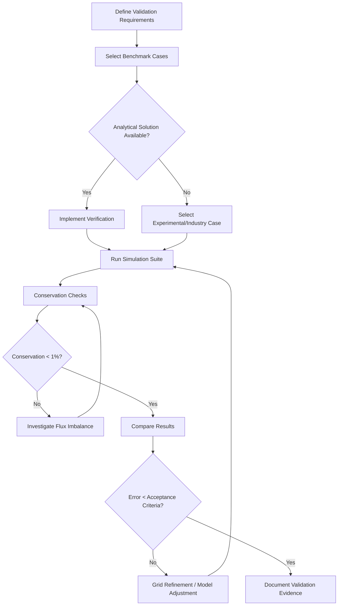
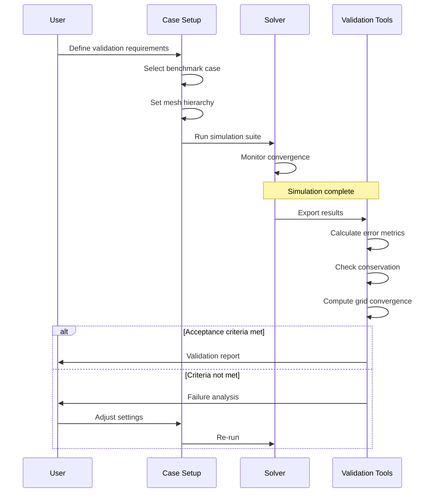

# Validation and Benchmarks

การ Validate และ Benchmark Coupled Simulations

---

## 🎯 Learning Objectives

**What you will learn:**
- Distinguish between validation (physics correctness) and verification (code correctness)
- Apply analytical solutions to verify coupled physics implementations
- Perform conservation checks for conjugate heat transfer
- Conduct systematic grid convergence studies using Richardson extrapolation
- Identify and resolve common validation pitfalls in coupled simulations

**Why this matters:**
- Coupled simulations introduce additional error sources at interfaces
- Industry applications require rigorous validation before deployment
- Regulatory standards often mandate documented verification procedures
- Failed validation leads to incorrect design decisions and safety issues

**How you will apply this:**
- Validate OpenFOAM CHT cases against analytical benchmarks
- Automate conservation checks in simulation workflows
- Perform mesh independence studies for production runs
- Document validation evidence for technical reports and publications

---

## Table of Contents

1. [Fundamental Concepts](#1-fundamental-concepts)
2. [Analytical Validation Methods](#2-analytical-validation-methods)
3. [Conservation Verification](#3-conservation-verification)
4. [Grid Convergence Studies](#4-grid-convergence-studies)
5. [Standard Benchmark Cases](#5-standard-benchmark-cases)
6. [Validation Workflow](#6-validation-workflow)
7. [Common Pitfalls and Solutions](#7-common-pitfalls-and-solutions)
8. [Acceptance Criteria](#8-acceptance-criteria)

---

## 1. Fundamental Concepts

### 1.1 Validation vs Verification

| Aspect | **Verification** | **Validation** |
|--------|-----------------|----------------|
| **Question** | Are we solving the equations correctly? | Are we solving the right equations? |
| **Focus** | Code correctness, bug-free implementation | Physical accuracy, real-world representation |
| **Method** | Method of Manufactured Solutions (MMS), analytical comparisons | Experimental data, field measurements, operational data |
| **Outcome** | Numerical error quantification | Physical model credibility |
| **Example** | Compare CHT solution to 1D conduction formula | Compare heat exchanger performance to test rig data |

**Key Insight:** "Verification answers the mathematics; validation answers the physics."

---

### 1.2 Why Coupled Physics Requires Extra Care

**Additional Error Sources in Coupled Simulations:**

1. **Interface Discretization Errors**
   - Non-matching meshes at fluid-solid interface
   - Interpolation scheme errors between regions
   - Gaps in patch coverage

2. **Convergence Coupling Errors**
   - Loose coupling may not reach true steady-state
   - Iteration tolerance interactions between solvers
   - Transient phase lag in explicit coupling

3. **Conservation Violations**
   - Flux imbalance at interfaces
   - Different time integration schemes per region
   - Round-off accumulation in multi-region calculations

**Impact:** A 1% flux imbalance at interface can propagate to >10% error in global quantities.

---

### 1.3 Validation Workflow Overview



---

## 2. Analytical Validation Methods

### 2.1 1D Steady-State Conduction (What)

**Physical Setup:**
- Solid plate of thickness L with constant thermal conductivity κ
- Boundary conditions: T(0) = T_hot, T(L) = T_cold
- No internal heat generation

**Analytical Solution:**

```
T(x) = T_hot - (T_hot - T_cold) × (x/L)
```

**Why this works:** Exact solution exists; isolates interface coupling error

---

### 2.2 Implementation in OpenFOAM (How)

**Case Setup:**

```cpp
// 0/T field file (solid region)
boundaryField
{
    left
    {
        type            fixedValue;
        value           uniform 350;  // T_hot (K)
    }
    right
    {
        type            fixedValue;
        value           uniform 300;  // T_cold (K)
    }
    // Interface with fluid region
    fluid_to_solid
    {
        type            compressible::turbulentTemperatureCoupledBaffleMixed;
        Tnbr            T;
        kappa           solidThermo;
        kappaName       none;
        value           uniform 325;  // Initial guess
    }
}
```

**Validation Code (`system/functions` or custom post-processing function):**

```cpp
// Calculate analytical solution
volScalarField x = mesh.C().component(0);
scalarField Tanalytical = Thot - (Thot - Tcold) * x / L;

// Compute error field
volScalarField error
(
    IOobject
    (
        "error",
        runTime.timeName(),
        mesh,
        IOobject::NO_READ,
        IOobject::AUTO_WRITE
    ),
    T - Tanalytical
);

// Global error metrics
scalar L2_error = sqrt(gSum(magSqr(error) * mesh.V()) / gSum(mesh.V()));
scalar Linf_error = max(mag(error)).value();

Info << "=== Validation Results ===" << nl
     << "L2 error: " << L2_error << " K" << nl
     << "L∞ error: " << Linf_error << " K" << nl
     << "Relative L2: " << (L2_error / (Thot - Tcold) * 100) << "%" << endl;
```

**Expected Results (well-resolved case):**
- L2 error: < 0.1 K
- L∞ error: < 0.5 K  
- Relative error: < 0.2%

---

### 2.3 Transient Validation: Stefan Problem

**Physical Setup:**
- Phase change front propagating through semi-infinite domain
- Analytical solution for interface position: s(t) = λ√(αt)

**Validation Approach:**

```cpp
// Compare melt front position at each time step
scalar s_analytical = lambda * sqrt(thermalDiffusivity * runTime.value());
scalar s_numerical = gSum(alpha1 * mesh.V()) / mesh.magSf().boundaryField()[meltPatch];

scalar front_error = mag(s_numerical - s_analytical) / s_analytical;
```

---

## 3. Conservation Verification

### 3.1 Heat Balance Calculation (What & Why)

**Principle:** Energy entering system must equal energy leaving plus energy stored

**Global Balance Equation:**

```
Q_in + Q_generated = Q_out + Q_stored + Q_loss
```

**Why it matters:**  
- Detects flux imbalances at interfaces
- Identifies solver convergence issues
- Quantifies numerical conservation error

---

### 3.2 Implementation (How)

**Complete Conservation Check Function:**

```cpp
// Post-processing function object: system/controlDict

functions
{
    heatBalance
    {
        type            coded;
        functionObjectLibs ("libutilityFunctionObjects.so");
        writeCode       #{
            // Get heat flux field
            surfaceScalarField heatFlux
            (
                fvc::snGrad(T) * turbulence.alphaEff()
            );

            // Sum over all boundary patches
            scalar Q_in = 0;
            scalar Q_out = 0;
            
            forAll(mesh.boundaryMesh(), patchi)
            {
                const polyPatch& pp = mesh.boundaryMesh()[patchi];
                const fvsPatchField<scalar>& hf = heatFlux.boundaryField()[patchi];
                const scalarField& magSf = mesh.magSf().boundaryField()[patchi];
                
                scalar patchQ = gSum(hf * magSf);
                
                if (patchQ > 0)
                    Q_in += patchQ;
                else
                    Q_out += patchQ;
                    
                Info << "Patch " << pp.name() << ": Q = " << patchQ << " W" << endl;
            }
            
            // Calculate imbalance
            scalar Q_total = Q_in + Q_out;  // Should be zero for steady state
            scalar imbalance = mag(Q_total) / max(Q_in, SMALL);
            
            Info << nl << "=== Heat Balance ===" << nl
                 << "Q_in: " << Q_in << " W" << nl
                 << "Q_out: " << Q_out << " W" << nl
                 << "Net: " << Q_total << " W" << nl
                 << "Imbalance: " << imbalance * 100 << "%" << nl;
            
            // Write to file for time history
            OFstream balanceFile
            (
                runTime.path()/"heatBalance.dat",
                runTime.writeFormat(),
                runTime.writeCompression()
            );
            balanceFile << runTime.timeName() << tab << Q_in << tab << Q_out 
                       << tab << Q_total << tab << imbalance << endl;
        #};
    }
}
```

---

### 3.3 Interface Flux Matching

**Check that fluid and solid regions exchange equal flux:**

```cpp
// Get both sides of interface
const surfaceScalarField& fluidFlux = 
    heatFlux.boundaryField()[fluidMesh.boundaryMesh().findPatchID("fluid_to_solid")];
const surfaceScalarField& solidFlux = 
    heatFlux.boundaryField()[solidMesh.boundaryMesh().findPatchID("solid_to_fluid")];

// Should be equal and opposite
scalar fluxMismatch = gSum(fluidFlux * mesh.magSf()) + gSum(solidFlux * mesh.magSf());

Info << "Interface flux mismatch: " << fluxMismatch << " W" << nl
     << "Relative error: " << (mag(fluxMismatch) / max(mag(gSum(fluidFlux)), SMALL) * 100) << "%" << endl;
```

**Acceptance criterion:** Flux mismatch < 0.1% of total heat transfer

---

## 4. Grid Convergence Studies

### 4.1 Richardson Extrapolation (Theory)

**What:** Systematic method to estimate discretization error and order of accuracy

**Key Concepts:**
- Run same case on 3+ systematically refined meshes
- Calculate convergence ratio: R = (f₂ - f₁) / (f₃ - f₂)
- Verify consistency: 0 < R < 1 for monotonic convergence
- Estimate grid-independent solution via extrapolation

**Why required:**  
- Proves mesh-independent results
- Quantifies numerical uncertainty
- Required for journal publication and industry standards

---

### 4.2 Implementation Workflow

**Step 1: Create Mesh Hierarchy**

```bash
# Mesh refinement levels
refinementLevels=(0 1 2)  # coarse, medium, fine
meshNames=("coarse" "medium" "fine")

# Generate blockMeshDict templates
for i in "${!refinementLevels[@]}"; do
    level=${refinementLevels[$i]}
    name=${meshNames[$i]}
    
    # Create case directory
    cp -r case_base case_$name
    
    # Refine mesh in all directions
    sed -i "s/\(blocks.*hex (\s*\([^)]*\)\s*\).*/\1 ($((2**level)) $((2**level)) $((2**level)) simpleGrading (1 1 1))/" \
        case_$name/system/blockMeshDict
    
    # Run mesh generation
    cd case_$name
    blockMesh
    cd ..
done
```

---

### 4.3 Automated Convergence Script

**`checkConvergence.py`:**

```python
#!/usr/bin/env python3
import numpy as np
import pandas as pd
from pathlib import Path

def read_probe_data(case_dir, probe_file="postProcessing/probes/0/probe.csv"):
    """Read time-series probe data"""
    data = pd.read_csv(Path(case_dir) / probe_file, skiprows=5)
    # Return final time value (steady state)
    return data.iloc[-1, 1:]  # Skip time column

def richardson_extrapolation(f1, f2, f3, r1=2, r2=2):
    """
    Calculate Richardson extrapolation and GCI
    
    Parameters:
    -----------
    f1, f2, f3 : float
        Solutions on fine, medium, coarse grids
    r1, r2 : float
        Refinement ratios (grid2/grid1, grid3/grid2)
    
    Returns:
    --------
    dict : Convergence metrics
    """
    # Order of accuracy (assume second order)
    p = 2
    
    # Refinement ratios
    h1 = 1.0
    h2 = 1.0 / r1
    h3 = h2 / r2
    
    # Convergence ratio
    R = (f3 - f2) / (f2 - f1) if (f2 - f1) != 0 else np.nan
    
    # Check monotonic convergence
    if 0 < R < 1:
        # Extrapolated value
        f_ext = f1 + (f1 - f2) / (r1**p - 1)
        
        # Grid convergence indices
        GCI_fine = 1.25 * abs((f2 - f1) / (r1**p - 1)) / abs(f1)
        GCI_coarse = 1.25 * abs((f3 - f2) / (r2**p - 1)) / abs(f2)
        
        # Asymptotic range check
        asymptotic = (GCI_coarse / (r1**p * GCI_fine)) if GCI_fine > 0 else np.nan
        
        convergence = "monotonic"
    else:
        f_ext = np.nan
        GCI_fine = np.nan
        GCI_coarse = np.nan
        asymptotic = np.nan
        convergence = "oscillatory" if R < 0 else "divergent"
    
    return {
        'coarse': f3,
        'medium': f2,
        'fine': f1,
        'extrapolated': f_ext,
        'convergence_ratio': R,
        'convergence_type': convergence,
        'GCI_fine': GCI_fine,
        'GCI_coarse': GCI_coarse,
        'asymptotic_ratio': asymptotic
    }

# Main execution
if __name__ == "__main__":
    cases = ["case_coarse", "case_medium", "case_fine"]
    probes_data = [read_probe_data(c) for c in cases]
    
    print("=" * 80)
    print("GRID CONVERGENCE STUDY RESULTS")
    print("=" * 80)
    print(f"{'Probe':<15} {'Coarse':<12} {'Medium':<12} {'Fine':<12} {'GCI_fine':<12} {'Status':<15}")
    print("-" * 80)
    
    for i, (f3, f2, f1) in enumerate(zip(*probes_data)):
        result = richardson_extrapolation(f1, f2, f3)
        
        status = "✓ Converged" if result['convergence_type'] == "monotonic" else "⚠ Check mesh"
        
        print(f"Probe_{i:<10} {f3:<12.4f} {f2:<12.4f} {f1:<12.4f} "
              f"{result['GCI_fine']*100:<12.4f} {status:<15}")
    
    print("-" * 80)
    print("\nAcceptance criteria:")
    print("  - Monotonic convergence (0 < R < 1)")
    print("  - GCI_fine < 1% for engineering accuracy")
    print("  - Asymptotic ratio ≈ 1")
```

---

### 4.4 Mesh Size Guidelines

| Application | Minimum Cells | Recommended | Typical GCI Target |
|-------------|---------------|-------------|-------------------|
| 2D CHT (simple) | 10k | 50k-100k | < 2% |
| 3D CHT (industry) | 500k | 2M-5M | < 1% |
| FSI (flexible) | 200k | 1M-3M | < 1.5% |
| Conjugate turbulence | 1M | 5M-10M | < 0.5% |

---

## 5. Standard Benchmark Cases

### 5.1 OpenFOAM Tutorial Cases

**Access and Navigation:**

```bash
# Navigate to tutorials
cd $FOAM_TUTORIALS/heatTransfer/cht

# Available CHT validation cases:
ls -1
# 1. multiRegionFoam/heatExchanger/      # Cross-flow heat exchanger
# 2. multiRegionFoam/fluidExchanger/     # Industry conjugate case
# 3. conjugateHeatFoam/coolingSphere/    # Analytical validation
# 4. conjugateHeatPimpleFoam/CHTUnitTest # Interface flux test
```

---

### 5.2 Benchmark Catalog

| **Case Name** | **OpenFOAM Path** | **Physics** | **Validation Type** | **Difficulty** |
|---------------|-------------------|-------------|---------------------|----------------|
| **1D Conduction** | `cht/coolingSphere` | Steady conduction | Analytical solution | Beginner |
| **Heated Backstep** | `heatTransfer/cht/backstep` | Turbulent CHT | Experimental data | Intermediate |
| **Heat Exchanger** | `cht/multiRegionFoam/heatExchanger` | Cross-flow CHT | Industrial benchmark | Intermediate |
| **Electronics Cooling** | `cht/electronic` | Conjugate + PCB | Industry data | Advanced |
| **FSI Cylinder** | `fluidSolidInteraction/flagInFlow` | Vortex-induced vibration | Experimental VIV | Advanced |
| **Turbine Blade** | `compressible/rhoPimpleFoam/turbineSBLI` | Conjugate heat transfer | Aeronautical data | Expert |

---

### 5.3 Detailed Benchmark: Heat Exchanger

**Case Description:**
- Hot fluid channel (water, 350 K) crossing cold fluid channel (air, 300 K)
- Solid separating wall (aluminum, κ = 237 W/m·K)
- Steady-state turbulent flow (k-ω SST)

**Validation Metrics:**

```cpp
// Monitor points at strategic locations
functions
{
    monitors
    {
        type            sets;
        functionObjectLibs ("libsampling.so");
        
        // Cross-section temperature profile
        crossSectionProfile
        {
            type        uniform;
            axis        y;
            start       (0.05 0 0.05);
            end         (0.05 0.1 0.05);
            nPoints     100;
            
            fields      (T alpha.water);
        }
        
        // Heat transfer rate at interface
        interfaceFlux
        {
            type        patchProbes;
            patch       fluid_to_solid;
            probeLocations
            (
                (0.025 0.05 0.025)
                (0.025 0.05 0.05)
                (0.025 0.05 0.075)
            );
            
            fields      (T heatFlux);
        }
    }
}
```

**Expected Results (reference values):**
- Overall heat transfer: Q ≈ 1250 ± 25 W
- Max solid temperature: T_max ≈ 338 K
- Interface flux match: ΔQ < 0.5%

---

### 5.4 Community Benchmarks

**ERCOFTAC Classic Collection:**
- Backward-facing step with CHT
- Open resource at: https://ercoftac.org/
- Reference data for turbulence model validation

**NPARC Alliance:**
- CFD validation database
- NASA-sponsored benchmark cases
- Includes experimental uncertainty estimates

---

## 6. Validation Workflow

### 6.1 End-to-End Process



---

### 6.2 Validation Checklist

**Pre-Simulation:**
- [ ] Benchmark case selected and documented
- [ ] Analytical/experimental reference data available
- [ ] Mesh independence plan defined
- [ ] Acceptance criteria specified
- [ ] Function objects configured

**During Simulation:**
- [ ] Conservation monitored at each time step
- [ ] Interface fluxes checked for balance
- [ ] Residuals converged below 1e-6
- [ ] Monitored points stabilized

**Post-Simulation:**
- [ ] Error metrics computed (L2, L∞)
- [ ] Grid convergence verified
- [ ] Conservation < 1%
- [ ] Results documented
- [ ] Comparison with reference data

**Documentation Deliverables:**
- Validation report with plots
- Grid convergence table
- Conservation history
- Benchmark comparison summary

---

## 7. Common Pitfalls and Solutions

### 7.1 Interface Issues

| **Problem** | **Symptom** | **Root Cause** | **Solution** |
|-------------|-------------|----------------|--------------|
| Flux imbalance | Q_in ≠ Q_out | Non-matching face areas | Use `mappedPatch` with consistent sampling |
| Temperature jump | Discontinuity at interface | Incorrect `kappa` specification | Verify `turbulentTemperatureCoupledBaffleMixed` settings |
| Negative heat flux | Cooling where heating expected | Wrong `Tnbr` reference | Check boundary neighbor field definition |
| Oscillatory coupling | Residuals won't converge | Loose coupling under-relaxation | Increase `outerCorrectors` or reduce `relaxationFactors` |

---

### 7.2 Convergence Pitfalls

**Problem:** Apparent convergence but wrong answer

**Diagnosis:**
```cpp
// Check for false convergence
scalar maxResidual = max(solverPerformance.initialResidual());
scalar temperatureChange = max(mag(T - T.oldTime()));

if (maxResidual < 1e-6 && temperatureChange < 1e-4) {
    Info << "⚠ Warning: Check physical convergence, not just residuals" << endl;
    Info << "   Verify integrated quantities have stabilized" << endl;
}
```

**Solution:** Monitor global quantities, not just residuals

---

### 7.3 Mesh Quality Issues

**Problem:** Validation fails despite correct setup

**Common mesh errors:**
1. **High non-orthogonality** (> 70°) at interface
   - Check: `checkMesh -allGeometry -allTopology`
   - Fix: Improve `blockMesh` grading or use `snappyHexMesh` refinement

2. **Aspect ratio** > 100 in boundary layers
   - Causes: Poor `boundaryLayer` meshing
   - Fix: Limit expansion ratio to 1.2

3. **Hanging nodes** at non-conformal interfaces
   - Symptom: Spurious oscillations in gradient
   - Fix: Use `mappedWallPatch` with interpolation

---

## 8. Acceptance Criteria

### 8.1 Quantitative Criteria

| **Metric** | **Excellent** | **Acceptable** | **Needs Improvement** |
|------------|---------------|----------------|----------------------|
| **L2 Error** | < 0.5% | 0.5% - 2% | > 2% |
| **L∞ Error** | < 1% | 1% - 5% | > 5% |
| **Conservation Imbalance** | < 0.1% | 0.1% - 1% | > 1% |
| **Interface Flux Mismatch** | < 0.1% | 0.1% - 0.5% | > 0.5% |
| **Grid Convergence (GCI)** | < 1% | 1% - 3% | > 3% |
| **Asymptotic Range** | 0.9 - 1.1 | 0.8 - 1.2 | Outside [0.8, 1.2] |

---

### 8.2 Qualitative Criteria

**Required for Validation Approval:**
- Physical trends match expectations (monotonic temperature gradients)
- No unphysical oscillations near interfaces
- Smooth transition between regions
- Symmetry preserved in symmetric problems
- Boundary conditions correctly imposed

**Red Flags Requiring Investigation:**
- Sudden jumps in field values
- Negative absolute temperatures in near-zero regions
- Reverse heat flow (cold to hot without external work)
- Non-monotonic convergence in grid study

---

### 8.3 Documentation Requirements

**Minimum Validation Report Contents:**

```markdown
# Validation Report: [Case Name]

## Executive Summary
- Date: [YYYY-MM-DD]
- OpenFOAM Version: [X.X]
- Case Type: [CHT / FSI / Conjugate]
- Validation Status: [PASS / FAIL / CONDITIONAL]

## Benchmark Description
- Reference: [Paper / Experimental setup]
- Geometry: [Dimensions, key features]
- Boundary Conditions: [Table of BCs]

## Results Summary
| Metric | Value | Acceptance Criteria | Status |
|--------|-------|-------------------|--------|
| L2 Error | [X.X%] | < 2% | ✓/✗ |
| Conservation | [X.X%] | < 1% | ✓/✗ |
| GCI | [X.X%] | < 3% | ✓/✗ |

## Grid Convergence
[Include Richardson table and convergence plot]

## Discussion
- Identified discrepancies: [Explain]
- Sensitivity analysis: [Parameters tested]
- Recommended improvements: [Future work]

## Conclusion
[Validation statement with confidence level]
```

---

## Key Takeaways

1. **Validation is non-negotiable** for coupled physics — always verify against analytical solutions or experimental data before trusting results

2. **Conservation checks catch hidden errors** that residuals miss — implement interface flux monitoring in every coupled simulation

3. **Grid convergence is required**, not optional — use Richardson extrapolation to quantify numerical uncertainty

4. **Document everything** — validation evidence is required for technical credibility and regulatory compliance

5. **Start simple** — verify 1D conduction before attempting 3D turbulent CHT

---

## 🧠 Concept Check

<details>
<summary><b>1. What is the difference between verification and validation?</b></summary>

**Verification:** "Are we solving the equations correctly?"
- Code correctness, bug detection
- Method: Analytical solutions, MMS
- Focus: Numerical error

**Validation:** "Are we solving the right equations?"
- Physical accuracy, real-world relevance  
- Method: Experimental data, field measurements
- Focus: Model credibility

**Both are required** — verification first, then validation
</details>

<details>
<summary><b>2. Why do coupled simulations need extra validation beyond single-physics cases?</b></summary>

**Additional error sources:**
- Interface discretization (non-matching meshes)
- Flux conservation at region boundaries
- Coupling convergence (loose vs tight)
- Multiple time integration schemes

**Impact:** A 1% interface flux error can amplify to >10% global error
</details>

<details>
<summary><b>3. How do you perform a conservation check in a CHT simulation?</b></summary>

**Heat balance calculation:**
```cpp
scalar Qin = gSum(heatFlux.boundaryField()[inletPatch] * mesh.magSf());
scalar Qout = gSum(heatFlux.boundaryField()[outletPatch] * mesh.magSf());
scalar imbalance = mag(Qin + Qout) / max(mag(Qin), SMALL);
```

**Acceptance:** Imbalance < 1% for steady-state
</details>

<details>
<summary><b>4. What is Richardson extrapolation and when is it required?</b></summary>

**What:** Systematic method to estimate discretization error and grid-independent solution

**When required:**
- Journal publications
- Industry applications
- Regulatory submissions
- Any high-stakes simulation

**Process:** Run 3+ refined meshes, calculate GCI, verify asymptotic range
</details>

<details>
<summary><b>5. What are the acceptance criteria for a validated coupled simulation?</b></summary>

**Quantitative:**
- L2 error < 2%
- Conservation imbalance < 1%
- Grid convergence (GCI) < 3%
- Interface flux mismatch < 0.5%

**Qualitative:**
- Physical trends correct
- No unphysical oscillations
- Symmetry preserved
- Smooth interface transitions
</details>

---

## 📖 เอกสารที่เกี่ยวข้อง

**Previous Topics:**
- **ภาพรวม:** [00_Overview.md](00_Overview.md) — Coupled physics landscape
- **Fundamentals:** [01_Coupled_Physics_Fundamentals.md](01_Coupled_Physics_Fundamentals.md) — Mathematical foundations
- **CHT Implementation:** [02_Conjugate_Heat_Transfer.md](02_Conjugate_Heat_Transfer.md) — Heat transfer setup
- **FSI:** [03_Fluid_Structure_Interaction.md](03_Fluid_Structure_Interaction.md) — Structural coupling

**Next Steps:**
- **Exercises:** [07_Exercises.md](07_Exercises.md) — Hands-on validation practice

**External Resources:**
- [OpenFOAM CHT Tutorials](https://github.com/OpenFOAM/OpenFOAM-10/tree/master/tutorials/heatTransfer/cht)
- [ERCOFTAC Validation Database](https://ercoftac.org/)
- [ASME V&V Standard](https://www.asme.org/products/standards/standard-for-verification-and-validation)