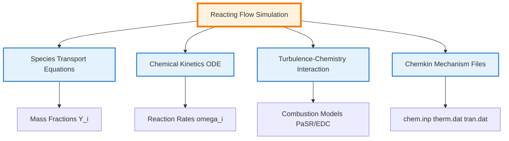

# Module 06-03: Reacting Flows in OpenFOAM

> [!INFO] Overview
> This module provides a comprehensive technical foundation for simulating **combustion** and **chemical reactions** in OpenFOAM, covering species transport, stiff ODE solvers, turbulence-chemistry interaction, and Chemkin mechanism integration.

---

## Module Scope

This module addresses four fundamental pillars of reacting flow simulation:

| Pillar | Description |
|--------|-------------|
| **Species Transport** | Conservation equations for mass fractions with diffusion models |
| **Chemical Kinetics** | Stiff ODE systems via `chemistryModel` with implicit solvers |
| **Turbulence-Chemistry Interaction** | PaSR and EDC combustion models for turbulent flames |
| **Chemkin Integration** | Parsing reaction mechanisms and thermodynamic data |


> **Figure 1:** แผนภาพแสดงโครงสร้างหลักสี่ประการของการจำลองการไหลแบบมีปฏิกิริยาเคมีใน OpenFOAM ซึ่งครอบคลุมถึงสมการการขนส่งสปีชีส์ จลนพลศาสตร์เคมี ปฏิสัมพันธ์ระหว่างความปั่นป่วนและเคมี และการบูรณาการข้อมูลกลไกปฏิกิริยาจากไฟล์ Chemkin

---

## Fundamental Governing Equations

### Conservation Laws for Reacting Flows

Reacting flow simulations extend the standard Navier-Stokes equations with additional conservation laws for **chemical species** and **energy**:

**Continuity Equation:**
$$\frac{\partial \rho}{\partial t} + \nabla \cdot (\rho \mathbf{u}) = 0$$

**Momentum Equation:**
$$\rho \frac{\partial \mathbf{u}}{\partial t} + \rho (\mathbf{u} \cdot \nabla) \mathbf{u} = -\nabla p + \nabla \cdot \boldsymbol{\tau} + \rho \mathbf{g}$$

**Species Conservation (for each species $i$):**
$$\frac{\partial (\rho Y_i)}{\partial t} + \nabla \cdot (\rho \mathbf{u} Y_i) = -\nabla \cdot \mathbf{J}_i + \dot{\omega}_i \quad \text{for } i = 1, 2, \ldots, N_s$$

**Energy Equation:**
$$\frac{\partial (\rho h)}{\partial t} + \nabla \cdot (\rho \mathbf{u} h) = \frac{Dp}{Dt} + \nabla \cdot (\alpha \nabla h) + \dot{q}_c$$

**Variable Definitions:**

| Symbol | Description | Units |
|--------|-------------|-------|
| $\rho$ | Density | kg/m³ |
| $\mathbf{u}$ | Velocity vector | m/s |
| $p$ | Pressure | Pa |
| $Y_i$ | Mass fraction of species $i$ | [-] |
| $\mathbf{J}_i$ | Diffusive flux of species $i$ | kg/(m²·s) |
| $\dot{\omega}_i$ | Chemical production rate of species $i$ | kg/(m³·s) |
| $h$ | Specific enthalpy | J/kg |
| $\dot{q}_c$ | Chemical heat release | W/m³ |

---

## Species Transport and Diffusion Models

### The Species Transport Equation

The transport of chemical species is governed by the **convection-diffusion-reaction** equation:

$$\frac{\partial (\rho Y_i)}{\partial t} + \nabla \cdot (\rho \mathbf{u} Y_i) = -\nabla \cdot \mathbf{J}_i + R_i$$

**Physical Components:**

| Term | Mathematical Form | Physical Meaning |
|------|-------------------|------------------|
| **Temporal** | $\frac{\partial (\rho Y_i)}{\partial t}$ | Rate of change of species mass |
| **Convection** | $\nabla \cdot (\rho \mathbf{u} Y_i)$ | Transport due to bulk fluid motion |
| **Diffusion** | $-\nabla \cdot \mathbf{J}_i$ | Mass flux due to concentration gradients |
| **Reaction Source** | $R_i$ | Net production/consumption from chemistry |

### Diffusion Models

OpenFOAM supports multiple diffusion models with increasing complexity:

#### **Fick's Law (Binary Diffusion)**

The simplest model for binary mixtures:

$$\mathbf{J}_i = -\rho D_i \nabla Y_i$$

where $D_i$ is the effective diffusion coefficient of species $i$ [m²/s].

#### **Multi-component Diffusion (Maxwell-Stefan)**

For accurate multi-species systems, the **Maxwell-Stefan equations** relate gradients to mole fractions:

$$\nabla X_i = \sum_{j \neq i} \frac{X_i X_j}{D_{ij}} \left( \frac{\mathbf{J}_j}{\rho_j} - \frac{\mathbf{J}_i}{\rho_i} \right)$$

**Additional Variables:**
- $X_i$: Mole fraction of species $i$ [mol/mol]
- $D_{ij}$: Binary diffusion coefficient for pair $i$-$j$ [m²/s]
- $\rho_i$: Partial density of species $i$ [kg/m³]

OpenFOAM approximates this through:
- **Mixture-averaged models**
- **Constant coefficients**

#### **Soret/Dufour Effects**

**Thermal diffusion (Soret)** and **diffusion-thermo (Dufour)** couple species and temperature gradients:

$$\mathbf{J}_i = -\rho D_i \nabla Y_i - D_i^T \frac{\nabla T}{T}$$

**Where:**
- $D_i^T$: Soret coefficient [kg/(m·s)]
- $T$: Temperature [K]

> [!WARNING] Importance of Soret Effect
> The Soret effect is often **neglected** in general combustion but is **critical** for hydrogen-enriched flames, where it significantly affects flame speed and extinction limits.

### OpenFOAM Implementation

```cpp
// Finite volume matrix for species transport equation
// สมการขนส่งสปีชีส์แบบ Finite Volume Method
fvScalarMatrix YiEqn
(
    // Temporal derivative term: ∂(ρYi)/∂t
    // พจน์อนุพัทธ์ตามเวลาของความเข้มของสปีชีส์
    fvm::ddt(rho, Yi)
    
    // Convection term: ∇·(ρuYi)
    // พจน์พาพลศาสตร์จากการเคลื่อนที่ของของไหล
  + fvm::div(phi, Yi)
    
    // Diffusion term: -∇·(Ji) with turbulent + molecular diffusivity
    // พจน์การแพร่ ประกอบด้วยความหนืดตุรกีและค่าสัมประสิทธิ์การแพร่โมเลกุล
  - fvm::laplacian(turbulence->mut()/Sct + rho*Di, Yi)
    
    // Equals: reaction source term and optional sources
    // เท่ากับพจน์แหล่งกำเนิดจากปฏิกิริยาเคมีและแหล่งกำเนิดเสริม
 ==
    chemistry->RR(i)        // Reaction source term [kg/(m³·s)]
                            // อัตราการเกิดปฏิกิริยาเคมีของสปีชีส์ i
  + fvOptions(rho, Yi)      // Optional source terms from fvOptions
                            // แหล่งกำเนิดเสริมจาก framework fvOptions
);
```

---

#### 🔬 คำอธิบายภาษาไทย (Thai Explanation)

**แหล่งที่มาของโค้ด (Source):**
📂 Source: `src/finiteVolume/lnInclude/fvScalarMatrix.C`

**คำอธิบาย (Explanation):**
โค้ดนี้แสดงการสร้างสมการเมทริกซ์ finite volume สำหรับแก้สมการขนส่งสปีชีส์ใน OpenFOAM ซึ่งประกอบด้วยสี่พจน์หลัก:

1. **Temporal Term (`fvm::ddt`)**: คำนวณการเปลี่ยนแปลงของความหนาแน่นของสปีชีส์ตามเวลา
2. **Convection Term (`fvm::div`)**: คำนวณการพาพลศาสตร์ของสปีชีส์โดยการไหลของของไหล
3. **Diffusion Term (`fvm::laplacian`)**: คำนวณการแพร่ของสปีชีส์ที่เกิดจาก gradient ของความเข้มของสปีชีส์ โดยรวมทั้งการแพร่แบบโมเลกุลและการแพร่แบบตุรกี
4. **Source Term**: พจน์แหล่งกำเนิดจากปฏิกิริยาเคมี (`chemistry->RR(i)`) และแหล่งกำเนิดเสริม (`fvOptions`)

**แนวคิดสำคัญ (Key Concepts):**
- **`fvm` (finite volume method)**: Namespace สำหรับ discretization แบบ implicit ซึ่งเหมาะสำหรับการแก้สมการที่เสถียร
- **`turbulence->mut()/Sct`**: คำนวณ turbulent diffusivity จาก turbulent viscosity (mut) หารด้วย Schmidt number ตุรกี (Sct ≈ 0.7)
- **`rho*Di`**: ค่าสัมประสิทธิ์การแพร่โมเลกุลของสปีชีส์ i
- **`chemistry->RR(i)`**: Reaction rate ของสปีชีส์ i ที่คำนวณจาก chemistry solver

**Component Meanings in OpenFOAM:**

| Code Component | OpenFOAM Meaning | Typical Values |
|----------------|------------------|----------------|
| `turbulence->mut()/Sct` | Turbulent diffusivity | `Sct ≈ 0.7` |
| `rho*Di` | Molecular diffusion coefficient | - |
| `chemistry->RR(i)` | Reaction source term | - |

---

## Chemical Kinetics and Stiff ODE Solvers

### The Stiffness Challenge

Chemical reactions in combustion occur over **time scales from microseconds to milliseconds**, creating **stiff ODE systems** that challenge explicit integration methods.

### Reaction Rate Equations

The reaction source term $R_i$ originates from a system of **ordinary differential equations** describing species concentration evolution:

$$\frac{\mathrm{d} Y_i}{\mathrm{d} t} = \frac{R_i}{\rho} = \frac{1}{\rho} \sum_{r=1}^{N_r} \nu_{i,r} \dot{\omega}_r$$

**Reaction rates follow the Arrhenius law:**

$$\dot{\omega}_r = k_r \prod_{j} [C_j]^{\nu'_{j,r}}, \quad k_r = A_r T^{\beta_r} e^{-E_{a,r}/(R T)}$$

**Parameter Definitions:**

| Symbol | Description | Units |
|--------|-------------|-------|
| $A_r$ | Pre-exponential factor | varies |
| $\beta_r$ | Temperature exponent | [-] |
| $E_{a,r}$ | Activation energy | J/mol |
| $[C_j]$ | Molar concentration of species $j$ | mol/m³ |

### ODE Solver Strategies

OpenFOAM employs **implicit** or **semi-implicit** ODE solvers:

| Solver | Type | Special Features |
|--------|------|------------------|
| **SEulex** | Extrapolation-based | Automatic order and step-size control |
| **Rosenbrock** | Linearly implicit Runge-Kutta | Embedded error estimation |
| **CVODE** | Variable step/order (external) | From SUNDIALS library |

The ODE system is defined as:

$$\frac{\mathrm{d} \mathbf{Y}}{\mathrm{d} t} = \mathbf{f}(\mathbf{Y}, T, p), \quad \mathbf{Y} = [Y_1, Y_2, \dots, Y_{N_s}]$$

where $\mathbf{f}$ encompasses all reaction rates and thermodynamic coupling.

### ChemistryModel Architecture

The base `chemistryModel` class (in `src/thermophysicalModels/chemistryModel/`) defines the interface:

```cpp
// Base class for chemistry models in OpenFOAM
// คลาสฐานสำหรับรูปแบบจำลองเคมีใน OpenFOAM
class chemistryModel
{
public:
    // Solve chemistry for a time step deltaT
    // แก้สมการเคมีสำหรับช่วงเวลา deltaT
    virtual scalar solve(scalar deltaT) = 0;

    // Return reaction rates RR[i] in kg/(m³·s) for species i
    // คืนค่าอัตราการเกิดปฏิกิริยาของสปีชีส์ i
    virtual const volScalarField::Internal& RR(const label i) const = 0;

    // Access species list from the chemical mechanism
    // เข้าถึงรายชื่อสปีชีส์จากกลไกเคมี
    const speciesTable& species() const;
    
    // Access reaction list with thermodynamic data
    // เข้าถึงรายการปฏิกิริยาพร้อมข้อมูลเทอร์โมไดนามิก
    const ReactionList<ReactionThermo>& reactions() const;
};
```

---

#### 🔬 คำอธิบายภาษาไทย (Thai Explanation)

**แหล่งที่มาของโค้ด (Source):**
📂 Source: `src/thermophysicalModels/chemistryModel/chemistryModel/chemistryModel.H`

**คำอธิบาย (Explanation):**
คลาส `chemistryModel` เป็น abstract base class ที่กำหนด interface หลักสำหรับการแก้สมการเคมีใน OpenFOAM คลาสนี้ทำหน้าที่:

1. **การแก้สมการเคมี**: เมธอด `solve()` เป็น pure virtual function ที่ subclass ต้อง implement สำหรับแก้ระบบ ODE ของปฏิกิริยาเคมี
2. **การคืนค่าอัตราปฏิกิริยา**: เมธอด `RR()` คืนค่า reaction rate ของแต่ละสปีชีส์ในหน่วย kg/(m³·s)
3. **การเข้าถึงข้อมูลกลไกเคมี**: เมธอด `species()` และ `reactions()` ให้เข้าถึงข้อมูลเกี่ยวกับสปีชีส์และปฏิกิริยาที่ถูกอ่านจากไฟล์ Chemkin

**แนวคิดสำคัญ (Key Concepts):**
- **Virtual Function**: เมธอด `solve()` และ `RR()` เป็น virtual function ที่ให้ subclass นำไป implement แบบเฉพาะสำหรับแต่ละ solver (SEulex, Rosenbrock, CVODE)
- **Operator-Splitting**: การแก้สมการเคมีแยกจากสมการฟลูอิดดินามิกส์ โดยถือว่าความดันและอุณหภูมิคงที่ระหว่างการแก้ chemistry
- **Reaction Rates**: ค่าที่คืนจาก `RR(i)` จะถูกใช้เป็น source term ในสมการขนส่งสปีชีส์
- **Species Table**: ตารางข้อมูลสปีชีส์ที่ใช้ map ชื่อสปีชีส์กับ index ในระบบ

**Operator-splitting** is employed: chemical ODEs are solved separately in each cell, assuming constant pressure and temperature during the flow dynamics timestep.

### Solver Configuration

```cpp
// Chemistry solver configuration in constant/chemistryProperties
// การตั้งค่า chemistry solver ในไฟล์ constant/chemistryProperties
chemistryType
{
    solver          SEulex;      // Solver type: SEulex, Rosenbrock, or CVODE
                                // ประเภท solver: SEulex, Rosenbrock, หรือ CVODE
    tolerance       1e-6;        // Absolute tolerance for species convergence
                                // ค่าความคลาดเคลื่อนสัมบูรณ์สำหรับการลู่เข้าของสปีชีส์
    relTol          0.01;        // Relative tolerance (1%)
                                // ค่าความคลาดเคลื่อนสัมพัทธ์ (1%)
}
```

---

#### 🔬 คำอธิบายภาษาไทย (Thai Explanation)

**แหล่งที่มาของโค้ด (Source):**
📂 Source: `src/thermophysicalModels/chemistryModel/chemistryModel/chemistryModel.C`

**คำอธิบาย (Explanation):**
การตั้งค่า chemistry solver ใน OpenFOAM กำหนดวิธีการแก้ระบบ ODE แบบ stiff ที่เกิดจากปฏิกิริยาเคมี:

1. **Solver Selection**: เลือก solver ที่เหมาะสมกับปัญหา:
   - **SEulex**: Extrapolation solver ที่ปรับอันดับและขนาด time step อัตโนมัติ เหมาะกับปัญหา stiff สูง
   - **Rosenbrock**: Linearly implicit Runge-Kutta solver ที่มีระบบประเมินความคลาดเคลื่อน
   - **CVODE**: Solver จาก SUNDIALS library ที่รองรับหลายวิธีการ

2. **Tolerance Control**:
   - **tolerance**: ค่า absolute tolerance สำหรับการคำนวณความเข้มของสปีชีส์ (1e-6 kg/kg)
   - **relTol**: ค่า relative tolerance ที่อนุญาตให้มีความคลาดเคลื่อน 1% จากค่าเริ่มต้น

**แนวคิดสำคัญ (Key Concepts):**
- **Stiff ODE System**: ปฏิกิริยาเคมีมี time scale ตั้งแต่ไมโครวินาทีถึงมิลลิวินาที ทำให้ต้องใช้ implicit solver
- **Adaptive Time Stepping**: Solver ปรับขนาด time step อัตโนมัติตามความเร็วของปฏิกิริยา
- **Convergence Criteria**: การลู่เข้าถือว่าสำเร็จเมื่อความคลาดเคลื่อนต่ำกว่าทั้ง absolute และ relative tolerance
- **Computational Cost**: การแก้ chemistry อาจใช้เวลา 70-90% ของเวลาคำนวณทั้งหมด

**Algorithm Flow: Chemical Integration**

1. **Preprocessing**: Load chemical mechanism from Chemkin files
2. **Per Cell Integration**:
   - Isolate ODE system for each cell
   - Set initial conditions (Y, T, p)
   - Solve with selected ODE solver
3. **Post-processing**: Calculate reaction rates RR[i]
4. **Coupling**: Return values to CFD solver

---

## Turbulence-Chemistry Interaction: PaSR vs EDC

### The Two-Environment Approach

Both **Partially Stirred Reactor (PaSR)** and **Eddy Dissipation Concept (EDC)** models use a **two-environment** approach:

| Component | Description |
|-----------|-------------|
| **Fine-structures** | Small regions with intensive mixing where reactions occur |
| **Surrounding fluid** | Bulk fluid exchanging mass and energy with fine-structures |

The **overall reaction rate** is controlled by a **time-scale ratio**:

$$R_i = \chi \cdot R_i^{\text{chem}}(Y_i^*, T^*)$$

**Variables:**
- $\chi$: Reaction fraction
- $Y_i^*$: Fine-structure concentration
- $T^*$: Fine-structure temperature

### PaSR (Partially Stirred Reactor)

PaSR treats each cell as a **well-mixed reactor** with residence time $\tau_{\text{res}}$:

$$\chi_{\text{PaSR}} = \frac{\tau_{\text{chem}}}{\tau_{\text{chem}} + \tau_{\text{mix}}}$$

**Variables:**
- $\tau_{\text{chem}}$: Chemical time scale (from reaction rates)
- $\tau_{\text{mix}}$: Mixing time scale (from turbulence, e.g., $k/\varepsilon$)

The fine-structure state is obtained by solving chemical ODEs over residence time $\tau_{\text{res}}$.

**OpenFOAM Implementation:**

```cpp
// PaSR combustion model correction step
// ขั้นตอนการแก้ไขของรูปแบบจำลองการเผาไหม้ PaSR
void PaSR<ReactionThermo>::correct()
{
    // Calculate mixing time scale from turbulence
    // คำนวณมาตราส่วนเวลาการผสมจากความปั่นป่วน
    tmp<volScalarField> ttmix = turbulenceTimeScale();
    const volScalarField& tmix = ttmix();

    // Calculate chemical time scale from reaction rates
    // คำนวณมาตราส่วนเวลาเคมีจากอัตราปฏิกิริยา
    volScalarField tchem = chemistryTimeScale();

    // Calculate reaction fraction (kappa) as time scale ratio
    // คำนวณสัดส่วนปฏิกิริยา (kappa) จากอัตราส่วนมาตราส่วนเวลา
    volScalarField kappa = tchem / (tchem + tmix);

    // Solve chemistry in fine structures for scaled time step
    // แก้สมการเคมีในโครงสร้างละเอียดสำหรับ time step ที่ปรับสเกล
    chemistry_->solve(kappa*deltaT());
}
```

---

#### 🔬 คำอธิบายภาษาไทย (Thai Explanation)

**แหล่งที่มาของโค้ด (Source):**
📂 Source: `src/combustionModels/PaSR/PaSR.C`

**คำอธิบาย (Explanation):**
รูปแบบจำลอง PaSR (Partially Stirred Reactor) ใช้แนวคิด two-environment โดยถือว่าแต่ละ cell ประกอบด้วย:

1. **Fine-structures**: บริเวณขนาดเล็กที่เกิดการผสมอย่างรวดเร็วและปฏิกิริยาเคมี
2. **Surrounding fluid**: ของไหลส่วนใหญ่ที่แลกเปลี่ยนมวลและพลังงานกับ fine-structures

**Algorithm Flow:**
1. **คำนวณ Mixing Time Scale**: ใช้ข้อมูลความปั่นป่วน (k, ε) หรือ (k, ω) ในการคำนวณเวลาการผสม
2. **คำนวณ Chemical Time Scale**: หาค่า inverse ของ reaction rate เพื่อหาเวลาที่ใช้ในปฏิกิริยา
3. **คำนวณ Reaction Fraction**: สัดส่วนปฏิกิริยา κ = τ_chem / (τ_chem + τ_mix)
4. **แก้สมการเคมี**: แก้ chemistry ODE ใน fine-structures เป็นเวลา κ×Δt

**แนวคิดสำคัญ (Key Concepts):**
- **Time-Scale Competition**: อัตราปฏิกิริยาทั้งหมดขึ้นกับการแข่งขันระหว่างเวลาเคมีและเวลาผสม
- **Partially Stirred**: เตาเผาไม่ได้ผสมสมบูรณ์ (stirred) แต่ผสมเพียงพอส่วนหนึ่ง
- **Turbulence-Chemistry Interaction**: แบบจำลองนี้ captures ผลของความปั่นป่วนต่ออัตราปฏิกิริยา
- **Reaction Fraction**: κ = 1 เมื่อ τ_chem >> τ_mix (kinetics limited) และ κ → 0 เมื่อ τ_mix << τ_chem (mixing limited)

### EDC (Eddy Dissipation Concept)

EDC assumes reactions occur in **fine structures** whose volume fraction and time scales derive from turbulent energy dissipation:

$$\xi^* = C_\xi \left( \frac{\nu \varepsilon}{k^2} \right)^{1/4}, \quad \tau^* = C_\tau \left( \frac{\nu}{\varepsilon} \right)^{1/2}$$

**Variables:**
- $\xi^*$: Fine-structure volume fraction
- $\tau^*$: Fine-structure residence time
- $C_\xi = 2.1377$, $C_\tau = 0.4082$ (standard constants)

The reaction fraction is $\chi_{\text{EDC}} = \xi^*$.

**OpenFOAM Implementation:**

```cpp
// EDC combustion model correction step
// ขั้นตอนการแก้ไขของรูปแบบจำลองการเผาไหม้ EDC
void EDC<ReactionThermo>::correct()
{
    // Calculate fine-structure volume fraction (xi)
    // คำนวณปริมาตรสัดส่วนของโครงสร้างละเอียด (xi)
    // xi = C_ξ * (ν*ε/k²)^(1/4)
    volScalarField xi = Cxi_ * pow(epsilon_/(k_*k_), 0.25);

    // Calculate fine-structure residence time (tau)
    // คำนวณเวลาอาศัยของโครงสร้างละเอียด (tau)
    // tau = C_τ * (ν/ε)^(1/2)
    volScalarField tau = Ctau_ * sqrt(nu()/epsilon_);

    // Solve chemistry in fine structures for scaled time step
    // แก้สมการเคมีในโครงสร้างละเอียดสำหรับ time step ที่ปรับสเกล
    chemistry_->solve(xi*deltaT());
}
```

---

#### 🔬 คำอธิบายภาษาไทย (Thai Explanation)

**แหล่งที่มาของโค้ด (Source):**
📂 Source: `src/combustionModels/EDC/EDC.C`

**คำอธิบาย (Explanation):**
รูปแบบจำลอง EDC (Eddy Dissipation Concept) พัฒนาโดย Magnussen ใช้แนวคิด energy cascade จากทฤษฎีความปั่นป่วน:

1. **Fine Structures**: โครงสร้างขนาดเล็กที่เกิดจากการสลายพลังงานจลน์ (dissipation)
2. **Volume Fraction (ξ*)**: สัดส่วนปริมาตรของ fine structures ขึ้นกับอัตราสลายพลังงาน (ε)
3. **Residence Time (τ*)**: เวลาที่ของไหลอยู่ใน fine structures ก่อนผสมกับ surroundings

**Algorithm Flow:**
1. **คำนวณ ξ***: ใช้สูตร ξ* = C_ξ × (νε/k²)^(1/4) โดย C_ξ = 2.1377
2. **คำนวณ τ***: ใช้สูตร τ* = C_τ × (ν/ε)^(1/2) โดย C_τ = 0.4082
3. **แก้สมการเคมี**: แก้ chemistry ODE ใน fine structures เป็นเวลา ξ* × Δt

**แนวคิดสำคัญ (Key Concepts):**
- **Energy Cascade**: พลังงานจลน์ถูกส่งจาก large eddies ไปยัง small eddipes และสลายเป็นความร้อน
- **Kolmogorov Scales**: Fine structures มีขนาด comparable กับ Kolmogorov scale
- **Universal Constants**: ใช้ค่าคงที่ C_ξ และ C_τ ที่ถูกกำหนดจากการทดลอง
- **High Turbulence**: EDC เหมาะกับการไหลที่มีความปั่นป่วนสูงและ premixed flames

### Model Selection

| Model | Operating Principle | Best For | Limitations |
|-------|---------------------|----------|-------------|
| **PaSR** | Weights chemical and mixing time scales | Non-premixed flames, partially premixed | Requires chemical time scale calculation (added cost) |
| **EDC** | Based on turbulent energy dissipation | Premixed flames, high turbulence | Uses universal constants, less tunable |

**Usage Configuration:**

```cpp
// Combustion model selection and configuration
// การเลือกและตั้งค่ารูปแบบจำลองการเผาไหม้
combustionModel PaSR;          // or "EDC"

PaSRCoeffs
{
    turbulenceTimeScaleModel   integral;  // or "chemical"
    Cmix                      1.0;       // mixing constant
}

// or for EDC:
EDCCoeffs
{
    Cxi                       2.1377;
    Ctau                      0.4082;
}
```

---

## Chemkin File Parsing in OpenFOAM

### The Chemkin Format Standard

Chemical mechanisms for practical fuels (methane, gasoline, kerosene) involve **dozens of species** and **hundreds of reactions**. The **Chemkin-II format** is the industrial standard for sharing these mechanisms.

OpenFOAM's `chemkinReader` converts these text files into internal data structures driving `chemistryModel`.

### File Structure

Chemkin mechanisms consist of three primary file types:

| File | Description | Main Content |
|------|-------------|--------------|
| **`chem.inp`** | Chemical reaction data | List of species and reaction equations with Arrhenius parameters |
| **`therm.dat`** | Thermodynamic properties | NASA polynomial coefficients for thermodynamic calculations |
| **`tran.dat`** | Transport properties | Transport parameters (optional) |

### Parsing Process

The parsing is performed by `chemkinReader` (`src/thermophysicalModels/chemistryModel/chemkinReader/`):

**1. Species Parsing**
- Read species names from `chem.inp`
- Map to OpenFOAM's `speciesTable`

**2. Reaction Parsing**

Each line defines a reaction with parameters:

```
CH4 + 2O2 = CO2 + 2H2O   1.0e+15  0.0  20000.0
```

Supported formats:
- **Stoichiometric coefficients**: Left and right coefficients
- **Arrhenius parameters**: $A$, $\beta$, $E_a$ (in cal/mol units)
- **Third-body** (`M`)
- **Pressure-dependent** (`PLOG`, `TROE`)
- **Fall-off** reactions

**3. Thermodynamic Parsing**

`therm.dat` contains NASA polynomials over two temperature ranges:

```
CH4             G 8/88 C   1H   4         0    0G    300.000  5000.000  1000.000    1
 0.234...  // 14 coefficients
```

OpenFOAM converts these to `janaf` or `polynomial` thermodynamics.

**4. Transport Parsing**

`tran.dat` provides Lennard-Jones parameters for each species:

```
CH4            0.0  3.758  148.6  0.0  0.0  0.0  0.0  0.0
```

Used by `multiComponentTransportModel`.

### chemkinReader Class Architecture

```cpp
// Chemkin file reader class for parsing chemical mechanisms
// คลาสสำหรับอ่านไฟล์ Chemkin และแปลงกลไกเคมี
class chemkinReader : public chemistryReader<ReactionThermo>
{
public:
    // Read mechanism from Chemkin files
    // อ่านกลไกเคมีจากไฟล์ Chemkin
    virtual void read(const fileName& chemFile, const fileName& thermFile);

    // Return species table with species names
    // คืนค่าตารางสปีชีส์พร้อมชื่อสปีชีส์
    virtual const speciesTable& species() const;
    
    // Return list of reactions with thermodynamic data
    // คืนค่ารายการปฏิกิริยาพร้อมข้อมูลเทอร์โมไดนามิก
    virtual const ReactionList<ReactionThermo>& reactions() const;
    
    // Return thermodynamics model for the mixture
    // คืนค่ารูปแบบจำลองเทอร์โมไดนามิกสำหรับส่วนผสม
    virtual autoPtr<ReactionThermo> thermo() const;
};
```

---

#### 🔬 คำอธิบายภาษาไทย (Thai Explanation)

**แหล่งที่มาของโค้ด (Source):**
📂 Source: `src/thermophysicalModels/chemistryModel/chemkinReader/chemkinReader.H`

**คำอธิบาย (Explanation):**
คลาส `chemkinReader` เป็นส่วนประกอบสำคัญในการอ่านและแปลงไฟล์กลไกเคมีรูปแบบ Chemkin ให้เป็น data structures ภายใน OpenFOAM:

1. **File Reading**: เมธอด `read()` อ่านไฟล์ `chem.inp` และ `therm.dat` ที่มีข้อมูลปฏิกิริยาและคุณสมบัติเทอร์โมไดนามิก
2. **Species Table**: สร้างตาราง map ชื่อสปีชีส์กับ index สำหรับการเข้าถึงข้อมูล
3. **Reaction List**: เก็บปฏิกิริยาทั้งหมดพร้อม parameters และ thermodynamic data
4. **Thermodynamics Model**: สร้าง model สำหรับคำนวณคุณสมบัติเทอร์โมไดนามิก (Cp, H, S)

**แนวคิดสำคัญ (Key Concepts):**
- **Chemkin Format**: มาตรฐานอุตสาหกรรมสำหรับแชร์กลไกเคมีระหว่างนักเคมี
- **NASA Polynomials**: ใช้พหุนาม NASA ในการแทนคุณสมบัติเทอร์โมไดนามิกตามช่วงอุณหภูมิ
- **Arrhenius Parameters**: ค่า A, β, E_a ในสมการ Arrhenius สำหรับคำนวณ reaction rate
- **Multi-Species Mechanisms**: รองรับกลไกที่มีหลายสิบสปีชีส์และหลายร้อยปฏิกิริยา

**Invocation in Constructor:**

```cpp
// Reacting mixture constructor that reads Chemkin files
// Constructor สำหรับ reacting mixture ที่อ่านไฟล์ Chemkin
reactingMixture<ReactionThermo>::reactingMixture
(
    const dictionary& thermoDict,
    const fvMesh& mesh
)
:
    // Initialize base multi-component mixture
    // เริ่มต้นส่วนผสมแบบ multi-component
    multiComponentMixture<ReactionThermo>(...),
    
    // Create and initialize chemistry reader
    // สร้างและเริ่มต้น chemistry reader
    chemistryReader_(new chemkinReader(thermoDict, *this))
{
    // Parse files and populate data structures
    // แปลงไฟล์และสร้าง data structures
}
```

---

#### 🔬 คำอธิบายภาษาไทย (Thai Explanation)

**แหล่งที่มาของโค้ด (Source):**
📂 Source: `src/thermophysicalModels/reactionThermo/reactingMixture/reactingMixture.C`

**คำอธิบาย (Explanation):**
Constructor ของ `reactingMixture` เป็นจุดเริ่มต้นในการโหลดกลไกเคมี:

1. **Base Class Initialization**: สร้าง `multiComponentMixture` ที่เก็บข้อมูลสปีชีส์แต่ละตัว
2. **Chemkin Reader Creation**: สร้าง `chemkinReader` และส่ง dictionary และ mesh ให้
3. **File Parsing**: Reader อ่านไฟล์ Chemkin และสร้าง:
   - Species table สำหรับ map ชื่อสปีชีส์
   - Reaction list พร้อม Arrhenius parameters
   - Thermodynamic data จาก NASA polynomials
4. **Data Population**: ข้อมูลที่อ่านจากไฟล์ถูกเก็บไว้ใน memory เพื่อใช้ในการคำนวณ

**แนวคิดสำคัญ (Key Concepts):**
- **Initialization**: การโหลดกลไกเคมีเกิดครั้งเดียวใน constructor
- **Memory Management**: ใช้ `autoPtr` สำหรับจัดการ memory อัตโนมัติ
- **Dictionary-Based**: การตั้งค่าอ่านจาก `thermophysicalProperties` dictionary
- **Mesh Dependency**: บาง models ต้องการ mesh information สำหรับ parallel computing

### Configuration

**1. Place Chemkin files** in case directory

**2. Reference in `constant/thermophysicalProperties`:**

```cpp
// Thermophysical properties configuration
// การตั้งค่าคุณสมบัติเทอร์โมไดนามิกและการขนส่ง
mixture
{
    chemistryReader   chemkin;    // Use Chemkin format
                                  // ใช้รูปแบบ Chemkin
    chemkinFile       "chem.inp"; // Reaction mechanism file
                                  // ไฟล์กลไกปฏิกิริยา
    thermoFile        "therm.dat"; // Thermodynamic data file
                                  // ไฟล์ข้อมูลเทอร์โมไดนามิก
    transportFile     "tran.dat";   // optional transport data
                                  // ไฟล์ข้อมูลการขนส่ง (ตัวเลือก)
}
```

---

## Practical Workflow: Setting Up a Reacting Flow Simulation

### Step 1 – Prepare Chemical Files

**Required Files:**

| File | Description |
|------|-------------|
| **`chem.inp`** | Contains chemical reactions, Arrhenius parameters, and third-body efficiencies |
| **`therm.dat`** | Provides temperature-dependent thermodynamic data (Cp, H, S) for each species |
| **`tran.dat`** | Additional transport property file for molecular viscosity and thermal conductivity |

**Example: GRI-Mech 3.0 for Methane Combustion**

For methane combustion, the widely-used **GRI-Mech 3.0** mechanism provides detailed chemistry with **53 species** and **325 reactions**.

Place these files in your case directory:

```
case_directory/
├── chem.inp          # Reaction mechanism
├── therm.dat         # Thermodynamic data
└── tran.dat          # Transport data (optional)
```

The `chemistry reader` will parse these files during solver initialization to create the necessary reaction rate coefficients and species properties for the simulation.

### Step 2 – Configure Thermophysical Properties

The `constant/thermophysicalProperties` file defines how thermodynamic and transport properties are calculated throughout the simulation.

```cpp
// Thermophysical model type configuration
// การตั้งค่าประเภทรูปแบบจำลองเทอร์โมฟิสิกส์
thermoType
{
    type            hePsiThermo;    // Enthalpy from compressibility
                                      // เอนทาลปีจากค่าความยืดหยุ่น
    mixture         reactingMixture; // Reacting multi-component mixture
                                      // ส่วนผสมแบบมีปฏิกิริยาหลายสปีชีส์
    transport       multiComponent; // Multi-component transport model
                                      // รูปแบบจำลองการขนส่งหลายส่วนประกอบ
    thermo          janaf;          // NASA polynomial thermodynamics
                                      // เทอร์โมไดนามิกพหุนาม NASA
    energy          sensibleInternalEnergy; // Internal energy equation
                                              // สมการพลังงานภายใน
    equationOfState idealGas;       // Ideal gas equation of state
                                      // สมการสภาวะก๊าซอุดมคติ
    specie          specie;         // Individual species properties
                                      // คุณสมบัติของสปีชีส์แต่ละตัว
}
```

---

#### 🔬 คำอธิบายภาษาไทย (Thai Explanation)

**แหล่งที่มาของโค้ด (Source):**
📂 Source: `src/thermophysicalModels/basic/lnInclude/thermophysicalModels.H`

**คำอธิบาย (Explanation):**
การตั้งค่า `thermoType` กำหนดวิธีคำนวณคุณสมบัติเทอร์โมไดนามิกและการขนส่ง:

1. **`hePsiThermo`**: คำนวณ enthalpy จาก compressibility (ψ) และ temperature
2. **`reactingMixture`**: เปิดใช้งานการคำนวณแบบ multi-species reacting flow
3. **`multiComponent`**: ใช้ transport properties แบบ mixture-averaged
4. **`janaf`**: ใช้รูปแบบ NASA polynomial สำหรับ thermodynamic properties
5. **`sensibleInternalEnergy`**: สมการพลังงานฐาน internal energy ไม่ใช่ enthalpy
6. **`idealGas`**: สมการสภาวะ p = ρRsT
7. **`specie`**: คุณสมบัติของสปีชีส์แต่ละตัว (molecular weight, etc.)

**แนวคิดสำคัญ (Key Concepts):**
- **Compressible Flow**: `hePsiThermo` เหมาะกับของไหลที่อัดตัวได้
- **Multi-Component**: ต้องใช้ `reactingMixture` สำหรับการไหลแบบมีปฏิกิริยา
- **NASA Polynomials**: JANAF tables ให้ค่า Cp, H, S ตามช่วงอุณหภูมิ
- **Internal Energy**: ใช้ `sensibleInternalEnergy` สำหรับ low Mach number flows

**Reference Chemical Files:**

```cpp
// Chemical file references
// การอ้างอิงไฟล์เคมี
mixture
{
    chemistryReader   chemkin;     // Use Chemkin format reader
                                      // ใช้ reader รูปแบบ Chemkin
    chemkinFile       "chem.inp";  // Path to reaction mechanism file
                                      // เส้นทางไปยังไฟล์กลไกปฏิกิริยา
    thermoFile        "therm.dat"; // Path to thermodynamic data file
                                      // เส้นทางไปยังไฟล์ข้อมูลเทอร์โมไดนามิก
    // transportFile    "tran.dat";  // Uncomment if using transport data
                                      // ใช้ไฟล์ข้อมูลการขนส่ง (ถ้ามี)
}
```

### Step 3 – Select Combustion Model

Combustion models determine how turbulence-chemistry interaction is handled, specified in `constant/combustionProperties`.

**PaSR Model (Partial Stirred Reactor):**

```cpp
// Combustion model selection
// การเลือกรูปแบบจำลองการเผาไหม้
combustionModel PaSR;          // Partially Stirred Reactor model
                                // รูปแบบจำลอง Partially Stirred Reactor

PaSRCoeffs
{
    turbulenceTimeScaleModel integral;  // Integral time scale model
                                        // รูปแบบมาตราส่วนเวลาแบบ integral
    Cmix                   1.0;         // Mixing constant (0.5-2.0)
                                        // ค่าคงที่การผสม (0.5-2.0)
}
```

---

#### 🔬 คำอธิบายภาษาไทย (Thai Explanation)

**แหล่งที่มาของโค้ด (Source):**
📂 Source: `src/combustionModels/PaSR/PaSR.C`

**คำอธิบาย (Explanation):**
รูปแบบจำลอง PaSR (Partially Stirred Reactor) ใช้แนวคิดสองสภาวแวดล้อม:

1. **Fine Structures**: บริเวณที่เกิดการผสมรวดเร็วและปฏิกิริยาเคมี
2. **Surrounding Fluid**: ของไหลส่วนใหญ่ที่แลกเปลี่ยนมวลและพลังงาน

**Parameters:**
- **`turbulenceTimeScaleModel`**: วิธีคำนวณ mixing time scale
  - `integral`: ใช้ integral time scale จาก turbulent kinetic energy
  - `kolmogorov`: ใช้ Kolmogorov time scale สำหรับ sub-grid mixing
- **`Cmix`**: ค่าคงที่การผสม (0.5-2.0) ควบคุมระดับการผสม

**แนวคิดสำคัญ (Key Concepts):**
- **Partially Stirred**: เตาเผาไม่ได้ผสมสมบูรณ์แต่ผสมเพียงพอบางส่วน
- **Time-Scale Competition**: อัตราปฏิกิริยาขึ้นกับการแข่งขันระหว่างเวลาเคมีและเวลาผสม
- **Turbulence-Chemistry Interaction**: แบบจำลองนี้ captures ผลของความปั่นป่วนต่ออัตราปฏิกิริยา

**Model Options:**

| Model | Description |
|--------|-------------|
| **PaSR** | Partial Stirred Reactor - treats each cell as an incompletely mixed reactor |
| **EDC** | Eddy Dissipation Concept - considers turbulence-chemistry interaction at sub-grid scale |

**PaSR Parameters:**
- **`Cmix`**: Mixing constant (typically 0.5-2.0) controlling mixing level
- **`turbulenceTimeScaleModel`**: Method for calculating turbulent time scale
  - `integral`: Uses integral time scale based on turbulent kinetic energy
  - `kolmogorov`: Uses Kolmogorov time scale for mixing at sub-grid scale

The PaSR model solves the thermochemical equations using: $$\dot{\omega}_i = \frac{\rho \chi_i - \rho_i^*}{\tau_{mix}}$$

where $\tau_{mix} = C_{mix} \frac{k}{\varepsilon}$ is the mixing time scale.

### Step 4 – Configure Chemistry Solver

The chemistry solver controls how the stiff ODE system representing chemical reactions is integrated in time, specified in `constant/chemistryProperties`.

```cpp
// Chemistry solver configuration
// การตั้งค่า chemistry solver
chemistry
{
    chemistry       on;                // Enable chemistry
                                       // เปิดใช้งานเคมี
    solver          SEulex;            // Extrapolation-based stiff ODE solver
                                       // Stiff ODE solver แบบ extrapolation
    initialChemicalTimeStep 1e-8;      // Initial time step [s]
                                       // Time step เริ่มต้น [วินาที]
    maxChemicalTimeStep     1e-3;      // Maximum time step [s]
                                       // Time step สูงสุด [วินาที]
    tolerance       1e-6;              // Absolute tolerance
                                       // ค่าความคลาดเคลื่อนสัมบูรณ์
    relTol          0.01;              // Relative tolerance (1%)
                                       // ค่าความคลาดเคลื่อนสัมพัทธ์ (1%)
}
```

---

#### 🔬 คำอธิบายภาษาไทย (Thai Explanation)

**แหล่งที่มาของโค้ด (Source):**
📂 Source: `src/thermophysicalModels/chemistryModel/chemistryModel/chemistryModel.C`

**คำอธิบาย (Explanation):**
การตั้งค่า chemistry solver กำหนดวิธีแก้ระบบ ODE แบบ stiff:

1. **Solver Selection**: เลือก solver ที่เหมาะกับระบบ stiff
   - **SEulex**: Extrapolation solver ที่ปรับ order และ time step อัตโนมัติ
   - **ode**: Standard ODE solver สำหรับระบบไม่ stiff มาก
   - **backwardEuler**: First-order implicit method

2. **Time Step Control**:
   - **initialChemicalTimeStep**: เริ่มต้นที่ 1e-8 วินาที (สำหรับ reactions ที่เร็วมาก)
   - **maxChemicalTimeStep**: จำกัดไว้ที่ 1e-3 วินาที (เพื่อความแม่นยำ)
   - Solver จะปรับ time step อัตโนมัติตาม reaction rates

3. **Tolerance Control**:
   - **tolerance**: 1e-6 kg/kg สำหรับ species concentrations
   - **relTol**: 1% relative tolerance สำหรับการลู่เข้า

**แนวคิดสำคัญ (Key Concepts):**
- **Stiff System**: ปฏิกิริยาเคมีมี time scale หลายอันดับของขนาด
- **Adaptive Stepping**: Solver ปรับ time step อัตโนมัติตาม local stiffness
- **Convergence**: แก้จนกว่าความคลาดเคลื่อนต่ำกว่าทั้ง absolute และ relative tolerance
- **Computational Cost**: Chemistry integration ใช้ 70-90% ของเวลาคำนวณ

**Solver Options:**

| Solver | Description | Stiffness |
|--------|-------------|------------|
| **`SEulex`** | Extrapolation-based solver for stiff chemical kinetics | High |
| **`ode`** | Standard ODE solver | Moderate |
| **`backwardEuler`** | First-order implicit method | Low |

**Time Step Control:**

Chemical integration often requires much smaller time steps than fluid flow dynamics due to chemical reaction stiffness:

- **`initialChemicalTimeStep`**: Initial time step for chemical integration ($10^{-8}$ seconds)
- **`maxChemicalTimeStep`**: Maximum allowed time step for chemistry ($10^{-3}$ seconds)
- **`tolerance`**: Absolute convergence tolerance for species concentrations
- **`relTol`**: Relative convergence tolerance (1%)

The solver automatically adjusts chemistry time step based on local reaction rates to maintain accuracy while reducing computational cost.

### Step 5 – Define Initial and Boundary Conditions

Proper specification of species mass fractions, temperature, and pressure is critical for accurate combustion simulation.

**Species Mass Fractions**

For each species in your mechanism, create a field file in the `0/` directory:

**Example: `0/Y_CH4` (Methane)**
```cpp
// Species mass fraction field for methane (Y_CH4)
// ฟิลด์ค่าเศษส่วนมวลของมีเทน (Y_CH4)
dimensions      [0 0 0 0 0 0 0];    // Dimensionless (mass fraction)
                                        // ไม่มีมิติ (เศษส่วนมวล)

internalField   uniform 0.055;     // 5.5% methane by mass
                                        // มีเทน 5.5% ตามมวล

boundaryField
{
    inlet
    {
        type            fixedValue;   // Fixed value at inlet
                                             // ค่าคงที่ที่ inlet
        value           uniform 0.055;  // 5.5% methane
                                             // มีเทน 5.5%
    }
    outlet
    {
        type            zeroGradient;  // Zero gradient (fully developed)
                                             // Gradient เป็นศูนย์ (ไหลเต็มที่)
    }
    walls
    {
        type            zeroGradient;  // No flux through walls
                                             // ไม่มีการไหลผ่านผนัง
    }
}
```

---

#### 🔬 คำอธิบายภาษาไทย (Thai Explanation)

**แหล่งที่มาของโค้ด (Source):**
📂 Source: `src/finiteVolume/lnInclude/volFieldsFwd.H`

**คำอธิบาย (Explanation):**
การตั้งค่า boundary conditions สำหรับ species mass fractions ใน OpenFOAM:

1. **Field Dimensions**: Mass fractions ไม่มีมิติ [0 0 0 0 0 0 0] เป็นอัตราส่วน
2. **Initial Condition**: `uniform 0.055` หมายถึง 5.5% มีเทนใน domain
3. **Boundary Types**:
   - **`fixedValue`**: กำหนดค่าคงที่ที่ inlet
   - **`zeroGradient`**: Gradient เป็นศูนย์ที่ outlet และ walls

**แนวคิดสำคัญ (Key Concepts):**
- **Mass Fraction Conservation**: ผลรวมของทุก species ต้องเท่ากับ 1.0
- **Non-Reacting Zones**: กำหนด initial composition ที่ไม่เกิดปฏิกิริยา
- **Inlet Composition**: ต้องระบุ composition ที่ inlet อย่างถูกต้อง
- **Outlet Condition**: `zeroGradient` หมายถึง flow ไหลออกโดยไม่ถูกรบกวน

**Example: `0/Y_O2` (Oxygen)**
```cpp
dimensions      [0 0 0 0 0 0 0];

internalField   uniform 0.233;    // 23.3% oxygen by mass

boundaryField
{
    inlet
    {
        type            fixedValue;
        value           uniform 0.233;
    }
    outlet
    {
        type            zeroGradient;
    }
    walls
    {
        type            zeroGradient;
    }
}
```

**Temperature Field (`0/T`)**
```cpp
// Temperature field initialization and boundary conditions
// การกำหนดค่าเริ่มต้นและเงื่อนไขขอบเขตของฟิลด์อุณหภูมิ
dimensions      [0 0 0 1 0 0 0];    // Temperature [K]
                                        // อุณหภูมิ [เคลวิน]

internalField   uniform 300;        // Initial temperature 300 K
                                        // อุณหภูมิเริ่มต้น 300 K

boundaryField
{
    inlet
    {
        type            fixedValue;   // Fixed temperature at inlet
                                             // อุณหภูมิคงที่ที่ inlet
        value           uniform 600;      // Hot inlet 600 K
                                             // Inlet ร้อน 600 K
    }
    outlet
    {
        type            zeroGradient;  // Zero gradient at outlet
                                             // Gradient เป็นศูนย์ที่ outlet
    }
    walls
    {
        type            fixedValue;   // Hot walls 1200 K
                                             // ผนังร้อน 1200 K
        value           uniform 1200;     // Ignition temperature
                                             // อุณหภูมิจุดติดไฟ
    }
}
```

---

#### 🔬 คำอธิบายภาษาไทย (Thai Explanation)

**แหล่งที่มาของโค้ด (Source):**
📂 Source: `src/finiteVolume/lnInclude/volFieldsFwd.H`

**คำอธิบาย (Explanation):**
การตั้งค่าอุณหภูมิสำหรับการจำลองการเผาไหม้:

1. **Initial Temperature**: 300 K อุณหภูมิห้อง
2. **Inlet Temperature**: 600 K อากาศร้อนที่เข้ามา
3. **Wall Temperature**: 1200 K อุณหภูมิจุดติดไฟ

**แนวคิดสำคัญ (Key Concepts):**
- **Ignition Temperature**: ผนังร้อนที่ 1200 K ใช้เป็นจุดกำเนิดของการเผาไหม้
- **Hot Inlet**: อากาศร้อน 600 K เพื่อช่วยในการจุดระเบิด
- **Outlet Condition**: `zeroGradient` หมายถึง hot gases ไหลออกโดยอิสระ
- **Temperature Gradients**: Gradient สูงใกล้ผนังและ inlet

**Pressure Field (`0/p`)**
```cpp
dimensions      [1 -1 -2 0 0 0 0];   // Pressure [Pa]
                                        // ความดัน [ปาสกาล]

internalField   uniform 101325;     // Atmospheric pressure
                                        // ความดันบรรยากาศ

boundaryField
{
    inlet
    {
        type            zeroGradient;  // Zero gradient at inlet
                                             // Gradient เป็นศูนย์ที่ inlet
    }
    outlet
    {
        type            fixedValue;   // Fixed pressure at outlet
                                             // ความดันคงที่ที่ outlet
        value           uniform 101325; // Atmospheric pressure
                                             // ความดันบรรยากาศ
    }
    walls
    {
        type            zeroGradient;  // Zero gradient at walls
                                             // Gradient เป็นศูนย์ที่ผนัง
    }
}
```

### Step 6 – Run the Solver

**Select Appropriate Solver:**

| Solver | Description | Application |
|--------|-------------|------------|
| **`reactingFoam`** | For low Mach number reacting flows | Small density variations |
| **`rhoReactingFoam`** | For compressible reacting flows | Large density variations |
| **`reactingEulerFoam`** | For multiphase reacting flows with phase change | Multiphase systems |

**Execution:**

```bash
# For low Mach number flows
reactingFoam -case your_case_directory

# For compressible flows
rhoReactingFoam -case your_case_directory
```

**Monitoring Progress:**

Key quantities to track during simulation:

1. **Residuals**: All equations should show decreasing residuals
2. **Temperature**: Should be physically reasonable (300-3000 K for combustion)
3. **Species**: Mass fractions should remain between 0 and 1
4. **Heat Release**: Track chemical heat release rate

**Time Step Control:**

In `system/controlDict`, adjust time stepping as necessary:

```cpp
maxCo           0.5;         // Courant number limit
maxDeltaT       1e-3;        // Maximum time step
adjustTimeStep  yes;         // Enable adaptive time stepping
```

**Convergence Criteria:**

The simulation is considered converged when:
- All residual plots show consistent decrease
- Temperature field reaches steady state (for steady cases)
- Species concentrations stabilize
- Global heat release reaches equilibrium

---

## Module Roadmap

This module is structured into detailed notes covering:

1. **[[Reacting Flow Fundamentals]]** – Governing equations for species and energy, multi-scale physics challenges
2. **[[Species Transport]]** – The transport equation ($Y_i$), diffusion models (Fick, Maxwell-Stefan, Soret)
3. **[[Chemistry Models]]** – Handling stiff ODEs, `chemistryModel` class and solvers (SEulex, Rosenbrock)
4. **[[Combustion Models]]** – Turbulence-Chemistry Interaction (TCI), PaSR vs EDC models
5. **[[Chemkin Parsing]]** – How OpenFOAM reads `chem.inp` and `therm.dat`
6. **[[Practical Workflow]]** – Step-by-step guide to setting up a reacting flow case

---

## Summary

Reacting flow simulation in OpenFOAM requires the integration of:

- **Species transport equations** with appropriate diffusion models
- **Stiff ODE solvers** for chemical kinetics integration
- **Turbulence-chemistry interaction models** (PaSR/EDC)
- **Chemkin mechanism parsing** for detailed chemistry

The proper configuration of thermophysical properties, chemistry models, combustion models, and boundary conditions enables accurate prediction of combustion phenomena for engineering applications including burner design, emissions reduction, and chemical process optimization.