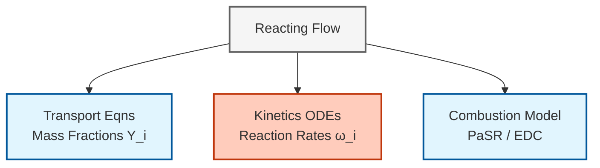

# โมดูล 06-03: การไหลแบบมีปฏิกิริยาเคมีใน OpenFOAM (Reacting Flows in OpenFOAM)

> [!INFO] ภาพรวม
> โมดูลนี้จัดทำพื้นฐานทางเทคนิคที่ครอบคลุมสำหรับการจำลอง **การเผาไหม้ (combustion)** และ **ปฏิกิริยาเคมี (chemical reactions)** ใน OpenFOAM ครอบคลุมถึงการขนส่งสปีชีส์ (species transport), ตัวแก้สมการ ODE แบบแข็ง (stiff ODE solvers), ปฏิสัมพันธ์ระหว่างความปั่นป่วนและเคมี และการบูรณาการกลไก Chemkin

---

## ขอบเขตของโมดูล (Module Scope)

โมดูลนี้จัดการกับสี่เสาหลักพื้นฐานของการจำลองการไหลแบบมีปฏิกิริยา:

| เสาหลัก | คำอธิบาย |
|--------|-------------|
| **การขนส่งสปีชีส์** | สมการการอนุรักษ์สำหรับเศษส่วนมวลพร้อมแบบจำลองการแพร่ |
| **จลนพลศาสตร์เคมี** | ระบบ ODE แบบแข็งผ่าน `chemistryModel` พร้อมตัวแก้สมการแบบโดยนัย |
| **ปฏิสัมพันธ์ระหว่างความปั่นป่วนและเคมี** | แบบจำลองการเผาไหม้ PaSR และ EDC สำหรับเปลวไฟแบบปั่นป่วน |
| **การบูรณาการ Chemkin** | การแปลงกลไกปฏิกิริยาและข้อมูลเทอร์โมไดนามิก |


> **รูปที่ 1:** แผนภาพแสดงโครงสร้างหลักสี่ประการของการจำลองการไหลแบบมีปฏิกิริยาเคมีใน OpenFOAM ซึ่งครอบคลุมถึงสมการการขนส่งสปีชีส์ จลนพลศาสตร์เคมี ปฏิสัมพันธ์ระหว่างความปั่นป่วนและเคมี และการบูรณาการข้อมูลกลไกปฏิกิริยาจากไฟล์ Chemkin

---

## สมการควบคุมพื้นฐาน (Fundamental Governing Equations)

### กฎการอนุรักษ์สำหรับการไหลแบบมีปฏิกิริยา

การจำลองการไหลแบบมีปฏิกิริยาขยายสมการ Navier-Stokes มาตรฐานด้วยกฎการอนุรักษ์เพิ่มเติมสำหรับ **สปีชีส์เคมี (chemical species)** และ **พลังงาน (energy)**:

**สมการความต่อเนื่อง (Continuity Equation):**
$$\frac{\partial \rho}{\partial t} + \nabla \cdot (\rho \mathbf{u}) = 0$$

**สมการโมเมนตัม (Momentum Equation):**
$$\rho \frac{\partial \mathbf{u}}{\partial t} + \rho (\mathbf{u} \cdot \nabla) \mathbf{u} = -\nabla p + \nabla \cdot \boldsymbol{\tau} + \rho \mathbf{g}$$

**การอนุรักษ์สปีชีส์ (สำหรับแต่ละสปีชีส์ $i$):**
$$\frac{\partial (\rho Y_i)}{\partial t} + \nabla \cdot (\rho \mathbf{u} Y_i) = -\nabla \cdot \mathbf{J}_i + \dot{\omega}_i \quad \text{สำหรับ } i = 1, 2, \ldots, N_s$$

**สมการพลังงาน (Energy Equation):**
$$\frac{\partial (\rho h)}{\partial t} + \nabla \cdot (\rho \mathbf{u} h) = \frac{Dp}{Dt} + \nabla \cdot (\alpha \nabla h) + \dot{q}_c$$

**คำจำกัดความตัวแปร:**

| สัญลักษณ์ | คำอธิบาย | หน่วย |
|--------|-------------|-------|
| $\rho$ | ความหนาแน่น | kg/m³ |
| $\mathbf{u}$ | เวกเตอร์ความเร็ว | m/s |
| $p$ | ความดัน | Pa |
| $Y_i$ | เศษส่วนมวลของสปีชีส์ $i$ | [-] |
| $\mathbf{J}_i$ | ฟลักซ์การแพร่ของสปีชีส์ $i$ | kg/(m²·s) |
| $\dot{\omega}_i$ | อัตราการผลิตทางเคมีของสปีชีส์ $i$ | kg/(m³·s) |
| $h$ | เอนทาลปีจำเพาะ | J/kg |
| $\dot{q}_c$ | การคายความร้อนทางเคมี | W/m³ |

---

## การขนส่งสปีชีส์และแบบจำลองการแพร่ (Species Transport and Diffusion Models)

### สมการการขนส่งสปีชีส์

การขนส่งสปีชีส์เคมีถูกควบคุมโดยสมการ **การพา-การแพร่-ปฏิกิริยา (convection-diffusion-reaction)**:

$$\frac{\partial (\rho Y_i)}{\partial t} + \nabla \cdot (\rho \mathbf{u} Y_i) = -\nabla \cdot \mathbf{J}_i + R_i$$

**ส่วนประกอบทางฟิสิกส์:**

| เทอม | รูปแบบทางคณิตศาสตร์ | ความหมายทางฟิสิกส์ |
|------|-------------------|------------------|
| **เชิงเวลา (Temporal)** | $\frac{\partial (\rho Y_i)}{\partial t}$ | อัตราการเปลี่ยนแปลงมวลของสปีชีส์ |
| **การพา (Convection)** | $\nabla \cdot (\rho \mathbf{u} Y_i)$ | การขนส่งเนื่องจากการเคลื่อนที่ของของไหล |
| **การแพร่ (Diffusion)** | $-\nabla \cdot \mathbf{J}_i$ | ฟลักซ์มวลเนื่องจากเกรเดียนต์ความเข้มข้น |
| **แหล่งกำเนิดปฏิกิริยา** | $R_i$ | การผลิต/การบริโภคสุทธิจากเคมี |

### แบบจำลองการแพร่ (Diffusion Models)

OpenFOAM รองรับแบบจำลองการแพร่หลายรูปแบบที่มีความซับซ้อนเพิ่มขึ้น:

#### **กฎของฟิค (Fick's Law - การแพร่แบบสองส่วนประกอบ)**

แบบจำลองที่ง่ายที่สุดสำหรับส่วนผสมสองส่วนประกอบ:

$$\mathbf{J}_i = -\rho D_i \nabla Y_i$$

โดยที่ $D_i$ คือสัมประสิทธิ์การแพร่ที่มีผลจริงของสปีชีส์ $i$ [m²/s]

#### **การแพร่หลายส่วนประกอบ (Maxwell-Stefan)**

สำหรับระบบหลายสปีชีส์ที่แม่นยำ **สมการ Maxwell-Stefan** จะเชื่อมโยงเกรเดียนต์กับเศษส่วนโมล:

$$\nabla X_i = \sum_{j \neq i} \frac{X_i X_j}{D_{ij}} \left( \frac{\mathbf{J}_j}{\rho_j} - \frac{\mathbf{J}_i}{\rho_i} \right)$$

**ตัวแปรเพิ่มเติม:**
- $X_i$: เศษส่วนโมลของสปีชีส์ $i$ [mol/mol]
- $D_{ij}$ : สัมประสิทธิ์การแพร่แบบสองส่วนประกอบสำหรับคู่ $i$-$j$ [m²/s]
- $\rho_i$: ความหนาแน่นบางส่วนของสปีชีส์ $i$ [kg/m³]

OpenFOAM ประมาณค่านี้ผ่าน:
- **แบบจำลองเฉลี่ยส่วนผสม (Mixture-averaged models)**
- **สัมประสิทธิ์คงที่ (Constant coefficients)**

#### **ผลกระทบ Soret/Dufour**

**การแพร่เนื่องจากความร้อน (Soret)** และ **การแพร่เนื่องจากการนำความร้อน (Dufour)** จะคัปปลิงเกรเดียนต์สปีชีส์และอุณหภูมิเข้าด้วยกัน:

$$\mathbf{J}_i = -\rho D_i \nabla Y_i - D_i^T \frac{\nabla T}{T}$$

**โดยที่:**
- $D_i^T$: สัมประสิทธิ์ Soret [kg/(m·s)]
- $T$: อุณหภูมิ [K]

> [!WARNING] ความสำคัญของผลกระทบ Soret
> ผลกระทบ Soret มักจะถูก **ละเลย** ในการเผาไหม้ทั่วไป แต่เป็น **ปัจจัยวิกฤต** สำหรับเปลวไฟที่มีไฮโดรเจนสูง ซึ่งจะส่งผลต่อความเร็วเปลวไฟและขีดจำกัดการดับไฟอย่างมีนัยสำคัญ

### การใช้งานใน OpenFOAM (OpenFOAM Implementation)

```cpp
// Finite volume matrix for species transport equation
// สมการขนส่งสปีชีส์แบบ Finite Volume Method
fvScalarMatrix YiEqn
(
    // Temporal derivative term: ∂(ρYi)/∂t
    // พจน์อนุพัทธ์ตามเวลาของความเข้มของสปีชีส์
    fvm::ddt(rho, Yi)
    
    // Convection term: ∇·(ρuYi)
    // พจน์พาพลศาสตร์จากการเคลื่อนที่ของของไหล
  + fvm::div(phi, Yi)
    
    // Diffusion term: -∇·(Ji) with turbulent + molecular diffusivity
    // พจน์การแพร่ ประกอบด้วยความหนืดปั่นป่วนและค่าสัมประสิทธิ์การแพร่โมเลกุล
  - fvm::laplacian(turbulence->mut()/Sct + rho*Di, Yi)
    
    // Equals: reaction source term and optional sources
    // เท่ากับพจน์แหล่งกำเนิดจากปฏิกิริยาเคมีและแหล่งกำเนิดเสริม
 ==
    chemistry->RR(i)        // Reaction source term [kg/(m³·s)]
                            // อัตราการเกิดปฏิกิริยาเคมีของสปีชีส์ i
  + fvOptions(rho, Yi)      // Optional source terms from fvOptions
                            // แหล่งกำเนิดเสริมจาก framework fvOptions
);
```

---

#### 🔬 คำอธิบายภาษาไทย (Thai Explanation)

**แหล่งที่มาของโค้ด (Source):**
📂 Source: `src/finiteVolume/lnInclude/fvScalarMatrix.C`

**คำอธิบาย (Explanation):**
โค้ดนี้แสดงการสร้างสมการเมทริกซ์ finite volume สำหรับแก้สมการขนส่งสปีชีส์ใน OpenFOAM ซึ่งประกอบด้วยสี่พจน์หลัก:

1. **Temporal Term (`fvm::ddt`)**: คำนวณการเปลี่ยนแปลงของความหนาแน่นของสปีชีส์ตามเวลา
2. **Convection Term (`fvm::div`)**: คำนวณการพาพลศาสตร์ของสปีชีส์โดยการไหลของของไหล
3. **Diffusion Term (`fvm::laplacian`)**: คำนวณการแพร่ของสปีชีส์ที่เกิดจาก gradient ของความเข้มของสปีชีส์ โดยรวมทั้งการแพร่แบบโมเลกุลและการแพร่แบบตุรกี
4. **Source Term**: พจน์แหล่งกำเนิดจากปฏิกิริยาเคมี (`chemistry->RR(i)`) และแหล่งกำเนิดเสริม (`fvOptions`)

**แนวคิดสำคัญ (Key Concepts):**
- **`fvm` (finite volume method)**: Namespace สำหรับ discretization แบบ implicit ซึ่งเหมาะสำหรับการแก้สมการที่เสถียร
- **`turbulence->mut()/Sct`**: คำนวณ turbulent diffusivity จาก turbulent viscosity (mut) หารด้วย Schmidt number ตุรกี (Sct ≈ 0.7)
- **`rho*Di`**: ค่าสัมประสิทธิ์การแพร่โมเลกุลของสปีชีส์ i
- **`chemistry->RR(i)`**: Reaction rate ของสปีชีส์ i ที่คำนวณจาก chemistry solver

**ความหมายขององค์ประกอบใน OpenFOAM:**

| องค์ประกอบโค้ด | ความหมายใน OpenFOAM | ค่าทั่วไป |
|----------------|------------------|----------------|
| `turbulence->mut()/Sct` | สภาพแพร่ปั่นป่วน (Turbulent diffusivity) | `Sct ≈ 0.7` |
| `rho*Di` | สัมประสิทธิ์การแพร่โมเลกุล | - |
| `chemistry->RR(i)` | เทอมแหล่งกำเนิดปฏิกิริยา | - |

---

## จลนพลศาสตร์เคมีและตัวแก้สมการ ODE แบบแข็ง (Chemical Kinetics and Stiff ODE Solvers)

### ความท้าทายเรื่องความแข็งเกร็ง (The Stiffness Challenge)

ปฏิกิริยาเคมีในการเผาไหม้เกิดขึ้นในช่วง **มาตราส่วนเวลาตั้งแต่ไมโครวินาทีถึงมิลลิวินาที** ทำให้เกิด **ระบบ ODE แบบแข็ง (stiff ODE systems)** ซึ่งท้าทายวิธีการบูรณาการแบบชัดแจ้ง (explicit integration methods)

### สมการอัตราการเกิดปฏิกิริยา

เทอมแหล่งกำเนิดปฏิกิริยา $R_i$ มาจากระบบ **สมการเชิงอนุพันธ์สามัญ (ODE)** ที่อธิบายวิวัฒนาการความเข้มข้นของสปีชีส์:

$$\frac{\mathrm{d} Y_i}{\mathrm{d} t} = \frac{R_i}{\rho} = \frac{1}{\rho} \sum_{r=1}^{N_r} \nu_{i,r} \dot{\omega}_r$$

**อัตราปฏิกิริยาเป็นไปตามกฎของอาร์เรเนียส (Arrhenius law):**

$$\dot{\omega}_r = k_r \prod_{j} [C_j]^{\nu'_{j,r}}, \quad k_r = A_r T^{\beta_r} e^{-E_{a,r}/(R T)}$$

**คำจำกัดความพารามิเตอร์:**

| สัญลักษณ์ | คำอธิบาย | หน่วย |
|--------|-------------|-------|
| $A_r$ | ปัจจัยก่อนเลขชี้กำลัง | แปรผัน |
| $\beta_r$ | เลขชี้กำลังอุณหภูมิ | [-] |
| $E_{a,r}$ | พลังงานก่อกัมมันต์ | J/mol |
| $[C_j]$ | ความเข้มข้นเชิงโมลของสปีชีส์ $j$ | mol/m³ |

### กลยุทธ์ตัวแก้สมการ ODE

OpenFOAM ใช้ตัวแก้สมการ ODE แบบ **โดยนัย (implicit)** หรือ **กึ่งโดยนัย (semi-implicit)**:

| ตัวแก้ปัญหา | ประเภท | คุณสมบัติพิเศษ |
|--------|------|------------------|
| **SEulex** | แบบประมาณค่าในช่วง (Extrapolation) | ควบคุมอันดับและขนาดช่วงเวลาอัตโนมัติ |
| **Rosenbrock** | Runge-Kutta แบบโดยนัยเชิงเส้น | มีการประมาณค่าข้อผิดพลาดในตัว |
| **CVODE** | ปรับเปลี่ยนช่วงเวลา/อันดับได้ (ภายนอก) | จากไลบรารี SUNDIALS |

ระบบ ODE ถูกกำหนดเป็น:

$$\frac{\mathrm{d} \mathbf{Y}}{\mathrm{d} t} = \mathbf{f}(\mathbf{Y}, T, p), \quad \mathbf{Y} = [Y_1, Y_2, \dots, Y_{N_s}]$$

โดยที่ $\mathbf{f}$ ครอบคลุมอัตราปฏิกิริยาและการคัปปลิงทางเทอร์โมไดนามิกทั้งหมด

### สถาปัตยกรรมของ ChemistryModel

คลาสฐาน `chemistryModel` (ใน `src/thermophysicalModels/chemistryModel/`) กำหนดส่วนติดต่อไว้ดังนี้:

```cpp
// Base class for chemistry models in OpenFOAM
// คลาสฐานสำหรับรูปแบบจำลองเคมีใน OpenFOAM
class chemistryModel
{
public:
    // Solve chemistry for a time step deltaT
    // แก้สมการเคมีสำหรับช่วงเวลา deltaT
    virtual scalar solve(scalar deltaT) = 0;

    // Return reaction rates RR[i] in kg/(m³·s) for species i
    // คืนค่าอัตราการเกิดปฏิกิริยาของสปีชีส์ i
    virtual const volScalarField::Internal& RR(const label i) const = 0;

    // Access species list from the chemical mechanism
    // เข้าถึงรายชื่อสปีชีส์จากกลไกเคมี
    const speciesTable& species() const;
    
    // Access reaction list with thermodynamic data
    // เข้าถึงรายการปฏิกิริยาพร้อมข้อมูลเทอร์โมไดนามิก
    const ReactionList<ReactionThermo>& reactions() const;
};
```

---

#### 🔬 คำอธิบายภาษาไทย (Thai Explanation)

**แหล่งที่มาของโค้ด (Source):**
📂 Source: `src/thermophysicalModels/chemistryModel/chemistryModel/chemistryModel.H`

**คำอธิบาย (Explanation):**
คลาส `chemistryModel` เป็น abstract base class ที่กำหนด interface หลักสำหรับการแก้สมการเคมีใน OpenFOAM คลาสนี้ทำหน้าที่:

1. **การแก้สมการเคมี**: เมธอด `solve()` เป็น pure virtual function ที่ subclass ต้อง implement สำหรับแก้ระบบ ODE ของปฏิกิริยาเคมี
2. **การคืนค่าอัตราปฏิกิริยา**: เมธอด `RR()` คืนค่า reaction rate ของแต่ละสปีชีส์ในหน่วย kg/(m³·s)
3. **การเข้าถึงข้อมูลกลไกเคมี**: เมธอด `species()` และ `reactions()` ให้เข้าถึงข้อมูลเกี่ยวกับสปีชีส์และปฏิกิริยาที่ถูกอ่านจากไฟล์ Chemkin

**แนวคิดสำคัญ (Key Concepts):**
- **Virtual Function**: เมธอด `solve()` และ `RR()` เป็น virtual function ที่ให้ subclass นำไป implement แบบเฉพาะสำหรับแต่ละ solver (SEulex, Rosenbrock, CVODE)
- **Operator-Splitting**: การแก้สมการเคมีแยกจากสมการฟลูอิดดินามิกส์ โดยถือว่าความดันและอุณหภูมิคงที่ระหว่างการแก้ chemistry
- **Reaction Rates**: ค่าที่คืนจาก `RR(i)` จะถูกใช้เป็น source term ในสมการขนส่งสปีชีส์
- **Species Table**: ตารางข้อมูลสปีชีส์ที่ใช้ map ชื่อสปีชีส์กับ index ในระบบ

มีการใช้เทคนิค **Operator-splitting**: สมการ ODE ทางเคมีจะถูกแก้แยกกันในแต่ละเซลล์ โดยสมมติว่าความดันและอุณหภูมิคงที่ในช่วงเวลาพลศาสตร์การไหล

### การกำหนดค่าตัวแก้สมการ (Solver Configuration)

```cpp
// Chemistry solver configuration in constant/chemistryProperties
// การตั้งค่า chemistry solver ในไฟล์ constant/chemistryProperties
chemistryType
{
    solver          SEulex;      // Solver type: SEulex, Rosenbrock, or CVODE
                                // ประเภท solver: SEulex, Rosenbrock, หรือ CVODE
    tolerance       1e-6;        // Absolute tolerance for species convergence
                                // ค่าความคลาดเคลื่อนสัมบูรณ์สำหรับการลู่เข้าของสปีชีส์
    relTol          0.01;        // Relative tolerance (1%)
                                // ค่าความคลาดเคลื่อนสัมพัทธ์ (1%)
}
```

---

#### 🔬 คำอธิบายภาษาไทย (Thai Explanation)

**แหล่งที่มาของโค้ด (Source):**
📂 Source: `src/thermophysicalModels/chemistryModel/chemistryModel/chemistryModel.C`

**คำอธิบาย (Explanation):**
การตั้งค่า chemistry solver ใน OpenFOAM กำหนดวิธีการแก้ระบบ ODE แบบ stiff ที่เกิดจากปฏิกิริยาเคมี:

1. **Solver Selection**: เลือก solver ที่เหมาะสมกับปัญหา:
   - **SEulex**: Extrapolation solver ที่ปรับอันดับและขนาด time step อัตโนมัติ เหมาะกับปัญหา stiff สูง
   - **Rosenbrock**: Linearly implicit Runge-Kutta solver ที่มีระบบประเมินความคลาดเคลื่อน
   - **CVODE**: Solver จาก SUNDIALS library ที่รองรับหลายวิธีการ

2. **Tolerance Control**:
   - **tolerance**: ค่า absolute tolerance สำหรับการคำนวณความเข้มของสปีชีส์ (1e-6 kg/kg)
   - **relTol**: ค่า relative tolerance ที่อนุญาตให้มีความคลาดเคลื่อน 1% จากค่าเริ่มต้น

**แนวคิดสำคัญ (Key Concepts):**
- **Stiff ODE System**: ปฏิกิริยาเคมีมี time scale ตั้งแต่ไมโครวินาทีถึงมิลลิวินาที ทำให้ต้องใช้ implicit solver
- **Adaptive Time Stepping**: Solver ปรับขนาด time step อัตโนมัติตามความเร็วของปฏิกิริยา
- **Convergence Criteria**: การลู่เข้าถือว่าสำเร็จเมื่อความคลาดเคลื่อนต่ำกว่าทั้ง absolute และ relative tolerance
- **Computational Cost**: การแก้ chemistry อาจใช้เวลา 70-90% ของเวลาคำนวณทั้งหมด

**ลำดับขั้นตอนอัลกอริทึม: การบูรณาการทางเคมี**

1. **การเตรียมการ (Preprocessing)**: โหลดกลไกเคมีจากไฟล์ Chemkin
2. **การบูรณาการรายเซลล์**:
   - แยกส่วนระบบ ODE สำหรับแต่ละเซลล์
   - ตั้งเงื่อนไขเริ่มต้น (Y, T, p)
   - แก้สมการด้วยตัวแก้ ODE ที่เลือก
3. **การประมวลผลภายหลัง**: คำนวณอัตราปฏิกิริยา RR[i]
4. **การคัปปลิง**: ส่งค่าคืนไปยังตัวแก้ปัญหา CFD

---

## ปฏิสัมพันธ์ระหว่างความปั่นป่วนและเคมี: PaSR เทียบกับ EDC (Turbulence-Chemistry Interaction)

### วิธีการแบบสองสภาวะแวดล้อม (The Two-Environment Approach)

ทั้งแบบจำลอง **Partially Stirred Reactor (PaSR)** และ **Eddy Dissipation Concept (EDC)** ต่างก็ใช้วิธีแบบ **สองสภาวะแวดล้อม**:

| ส่วนประกอบ | คำอธิบาย |
|-----------|-------------|
| **โครงสร้างละเอียด (Fine-structures)** | บริเวณขนาดเล็กที่มีการผสมอย่างรุนแรงซึ่งเกิดปฏิกิริยา |
| **ของไหลโดยรอบ (Surrounding fluid)** | ของไหลส่วนใหญ่ที่แลกเปลี่ยนมวลและพลังงานกับโครงสร้างละเอียด |

**อัตราการเกิดปฏิกิริยาโดยรวม** ถูกควบคุมโดย **อัตราส่วนมาตราส่วนเวลา**:

$$R_i = \chi \cdot R_i^{\text{chem}}(Y_i^*, T^*)$$

**ตัวแปร:**
- $\chi$: สัดส่วนปฏิกิริยา
- $Y_i^*$: ความเข้มข้นในโครงสร้างละเอียด
- $T^*$: อุณหภูมิในโครงสร้างละเอียด

### PaSR (Partially Stirred Reactor)

PaSR จัดการแต่ละเซลล์เสมือนเป็น **เครื่องปฏิกรณ์ที่ผสมกันบางส่วน** ด้วยเวลาอาศัย (residence time) $\tau_{\text{res}}$:

$$\chi_{\text{PaSR}} = \frac{\tau_{\text{chem}}}{\tau_{\text{chem}} + \tau_{\text{mix}}}$$

**ตัวแปร:**
- $\tau_{\text{chem}}$: มาตราส่วนเวลาเคมี (จากอัตราปฏิกิริยา)
- $\tau_{\text{mix}}$: มาตราส่วนเวลาการผสม (จากความปั่นป่วน เช่น $k/\varepsilon$)

สถานะของโครงสร้างละเอียดได้มาจากการแก้สมการ ODE เคมีในช่วงเวลาอาศัย $\tau_{\text{res}}$

**การใช้งานใน OpenFOAM:**

```cpp
// PaSR combustion model correction step
// ขั้นตอนการแก้ไขของรูปแบบจำลองการเผาไหม้ PaSR
void PaSR<ReactionThermo>::correct()
{
    // Calculate mixing time scale from turbulence
    // คำนวณมาตราส่วนเวลาการผสมจากความปั่นป่วน
    tmp<volScalarField> ttmix = turbulenceTimeScale();
    const volScalarField& tmix = ttmix();

    // Calculate chemical time scale from reaction rates
    // คำนวณมาตราส่วนเวลาเคมีจากอัตราปฏิกิริยา
    volScalarField tchem = chemistryTimeScale();

    // Calculate reaction fraction (kappa) as time scale ratio
    // คำนวณสัดส่วนปฏิกิริยา (kappa) จากอัตราส่วนมาตราส่วนเวลา
    volScalarField kappa = tchem / (tchem + tmix);

    // Solve chemistry in fine structures for scaled time step
    // แก้สมการเคมีในโครงสร้างละเอียดสำหรับ time step ที่ปรับสเกล
    chemistry_->solve(kappa*deltaT());
}
```

---

#### 🔬 คำอธิบายภาษาไทย (Thai Explanation)

**แหล่งที่มาของโค้ด (Source):**
📂 Source: `src/combustionModels/PaSR/PaSR.C`

**คำอธิบาย (Explanation):**
รูปแบบจำลอง PaSR (Partially Stirred Reactor) ใช้แนวคิด two-environment โดยถือว่าแต่ละ cell ประกอบด้วย:

1. **Fine-structures**: บริเวณขนาดเล็กที่เกิดการผสมอย่างรวดเร็วและปฏิกิริยาเคมี
2. **Surrounding fluid**: ของไหลส่วนใหญ่ที่แลกเปลี่ยนมวลและพลังงานกับ fine-structures

**Algorithm Flow:**
1. **คำนวณ Mixing Time Scale**: ใช้ข้อมูลความปั่นป่วน (k, ε) หรือ (k, ω) ในการคำนวณเวลาการผสม
2. **คำนวณ Chemical Time Scale**: หาค่า inverse ของ reaction rate เพื่อหาเวลาที่ใช้ในปฏิกิริยา
3. **คำนวณ Reaction Fraction**: สัดส่วนปฏิกิริยา κ = τ_chem / (τ_chem + τ_mix)
4. **แก้สมการเคมี**: แก้ chemistry ODE ใน fine-structures เป็นเวลา κ×Δt

**แนวคิดสำคัญ (Key Concepts):**
- **Time-Scale Competition**: อัตราปฏิกิริยาทั้งหมดขึ้นกับการแข่งขันระหว่างเวลาเคมีและเวลาผสม
- **Partially Stirred**: เตาเผาไม่ได้ผสมสมบูรณ์ (stirred) แต่ผสมเพียงพอส่วนหนึ่ง
- **Turbulence-Chemistry Interaction**: แบบจำลองนี้ captures ผลของความปั่นป่วนต่ออัตราปฏิกิริยา
- **Reaction Fraction**: κ = 1 เมื่อ τ_chem >> τ_mix (kinetics limited) และ κ → 0 เมื่อ τ_mix << τ_chem (mixing limited)

### EDC (Eddy Dissipation Concept)

EDC สมมติว่าปฏิกิริยาเกิดขึ้นใน **โครงสร้างละเอียด** ซึ่งสัดส่วนปริมาตรและมาตราส่วนเวลาหามาจากอัตราการสลายพลังงานปั่นป่วน:

$$\xi^* = C_\xi \left( \frac{\nu \varepsilon}{k^2} \right)^{1/4}, \quad \tau^* = C_\tau \left( \frac{\nu}{\varepsilon} \right)^{1/2}$$

**ตัวแปร:**
- $\xi^*$: สัดส่วนปริมาตรโครงสร้างละเอียด
- $\tau^*$: เวลาอาศัยในโครงสร้างละเอียด
- $C_\xi = 2.1377$, $C_\tau = 0.4082$ (ค่าคงที่มาตรฐาน)

สัดส่วนปฏิกิริยาคือ $\chi_{\text{EDC}} = \xi^*$

**การใช้งานใน OpenFOAM:**

```cpp
// EDC combustion model correction step
// ขั้นตอนการแก้ไขของรูปแบบจำลองการเผาไหม้ EDC
void EDC<ReactionThermo>::correct()
{
    // Calculate fine-structure volume fraction (xi)
    // คำนวณปริมาตรสัดส่วนของโครงสร้างละเอียด (xi)
    // xi = C_ξ * (ν*ε/k²)^(1/4)
    volScalarField xi = Cxi_ * pow(epsilon_/(k_*k_), 0.25);

    // Calculate fine-structure residence time (tau)
    // คำนวณเวลาอาศัยของโครงสร้างละเอียด (tau)
    // tau = C_τ * (ν/ε)^(1/2)
    volScalarField tau = Ctau_ * sqrt(nu()/epsilon_);

    // Solve chemistry in fine structures for scaled time step
    // แก้สมการเคมีในโครงสร้างละเอียดสำหรับ time step ที่ปรับสเกล
    chemistry_->solve(xi*deltaT());
}
```

---

#### 🔬 คำอธิบายภาษาไทย (Thai Explanation)

**แหล่งที่มาของโค้ด (Source):**
📂 Source: `src/combustionModels/EDC/EDC.C`

**คำอธิบาย (Explanation):**
รูปแบบจำลอง EDC (Eddy Dissipation Concept) พัฒนาโดย Magnussen ใช้แนวคิด energy cascade จากทฤษฎีความปั่นป่วน:

1. **Fine Structures**: โครงสร้างขนาดเล็กที่เกิดจากการสลายพลังงานจลน์ (dissipation)
2. **Volume Fraction (ξ*)**: สัดส่วนปริมาตรของ fine structures ขึ้นกับอัตราสลายพลังงาน (ε)
3. **Residence Time (τ*)**: เวลาที่ของไหลอยู่ใน fine structures ก่อนผสมกับ surroundings

**Algorithm Flow:**
1. **คำนวณ ξ***: ใช้สูตร ξ* = C_ξ × (νε/k²)^(1/4) โดย C_ξ = 2.1377
2. **คำนวณ τ***: ใช้สูตร τ* = C_τ × (ν/ε)^(1/2) โดย C_τ = 0.4082
3. **แก้สมการเคมี**: แก้ chemistry ODE ใน fine structures เป็นเวลา ξ* × Δt

**แนวคิดสำคัญ (Key Concepts):**
- **Energy Cascade**: พลังงานจลน์ถูกส่งจาก large eddies ไปยัง small eddipes และสลายเป็นความร้อน
- **Kolmogorov Scales**: Fine structures มีขนาด comparable กับ Kolmogorov scale
- **Universal Constants**: ใช้ค่าคงที่ C_ξ และ C_τ ที่ถูกกำหนดจากการทดลอง
- **High Turbulence**: EDC เหมาะกับการไหลที่มีความปั่นป่วนสูงและ premixed flames

### การเลือกแบบจำลอง (Model Selection)

| แบบจำลอง | หลักการทำงาน | เหมาะสำหรับ | ข้อจำกัด |
|-------|---------------------|----------|-------------|
| **PaSR** | ถ่วงน้ำหนักมาตราส่วนเวลาเคมีและการผสม | เปลวไฟแบบไม่ผสมกันล่วงหน้า, ผสมกันบางส่วน | ต้องการการคำนวณมาตราส่วนเวลาเคมี (ต้นทุนเพิ่ม) |
| **EDC** | อ้างอิงจากการสลายพลังงานปั่นป่วน | เปลวไฟแบบผสมล่วงหน้า, ความปั่นป่วนสูง | ใช้ค่าคงที่สากล, ปรับจูนได้น้อยกว่า |

**การกำหนดค่าการใช้งาน:**

```cpp
// การเลือกและตั้งค่ารูปแบบจำลองการเผาไหม้
combustionModel PaSR;          // หรือ "EDC"

PaSRCoeffs
{
    turbulenceTimeScaleModel   integral;  // หรือ "chemical"
    Cmix                      1.0;       // ค่าคงที่การผสม
}

// หรือสำหรับ EDC:
EDCCoeffs
{
    Cxi                       2.1377;
    Ctau                      0.4082;
}
```

---

## การวิเคราะห์ไฟล์ Chemkin ใน OpenFOAM (Chemkin File Parsing)

### มาตรฐานรูปแบบ Chemkin

กลไกเคมีสำหรับเชื้อเพลิงที่ใช้งานจริง (มีเทน, เบนซิน, น้ำมันก๊าด) เกี่ยวข้องกับ **สปีชีส์หลายสิบชนิด** และ **ปฏิกิริยาหลายร้อยรายการ** รูปแบบ **Chemkin-II** เป็นมาตรฐานอุตสาหกรรมสำหรับการแชร์กลไกเหล่านี้

`chemkinReader` ของ OpenFOAM จะแปลงไฟล์ข้อความเหล่านี้เป็นโครงสร้างข้อมูลภายในที่ขับเคลื่อน `chemistryModel`

### โครงสร้างไฟล์

กลไก Chemkin ประกอบด้วยไฟล์หลักสามประเภท:

| ไฟล์ | คำอธิบาย | เนื้อหาหลัก |
|------|-------------|--------------|
| **`chem.inp`** | ข้อมูลปฏิกิริยาเคมี | รายชื่อสปีชีส์และสมการปฏิกิริยาพร้อมพารามิเตอร์อาร์เรเนียส |
| **`therm.dat`** | สมบัติเทอร์โมไดนามิก | สัมประสิทธิ์พหุนาม NASA สำหรับการคำนวณทางเทอร์โมไดนามิก |
| **`tran.dat`** | สมบัติการขนส่ง | พารามิเตอร์การขนส่ง (ตัวเลือกเสริม) |

### กระบวนการวิเคราะห์ (Parsing Process)

การวิเคราะห์ดำเนินการโดย `chemkinReader` (`src/thermophysicalModels/chemistryModel/chemkinReader/`):

**1. การวิเคราะห์สปีชีส์**
- อ่านชื่อสปีชีส์จาก `chem.inp`
- แม็พไปยัง `speciesTable` ของ OpenFOAM

**2. การวิเคราะห์ปฏิกิริยา**

แต่ละบรรทัดกำหนดปฏิกิริยาพร้อมพารามิเตอร์:

```
CH4 + 2O2 = CO2 + 2H2O   1.0e+15  0.0  20000.0
```

รูปแบบที่รองรับ:
- **สัมประสิทธิ์ปริมาณสัมพันธ์ (Stoichiometric coefficients)**: สัมประสิทธิ์ฝั่งซ้ายและขวา
- **พารามิเตอร์อาร์เรเนียส**: $A$, $\beta$, $E_a$ (หน่วยเป็น cal/mol)
- **ตัวที่สาม (Third-body)** (`M`)
- **ปฏิกิริยาที่ขึ้นกับความดัน** (`PLOG`, `TROE`)
- **ปฏิกิริยาแบบ Fall-off**

**3. การวิเคราะห์เทอร์โมไดนามิก**

`therm.dat` บรรจุพหุนาม NASA ในช่วงอุณหภูมิสองช่วง:

```
CH4             G 8/88 C   1H   4         0    0G    300.000  5000.000  1000.000    1
 0.234...  // 14 สัมประสิทธิ์
```

OpenFOAM จะแปลงข้อมูลเหล่านี้เป็นเทอร์โมไดนามิกแบบ `janaf` หรือ `polynomial`

**4. การวิเคราะห์การขนส่ง**

`tran.dat` ให้พารามิเตอร์ Lennard-Jones สำหรับแต่ละสปีชีส์:

```
CH4            0.0  3.758  148.6  0.0  0.0  0.0  0.0  0.0
```

ใช้โดย `multiComponentTransportModel`

### สถาปัตยกรรมคลาส `chemkinReader`

```cpp
// Chemkin file reader class for parsing chemical mechanisms
// คลาสสำหรับอ่านไฟล์ Chemkin และแปลงกลไกเคมี
class chemkinReader : public chemistryReader<ReactionThermo>
{
public:
    // Read mechanism from Chemkin files
    // อ่านกลไกเคมีจากไฟล์ Chemkin
    virtual void read(const fileName& chemFile, const fileName& thermFile);

    // Return species table with species names
    // คืนค่าตารางสปีชีส์พร้อมชื่อสปีชีส์
    virtual const speciesTable& species() const;
    
    // Return list of reactions with thermodynamic data
    // คืนค่ารายการปฏิกิริยาพร้อมข้อมูลเทอร์โมไดนามิก
    virtual const ReactionList<ReactionThermo>& reactions() const;
    
    // Return thermodynamics model for the mixture
    // คืนค่ารูปแบบจำลองเทอร์โมไดนามิกสำหรับส่วนผสม
    virtual autoPtr<ReactionThermo> thermo() const;
};
```

---

#### 🔬 คำอธิบายภาษาไทย (Thai Explanation)

**แหล่งที่มาของโค้ด (Source):**
📂 Source: `src/thermophysicalModels/chemistryModel/chemkinReader/chemkinReader.H`

**คำอธิบาย (Explanation):**
คลาส `chemkinReader` เป็นส่วนประกอบสำคัญในการอ่านและแปลงไฟล์กลไกเคมีรูปแบบ Chemkin ให้เป็น data structures ภายใน OpenFOAM:

1. **File Reading**: เมธอด `read()` อ่านไฟล์ `chem.inp` และ `therm.dat` ที่มีข้อมูลปฏิกิริยาและคุณสมบัติเทอร์โมไดนามิก
2. **Species Table**: สร้างตาราง map ชื่อสปีชีส์กับ index สำหรับการเข้าถึงข้อมูล
3. **Reaction List**: เก็บปฏิกิริยาทั้งหมดพร้อม parameters และ thermodynamic data
4. **Thermodynamics Model**: สร้าง model สำหรับคำนวณคุณสมบัติเทอร์โมไดนามิก (Cp, H, S)

**แนวคิดสำคัญ (Key Concepts):**
- **Chemkin Format**: มาตรฐานอุตสาหกรรมสำหรับแชร์กลไกเคมีระหว่างนักเคมี
- **NASA Polynomials**: ใช้พหุนาม NASA ในการแทนคุณสมบัติเทอร์โมไดนามิกตามช่วงอุณหภูมิ
- **Arrhenius Parameters**: ค่า A, β, E_a ในสมการ Arrhenius สำหรับคำนวณ reaction rate
- **Multi-Species Mechanisms**: รองรับกลไกที่มีหลายสิบสปีชีส์และหลายร้อยปฏิกิริยา

**การเรียกใช้งานใน Constructor:**

```cpp
// Reacting mixture constructor that reads Chemkin files
// Constructor สำหรับ reacting mixture ที่อ่านไฟล์ Chemkin
reactingMixture<ReactionThermo>::reactingMixture
(
    const dictionary& thermoDict,
    const fvMesh& mesh
)
:
    // Initialize base multi-component mixture
    // เริ่มต้นส่วนผสมแบบ multi-component
    multiComponentMixture<ReactionThermo>(...),
    
    // Create and initialize chemistry reader
    // สร้างและเริ่มต้น chemistry reader
    chemistryReader_(new chemkinReader(thermoDict, *this))
{
    // Parse files and populate data structures
    // แปลงไฟล์และสร้าง data structures
}
```

---

#### 🔬 คำอธิบายภาษาไทย (Thai Explanation)

**แหล่งที่มาของโค้ด (Source):**
📂 Source: `src/thermophysicalModels/reactionThermo/reactingMixture/reactingMixture.C`

**คำอธิบาย (Explanation):**
Constructor ของ `reactingMixture` เป็นจุดเริ่มต้นในการโหลดกลไกเคมี:

1. **Base Class Initialization**: สร้าง `multiComponentMixture` ที่เก็บข้อมูลสปีชีส์แต่ละตัว
2. **Chemkin Reader Creation**: สร้าง `chemkinReader` และส่ง dictionary และ mesh ให้
3. **File Parsing**: Reader อ่านไฟล์ Chemkin และสร้าง:
   - Species table สำหรับ map ชื่อสปีชีส์
   - Reaction list พร้อม Arrhenius parameters
   - Thermodynamic data จาก NASA polynomials
4. **Data Population**: ข้อมูลที่อ่านจากไฟล์ถูกเก็บไว้ใน memory เพื่อใช้ในการคำนวณ

**แนวคิดสำคัญ (Key Concepts):**
- **Initialization**: การโหลดกลไกเคมีเกิดครั้งเดียวใน constructor
- **Memory Management**: ใช้ `autoPtr` สำหรับจัดการ memory อัตโนมัติ
- **Dictionary-Based**: การตั้งค่าอ่านจาก `thermophysicalProperties` dictionary
- **Mesh Dependency**: บาง models ต้องการ mesh information สำหรับ parallel computing

### การกำหนดค่า (Configuration)

**1. วางไฟล์ Chemkin** ไว้ในไดเรกทอรีของกรณีศึกษา

**2. อ้างอิงใน `constant/thermophysicalProperties`:**

```cpp
// การตั้งค่าคุณสมบัติเทอร์โมไดนามิกและการขนส่ง
mixture
{
    chemistryReader   chemkin;    // ใช้รูปแบบ Chemkin
    chemkinFile       "chem.inp"; // ไฟล์กลไกปฏิกิริยา
    thermoFile        "therm.dat"; // ไฟล์ข้อมูลเทอร์โมไดนามิก
    transportFile     "tran.dat";   // ไฟล์ข้อมูลการขนส่ง (ทางเลือก)
}
```

---

## ขั้นตอนการทำงานจริง: การตั้งค่าการจำลองการไหลแบบมีปฏิกิริยา (Practical Workflow)

### ขั้นตอนที่ 1 – เตรียมไฟล์เคมี

**ไฟล์ที่จำเป็น:**

| ไฟล์ | คำอธิบาย |
|------|-------------|
| **`chem.inp`** | บรรจุปฏิกิริยาเคมี, พารามิเตอร์อาร์เรเนียส และประสิทธิภาพของตัวที่สาม |
| **`therm.dat`** | ให้ข้อมูลเทอร์โมไดนามิกที่ขึ้นกับอุณหภูมิ (Cp, H, S) สำหรับแต่ละสปีชีส์ |
| **`tran.dat`** | ไฟล์สมบัติการขนส่งเพิ่มเติมสำหรับความหนืดโมเลกุลและการนำความร้อน |

**ตัวอย่าง: GRI-Mech 3.0 สำหรับการเผาไหม้มีเทน**

สำหรับการเผาไหม้มีเทน กลไก **GRI-Mech 3.0** ที่ใช้กันอย่างแพร่หลายให้รายละเอียดทางเคมีด้วย **53 สปีชีส์** และ **325 ปฏิกิริยา**

วางไฟล์เหล่านี้ไว้ในไดเรกทอรีกรณีศึกษาของคุณ:

```
case_directory/
├── chem.inp          # กลไกปฏิกิริยา
├── therm.dat         # ข้อมูลเทอร์โมไดนามิก
└── tran.dat         # ข้อมูลการขนส่ง (ทางเลือก)
```

`chemistry reader` จะวิเคราะห์ไฟล์เหล่านี้ในระหว่างการเริ่มต้นตัวแก้ปัญหาเพื่อสร้างสัมประสิทธิ์อัตราปฏิกิริยาและสมบัติสปีชีส์ที่จำเป็น

### ขั้นตอนที่ 2 – กำหนดคุณสมบัติทางเทอร์โมฟิสิกส์

ไฟล์ `constant/thermophysicalProperties` กำหนดวิธีคำนวณคุณสมบัติเทอร์โมไดนามิกและการขนส่งตลอดการจำลอง

```cpp
// การตั้งค่าประเภทรูปแบบจำลองเทอร์โมฟิสิกส์
thermoType
{
    type            hePsiThermo;    // เอนทาลปีจากค่าความยืดหยุ่น (compressibility)
    mixture         reactingMixture; // ส่วนผสมแบบมีปฏิกิริยาหลายสปีชีส์
    transport       multiComponent; // แบบจำลองการขนส่งหลายส่วนประกอบ
    thermo          janaf;          // เทอร์โมไดนามิกพหุนาม NASA
    energy          sensibleInternalEnergy; // สมการพลังงานภายใน
    equationOfState idealGas;       // สมการสภาวะก๊าซอุดมคติ
    specie          specie;         // สมบัติสปีชีส์แต่ละตัว
}
```

---

#### 🔬 คำอธิบายภาษาไทย (Thai Explanation)

**แหล่งที่มาของโค้ด (Source):**
📂 Source: `src/thermophysicalModels/basic/lnInclude/thermophysicalModels.H`

**คำอธิบาย (Explanation):**
การตั้งค่า `thermoType` กำหนดวิธีคำนวณคุณสมบัติเทอร์โมไดนามิกและการขนส่ง:

1. **`hePsiThermo`**: คำนวณ enthalpy จาก compressibility (ψ) และ temperature
2. **`reactingMixture`**: เปิดใช้งานการคำนวณแบบ multi-species reacting flow
3. **`multiComponent`**: ใช้ transport properties แบบ mixture-averaged
4. **`janaf`**: ใช้รูปแบบ NASA polynomial สำหรับ thermodynamic properties
5. **`sensibleInternalEnergy`**: สมการพลังงานฐาน internal energy ไม่ใช่ enthalpy
6. **`idealGas`**: สมการสภาวะ p = ρRsT
7. **`specie`**: คุณสมบัติของสปีชีส์แต่ละตัว (molecular weight, etc.)

**แนวคิดสำคัญ (Key Concepts):**
- **Compressible Flow**: `hePsiThermo` เหมาะกับของไหลที่อัดตัวได้
- **Multi-Component**: ต้องใช้ `reactingMixture` สำหรับการไหลแบบมีปฏิกิริยา
- **NASA Polynomials**: JANAF tables ให้ค่า Cp, H, S ตามช่วงอุณหภูมิ
- **Internal Energy**: ใช้ `sensibleInternalEnergy` สำหรับ low Mach number flows

**การอ้างอิงไฟล์เคมี:**

```cpp
// การอ้างอิงไฟล์เคมี
mixture
{
    chemistryReader   chemkin;     // ใช้ reader รูปแบบ Chemkin
    chemkinFile       "chem.inp";  // เส้นทางไปยังไฟล์กลไกปฏิกิริยา
    thermoFile        "therm.dat"; // เส้นทางไปยังไฟล์ข้อมูลเทอร์โมไดนามิก
    // transportFile    "tran.dat";  // ใส่เครื่องหมายคอมเมนต์ออกหากไม่ใช้ข้อมูลการขนส่ง
}
```

### ขั้นตอนที่ 3 – เลือกแบบจำลองการเผาไหม้

แบบจำลองการเผาไหม้กำหนดวิธีจัดการปฏิสัมพันธ์ระหว่างความปั่นป่วนและเคมี ระบุใน `constant/combustionProperties`

**แบบจำลอง PaSR (Partial Stirred Reactor):**

```cpp
// การเลือกรูปแบบจำลองการเผาไหม้
combustionModel PaSR;          // รูปแบบจำลอง Partially Stirred Reactor

PaSRCoeffs
{
    turbulenceTimeScaleModel integral;  // แบบจำลองมาตราส่วนเวลาแบบอินทิกรัล
    Cmix                   1.0;         // ค่าคงที่การผสม (0.5-2.0)
}
```

---

#### 🔬 คำอธิบายภาษาไทย (Thai Explanation)

**แหล่งที่มาของโค้ด (Source):**
📂 Source: `src/combustionModels/PaSR/PaSR.C`

**คำอธิบาย (Explanation):**
รูปแบบจำลอง PaSR (Partially Stirred Reactor) ใช้แนวคิดสองสภาวแวดล้อม:

1. **Fine Structures**: บริเวณที่เกิดการผสมรวดเร็วและปฏิกิริยาเคมี
2. **Surrounding Fluid**: ของไหลส่วนใหญ่ที่แลกเปลี่ยนมวลและพลังงาน

**พารามิเตอร์ (Parameters):**
- **`turbulenceTimeScaleModel`**: วิธีคำนวณ mixing time scale
  - `integral`: ใช้ integral time scale จาก turbulent kinetic energy
  - `kolmogorov`: ใช้ Kolmogorov time scale สำหรับ sub-grid mixing
- **`Cmix`**: ค่าคงที่การผสม (0.5-2.0) ควบคุมระดับการผสม

**แนวคิดสำคัญ (Key Concepts):**
- **Partially Stirred**: เตาเผาไม่ได้ผสมสมบูรณ์แต่ผสมเพียงพอบางส่วน
- **Time-Scale Competition**: อัตราปฏิกิริยาขึ้นกับการแข่งขันระหว่างเวลาเคมีและเวลาผสม
- **Turbulence-Chemistry Interaction**: แบบจำลองนี้ captures ผลของความปั่นป่วนต่ออัตราปฏิกิริยา

**ตัวเลือกแบบจำลอง:**

| แบบจำลอง | คำอธิบาย |
|--------|-------------|
| **PaSR** | Partial Stirred Reactor - จัดการแต่ละเซลล์เสมือนเครื่องปฏิกรณ์ที่ผสมไม่สมบูรณ์ |
| **EDC** | Eddy Dissipation Concept - พิจารณาปฏิสัมพันธ์ความปั่นป่วน-เคมีที่ระดับ sub-grid |

แบบจำลอง PaSR แก้สมการเทอร์โมเคมีโดยใช้: $$\dot{\omega}_i = \frac{\rho \chi_i - \rho_i^*}{\tau_{mix}}$$

โดยที่ $\tau_{mix} = C_{mix} \frac{k}{\varepsilon}$ คือมาตราส่วนเวลาการผสม

### ขั้นตอนที่ 4 – กำหนดค่าตัวแก้สมการเคมี

ตัวแก้สมการเคมีควบคุมวิธีที่ระบบ ODE แบบแข็งซึ่งแทนปฏิกิริยาเคมีจะถูกบูรณาการในเวลา ระบุใน `constant/chemistryProperties`

```cpp
// การตั้งค่า chemistry solver
chemistry
{
    chemistry       on;                // เปิดใช้งานเคมี
    solver          SEulex;            // ตัวแก้ ODE แบบแข็งอ้างอิงการประมาณค่า (extrapolation)
    initialChemicalTimeStep 1e-8;      // ช่วงเวลาเริ่มต้น [วินาที]
    maxChemicalTimeStep     1e-3;      // ช่วงเวลาสูงสุด [วินาที]
    tolerance       1e-6;              // ค่าความคลาดเคลื่อนสัมบูรณ์
    relTol          0.01;              // ค่าความคลาดเคลื่อนสัมพัทธ์ (1%)
}
```

---

#### 🔬 คำอธิบายภาษาไทย (Thai Explanation)

**แหล่งที่มาของโค้ด (Source):**
📂 Source: `src/thermophysicalModels/chemistryModel/chemistryModel/chemistryModel.C`

**คำอธิบาย (Explanation):**
การตั้งค่า chemistry solver กำหนดวิธีแก้ระบบ ODE แบบ stiff:

1. **Solver Selection**: เลือก solver ที่เหมาะกับระบบ stiff
   - **SEulex**: Extrapolation solver ที่ปรับ order และ time step อัตโนมัติ
   - **ode**: Standard ODE solver สำหรับระบบไม่ stiff มาก
   - **backwardEuler**: First-order implicit method

2. **Time Step Control**:
   - **initialChemicalTimeStep**: เริ่มต้นที่ 1e-8 วินาที (สำหรับ reactions ที่เร็วมาก)
   - **maxChemicalTimeStep**: จำกัดไว้ที่ 1e-3 วินาที (เพื่อความแม่นยำ)
   - Solver จะปรับ time step อัตโนมัติตาม reaction rates

3. **Tolerance Control**:
   - **tolerance**: 1e-6 kg/kg สำหรับ species concentrations
   - **relTol**: 1% relative tolerance สำหรับการลู่เข้า

**แนวคิดสำคัญ (Key Concepts):**
- **Stiff System**: ปฏิกิริยาเคมีมี time scale หลายอันดับของขนาด
- **Adaptive Stepping**: Solver ปรับ time step อัตโนมัติตาม local stiffness
- **Convergence**: แก้จนกว่าความคลาดเคลื่อนต่ำกว่าทั้ง absolute และ relative tolerance
- **Computational Cost**: Chemistry integration ใช้ 70-90% ของเวลาคำนวณ

**ตัวเลือกตัวแก้ปัญหา:**

| ตัวแก้ปัญหา | คำอธิบาย | ความแข็งเกร็ง |
|--------|-------------|------------|
| **`SEulex`** | อ้างอิงการประมาณค่าสำหรับจลนพลศาสตร์เคมีที่แข็งเกร็งมาก | สูง |
| **`ode`** | ตัวแก้ ODE มาตรฐาน | ปานกลาง |
| **`backwardEuler`** | วิธีแบบโดยนัยอันดับหนึ่ง | ต่ำ |

การบูรณาการทางเคมีมักต้องการช่วงเวลาที่เล็กกว่าพลศาสตร์การไหลมากเนื่องจากความแข็งเกร็งของปฏิกิริยาเคมี ตัวแก้ปัญหาจะปรับช่วงเวลาเคมีโดยอัตโนมัติตามอัตราปฏิกิริยาเฉพาะที่เพื่อรักษาความแม่นยำในขณะที่ลดต้นทุนการคำนวณ

### ขั้นตอนที่ 5 – กำหนดเงื่อนไขเริ่มต้นและเงื่อนไขขอบเขต

การระบุเศษส่วนมวลของสปีชีส์ อุณหภูมิ และความดันที่เหมาะสมเป็นสิ่งสำคัญสำหรับการจำลองการเผาไหม้ที่แม่นยำ

**เศษส่วนมวลของสปีชีส์**

สำหรับแต่ละสปีชีส์ในกลไกของคุณ ให้สร้างไฟล์ฟิลด์ในไดเรกทอรี `0/`:

**ตัวอย่าง: `0/Y_CH4` (มีเทน)**
```cpp
// ฟิลด์ค่าเศษส่วนมวลของมีเทน (Y_CH4)
dimensions      [0 0 0 0 0 0 0];    // ไม่มีมิติ (เศษส่วนมวล)

internalField   uniform 0.055;     // มีเทน 5.5% ตามมวล

boundaryField
{
    inlet
    {
        type            fixedValue;   // ค่าคงที่ที่ทางเข้า
        value           uniform 0.055;  // มีเทน 5.5%
    }
    outlet
    {
        type            zeroGradient;  // เกรเดียนต์เป็นศูนย์ (ไหลเต็มที่)
    }
    walls
    {
        type            zeroGradient;  // ไม่มีฟลักซ์ผ่านผนัง
    }
}
```

---

#### 🔬 คำอธิบายภาษาไทย (Thai Explanation)

**แหล่งที่มาของโค้ด (Source):**
📂 Source: `src/finiteVolume/lnInclude/volFieldsFwd.H`

**คำอธิบาย (Explanation):**
การตั้งค่า boundary conditions สำหรับ species mass fractions ใน OpenFOAM:

1. **Field Dimensions**: Mass fractions ไม่มีมิติ [0 0 0 0 0 0 0] เป็นอัตราส่วน
2. **Initial Condition**: `uniform 0.055` หมายถึง 5.5% มีเทนใน domain
3. **Boundary Types**:
   - **`fixedValue`**: กำหนดค่าคงที่ที่ inlet
   - **`zeroGradient`**: Gradient เป็นศูนย์ที่ outlet และ walls

**แนวคิดสำคัญ (Key Concepts):**
- **Mass Fraction Conservation**: ผลรวมของทุก species ต้องเท่ากับ 1.0
- **Non-Reacting Zones**: กำหนด initial composition ที่ไม่เกิดปฏิกิริยา
- **Inlet Composition**: ต้องระบุ composition ที่ inlet อย่างถูกต้อง
- **Outlet Condition**: `zeroGradient` หมายถึง flow ไหลออกโดยไม่ถูกรบกวน

**ตัวอย่าง: `0/Y_O2` (ออกซิเจน)**
```cpp
dimensions      [0 0 0 0 0 0 0];

internalField   uniform 0.233;    // ออกซิเจน 23.3% ตามมวล

boundaryField
{
    inlet
    {
        type            fixedValue;
        value           uniform 0.233;
    }
    outlet
    {
        type            zeroGradient;
    }
    walls
    {
        type            zeroGradient;
    }
}
```

**ฟิลด์อุณหภูมิ (`0/T`)**
```cpp
// การกำหนดค่าเริ่มต้นและเงื่อนไขขอบเขตของฟิลด์อุณหภูมิ
dimensions      [0 0 0 1 0 0 0];    // อุณหภูมิ [เคลวิน]

internalField   uniform 300;        // อุณหภูมิเริ่มต้น 300 K

boundaryField
{
    inlet
    {
        type            fixedValue;   // อุณหภูมิคงที่ที่ทางเข้า
        value           uniform 600;      // ทางเข้าร้อน 600 K
    }
    outlet
    {
        type            zeroGradient;  // เกรเดียนต์เป็นศูนย์ที่ทางออก
    }
    walls
    {
        type            fixedValue;   // ผนังร้อน 1200 K
        value           uniform 1200;     // อุณหภูมิจุดติดไฟ
    }
}
```

---

#### 🔬 คำอธิบายภาษาไทย (Thai Explanation)

**แหล่งที่มาของโค้ด (Source):**
📂 Source: `src/finiteVolume/lnInclude/volFieldsFwd.H`

**คำอธิบาย (Explanation):**
การตั้งค่าอุณหภูมิสำหรับการจำลองการเผาไหม้:

1. **Initial Temperature**: 300 K อุณหภูมิห้อง
2. **Inlet Temperature**: 600 K อากาศร้อนที่เข้ามา
3. **Wall Temperature**: 1200 K อุณหภูมิจุดติดไฟ

**แนวคิดสำคัญ (Key Concepts):**
- **Ignition Temperature**: ผนังร้อนที่ 1200 K ใช้เป็นจุดกำเนิดของการเผาไหม้
- **Hot Inlet**: อากาศร้อน 600 K เพื่อช่วยในการจุดระเบิด
- **Outlet Condition**: `zeroGradient` หมายถึง hot gases ไหลออกโดยอิสระ
- **Temperature Gradients**: Gradient สูงใกล้ผนังและ inlet

**ฟิลด์ความดัน (`0/p`)**
```cpp
dimensions      [1 -1 -2 0 0 0 0];   // ความดัน [ปาสกาล]

internalField   uniform 101325;     // ความดันบรรยากาศ

boundaryField
{
    inlet
    {
        type            zeroGradient;  // เกรเดียนต์เป็นศูนย์ที่ทางเข้า
    }
    outlet
    {
        type            fixedValue;   // ความดันคงที่ที่ทางออก
        value           uniform 101325; // ความดันบรรยากาศ
    }
    walls
    {
        type            zeroGradient;  // เกรเดียนต์เป็นศูนย์ที่ผนัง
    }
}
```

### ขั้นตอนที่ 6 – รันตัวแก้ปัญหา

**เลือกตัวแก้ปัญหาที่เหมาะสม:**

| ตัวแก้ปัญหา | คำอธิบาย | การประยุกต์ใช้ |
|--------|-------------|------------|
| **`reactingFoam`** | สำหรับการไหลแบบมีปฏิกิริยาที่เลขมัคต่ำ | การเปลี่ยนแปลงความหนาแน่นน้อย |
| **`rhoReactingFoam`** | สำหรับการไหลแบบมีปฏิกิริยาที่อัดตัวได้ | การเปลี่ยนแปลงความหนาแน่นมาก |
| **`reactingEulerFoam`** | สำหรับการไหลแบบมีปฏิกิริยาหลายเฟสพร้อมการเปลี่ยนสถานะ | ระบบหลายเฟส |

**การตรวจสอบความคืบหน้า:** ปริมาณหลักที่ต้องติดตามคือ ค่าตกค้าง (Residuals), อุณหภูมิที่สมเหตุสมผลทางฟิสิกส์, เศษส่วนมวลของสปีชีส์ที่อยู่ระหว่าง 0 และ 1 และอัตราการคายความร้อนทางเคมี

การจำลองจะถือว่าลู่เข้าเมื่อพล็อตค่าตกค้างทั้งหมดลดลงอย่างต่อเนื่อง สนามอุณหภูมิเข้าสู่สภาวะคงตัว ความเข้มข้นของสปีชีส์คงที่ และการคายความร้อนรวมถึงสมดุล

---

## สรุป (Summary)

การจำลองการไหลแบบมีปฏิกิริยาใน OpenFOAM ต้องการการบูรณาการของ:

- **สมการการขนส่งสปีชีส์** พร้อมแบบจำลองการแพร่ที่เหมาะสม
- **ตัวแก้สมการ ODE แบบแข็ง** สำหรับการบูรณาการจลนพลศาสตร์เคมี
- **แบบจำลองปฏิสัมพันธ์ความปั่นป่วน-เคมี** (PaSR/EDC)
- **การวิเคราะห์กลไก Chemkin** สำหรับรายละเอียดทางเคมี

การกำหนดค่าคุณสมบัติเทอร์โมฟิสิกส์ แบบจำลองเคมี แบบจำลองการเผาไหม้ และเงื่อนไขขอบเขตที่ถูกต้อง จะช่วยให้สามารถคาดการณ์ปรากฏการณ์การเผาไหม้ได้อย่างแม่นยำสำหรับการประยุกต์ใช้งานทางวิศวกรรม รวมถึงการออกแบบหัวเผา การลดการปล่อยมลพิษ และการเพิ่มประสิทธิภาพกระบวนการทางเคมี
