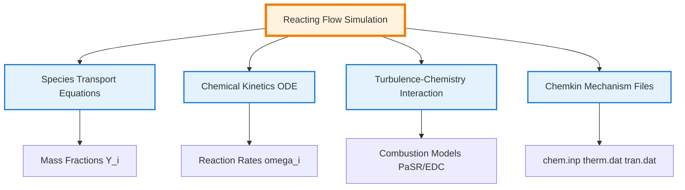

# Module 06-03: Reacting Flows in OpenFOAM

> [!INFO] Overview
> This module provides a comprehensive technical foundation for simulating **combustion** and **chemical reactions** in OpenFOAM, covering species transport, stiff ODE solvers, turbulence-chemistry interaction, and Chemkin mechanism integration.

---

## Module Scope

This module addresses four fundamental pillars of reacting flow simulation:

| Pillar | Description |
|--------|-------------|
| **Species Transport** | Conservation equations for mass fractions with diffusion models |
| **Chemical Kinetics** | Stiff ODE systems via `chemistryModel` with implicit solvers |
| **Turbulence-Chemistry Interaction** | PaSR and EDC combustion models for turbulent flames |
| **Chemkin Integration** | Parsing reaction mechanisms and thermodynamic data |


> **Figure 1:** แผนภาพแสดงโครงสร้างหลักสี่ประการของการจำลองการไหลแบบมีปฏิกิริยาเคมีใน OpenFOAM ซึ่งครอบคลุมถึงสมการการขนส่งสปีชีส์ จลนพลศาสตร์เคมี ปฏิสัมพันธ์ระหว่างความปั่นป่วนและเคมี และการบูรณาการข้อมูลกลไกปฏิกิริยาจากไฟล์ Chemkin


---

## Fundamental Governing Equations

### Conservation Laws for Reacting Flows

Reacting flow simulations extend the standard Navier-Stokes equations with additional conservation laws for **chemical species** and **energy**:

**Continuity Equation:**
$$\frac{\partial \rho}{\partial t} + \nabla \cdot (\rho \mathbf{u}) = 0$$

**Momentum Equation:**
$$\rho \frac{\partial \mathbf{u}}{\partial t} + \rho (\mathbf{u} \cdot \nabla) \mathbf{u} = -\nabla p + \nabla \cdot \boldsymbol{\tau} + \rho \mathbf{g}$$

**Species Conservation (for each species $i$):**
$$\frac{\partial (\rho Y_i)}{\partial t} + \nabla \cdot (\rho \mathbf{u} Y_i) = -\nabla \cdot \mathbf{J}_i + \dot{\omega}_i \quad \text{for } i = 1, 2, \ldots, N_s$$

**Energy Equation:**
$$\frac{\partial (\rho h)}{\partial t} + \nabla \cdot (\rho \mathbf{u} h) = \frac{Dp}{Dt} + \nabla \cdot (\alpha \nabla h) + \dot{q}_c$$

**Variable Definitions:**

| Symbol | Description | Units |
|--------|-------------|-------|
| $\rho$ | Density | kg/m³ |
| $\mathbf{u}$ | Velocity vector | m/s |
| $p$ | Pressure | Pa |
| $Y_i$ | Mass fraction of species $i$ | [-] |
| $\mathbf{J}_i$ | Diffusive flux of species $i$ | kg/(m²·s) |
| $\dot{\omega}_i$ | Chemical production rate of species $i$ | kg/(m³·s) |
| $h$ | Specific enthalpy | J/kg |
| $\dot{q}_c$ | Chemical heat release | W/m³ |

---

## Species Transport and Diffusion Models

### The Species Transport Equation

The transport of chemical species is governed by the **convection-diffusion-reaction** equation:

$$\frac{\partial (\rho Y_i)}{\partial t} + \nabla \cdot (\rho \mathbf{u} Y_i) = -\nabla \cdot \mathbf{J}_i + R_i$$

**Physical Components:**

| Term | Mathematical Form | Physical Meaning |
|------|-------------------|------------------|
| **Temporal** | $\frac{\partial (\rho Y_i)}{\partial t}$ | Rate of change of species mass |
| **Convection** | $\nabla \cdot (\rho \mathbf{u} Y_i)$ | Transport due to bulk fluid motion |
| **Diffusion** | $-\nabla \cdot \mathbf{J}_i$ | Mass flux due to concentration gradients |
| **Reaction Source** | $R_i$ | Net production/consumption from chemistry |

### Diffusion Models

OpenFOAM supports multiple diffusion models with increasing complexity:

#### **Fick's Law (Binary Diffusion)**

The simplest model for binary mixtures:

$$\mathbf{J}_i = -\rho D_i \nabla Y_i$$

where $D_i$ is the effective diffusion coefficient of species $i$ [m²/s].

#### **Multi-component Diffusion (Maxwell-Stefan)**

For accurate multi-species systems, the **Maxwell-Stefan equations** relate gradients to mole fractions:

$$\nabla X_i = \sum_{j \neq i} \frac{X_i X_j}{D_{ij}} \left( \frac{\mathbf{J}_j}{\rho_j} - \frac{\mathbf{J}_i}{\rho_i} \right)$$

**Additional Variables:**
- $X_i$: Mole fraction of species $i$ [mol/mol]
- $D_{ij}$: Binary diffusion coefficient for pair $i$-$j$ [m²/s]
- $\rho_i$: Partial density of species $i$ [kg/m³]

OpenFOAM approximates this through:
- **Mixture-averaged models**
- **Constant coefficients**

#### **Soret/Dufour Effects**

**Thermal diffusion (Soret)** and **diffusion-thermo (Dufour)** couple species and temperature gradients:

$$\mathbf{J}_i = -\rho D_i \nabla Y_i - D_i^T \frac{\nabla T}{T}$$

**Where:**
- $D_i^T$: Soret coefficient [kg/(m·s)]
- $T$: Temperature [K]

> [!WARNING] Importance of Soret Effect
> The Soret effect is often **neglected** in general combustion but is **critical** for hydrogen-enriched flames, where it significantly affects flame speed and extinction limits.

### OpenFOAM Implementation

```cpp
fvScalarMatrix YiEqn
(
    fvm::ddt(rho, Yi)
  + fvm::div(phi, Yi)
  - fvm::laplacian(turbulence->mut()/Sct + rho*Di, Yi)
 ==
    chemistry->RR(i)        // Reaction source
  + fvOptions(rho, Yi)      // Optional sources
);
```

**Component Meanings in OpenFOAM:**

| Code Component | OpenFOAM Meaning | Typical Values |
|----------------|------------------|----------------|
| `turbulence->mut()/Sct` | Turbulent diffusivity | `Sct ≈ 0.7` |
| `rho*Di` | Molecular diffusion coefficient | - |
| `chemistry->RR(i)` | Reaction source term | - |

---

## Chemical Kinetics and Stiff ODE Solvers

### The Stiffness Challenge

Chemical reactions in combustion occur over **time scales from microseconds to milliseconds**, creating **stiff ODE systems** that challenge explicit integration methods.

### Reaction Rate Equations

The reaction source term $R_i$ originates from a system of **ordinary differential equations** describing species concentration evolution:

$$\frac{\mathrm{d} Y_i}{\mathrm{d} t} = \frac{R_i}{\rho} = \frac{1}{\rho} \sum_{r=1}^{N_r} \nu_{i,r} \dot{\omega}_r$$

**Reaction rates follow the Arrhenius law:**

$$\dot{\omega}_r = k_r \prod_{j} [C_j]^{\nu'_{j,r}}, \quad k_r = A_r T^{\beta_r} e^{-E_{a,r}/(R T)}$$

**Parameter Definitions:**

| Symbol | Description | Units |
|--------|-------------|-------|
| $A_r$ | Pre-exponential factor | varies |
| $\beta_r$ | Temperature exponent | [-] |
| $E_{a,r}$ | Activation energy | J/mol |
| $[C_j]$ | Molar concentration of species $j$ | mol/m³ |

### ODE Solver Strategies

OpenFOAM employs **implicit** or **semi-implicit** ODE solvers:

| Solver | Type | Special Features |
|--------|------|------------------|
| **SEulex** | Extrapolation-based | Automatic order and step-size control |
| **Rosenbrock** | Linearly implicit Runge-Kutta | Embedded error estimation |
| **CVODE** | Variable step/order (external) | From SUNDIALS library |

The ODE system is defined as:

$$\frac{\mathrm{d} \mathbf{Y}}{\mathrm{d} t} = \mathbf{f}(\mathbf{Y}, T, p), \quad \mathbf{Y} = [Y_1, Y_2, \dots, Y_{N_s}]$$

where $\mathbf{f}$ encompasses all reaction rates and thermodynamic coupling.

### ChemistryModel Architecture

The base `chemistryModel` class (in `src/thermophysicalModels/chemistryModel/`) defines the interface:

```cpp
class chemistryModel
{
public:
    // Solve chemistry for a time step
    virtual scalar solve(scalar deltaT) = 0;

    // Return reaction rates RR[i] in kg/(m³·s)
    virtual const volScalarField::Internal& RR(const label i) const = 0;

    // Access species list, reactions, thermodynamics
    const speciesTable& species() const;
    const ReactionList<ReactionThermo>& reactions() const;
};
```

**Operator-splitting** is employed: chemical ODEs are solved separately in each cell, assuming constant pressure and temperature during the flow dynamics timestep.

### Solver Configuration

```cpp
chemistryType
{
    solver          SEulex;      // or Rosenbrock, CVODE
    tolerance       1e-6;
    relTol          0.01;
}
```

**Algorithm Flow: Chemical Integration**

1. **Preprocessing**: Load chemical mechanism from Chemkin files
2. **Per Cell Integration**:
   - Isolate ODE system for each cell
   - Set initial conditions (Y, T, p)
   - Solve with selected ODE solver
3. **Post-processing**: Calculate reaction rates RR[i]
4. **Coupling**: Return values to CFD solver

---

## Turbulence-Chemistry Interaction: PaSR vs EDC

### The Two-Environment Approach

Both **Partially Stirred Reactor (PaSR)** and **Eddy Dissipation Concept (EDC)** models use a **two-environment** approach:

| Component | Description |
|-----------|-------------|
| **Fine-structures** | Small regions with intensive mixing where reactions occur |
| **Surrounding fluid** | Bulk fluid exchanging mass and energy with fine-structures |

The **overall reaction rate** is controlled by a **time-scale ratio**:

$$R_i = \chi \cdot R_i^{\text{chem}}(Y_i^*, T^*)$$

**Variables:**
- $\chi$: Reaction fraction
- $Y_i^*$: Fine-structure concentration
- $T^*$: Fine-structure temperature

### PaSR (Partially Stirred Reactor)

PaSR treats each cell as a **well-mixed reactor** with residence time $\tau_{\text{res}}$:

$$\chi_{\text{PaSR}} = \frac{\tau_{\text{chem}}}{\tau_{\text{chem}} + \tau_{\text{mix}}}$$

**Variables:**
- $\tau_{\text{chem}}$: Chemical time scale (from reaction rates)
- $\tau_{\text{mix}}$: Mixing time scale (from turbulence, e.g., $k/\varepsilon$)

The fine-structure state is obtained by solving chemical ODEs over residence time $\tau_{\text{res}}$.

**OpenFOAM Implementation:**

```cpp
void PaSR<ReactionThermo>::correct()
{
    // Calculate mixing time scale
    tmp<volScalarField> ttmix = turbulenceTimeScale();
    const volScalarField& tmix = ttmix();

    // Calculate chemical time scale
    volScalarField tchem = chemistryTimeScale();

    // Reaction fraction
    volScalarField kappa = tchem / (tchem + tmix);

    // Solve chemistry in fine structures
    chemistry_->solve(kappa*deltaT());
}
```

### EDC (Eddy Dissipation Concept)

EDC assumes reactions occur in **fine structures** whose volume fraction and time scales derive from turbulent energy dissipation:

$$\xi^* = C_\xi \left( \frac{\nu \varepsilon}{k^2} \right)^{1/4}, \quad \tau^* = C_\tau \left( \frac{\nu}{\varepsilon} \right)^{1/2}$$

**Variables:**
- $\xi^*$: Fine-structure volume fraction
- $\tau^*$: Fine-structure residence time
- $C_\xi = 2.1377$, $C_\tau = 0.4082$ (standard constants)

The reaction fraction is $\chi_{\text{EDC}} = \xi^*$.

**OpenFOAM Implementation:**

```cpp
void EDC<ReactionThermo>::correct()
{
    // Fine-structure volume fraction and time scale
    volScalarField xi = Cxi_ * pow(epsilon_/(k_*k_), 0.25);
    volScalarField tau = Ctau_ * sqrt(nu()/epsilon_);

    // Solve chemistry in fine structures
    chemistry_->solve(xi*deltaT());
}
```

### Model Selection

| Model | Operating Principle | Best For | Limitations |
|-------|---------------------|----------|-------------|
| **PaSR** | Weights chemical and mixing time scales | Non-premixed flames, partially premixed | Requires chemical time scale calculation (added cost) |
| **EDC** | Based on turbulent energy dissipation | Premixed flames, high turbulence | Uses universal constants, less tunable |

**Usage Configuration:**

```cpp
combustionModel PaSR;          // or "EDC"

PaSRCoeffs
{
    turbulenceTimeScaleModel   integral;  // or "chemical"
    Cmix                      1.0;       // mixing constant
}

// or for EDC:
EDCCoeffs
{
    Cxi                       2.1377;
    Ctau                      0.4082;
}
```

---

## Chemkin File Parsing in OpenFOAM

### The Chemkin Format Standard

Chemical mechanisms for practical fuels (methane, gasoline, kerosene) involve **dozens of species** and **hundreds of reactions**. The **Chemkin-II format** is the industrial standard for sharing these mechanisms.

OpenFOAM's `chemkinReader` converts these text files into internal data structures driving `chemistryModel`.

### File Structure

Chemkin mechanisms consist of three primary file types:

| File | Description | Main Content |
|------|-------------|--------------|
| **`chem.inp`** | Chemical reaction data | List of species and reaction equations with Arrhenius parameters |
| **`therm.dat`** | Thermodynamic properties | NASA polynomial coefficients for thermodynamic calculations |
| **`tran.dat`** | Transport properties | Transport parameters (optional) |

### Parsing Process

The parsing is performed by `chemkinReader` (`src/thermophysicalModels/chemistryModel/chemkinReader/`):

**1. Species Parsing**
- Read species names from `chem.inp`
- Map to OpenFOAM's `speciesTable`

**2. Reaction Parsing**

Each line defines a reaction with parameters:

```
CH4 + 2O2 = CO2 + 2H2O   1.0e+15  0.0  20000.0
```

Supported formats:
- **Stoichiometric coefficients**: Left and right coefficients
- **Arrhenius parameters**: $A$, $\beta$, $E_a$ (in cal/mol units)
- **Third-body** (`M`)
- **Pressure-dependent** (`PLOG`, `TROE`)
- **Fall-off** reactions

**3. Thermodynamic Parsing**

`therm.dat` contains NASA polynomials over two temperature ranges:

```
CH4             G 8/88 C   1H   4         0    0G    300.000  5000.000  1000.000    1
 0.234...  // 14 coefficients
```

OpenFOAM converts these to `janaf` or `polynomial` thermodynamics.

**4. Transport Parsing**

`tran.dat` provides Lennard-Jones parameters for each species:

```
CH4            0.0  3.758  148.6  0.0  0.0  0.0  0.0  0.0
```

Used by `multiComponentTransportModel`.

### chemkinReader Class Architecture

```cpp
class chemkinReader : public chemistryReader<ReactionThermo>
{
public:
    // Read mechanism from files
    virtual void read(const fileName& chemFile, const fileName& thermFile);

    // Return species, reactions, thermodynamics
    virtual const speciesTable& species() const;
    virtual const ReactionList<ReactionThermo>& reactions() const;
    virtual autoPtr<ReactionThermo> thermo() const;
};
```

**Invocation in Constructor:**

```cpp
reactingMixture<ReactionThermo>::reactingMixture
(
    const dictionary& thermoDict,
    const fvMesh& mesh
)
:
    multiComponentMixture<ReactionThermo>(...),
    chemistryReader_(new chemkinReader(thermoDict, *this))
{
    // Parse files and populate data structures
}
```

### Configuration

**1. Place Chemkin files** in case directory

**2. Reference in `constant/thermophysicalProperties`:**

```cpp
mixture
{
    chemistryReader   chemkin;
    chemkinFile       "chem.inp";
    thermoFile        "therm.dat";
    transportFile     "tran.dat";   // optional
}
```

---

## Practical Workflow: Setting Up a Reacting Flow Simulation

### Step 1 – Prepare Chemical Files

**Required Files:**

| File | Description |
|------|-------------|
| **`chem.inp`** | Contains chemical reactions, Arrhenius parameters, and third-body efficiencies |
| **`therm.dat`** | Provides temperature-dependent thermodynamic data (Cp, H, S) for each species |
| **`tran.dat`** | Additional transport property file for molecular viscosity and thermal conductivity |

**Example: GRI-Mech 3.0 for Methane Combustion**

For methane combustion, the widely-used **GRI-Mech 3.0** mechanism provides detailed chemistry with **53 species** and **325 reactions**.

Place these files in your case directory:

```
case_directory/
├── chem.inp          # Reaction mechanism
├── therm.dat         # Thermodynamic data
└── tran.dat          # Transport data (optional)
```

The `chemistry reader` will parse these files during solver initialization to create the necessary reaction rate coefficients and species properties for the simulation.

### Step 2 – Configure Thermophysical Properties

The `constant/thermophysicalProperties` file defines how thermodynamic and transport properties are calculated throughout the simulation.

```cpp
thermoType
{
    type            hePsiThermo;
    mixture         reactingMixture;
    transport       multiComponent;
    thermo          janaf;
    energy          sensibleInternalEnergy;
    equationOfState idealGas;
    specie          specie;
}
```

**Configuration Breakdown:**

- **`hePsiThermo`**: Calculates enthalpy from compressibility ($\psi$) and temperature
- **`reactingMixture`**: Enables multi-species reacting flow calculations
- **`multiComponent`**: Uses mixture-averaged transport properties
- **`janaf`**: NASA polynomial format for thermodynamic properties
- **`sensibleInternalEnergy`**: Energy equation based on internal energy rather than enthalpy
- **`idealGas`**: Equation of state: $$p = \rho R_s T$$
- **`specie`**: Individual species properties

**Reference Chemical Files:**

```cpp
mixture
{
    chemistryReader   chemkin;
    chemkinFile       "chem.inp";
    thermoFile        "therm.dat";
    // transportFile    "tran.dat";  // uncomment if using tran.dat
}
```

### Step 3 – Select Combustion Model

Combustion models determine how turbulence-chemistry interaction is handled, specified in `constant/combustionProperties`.

**PaSR Model (Partial Stirred Reactor):**

```cpp
combustionModel PaSR;

PaSRCoeffs
{
    turbulenceTimeScaleModel integral;
    Cmix                   1.0;
}
```

**Model Options:**

| Model | Description |
|--------|-------------|
| **PaSR** | Partial Stirred Reactor - treats each cell as an incompletely mixed reactor |
| **EDC** | Eddy Dissipation Concept - considers turbulence-chemistry interaction at sub-grid scale |

**PaSR Parameters:**
- **`Cmix`**: Mixing constant (typically 0.5-2.0) controlling mixing level
- **`turbulenceTimeScaleModel`**: Method for calculating turbulent time scale
  - `integral`: Uses integral time scale based on turbulent kinetic energy
  - `kolmogorov`: Uses Kolmogorov time scale for mixing at sub-grid scale

The PaSR model solves the thermochemical equations using: $$\dot{\omega}_i = \frac{\rho \chi_i - \rho_i^*}{\tau_{mix}}$$

where $\tau_{mix} = C_{mix} \frac{k}{\varepsilon}$ is the mixing time scale.

### Step 4 – Configure Chemistry Solver

The chemistry solver controls how the stiff ODE system representing chemical reactions is integrated in time, specified in `constant/chemistryProperties`.

```cpp
chemistry
{
    chemistry       on;
    solver          SEulex;
    initialChemicalTimeStep 1e-8;
    maxChemicalTimeStep     1e-3;
    tolerance       1e-6;
    relTol          0.01;
}
```

**Solver Options:**

| Solver | Description | Stiffness |
|--------|-------------|------------|
| **`SEulex`** | Extrapolation-based solver for stiff chemical kinetics | High |
| **`ode`** | Standard ODE solver | Moderate |
| **`backwardEuler`** | First-order implicit method | Low |

**Time Step Control:**

Chemical integration often requires much smaller time steps than fluid flow dynamics due to chemical reaction stiffness:

- **`initialChemicalTimeStep`**: Initial time step for chemical integration ($10^{-8}$ seconds)
- **`maxChemicalTimeStep`**: Maximum allowed time step for chemistry ($10^{-3}$ seconds)
- **`tolerance`**: Absolute convergence tolerance for species concentrations
- **`relTol`**: Relative convergence tolerance (1%)

The solver automatically adjusts chemistry time step based on local reaction rates to maintain accuracy while reducing computational cost.

### Step 5 – Define Initial and Boundary Conditions

Proper specification of species mass fractions, temperature, and pressure is critical for accurate combustion simulation.

**Species Mass Fractions**

For each species in your mechanism, create a field file in the `0/` directory:

**Example: `0/Y_CH4` (Methane)**
```cpp
dimensions      [0 0 0 0 0 0 0];

internalField   uniform 0.055;    // 5.5% methane by mass

boundaryField
{
    inlet
    {
        type            fixedValue;
        value           uniform 0.055;
    }
    outlet
    {
        type            zeroGradient;
    }
    walls
    {
        type            zeroGradient;
    }
}
```

**Example: `0/Y_O2` (Oxygen)**
```cpp
dimensions      [0 0 0 0 0 0 0];

internalField   uniform 0.233;    // 23.3% oxygen by mass

boundaryField
{
    inlet
    {
        type            fixedValue;
        value           uniform 0.233;
    }
    outlet
    {
        type            zeroGradient;
    }
    walls
    {
        type            zeroGradient;
    }
}
```

**Temperature Field (`0/T`)**
```cpp
dimensions      [0 0 0 1 0 0 0];

internalField   uniform 300;      // Initial temperature 300 K

boundaryField
{
    inlet
    {
        type            fixedValue;
        value           uniform 600;      // Hot inlet 600 K
    }
    outlet
    {
        type            zeroGradient;
    }
    walls
    {
        type            fixedValue;
        value           uniform 1200;     // Hot walls 1200 K
    }
}
```

**Pressure Field (`0/p`)**
```cpp
dimensions      [1 -1 -2 0 0 0 0];

internalField   uniform 101325;   // Atmospheric pressure

boundaryField
{
    inlet
    {
        type            zeroGradient;
    }
    outlet
    {
        type            fixedValue;
        value           uniform 101325;
    }
    walls
    {
        type            zeroGradient;
    }
}
```

### Step 6 – Run the Solver

**Select Appropriate Solver:**

| Solver | Description | Application |
|--------|-------------|------------|
| **`reactingFoam`** | For low Mach number reacting flows | Small density variations |
| **`rhoReactingFoam`** | For compressible reacting flows | Large density variations |
| **`reactingEulerFoam`** | For multiphase reacting flows with phase change | Multiphase systems |

**Execution:**

```bash
# For low Mach number flows
reactingFoam -case your_case_directory

# For compressible flows
rhoReactingFoam -case your_case_directory
```

**Monitoring Progress:**

Key quantities to track during simulation:

1. **Residuals**: All equations should show decreasing residuals
2. **Temperature**: Should be physically reasonable (300-3000 K for combustion)
3. **Species**: Mass fractions should remain between 0 and 1
4. **Heat Release**: Track chemical heat release rate

**Time Step Control:**

In `system/controlDict`, adjust time stepping as necessary:

```cpp
maxCo           0.5;         // Courant number limit
maxDeltaT       1e-3;        // Maximum time step
adjustTimeStep  yes;         // Enable adaptive time stepping
```

**Convergence Criteria:**

The simulation is considered converged when:
- All residual plots show consistent decrease
- Temperature field reaches steady state (for steady cases)
- Species concentrations stabilize
- Global heat release reaches equilibrium

---

## Module Roadmap

This module is structured into detailed notes covering:

1. **[[Reacting Flow Fundamentals]]** – Governing equations for species and energy, multi-scale physics challenges
2. **[[Species Transport]]** – The transport equation ($Y_i$), diffusion models (Fick, Maxwell-Stefan, Soret)
3. **[[Chemistry Models]]** – Handling stiff ODEs, `chemistryModel` class and solvers (SEulex, Rosenbrock)
4. **[[Combustion Models]]** – Turbulence-Chemistry Interaction (TCI), PaSR vs EDC models
5. **[[Chemkin Parsing]]** – How OpenFOAM reads `chem.inp` and `therm.dat`
6. **[[Practical Workflow]]** – Step-by-step guide to setting up a reacting flow case

---

## Summary

Reacting flow simulation in OpenFOAM requires the integration of:

- **Species transport equations** with appropriate diffusion models
- **Stiff ODE solvers** for chemical kinetics integration
- **Turbulence-chemistry interaction models** (PaSR/EDC)
- **Chemkin mechanism parsing** for detailed chemistry

The proper configuration of thermophysical properties, chemistry models, combustion models, and boundary conditions enables accurate prediction of combustion phenomena for engineering applications including burner design, emissions reduction, and chemical process optimization.
