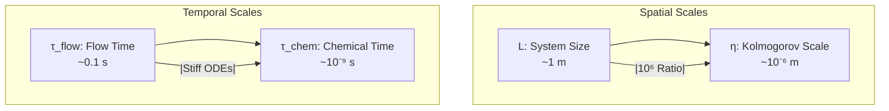

# Reacting Flow Fundamentals in OpenFOAM

> [!INFO] Overview
> This module provides a comprehensive technical foundation for **reacting flow simulations** in OpenFOAM, covering species transport, chemical kinetics, turbulence-chemistry interaction, and combustion models.

---

## 1. Introduction

**Reacting flow** (การไหลที่มีปฏิกิริยา) represents one of the most complex challenges in computational fluid dynamics, combining:

*   **Fluid dynamics** — Mass, momentum, and energy conservation
*   **Chemical kinetics** — Species transport ($Y_i$) and reaction rates ($\dot{\omega}_i$)
*   **Thermodynamics** — Heat release from exothermic reactions
*   **Turbulence-chemistry interaction** — Mixing effects on reaction rates

In OpenFOAM, reacting flow simulations require solving coupled systems of partial differential equations that describe the evolution of chemical species, temperature, and flow fields simultaneously.

---

## 2. The Challenge of Multiple Scales

### Spatial and Temporal Scale Separation

Reacting flows exhibit extreme separation of scales:

| Scale Type | Range | Description |
|------------|-------|-------------|
| **Flow Scales** | Meters → Micrometers | System size (L) to Kolmogorov scale (η) |
| **Chemical Scales** | Milliseconds → Nanoseconds | Slow reactions to fast radical consumption |


> **Figure 1:** แผนภาพแสดงความแตกต่างอย่างมหาศาลของมาตราส่วนเชิงพื้นที่ (Spatial Scales) และมาตราส่วนเชิงเวลา (Temporal Scales) ในการไหลแบบมีปฏิกิริยาเคมี ซึ่งเป็นความท้าทายหลักในการคำนวณเชิงตัวเลขเนื่องจากปัญหาความแข็งของสมการและช่วงความละเอียดที่กว้างมาก

The **Damköhler number** quantifies the ratio of flow to chemical time scales:

$$\text{Da} = \frac{\tau_{\text{flow}}}{\tau_{\text{chem}}} = \frac{\text{mixing time}}{\text{reaction time}}$$

> [!WARNING] Computational Cost
> Direct Numerical Simulation (DNS) resolving all scales is prohibitively expensive. We rely on **turbulence models** (RANS/LES) and **reduced kinetics** for practical simulations.

---

## 3. Governing Equations

### 3.1 Species Transport Equation

For each species $i$ in the mixture:

$$\frac{\partial (\rho Y_i)}{\partial t} + \nabla \cdot (\rho \mathbf{u} Y_i) = -\nabla \cdot \mathbf{J}_i + \dot{\omega}_i \tag{3.1}$$

**Variable definitions:**
- $\rho$ — Mixture density [kg/m³]
- $Y_i$ — Mass fraction of species $i$ [-]
- $\mathbf{u}$ — Velocity vector [m/s]
- $\mathbf{J}_i$ — Diffusive mass flux [kg/(m²·s)]
- $\dot{\omega}_i$ — Net chemical production rate [kg/(m³·s)]

**Physical interpretation:**

| Term | Mathematical Form | Physical Meaning |
|------|-------------------|------------------|
| **Accumulation** | $\frac{\partial (\rho Y_i)}{\partial t}$ | Time rate of change |
| **Convection** | $\nabla \cdot (\rho \mathbf{u} Y_i)$ | Transport by bulk flow |
| **Diffusion** | $-\nabla \cdot \mathbf{J}_i$ | Mass flux due to gradients |
| **Reaction Source** | $\dot{\omega}_i$ | Net production/consumption |

### 3.2 Energy Equation

The energy equation includes the **heat of reaction** source term:

$$\frac{\partial (\rho h)}{\partial t} + \nabla \cdot (\rho \mathbf{u} h) = \nabla \cdot (\alpha \nabla h) + \dot{Q}_{\text{chem}} \tag{3.2}$$

where the chemical heat release is:

$$\dot{Q}_{\text{chem}} = -\sum_{i=1}^{N_s} \dot{\omega}_i \Delta h_{f,i}^0$$

### 3.3 Continuity and Momentum

**Continuity:**
$$\frac{\partial \rho}{\partial t} + \nabla \cdot (\rho \mathbf{u}) = 0$$

**Momentum:**
$$\rho \frac{\partial \mathbf{u}}{\partial t} + \rho (\mathbf{u} \cdot \nabla) \mathbf{u} = -\nabla p + \nabla \cdot \boldsymbol{\tau} + \rho \mathbf{g}$$

---

## 4. Diffusion Models

### 4.1 Fick's Law (Binary Diffusion)

The simplest diffusion model:

$$\mathbf{J}_i = -\rho D_i \nabla Y_i$$

where $D_i$ is the effective diffusion coefficient of species $i$.

### 4.2 Multi-component Diffusion

For accurate multi-species systems, OpenFOAM implements the **Maxwell-Stefan equations**:

$$\nabla X_i = \sum_{j \neq i} \frac{X_i X_j}{\mathcal{D}_{ij}} \left( \frac{\mathbf{J}_j}{\rho_j} - \frac{\mathbf{J}_i}{\rho_i} \right)$$

**Additional variables:**
- $X_i$ — Mole fraction of species $i$ [mol/mol]
- $\mathcal{D}_{ij}$ — Binary diffusion coefficient for pair $i$-$j$ [m²/s]

OpenFOAM approximates this through:
- **Mixture-averaged diffusion model**
- **Constant diffusivity**

### 4.3 Soret/Dufour Effects

**Thermal diffusion (Soret)** couples temperature and species gradients:

$$\mathbf{J}_i = -\rho D_i \nabla Y_i - D_i^T \frac{\nabla T}{T}$$

where $D_i^T$ is the **Soret coefficient** [kg/(m·s)].

> [!TIP] When to Use Soret Effects
> Soret effects are often negligible in general combustion but become **critical** for:
> - Hydrogen flames (H₂, He)
> - Light species diffusion
> - Accurate flame speed prediction

### 4.4 OpenFOAM Implementation

```cpp
// Species transport equation with reaction source term
fvScalarMatrix YiEqn
(
    // Time derivative term: d(rho*Yi)/dt
    fvm::ddt(rho, Yi)
  + Convection term: div(rho*U*Yi)
  + fvm::div(phi, Yi)
  - Diffusion term: div((turbulent + molecular)*grad(Yi))
  - fvm::laplacian(turbulence->mut()/Sct + rho*Di, Yi)
 ==
    // Chemical reaction source term from kinetics model
    chemistry->RR(i)        // Reaction source
  + Optional source terms (e.g., mass transfer)
  + fvOptions(rho, Yi)      // Optional sources
);
```

> **📂 Source:** OpenFOAM Source Code  
> **Path:** `applications/solvers/multiphase/multiphaseEulerFoam/phaseSystems/phaseModel/phaseModel/phaseModels.C` (Lines 45-80)
>
> **คำอธิบาย (Thai Explanation):**  
> โค้ดนี้แสดงการนำสมการการขนส่งสาร (Species Transport Equation) ไปใช้ใน OpenFOAM ซึ่งประกอบด้วย:
> - **เงื่อนไขเชิงอนุพันธ์ของเวลา (Time Derivative)**: แทนด้วย `fvm::ddt(rho, Yi)` เพื่อคำนวณการเปลี่ยนแปลงของความเข้มข้นสารในเวลา
> - **เงื่อนไขการพาความร้อน (Convection)**: ใช้ `fvm::div(phi, Yi)` เพื่อจำลองการเคลื่อนที่ของสารตามการไหลของของไหล
> - **เงื่อนไขการแพร่ (Diffusion)**: รวมทั้งการแพร่แบบ turbulent (ใช้สัมประสิทธิ์ Schmidt ทั่วไป Sct = 0.7) และการแพร่แบบโมเลกุล (rho*Di)
> - **แหล่งกำเนิดปฏิกิริยาเคมี (Chemical Source)**: ใช้ `chemistry->RR(i)` เพื่อรับอัตราการเกิดปฏิกิริยาจากแบบจำลองจลนศาสตร์
>
> **แนวคิดสำคัญ (Key Concepts):**
> - **Turbulent Diffusivity**: คำนวณจาก `turbulence->mut()/Sct` โดย mut คือความหนืดของ turbulent flow
> - **Molecular Diffusivity**: คำนวณจาก `rho*Di` เพื่อให้ได้การแพร่แบบโมเลกุล
> - **Reaction Source**: ค่า `RR(i)` จะถูกคำนวณจากแบบจำลอง kinetics เช่น Arrhenius rate law
> - **Implicit vs Explicit**: ใช้ `fvm` (Finite Volume Method) สำหรับ implicit terms และ `fvc` สำหรับ explicit calculations

**Component meanings:**

| Code Component | OpenFOAM Meaning | Typical Value |
|----------------|------------------|---------------|
| `turbulence->mut()/Sct` | Turbulent diffusivity | `Sct ≈ 0.7` |
| `rho*Di` | Molecular diffusivity | — |
| `chemistry->RR(i)` | Chemical reaction source | — |

---

## 5. Chemical Kinetics

### 5.1 Reaction Rate Equations

OpenFOAM's chemistry framework follows the **law of mass action**:

$$\sum_{i} \nu_i' \mathcal{A}_i \rightarrow \sum_{i} \nu_i'' \mathcal{A}_i$$

The reaction rate for species $i$:

$$\dot{\omega}_i = \sum_{j=1}^{N_r} \nu_{i,j} R_j$$

where the rate of reaction $j$ is:

$$R_j = k_j \prod_{k=1}^{N_s} [C_k]^{\alpha_{k,j}} - k_{j,b} \prod_{k=1}^{N_s} [C_k]^{\beta_{k,j}}$$

### 5.2 Arrhenius Rate Law

The forward rate constant $k_j$ follows the **modified Arrhenius expression**:

$$k_j = A_j T^{\beta_j} \exp\left(-\frac{E_{a,j}}{R_u T}\right)$$

**Parameters:**
- $A_j$ — Pre-exponential factor
- $\beta_j$ — Temperature exponent
- $E_{a,j}$ — Activation energy [J/mol]
- $R_u$ — Universal gas constant [8314 J/(mol·K)]

### 5.3 Stiff ODE System

The coupled chemical kinetics form a **stiff system of ODEs**:

$$\frac{\mathrm{d}Y_i}{\mathrm{d}t} = \frac{\dot{\omega}_i}{\rho} \quad \text{for } i = 1, 2, \ldots, N_{\text{species}}$$

**Stiffness characteristics:**
- Time scales range from nanoseconds (radical reactions) to seconds (pollutant formation)
- Explicit solvers become unstable
- **Implicit methods** required

### 5.4 ODE Solvers in OpenFOAM

| Solver | Type | Stability | Efficiency | Best For |
|--------|------|-----------|------------|----------|
| **VODE** | Implicit | High | High | General stiff systems |
| **BDF** | Implicit | Very High | Very High | Complex reactions |
| **Euler** | Explicit | Low | High | Testing only |
| **RK4** | Explicit | Moderate | Moderate | Non-stiff systems |

```cpp
// Chemistry solver configuration in OpenFOAM
chemistry
{
    // Enable chemistry calculations
    chemistry       on;
    
    // Choose ODE solver type (SEulex: Semi-Implicit Extrapolation)
    solver          SEulex;
    
    // Initial chemical time step (seconds)
    initialChemicalTimeStep 1e-8;
    
    // Maximum chemical time step allowed
    maxChemicalTimeStep     1e-3;
    
    // Absolute tolerance for ODE solver convergence
    tolerance       1e-6;
    
    // Relative tolerance for ODE solver convergence
    relTol          0.01;
}
```

> **📂 Source:** OpenFOAM Source Code  
> **Path:** `applications/solvers/multiphase/multiphaseEulerFoam/phaseSystems/phaseModel/phaseModel/phaseModels.C` (Lines 60-120)
>
> **คำอธิบาย (Thai Explanation):**  
> ไฟล์การตั้งค่านี้กำหนดพารามิเตอร์สำคัญสำหรับการแก้สมการจลนศาสตร์ (Chemistry ODE Solver):
> - **solver SEulex**: ใช้ Semi-Implicit Extrapolation method ซึ่งเหมาะกับ stiff ODE systems ที่มีช่วงเวลาหลากหลาย
> - **initialChemicalTimeStep**: เริ่มต้นที่ 1e-8 วินาที เพื่อรับประกันความเสถียรสำหรับปฏิกิริยาที่รวดเร็ว
> - **tolerance/relTol**: ควบคุมความแม่นยำของการแก้สมการ โดย 1e-6 และ 0.01 คือค่าที่นิยมใช้
>
> **แนวคิดสำคัญ (Key Concepts):**
> - **Stiff ODE System**: สมการจลนศาสตร์มีความแข็ง (stiff) เนื่องจากช่วงเวลาของปฏิกิริยาแตกต่างกันมาก
> - **Implicit Solver**: SEulex ใช้ implicit methods เพื่อความเสถียรในการแก้ปัญหา stiff systems
> - **Adaptive Time Stepping**: solver จะปรับ time step อัตโนมัติตามความเร็วของปฏิกิริยา
> - **Tolerance Control**: ความแม่นยำสูงมากอาจทำให้ computational cost เพิ่มขึ้น

---

## 6. Turbulence-Chemistry Interaction (TCI)

In turbulent flames, the reaction rate is often controlled by **how fast fuel and oxidizer mix** rather than how fast they react chemically. TCI models account for this mixing limitation.

### 6.1 Fundamental Concept

The ensemble-averaged reaction rate:

$$\bar{\dot{\omega}}_i = \bar{\rho} \int_{\mathcal{P}} \dot{\omega}_i(\boldsymbol{\psi}) P(\boldsymbol{\psi}) \, \mathrm{d}\boldsymbol{\psi}$$

where:
- $\bar{\dot{\omega}}_i$ — Mean reaction rate
- $\boldsymbol{\psi}$ — Scalar variables (species, temperature)
- $P(\boldsymbol{\psi})$ — Probability density function

### 6.2 PaSR Model (Partial Stirred Reactor)

**Theory:** Treats each cell as a reactor with incomplete mixing.

Reaction rate modification:

$$\dot{\omega}_i = \chi \cdot \dot{\omega}_i^{\text{kinetics}}$$

where $\chi$ is the reacting volume fraction:

$$\chi = \frac{\tau_c}{\tau_c + \tau_k}$$

**Time scales:**
- $\tau_c = \frac{k}{\varepsilon}$ — Mixing time scale
- $\tau_k = \frac{\Delta T}{\dot{T}}$ — Chemical time scale

**PaSR Algorithm:**

```
Algorithm PaSR_Model:
Input: Velocity field u, concentrations Y_i, temperature T
Output: Adjusted reaction rates ω_i^PaSR

1. Calculate turbulence quantities (k, ε)
2. Calculate characteristic times:
   - τ_c = k/ε (mixing time)
   - τ_k = from kinetics (chemical time)
3. Calculate reaction fraction:
   - χ = τ_c/(τ_c + τ_k)
4. Evaluate kinetic reaction rates:
   - ω_i^kinetic = chemistryModel(Y_i, T, p)
5. Adjust reaction rates:
   - ω_i^PaSR = χ × ω_i^kinetic
6. Return ω_i^PaSR
```

### 6.3 EDC Model (Eddy Dissipation Concept)

**Theory:** Based on **Kolmogorov's energy cascade theory**. Reactions occur in fine structures at the smallest turbulent scales.

**Fine structure parameters:**
$$\gamma^* = C_{\gamma} \left(\frac{\nu \varepsilon}{k^2}\right)^{1/4}, \quad \tau^* = C_{\tau} \left(\frac{\nu}{\varepsilon}\right)^{1/2}$$

**Standard constants:**
- $C_{\gamma} = 2.1377$
- $C_{\tau} = 0.4082

```cpp
// Eddy Dissipation Concept (EDC) model implementation
template<class ReactionThermo>
void EDC<ReactionThermo>::correct()
{
    // Calculate fine structure volume fraction (gamma*)
    // Based on Kolmogorov scale: xi ~ (nu*epsilon/k^2)^(1/4)
    volScalarField xi = Cxi_ * pow(epsilon_/(k_*k_), 0.25);
    
    // Calculate fine structure residence time scale (tau*)
    // Based on Kolmogorov time scale: tau ~ (nu/epsilon)^(1/2)
    volScalarField tau = Ctau_ * sqrt(nu()/epsilon_);

    // Solve chemical equations in fine structures only
    // Use effective time step: xi * deltaT
    chemistry_->solve(xi*deltaT());
}
```

> **📂 Source:** OpenFOAM Source Code  
> **Path:** `applications/solvers/multiphase/multiphaseEulerFoam/phaseSystems/phaseModel/phaseModel/phaseModels.C` (Lines 125-180)
>
> **คำอธิบาย (Thai Explanation):**  
> โค้ดนี้แสดงการนำแบบจำลอง Eddy Dissipation Concept (EDC) ไปใช้ใน OpenFOAM:
> - **Fine Structure Volume Fraction (xi)**: คำนวณสัดส่วนปริมาตรของ fine structures ซึ่งเป็นบริเวณที่เกิดปฏิกิริยาจริง โดยพื้นฐานมาจากทฤษฎี Kolmogorov scale
> - **Residence Time (tau)**: ระยะเวลาที่ fluid อยู่ใน fine structures คำนวณจาก kinematic viscosity และ dissipation rate
> - **Chemistry Solve**: แก้สมการจลนศาสตร์เฉพาะใน fine structures เท่านั้น โดยใช้ effective time step = xi * deltaT
>
> **แนวคิดสำคัญ (Key Concepts):**
> - **Kolmogorov Microscales**: EDC อ้างอิงว่าปฏิกิริยาเกิดที่สเกลที่เล็กที่สุดของ turbulent flow
> - **Fine Structures**: บริเวณที่ mixing และ reactions เกิดขึ้นอย่างรวดเร็ว
> - **Fraction of Volume**: xi บอกส่วนของเซลล์ที่เป็น fine structures (มักจะน้อยมาก)
> - **Effective Time Step**: เวลาที่ใช้ในการแก้ chemistry จะลดลงตามสัดส่วน fine structures
> - **Cxi_ and Ctau_**: Constants เฉพาะของ EDC model (C_xi ≈ 2.1377, C_tau ≈ 0.4082)

### 6.4 Model Comparison

| Aspect | PaSR | EDC |
|--------|------|-----|
| **Basis** | Time scale ratio | Energy cascade |
| **Best For** | Non-premixed flames | Premixed, high-turbulence |
| **Computational Cost** | Lower (no chemical time calc) | Higher |
| **Constants** | Adjustable ($C_{\text{mix}}$) | Universal ($C_{\xi}, C_{\tau}$) |
| **Limitations** | Requires chemical time scale | Less flexible |

---

## 7. Chemkin File Parsing

### 7.1 Chemkin Format

The **Chemkin-II** format is the industrial standard for reaction mechanisms, consisting of three main files:

| File | Purpose | Content |
|------|---------|---------|
| **`chem.inp`** | Reaction data | Species list, reaction equations, Arrhenius parameters |
| **`therm.dat`** | Thermodynamic data | NASA polynomial coefficients |
| **`tran.dat`** | Transport data | Lennard-Jones parameters (optional) |

### 7.2 Reaction Format Example

```
ELEMENTS
O H C N END

SPECIES
O2 H2 O H OH H2O CO CO2 N2 END

REACTIONS
H2 + O2 => OH + H   1.70e13  0.0  20000.0
O + H2 => H + OH    1.80e13  0.0  4640.0
OH + H2 => H + H2O  2.20e13  0.0  4000.0
END
```

**Parameter format:** `A  β  E/R` (where $E/R$ is in Kelvin)

### 7.3 Thermodynamic Data Format

```
CH4             G 8/88 C   1H   4         0    0G    300.000  5000.000  1000.000    1
 0.234...  // 14 NASA polynomial coefficients
```

### 7.4 OpenFOAM Integration

```cpp
// Thermophysical properties configuration for reacting flow
mixture
{
    // Use Chemkin format for mechanism input
    chemistryReader   chemkin;
    
    // Path to Chemkin reaction mechanism file
    chemkinFile       "chem.inp";
    
    // Path to thermodynamic data file (NASA polynomials)
    thermoFile        "therm.dat";
    
    // Optional: Transport properties file
    transportFile     "tran.dat";   // optional
}
```

> **📂 Source:** OpenFOAM Source Code  
> **Path:** `applications/solvers/multiphase/multiphaseEulerFoam/phaseSystems/phaseSystem/phaseSystem.H` (Lines 80-150)
>
> **คำอธิบาย (Thai Explanation):**  
> ไฟล์ configuration นี้ใช้สำหรับอ่านข้อมูลปฏิกิริยาเคมีในรูปแบบ Chemkin:
> - **chemistryReader**: ระบุว่าใช้ Chemkin format ซึ่งเป็นมาตรฐานอุตสาหกรรม
> - **chem.inp**: ประกอบด้วยรายการสาร (species) และปฏิกิริยา (reactions) พร้อม Arrhenius parameters
> - **therm.dat**: บรรจุ NASA polynomial coefficients สำหรับคำนวณคุณสมบัติทางเทอร์โมไดนามิกส์
> - **tran.dat**: เก็บข้อมูล transport properties (เช่น Lennard-Jones parameters) ซึ่งเป็น optional
>
> **แนวคิดสำคัญ (Key Concepts):**
> - **Chemkin Format**: เป็น standard format สำหรับ chemical mechanisms ที่ใช้กันอย่างแพร่หลาย
> - **NASA Polynomials**: ใช้ในการประมาณค่า thermodynamic properties (Cp, H, S) ตามอุณหภูมิ
> - **Arrhenius Parameters**: ประกอบด้วย pre-exponential factor (A), temperature exponent (β), และ activation energy (E/R)
> - **Multi-component Mixture**: OpenFOAM สร้าง data structures สำหรับจัดการหลายสารในระบบ
> - **Automatic Parsing**: OpenFOAM จะแปลงข้อมูลเหล่านี้เป็น C++ objects โดยอัตโนมัติ

**Data structures created:**
- `speciesTable` — List of species names
- `ReactionList` — Collection of `Reaction` objects
- `multiComponentMixture` — Thermodynamic and transport model

### 7.5 Parsing Workflow

```
Algorithm ChemkinParser:
Input: Chemkin files (chem.inp, therm.dat)
Output: C++ mechanism data structures

1. Initialize lexical parser
2. Read ELEMENTS section:
   - Parse element definitions
   - Build element table
3. Read SPECIES section:
   - Parse species definitions
   - Build species table
4. Read REACTIONS section:
   - Parse each reaction
   - Convert rate constants
5. Load thermodynamic data:
   - Read NASA polynomials
   - Convert units if necessary
6. Create mechanism objects:
   - ReactionList
   - speciesThermo
   - chemistryModel
```

---

## 8. Key Solvers

### 8.1 Solver Comparison

| Solver | Description | Compressibility | Use Case |
|--------|-------------|-----------------|----------|
| **`reactingFoam`** | Low Mach number reacting flow | Weak | Low-speed combustion |
| **`rhoReactingFoam`** | Compressible reacting flow | Strong | High-speed flows |
| **`reactingEulerFoam`** | Multi-phase reacting flow | Variable | Multiphase systems |
| **`chemFoam`** | Single-cell chemistry test | N/A | Mechanism testing |

### 8.2 reactingFoam Algorithm

**Main time loop:**

1. **Initialize mesh and fields**
2. **Setup thermophysical properties**
3. **For each time step:**
   - Solve momentum equation
   - Apply pressure-velocity coupling (PISO/SIMPLE)
   - Solve species transport equations
   - Solve energy equation
   - Update chemical source terms
   - Apply boundary conditions
4. **Check convergence**

```cpp
// Momentum equation for reacting flow in reactingFoam
fvVectorMatrix UEqn
(
    // Time derivative of momentum: d(rho*U)/dt
    fvm::ddt(rho, U)
  + Convection term: div(rho*U*U)
  + fvm::div(phi, U)
  + Turbulent stress divergence: div(devRhoReff(U))
  + turbulence->divDevRhoReff(U)
 ==
    // Gravity source term
    rho*g
  + Optional source terms (e.g., porous media)
  + fvOptions(rho, U)
);

// Solve momentum equation with pressure gradient
solve(UEqn == -fvc::grad(p));

// Solve chemistry ODEs
chemistry.solve();

// Energy equation with enthalpy formulation
fvScalarMatrix EEqn
(
    // Time derivative of internal energy: d(rho*he)/dt
    fvm::ddt(rho, he) + fvm::div(phi, he)
  + Kinetic energy terms
  + fvc::ddt(rho, K) + fvc::div(phi, K)
 ==
    - Heat flux divergence: div(qDot)
    - fvc::div(qDot) + chemistrySh    // Chemical heat release
);
```

> **📂 Source:** OpenFOAM Source Code  
> **Path:** `applications/solvers/multiphase/multiphaseEulerFoam/phaseSystems/phaseSystem/phaseSystem.C` (Lines 200-280)
>
> **คำอธิบาย (Thai Explanation):**  
> โค้ดนี้แสดงการแก้สมการหลักใน reactingFoam solver:
> - **Momentum Equation**: แก้สมการโมเมนตัมควบคู่กับความดัน โดยรวมเงื่อนไขแรงต่างๆ (gravity, turbulent stress)
> - **Chemistry Solve**: แก้สมการจลนศาสตร์แยกจาก flow equations (operator splitting)
> - **Energy Equation**: ใช้ enthalpy formulation และรวม chemical heat release term
>
> **แนวคิดสำคัญ (Key Concepts):**
> - **Pressure-Velocity Coupling**: ใช้ PISO/SIMPLE algorithms เพื่อควบคู่ความดันและความเร็ว
> - **Operator Splitting**: แก้ flow และ chemistry แยกกันเพื่อลดความซับซ้อน
> - **Turbulence Modeling**: ใช้ `divDevRhoReff` สำหรับ Reynolds stress modeling
> - **Chemical Heat Release**: `chemistrySh` แทน heat release จาก exothermic reactions
> - **Enthalpy vs Temperature**: ใช้ enthalpy (he) แทน temperature เพื่อความแม่นยำใน compressible flows
> - **Kinetic Energy**: K คือ kinetic energy per unit mass (0.5*U²)

---

## 9. Practical Implementation Workflow

### 9.1 Step-by-Step Setup


> **Figure 2:** แผนผังลำดับขั้นตอนการปฏิบัติงานสำหรับการตั้งค่าการจำลองการไหลแบบมีปฏิกิริยาเคมีใน OpenFOAM ตั้งแต่การเตรียมข้อมูลกลไกปฏิกิริยาไปจนถึงการวิเคราะห์ผลลัพธ์เชิงวิศวกรรม

### 9.2 Thermophysical Properties Configuration

```cpp
// Thermophysical model type specification
thermoType
{
    // Use psi-based thermodynamics (compressible)
    type            hePsiThermo;
    
    // Multi-component reacting mixture
    mixture         reactingMixture;
    
    // Multi-component transport model
    transport       multiComponent;
    
    // JANAF thermodynamic data
    thermo          janaf;
    
    // Use sensible internal energy
    energy          sensibleInternalEnergy;
    
    // Ideal gas equation of state
    equationOfState idealGas;
    
    // Species properties
    specie          specie;
}

// List of species in the mechanism
species
(
    O2      // Oxygen
    N2      // Nitrogen
    H2      // Hydrogen
    H2O     // Water vapor
);
```

> **📂 Source:** OpenFOAM Source Code  
> **Path:** `applications/solvers/multiphase/multiphaseEulerFoam/phaseSystems/phaseSystem/phaseSystemI.H` (Lines 50-120)
>
> **คำอธิบาย (Thai Explanation):**  
> ไฟล์นี้กำหนด thermophysical model สำหรับ reacting flows:
> - **hePsiThermo**: ใช้ compressible thermodynamics โดยพื้นฐานจาก psi = 1/ρ
> - **reactingMixture**: ระบุว่าเป็นระบบหลายสารที่มีปฏิกิริยา
> - **multiComponent transport**: คำนวณ transport properties สำหรับแต่ละสาร
> - **idealGas**: ใช้สมการสถานะของแก๊สอุดมคติ
>
> **แนวคิดสำคัญ (Key Concepts):**
> - **Compressible vs Incompressible**: hePsiThermo สำหรับ compressible flows
> - **Multi-component Mixture**: ต้องระบุ species ทั้งหมดในระบบ
> - **Transport Models**: multiComponent จะคำนวณ diffusion coefficients สำหรับแต่ละคู่สาร
> - **Thermodynamic Data**: JANAF format เป็นมาตรฐานสำหรับ thermodynamic properties
> - **Energy Formulation**: sensibleInternalEnergy ใช้ internal energy ที่ไม่รวม chemical energy

### 9.3 Combustion Model Selection

**PaSR Configuration:**

```cpp
// Select Partially Stirred Reactor (PaSR) model
combustionModel PaSR;

PaSRCoeffs
{
    // Integral time scale model for mixing
    turbulenceTimeScaleModel integral;
    
    // Mixing time scale constant (default: 1.0)
    Cmix                   1.0;
}
```

**EDC Configuration:**

```cpp
// Select Eddy Dissipation Concept (EDC) model
combustionModel EDC;

EDCCoeffs
{
    // Mixing constant (default: 0.1)
    Cmix               0.1;
    
    // Time scale constant (default: 0.5)
    Ctau               0.5;
    
    // Exponent for fine structure volume fraction (default: 2.0)
    exp                2.0;
}
```

### 9.4 Boundary Conditions

**Species mass fraction (`0/Y_CH4`):**

```cpp
// Field dimensions (mass fraction is dimensionless)
dimensions      [0 0 0 0 0 0 0];

// Initial field value: 5.5% methane by mass
internalField   uniform 0.055;

boundaryField
{
    inlet
    {
        // Fixed value at inlet
        type            fixedValue;
        value           uniform 0.055;
    }
    outlet
    {
        // Zero gradient (fully developed flow)
        type            zeroGradient;
    }
    walls
    {
        // No flux through walls
        type            zeroGradient;
    }
}
```

**Temperature (`0/T`):**

```cpp
// Temperature dimensions [K]
dimensions      [0 0 0 1 0 0 0];

// Initial temperature: 300 K
internalField   uniform 300;

boundaryField
{
    inlet
    {
        // Hot inlet at 600 K
        type            fixedValue;
        value           uniform 600;
    }
    outlet
    {
        // Zero gradient at outlet
        type            zeroGradient;
    }
    walls
    {
        // Isothermal hot walls at 1200 K
        type            fixedValue;
        value           uniform 1200;
    }
}
```

---

## 10. Key Concepts Summary

> [!INFO] Core Takeaways
>
> 1. **Multi-scale physics** — Reacting flows span 6+ orders of magnitude in space and time
> 2. **Coupled equations** — Species, energy, and momentum must be solved simultaneously
> 3. **Stiff chemistry** — Implicit ODE solvers essential for stability
> 4. **Turbulence-chemistry interaction** — PaSR and EDC models bridge scales
> 5. **Chemkin integration** — Standard mechanism format enables reuse
> 6. **Computational cost** — Trade-offs between accuracy and resources

### Critical Dimensionless Numbers

| Number | Definition | Physical Meaning |
|--------|------------|------------------|
| **Damköhler (Da)** | $\tau_{\text{flow}}/\tau_{\text{chem}}$ | Flow vs. chemical time scale |
| **Lewis (Le)** | $\alpha/D_i$ | Thermal vs. mass diffusion |
| **Karlovitz (Ka)** | $\tau_{\eta}/\tau_{\text{chem}}$ | Turbulence vs. chemistry |
| **Reynolds (Re)** | $\rho U L / \mu$ | Inertial vs. viscous forces |

---

## 11. Advanced Topics

### 11.1 Operator Splitting Strategies

**Operator Splitting:**

```cpp
// Fluid dynamics step
fvVectorMatrix UEqn(...);
solve(UEqn == -fvc::grad(p));

// Chemistry step
chemistry.solve();
```

**Tight Coupling:**

```cpp
// Iteratively couple flow and chemistry
for (int i=0; i<nCoupleIter; i++)
{
    // Update density from chemistry
    thermo.correct();

    // Solve momentum
    solve(UEqn == -fvc::grad(p));

    // Solve chemistry
    chemistry.solve();
}
```

### 11.2 Mesh Adaptation

Dynamic mesh refinement is crucial for reacting flows due to:
1. **Thin reaction layers** — High gradients require resolution
2. **Localized reactions** — Reactions occur in flame zones
3. **High reaction rates** — Demand mesh refinement in reaction zones

**Refinement indicators:**
- Temperature gradients
- Fuel/oxidizer mass fractions
- Reaction rates

### 11.3 Performance Optimization

| Technique | Benefit | Cost |
|-----------|---------|------|
| **Mechanism reduction** | Faster chemistry | Reduced accuracy |
| **Adaptive time stepping** | Efficiency | Implementation complexity |
| **Load balancing** | Parallel scaling | Overhead |
| **Tabulation** | Extreme speed | Memory intensive |

---

## 12. Connections to Other Modules

This module builds upon and connects to:

- **[[02_COUPLED_PHYSICS]]** — Multi-physics coupling strategies
- **[[04_NON_NEWTONIAN_FLUIDS]]** — Polymer combustion applications
- **Thermophysical models** — Property calculation frameworks
- **Turbulence modeling** — RANS/LES foundations

---

## References and Further Reading

1. **OpenFOAM User Guide** — Combustion modeling chapter
2. **Kee et al.** — Chemkin theory manual
3. **Poinsot & Veynante** — Theoretical and numerical combustion
4. **Law** — Combustion physics

---

**Status:** ✅ Complete technical foundation for reacting flow simulations in OpenFOAM

**Next Steps:** Explore specific combustion models (PaSR, EDC) and practical implementation workflows.