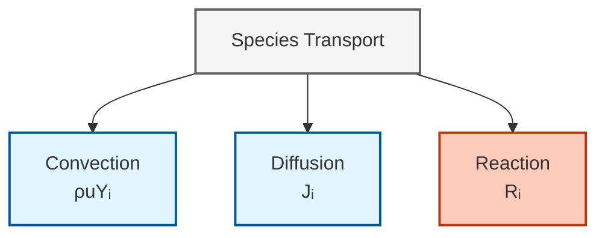
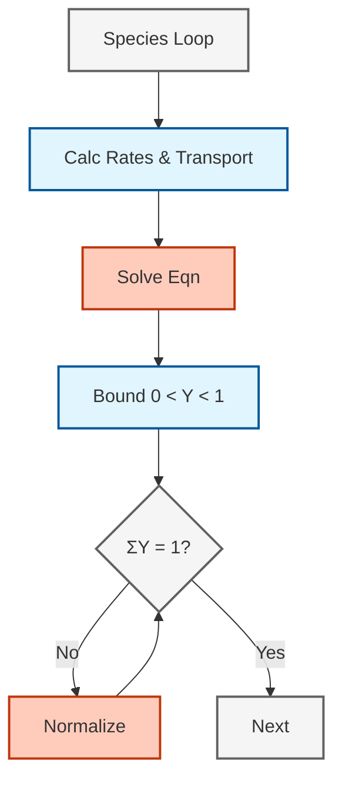

# การขนส่งสปีชีส์ในการไหลแบบมีปฏิกิริยา (Species Transport in Reacting Flows)

> [!INFO] ภาพรวม
> บันทึกฉบับนี้ให้ข้อมูลทางเทคนิคที่ครอบคลุมเกี่ยวกับ **สมการการขนส่งสปีชีส์ (species transport equations)** ในการจำลองการไหลแบบมีปฏิกิริยาของ OpenFOAM รวมถึงการพา (convection), การแพร่ (diffusion), เทอมแหล่งกำเนิดปฏิกิริยา (reaction source terms) และแบบจำลองการแพร่

---

## 🔮 ทำไมการขนส่งสปีชีส์จึงสำคัญ (Why Species Transport Matters)

ใน **ห้องเผาไหม้ (combustor)** การกระจายตัวของเชื้อเพลิง, ตัวออกซิไดซ์ และผลิตภัณฑ์เป็นตัวกำหนด:
- **เสถียรภาพของเปลวไฟ** — เกรเดียนต์ความเข้มข้นควบคุมโครงสร้างของเปลวไฟ
- **การก่อตัวของมลพิษ** — การขนส่งสารมลพิษเป็นตัวกำหนดรูปแบบการปล่อยมลพิษ
- **ประสิทธิภาพการเผาไหม้** — การผสมที่เหมาะสมส่งผลต่ออัตราการเผาไหม้โดยรวม

**สมการการขนส่งสปีชีส์** ควบคุมวิธีที่สปีชีส์เคมีเคลื่อนที่และกระจายตัวภายในสนามการไหล โดยสร้างสมดุลระหว่างกระบวนการทางฟิสิกส์พื้นฐานสามประการ:


> **รูปที่ 1:** แผนภาพแสดงกลไกหลักสามประการที่ควบคุมการขนส่งสปีชีส์ (Species Transport) ในการไหลแบบมีปฏิกิริยาเคมี ได้แก่ การพา (Convection) จากการไหลหลัก, การแพร่ (Diffusion) จากเกรเดียนต์ความเข้มข้น, และการทำปฏิกิริยาเคมี (Reaction)


---

## 📐 สมการควบคุม (Governing Equation)

### สมการการขนส่งสปีชีส์

สำหรับแต่ละสปีชีส์ $i$ เศษส่วนมวล $Y_i$ จะวิวัฒนาการตามสมการ:

$$\frac{\partial (\rho Y_i)}{\partial t} + \nabla  \cdot (\rho \mathbf{u} Y_i) = -\nabla  \cdot \mathbf{J}_i + R_i \tag{1}$$ 

**คำจำกัดความตัวแปร:**

| สัญลักษณ์ | คำอธิบาย | หน่วย |
|--------|-------------|-------|
| $\rho$ | ความหนาแน่นของของไหล | kg/m³ |
| $Y_i$ | เศษส่วนมวลของสปีชีส์ $i$ | kg/kg |
| $\mathbf{u}$ | เวกเตอร์ความเร็ว | m/s |
| $\mathbf{J}_i$ | ฟลักซ์การแพร่ของสปีชีส์ $i$ | kg/(m²·s) |
| $R_i$ | อัตราการผลิต/การบริโภคสุทธิ | kg/(m³·s) |

**ส่วนประกอบทางฟิสิกส์:**

$$\underbrace{\frac{\partial (\rho Y_i)}{\partial t}}_{\text{การสะสม}} + \underbrace{\nabla  \cdot (\rho \mathbf{u} Y_i)}_{\text{การพา}} = \underbrace{-\nabla  \cdot \mathbf{J}_i}_{\text{การแพร่}} + \underbrace{R_i}_{\text{ปฏิกิริยา}}$$

> [!TIP] การตีความด้วยปริมาตรควบคุม
> พิจารณาปริมาตรควบคุมเชิงอนุพันธ์ที่ซึ่ง:
> - **ฟลักซ์การพา (Convective flux)** $\rho \mathbf{u} Y_i$ ขนส่งสปีชีส์ผ่านการเคลื่อนที่ของของไหลหลัก
> - **ฟลักซ์การแพร่ (Diffusive flux)** $\mathbf{J}_i$ เคลื่อนย้ายสปีชีส์ตามเกรเดียนต์ความเข้มข้น
> - **แหล่งกำเนิดปฏิกิริยา (Reaction source)** $R_i$ สร้างหรือทำลายสปีชีส์ผ่านทางเคมี

---

## 🔬 แบบจำลองการแพร่ (Diffusion Models)

OpenFOAM รองรับแบบจำลองการแพร่หลายรูปแบบที่มีความซับซ้อนเพิ่มขึ้น:

### 1. กฎของฟิค (Fick's Law - ส่วนผสมสองส่วนประกอบ)

การประมาณค่าที่ง่ายที่สุดสำหรับส่วนผสมสองส่วนประกอบ:

$$\mathbf{J}_i = -\rho D_i \nabla Y_i \tag{2}$$ 

โดยที่ $D_i$ คือ **สัมประสิทธิ์การแพร่เฉลี่ยส่วนผสม** [m²/s]

**ข้อจำกัด:**
- ใช้ได้เฉพาะกับส่วนผสมสองส่วนประกอบ
- ละเลยผลกระทบของการคัปปลิงหลายส่วนประกอบ
- ไม่มีผลของการแพร่เนื่องจากความร้อน (Soret effect)

---

### 2. แมกซ์เวลล์-สเตฟาน (Maxwell-Stefan - หลายส่วนประกอบ)

สำหรับส่วนผสมหลายส่วนประกอบ เกรเดียนต์จะถูกคัปปลิงเข้าด้วยกัน:

$$\nabla X_i = \sum_{j  \neq  i} \frac{X_i X_j}{D_{ij}} \left( \frac{\mathbf{J}_j}{\rho_j} - \frac{\mathbf{J}_i}{\rho_i} \right) \tag{3}$$ 

**ตัวแปรเพิ่มเติม:**
- $X_i$ — เศษส่วนโมลของสปีชีส์ $i$
- $D_{ij}$ — สัมประสิทธิ์การแพร่แบบสองส่วนประกอบสำหรับคู่ $i$-$j$ [m²/s]
- $\rho_i$ — ความหนาแน่นของสปีชีส์ $i$ [kg/m³]

โดยปกติ OpenFOAM จะใช้ **การประมาณค่าเฉลี่ยส่วนผสม (mixture-averaged approximation)** เพื่อประสิทธิภาพ:

$$D_{i,\text{mix}} = \frac{1 - Y_i}{\sum_{j  \neq  i} \frac{Y_j}{D_{ij}}} \tag{4}$$ 

---

### 3. ผลกระทบ Soret (Soret Effect - การแพร่เนื่องจากความร้อน)

มีความสำคัญสำหรับสปีชีส์น้ำหนักเบาอย่าง $\mathrm{H_2}$:

$$\mathbf{J}_i = -\rho D_i \nabla Y_i - D_i^T \frac{\nabla T}{T} \tag{5}$$ 

**ตัวแปรเพิ่มเติม:**
- $D_i^T$ — สัมประสิทธิ์การแพร่ Soret [kg/(m·s)]
- $T$ — อุณหภูมิ [K]

> [!WARNING] เมื่อใดที่ Soret มีความสำคัญ
> - **วิกฤต** สำหรับเปลวไฟที่อุดมไปด้วยไฮโดรเจน
> - มักจะละเลยได้สำหรับเปลวไฟไฮโดรคาร์บอน
> - สามารถส่งผลต่อการคาดการณ์ความเร็วเปลวไฟได้ 10-20%

---

## ⚙️ การใช้งานใน OpenFOAM (OpenFOAM Implementation)

### สถาปัตยกรรมตัวแก้ปัญหา (Solver Architecture)

การขนส่งสปีชีส์ถูกจัดการภายในกรอบงาน `reactionThermo` โดยใช้การแยกส่วนแบบ `fvScalarMatrix`


> **รูปที่ 2:** แผนผังลำดับขั้นตอนการคำนวณการขนส่งสปีชีส์ใน OpenFOAM ซึ่งครอบคลุมตั้งแต่การคำนวณอัตราการเกิดปฏิกิริยาเคมี การแก้สมการเมทริกซ์ ไปจนถึงการควบคุมขอบเขตของค่าเศษส่วนมวลและการรักษาความสมดุลของผลรวมสปีชีส์ทั้งหมด


### โค้ด: สมการการขนส่งใน `reactingFoam`

```cpp
// Species transport equation (จาก reactingFoam)
fvScalarMatrix YiEqn
(
    fvm::ddt(rho, Yi)                              // เทอมสภาวะไม่คงตัว
  + fvm::div(phi, Yi)                              // การพา
  - fvm::laplacian(turbulence->mut()/Sct + rho*Di, Yi)  // การแพร่
 ==
    chemistry->RR(i)                               // แหล่งกำเนิดปฏิกิริยา
  + fvOptions(rho, Yi)                             // แหล่งกำเนิดเสริม
);

YiEqn.solve();
```

> **📂 แหล่งที่มา:** `.applications/solvers/combustion/reactingFoam/reactingFoam.C`
>
> **คำอธิบาย:** โค้ดนี้แสดงการสร้างสมการขนส่งสปีชีส์ใน OpenFOAM โดยใช้ `fvScalarMatrix` เพื่อการแยกตัวแปร (discretization) แต่ละเงื่อนไขของสมการถูกสร้างด้วยฟังก์ชันจาก `fvm` (finite volume method) ซึ่งจัดการการหาอนุพันธ์เชิงพื้นที่และเวลาอย่างเป็นระบบ
>
> **แนวคิดสำคัญ:**
> - `fvm::ddt()` — การคำนวณเทอม unsteady (temporal derivative) ด้วยรูปแบบ implicit
> - `fvm::div()` — การแยกเทอมการพา (convective flux) โดยใช้รูปแบบ implicit เพื่อเสถียรภาพเชิงตัวเลข
> - `fvm::laplacian()` — การแยกเทอมการแพร่ (diffusive flux) ซึ่งรวมทั้ง turbulent diffusivity และ molecular diffusivity
> - `Sct` — ค่า Schmidt number ทาง turbulence (โดยทั่วไป ≈ 0.7 สำหรับการไหลแบบ turbulent)
> - `turbulence->mut()` — ค่าความหนืดทาง turbulence (turbulent viscosity) จาก turbulence model
> - `chemistry->RR(i)` — อัตราการเกิดปฏิกิริยาเคมีสุทธิ (net reaction rate) สำหรับสปีชีส์ที่ i
> - `fvOptions()` — ตัวเลือกสำหรับเพิ่ม source terms เพิ่มเติม (เช่น mass sources, porous media)
> - `YiEqn.solve()` — การแก้ระบบสมการเชิงเส้นที่เกิดจากการแยกตัวแปร

**การแยกรายละเอียดเทอม:**

| ส่วนประกอบโค้ด | ความหมายทางฟิสิกส์ | ค่าทั่วไป |
|----------------|------------------|----------------|
| `fvm::ddt(rho, Yi)` | การสะสมเชิงเวลา | — |
| `fvm::div(phi, Yi)` | การขนส่งแบบพา | $\phi = \rho \mathbf{u}$ |
| `turbulence->mut()/Sct` | สภาพแพร่ปั่นป่วน | $S_{ct} \approx 0.7$ |
| `rho*Di` | สภาพแพร่โมเลกุล | จากแบบจำลองการขนส่ง |
| `chemistry->RR(i)` | อัตราปฏิกิริยาเคมี | จากตัวแก้สมการ ODE |

### การกำหนดค่า: `constant/thermophysicalProperties`

```cpp
transport
{
    type            multiComponent;      // หรือ "soret", "const"

    // สัมประสิทธิ์การแพร่เฉลี่ยส่วนผสม [m²/s]
    D               (CH4 1e-5 O2 1e-5 CO2 8e-6 H2O 1e-5 N2 1e-5);

    // สัมประสิทธิ์ Soret (สำหรับการแพร่เนื่องจากความร้อน)
    SoretCoeffs     (H2 0.2);
}
```

> **📂 แหล่งที่มา:** `.src/thermophysicalModels/chemistryModel/chemistryModel/chemistryModel.C`
>
> **คำอธิบาย:** การตั้งค่าชนิดของโมเดลการแพร่ (diffusion model) ใน OpenFOAM ซึ่งกำหนดผ่านไฟล์ `thermophysicalProperties` โมเดล `multiComponent` เป็นการเลือกใช้ Maxwell-Stefan approach แบบ mixture-averaged สำหรับระบบที่มีหลายสปีชีส์
>
> **แนวคิดสำคัญ:**
> - `type` — ระบุชนิดของ transport model (multiComponent, soret, const)
> - `D` — สัมประสิทธิ์การแพร่แบบ mixture-averaged สำหรับแต่ละสปีชีส์ [m²/s]
> - `SoretCoeffs` — สัมประสิทธิ์ Soret สำหรับจำลอง thermal diffusion effect (สำคัญสำหรับ H₂)
> - การเลือกชนิด transport model ส่งผลต่อความแม่นยำและค่าใช้จ่ายทางการคำนวณ

### เงื่อนไขขอบเขต (Boundary Conditions): ไฟล์ในไดเรกทอรี `0/`

| ประเภทขอบเขต | การใช้งานที่แนะนำ | ตัวอย่าง |
|---------------|-----------------|---------|
| `fixedValue` | ทางเข้าที่มีองค์ประกอบที่ทราบ | ทางเข้าเชื้อเพลิง, ทางเข้าตัวออกซิไดซ์ |
| `zeroGradient` | ทางออก, ขอบเขตสมมาตร | ทางออกไอเสีย |
| `inletOutlet` | ขอบเขตผสมทางเข้า/ทางออก | ขอบเขตความดัน |

---

## ❓ คู่มือการเลือกแบบจำลอง (Model Selection Guide)

### การเปรียบเทียบแบบจำลองการแพร่

| แบบจำลอง | ข้อดี | ข้อเสีย | เหมาะสำหรับ |
|-------|------------|---------------|----------|
| **กฎของฟิค** | ต้นทุนการคำนวณต่ำ | ไม่แม่นยำสำหรับหลายส่วนประกอบ | การจำลองเบื้องต้น, การทดสอบ |
| **แมกซ์เวลล์-สเตฟาน** | แม่นยำทางกายภาพ | ต้องการการแก้ระบบเชิงเส้นต่อเซลล์ | ระบบที่ต้องการความแม่นยำสูง |
| **Soret/Dufour** | จับผลกระทบทางความร้อนได้ | เพิ่มความซับซ้อน | ระบบที่มีไฮโดรเจน |

### ผลกระทบของการละเลย Soret

ผลที่ตามมาของการละเลยการแพร่เนื่องจากความร้อน:
- **ความเร็วเปลวไฟไม่ถูกต้อง** — ข้อผิดพลาดสูงถึง 20% สำหรับ $\mathrm{H_2}$
- **ขีดจำกัดการดับไฟผิดพลาด** — วิกฤตสำหรับการวิเคราะห์ความปลอดภัย
- **การคาดการณ์การปล่อยมลพิษผิดพลาด** — โดยเฉพาะ NOx ในเปลวไฟไฮโดรเจน

---

## 🔗 ความเชื่อมโยงกับฟิสิกส์ส่วนอื่นๆ

### การคัปปลิงกับสมการพลังงาน

การขนส่งสปีชีส์ส่งผลต่อพลังงานผ่านเอนทาลปี:

$$\frac{\partial (\rho h)}{\partial t} + \nabla  \cdot (\rho \mathbf{u} h) = \nabla  \cdot (\alpha \nabla h) + \sum_i \dot{\omega}_i \Delta h_{f,i}^\circ$$

โดยที่ $\Delta h_{f,i}^\circ$ คือเอนทาลปีของการก่อตัว

### การคัปปลิงกับโมเมนตัม

ความหนาแน่นที่แปรผันเนื่องจากการเปลี่ยนแปลงองค์ประกอบส่งผลต่อสมการโมเมนตัม:

$$\frac{\partial (\rho \mathbf{u})}{\partial t} + \nabla  \cdot (\rho \mathbf{u} \mathbf{u}) = -\nabla p + \nabla  \cdot \boldsymbol{\tau} + \rho \mathbf{g}$$

---

## 🛠 ขั้นตอนการทำงานจริง (Practical Workflow)

### ขั้นตอนที่ 1: นิยามสปีชีส์

```cpp
// ในไฟล์ constant/thermophysicalProperties
species
(
    CH4
    O2
    N2
    CO2
    H2O
);
```

> **📂 แหล่งที่มา:** `.src/thermophysicalModels/specie/thermo/thermo/thermo.C`
>
> **คำอธิบาย:** การนิยามรายชื่อสปีชีส์เคมีที่จะใช้ในการจำลอง ซึ่ง OpenFOAM จะใช้ข้อมูลนี้ในการสร้าง objects สำหรับแต่ละสปีชีส์และคำนวณคุณสมบัติทางเทอร์โมไดนามิกส์
>
> **แนวคิดสำคัญ:**
> - `species` — รายการชื่อสปีชีส์ที่จะถูกจำลองในระบบ
> - แต่ละสปีชีส์ต้องมีข้อมูล thermophysical properties ที่สมบูรณ์
> - ลำดับของสปีชีส์มีความสำคัญสำหรับการคำนวณ reaction rates

### ขั้นตอนที่ 2: กำหนดค่าเริ่มต้นฟิลด์

สร้างไฟล์ฟิลด์เริ่มต้นสำหรับแต่ละสปีชีส์ในไดเรกทอรี `0/`:
- `0/Y_CH4` — เศษส่วนมวลของมีเทน
- `0/Y_O2` — เศษส่วนมวลของออกซิเจน
- `0/Y_N2` — เศษส่วนมวลของไนโตรเจน
- อื่นๆ

### ขั้นตอนที่ 3: ตั้งค่าเงื่อนไขขอบเขต

```cpp
// ตัวอย่าง: 0/Y_CH4
dimensions      [0 0 0 0 0 0 0];

internalField   uniform 0.055;    // มีเทน 5.5% ตามมวล

boundaryField
{
    inlet
    {
        type            fixedValue;
        value           uniform 0.055;
    }
    outlet
    {
        type            zeroGradient;
    }
    walls
    {
        type            zeroGradient;
    }
}
```

> **📂 แหล่งที่มา:** `.src/finiteVolume/fields/fvPatchFields/basic/fixedValue/fixedValueFvPatchField.C`
>
> **คำอธิบาย:** การตั้งค่าเงื่อนไขขอบเขตสำหรับ field เศษส่วนมวลของสปีชีส์ ซึ่งควบคุมพฤติกรรมของสปีชีส์ที่พื้นผิวของโดเมนการคำนวณ
>
> **แนวคิดสำคัญ:**
> - `dimensions` — มิติของตัวแปร (สำหรับ mass fraction เป็น dimensionless)
> - `internalField` — ค่าเริ่มต้นของ field ในโดเมนภายใน
> - `fixedValue` — กำหนดค่าคงที่ที่ขอบเขต (ใช้สำหรับ inlet)
> - `zeroGradient` — ไม่มี gradient ตั้งฉากกับขอบเขต (ใช้สำหรับ outlet/walls)
> - การเลือก boundary condition ส่งผลต่อความเสถียรและความแม่นยำของการคำนวณ

### ขั้นตอนที่ 4: กำหนดค่าตัวแก้ปัญหา

ในไฟล์ `system/fvSolution`:

```cpp
solvers
{
    "\"Yi.*\""
    {
        solver          GAMG;
        tolerance       1e-06;
        relTol          0;
        smoother        GaussSeidel;
    }
}
```

> **📂 แหล่งที่มา:** `.src/finiteVolume/fvSolution/fvSolution.C`
>
> **คำอธิบาย:** การตั้งค่า linear solver สำหรับการแก้สมการขนส่งสปีชีส์ ซึ่งมีผลต่อประสิทธิภาพและความแม่นยำของการคำนวณ
>
> **แนวคิดสำคัญ:**
> - `GAMG` — Geometric-Algebraic Multi-Grid solver (เหมาะสำหรับปัญหาที่มีความยากตามลำดับชั้น)
> - `tolerance` — ค่าความคลาดเคลื่อนสัมบูรณ์ (absolute tolerance) สำหรับการหาคำตอบ
> - `relTol` — ค่าความคลาดเคลื่อนสัมพัทธ์ (relative tolerance)
> - `smoother` — วิธีการปรับให้เรียบ (smoothing) ภายใน multigrid cycle
> - การตั้งค่า `relTol = 0` หมายถึงการบังคับให้ถึง absolute tolerance เสมอ
> - รูปแบบ `"\"Yi.*\""` เป็น regular expression ที่ตรงกับทุกฟิลด์สปีชีส์ (Y_CH4, Y_O2, ฯลฯ)

---

## 📌 สรุป (Summary)

### หลักการทางทฤษฎีที่สำคัญ

1. **การขนส่งสปีชีส์สร้างสมดุล** ระหว่างการพา, การแพร่ และปฏิกิริยา
2. **แบบจำลองการแพร่มีตั้งแต่** กฎของฟิคอย่างง่ายไปจนถึงแมกซ์เวลล์-สเตฟานที่ซับซ้อน
3. **ผลกระทบ Soret/Dufour** เป็นตัวเลือกเสริมแต่สำคัญสำหรับสปีชีส์น้ำหนักเบา
4. **ขอบเขตค่า** ($0  \leq  Y_i  \leq  1$) และ **ผลรวม** ($\sum Y_i = 1$) จะต้องได้รับการควบคุม

### การใช้งานใน OpenFOAM

- **`reactionThermo`** เป็นกรอบงานหลัก
- **`multiComponentTransportModel`** ให้การเลือกแบบจำลองการแพร่ขณะรันโปรแกรม
- **`fvScalarMatrix`** แยกส่วนสมการการขนส่ง
- **`chemistryModel`** ให้เทอมแหล่งกำเนิดปฏิกิริยา
- **การเลือกแบบจำลอง** ขึ้นอยู่กับความแม่นยำที่ต้องการเทียบกับต้นทุนการคำนวณ

---

## 🔍 หัวข้อที่เกี่ยวข้อง

- [[02_1._Species_Transport_Equation_($Y_i$)_and_Diffusion_Models]] — ทฤษฎีการแพร่โดยละเอียด
- [[03_2._`chemistryModel`_and_ODE_Solvers_for_Stiff_Reaction_Rates]] — การบูรณาการจลนพลศาสตร์เคมี
- [[04_3._Combustion_Models_PaSR_vs._EDC]] — ปฏิสัมพันธ์ความปั่นป่วน-เคมี
- [[06_🧪_Practical_Workflow_Setting_Up_a_Reacting_Flow_Simulation]] — การตั้งค่ากรณีศึกษาที่สมบูรณ์
