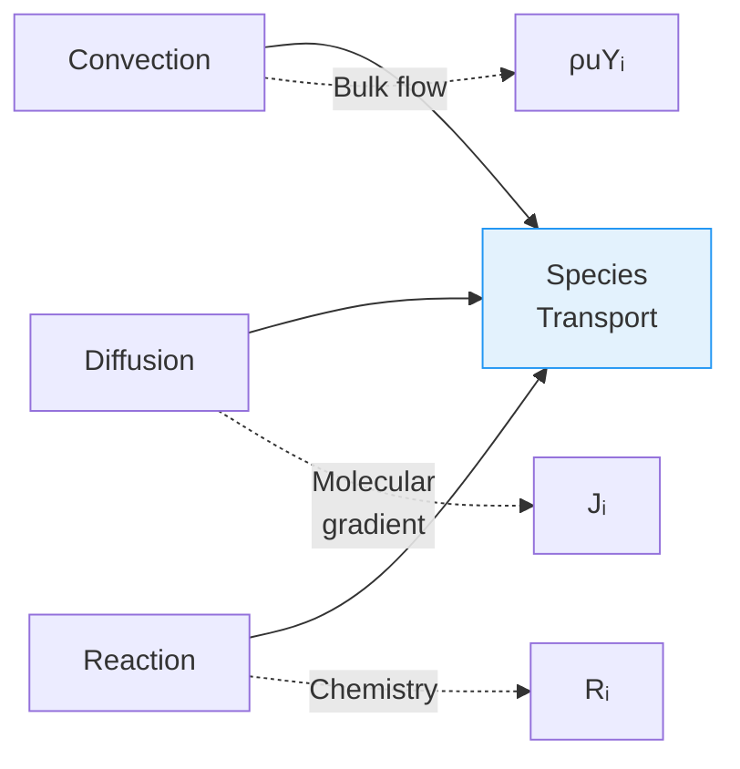
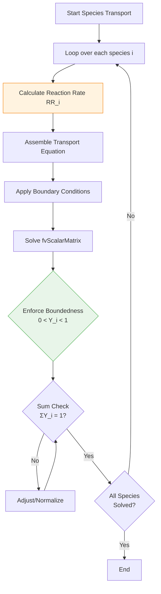

# Species Transport in Reacting Flows

> [!INFO] Overview
> This note provides comprehensive technical coverage of **species transport equations** in OpenFOAM reacting flow simulations, including convection, diffusion, reaction source terms, and diffusion models.

---

## 🔮 Hook: Why Species Transport Matters

In a **combustor**, the distribution of fuel, oxidizer, and products determines:
- **Flame stability** — concentration gradients control flame structure
- **Emissions formation** — pollutant transport dictates emission patterns
- **Combustion efficiency** — proper mixing affects overall burn rate

The **species transport equation** governs how chemical species move and distribute within a flow field, balancing three fundamental physical processes:



---

## 📐 Governing Equation

### The Species Transport Equation

For each species $i$, the mass fraction $Y_i$ evolves according to:

$$\frac{\partial (\rho Y_i)}{\partial t} + \nabla \cdot (\rho \mathbf{u} Y_i) = -\nabla \cdot \mathbf{J}_i + R_i \tag{1}$$

**Variable Definitions:**

| Symbol | Description | Units |
|--------|-------------|-------|
| $\rho$ | Density of the fluid | kg/m³ |
| $Y_i$ | Mass fraction of species $i$ | kg/kg |
| $\mathbf{u}$ | Velocity vector | m/s |
| $\mathbf{J}_i$ | Diffusive flux of species $i$ | kg/(m²·s) |
| $R_i$ | Net production/consumption rate | kg/(m³·s) |

**Physical Components:**

$$\underbrace{\frac{\partial (\rho Y_i)}{\partial t}}_{\text{Accumulation}} + \underbrace{\nabla \cdot (\rho \mathbf{u} Y_i)}_{\text{Convection}} = \underbrace{-\nabla \cdot \mathbf{J}_i}_{\text{Diffusion}} + \underbrace{R_i}_{\text{Reaction}}$$

> [!TIP] Control Volume Interpretation
> Consider a differential control volume where:
> - **Convective flux** $\rho \mathbf{u} Y_i$ transports species via bulk fluid motion
> - **Diffusive flux** $\mathbf{J}_i$ moves species down concentration gradients
> - **Reaction source** $R_i$ creates or destroys species through chemistry

---

## 🔬 Diffusion Models

OpenFOAM supports multiple diffusion models of increasing complexity:

### 1. Fick's Law (Binary Mixture)

The simplest approximation for binary mixtures:

$$\mathbf{J}_i = -\rho D_i \nabla Y_i \tag{2}$$

Where $D_i$ is the **mixture-averaged diffusion coefficient** [m²/s].

**Limitations:**
- Valid only for binary mixtures
- Neglects multi-component coupling effects
- No thermal diffusion (Soret effect)

---

### 2. Maxwell-Stefan (Multi-component)

For multi-component mixtures, gradients become coupled:

$$\nabla X_i = \sum_{j \neq i} \frac{X_i X_j}{D_{ij}} \left( \frac{\mathbf{J}_j}{\rho_j} - \frac{\mathbf{J}_i}{\rho_i} \right) \tag{3}$$

**Additional Variables:**
- $X_i$ — Mole fraction of species $i$
- $D_{ij}$ — Binary diffusion coefficient for pair $i$-$j$ [m²/s]
- $\rho_i$ — Density of species $i$ [kg/m³]

OpenFOAM typically uses a **mixture-averaged approximation** for efficiency:

$$D_{i,\text{mix}} = \frac{1 - Y_i}{\sum_{j \neq i} \frac{Y_j}{D_{ij}}} \tag{4}$$

---

### 3. Soret Effect (Thermal Diffusion)

Important for light species like $\mathrm{H_2}$:

$$\mathbf{J}_i = -\rho D_i \nabla Y_i - D_i^T \frac{\nabla T}{T} \tag{5}$$

**Additional Variables:**
- $D_i^T$ — Soret diffusion coefficient [kg/(m·s)]
- $T$ — Temperature [K]

> [!WARNING] When Soret Matters
> - **Critical** for hydrogen-rich flames
- Often negligible for hydrocarbon flames
- Can affect flame speed predictions by 10-20%

---

## ⚙️ OpenFOAM Implementation

### Solver Architecture

Species transport is handled within the `reactionThermo` framework using `fvScalarMatrix` discretization.



### Code: Transport Equation in `reactingFoam`

```cpp
// Species transport equation (from reactingFoam)
fvScalarMatrix YiEqn
(
    fvm::ddt(rho, Yi)                              // Unsteady term
  + fvm::div(phi, Yi)                              // Convection
  - fvm::laplacian(turbulence->mut()/Sct + rho*Di, Yi)  // Diffusion
 ==
    chemistry->RR(i)                               // Reaction source
  + fvOptions(rho, Yi)                             // Optional sources
);

YiEqn.solve();
```

**Term Breakdown:**

| Code Component | Physical Meaning | Typical Values |
|----------------|------------------|----------------|
| `fvm::ddt(rho, Yi)` | Temporal accumulation | — |
| `fvm::div(phi, Yi)` | Convective transport | $\phi = \rho \mathbf{u}$ |
| `turbulence->mut()/Sct` | Turbulent diffusivity | $S_{ct} \approx 0.7$ |
| `rho*Di` | Molecular diffusivity | From transport model |
| `chemistry->RR(i)` | Chemical reaction rate | From ODE solver |

### Configuration: `constant/thermophysicalProperties`

```cpp
transport
{
    type            multiComponent;      // or "soret", "const"

    // Mixture-averaged diffusion coefficients [m²/s]
    D               (CH4 1e-5 O2 1e-5 CO2 8e-6 H2O 1e-5 N2 1e-5);

    // Optional Soret coefficients (for thermal diffusion)
    SoretCoeffs     (H2 0.2);
}
```

### Boundary Conditions: `0/` Fields

| Boundary Type | Recommended Use | Example |
|---------------|-----------------|---------|
| `fixedValue` | Inlets with known composition | Fuel inlet, oxidizer inlet |
| `zeroGradient` | Outlets, symmetric boundaries | Exhaust outlet |
| `inletOutlet` | Mixed inlet/outlet boundaries | Pressure boundaries |

---

## ❓ Model Selection Guide

### Diffusion Model Comparison

| Model | Advantages | Disadvantages | Best For |
|-------|------------|---------------|----------|
| **Fick's Law** | Low computational cost | Inaccurate for multi-component | Initial simulations, testing |
| **Maxwell-Stefan** | Physically accurate | Requires linear system solve per cell | High-accuracy systems |
| **Soret/Dufour** | Captures thermal effects | Adds complexity | Hydrogen systems |

### Impact of Neglecting Soret Effect

Consequences of ignoring thermal diffusion:
- **Incorrect flame speeds** — errors up to 20% for $\mathrm{H_2}$
- **Wrong extinction limits** — critical for safety analysis
- **Emissions misprediction** — especially NOx in hydrogen flames

---

## 🔗 Connections to Other Physics

### Coupling with Energy Equation

Species transport affects energy through enthalpy:

$$\frac{\partial (\rho h)}{\partial t} + \nabla \cdot (\rho \mathbf{u} h) = \nabla \cdot (\alpha \nabla h) + \sum_i \dot{\omega}_i \Delta h_{f,i}^\circ$$

Where $\Delta h_{f,i}^\circ$ is the formation enthalpy.

### Coupling with Momentum

Variable density due to composition changes affects the momentum equation:

$$\frac{\partial (\rho \mathbf{u})}{\partial t} + \nabla \cdot (\rho \mathbf{u} \mathbf{u}) = -\nabla p + \nabla \cdot \boldsymbol{\tau} + \rho \mathbf{g}$$

---

## 🛠 Practical Workflow

### Step 1: Define Species

```cpp
// In constant/thermophysicalProperties
species
(
    CH4
    O2
    N2
    CO2
    H2O
);
```

### Step 2: Initialize Fields

Create initial field files for each species in `0/`:
- `0/Y_CH4` — Methane mass fraction
- `0/Y_O2` — Oxygen mass fraction
- `0/Y_N2` — Nitrogen mass fraction
- etc.

### Step 3: Set Boundary Conditions

```cpp
// Example: 0/Y_CH4
dimensions      [0 0 0 0 0 0 0];

internalField   uniform 0.055;    // 5.5% methane by mass

boundaryField
{
    inlet
    {
        type            fixedValue;
        value           uniform 0.055;
    }
    outlet
    {
        type            zeroGradient;
    }
    walls
    {
        type            zeroGradient;
    }
}
```

### Step 4: Configure Solver Settings

In `system/fvSolution`:

```cpp
solvers
{
    "\"Yi.*\""
    {
        solver          GAMG;
        tolerance       1e-06;
        relTol          0;
        smoother        GaussSeidel;
    }
}
```

---

## 📌 Summary

### Key Theoretical Principles

1. **Species transport balances** convection, diffusion, and reaction
2. **Diffusion models range** from simple Fick's law to complex Maxwell-Stefan
3. **Soret/Dufour effects** are optional but critical for light species
4. **Boundedness** ($0 \leq Y_i \leq 1$) and **summation** ($\sum Y_i = 1$) must be enforced

### OpenFOAM Implementation

- **`reactionThermo`** is the main framework
- **`multiComponentTransportModel`** provides runtime diffusion model selection
- **`fvScalarMatrix`** discretizes the transport equation
- **`chemistryModel`** provides reaction source terms
- **Model selection** depends on required accuracy vs. computational cost

---

## 🔍 Related Topics

- [[02_1._Species_Transport_Equation_($Y_i$)_and_Diffusion_Models]] — Detailed diffusion theory
- [[03_2._`chemistryModel`_and_ODE_Solvers_for_Stiff_Reaction_Rates]] — Chemical kinetics integration
- [[04_3._Combustion_Models_PaSR_vs._EDC]] — Turbulence-chemistry interaction
- [[06_🧪_Practical_Workflow_Setting_Up_a_Reacting_Flow_Simulation]] — Complete case setup
