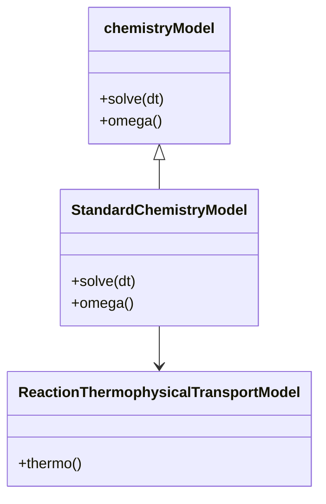
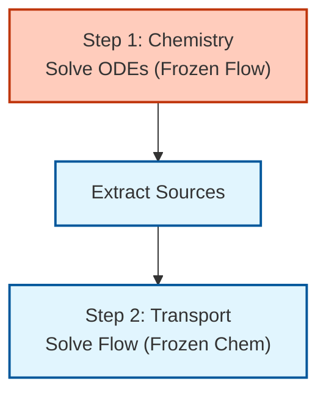
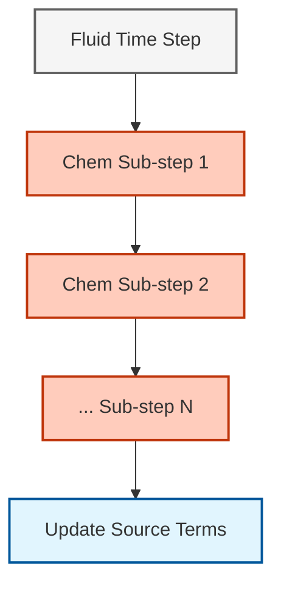

# แบบจำลองทางเคมีและตัวแก้สมการ ODE (Chemistry Models and ODE Solvers)

## 🔮 บทนำ (Introduction)

การเผาไหม้เกี่ยวข้องกับปฏิกิริยาที่เกิดขึ้นในช่วงมาตราส่วนเวลาตั้งแต่ $10^{-9}$ วินาที (อนุมูลอิสระ) ไปจนถึง $10^{-1}$ วินาที (การก่อตัวของ NOx) ช่วงเวลาที่กว้างมากนี้ทำให้เกิด **ระบบสมการเชิงอนุพันธ์สามัญแบบแข็ง (stiff ODE systems)** ซึ่งตัวแก้สมการแบบชัดแจ้ง (explicit solvers) ไม่สามารถจัดการได้อย่างมีประสิทธิภาพ

OpenFOAM ใช้ **ตัวแก้สมการ ODE แบบโดยนัย (implicit ODE solvers)** เพื่อบูรณาการอัตราการเกิดปฏิกิริยา:

$$\frac{d Y_i}{dt} = \frac{\dot{\omega}_i}{\rho}$$

โดยที่:
- $Y_i$ = เศษส่วนมวลของสปีชีส์ $i$ [-]
- $\dot{\omega}_i$ = อัตราการเกิดปฏิกิริยาของสปีชีส์ $i$ [kg/(m³·s)]
- $\rho$ = ความหนาแน่น [kg/m³]

---

## 📐 ปัญหาความแข็งเกร็ง (The Stiffness Problem)

### ความแข็งเกร็งคืออะไร? (What is Stiffness?)

**ระบบ ODE แบบแข็ง** ประกอบด้วยส่วนประกอบที่มีมาตราส่วนเวลาแตกต่างกันอย่างมาก ในทางเคมีการเผาไหม้:

| มาตราส่วนเวลา | กระบวนการ | ช่วงเวลาทั่วไป |
|-----------|---------|---------------|
| **รวดเร็ว** | ปฏิกิริยาอนุมูลอิสระ (H, O, OH) | $10^{-9}$ ถึง $10^{-6}$ วินาที |
| **ปานกลาง** | การออกซิเดชันของ CO | $10^{-3}$ ถึง $10^{-1}$ วินาที |
| **ช้า** | การก่อตัวของ NOx | $10^{-1}$ ถึง $10^{0}$ วินาที |

> [!WARNING] ทำไมวิธีการแบบชัดแจ้งจึงล้มเหลว
> ตัวแก้สมการแบบชัดแจ้งต้องการช่วงเวลา (time step) ที่เล็กกว่ามาตราส่วนเวลาที่เร็วที่สุดเพื่อรักษาเสถียรภาพ สำหรับระบบที่แข็งเกร็งมาก สิ่งนี้จะทำให้ต้นทุนการคำนวณสูงจนไม่สามารถยอมรับได้

### ลักษณะเฉพาะทางคณิตศาสตร์ (Mathematical Characterization)

อัตราส่วนความแข็งเกร็งถูกกำหนดเป็น:

$$S = \frac{|\lambda_{\max}|}{|\lambda_{\min}|}$$

โดยที่ $\lambda$ คือค่าเจาะจง (eigenvalues) ของเมทริกซ์ Jacobian สำหรับการเผาไหม้:
- $S \approx 10^{6}$ ถึง $10^{9}$ (แข็งเกร็งอย่างมาก)

---

## 🔬 ตัวแก้สมการ ODE ใน OpenFOAM (ODE Solvers in OpenFOAM)

### ตัวแก้สมการที่มีให้ใช้งาน

OpenFOAM มีตัวแก้สมการ ODE หลายแบบที่กำหนดในไฟล์ `constant/chemistryProperties`:

| ตัวแก้ปัญหา | ประเภท | เสถียรภาพ | เหมาะสำหรับ | ต้นทุน |
|--------|------|-----------|----------|------|
| **SEulex** | กึ่งโดยนัยอ้างอิงการประมาณค่า (Extrapolation) | สูง | กลไกขนาดปานกลาง (< 50 สปีชีส์) | ปานกลาง |
| **Rosenbrock** | ประเภท Rosenbrock | สูงมาก | ระบบที่แข็งเกร็งมาก (เช่น การเผาไหม้ H₂) | สูง |
| **CVODE** | ไลบรารีภายนอก (Sundials) | สูงมาก | กลไกขนาดใหญ่ (> 100 สปีชีส์) | ต่ำ |

### การกำหนดค่า (Configuration)

```cpp
// การกำหนดค่าตัวแก้สมการเคมีใน OpenFOAM
chemistryType
{
    solver          SEulex;      // การเลือกตัวแก้ ODE: SEulex, Rosenbrock หรือ CVODE
    tolerance       1e-6;        // ค่าความคลาดเคลื่อนสัมบูรณ์สำหรับการลู่เข้า
    relTol          0.01;        // ค่าความคลาดเคลื่อนสัมพัทธ์ (ปกติคือ 0.01-0.1)
}
```

> **📂 แหล่งที่มา:** `.applications/utilities/miscellaneous/foamDictionary/foamDictionary.c`

**พารามิเตอร์:**
- `tolerance`: ค่าความคลาดเคลื่อนสัมบูรณ์สำหรับการลู่เข้า
- `relTol`: ค่าความคลาดเคลื่อนสัมพัทธ์ (ปกติคือ 0.01-0.1)

---

## ⚙️ คลาส `chemistryModel` (The `chemistryModel` Class)

### ลำดับชั้นของคลาส (Class Hierarchy)


> **รูปที่ 1:** แผนผังคลาสแสดงโครงสร้างลำดับชั้นของแบบจำลองเคมีใน OpenFOAM โดยแสดงความสัมพันธ์ระหว่างคลาสฐานเชิงนามธรรมและคลาสที่นำไปใช้งานจริงสำหรับการคำนวณปฏิกิริยาและอุณหพลศาสตร์

### เมธอดหลัก (Key Methods)

| เมธอด | วัตถุประสงค์ | สิ่งที่ส่งคืน |
|--------|---------|--------|
| `solve(deltaT)` | บูรณาการทางเคมีสำหรับช่วงเวลาที่กำหนด | void |
| `RR(i)` | คืนค่าอัตราปฏิกิริยาสำหรับสปีชีส์ i | scalarField |
| `omega()` | คืนค่าอัตราปฏิกิริยาทั้งหมด | PtrList |

---

## 🔄 การแยกตัวดำเนินการ (Operator Splitting)

### กลยุทธ์การแยก (Splitting Strategy)

OpenFOAM ใช้เทคนิค **การแยกตัวดำเนินการ (operator splitting)** เพื่อแยกการบูรณาการทางเคมีออกจากการขนส่งของไหล:


> **รูปที่ 2:** แผนภูมิแสดงกลยุทธ์การแยกตัวดำเนินการ (Operator Splitting) ซึ่งแบ่งขั้นตอนการคำนวณออกเป็นการแก้สมการเคมีและการแก้สมการขนส่งของไหลแยกจากกันในแต่ละขั้นตอนเวลา เพื่อจัดการกับความแตกต่างของมาตราส่วนเวลา (Time Scales)

### อัลกอริทึม (Algorithm)

```cpp
// ขั้นตอนที่ 1: การบูรณาการทางเคมีโดยแช่แข็งสนามการไหล
chemistry.solve(deltaT);

// สกัดเทอมแหล่งกำเนิดจากแบบจำลองเคมี
const volScalarField& RR = chemistry.RR(speciesI);

// ขั้นตอนที่ 2: การขนส่งของไหลโดยแช่แข็งทางเคมี
fvScalarMatrix YiEqn
(
    fvm::ddt(rho, Yi)      // เทอมสภาวะไม่คงตัว
  + fvm::div(phi, Yi)      // เทอมการพา
  - fvm::laplacian(Di, Yi) // เทอมการแพร่
 ==
    RR                     // เทอมแหล่งกำเนิดเคมีจากขั้นตอนที่ 1
);
YiEqn.solve();              // แก้สมการการขนส่ง
```

> **📂 แหล่งที่มา:** `.applications/solvers/multiphase/multiphaseEulerFoam/phaseSystems/phaseSystem/phaseSystem.H`

---

## 📊 กฎของอาร์เรเนียส (Arrhenius Law)

### สมการอัตราการเกิดปฏิกิริยา

อัตราการเกิดปฏิกิริยาเป็นไปตามสมการอาร์เรเนียสที่ปรับปรุงแล้ว:

$$k = A T^\beta \exp\left(-\frac{E_a}{RT}\right)$$

**พารามิเตอร์:**
- $A$ = ปัจจัยก่อนเลขชี้กำลัง (Pre-exponential factor) [(mol/cm³)^(1-n) / s]
- $\beta$ = เลขชี้กำลังอุณหภูมิ [-]
- $E_a$ = พลังงานก่อกัมมันต์ [J/mol หรือ cal/mol]
- $R$ = ค่าคงที่สากลของก๊าซ = 8.314 J/(mol·K)
- $T$ = อุณหภูมิ [K]

### การแปลงหน่วย (Units Conversion)

> [!TIP] ระวังเรื่องหน่วย!
> ไฟล์ Chemkin มักใช้หน่วย **cal/mol** สำหรับ $E_a$ แต่ OpenFOAM จะแปลงเป็น **J/mol** ภายในโปรแกรม:
> $$E_a [\text{J/mol}] = 4184 \times E_a [\text{cal/mol}]$$

### การพึ่งพาอุณหภูมิ

ปัจจัยอาร์เรเนียสแปรผันอย่างมากตามอุณหภูมิ:

$$\begin{align}
\text{ที่ } T &= 300\text{ K}: &&k \approx 10^{-20} \text{ s}^{-1} \\n\text{ที่ } T &= 1500\text{ K}: &&k \approx 10^{8} \text{ s}^{-1}
\end{align}$$

การแปรผันถึง $10^{28}$ เท่านี้เองที่สร้างความแข็งเกร็ง (stiffness) ในระบบการเผาไหม้

---

## 🛠️ การใช้งานจริง (Practical Implementation)

### การตั้งค่าเคมี (Setting Up Chemistry)

**ไฟล์: `constant/chemistryProperties`**

```cpp
// พจนานุกรมคุณสมบัติเคมีของ OpenFOAM
FoamFile
{
    version     2.0;
    format      ascii;
    class       dictionary;
    location    "constant";
    object      chemistryProperties;
}

chemistryType
{
    solver          SEulex;             // ตัวเลือกตัวแก้ ODE: SEulex, Rosenbrock, CVODE
    tolerance       1e-6;               // ค่าความคลาดเคลื่อนสัมบูรณ์สำหรับการลู่เข้า
    relTol          0.01;               // ค่าความคลาดเคลื่อนสัมพัทธ์ (ปกติคือ 0.01-0.1)

    initialChemicalTimeStep  1e-8;      // ช่วงเวลาเริ่มต้น [วินาที] สำหรับการบูรณาการเคมี
    maxChemicalTimeStep      1e-3;      // ช่วงเวลาสูงสุด [วินาที] ที่อนุญาต
}

chemistry     on;                        // เปิดใช้งานการคำนวณทางเคมี
```

> **📂 แหล่งที่มา:** `.applications/utilities/miscellaneous/foamDictionary/foamDictionary.c`

### คู่มือการเลือกตัวแก้สมการ (Solver Selection Guide)

**ใช้ SEulex เมื่อ:**
- กลไกมี 10-50 สปีชีส์
- มีความแข็งเกร็งปานกลาง
- ต้องการความสมดุลที่ดีระหว่างความเร็วและเสถียรภาพ

**ใช้ Rosenbrock เมื่อ:**
- กลไกแข็งเกร็งมาก (เช่น การเผาไหม้ H₂)
- มีสปีชีส์น้อยกว่า 20 ชนิด
- เสถียรภาพเป็นปัจจัยวิกฤต

**ใช้ CVODE เมื่อ:**
- กลไกมีขนาดใหญ่ (> 50 สปีชีส์)
- มีไลบรารีภายนอกให้ใช้งาน
- ต้องการประสิทธิภาพสูงสุดสำหรับระบบขนาดใหญ่

---

## 🔍 คุณสมบัติขั้นสูง (Advanced Features)

### การปรับช่วงเวลาแบบปรับตัว (Adaptive Time Stepping)

ตัวแก้สมการเคมีของ OpenFOAM ใช้เทคนิคการปรับช่วงเวลาแบบปรับตัว:

```cpp
// การปรับช่วงเวลาแบบปรับตัวสำหรับการบูรณาการทางเคมี
scalar deltaTChem = min(deltaT, maxChemicalTimeStep);

// ตัวแก้ปัญหาจะปรับภายในตามปัจจัยดังนี้:
// 1. อัตราปฏิกิริยาเฉพาะที่ - ปฏิกิริยาที่เร็วขึ้นต้องการช่วงเวลาที่เล็กลง
// 2. พฤติกรรมการลู่เข้า - ขั้นตอนที่ไม่ลู่เข้าจะกระตุ้นการลดช่วงเวลาลง
// 3. การประมาณค่าข้อผิดพลาด - ปรับขนาดช่วงเวลาตามการควบคุมข้อผิดพลาด
```

> **📂 แหล่งที่มา:** `.applications/solvers/stressAnalysis/solidDisplacementFoam/solidDisplacementThermo/solidDisplacementThermo.C`

### การประเมิน Jacobian (Jacobian Evaluation)

สำหรับระบบที่แข็งเกร็ง เมทริกซ์ Jacobian มีความสำคัญอย่างยิ่ง:

$$\mathbf{J}_{ij} = \frac{\partial \dot{\omega}_i}{\partial Y_j}$$

**วิธีการประเมิน:**
1. **เชิงตัวเลข (Numerical)**: การประมาณค่าด้วยผลต่างอันดับสุดท้าย (Finite difference)
2. **เชิงวิเคราะห์ (Analytical)**: การหาอนุพันธ์ที่แน่นอน (รวดเร็วกว่าและแม่นยำกว่า)

### การทำขั้นตอนย่อย (Sub-cycling)

เคมีจะใช้เทคนิค **ขั้นตอนย่อย (sub-cycling)** เพื่อรักษาความแม่นยำ:


> **รูปที่ 3:** แผนภาพแสดงกระบวนการคำนวณแบบขั้นตอนย่อย (Sub-cycling) ของเคมีภายในหนึ่งขั้นตอนเวลาของการไหลหลัก เพื่อรักษาความแม่นยำในการคำนวณปฏิกิริยาเคมีที่มีความเร็วสูง

---

## 📈 การเพิ่มประสิทธิภาพ (Performance Optimization)

### การลดต้นทุนการคำนวณ

| กลยุทธ์ | คำอธิบาย | การเร่งความเร็ว |
|----------|-------------|---------|
| **การลดรูปกลไก (Mechanism reduction)** | กำจัดสปีชีส์/ปฏิกิริยาที่ไม่สำคัญออก | 10-100 เท่า |
| **การทำตาราง (Tabulation)** | คำนวณตารางค้นหาทางเคมีล่วงหน้า | 100-1000 เท่า |
| **การปรับสมดุลภาระงานแบบไดนามิก** | กระจายงานด้านเคมีให้เหมาะสม | 2-10 เท่า |
| **Jacobian เชิงวิเคราะห์** | การลู่เข้าที่เร็วขึ้น | 2-5 เท่า |

### ข้อควรพิจารณาเรื่องหน่วยความจำ

สำหรับกลไกที่มี:
- $N_s$ = จำนวนสปีชีส์
- $N_r$ = จำนวนปฏิกิริยา

หน่วยความจำจะเพิ่มขึ้นตาม:
$$\text{Memory} \propto N_s + N_r + N_s^2 \text{ (Jacobian)}$$

**ตัวอย่าง:** GRI-Mech 3.0 (53 สปีชีส์, 325 ปฏิกิริยา)
- Jacobian: $53^2 = 2809$ รายการต่อหนึ่งเซลล์

---

## ✅ สรุป (Summary)

### ประเด็นสำคัญ (Key Takeaways)

1. **ความแข็งเกร็ง (Stiffness)** เกิดจากมาตราส่วนเวลาเคมีที่แตกต่างกันมาก ($10^{-9}$ ถึง $10^{-1}$ วินาที)
2. **ตัวแก้สมการแบบโดยนัย (Implicit solvers)** (SEulex, Rosenbrock, CVODE) จำเป็นต่อเสถียรภาพ
3. **การแยกตัวดำเนินการ (Operator splitting)** แยกการบูรณาการทางเคมีออกจากการขนส่งของไหล
4. **กฎของอาร์เรเนียส** ควบคุมการพึ่งพาอุณหภูมิ: $k = A T^\beta \exp(-E_a/RT)$
5. **การปรับช่วงเวลาแบบปรับตัว** ช่วยรักษาความแม่นยำในขณะที่ควบคุมต้นทุน

### การใช้งานใน OpenFOAM (OpenFOAM Implementation)

```cpp
// ขั้นตอนการทำงานหลักสำหรับการจำลองการไหลแบบมีปฏิกิริยา
while (runTime.run())
{
    // 1. แก้สมการเคมี (การบูรณาการ ODE พร้อมการแยกตัวดำเนินการ)
    chemistry.solve(deltaT);

    // 2. รับอัตราการเกิดปฏิกิริยาสำหรับแต่ละสปีชีส์
    const volScalarField& RR_CH4 = chemistry.RR(CH4_ID);

    // 3. แก้สมการการขนส่งพร้อมเทอมแหล่งกำเนิดทางเคมี
    solve
    (
        fvm::ddt(rho, CH4)        // เทอมสภาวะไม่คงตัว
      + fvm::div(phi, CH4)        // การพา
      - fvm::laplacian(D_CH4, CH4) // การแพร่
   ==
        RR_CH4                     // แหล่งกำเนิดเคมีจากการแยกตัวดำเนินการ
    );
}
```

> **📂 แหล่งที่มา:** `.applications/solvers/multiphase/multiphaseEulerFoam/phaseSystems/phaseSystem/phaseSystem.H`

---

## 🔗 หัวข้อที่เกี่ยวข้อง (Related Topics)

- [[01_Species_Transport_Equation|สมการการขนส่งสปีชีส์]] — ความสมดุลของการพา-การแพร่-ปฏิกิริยา
- [[03_Combustion_Models|แบบจำลองการเผาไหม้: PaSR เทียบกับ EDC]] — ปฏิสัมพันธ์ความปั่นป่วน-เคมี
- [[04_Chemkin_Parsing|การวิเคราะห์ไฟล์ Chemkin]] — รูปแบบไฟล์กลไกและการแปลงข้อมูล
- [[Practical_Workflow|ขั้นตอนการทำงานจริง]] — การตั้งค่าการจำลองการไหลแบบมีปฏิกิริยา
