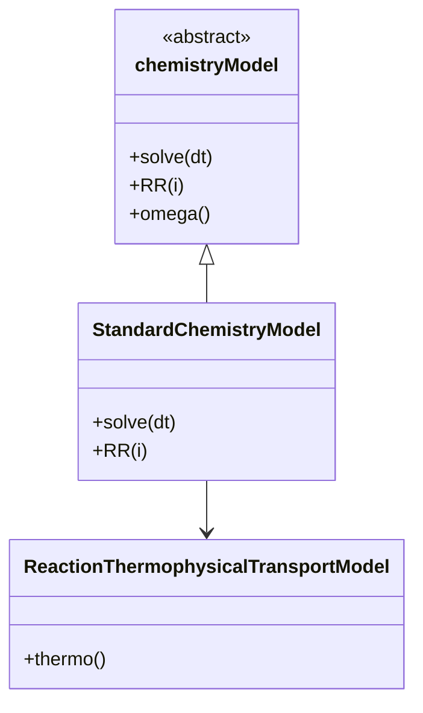
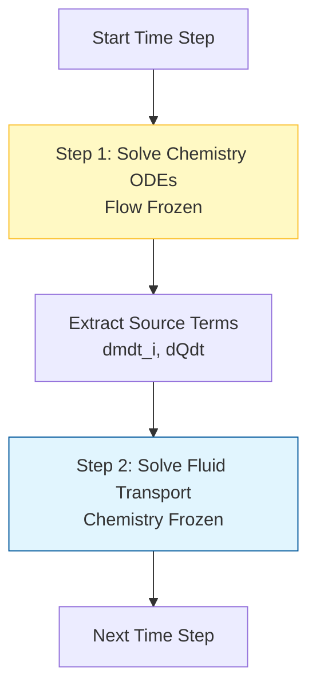
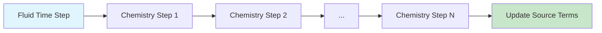

# Chemistry Models and ODE Solvers

## 🔮 Introduction

Combustion involves reactions occurring at timescales from $10^{-9}s$ (radicals) to $10^{-1}s$ (NOx formation). This vast range creates **stiff ODE systems** that explicit solvers cannot handle efficiently.

OpenFOAM uses **implicit ODE solvers** to integrate the reaction rates:

$$\frac{d Y_i}{dt} = \frac{\dot{\omega}_i}{\rho}$$

where:
- $Y_i$ = mass fraction of species $i$ [-]
- $\dot{\omega}_i$ = reaction rate of species $i$ [kg/(m³·s)]
- $\rho$ = density [kg/m³]

---

## 📐 The Stiffness Problem

### What is Stiffness?

A **stiff ODE system** contains components with vastly different timescales. In combustion chemistry:

| Timescale | Process | Typical Range |
|-----------|---------|---------------|
| **Fast** | Radical reactions (H, O, OH) | $10^{-9}$ to $10^{-6}$ s |
| **Medium** | CO oxidation | $10^{-3}$ to $10^{-1}$ s |
| **Slow** | NOx formation | $10^{-1}$ to $10^{0}$ s |

> [!WARNING] Why Explicit Methods Fail
> Explicit solvers require time steps smaller than the fastest timescale for stability. For stiff systems, this becomes computationally prohibitive.

### Mathematical Characterization

The stiffness ratio is defined as:

$$S = \frac{|\lambda_{\max}|}{|\lambda_{\min}|}$$

where $\lambda$ are eigenvalues of the Jacobian matrix. For combustion:
- $S \approx 10^{6}$ to $10^{9}$ (extremely stiff)

---

## 🔬 ODE Solvers in OpenFOAM

### Available Solvers

OpenFOAM provides several ODE solvers defined in `constant/chemistryProperties`:

| Solver | Type | Stability | Best For | Cost |
|--------|------|-----------|----------|------|
| **SEulex** | Extrapolation-based semi-implicit | High | Moderate mechanisms (< 50 species) | Medium |
| **Rosenbrock** | Rosenbrock-type | Very High | Very stiff systems (H₂) | High |
| **CVODE** | External library (Sundials) | Very High | Large mechanisms (> 100 species) | Low |

### Configuration

```cpp
chemistryType
{
    solver          SEulex;
    tolerance       1e-6;
    relTol          0.01;
}
```

**Parameters:**
- `tolerance`: Absolute tolerance for convergence
- `relTol`: Relative tolerance (typically 0.01-0.1)

---

## ⚙️ The `chemistryModel` Class

### Class Hierarchy


> **Figure 1:** แผนผังคลาสแสดงโครงสร้างลำดับชั้นของแบบจำลองเคมีใน OpenFOAM โดยแสดงความสัมพันธ์ระหว่างคลาสฐานเชิงนามธรรมและคลาสที่นำไปใช้งานจริงสำหรับการคำนวณปฏิกิริยาและอุณหพลศาสตร์


### Key Methods

| Method | Purpose | Return |
|--------|---------|--------|
| `solve(deltaT)` | Integrate chemistry for timestep | void |
| `RR(i)` | Return reaction rate for species i | scalarField |
| `omega()` | Return all reaction rates | PtrList |

---

## 🔄 Operator Splitting

### Splitting Strategy

OpenFOAM uses **operator splitting** to separate chemistry integration from fluid transport:


> **Figure 2:** แผนภูมิแสดงกลยุทธ์การแยกตัวดำเนินการ (Operator Splitting) ซึ่งแบ่งขั้นตอนการคำนวณออกเป็นการแก้สมการเคมีและการแก้สมการขนส่งของไหลแยกจากกันในแต่ละขั้นตอนเวลา เพื่อจัดการกับความแตกต่างของมาตราส่วนเวลา (Time Scales)


### Algorithm

```cpp
// Step 1: Chemistry integration (frozen flow)
chemistry.solve(deltaT);

// Extract source terms
const volScalarField& RR = chemistry.RR(speciesI);

// Step 2: Fluid transport (frozen chemistry)
fvScalarMatrix YiEqn
(
    fvm::ddt(rho, Yi)
  + fvm::div(phi, Yi)
  - fvm::laplacian(Di, Yi)
 ==
    RR  // Chemistry source term
);
YiEqn.solve();
```

---

## 📊 Arrhenius Law

### Reaction Rate Equation

Reaction rates follow the modified Arrhenius equation:

$$k = A T^\beta \exp\left(-\frac{E_a}{RT}\right)$$

**Parameters:**
- $A$ = Pre-exponential factor [(mol/cm³)^(1-n) / s]
- $\beta$ = Temperature exponent [-]
- $E_a$ = Activation energy [J/mol or cal/mol]
- $R$ = Universal gas constant = 8.314 J/(mol·K)
- $T$ = Temperature [K]

### Units Conversion

> [!TIP] Watch Your Units!
> Chemkin files often use **cal/mol** for $E_a$. OpenFOAM internally converts to **J/mol**:
> $$E_a [\text{J/mol}] = 4184 \times E_a [\text{cal/mol}]$$

### Temperature Dependence

The Arrhenius factor varies dramatically with temperature:

$$\begin{align}
\text{At } T &= 300\text{ K}: &&k \approx 10^{-20} \text{ s}^{-1} \\
\text{At } T &= 1500\text{ K}: &&k \approx 10^{8} \text{ s}^{-1}
\end{align}$$

This $10^{28}$-fold variation creates the stiffness in combustion systems.

---

## 🛠️ Practical Implementation

### Setting Up Chemistry

**File: `constant/chemistryProperties`**

```cpp
FoamFile
{
    version     2.0;
    format      ascii;
    class       dictionary;
    location    "constant";
    object      chemistryProperties;
}

chemistryType
{
    solver          SEulex;        // ODE solver choice
    tolerance       1e-6;
    relTol          0.01;

    initialChemicalTimeStep  1e-8;    // Initial timestep [s]
    maxChemicalTimeStep     1e-3;    // Maximum timestep [s]
}

chemistry     on;
```

### Solver Selection Guide

**Use SEulex when:**
- Mechanism has 10-50 species
- Moderate stiffness
- Good balance of speed and stability

**Use Rosenbrock when:**
- Mechanism is very stiff (e.g., H₂ combustion)
- Fewer than 20 species
- Stability is critical

**Use CVODE when:**
- Large mechanisms (> 50 species)
- External library available
- Best performance for large systems

---

## 🔍 Advanced Features

### Adaptive Time Stepping

OpenFOAM chemistry solvers use adaptive time stepping:

```cpp
scalar deltaTChem = min(deltaT, maxChemicalTimeStep);

// Solver adjusts internally based on:
// 1. Local reaction rates
// 2. Convergence behavior
// 3. Error estimates
```

### Jacobian Evaluation

For stiff systems, the Jacobian matrix is critical:

$$\mathbf{J}_{ij} = \frac{\partial \dot{\omega}_i}{\partial Y_j}$$

**Evaluation methods:**
1. **Numerical**: Finite difference approximation
2. **Analytical**: Exact derivatives (faster, more accurate)

### Sub-cycling

Chemistry uses **sub-cycling** to maintain accuracy:


> **Figure 3:** แผนภาพแสดงกระบวนการคำนวณแบบขั้นตอนย่อย (Sub-cycling) ของเคมีภายในหนึ่งขั้นตอนเวลาของการไหลหลัก เพื่อรักษาความแม่นยำในการคำนวณปฏิกิริยาเคมีที่มีความเร็วสูง


---

## 📈 Performance Optimization

### Reducing Computational Cost

| Strategy | Description | Speedup |
|----------|-------------|---------|
| **Mechanism reduction** | Remove unimportant species/reactions | 10-100x |
| **Tabulation** | Pre-compute chemistry lookup tables | 100-1000x |
| **Dynamic load balancing** | Distribute chemistry work | 2-10x |
| **Analytical Jacobian** | Faster convergence | 2-5x |

### Memory Considerations

For a mechanism with:
- $N_s$ = number of species
- $N_r$ = number of reactions

Memory scales as:
$$\text{Memory} \propto N_s + N_r + N_s^2 \text{ (Jacobian)}$$

**Example:** GRI-Mech 3.0 (53 species, 325 reactions)
- Jacobian: $53^2 = 2809$ entries per cell

---

## ✅ Summary

### Key Takeaways

1. **Stiffness** arises from disparate chemical timescales ($10^{-9}$ to $10^{-1}$ s)
2. **Implicit solvers** (SEulex, Rosenbrock, CVODE) are required for stability
3. **Operator splitting** separates chemistry from fluid transport
4. **Arrhenius law** governs temperature dependence: $k = A T^\beta \exp(-E_a/RT)$
5. **Adaptive time stepping** maintains accuracy while controlling cost

### OpenFOAM Implementation

```cpp
// Main workflow
while (runTime.run())
{
    // 1. Solve chemistry (ODE integration)
    chemistry.solve(deltaT);

    // 2. Get reaction rates
    const volScalarField& RR_CH4 = chemistry.RR(CH4_ID);

    // 3. Solve transport with source terms
    solve
    (
        fvm::ddt(rho, CH4)
      + fvm::div(phi, CH4)
      - fvm::laplacian(D_CH4, CH4)
   ==
        RR_CH4
    );
}
```

---

## 🔗 Related Topics

- [[01_Species_Transport_Equation|Species Transport Equations]] — Convection-diffusion-reaction balance
- [[03_Combustion_Models|Combustion Models: PaSR vs EDC]] — Turbulence-chemistry interaction
- [[04_Chemkin_Parsing|Chemkin File Parsing]] — Mechanism file format and parsing
- [[Practical_Workflow|Practical Workflow]] — Setting up reacting flow simulations
