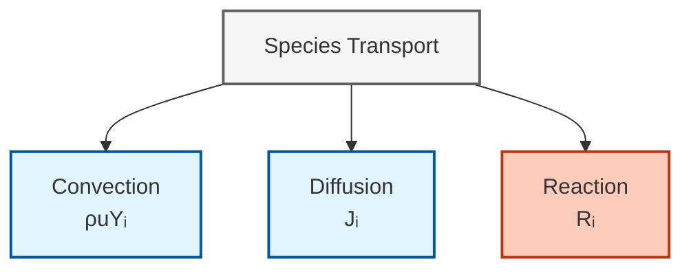
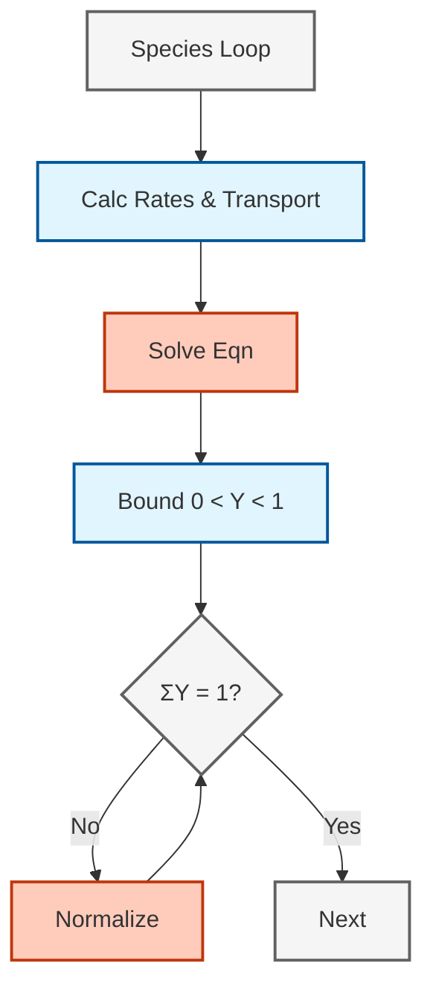

# การขนส่งสปีชีส์ในการไหลแบบมีปฏิกิริยา (Species Transport in Reacting Flows)

---

## 🎯 Learning Objectives

หลังจากศึกษาบันทึกฉบับนี้ ผู้อ่านควรจะสามารถ:

1. **เขียนและอธิบาย** สมการการขนส่งสปีชีส์พร้อมคำนิยามแต่ละเทอม
2. **เลือกใช้แบบจำลองการแพร่** ที่เหมาะสม (Fick, Maxwell-Stefan, Soret) สำหรับปัญหาที่กำหนด
3. **ตั้งค่า OpenFOAM** สำหรับการแก้สมการขนส่งสปีชีส์ รวมถึง thermophysicalProperties และ boundary conditions
4. **อธิบายความเชื่อมโยง** ระหว่างการขนส่งสปีชีส์กับสมการพลังงานและโมเมนตัม

---

## 🔮 What is Species Transport? (สมการควบคุมการขนส่งสปีชีส์คืออะไร?)

สมการการขนส่งสปีชีส์ควบคุมการเคลื่อนที่และการกระจายตัวของสปีชีส์เคมีภายในสนามการไหล โดยสร้างสมดุลระหว่างกระบวนการทางฟิสิกส์พื้นฐานสามประการ:



> **รูปที่ 1:** กลไกหลักสามประการที่ควบคุมการขนส่งสปีชีส์ — การพา (Convection) จากการไหลหลัก, การแพร่ (Diffusion) จากเกรเดียนต์ความเข้มข้น, และการทำปฏิกิริยาเคมี (Reaction)

### สมการการขนส่งสปีชีส์

สำหรับแต่ละสปีชีส์ $i$ เศษส่วนมวล $Y_i$ จะวิวัฒนาการตามสมการ:

$$\frac{\partial (\rho Y_i)}{\partial t} + \nabla \cdot (\rho \mathbf{u} Y_i) = -\nabla \cdot \mathbf{J}_i + R_i \tag{1}$$

$$\underbrace{\frac{\partial (\rho Y_i)}{\partial t}}_{\text{การสะสม}} + \underbrace{\nabla \cdot (\rho \mathbf{u} Y_i)}_{\text{การพา}} = \underbrace{-\nabla \cdot \mathbf{J}_i}_{\text{การแพร่}} + \underbrace{R_i}_{\text{ปฏิกิริยา}}$$

| สัญลักษณ์ | คำอธิบาย | หน่วย |
|--------|-------------|-------|
| $\rho$ | ความหนาแน่นของของไหล | kg/m³ |
| $Y_i$ | เศษส่วนมวลของสปีชีส์ $i$ | kg/kg |
| $\mathbf{u}$ | เวกเตอร์ความเร็ว | m/s |
| $\mathbf{J}_i$ | ฟลักซ์การแพร่ของสปีชีส์ $i$ | kg/(m²·s) |
| $R_i$ | อัตราการผลิต/การบริโภคสุทธิ | kg/(m³·s) |

---

## 🔁 Why Species Transport Matters? (ทำไมต้องเข้าใจสมการการขนส่งสปีชีส์?)

### มุมมองเปรียบเทียบ: ระบบส่งพัสดุ

> [!TIP] **แอนาลอยีระบบส่งพัสดุ**
> - **Convection:** การขนส่งด้วย "รถบรรทุก" — ถ้ารถวิ่งเร็ว พัสดุก็ไปเร็ว
> - **Diffusion:** การ "เดินเท้าส่งของ" — พัสดุกระจายจากที่แน่นไปที่ว่าง
> - **Reaction:** จุด "แปรรูปพัสดุ" — พัสดุ A กลายเป็นพัสดุ B

### ความสำคัญต่อการจำลองเคมี

1. **Transport Limited vs Reaction Limited:**
   - **Da >> 1 (Transport Limited):** เคมีเร็วมาก การขนส่งเป็นตัวจำกัด
   - **Da << 1 (Reaction Limited):** การขนส่งเร็ว เคมีเป็นตัวจำกัด

2. **ผลต่อความแม่นยำของการทำนาย:**
   - แบบจำลองการแพร่ที่ไม่เหมาะสม → ความเร็วเปลวไฟผิดพลาด 10-20%
   - การละเลย Soret effect → ผิดพลาด 20% สำหรับไฮโดรเจน
   - การกำหนดขอบเขตไม่ถูกต้อง → การคำนวณปฏิกิริยาล้มเหลว

---

## ⚙️ How Diffusion Models Work? (แบบจำลองการแพร่ทำงานอย่างไร?)

OpenFOAM รองรับแบบจำลองการแพร่ที่มีความซับซ้อนเพิ่มขึ้นตามลำดับ:

### 1. กฎของฟิค (Fick's Law)

สำหรับส่วนผสมสองส่วนประกอบ:

$$\mathbf{J}_i = -\rho D_i \nabla Y_i \tag{2}$$

โดยที่ $D_i$ คือ **สัมประสิทธิ์การแพร่เฉลี่ยส่วนผสม** [m²/s]

**ข้อจำกัด:** ใช้ได้เฉพาะสองส่วนประกอบ, ละเลยผลของ Soret effect

### 2. แมกซ์เวลล์-สเตฟาน (Maxwell-Stefan)

สำหรับส่วนผสมหลายส่วนประกอบ เกรเดียนต์จะถูกคัปปลิงเข้าด้วยกัน:

$$\nabla X_i = \sum_{j \neq i} \frac{X_i X_j}{D_{ij}} \left( \frac{\mathbf{J}_j}{\rho_j} - \frac{\mathbf{J}_i}{\rho_i} \right) \tag{3}$$

OpenFOAM ใช้ **การประมาณค่าเฉลี่ยส่วนผสม (mixture-averaged):**

$$D_{i,\text{mix}} = \frac{1 - Y_i}{\sum_{j \neq i} \frac{Y_j}{D_{ij}}} \tag{4}$$

### 3. ผลกระทบ Soret (Soret Effect)

สำคัญสำหรับสปีชีส์น้ำหนักเบาอย่าง $\mathrm{H_2}$:

$$\mathbf{J}_i = -\rho D_i \nabla Y_i - D_i^T \frac{\nabla T}{T} \tag{5}$$

> [!WARNING] เมื่อใดที่ Soret มีความสำคัญ
> - **วิกฤต** สำหรับเปลวไฟที่อุดมไปด้วยไฮโดรเจน
> - มักละเลยได้สำหรับเปลวไฟไฮโดรคาร์บอน
> - ส่งผลต่อการคาดการณ์ความเร็วเปลวไฟได้ 10-20%

---

## 📊 Model Selection Guide (คู่มือการเลือกแบบจำลอง)

| แบบจำลอง | ข้อดี | ข้อเสีย | เหมาะสำหรับ | ความแม่นยำ |
|-------|------------|---------------|----------|---------|
| **กฎของฟิค** | ต้นทุนต่ำ | ไม่แม่นยำสำหรับหลายส่วนประกอบ | การจำลองเบื้องต้น | ต่ำ |
| **แมกซ์เวลล์-สเตฟาน** | แม่นยำทางกายภาพ | ต้องแก้ระบบเชิงเส้นต่อเซลล์ | ระบบที่ต้องการความแม่นยำสูง | สูง |
| **Soret/Dufour** | จับผลกระทบทางความร้อน | เพิ่มความซับซ้อน | ระบบที่มีไฮโดรเจน | สูงสุด |

**ผลกระทบของการละเลย Soret:**
- ความเร็วเปลวไฟผิดพลาดสูงถึง 20% สำหรับ $\mathrm{H_2}$
- ขีดจำกัดการดับไฟผิดพลาด
- การคาดการณ์การปล่อยมลพิษผิดพลาด (โดยเฉพาะ NOx)

---

## 💻 OpenFOAM Implementation (การใช้งานใน OpenFOAM)

### สถาปัตยกรรมตัวแก้ปัญหา (Solver Architecture)



> **รูปที่ 2:** ลำดับขั้นตอนการคำนวณการขนส่งสปีชีส์ใน OpenFOAM

### โค้ด: สมการการขนส่งใน `reactingFoam`

```cpp
// Species transport equation (จาก reactingFoam)
fvScalarMatrix YiEqn
(
    fvm::ddt(rho, Yi)                              // เทอมสภาวะไม่คงตัว
  + fvm::div(phi, Yi)                              // การพา
  - fvm::laplacian(turbulence->mut()/Sct + rho*Di, Yi)  // การแพร่
 ==
    chemistry->RR(i)                               // แหล่งกำเนิดปฏิกิริยา
  + fvOptions(rho, Yi)                             // แหล่งกำเนิดเสริม
);

YiEqn.solve();
```

> **📂 แหล่งที่มา:** `.applications/solvers/combustion/reactingFoam/reactingFoam.C`

**การแยกรายละเอียดเทอม:**

| ส่วนประกอบโค้ด | ความหมายทางฟิสิกส์ | ค่าทั่วไป |
|----------------|------------------|----------------|
| `fvm::ddt(rho, Yi)` | การสะสมเชิงเวลา | — |
| `fvm::div(phi, Yi)` | การขนส่งแบบพา | $\phi = \rho \mathbf{u}$ |
| `turbulence->mut()/Sct` | สภาพแพร่ปั่นป่วน | $S_{ct} \approx 0.7$ |
| `rho*Di` | สภาพแพร่โมเลกุล | จาก transport model |
| `chemistry->RR(i)` | อัตราปฏิกิริยาเคมี | จาก ODE solver |

### การกำหนดค่า: `constant/thermophysicalProperties`

```cpp
transport
{
    type            multiComponent;      // หรือ "soret", "const"

    // สัมประสิทธิ์การแพร่เฉลี่ยส่วนผสม [m²/s]
    D               (CH4 1e-5 O2 1e-5 CO2 8e-6 H2O 1e-5 N2 1e-5);

    // สัมประสิทธิ์ Soret (สำหรับการแพร่เนื่องจากความร้อน)
    SoretCoeffs     (H2 0.2);
}
```

> **📂 แหล่งที่มา:** `.src/thermophysicalModels/chemistryModel/chemistryModel/chemistryModel.C`
>
> **แนวคิดสำคัญ:**
> - `type` — ประเภท transport model (multiComponent, soret, const)
> - `D` — สัมประสิทธิ์การแพร่แบบ mixture-averaged [m²/s]
> - `SoretCoeffs` — สัมประสิทธิ์ Soret สำหรับ thermal diffusion (สำคัญสำหรับ H₂)

### เงื่อนไขขอบเขต (Boundary Conditions)

ไฟล์ในไดเรกทอรี `0/`:

| ประเภทขอบเขต | การใช้งานที่แนะนำ | ตัวอย่าง |
|---------------|-----------------|---------|
| `fixedValue` | ทางเข้าที่มีองค์ประกอบที่ทราบ | ทางเข้าเชื้อเพลิง, ทางเข้าตัวออกซิไดซ์ |
| `zeroGradient` | ทางออก, ขอบเขตสมมาตร | ทางออกไอเสีย |
| `inletOutlet` | ขอบเขตผสมทางเข้า/ทางออก | ขอบเขตความดัน |

---

## 🔗 Coupling with Other Physics (ความเชื่อมโยงกับฟิสิกส์ส่วนอื่นๆ)

### การคัปปลิงกับสมการพลังงาน

การขนส่งสปีชีส์ส่งผลต่อพลังงานผ่านเอนทาลปี:

$$\frac{\partial (\rho h)}{\partial t} + \nabla \cdot (\rho \mathbf{u} h) = \nabla \cdot (\alpha \nabla h) + \sum_i \dot{\omega}_i \Delta h_{f,i}^\circ$$

โดยที่ $\Delta h_{f,i}^\circ$ คือเอนทาลปีของการก่อตัว

### การคัปปลิงกับสมการโมเมนตัม

ความหนาแน่นที่แปรผันเนื่องจากการเปลี่ยนแปลงองค์ประกอบส่งผลต่อสมการโมเมนตัม:

$$\frac{\partial (\rho \mathbf{u})}{\partial t} + \nabla \cdot (\rho \mathbf{u} \mathbf{u}) = -\nabla p + \nabla \cdot \boldsymbol{\tau} + \rho \mathbf{g}$$

---

## 📌 Key Takeaways

### หลักการทางทฤษฎีที่สำคัญ

1. **การขนส่งสปีชีส์สร้างสมดุล** ระหว่างการพา, การแพร่ และปฏิกิริยา
2. **แบบจำลองการแพร่มีตั้งแต่** กฎของฟิคอย่างง่ายไปจนถึงแมกซ์เวลล์-สเตฟานที่ซับซ้อน
3. **ผลกระทบ Soret/Dufour** เป็นตัวเลือกเสริมแต่สำคัญสำหรับสปีชีส์น้ำหนักเบา
4. **ขอบเขตค่า** ($0 \leq Y_i \leq 1$) และ **ผลรวม** ($\sum Y_i = 1$) จะต้องได้รับการควบคุม

### การใช้งานใน OpenFOAM

- **`reactionThermo`** เป็นกรอบงานหลัก
- **`multiComponentTransportModel`** ให้การเลือกแบบจำลองการแพร่
- **`fvScalarMatrix`** แยกส่วนสมการการขนส่ง
- **`chemistryModel`** ให้เทอมแหล่งกำเนิดปฏิกิริยา
- การเลือกแบบจำลองขึ้นอยู่กับความแม่นยำที่ต้องการเทียบกับต้นทุนการคำนวณ

---

## 🧠 Concept Check

<details>
<summary><b>1. "Transport Limited" กับ "Reaction Limited" ต่างกันอย่างไรในบริบทของครัว?</b></summary>

**คำตอบ:**
- **Transport Limited:** เชฟปรุงเร็วมาก แต่เด็กเสิร์ฟวัตถุดิบช้า (เหมือน Da >> 1)
- **Reaction Limited:** วัตถุดิบกองเต็มโต๊ะ แต่เชฟปรุงช้า (เหมือน Da << 1)
</details>

<details>
<summary><b>2. ทำไมเราต้องบังคับว่า $\sum Y_i = 1$?</b></summary>

**คำตอบ:** เพื่อ **รักษาการอนุรักษ์มวล (Mass Conservation)** ถ้าผลรวมไม่เท่ากับ 1 แสดงว่ามวลบางส่วนหายไปหรือเพิ่มขึ้นมาเอง ซึ่งผิดกฎฟิสิกส์ OpenFOAM มักจะคำนวณ $Y_{last} = 1 - \sum Y_{others}$ เพื่อบังคับเงื่อนไขนี้
</details>

<details>
<summary><b>3. ถ้าเราลืมใส่ Soret Effect ในการเผาไหม้ไฮโดรเจน จะเกิดอะไรขึ้น?</b></summary>

**คำตอบ:** ความเร็วเปลวไฟ (Flame Speed) อาจ **ผิดพลาดได้ถึง 20%** เพราะไฮโดรเจนเบามากและแพร่ "หนี" ความร้อนได้เร็ว (Thermal Diffusion) ทำให้การกระจายตัวของเชื้อเพลิงหน้าเปลวไฟเปลี่ยนไป
</details>

---

## 🔍 หัวข้อที่เกี่ยวข้อง

- **Chemistry Models:** [03_Chemistry_Models.md](03_Chemistry_Models.md) — แบบจำลองเคมีและ ODE Solvers
- **Combustion Models:** [04_Combustion_Models.md](04_Combustion_Models.md) — ปฏิสัมพันธ์ความปั่นป่วน-เคมี
- **Practical Workflow:** [06_Practical_Workflow.md](06_Practical_Workflow.md) — การตั้งค่ากรณีศึกษาที่สมบูรณ์