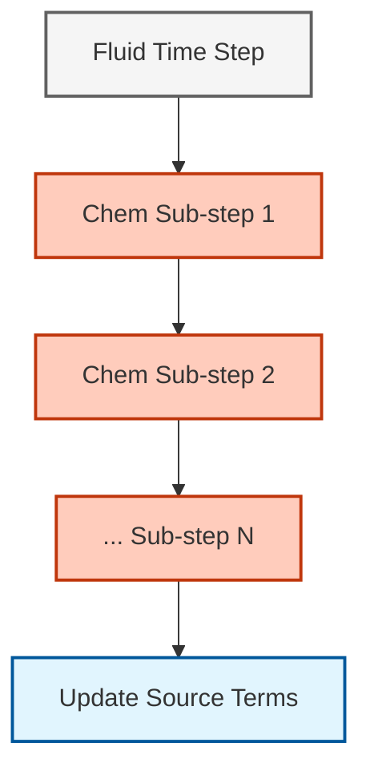

# แบบจำลองทางเคมีและตัวแก้สมการ ODE (Chemistry Models and ODE Solvers)

## 🎯 จุดประสงค์การเรียนรู้ (Learning Objectives)

เมื่ออ่านจบบทนี้ คุณจะสามารถ:
1. **อธิบาย** ลักษณะเฉพาะของระบบ ODE แบบแข็ง (stiff systems) และผลกระทบต่อการคำนวณ
2. **เลือกใช้** ตัวแก้สมการ ODE ที่เหมาะสม (SEulex, Rosenbrock, CVODE) สำหรับปัญหาที่แตกต่างกัน
3. **ตั้งค่า** พารามิเตอร์ที่จำเป็นใน `constant/chemistryProperties` สำหรับการจำลองการเผาไหม้
4. **ประยุกต์ใช้** กฎของอาร์เรเนียสเพื่อคำนวณค่าคงที่อัตราการเกิดปฏิกิริยา
5. **วิเคราะห์** การแลกเปลี่ยนระหว่างความแม่นยำและประสิทธิภาพในการแก้ปัญหาเคมี

---

## 📋 ภาพรวม (What)

**แบบจำลองเคมี** (Chemistry Models) ใน OpenFOAM เป็นกรอบการทำงานสำหรับการบูรณาการสมการอัตราการเกิดปฏิกิริยาเคมีในระบบการเผาไหม้ ซึ่งเชื่อมโยงกับแบบจำลองการขนส่งของไหลผ่านเทคนิค **Operator Splitting** ส่วนหลักของระบบประกอบด้วย:

1. **ตัวแก้สมการ ODE** (ODE Solvers): SEulex, Rosenbrock, CVODE
2. **คลาส `chemistryModel`**: อินเทอร์เฟซหลักสำหรับการคำนวณทางเคมี
3. **กลไกการปรับช่วงเวลา**: การควบคุมความแม่นยำและประสิทธิภาพ

---

## 💡 ความสำคัญ (Why)

ระบบการเผาไหม้มี **มาตราส่วนเวลา (time scales)** ที่แตกต่างกันอย่างมหาศาล ตั้งแต่ $10^{-9}$ วินาที (ปฏิกิริยาอนุมูลอิสระ) ไปจนถึง $10^{-1}$ วินาที (การก่อตัวของ NOx) ช่วงเวลาที่กว้างนี้ทำให้เกิด **ระบบสมการเชิงอนุพันธ์สามัญแบบแข็ง (stiff ODE systems)** ซึ่ง:

- ตัวแก้สมการแบบชัดแจ้ง (explicit solvers) ต้องการช่วงเวลาที่เล็กเกินไป → **คำนวณช้าเกินไป**
- ตัวแก้สมการแบบโดยนัย (implicit solvers) จำเป็นต้องใช้เพื่อ **เสถียรภาพและประสิทธิภาพ**

---

## 🛠️ การใช้งาน (How)

### 1. โครงสร้างของปัญหาเคมี

OpenFOAM บูรณาการอัตราการเกิดปฏิกิริยาด้วยสมการ:

$$\frac{d Y_i}{dt} = \frac{\dot{\omega}_i}{\rho}$$

โดยที่:
- $Y_i$ = เศษส่วนมวลของสปีชีส์ $i$ [-]
- $\dot{\omega}_i$ = อัตราการเกิดปฏิกิริยาของสปีชีส์ $i$ [kg/(m³·s)]
- $\rho$ = ความหนาแน่น [kg/m³]

### 2. การตั้งค่าพื้นฐาน

**ไฟล์: `constant/chemistryProperties`**

```cpp
FoamFile
{
    version     2.0;
    format      ascii;
    class       dictionary;
    location    "constant";
    object      chemistryProperties;
}

chemistryType
{
    solver          SEulex;             // SEulex, Rosenbrock, หรือ CVODE
    tolerance       1e-6;               // ความคลาดเคลื่อนสัมบูรณ์
    relTol          0.01;               // ความคลาดเคลื่อนสัมพัทธ์ (0.01-0.1)
    initialChemicalTimeStep  1e-8;      // ช่วงเวลาเริ่มต้น [s]
    maxChemicalTimeStep      1e-3;      // ช่วงเวลาสูงสุด [s]
}

chemistry     on;                        // เปิดใช้งานการคำนวณทางเคมี
```

### 3. การเลือกตัวแก้สมการที่เหมาะสม

| ตัวแก้ปัญหา | เหมาะสำหรับ | ข้อดี | ข้อเสีย |
|--------|----------|--------|--------|
| **SEulex** | กลไก 10-50 สปีชีส์ | สมดุลระหว่างความเร็วและเสถียรภาพ | ไม่เหมาะกับระบบแข็งเกร็งมาก |
| **Rosenbrock** | กลไกแข็งเกร็งมาก, < 20 สปีชีส์ | เสถียรภาพสูงสุด | ต้นทุนการคำนวณสูง |
| **CVODE** | กลไกขนาดใหญ่ (> 50 สปีชีส์) | ประสิทธิภาพสูงสุดสำหรับระบบใหญ่ | ต้องการไลบรารีภายนอก |

---

## 📐 ความแข็งเกร็งของระบบ (Stiffness)

### ลักษณะทางคณิตศาสตร์

อัตราส่วนความแข็งเกร็งถูกกำหนดเป็น:

$$S = \frac{|\lambda_{\max}|}{|\lambda_{\min}|}$$

โดยที่ $\lambda$ คือค่าเจาะจง (eigenvalues) ของเมทริกซ์ Jacobian สำหรับการเผาไหม้:
- $S \approx 10^{6}$ ถึง $10^{9}$ (แข็งเกร็งอย่างมาก)

### มาตราส่วนเวลาในการเผาไหม้

| มาตราส่วนเวลา | กระบวนการ | ช่วงเวลาทั่วไป |
|-----------|---------|---------------|
| **รวดเร็ว** | ปฏิกิริยาอนุมูลอิสระ (H, O, OH) | $10^{-9}$ ถึง $10^{-6}$ วินาที |
| **ปานกลาง** | การออกซิเดชันของ CO | $10^{-3}$ ถึง $10^{-1}$ วินาที |
| **ช้า** | การก่อตัวของ NOx | $10^{-1}$ ถึง $10^{0}$ วินาที |

> [!WARNING] **ทำไมวิธีการแบบชัดแจ้งจึงล้มเหลว**
> ตัวแก้สมการแบบชัดแจ้งต้องการช่วงเวลา (time step) ที่เล็กกว่ามาตราส่วนเวลาที่เร็วที่สุดเพื่อรักษาเสถียรภาพ สำหรับระบบที่แข็งเกร็งมาก สิ่งนี้จะทำให้ต้นทุนการคำนวณสูงจนไม่สามารถยอมรับได้

---

## 🔬 ตัวแก้สมการ ODE ใน OpenFOAM

### SEulex (Semi-Explicit Extrapolation)

- **ประเภท:** กึ่งโดยนัยอ้างอิงการประมาณค่า (Extrapolation)
- **เสถียรภาพ:** สูง
- **เหมาะสำหรับ:** กลไกขนาดปานกลาง (< 50 สปีชีส์)
- **ต้นทุน:** ปานกลาง

### Rosenbrock

- **ประเภท:** ประเภท Rosenbrock (Implicit Runge-Kutta)
- **เสถียรภาพ:** สูงมาก
- **เหมาะสำหรับ:** ระบบที่แข็งเกร็งมาก (เช่น การเผาไหม้ H₂)
- **ต้นทุน:** สูง

### CVODE (Sundials Library)

- **ประเภท:** ไลบรารีภายนอก (Variable-step, variable-order BDF/Adams)
- **เสถียรภาพ:** สูงมาก
- **เหมาะสำหรับ:** กลไกขนาดใหญ่ (> 100 สปีชีส์)
- **ต้นทุน:** ต่ำ (เมื่อเทียบกับขนาดปัญหา)

---

## 📊 กฎของอาร์เรเนียส (Arrhenius Law)

### สมการอัตราการเกิดปฏิกิริยา

อัตราการเกิดปฏิกิริยาเป็นไปตามสมการอาร์เรเนียสที่ปรับปรุงแล้ว:

$$k = A T^\beta \exp\left(-\frac{E_a}{RT}\right)$$

**พารามิเตอร์:**
- $A$ = ปัจจัยก่อนเลขชี้กำลัง [เช่น (mol/cm³)^(1-n) / s]
- $\beta$ = เลขชี้กำลังอุณหภูมิ [-]
- $E_a$ = พลังงานก่อกัมมันต์ [J/mol หรือ cal/mol]
- $R$ = ค่าคงที่สากลของก๊าซ = 8.314 J/(mol·K)
- $T$ = อุณหภูมิ [K]

### การแปลงหน่วย

> [!TIP] **ระวังเรื่องหน่วย!**
> ไฟล์ Chemkin มักใช้หน่วย **cal/mol** สำหรับ $E_a$ แต่ OpenFOAM จะแปลงเป็น **J/mol** ภายในโปรแกรม:
> $$E_a [\text{J/mol}] = 4184 \times E_a [\text{cal/mol}]$$

### การพึ่งพาอุณหภูมิ

ปัจจัยอาร์เรเนียสแปรผันอย่างมากตามอุณหภูมิ:

$$\begin{align}
\text{ที่ } T &= 300\text{ K}: &&k \approx 10^{-20} \text{ s}^{-1} \\\\
\text{ที่ } T &= 1500\text{ K}: &&k \approx 10^{8} \text{ s}^{-1}
\end{align}$$

การแปรผันถึง $10^{28}$ เท่านี้เองที่สร้างความแข็งเกร็งในระบบการเผาไหม้

---

## ⚙️ คลาส `chemistryModel`

### เมธอดหลัก

| เมธอด | วัตถุประสงค์ | สิ่งที่ส่งคืน |
|--------|---------|--------|
| `solve(deltaT)` | บูรณาการทางเคมีสำหรับช่วงเวลาที่กำหนด | void |
| `RR(i)` | คืนค่าอัตราปฏิกิริยาสำหรับสปีชีส์ i | scalarField |
| `omega()` | คืนค่าอัตราปฏิกิริยาทั้งหมด | PtrList |

> **หมายเหตุ:** ลำดับชั้นของคลาส `chemistryModel` และการสืบทอดอธิบายอยู่ใน [[01_Reacting_Flow_Fundamentals|รากฐานการไหลแบบมีปฏิกิริยา]]

---

## 🔍 คุณสมบัติขั้นสูง

### การปรับช่วงเวลาแบบปรับตัว (Adaptive Time Stepping)

ตัวแก้สมการเคมีของ OpenFOAM ใช้เทคนิคการปรับช่วงเวลาแบบปรับตัว:

```cpp
// การปรับช่วงเวลาแบบปรับตัวสำหรับการบูรณาการทางเคมี
scalar deltaTChem = min(deltaT, maxChemicalTimeStep);

// ตัวแก้ปัญหาจะปรับภายในตามปัจจัยดังนี้:
// 1. อัตราปฏิกิริยาเฉพาะที่ - ปฏิกิริยาที่เร็วขึ้นต้องการช่วงเวลาที่เล็กลง
// 2. พฤติกรรมการลู่เข้า - ขั้นตอนที่ไม่ลู่เข้าจะกระตุ้นการลดช่วงเวลาลง
// 3. การประมาณค่าข้อผิดพลาด - ปรับขนาดช่วงเวลาตามการควบคุมข้อผิดพลาด
```

### การประเมิน Jacobian

สำหรับระบบที่แข็งเกร็ง เมทริกซ์ Jacobian มีความสำคัญอย่างยิ่ง:

$$\mathbf{J}_{ij} = \frac{\partial \dot{\omega}_i}{\partial Y_j}$$

**วิธีการประเมิน:**
1. **เชิงตัวเลข (Numerical)**: การประมาณค่าด้วยผลต่างอันดับสุดท้าย
2. **เชิงวิเคราะห์ (Analytical)**: การหาอนุพันธ์ที่แน่นอน (รวดเร็วกว่าและแม่นยำกว่า)

### การทำขั้นตอนย่อย (Sub-cycling)

เคมีจะใช้เทคนิค **ขั้นตอนย่อย** เพื่อรักษาความแม่นยำ:


> **รูปที่ 1:** แผนภาพแสดงกระบวนการคำนวณแบบขั้นตอนย่อยของเคมีภายในหนึ่งขั้นตอนเวลาของการไหลหลัก

---

## ✅ สรุป (Summary)

### ประเด็นสำคัญ (Key Takeaways)

1. **ความแข็งเกร็ง** เกิดจากมาตราส่วนเวลาเคมีที่แตกต่างกันมาก ($10^{-9}$ ถึง $10^{-1}$ วินาที)
2. **ตัวแก้สมการแบบโดยนัย** (SEulex, Rosenbrock, CVODE) จำเป็นต่อเสถียรภาพ
3. **การแยกตัวดำเนินการ** แยกการบูรณาการทางเคมีออกจากการขนส่งของไหล (ดูรายละเอียดใน [[02_Species_Transport|สมการการขนส่งสปีชีส์]])
4. **กฎของอาร์เรเนียส** ควบคุมการพึ่งพาอุณหภูมิ: $k = A T^\beta \exp(-E_a/RT)$
5. **การปรับช่วงเวลาแบบปรับตัว** ช่วยรักษาความแม่นยำในขณะที่ควบคุมต้นทุน

### การใช้งานใน OpenFOAM

```cpp
// ขั้นตอนการทำงานหลักสำหรับการจำลองการไหลแบบมีปฏิกิริยา
while (runTime.run())
{
    // 1. แก้สมการเคมี (การบูรณาการ ODE พร้อมการแยกตัวดำเนินการ)
    chemistry.solve(deltaT);

    // 2. รับอัตราการเกิดปฏิกิริยาสำหรับแต่ละสปีชีส์
    const volScalarField& RR_CH4 = chemistry.RR(CH4_ID);

    // 3. แก้สมการการขนส่งพร้อมเทอมแหล่งกำเนิดทางเคมี
    solve
    (
        fvm::ddt(rho, CH4)        // เทอมสภาวะไม่คงตัว
      + fvm::div(phi, CH4)        // การพา
      - fvm::laplacian(D_CH4, CH4) // การแพร่
   ==
        RR_CH4                     // แหล่งกำเนิดเคมี
    );
}
```

---

## 🧠 Concept Check: ทดสอบความเข้าใจ

<details>
<summary><b>1. "Stiffness" แปลว่าอะไรในบริบทการคำนวณเคมี?</b></summary>

**คำตอบ:** คือสภาวะที่มี **Time Scale แตกต่างกันอย่างมหาศาล** ในระบบเดียวกัน (เช่น ปฏิกิริยากำจัดอนุมูลอิสระใช้เวลา $10^{-9}$ วินาที แต่การเกิด NOx ใช้เวลา $1$ วินาที) ทำให้ Solver ทั่วไป (Explicit) ต้องใช้ Time Step ที่เล็กเท่าตัวที่เร็วที่สุด ส่งผลให้คำนวณช้ามาก

</details>

<details>
<summary><b>2. เมื่อไหร่ควรใช้ SEulex vs Rosenbrock vs CVODE?</b></summary>

**คำตอบ:**
- **SEulex:** ดีที่สุดสำหรับกรณีทั่วไป (10-50 สปีชีส์)
- **Rosenbrock:** ดีสำหรับเคมีที่แข็งเกร็งมากๆ และจำนวน Species น้อย (< 20)
- **CVODE:** ดีที่สุดสำหรับกลไกขนาดใหญ่ (100+ Species)

</details>

<details>
<summary><b>3. ทำไมเราต้องแปลงหน่วย Activation Energy ($E_a$) จาก Chemkin?</b></summary>

**คำตอบ:** เพราะนักเคมีชอบใช้ **cal/mol** ในขณะที่ OpenFOAM (และ SI Unit) ใช้ **J/mol** ถ้าไม่แปลง ค่า Reaction Rate จะผิดไปมหาศาลเพราะอยู่ใน Exponential Term ($e^{-E_a/RT}$)

</details>

---

## 🔗 หัวข้อที่เกี่ยวข้อง (Related Topics)

- [[01_Reacting_Flow_Fundamentals|รากฐานการไหลแบบมีปฏิกิริยา]] — แนะนำคอนเซ็ปต์พื้นฐาน
- [[02_Species_Transport|สมการการขนส่งสปีชีส์]] — ความสมดุลของการพา-การแพร่-ปฏิกิริยา
- [[04_Combustion_Models|แบบจำลองการเผาไหม้: PaSR เทียบกับ EDC]] — ปฏิสัมพันธ์ความปั่นป่วน-เคมี
- [[05_Chemkin_Parsing|การวิเคราะห์ไฟล์ Chemkin]] — รูปแบบไฟล์กลไกและการแปลงข้อมูล
- [[06_Practical_Workflow|ขั้นตอนการทำงานจริง]] — การตั้งค่าการจำลองการไหลแบบมีปฏิกิริยา