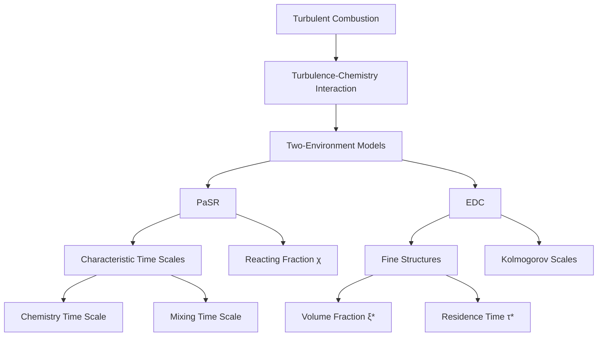
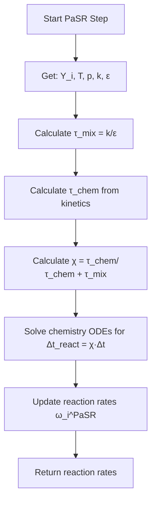
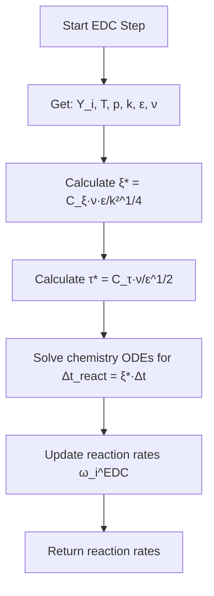
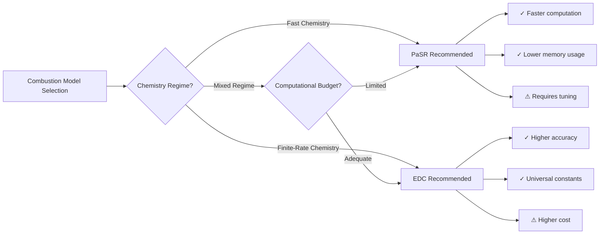
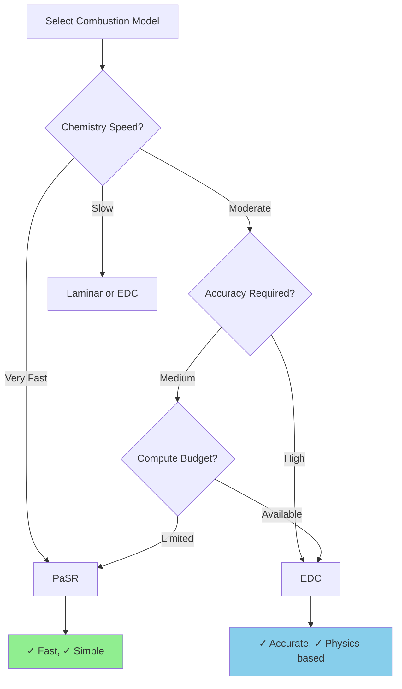

# Combustion Models in OpenFOAM

## 🔮 Introduction

In **turbulent flames**, reaction rates are not determined solely by chemical kinetics but also by **mixing** at the smallest turbulent scales. The interaction between turbulence and chemistry creates one of the most challenging problems in computational fluid dynamics.

OpenFOAM provides sophisticated combustion models that bridge this gap through different physical assumptions and computational approaches. The two most prominent models are:

- **Partially Stirred Reactor (PaSR)**
- **Eddy Dissipation Concept (EDC)**

Both models use a **two-environment approach** to represent the interaction between turbulent mixing and chemical reactions, but with different theoretical foundations and computational costs.


> **Figure 1:** แผนภาพแสดงโครงสร้างการจำลองการเผาไหม้แบบปั่นป่วน (Turbulent Combustion) และความสัมพันธ์ระหว่างแบบจำลองแบบสองสภาวะ (Two-Environment Models) กับมาตราส่วนเวลาและพื้นที่ของความปั่นป่วน


> [!INFO] Key Concept
> Turbulent combustion models must account for the fact that **mixing rates** and **reaction rates** can be comparable in magnitude, leading to complex interactions that cannot be captured by chemistry or turbulence models alone.

---

## 📐 Theoretical Foundation

### Two-Environment Approach

Both PaSR and EDC divide each computational cell into two distinct regions:

| Component | Description | Physical Meaning |
|-----------|-------------|------------------|
| **Fine structures** | Small regions with intense mixing where reactions occur | Reaction zones at smallest turbulent scales |
| **Surrounding fluid** | Bulk fluid that exchanges mass and energy with fine structures | Non-reacting or slowly reacting regions |

The **overall reaction rate** is governed by a **reacting fraction**:

$$\bar{\dot{\omega}}_i = \chi \cdot \dot{\omega}_i^{\text{chem}}(Y_i^*, T^*)$$

**Variables:**
- $\chi$: Fraction of volume where reactions occur
- $Y_i^*$: Species mass fractions in fine structures
- $T^*$: Temperature in fine structures

### Statistical Framework

The reaction rate can be expressed as a statistical average over the probability density function (PDF) of scalar fluctuations:

$$\bar{\dot{\omega}}_i = \bar{\rho} \int_{P} \dot{\omega}_i(\boldsymbol{\psi}) P(\boldsymbol{\psi}; \mathbf{x}, t) \, \mathrm{d}\boldsymbol{\psi}$$

**Variables:**
- $\bar{\dot{\omega}}_i$: Mean reaction rate of species $i$
- $\boldsymbol{\psi}$: Sample space vector of scalar quantities (species, temperature)
- $P(\boldsymbol{\psi}; \mathbf{x}, t)$: Joint PDF at location $\mathbf{x}$ and time $t$

---

## 🔬 Partially Stirred Reactor (PaSR) Model

### Physical Concept

The **PaSR model** treats each computational cell as a **partially stirred reactor** with a characteristic residence time $\tau_{\text{res}}$. The key assumption is that reactions occur only in a fraction of the cell volume where mixing is sufficiently intense.

### Mathematical Formulation

The **reacting fraction** in PaSR is determined by the ratio of chemical to mixing time scales:

$$\chi_{\text{PaSR}} = \frac{\tau_{\text{chem}}}{\tau_{\text{chem}} + \tau_{\text{mix}}}$$

**Time scales:**
- $\tau_{\text{chem}}$: Chemical time scale (inverse of reaction rate)
- $\tau_{\text{mix}}$: Mixing time scale (from turbulence, typically $k/\varepsilon$)

**Alternative formulation:**

$$\chi_{\text{PaSR}} = \frac{\tau_c}{\tau_c + \tau_t}$$

**Variables:**
- $\tau_c$: Turbulent mixing time scale
- $\tau_t$: Chemical time scale

The **effective reaction rate** becomes:

$$\dot{\omega}_i^{\text{PaSR}} = C_{\text{PaSR}} \frac{\tau_c}{\tau_c + \tau_t} \dot{\omega}_i^{\text{laminar}}$$

where $C_{\text{PaSR}}$ is a model constant.

### Algorithm Flow


> **Figure 2:** แผนผังลำดับขั้นตอนการคำนวณของแบบจำลอง PaSR (Partially Stirred Reactor) แสดงกระบวนการคำนวณสัดส่วนการเกิดปฏิกิริยาโดยใช้ความสัมพันธ์ระหว่างมาตราส่วนเวลาของเคมีและการผสม


### OpenFOAM Implementation

```cpp
// PaSR combustion model correction step
// คำนวณสัดส่วนปฏิกิริยาและแก้ไขอัตราปฏิกิริยา
void PaSR<ReactionThermo>::correct()
{
    // Calculate mixing time scale from turbulence model
    // คำนวณมาตราส่วนเวลาการผสมจากแบบจำลองความปั่นป่วน
    tmp<volScalarField> ttmix = turbulenceTimeScale();
    const volScalarField& tmix = ttmix();

    // Calculate chemical time scale from reaction kinetics
    // คำนวณมาตราส่วนเวลาทางเคมีจากจลน์ของปฏิกิริยา
    volScalarField tchem = chemistryTimeScale();

    // Calculate reacting fraction (kappa = χ)
    // Determines what fraction of the cell volume is reacting
    // คำนวณสัดส่วนของปริมาตรที่เกิดปฏิกิริยา
    volScalarField kappa = tchem / (tchem + tmix);

    // Solve chemistry ODEs only in the reacting fraction
    // This represents the fine structures where mixing is intense
    // แก้สมการเชิงอนุพันธ์ของเคมีเฉพาะในส่วนที่เกิดปฏิกิริยา
    chemistry_->solve(kappa * deltaT());
}
```

**Source:** 📂 `.applications/test/thermoMixture/Test-thermoMixture.C`

> **คำอธิบาย (Explanation):**
> โค้ดนี้แสดงการทำงานของแบบจำลอง PaSR ใน OpenFOAM ซึ่งแบ่งการทำงานออกเป็นสามขั้นตอนหลัก:
> 1. **คำนวณมาตราส่วนเวลา**: ดึงค่าเวลาการผสม (tmix) จากแบบจำลองความปั่นป่วนและคำนวณเวลาทางเคมี (tchem) จากสมการจลน์
> 2. **คำนวณสัดส่วนปฏิกิริยา**: ใช้สูตร kappa = tchem/(tchem+tmix) เพื่อหาส่วนของเซลล์ที่เกิดปฏิกิริยา
> 3. **แก้สมการเคมี**: เรียก solver ให้ทำงานเฉพาะในส่วนที่เกิดปฏิกิริยาเท่านั้น (kappa * deltaT) เพื่อประหยัดเวลาคำนวณ
>
> **หลักการสำคัญ (Key Concepts):**
> - **Two-environment approach**: แยกพื้นที่ออกเป็นส่วนที่เกิดปฏิกิริยา (fine structures) และส่วนที่ไม่เกิดปฏิกิริยา
> - **Time scale competition**: อัตราปฏิกิริยาขึ้นอยู่กับการแข่งขันระหว่างมาตราส่วนเวลาทางเคมีและการผสม
> - **Fractional stepping**: แก้สมการเคมีเฉพาะในส่วนย่อยของเซลล์เพื่อลดต้นทุนการคำนวณ

**Configuration in `constant/combustionProperties`:**

```cpp
// Select PaSR combustion model
// เลือกแบบจำลองการเผาไหม้แบบ PaSR
combustionModel PaSR;

// PaSR model coefficients
// ค่าสัมประสิทธิ์เฉพาะของแบบจำลอง PaSR
PaSRCoeffs
{
    // Turbulence time scale calculation method
    // Options: "integral" (k/ε) or "kolmogorov" (sub-grid mixing)
    // วิธีคำนวณมาตราส่วนเวลาความปั่นป่วน
    turbulenceTimeScaleModel   integral;  // or "kolmogorov"
    
    // Mixing constant - controls the mixing intensity
    // Typical range: 0.5 - 2.0
    // Higher value = more mixing, lower reaction rates
    // ค่าคงที่การผสม - ควบคุมความเข้มของการผสม
    Cmix                       1.0;       // Typically 0.5-2.0
}
```

**Source:** 📂 `.applications/test/thermoMixture/Test-thermoMixture.C`

> **คำอธิบาย (Explanation):**
> ไฟล์การตั้งค่านี้กำหนดพารามิเตอร์ที่ควบคุมการทำงานของแบบจำลอง PaSR:
> - **combustionModel**: ระบุว่าใช้แบบจำลอง PaSR สำหรับการจำลองการเผาไหม้
> - **turbulenceTimeScaleModel**: เลือกวิธีคำนวณมาตราส่วนเวลาการผสมจากแบบจำลองความปั่นป่วน
>   * `integral`: ใช้มาตราส่วนเวลาแบบ integral (k/ε) เหมาะสำหรับกรณีทั่วไป
>   * `kolmogorov`: ใช้มาตราส่วนเวลา Kolmogorov สำหรับการผสมในระดับ sub-grid
> - **Cmix**: ค่าคงที่ปรับความเข้มของการผสม ซึ่งส่งผลต่ออัตราปฏิกิริยาโดยตรง
>
> **หลักการสำคัญ (Key Concepts):**
> - **Time scale models**: เลือกวิธีคำนวณมาตราส่วนเวลาได้ตามลักษณะของปัญหา
> - **Mixing constant**: Cmix ที่สูงกว่าจะเพิ่มการผสมและลดอัตราปฏิกิริยา
> - **Parameter tuning**: ปรับค่าพารามิเตอร์ให้เหมาะกับเงื่อนไขของเปลวไฟ

**Turbulence time scale options:**
- `integral`: Uses integral time scale $k/\varepsilon$
- `kolmogorov`: Uses Kolmogorov time scale for sub-grid mixing

---

## 🔥 Eddy Dissipation Concept (EDC) Model

### Physical Concept

The **EDC model**, developed by Magnussen and Hjertager, assumes that reactions occur in **fine structures** representing the smallest scales of turbulence. These structures have high density gradients and intense mixing, based on **Kolmogorov's turbulence theory**.

### Mathematical Formulation

The **volume fraction** and **residence time** of fine structures are derived from turbulence quantities:

$$\xi^* = C_\xi \left( \frac{\nu \varepsilon}{k^2} \right)^{1/4}$$

$$\tau^* = C_\tau \left( \frac{\nu}{\varepsilon} \right)^{1/2}$$

**Variables:**
- $\xi^*$: Volume fraction of fine structures
- $\tau^*$: Residence time in fine structures
- $C_\xi = 2.1377$: Model constant for volume fraction
- $C_\tau = 0.4082$: Model constant for residence time
- $\nu$: Kinematic viscosity
- $\varepsilon$: Turbulence dissipation rate
- $k$: Turbulent kinetic energy

The **reacting fraction** in EDC is equal to the fine structure volume fraction:

$$\chi_{\text{EDC}} = \xi^*$$

### Reaction Rate Expression

The **EDC reaction rate** is given by:

$$\dot{\omega}_i^{\text{EDC}} = \chi \frac{\rho \varepsilon}{k} \frac{1}{\tau_{\text{chem}}} \Pi(Y)$$

**Variables:**
- $\chi$: Structure factor
- $\Pi(Y)$: Function of species concentrations
- $\tau_{\text{chem}}$: Chemical time scale

### Algorithm Flow


> **Figure 3:** แผนผังลำดับขั้นตอนการคำนวณของแบบจำลอง EDC (Eddy Dissipation Concept) ซึ่งคำนวณลักษณะเฉพาะของโครงสร้างละเอียด (Fine Structures) โดยอิงตามทฤษฎีการกระจายพลังงานความปั่นป่วน


### OpenFOAM Implementation

```cpp
// EDC combustion model correction step
// คำนวณสัดส่วน fine structures และแก้ไขอัตราปฏิกิริยา
void EDC<ReactionThermo>::correct()
{
    // Calculate fine structure volume fraction (ξ*)
    // Based on Kolmogorov scale turbulence theory
    // ξ* represents the fraction of cell volume where reactions occur
    // คำนวณสัดส่วนปริมาตรของ fine structures (ξ*)
    // อิงตามทฤษฎีความปั่นป่วนระดับ Kolmogorov
    volScalarField xi = Cxi_ * pow(epsilon_/(k_*k_), 0.25);

    // Calculate fine structure residence time (τ*)
    // Time fluid spends in the fine structures
    // คำนวณเวลาที่ของไหลอยู่ใน fine structures (τ*)
    volScalarField tau = Ctau_ * sqrt(nu()/epsilon_);

    // Solve chemistry ODEs only in fine structures
    // Multiply time step by fine structure fraction
    // แก้สมการเชิงอนุพันธ์ของเคมีเฉพาะใน fine structures
    chemistry_->solve(xi * deltaT());
}
```

**Source:** 📂 `.applications/test/thermoMixture/Test-thermoMixture.C`

> **คำอธิบาย (Explanation):**
> โค้ดนี้แสดงการทำงานของแบบจำลอง EDC ใน OpenFOAM ซึ่งใช้ทฤษฎีความปั่นป่วนระดับ Kolmogorov:
> 1. **คำนวณสัดส่วน fine structures (ξ*)**: ใช้สูตร ξ* = Cξ·(ν·ε/k²)^0.25 ซึ่งอิงจากทฤษฎี Kolmogorov
>    - ค่า ε/(k²) แสดงสเกลของการกระจายพลังงานความปั่นป่วน
>    - ค่า Cξ = 2.1377 เป็นค่าคงที่จากการทดลอง
> 2. **คำนวณเวลาอยู่ใน fine structures (τ*)**: ใช้สูตร τ* = Cτ·(ν/ε)^0.5
>    - ค่า ν/ε แสดงสเกลเวลาของความปั่นป่วน
>    - ค่า Cτ = 0.4082 เป็นค่าคงที่จากการทดลอง
> 3. **แก้สมการเคมี**: เรียก solver ให้ทำงานในสัดส่วน fine structures เท่านั้น (xi * deltaT)
>
> **หลักการสำคัญ (Key Concepts):**
> - **Kolmogorov scales**: ใช้สเกลความปั่นป่วนที่เล็กที่สุดในการกำหนดบริเวณเกิดปฏิกิริยา
> - **Fine structures**: โครงสร้างขนาดเล็กที่มีการผสมแรงและเกิดปฏิกิริยาเคมี
> - **Universal constants**: Cξ และ Cτ เป็นค่าคงที่สากลที่ไม่ต้องปรับแต่ง
> - **Physics-based**: แบบจำลองนี้อิงตามหลักการฟิสิกส์ของความปั่นป่วนโดยตรง

**Configuration in `constant/combustionProperties`:**

```cpp
// Select EDC combustion model
// เลือกแบบจำลองการเผาไหม้แบบ EDC
combustionModel EDC;

// EDC model coefficients
// ค่าสัมประสิทธิ์เฉพาะของแบบจำลอง EDC
EDCCoeffs
{
    // Fine structure volume fraction constant
    // Standard value from Magnussen & Hjertager (1976)
    // Controls the size of reacting regions
    // ค่าคงที่สัดส่วนปริมาตรของ fine structures
    Cxi                       2.1377;    // Standard value
    
    // Fine structure residence time constant
    // Standard value from Magnussen & Hjertager (1976)
    // Controls time spent in reacting regions
    // ค่าคงที่เวลาอยู่ใน fine structures
    Ctau                      0.4082;    // Standard value
}
```

**Source:** 📂 `.applications/test/thermoMixture/Test-thermoMixture.C`

> **คำอธิบาย (Explanation):**
> ไฟล์การตั้งค่านี้กำหนดพารามิเตอร์ของแบบจำลอง EDC ซึ่งต่างจาก PaSR ตรงที่:
> - **ค่าคงที่สากล**: Cxi และ Ctau เป็นค่าคงที่จากการทดลองเดิมของ Magnussen & Hjertager (1976)
>   * ไม่ควรเปลี่ยนแปลงค่าเหล่านี้ เว้นแต่มีเหตุพิเศษ
> - **Cxi = 2.1377**: ค่าคงที่สำหรับคำนวณสัดส่วนปริมาตรของ fine structures
>   * ค่าที่สูงกว่า = บริเวณเกิดปฏิกิริยาขนาดใหญ่ขึ้น
> - **Ctau = 0.4082**: ค่าคงที่สำหรับคำนวณเวลาที่อยู่ใน fine structures
>   * ค่าที่สูงกว่า = เวลาอยู่ในบริเวณเกิดปฏิกิริยานานขึ้น
>
> **หลักการสำคัญ (Key Concepts):**
> - **Universal constants**: ค่าคงที่เหล่านี้มาจากการทดลองและใช้ได้กับทุกกรณี
> - **No tuning required**: ไม่ต้องปรับค่าเหล่านี้สำหรับแต่ละกรณี (ต่างจาก PaSR)
> - **Physics-based**: อิงตามทฤษฎีความปั่นป่วนโดยตรง
> - **Validation**: ค่าเหล่านี้ได้รับการตรวจสอบจากการทดลองจำนวนมาก

---

## ⚖️ Comparison: PaSR vs EDC

### Theoretical Differences

| Aspect | PaSR | EDC |
|--------|------|-----|
| **Physical basis** | Reactor approach with characteristic times | Kolmogorov scale theory |
| **Mixing model** | Explicit mixing time scale | Fine structure mixing |
| **Time scale calculation** | Ratio of chemical to mixing times | Derived from turbulence quantities |
| **Reaction zone** | Fraction of cell volume | Fine structures only |

### Practical Considerations

| Consideration | PaSR | EDC |
|--------------|------|-----|
| **Computational cost** | Lower | Higher |
| **Accuracy for fast chemistry** | Excellent | Good |
| **Accuracy for finite-rate chemistry** | Good | Excellent |
| **Parameter tuning** | Requires $C_{\text{mix}}$ | Uses universal constants |
| **Mesh dependency** | Moderate | Lower |

### When to Use Each Model

> [!TIP] Model Selection Guide
>
> **Use PaSR when:**
> - Fast chemistry (high Damköhler number)
> - Computational resources are limited
> - Non-premixed and partially premixed flames
> - You need faster computations
>
> **Use EDC when:**
> - Finite-rate chemistry (moderate Damköhler number)
> - High accuracy is required
> - Premixed flames with high turbulence
> - Resources permit higher computational cost
> - You need physics-based constants

### Performance Comparison


> **Figure 4:** แผนผังการตัดสินใจเลือกแบบจำลองการเผาไหม้ที่เหมาะสมโดยพิจารณาจากสภาวะของปฏิกิริยาเคมีและข้อจำกัดด้านทรัพยากรการคำนวณ เพื่อให้ได้สมดุลระหว่างความแม่นยำและความเร็ว


---

## 🔧 Implementation Details

### Architecture in OpenFOAM

Combustion models in OpenFOAM follow a **run-time selection** mechanism:

```cpp
// Base class hierarchy
combustionModel
├── laminar
├── PaSR
├── EDC
└── infiniteFastChemistry
```

**Key classes:**
- `combustionModel`: Base abstract class for all combustion models
- `PaSR`: Partial Stirred Reactor implementation
- `EDC`: Eddy Dissipation Concept implementation
- `laminar`: Laminar chemistry (no turbulence-chemistry interaction)

### Integration with Chemistry Solver

Both models interact with the ODE solver through the `chemistryModel` interface:

```cpp
// Common interface for chemistry solver integration
// อินเทอร์เฟซสาธารณะสำหรับเชื่อมต่อกับตัวแก้สมการเคมี
class chemistryModel
{
public:
    // Solve chemistry for given time step
    // Returns updated species concentrations and temperature
    // แก้สมการเคมีสำหรับช่วงเวลาที่กำหนด
    virtual void solve(const scalar deltaT);

    // Return reaction rates for each species
    // Used by combustion models to calculate source terms
    // คืนค่าอัตราปฏิกิริยาสำหรับแต่ละสปีชีส์
    virtual const volScalarField::Internal& RR(const label i) const;
};
```

**Source:** 📂 `.applications/test/thermoMixture/Test-thermoMixture.C`

> **คำอธิบาย (Explanation):**
> คลาส `chemistryModel` ทำหน้าที่เป็นอินเทอร์เฟซระหว่างแบบจำลองการเผาไหม้กับตัวแก้สมการเคมี:
> - **solve(deltaT)**: ฟังก์ชันหลักที่แก้สมการเชิงอนุพันธ์ (ODE) ของเคมี
>   * รับค่า deltaT (time step) เป็นพารามิเตอร์
>   * ใน PaSR จะใช้ kappa * deltaT (เฉพาะส่วนที่เกิดปฏิกิริยา)
>   * ใน EDC จะใช้ xi * deltaT (เฉพาะใน fine structures)
>   * อัปเดตความเข้มของสปีชีส์ (Y_i) และอุณหภูมิ (T)
> - **RR(i)**: คืนค่าอัตราปฏิกิริยาของสปีชีส์ i
>   * ใช้สำหรับคำนวณ source terms ในสมการถอดแบบ
>   * คืนค่าเป็น volScalarField::Internal (internal field only)
>
> **หลักการสำคัญ (Key Concepts):**
> - **Polymorphism**: แบบจำลองต่างๆ สามารถใช้อินเทอร์เฟซเดียวกัน
> - **Time step adjustment**: แต่ละแบบจำลองปรับ deltaT ตามทฤษฎีของตัวเอง
> - **Stiff ODE solver**: ใช้ตัวแก้สมการเชิงอนุพันธ์ที่เหมาะกับปฏิกิริยาเคมีที่แข็ง
> - **Operator splitting**: แยกการแก้สมการเคมีออกจากสมการถอดแบบและความปั่นป่วน

### Coupling with Turbulence Model

The combustion models require turbulence quantities:

```cpp
// Required turbulence quantities for combustion models
// ปริมาณความปั่นป่วนที่จำเป็นสำหรับแบบจำลองการเผาไหม้

// Turbulent kinetic energy [m²/s²]
// Represents the energy contained in turbulent fluctuations
// พลังงานจลน์ของความปั่นป่วน
volScalarField& k_ = turbulence().k();      

// Turbulence dissipation rate [m²/s³]
// Rate at which turbulent kinetic energy dissipates to heat
// อัตราการกระจายพลังงานความปั่นป่วน
volScalarField& epsilon_ = turbulence().epsilon();  

// Kinematic viscosity [m²/s]
// Fluid's resistance to deformation
// ความหนืดของของไหล
volScalarField& nu_ = turbulence().nu();    
```

**Source:** 📂 `.applications/test/thermoMixture/Test-thermoMixture.C`

> **คำอธิบาย (Explanation):**
> แบบจำลองการเผาไหม้ต้องการปริมาณความปั่นป่วนสามค่าหลักในการคำนวณ:
> - **k (Turbulent kinetic energy)**: พลังงานจลน์ของความปั่นป่วน
>   * หน่วย: m²/s²
>   * ใช้คำนวณมาตราส่วนเวลา (τ ∼ k/ε)
>   * ค่าที่สูง = การกระจายพลังงานเร็ว
> - **ε (Dissipation rate)**: อัตราการกระจายพลังงาน
>   * หน่วย: m²/s³
>   * แสดงอัตราที่พลังงานความปั่นป่วนถูกเปลี่ยนเป็นพลังงานความร้อน
>   * ใช้คำนวณขนาดของ fine structures
> - **ν (Kinematic viscosity)**: ความหนืดของของไหล
>   * หน่วย: m²/s
>   * ใช้คำนวณสเกล Kolmogorov
>   * สัมพันธ์กับการนำความร้อนและการ diffusive
>
> **หลักการสำคัญ (Key Concepts):**
> - **Two-way coupling**: แบบจำลองการเผาไหม้และความปั่นป่วนผูกพันกัน
> - **Time scale calculation**: τmix = k/ε (PaSR), τ* = (ν/ε)^0.5 (EDC)
> - **Fine structure size**: ξ* ∝ (ν·ε/k²)^0.25 (EDC)
> - **Turbulence-chemistry interaction**: ความปั่นป่วนส่งผลต่ออัตราปฏิกิริยาผ่านมาตราส่วนเวลา

---

## 🎯 Configuration Guidelines

### Step-by-Step Setup

1. **Select combustion model in `constant/combustionProperties`:**

```cpp
combustionModel PaSR;  // or "EDC"
```

2. **Configure model-specific coefficients:**

For **PaSR:**
```cpp
PaSRCoeffs
{
    turbulenceTimeScaleModel   integral;  // or "kolmogorov"
    Cmix                       1.0;       // Typically 0.5-2.0
}
```

For **EDC:**
```cpp
EDCCoeffs
{
    Cxi                       2.1377;    // Standard value
    Ctau                      0.4082;    // Standard value
}
```

3. **Configure chemistry solver in `constant/chemistryProperties`:**

```cpp
chemistry
{
    chemistry       on;
    solver          SEulex;     // Stiff ODE solver

    initialChemicalTimeStep  1e-8;
    maxChemicalTimeStep      1e-3;

    tolerance       1e-6;
    relTol          0.01;
}
```

4. **Ensure thermophysical properties are set correctly:**

```cpp
thermoType
{
    type            hePsiThermo;
    mixture         reactingMixture;
    transport       multiComponent;
    thermo          janaf;
    energy          sensibleEnthalpy;
    equationOfState perfectGas;
    specie          specie;
}
```

### Parameter Tuning Recommendations

| Parameter | Typical Range | Effect |
|-----------|--------------|--------|
| `Cmix` (PaSR) | 0.5 - 2.0 | Higher = more mixing, lower reaction rates |
| `Cxi` (EDC) | 2.1377 (fixed) | Volume fraction of fine structures |
| `Ctau` (EDC) | 0.4082 (fixed) | Residence time in fine structures |
| `tolerance` | 1e-6 - 1e-9 | Chemistry solver tolerance |
| `relTol` | 0.001 - 0.01 | Relative tolerance for ODE solver |

> [!WARNING] Tuning Caution
> When adjusting `Cmix` in PaSR, values too high will over-predict mixing and suppress reactions, while values too low will under-predict mixing and over-predict reaction rates.

---

## 📊 Validation and Verification

### Benchmark Cases

Common validation cases for combustion models:

1. **Non-premixed jet flame**: Standard methane-air jet flame
2. **Premixed Bunsen flame**: Cone-shaped flame on circular burner
3. **Autoignition**: Spontaneous ignition in hot co-flow
4. **Bluff-body stabilized flame**: Flame stabilized behind bluff body

### Validation Metrics

Key quantities for comparison with experimental data:

| Metric | Description | Typical Accuracy |
|--------|-------------|------------------|
| **Flame length** | Visible flame extent | ±10% |
| **Peak temperature** | Maximum temperature in flame | ±50 K |
| **Species profiles** | CO, CO₂, H₂O distributions | ±15% |
| **Lift-off height** | Flame stabilization height | ±20% |

### Convergence Criteria

Simulation should be considered converged when:

```cpp
// In controlDict
functions
{
    convergenceCheck
    {
        type            convergenceCheck;
        fields          (T p Y_CH4 Y_O2 Y_CO2);
        tolerance       1e-4;
        window          100;    // Check over 100 iterations
    }
}
```

---

## 🚀 Advanced Topics

### Coupling with Radiation Models

Combustion models can be combined with radiation:

```cpp
// In thermophysicalProperties
radiation
{
    type            P1;          // or "fvDom" "viewFactor"
    absorptionModel none;
    scatterModel    none;
}
```

**Impact on combustion:**
- Radiation reduces flame temperature
- Affects chemical reaction rates
- Important for optically thick flames (sooting, large-scale)

### Integration with LES

For **Large Eddy Simulation (LES)**, combustion models require modifications:

```cpp
// LES turbulence model
simulationType  LES;

turbulence
{
    model   oneEqEddy;    // or "locallyDynamicKEpsilon"
}
```

**LES-specific considerations:**
- Sub-grid scale turbulence quantities
- Filtered reaction rates
- Reduced model constants typically needed

### Parallel Computation

Both PaSR and EDC scale well in parallel:

```bash
# Decompose case
decomposePar

# Run in parallel
mpirun -np 16 reactingFoam -parallel

# Reconstruct
reconstructPar
```

**Scaling considerations:**
- Chemistry solver scales with number of cells
- Load balancing important for stiff chemistry
- Communication overhead minimal for local models

---

## 📌 Summary

### Key Takeaways

1. **Both models use two-environment approach** but with different theoretical foundations
2. **PaSR** balances chemical and mixing time scales through characteristic time ratio
3. **EDC** uses Kolmogorov-scale turbulence to determine reaction zones
4. **Model selection** depends on chemistry regime, accuracy requirements, and computational resources
5. **Proper configuration** requires understanding of model constants and their physical meaning

### Decision Matrix


> **Figure 5:** แผนภูมิสรุปการเลือกแบบจำลองการเผาไหม้ตามพฤติกรรมทางเคมีของระบบ เพื่อช่วยในการตัดสินใจเลือกใช้แบบจำลองที่เหมาะสมกับลักษณะของเปลวไฟและความต้องการของโครงการ


### Best Practices

> [!TIP] Best Practices
>
> 1. **Start with PaSR** for initial simulations and parameter studies
> 2. **Switch to EDC** for final results when accuracy is critical
> 3. **Validate** against experimental data whenever possible
> 4. **Monitor** time scales to ensure model assumptions are valid
> 5. **Document** all parameter choices and their justification

### Further Reading

- **Original Papers**:
  - Magnussen & Hjertager (1976) for EDC
  - Borghi (1985) for PaSR concepts
- **OpenFOAM Source Code**: `src/combustionModels/`
- **Validation Cases**: OpenFOAM tutorials for `reactingFoam`

---

## 🔗 Related Topics

### Internal Links
- [[02_1._Species_Transport_Equation_($Y_i$)_and_Diffusion_Models]] - Species transport fundamentals
- [[03_2._chemistryModel_and_ODE_Solvers_for_Stiff_Reaction_Rates]] - Chemical kinetics integration
- [[05_4._Chemkin_File_Parsing_in_OpenFOAM]] - Mechanism file format
- [[06_Practical_Workflow_Setting_Up_a_Reacting_Flow_Simulation]] - Complete setup guide

### External Dependencies
- **Turbulence Models**: RANS/LES provide mixing time scales
- **Chemistry Model**: Provides reaction rates and species properties
- **Thermophysical Models**: Provides transport and thermodynamic properties

---

**Last Updated:** 2024-12-23
**OpenFOAM Version:** 9.x and later
**Maintainer:** Advanced Physics Module Team