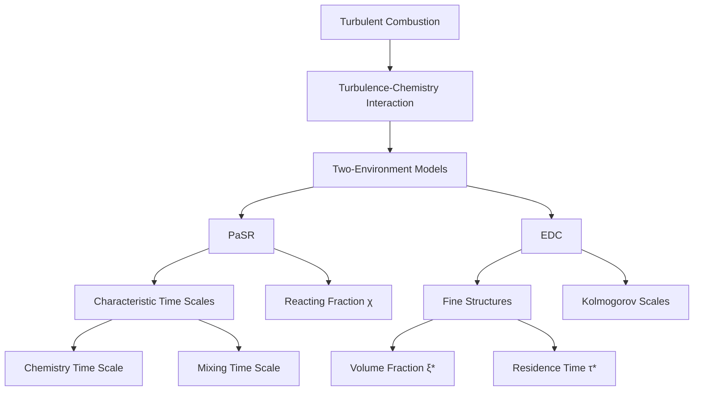
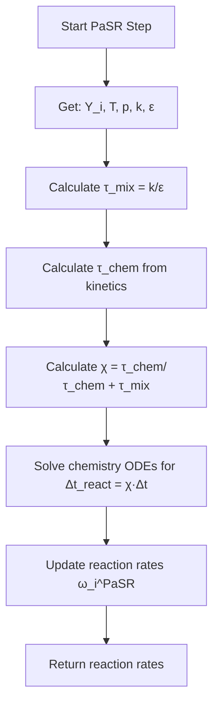
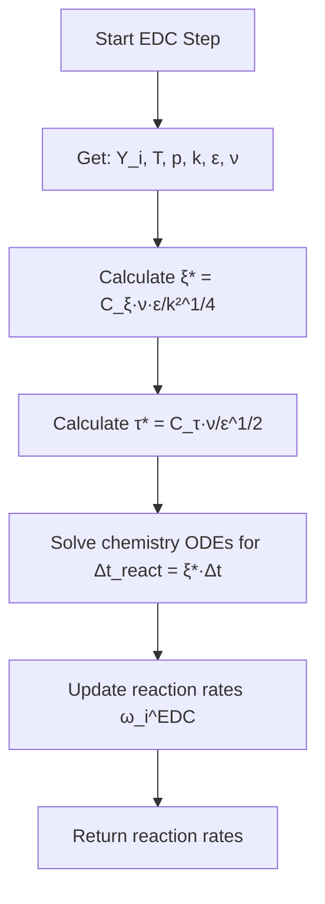
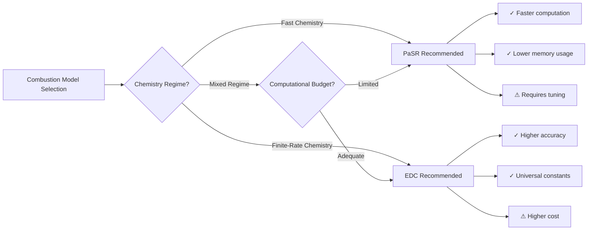
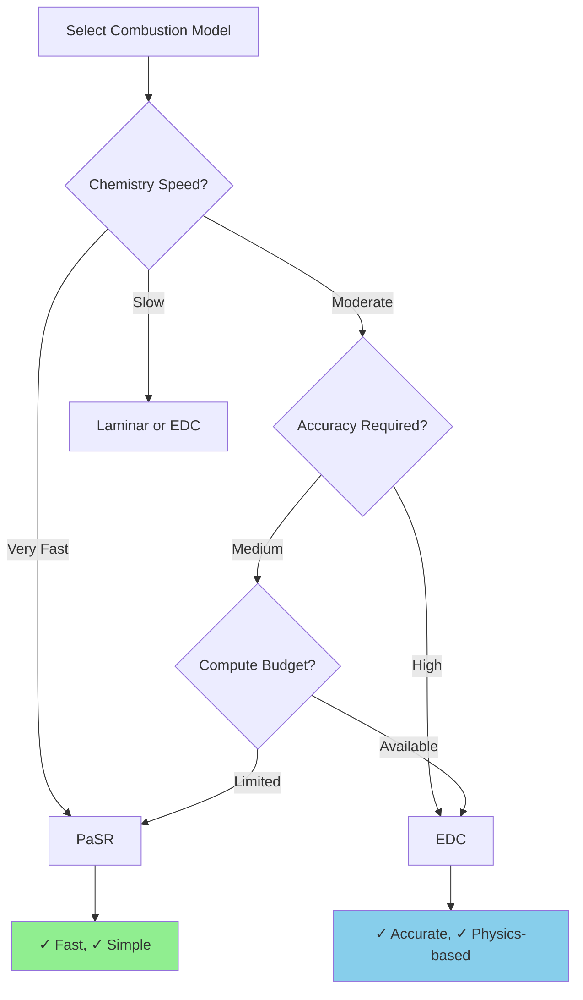

# Combustion Models in OpenFOAM

## 🔮 Introduction

In **turbulent flames**, reaction rates are not determined solely by chemical kinetics but also by **mixing** at the smallest turbulent scales. The interaction between turbulence and chemistry creates one of the most challenging problems in computational fluid dynamics.

OpenFOAM provides sophisticated combustion models that bridge this gap through different physical assumptions and computational approaches. The two most prominent models are:

- **Partially Stirred Reactor (PaSR)**
- **Eddy Dissipation Concept (EDC)**

Both models use a **two-environment approach** to represent the interaction between turbulent mixing and chemical reactions, but with different theoretical foundations and computational costs.



> [!INFO] Key Concept
> Turbulent combustion models must account for the fact that **mixing rates** and **reaction rates** can be comparable in magnitude, leading to complex interactions that cannot be captured by chemistry or turbulence models alone.

---

## 📐 Theoretical Foundation

### Two-Environment Approach

Both PaSR and EDC divide each computational cell into two distinct regions:

| Component | Description | Physical Meaning |
|-----------|-------------|------------------|
| **Fine structures** | Small regions with intense mixing where reactions occur | Reaction zones at smallest turbulent scales |
| **Surrounding fluid** | Bulk fluid that exchanges mass and energy with fine structures | Non-reacting or slowly reacting regions |

The **overall reaction rate** is governed by a **reacting fraction**:

$$\bar{\dot{\omega}}_i = \chi \cdot \dot{\omega}_i^{\text{chem}}(Y_i^*, T^*)$$

**Variables:**
- $\chi$: Fraction of volume where reactions occur
- $Y_i^*$: Species mass fractions in fine structures
- $T^*$: Temperature in fine structures

### Statistical Framework

The reaction rate can be expressed as a statistical average over the probability density function (PDF) of scalar fluctuations:

$$\bar{\dot{\omega}}_i = \bar{\rho} \int_{P} \dot{\omega}_i(\boldsymbol{\psi}) P(\boldsymbol{\psi}; \mathbf{x}, t) \, \mathrm{d}\boldsymbol{\psi}$$

**Variables:**
- $\bar{\dot{\omega}}_i$: Mean reaction rate of species $i$
- $\boldsymbol{\psi}$: Sample space vector of scalar quantities (species, temperature)
- $P(\boldsymbol{\psi}; \mathbf{x}, t)$: Joint PDF at location $\mathbf{x}$ and time $t$

---

## 🔬 Partially Stirred Reactor (PaSR) Model

### Physical Concept

The **PaSR model** treats each computational cell as a **partially stirred reactor** with a characteristic residence time $\tau_{\text{res}}$. The key assumption is that reactions occur only in a fraction of the cell volume where mixing is sufficiently intense.

### Mathematical Formulation

The **reacting fraction** in PaSR is determined by the ratio of chemical to mixing time scales:

$$\chi_{\text{PaSR}} = \frac{\tau_{\text{chem}}}{\tau_{\text{chem}} + \tau_{\text{mix}}}$$

**Time scales:**
- $\tau_{\text{chem}}$: Chemical time scale (inverse of reaction rate)
- $\tau_{\text{mix}}$: Mixing time scale (from turbulence, typically $k/\varepsilon$)

**Alternative formulation:**

$$\chi_{\text{PaSR}} = \frac{\tau_c}{\tau_c + \tau_t}$$

**Variables:**
- $\tau_c$: Turbulent mixing time scale
- $\tau_t$: Chemical time scale

The **effective reaction rate** becomes:

$$\dot{\omega}_i^{\text{PaSR}} = C_{\text{PaSR}} \frac{\tau_c}{\tau_c + \tau_t} \dot{\omega}_i^{\text{laminar}}$$

where $C_{\text{PaSR}}$ is a model constant.

### Algorithm Flow



### OpenFOAM Implementation

```cpp
void PaSR<ReactionThermo>::correct()
{
    // Calculate mixing time scale
    tmp<volScalarField> ttmix = turbulenceTimeScale();
    const volScalarField& tmix = ttmix();

    // Calculate chemical time scale
    volScalarField tchem = chemistryTimeScale();

    // Calculate reacting fraction
    volScalarField kappa = tchem / (tchem + tmix);

    // Solve chemistry in fine structures only
    chemistry_->solve(kappa * deltaT());
}
```

**Configuration in `constant/combustionProperties`:**

```cpp
combustionModel PaSR;

PaSRCoeffs
{
    turbulenceTimeScaleModel   integral;  // or "kolmogorov"
    Cmix                       1.0;       // Mixing constant
}
```

**Turbulence time scale options:**
- `integral`: Uses integral time scale $k/\varepsilon$
- `kolmogorov`: Uses Kolmogorov time scale for sub-grid mixing

---

## 🔥 Eddy Dissipation Concept (EDC) Model

### Physical Concept

The **EDC model**, developed by Magnussen and Hjertager, assumes that reactions occur in **fine structures** representing the smallest scales of turbulence. These structures have high density gradients and intense mixing, based on **Kolmogorov's turbulence theory**.

### Mathematical Formulation

The **volume fraction** and **residence time** of fine structures are derived from turbulence quantities:

$$\xi^* = C_\xi \left( \frac{\nu \varepsilon}{k^2} \right)^{1/4}$$

$$\tau^* = C_\tau \left( \frac{\nu}{\varepsilon} \right)^{1/2}$$

**Variables:**
- $\xi^*$: Volume fraction of fine structures
- $\tau^*$: Residence time in fine structures
- $C_\xi = 2.1377$: Model constant for volume fraction
- $C_\tau = 0.4082$: Model constant for residence time
- $\nu$: Kinematic viscosity
- $\varepsilon$: Turbulence dissipation rate
- $k$: Turbulent kinetic energy

The **reacting fraction** in EDC is equal to the fine structure volume fraction:

$$\chi_{\text{EDC}} = \xi^*$$

### Reaction Rate Expression

The **EDC reaction rate** is given by:

$$\dot{\omega}_i^{\text{EDC}} = \chi \frac{\rho \varepsilon}{k} \frac{1}{\tau_{\text{chem}}} \Pi(Y)$$

**Variables:**
- $\chi$: Structure factor
- $\Pi(Y)$: Function of species concentrations
- $\tau_{\text{chem}}$: Chemical time scale

### Algorithm Flow



### OpenFOAM Implementation

```cpp
void EDC<ReactionThermo>::correct()
{
    // Calculate fine structure volume fraction
    volScalarField xi = Cxi_ * pow(epsilon_/(k_*k_), 0.25);

    // Calculate fine structure residence time
    volScalarField tau = Ctau_ * sqrt(nu()/epsilon_);

    // Solve chemistry in fine structures
    chemistry_->solve(xi * deltaT());
}
```

**Configuration in `constant/combustionProperties`:**

```cpp
combustionModel EDC;

EDCCoeffs
{
    Cxi                       2.1377;    // Volume fraction constant
    Ctau                      0.4082;    // Residence time constant
}
```

---

## ⚖️ Comparison: PaSR vs EDC

### Theoretical Differences

| Aspect | PaSR | EDC |
|--------|------|-----|
| **Physical basis** | Reactor approach with characteristic times | Kolmogorov scale theory |
| **Mixing model** | Explicit mixing time scale | Fine structure mixing |
| **Time scale calculation** | Ratio of chemical to mixing times | Derived from turbulence quantities |
| **Reaction zone** | Fraction of cell volume | Fine structures only |

### Practical Considerations

| Consideration | PaSR | EDC |
|--------------|------|-----|
| **Computational cost** | Lower | Higher |
| **Accuracy for fast chemistry** | Excellent | Good |
| **Accuracy for finite-rate chemistry** | Good | Excellent |
| **Parameter tuning** | Requires $C_{\text{mix}}$ | Uses universal constants |
| **Mesh dependency** | Moderate | Lower |

### When to Use Each Model

> [!TIP] Model Selection Guide
>
> **Use PaSR when:**
> - Fast chemistry (high Damköhler number)
> - Computational resources are limited
> - Non-premixed and partially premixed flames
> - You need faster computations
>
> **Use EDC when:**
> - Finite-rate chemistry (moderate Damköhler number)
> - High accuracy is required
> - Premixed flames with high turbulence
> - Resources permit higher computational cost
> - You need physics-based constants

### Performance Comparison



---

## 🔧 Implementation Details

### Architecture in OpenFOAM

Combustion models in OpenFOAM follow a **run-time selection** mechanism:

```cpp
// Base class hierarchy
combustionModel
├── laminar
├── PaSR
├── EDC
└── infiniteFastChemistry
```

**Key classes:**
- `combustionModel`: Base abstract class for all combustion models
- `PaSR`: Partial Stirred Reactor implementation
- `EDC`: Eddy Dissipation Concept implementation
- `laminar`: Laminar chemistry (no turbulence-chemistry interaction)

### Integration with Chemistry Solver

Both models interact with the ODE solver through the `chemistryModel` interface:

```cpp
// Common interface
class chemistryModel
{
public:
    // Solve chemistry for given time step
    virtual void solve(const scalar deltaT);

    // Return reaction rates
    virtual const volScalarField::Internal& RR(const label i) const;
};
```

### Coupling with Turbulence Model

The combustion models require turbulence quantities:

```cpp
// Required turbulence quantities
volScalarField& k_ = turbulence().k();      // Turbulent kinetic energy
volScalarField& epsilon_ = turbulence().epsilon();  // Dissipation rate
volScalarField& nu_ = turbulence().nu();    // Kinematic viscosity
```

---

## 🎯 Configuration Guidelines

### Step-by-Step Setup

1. **Select combustion model in `constant/combustionProperties`:**

```cpp
combustionModel PaSR;  // or "EDC"
```

2. **Configure model-specific coefficients:**

For **PaSR:**
```cpp
PaSRCoeffs
{
    turbulenceTimeScaleModel   integral;  // or "kolmogorov"
    Cmix                       1.0;       // Typically 0.5-2.0
}
```

For **EDC:**
```cpp
EDCCoeffs
{
    Cxi                       2.1377;    // Standard value
    Ctau                      0.4082;    // Standard value
}
```

3. **Configure chemistry solver in `constant/chemistryProperties`:**

```cpp
chemistry
{
    chemistry       on;
    solver          SEulex;     // Stiff ODE solver

    initialChemicalTimeStep  1e-8;
    maxChemicalTimeStep      1e-3;

    tolerance       1e-6;
    relTol          0.01;
}
```

4. **Ensure thermophysical properties are set correctly:**

```cpp
thermoType
{
    type            hePsiThermo;
    mixture         reactingMixture;
    transport       multiComponent;
    thermo          janaf;
    energy          sensibleEnthalpy;
    equationOfState perfectGas;
    specie          specie;
}
```

### Parameter Tuning Recommendations

| Parameter | Typical Range | Effect |
|-----------|--------------|--------|
| `Cmix` (PaSR) | 0.5 - 2.0 | Higher = more mixing, lower reaction rates |
| `Cxi` (EDC) | 2.1377 (fixed) | Volume fraction of fine structures |
| `Ctau` (EDC) | 0.4082 (fixed) | Residence time in fine structures |
| `tolerance` | 1e-6 - 1e-9 | Chemistry solver tolerance |
| `relTol` | 0.001 - 0.01 | Relative tolerance for ODE solver |

> [!WARNING] Tuning Caution
> When adjusting `Cmix` in PaSR, values too high will over-predict mixing and suppress reactions, while values too low will under-predict mixing and over-predict reaction rates.

---

## 📊 Validation and Verification

### Benchmark Cases

Common validation cases for combustion models:

1. **Non-premixed jet flame**: Standard methane-air jet flame
2. **Premixed Bunsen flame**: Cone-shaped flame on circular burner
3. **Autoignition**: Spontaneous ignition in hot co-flow
4. **Bluff-body stabilized flame**: Flame stabilized behind bluff body

### Validation Metrics

Key quantities for comparison with experimental data:

| Metric | Description | Typical Accuracy |
|--------|-------------|------------------|
| **Flame length** | Visible flame extent | ±10% |
| **Peak temperature** | Maximum temperature in flame | ±50 K |
| **Species profiles** | CO, CO₂, H₂O distributions | ±15% |
| **Lift-off height** | Flame stabilization height | ±20% |

### Convergence Criteria

Simulation should be considered converged when:

```cpp
// In controlDict
functions
{
    convergenceCheck
    {
        type            convergenceCheck;
        fields          (T p Y_CH4 Y_O2 Y_CO2);
        tolerance       1e-4;
        window          100;    // Check over 100 iterations
    }
}
```

---

## 🚀 Advanced Topics

### Coupling with Radiation Models

Combustion models can be combined with radiation:

```cpp
// In thermophysicalProperties
radiation
{
    type            P1;          // or "fvDom" "viewFactor"
    absorptionModel none;
    scatterModel    none;
}
```

**Impact on combustion:**
- Radiation reduces flame temperature
- Affects chemical reaction rates
- Important for optically thick flames (sooting, large-scale)

### Integration with LES

For **Large Eddy Simulation (LES)**, combustion models require modifications:

```cpp
// LES turbulence model
simulationType  LES;

turbulence
{
    model   oneEqEddy;    // or "locallyDynamicKEpsilon"
}
```

**LES-specific considerations:**
- Sub-grid scale turbulence quantities
- Filtered reaction rates
- Reduced model constants typically needed

### Parallel Computation

Both PaSR and EDC scale well in parallel:

```bash
# Decompose case
decomposePar

# Run in parallel
mpirun -np 16 reactingFoam -parallel

# Reconstruct
reconstructPar
```

**Scaling considerations:**
- Chemistry solver scales with number of cells
- Load balancing important for stiff chemistry
- Communication overhead minimal for local models

---

## 📌 Summary

### Key Takeaways

1. **Both models use two-environment approach** but with different theoretical foundations
2. **PaSR** balances chemical and mixing time scales through characteristic time ratio
3. **EDC** uses Kolmogorov-scale turbulence to determine reaction zones
4. **Model selection** depends on chemistry regime, accuracy requirements, and computational resources
5. **Proper configuration** requires understanding of model constants and their physical meaning

### Decision Matrix



### Best Practices

> [!TIP] Best Practices
>
> 1. **Start with PaSR** for initial simulations and parameter studies
> 2. **Switch to EDC** for final results when accuracy is critical
> 3. **Validate** against experimental data whenever possible
> 4. **Monitor** time scales to ensure model assumptions are valid
> 5. **Document** all parameter choices and their justification

### Further Reading

- **Original Papers**:
  - Magnussen & Hjertager (1976) for EDC
  - Borghi (1985) for PaSR concepts
- **OpenFOAM Source Code**: `src/combustionModels/`
- **Validation Cases**: OpenFOAM tutorials for `reactingFoam`

---

## 🔗 Related Topics

### Internal Links
- [[02_1._Species_Transport_Equation_($Y_i$)_and_Diffusion_Models]] - Species transport fundamentals
- [[03_2._chemistryModel_and_ODE_Solvers_for_Stiff_Reaction_Rates]] - Chemical kinetics integration
- [[05_4._Chemkin_File_Parsing_in_OpenFOAM]] - Mechanism file format
- [[06_Practical_Workflow_Setting_Up_a_Reacting_Flow_Simulation]] - Complete setup guide

### External Dependencies
- **Turbulence Models**: RANS/LES provide mixing time scales
- **Chemistry Model**: Provides reaction rates and species properties
- **Thermophysical Models**: Provides transport and thermodynamic properties

---

**Last Updated:** 2024-12-23
**OpenFOAM Version:** 9.x and later
**Maintainer:** Advanced Physics Module Team
