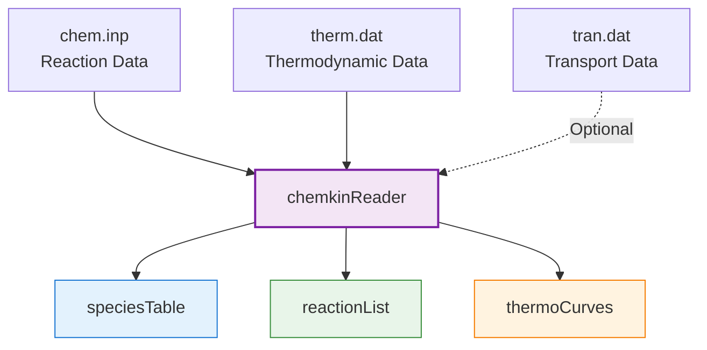
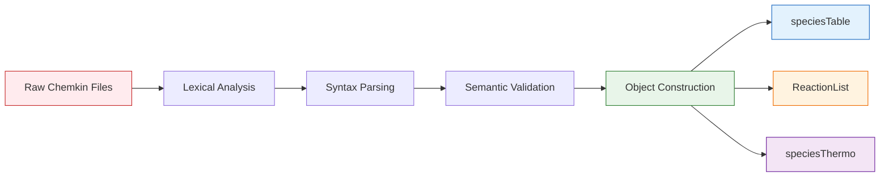

# Chemkin File Parsing in OpenFOAM

## 1. Introduction

OpenFOAM uses the industry-standard **Chemkin-II** format for chemical mechanisms. This allows using complex mechanisms (e.g., GRI-Mech 3.0 for methane combustion) directly in simulations without manual conversion.

> [!INFO] Why Chemkin Format?
> The Chemkin format has become the *de facto* standard for chemical reaction mechanisms in combustion research. By supporting it natively, OpenFOAM provides access to thousands of validated mechanisms covering fuels from hydrogen to heavy hydrocarbons.

---

## 2. File Structure

Chemkin mechanisms consist of three primary files:


> **Figure 1:** แผนภาพแสดงโครงสร้างการจัดการไฟล์ Chemkin ใน OpenFOAM โดยเครื่องมือ `chemkinReader` จะทำหน้าที่อ่านข้อมูลจากไฟล์ปฏิกิริยา (chem.inp), ข้อมูลอุณหพลศาสตร์ (therm.dat) และข้อมูลการขนส่ง (tran.dat) เพื่อสร้างโครงสร้างข้อมูลภายในสำหรับการจำลอง


| File | Description | Key Content |
|------|-------------|-------------|
| **`chem.inp`** | Reaction mechanism file | Species definitions, reaction equations, Arrhenius parameters |
| **`therm.dat`** | Thermodynamic data | NASA polynomial coefficients for $C_p(T)$, $H(T)$, $S(T)$ |
| **`tran.dat`** | Transport properties | Lennard-Jones parameters for viscosity and diffusion calculations |

---

## 3. The chemkinReader

OpenFOAM's `chemkinReader` class parses these text files at runtime to populate the `speciesTable` and `reactionList` data structures.

### 3.1 Class Architecture

The `chemkinReader` is located in:
```
src/thermophysicalModels/chemistryModel/chemkinReader/
```

**Core Class Definition:**

```cpp
template<class ReactionThermo>
class chemkinReader
:
    public chemistryReader<ReactionThermo>
{
public:
    // Read mechanism from files
    virtual void read
    (
        const fileName& chemFile,
        const fileName& thermFile,
        const fileName& tranFile = fileName::null
    );

    // Return species, reactions, thermodynamics
    virtual const speciesTable& species() const;
    virtual const ReactionList<ReactionThermo>& reactions() const;
    virtual autoPtr<ReactionThermo> thermo() const;

    // Return species thermo data
    const HashTable<speciesThermo>& speciesThermo() const;
};
```

> **Source:** `src/thermophysicalModels/chemistryModel/chemkinReader/chemkinReader.H`

> **Explanation:** The `chemkinReader` class is templated on `ReactionThermo` to support different thermodynamic packages. It inherits from `chemistryReader` base class and provides virtual methods for reading Chemkin-format files. The class maintains three primary data structures: `speciesTable` (list of species names), `ReactionList` (all reactions with rate parameters), and `speciesThermo` (NASA polynomial coefficients).

> **Key Concepts:**
> - **Template-based design**: Allows integration with different thermo models (janaf, griMech, etc.)
> - **Virtual interface**: Enables polymorphic behavior through base class pointers
> - **Runtime parsing**: Files are read during solver initialization, not compilation

### 3.2 Reaction Type Enumeration

The reader supports multiple reaction types through enum definitions:

```cpp
// Reaction type classification
enum reactionType
{
    irreversibleReactionType,
    reversibleReactionType,
    nonEquilibriumReversibleReactionType,
    unknownReactionType
};

// Rate expression types
enum reactionRateType
{
    ArrheniusReactionRateType,
    thirdBodyArrheniusReactionRateType,
    unimolecularFallOffReactionType,
    chemicallyActivatedBimolecularReactionType,
    LandauTellerReactionRateType,
    JanevReactionRateType,
    powerSeriesReactionRateType,
    unknownReactionRateType
};

// Fall-off function types for pressure-dependent reactions
enum fallOffFunctionType
{
    LindemannFallOffFunctionType,
    TroeFallOffFunctionType,
    SRIFallOffFunctionType,
    unknownFallOffFunctionType
};
```

> **Source:** `src/thermophysicalModels/chemistryModel/chemkinReader/chemkinReader.H`

> **Explanation:** These enumerations classify the different types of chemical reactions and rate expressions supported by Chemkin format. Fall-off reactions (pressure-dependent) require special treatment with different functional forms (Lindemann, Troe, SRI) to bridge between low-pressure and high-pressure limits.

> **Key Concepts:**
> - **Irreversible reactions**: Proceed only in forward direction (A + B → C)
> - **Reversible reactions**: Both directions considered (A + B ⇌ C)
> - **Fall-off reactions**: Rate depends on pressure through third-body efficiency
> - **Troe fall-off**: More accurate 3-parameter fit for complex molecules
> - **SRI fall-off**: Simplified 3-parameter correlation

### 3.3 Reaction Keyword Table

Chemkin parser uses keyword table to identify reaction modifiers:

```cpp
void Foam::chemkinReader::initReactionKeywordTable()
{
    // Third-body reactions
    reactionKeywordTable_.insert("M", thirdBodyReactionType);
    
    // Fall-off reaction types
    reactionKeywordTable_.insert("LOW", unimolecularFallOffReactionType);
    reactionKeywordTable_.insert("HIGH", chemicallyActivatedBimolecularReactionType);
    
    // Fall-off function modifiers
    reactionKeywordTable_.insert("TROE", TroeReactionType);
    reactionKeywordTable_.insert("SRI", SRIReactionType);
    
    // Specialized rate expressions
    reactionKeywordTable_.insert("LT", LandauTellerReactionType);
    reactionKeywordTable_.insert("RLT", reverseLandauTellerReactionType);
    reactionKeywordTable_.insert("JAN", JanevReactionType);
    reactionKeywordTable_.insert("FIT1", powerSeriesReactionRateType);
    
    // Additional modifiers
    reactionKeywordTable_.insert("HV", radiationActivatedReactionType);
    reactionKeywordTable_.insert("TDEP", speciesTempReactionType);
    reactionKeywordTable_.insert("EXCI", energyLossReactionType);
    reactionKeywordTable_.insert("MOME", plasmaMomentumTransfer);
    reactionKeywordTable_.insert("XSMI", collisionCrossSection);
    
    // Reaction direction and order
    reactionKeywordTable_.insert("REV", nonEquilibriumReversibleReactionType);
    reactionKeywordTable_.insert("FORD", speciesOrderForward);
    reactionKeywordTable_.insert("RORD", speciesOrderReverse);
    
    // Unit specification
    reactionKeywordTable_.insert("UNITS", UnitsOfReaction);
    
    // Control keywords
    reactionKeywordTable_.insert("DUPLICATE", duplicateReactionType);
    reactionKeywordTable_.insert("DUP", duplicateReactionType);
    reactionKeywordTable_.insert("END", end);
}
```

> **Source:** `src/thermophysicalModels/chemistryModel/chemkinReader/chemkinReader.C`

> **Explanation:** This initialization function builds a hash table that maps Chemkin keyword strings to enumeration values. The parser uses this table to efficiently identify reaction modifiers when reading each reaction line. Third-body reactions (M), fall-off reactions (LOW/HIGH), and specialized rate laws (LT for Landau-Teller, JAN for Janev) are all recognized through these keywords.

> **Key Concepts:**
> - **Hash table lookup**: O(1) keyword identification during parsing
> - **Third-body efficiency**: M represents any species as collision partner
> - **LOW/HIGH**: Low-pressure and high-pressure limit parameters for fall-off
> - **TROE/SRI**: Specific parameterizations for pressure dependence
> - **FORD/RORD**: Non-unity reaction orders for specific species

### 3.4 Molecular Weight Calculation

The reader computes molecular weights from elemental composition:

```cpp
Foam::scalar Foam::chemkinReader::molecularWeight
(
    const List<specieElement>& specieComposition
) const
{
    scalar molWt = 0.0;

    // Sum contribution from each element
    forAll(specieComposition, i)
    {
        label nAtoms = specieComposition[i].nAtoms();
        const word& elementName = specieComposition[i].name();

        // Check for isotope-specific atomic weight first
        if (isotopeAtomicWts_.found(elementName))
        {
            molWt += nAtoms * isotopeAtomicWts_[elementName];
        }
        // Fall back to standard atomic weight table
        else if (atomicWeights.found(elementName))
        {
            molWt += nAtoms * atomicWeights[elementName];
        }
        else
        {
            FatalErrorInFunction
                << "Unknown element " << elementName
                << " on line " << lineNo_ - 1 << nl
                << "    specieComposition: " << specieComposition
                << exit(FatalError);
        }
    }

    return molWt;
}
```

> **Source:** `src/thermophysicalModels/chemistryModel/chemkinReader/chemkinReader.C`

> **Explanation:** This function calculates the molecular weight of each species by summing the atomic weights of its constituent elements. It first checks for isotope-specific weights (e.g., D for deuterium, C13 for carbon-13) before falling back to standard atomic weights. The function throws a fatal error if an unknown element is encountered.

> **Key Concepts:**
> - **Isotope handling**: Supports deuterium, tritium, carbon-13, etc.
> - **Atomic weight tables**: Built-in periodic table data
> - **Error detection**: Immediate failure for invalid elements
> - **specieElement**: Structure containing element name and atom count

### 3.5 Data Flow Pipeline

The parsing process follows a systematic pipeline:


> **Figure 2:** แผนผังแสดงขั้นตอนการประมวลผลข้อมูล (Parsing Pipeline) ของไฟล์ Chemkin ซึ่งครอบคลุมตั้งแต่การวิเคราะห์ทางภาษาและไวยากรณ์ การตรวจสอบความถูกต้อง ไปจนถึงการสร้างโครงสร้างออบเจกต์ใน OpenFOAM

---

## 4. Reaction File Format (chem.inp)

The `chem.inp` file contains the chemical reaction mechanism in a structured format.

### 4.1 File Structure

```
ELEMENTS
H O C N END

SPECIES
H2 O2 H2O CO CO2 H O OH N2 END

REACTIONS CAL/MOLE
H2 + O2 => OH + H       1.70E13  0.0  20000.0
O + H2 => H + OH        1.80E13  0.0  4640.0
OH + H2 => H + H2O      2.20E13  0.0  4000.0
END
```

### 4.2 Arrhenius Rate Expression

Each reaction line contains:

```
REACTANTS = PRODUCTS    A        n     E_a
```

Where:
- **$A$** — Pre-exponential factor [units vary]
- **$n$** — Temperature exponent [-]
- **$E_a$** — Activation energy [cal/mol or J/mol]

The rate constant follows the **modified Arrhenius equation**:

$$k(T) = A \cdot T^n \cdot \exp\left(-\frac{E_a}{R_u T}\right)$$

### 4.3 Rate Coefficient Validation

The parser validates the number of Arrhenius coefficients:

```cpp
void Foam::chemkinReader::checkCoeffs
(
    const scalarList& reactionCoeffs,
    const char* reactionRateName,
    const label nCoeffs
) const
{
    // Verify correct number of coefficients
    if (reactionCoeffs.size() != nCoeffs)
    {
        FatalErrorInFunction
            << "Wrong number of coefficients for the " << reactionRateName
            << " rate expression" << nl
            << "Expected " << nCoeffs << " coefficients, but got "
            << reactionCoeffs.size() << nl
            << "Coefficients: " << reactionCoeffs
            << exit(FatalError);
    }
}
```

> **Source:** `src/thermophysicalModels/chemistryModel/chemkinReader/chemkinReader.C`

> **Explanation:** This validation function ensures that each reaction line provides the correct number of coefficients for its rate expression type. Standard Arrhenius requires 3 coefficients (A, n, E_a), while fall-off reactions require additional parameters for low/high pressure limits.

> **Key Concepts:**
> - **Input validation**: Immediate error detection during file parsing
> - **Rate expression types**: Different coefficient counts for different rate laws
> - **Error messaging**: Detailed diagnostic information for debugging

### 4.4 Advanced Reaction Types

OpenFOAM's parser supports various reaction types:

| Type | Syntax Example | Description |
|------|----------------|-------------|
| **Elementary** | `A + B = C + D` | Standard bimolecular reaction |
| **Third-body** | `A + B = C + M` | M represents any species |
| **Fall-off** | `A + B = C (+M)` | Pressure-dependent |
| **PLOG** | `PLOG /1.0E5/` | Pressure-specific rate |

**Third-body example with efficiencies:**

```
H + O2 + M = HO2 + M
H2/2.0/ H2O/6.0/ CO/1.5/ CO2/2.0/ N2/1.0/ O2/1.0/
```

---

## 5. Thermodynamic Data (therm.dat)

Thermodynamic properties use **NASA polynomials** with temperature ranges.

### 5.1 NASA Polynomial Format

```
CH4             G 8/88C   1H   4         0    0G    300.000  5000.000  1000.000    1
  5.14987613E+00-1.36709788E-02 4.91800599E-05-4.84743026E-08 1.66693956E-11    2
 -1.02466476E+04 4.65473670E+00-4.41766994E-02-1.26609280E+02 6.02236961E+04    3
```

### 5.2 Polynomial Form

**For $T_{\text{mid}} \leq T \leq T_{\text{high}}$:**

$$\frac{C_p(T)}{R} = a_1 T^{-2} + a_2 T^{-1} + a_3 + a_4 T + a_5 T^2 + a_6 T^3 + a_7 T^4$$

**For $T_{\text{low}} \leq T < T_{\text{mid}}$:**

$$\frac{C_p(T)}{R} = b_1 T^{-2} + b_2 T^{-1} + b_3 + b_4 T + b_5 T^2 + b_6 T^3 + b_7 T^4$$

**Enthalpy and Entropy:**

$$\frac{H(T)}{RT} = -a_1 T^{-2} + a_2 \frac{\ln T}{T} + a_3 + \frac{a_4}{2} T + \frac{a_5}{3} T^2 + \frac{a_6}{4} T^3 + \frac{a_7}{5} T^4 + \frac{a_8}{T}$$

$$\frac{S(T)}{R} = -\frac{a_1}{2} T^{-2} - a_2 T^{-1} + a_3 \ln T + a_4 T + \frac{a_5}{2} T^2 + \frac{a_6}{3} T^3 + \frac{a_7}{4} T^4 + a_9$$

Where the 14 coefficients are organized as:

```
a1  a2  a3  a4  a5  a6  a7  a8
b1  b2  b3  b4  b5  b6  b7  b9
```

---

## 6. Transport Data (tran.dat)

The optional `tran.dat` file provides Lennard-Jones parameters for transport calculations.

### 6.1 Format

```
TRANSPORT FIXED UNITS
H2  2.823  7.0  38.0  0.0  0.0  0.0
O2  3.467  107.4  3.8  0.0  0.0  0.0
H2O 2.641  809.1  1.0  0.0  0.0  0.0
END
```

**Parameters (for each species):**
1. **Lennard-Jones $\sigma$** — Collision diameter [Å]
2. **$\epsilon/k_B$** — Well depth parameter [K]
3. **$\mu$** — Dipole moment [Debye]
4. **$\alpha$** — Polarizability
5. **Z_rot** — Rotational relaxation number

### 6.2 Transport Properties Calculation

These parameters enable calculation of:

- **Dynamic viscosity** $\mu$ via Chapman-Enskog theory
- **Thermal conductivity** $\lambda$
- **Mass diffusivity** $D_{ij}$ for binary pairs

**Viscosity formulation:**

$$\mu = \frac{5}{16} \frac{\sqrt{\pi m k_B T}}{\pi \sigma^2 \Omega^{(2,2)*}}$$

Where $\Omega^{(2,2)*}$ is the collision integral from Lennard-Jones potential.

---

## 7. Usage in OpenFOAM

### 7.1 Configuration

In `constant/thermophysicalProperties`:

```cpp
mixture
{
    chemistryReader   chemkin;
    chemkinFile       "chem.inp";
    thermoFile        "therm.dat";
    transportFile     "tran.dat";   // optional

    species
    (
        H2
        O2
        H2O
        N2
    );
}
```

### 7.2 Solver Integration

The chemistry reader is instantiated in the reacting mixture constructor:

```cpp
reactingMixture<ReactionThermo>::reactingMixture
(
    const dictionary& thermoDict,
    const fvMesh& mesh
)
:
    multiComponentMixture<ReactionThermo>(thermoDict, mesh),
    chemistryReader_
    (
        new chemkinReader
        (
            thermoDict.subDict("mixture"),
            *this
        )
    )
{
    chemistryReader_->read
    (
        thermoDict.subDict("mixture").lookup("chemkinFile"),
        thermoDict.subDict("mixture").lookup("thermoFile")
    );
}
```

> **Source:** `src/thermophysicalModels/reactionThermo/reactingMixture/reactingMixture.C`

> **Explanation:** The reacting mixture constructor initializes the base multiComponentMixture class, then creates a chemkinReader instance to parse the chemical mechanism. The reader is stored as an autoPtr (auto pointer to handle memory management automatically). The `read()` method is called immediately to parse the Chemkin files and populate the species and reaction data structures.

> **Key Concepts:**
> - **Constructor initialization list**: Efficient member initialization
> - **Dictionary lookup**: OpenFOAM's configuration file access
> - **autoPtr**: Automatic memory management for heap-allocated objects
> - **Template inheritance**: Works with any ReactionThermo type
> - **Sub-dictionary access**: nested parameter organization

---

## 8. Common Issues and Solutions

> [!WARNING] Troubleshooting Tips

| Issue | Symptom | Solution |
|-------|---------|----------|
| **"Species not found"** | Solver crashes at startup | Verify species names match *exactly* between `chem.inp` and `therm.dat` |
| **Missing thermodynamic data** | Negative temperatures | Check all species in `chem.inp` have entries in `therm.dat` |
| **Unit mismatch** | Unrealistic reaction rates | Ensure activation energy units match (cal/mol vs J/mol) |
| **Large mechanism slowdown** | Long initialization | Consider mechanism reduction or pre-compilation |

### 8.1 Mechanism Size Considerations

| Species Count | Memory Usage | Parse Time | Practical Use |
|---------------|--------------|------------|---------------|
| **< 50** | ~10 MB | < 1 s | Educational, simple fuels |
| **50 - 200** | ~50 MB | 1-5 s | Standard combustion research |
| **200 - 1000** | ~200 MB | 5-30 s | Detailed mechanisms |
| **> 1000** | > 500 MB | > 30 s | Research only, consider reduction |

---

## 9. Best Practices

### 9.1 File Organization

```
case_directory/
├── constant/
│   ├── thermophysicalProperties  <-- Reference Chemkin files here
│   ├── chem.inp
│   ├── therm.dat
│   └── tran.dat
├── 0/                              <-- Initial conditions
└── system/
    ├── controlDict
    └── fvSchemes
```

### 9.2 Validation Workflow

1. **Syntax check**: Use `chemkinToFoam` utility for conversion validation
2. **Element balance**: Verify elements sum to zero for all reactions
3. **Thermodynamic range**: Check $T_{\text{low}}$ and $T_{\text{high}}$ cover simulation range
4. **Rate consistency**: Ensure Arrhenius parameters are physically reasonable

### 9.3 Performance Optimization

```cpp
// In chemistryProperties
chemistry
{
    // Use tabulation for large mechanisms
    chemistrySolver    rbcor;           // OR
    tabulation        on;
    tabulationControl
    {
        minTemp          300;
        maxTemp          3500;
        nTemp            20;
    };
}
```

---

## 10. Connection to Other Modules

### 10.1 Species Transport

Chemkin data directly enables the **species transport equation**:

$$\frac{\partial (\rho Y_i)}{\partial t} + \nabla \cdot (\rho \mathbf{u} Y_i) = -\nabla \cdot \mathbf{J}_i + \dot{\omega}_i$$

Where:
- **$\dot{\omega}_i$** comes from the `reactionList`
- **Diffusivity** uses transport data from `tran.dat`

### 10.2 Combustion Models

Both **PaSR** and **EDC** combustion models use:
- **Reaction rates** from `ReactionList`
- **Thermodynamic properties** from `speciesThermo`
- **Transport properties** for mixture-averaged coefficients

### 10.3 ODE Solvers

The stiff chemical ODE system:

$$\frac{\mathrm{d}Y_i}{\mathrm{d}t} = \frac{\dot{\omega}_i(Y, T, p)}{\rho}$$

is integrated using specialized solvers (e.g., **SEulex**, **Rosenbrock34**) with:
- **Jacobian** computed from reaction stoichiometry
- **Time steps** adapted based on chemical stiffness

---

## 11. Summary

| Component | Function | Key Output |
|-----------|----------|------------|
| **Chemkin Files** | Standard format for chemistry data | Text files |
| **chemkinReader** | Parser and data structure builder | `speciesTable`, `ReactionList` |
| **NASA Polynomials** | Temperature-dependent $C_p$, $H$, $S$ | Smooth thermodynamic curves |
| **Transport Data** | Viscosity and diffusion parameters | Lennard-Jones $\sigma$, $\epsilon/k_B$ |
| **Runtime Loading** | Flexible mechanism selection | No recompilation needed |

> [!TIP] Key Takeaway
> The Chemkin parsing infrastructure enables OpenFOAM to leverage decades of combustion research while maintaining the flexibility to switch mechanisms without code modification. This bridge between legacy data formats and modern CFD simulation is essential for practical combustion modeling.

---

## 12. References

1. **Chemkin Theory Manual**, Reaction Design, 2016
2. **OpenFOAM Source Code**: `src/thermophysicalModels/chemistryModel/chemkinReader/`
3. **Smith, G.P. et al.** "GRI-Mech 3.0", http://combustion.berkeley.edu/gri-mech/
4. **Kee, R.J. et al.** "The Chemkin Thermodynamic Data Base", 1986

---

## 13. Further Reading

- **[[01_🎯_File_Purpose.md]]** — Module overview and learning objectives
- **[[03_2._chemistryModel`_and_ODE_Solvers_for_Stiff_Reaction_Rates.md]]** — Chemical kinetics integration
- **[[04_3._Combustion_Models_PaSR_vs._EDC.md]]** — Turbulence-chemistry interaction models
- **[[06_🧪_Practical_Workflow_Setting_Up_a_Reacting_Flow_Simulation.md]]** — Complete case setup workflow

---
**Estimated Study Time:** 45-60 minutes