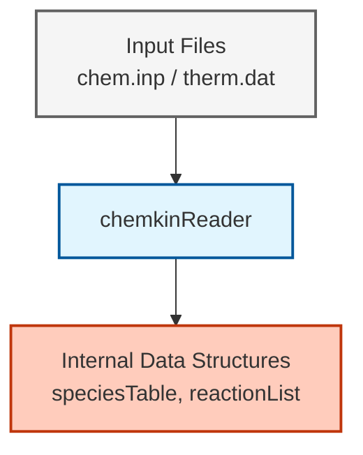
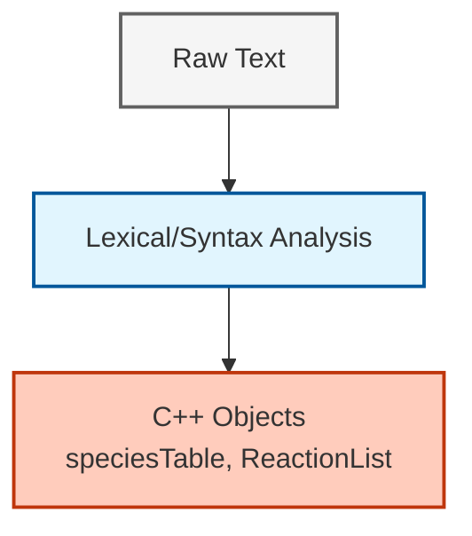

# การวิเคราะห์ไฟล์ Chemkin ใน OpenFOAM (Chemkin File Parsing in OpenFOAM)

## 1. บทนำ (Introduction)

OpenFOAM ใช้รูปแบบไฟล์ **Chemkin-II** ซึ่งเป็นมาตรฐานอุตสาหกรรมสำหรับกลไกปฏิกิริยาเคมี สิ่งนี้ช่วยให้สามารถใช้กลไกที่ซับซ้อน (เช่น GRI-Mech 3.0 สำหรับการเผาไหม้มีเทน) ในการจำลองได้โดยตรงโดยไม่ต้องแปลงไฟล์ด้วยตนเอง

> [!INFO] ทำไมต้องใช้รูปแบบ Chemkin?
> รูปแบบ Chemkin ได้กลายเป็นมาตรฐาน *de facto* สำหรับกลไกปฏิกิริยาเคมีในงานวิจัยด้านการเผาไหม้ การรองรับรูปแบบนี้ในตัว (natively) ช่วยให้ OpenFOAM สามารถเข้าถึงกลไกที่ผ่านการตรวจสอบแล้วหลายพันรายการ ครอบคลุมตั้งแต่เชื้อเพลิงไฮโดรเจนไปจนถึงไฮโดรคาร์บอนหนัก

---

## 2. โครงสร้างไฟล์ (File Structure)

กลไก Chemkin ประกอบด้วยไฟล์หลักสามประเภท:


> **รูปที่ 1:** แผนภาพแสดงโครงสร้างการจัดการไฟล์ Chemkin ใน OpenFOAM โดยเครื่องมือ `chemkinReader` จะทำหน้าที่อ่านข้อมูลจากไฟล์ปฏิกิริยา (chem.inp), ข้อมูลอุณหพลศาสตร์ (therm.dat) และข้อมูลการขนส่ง (tran.dat) เพื่อสร้างโครงสร้างข้อมูลภายในสำหรับการจำลอง


| ไฟล์ | คำอธิบาย | เนื้อหาหลัก |
|------|-------------|-------------|
| **`chem.inp`** | ไฟล์กลไกปฏิกิริยา | การนิยามสปีชีส์, สมการปฏิกิริยา, พารามิเตอร์อาร์เรเนียส |
| **`therm.dat`** | ข้อมูลเทอร์โมไดนามิก | สัมประสิทธิ์พหุนาม NASA สำหรับ $C_p(T)$, $H(T)$, $S(T)$ |
| **`tran.dat`** | สมบัติการขนส่ง | พารามิเตอร์ Lennard-Jones สำหรับการคำนวณความหนืดและการแพร่ |

---

## 3. chemkinReader

คลาส `chemkinReader` ของ OpenFOAM จะวิเคราะห์ไฟล์ข้อความเหล่านี้ขณะรันโปรแกรมเพื่อสร้างโครงสร้างข้อมูล `speciesTable` และ `reactionList`

### 3.1 สถาปัตยกรรมคลาส (Class Architecture)

`chemkinReader` อยู่ที่:
```
src/thermophysicalModels/chemistryModel/chemkinReader/
```

**การนิยามคลาสหลัก:**

```cpp
template<class ReactionThermo>
class chemkinReader
:
    public chemistryReader<ReactionThermo>
{
public:
    // อ่านกลไกจากไฟล์
    virtual void read
    (
        const fileName& chemFile,
        const fileName& thermFile,
        const fileName& tranFile = fileName::null
    );

    // คืนค่าสปีชีส์, ปฏิกิริยา, เทอร์โมไดนามิก
    virtual const speciesTable& species() const;
    virtual const ReactionList<ReactionThermo>& reactions() const;
    virtual autoPtr<ReactionThermo> thermo() const;

    // คืนค่าข้อมูลเทอร์โมของสปีชีส์
    const HashTable<speciesThermo>& speciesThermo() const;
};
```

> **แหล่งที่มา:** `src/thermophysicalModels/chemistryModel/chemkinReader/chemkinReader.H`

> **คำอธิบาย (Explanation):** คลาส `chemkinReader` เป็นคลาสเทมเพลต (templated class) บน `ReactionThermo` เพื่อรองรับแพ็กเกจเทอร์โมไดนามิกที่แตกต่างกัน คลาสนี้สืบทอดมาจากคลาสฐาน `chemistryReader` และให้เมธอดเสมือน (virtual methods) สำหรับการอ่านไฟล์รูปแบบ Chemkin คลาสจะรักษาโครงสร้างข้อมูลหลักสามส่วน ได้แก่ `speciesTable` (รายการชื่อสปีชีส์), `ReactionList` (ปฏิกิริยาทั้งหมดพร้อมพารามิเตอร์อัตรา) และ `speciesThermo` (สัมประสิทธิ์พหุนาม NASA)

> **แนวคิดสำคัญ (Key Concepts):**
> - **การออกแบบอิงตามเทมเพลต**: ช่วยให้บูรณาการกับโมเดลเทอร์โมต่างๆ ได้ (janaf, griMech ฯลฯ)
> - **ส่วนติดต่อแบบเสมือน**: ช่วยให้เกิดพฤติกรรมแบบโพลิมอร์ฟิก (polymorphic) ผ่านพอยน์เตอร์คลาสฐาน
> - **การวิเคราะห์ขณะรัน**: ไฟล์จะถูกอ่านในระหว่างการเริ่มต้นตัวแก้ปัญหา ไม่ใช่ตอนคอมไพล์

### 3.2 การจำแนกประเภทปฏิกิริยา (Reaction Type Enumeration)

ผู้อ่านรองรับประเภทปฏิกิริยาที่หลากหลายผ่านการนิยาม enum:

```cpp
// การจำแนกประเภทปฏิกิริยา
enum reactionType
{
    irreversibleReactionType,
    reversibleReactionType,
    nonEquilibriumReversibleReactionType,
    unknownReactionType
};

// ประเภทนิพจน์อัตรา
enum reactionRateType
{
    ArrheniusReactionRateType,
    thirdBodyArrheniusReactionRateType,
    unimolecularFallOffReactionType,
    chemicallyActivatedBimolecularReactionType,
    LandauTellerReactionRateType,
    JanevReactionRateType,
    powerSeriesReactionRateType,
    unknownReactionRateType
};

// ประเภทฟังก์ชัน Fall-off สำหรับปฏิกิริยาที่ขึ้นกับความดัน
enum fallOffFunctionType
{
    LindemannFallOffFunctionType,
    TroeFallOffFunctionType,
    SRIFallOffFunctionType,
    unknownFallOffFunctionType
};
```

> **แหล่งที่มา:** `src/thermophysicalModels/chemistryModel/chemkinReader/chemkinReader.H`

> **คำอธิบาย (Explanation):** การแจงนับ (enumerations) เหล่านี้ช่วยจำแนกประเภทต่างๆ ของปฏิกิริยาเคมีและนิพจน์อัตราที่รองรับในรูปแบบ Chemkin ปฏิกิริยาแบบ Fall-off (ขึ้นกับความดัน) ต้องการการจัดการพิเศษด้วยรูปแบบฟังก์ชันที่แตกต่างกัน (Lindemann, Troe, SRI) เพื่อเชื่อมต่อระหว่างขีดจำกัดความดันต่ำและความดันสูง

> **แนวคิดสำคัญ (Key Concepts):**
> - **ปฏิกิริยาผันกลับไม่ได้**: ดำเนินไปในทิศทางเดียวเท่านั้น (A + B → C)
> - **ปฏิกิริยาผันกลับได้**: พิจารณาทั้งสองทิศทาง (A + B ⇌ C)
> - **ปฏิกิริยา Fall-off**: อัตราขึ้นกับความดันผ่านประสิทธิภาพของตัวที่สาม (third-body efficiency)
> - **Troe fall-off**: การปรับค่า 3 พารามิเตอร์ที่แม่นยำกว่าสำหรับโมเลกุลที่ซับซ้อน
> - **SRI fall-off**: ความสัมพันธ์ 3 พารามิเตอร์แบบลดรูป

### 3.3 ตารางคีย์เวิร์ดปฏิกิริยา (Reaction Keyword Table)

ตัววิเคราะห์ Chemkin ใช้ตารางคีย์เวิร์ดเพื่อระบุตัวปรับแก้ปฏิกิริยา (reaction modifiers):

```cpp
void Foam::chemkinReader::initReactionKeywordTable()
{
    // ปฏิกิริยาที่มีตัวที่สาม (Third-body)
    reactionKeywordTable_.insert("M", thirdBodyReactionType);
    
    // ประเภทปฏิกิริยา Fall-off
    reactionKeywordTable_.insert("LOW", unimolecularFallOffReactionType);
    reactionKeywordTable_.insert("HIGH", chemicallyActivatedBimolecularReactionType);
    
    // ตัวปรับแก้ฟังก์ชัน Fall-off
    reactionKeywordTable_.insert("TROE", TroeReactionType);
    reactionKeywordTable_.insert("SRI", SRIReactionType);
    
    // นิพจน์อัตราเฉพาะทาง
    reactionKeywordTable_.insert("LT", LandauTellerReactionType);
    reactionKeywordTable_.insert("RLT", reverseLandauTellerReactionType);
    reactionKeywordTable_.insert("JAN", JanevReactionType);
    reactionKeywordTable_.insert("FIT1", powerSeriesReactionRateType);
    
    // ตัวปรับแก้เพิ่มเติม
    reactionKeywordTable_.insert("HV", radiationActivatedReactionType);
    reactionKeywordTable_.insert("TDEP", speciesTempReactionType);
    reactionKeywordTable_.insert("EXCI", energyLossReactionType);
    reactionKeywordTable_.insert("MOME", plasmaMomentumTransfer);
    reactionKeywordTable_.insert("XSMI", collisionCrossSection);
    
    // ทิศทางและอันดับปฏิกิริยา
    reactionKeywordTable_.insert("REV", nonEquilibriumReversibleReactionType);
    reactionKeywordTable_.insert("FORD", speciesOrderForward);
    reactionKeywordTable_.insert("RORD", speciesOrderReverse);
    
    // การระบุหน่วย
    reactionKeywordTable_.insert("UNITS", UnitsOfReaction);
    
    // คีย์เวิร์ดควบคุม
    reactionKeywordTable_.insert("DUPLICATE", duplicateReactionType);
    reactionKeywordTable_.insert("DUP", duplicateReactionType);
    reactionKeywordTable_.insert("END", end);
}
```

> **แหล่งที่มา:** `src/thermophysicalModels/chemistryModel/chemkinReader/chemkinReader.C`

> **คำอธิบาย (Explanation):** ฟังก์ชันเริ่มต้นนี้จะสร้างตารางแฮช (hash table) ที่แม็พสตริงคีย์เวิร์ดของ Chemkin ไปยังค่าการแจงนับ ตัววิเคราะห์จะใช้ตารางนี้เพื่อระบุตัวปรับแก้ปฏิกิริยาได้อย่างมีประสิทธิภาพเมื่ออ่านแต่ละบรรทัดปฏิกิริยา ปฏิกิริยาที่มีตัวที่สาม (M), ปฏิกิริยา Fall-off (LOW/HIGH) และกฎอัตราเฉพาะทาง (LT สำหรับ Landau-Teller, JAN สำหรับ Janev) ล้วนได้รับการจดจำผ่านคีย์เวิร์ดเหล่านี้

> **แนวคิดสำคัญ (Key Concepts):**
> - **การค้นหาในตารางแฮช**: ระบุคีย์เวิร์ดด้วยความเร็ว O(1) ในระหว่างการวิเคราะห์
> - **ประสิทธิภาพของตัวที่สาม**: M แทนสปีชีส์ใดๆ ในฐานะคู่ชน
> - **LOW/HIGH**: พารามิเตอร์ขีดจำกัดความดันต่ำและความดันสูงสำหรับ Fall-off
> - **TROE/SRI**: การกำหนดพารามิเตอร์เฉพาะสำหรับการพึ่งพาความดัน
> - **FORD/RORD**: อันดับปฏิกิริยาที่ไม่ใช่หนึ่งสำหรับสปีชีส์เฉพาะ

### 3.4 การคำนวณน้ำหนักโมเลกุล (Molecular Weight Calculation)

ผู้อ่านจะคำนวณน้ำหนักโมเลกุลจากองค์ประกอบธาตุ:

```cpp
Foam::scalar Foam::chemkinReader::molecularWeight
(
    const List<specieElement>& specieComposition
) const
{
    scalar molWt = 0.0;

    // รวมผลตอบแทนจากแต่ละธาตุ
    forAll(specieComposition, i)
    {
        label nAtoms = specieComposition[i].nAtoms();
        const word& elementName = specieComposition[i].name();

        // ตรวจสอบน้ำหนักอะตอมเฉพาะไอโซโทปก่อน
        if (isotopeAtomicWts_.found(elementName))
        {
            molWt += nAtoms * isotopeAtomicWts_[elementName];
        }
        // ย้อนกลับไปยังตารางน้ำหนักอะตอมมาตรฐาน
        else if (atomicWeights.found(elementName))
        {
            molWt += nAtoms * atomicWeights[elementName];
        }
        else
        {
            FatalErrorInFunction
                << "Unknown element " << elementName
                << " on line " << lineNo_ - 1 << nl
                << "    specieComposition: " << specieComposition
                << exit(FatalError);
        }
    }

    return molWt;
}
```

> **แหล่งที่มา:** `src/thermophysicalModels/chemistryModel/chemkinReader/chemkinReader.C`

> **คำอธิบาย (Explanation):** ฟังก์ชันนี้คำนวณน้ำหนักโมเลกุลของแต่ละสปีชีส์โดยการรวมน้ำหนักอะตอมของธาตุที่เป็นองค์ประกอบ ฟังก์ชันจะตรวจสอบน้ำหนักเฉพาะไอโซโทป (เช่น D สำหรับดิวทีเรียม, C13 สำหรับคาร์บอน-13) ก่อนที่จะย้อนกลับไปยังน้ำหนักอะตอมมาตรฐาน ฟังก์ชันจะแจ้งข้อผิดพลาดร้ายแรง (fatal error) หากพบธาตุที่ไม่รู้จัก

> **แนวคิดสำคัญ (Key Concepts):**
> - **การจัดการไอโซโทป**: รองรับดิวทีเรียม, ทริเทียม, คาร์บอน-13 ฯลฯ
> - **ตารางน้ำหนักอะตอม**: ข้อมูลตารางธาตุในตัว
> - **การตรวจจับข้อผิดพลาด**: ความล้มเหลวทันทีสำหรับธาตุที่ไม่ถูกต้อง
> - **specieElement**: โครงสร้างที่มีชื่อธาตุและจำนวนอะตอม

### 3.5 ท่อส่งข้อมูล (Data Flow Pipeline)

กระบวนการวิเคราะห์เป็นไปตามท่อส่งที่เป็นระบบ:


> **รูปที่ 2:** แผนผังแสดงขั้นตอนการประมวลผลข้อมูล (Parsing Pipeline) ของไฟล์ Chemkin ซึ่งครอบคลุมตั้งแต่การวิเคราะห์ทางภาษาและไวยากรณ์ การตรวจสอบความถูกต้อง ไปจนถึงการสร้างโครงสร้างออบเจกต์ใน OpenFOAM

---

## 4. รูปแบบไฟล์ปฏิกิริยา (chem.inp)

ไฟล์ `chem.inp` บรรจุกลไกปฏิกิริยาเคมีในรูปแบบที่มีโครงสร้าง

### 4.1 โครงสร้างไฟล์

```
ELEMENTS
H O C N END

SPECIES
H2 O2 H2O CO CO2 H O OH N2 END

REACTIONS CAL/MOLE
H2 + O2 => OH + H       1.70E13  0.0  20000.0
O + H2 => H + OH        1.80E13  0.0  4640.0
OH + H2 => H + H2O      2.20E13  0.0  4000.0
END
```

### 4.2 นิพจน์อัตราอาร์เรเนียส (Arrhenius Rate Expression)

แต่ละบรรทัดปฏิกิริยาประกอบด้วย:

```
สารตั้งต้น = ผลิตภัณฑ์    A        n     E_a
```

โดยที่:
- **$A$** — ปัจจัยก่อนเลขชี้กำลัง (Pre-exponential factor) [หน่วยแปรผัน]
- **$n$** — เลขชี้กำลังอุณหภูมิ [-]
- **$E_a$** — พลังงานก่อกัมมันต์ (Activation energy) [cal/mol หรือ J/mol]

ค่าคงที่อัตราเป็นไปตาม **สมการอาร์เรเนียสที่ปรับปรุงแล้ว**:

$$k(T) = A \cdot T^n \cdot \exp\left(-\frac{E_a}{R_u T}\right)$$

### 4.3 การตรวจสอบสัมประสิทธิ์อัตรา (Rate Coefficient Validation)

ตัววิเคราะห์จะตรวจสอบจำนวนสัมประสิทธิ์อาร์เรเนียส:

```cpp
void Foam::chemkinReader::checkCoeffs
(
    const scalarList& reactionCoeffs,
    const char* reactionRateName,
    const label nCoeffs
) const
{
    // ตรวจสอบความถูกต้องของจำนวนสัมประสิทธิ์
    if (reactionCoeffs.size() != nCoeffs)
    {
        FatalErrorInFunction
            << "Wrong number of coefficients for the " << reactionRateName
            << " rate expression" << nl
            << "Expected " << nCoeffs << " coefficients, but got "
            << reactionCoeffs.size() << nl
            << "Coefficients: " << reactionCoeffs
            << exit(FatalError);
    }
}
```

> **แหล่งที่มา:** `src/thermophysicalModels/chemistryModel/chemkinReader/chemkinReader.C`

> **คำอธิบาย (Explanation):** ฟังก์ชันตรวจสอบความถูกต้องนี้ช่วยรับประกันว่าแต่ละบรรทัดปฏิกิริยาให้จำนวนสัมประสิทธิ์ที่ถูกต้องสำหรับประเภทนิพจน์อัตรานั้นๆ อาร์เรเนียสมาตรฐานต้องการ 3 สัมประสิทธิ์ (A, n, E_a) ในขณะที่ปฏิกิริยาแบบ Fall-off ต้องการพารามิเตอร์เพิ่มเติมสำหรับขีดจำกัดความดันต่ำ/สูง

> **แนวคิดสำคัญ (Key Concepts):**
> - **การตรวจสอบความถูกต้องของอินพุต**: การตรวจจับข้อผิดพลาดทันทีในระหว่างการวิเคราะห์ไฟล์
> - **ประเภทนิพจน์อัตรา**: จำนวนสัมประสิทธิ์ที่ต่างกันสำหรับกฎอัตราที่ต่างกัน
> - **การแจ้งข้อผิดพลาด**: ข้อมูลการวินิจฉัยโดยละเอียดสำหรับการดีบั๊ก

### 4.4 ประเภทปฏิกิริยาขั้นสูง

ตัววิเคราะห์ของ OpenFOAM รองรับประเภทปฏิกิริยาต่างๆ:

| ประเภท | ตัวอย่างไวยากรณ์ | คำอธิบาย |
|------|----------------|-------------|
| **ขั้นพื้นฐาน (Elementary)** | `A + B = C + D` | ปฏิกิริยาแบบสองโมเลกุลมาตรฐาน |
| **ตัวที่สาม (Third-body)** | `A + B = C + M` | M แทนสปีชีส์ใดๆ |
| **Fall-off** | `A + B = C (+M)` | ขึ้นกับความดัน |
| **PLOG** | `PLOG /1.0E5/` | อัตราเฉพาะตามความดัน |

**ตัวอย่างตัวที่สามพร้อมประสิทธิภาพ (efficiencies):**

```
H + O2 + M = HO2 + M
H2/2.0/ H2O/6.0/ CO/1.5/ CO2/2.0/ N2/1.0/ O2/1.0/
```

---

## 5. ข้อมูลเทอร์โมไดนามิก (therm.dat)

สมบัติเทอร์โมไดนามิกใช้ **พหุนาม NASA** พร้อมช่วงอุณหภูมิ

### 5.1 รูปแบบพหุนาม NASA

```
CH4             G 8/88C   1H   4         0    0G    300.000  5000.000  1000.000    1
  5.14987613E+00-1.36709788E-02 4.91800599E-05-4.84743026E-08 1.66693956E-11    2
 -1.02466476E+04 4.65473670E+00-4.41766994E-02-1.26609280E+02 6.02236961E+04    3
```

### 5.2 รูปแบบพหุนาม

**สำหรับ $T_{	ext{mid}} \leq T \leq T_{	ext{high}}$:**

$$\frac{C_p(T)}{R} = a_1 T^{-2} + a_2 T^{-1} + a_3 + a_4 T + a_5 T^2 + a_6 T^3 + a_7 T^4$$

**สำหรับ $T_{	ext{low}} \leq T < T_{	ext{mid}}$:**

$$\frac{C_p(T)}{R} = b_1 T^{-2} + b_2 T^{-1} + b_3 + b_4 T + b_5 T^2 + b_6 T^3 + b_7 T^4$$

**เอนทาลปีและเอนโทรปี:**

$$\frac{H(T)}{RT} = -a_1 T^{-2} + a_2 \frac{\ln T}{T} + a_3 + \frac{a_4}{2} T + \frac{a_5}{3} T^2 + \frac{a_6}{4} T^3 + \frac{a_7}{5} T^4 + \frac{a_8}{T}$$

$$\frac{S(T)}{R} = -\frac{a_1}{2} T^{-2} - a_2 T^{-1} + a_3 \ln T + a_4 T + \frac{a_5}{2} T^2 + \frac{a_6}{3} T^3 + \frac{a_7}{4} T^4 + a_9$$

โดยที่สัมประสิทธิ์ทั้ง 14 ตัวถูกจัดเรียงดังนี้:

```
a1  a2  a3  a4  a5  a6  a7  a8
b1  b2  b3  b4  b5  b6  b7  b9
```

---

## 6. ข้อมูลการขนส่ง (tran.dat)

ไฟล์ `tran.dat` ซึ่งเป็นตัวเลือกเสริม ให้พารามิเตอร์ Lennard-Jones สำหรับการคำนวณการขนส่ง

### 6.1 รูปแบบ

```
TRANSPORT FIXED UNITS
H2  2.823  7.0  38.0  0.0  0.0  0.0
O2  3.467  107.4  3.8  0.0  0.0  0.0
H2O 2.641  809.1  1.0  0.0  0.0  0.0
END
```

**พารามิเตอร์ (สำหรับแต่ละสปีชีส์):**
1. **Lennard-Jones $\sigma$** — เส้นผ่านศูนย์กลางการชน [Å]
2. **$\varepsilon/k_B$** — พารามิเตอร์ความลึกของบ่อศักย์ [K]
3. **$\mu$** — โมเมนต์ขั้วคู่ (Dipole moment) [Debye]
4. **$\alpha$** — สภาพขั้วได้ (Polarizability)
5. **Z_rot** — เลขการผ่อนคลายการหมุน

### 6.2 การคำนวณสมบัติการขนส่ง

พารามิเตอร์เหล่านี้ช่วยให้สามารถคำนวณ:

- **ความหนืดพลศาสตร์** $\mu$ ผ่านทฤษฎี Chapman-Enskog
- **การนำความร้อน** $\lambda$
- **สภาพแพร่มวล** $D_{ij}$ สำหรับคู่สองส่วนประกอบ

**สูตรความหนืด:**

$$\mu = \frac{5}{16} \frac{\sqrt{\pi m k_B T}}{\pi \sigma^2 \Omega^{(2,2)*}}$$

โดยที่ $\Omega^{(2,2)*}$ คืออินทิกรัลการชนจากศักย์ Lennard-Jones

---

## 7. การใช้งานใน OpenFOAM

### 7.1 การกำหนดค่า

ใน `constant/thermophysicalProperties`:

```cpp
mixture
{
    chemistryReader   chemkin;
    chemkinFile       "chem.inp";
    thermoFile        "therm.dat";
    transportFile     "tran.dat";   // เลือกเสริม

    species
    (
        H2
        O2
        H2O
        N2
    );
}
```

### 7.2 การบูรณาการตัวแก้ปัญหา

ตัวอ่านเคมีจะถูกสร้างขึ้นในคอนสตรัคเตอร์ (constructor) ของส่วนผสมที่มีปฏิกิริยา:

```cpp
reactingMixture<ReactionThermo>::reactingMixture
(
    const dictionary& thermoDict,
    const fvMesh& mesh
)
:
    multiComponentMixture<ReactionThermo>(thermoDict, mesh),
    chemistryReader_
    (
        new chemkinReader
        (
            thermoDict.subDict("mixture"),
            *this
        )
    )
{
    chemistryReader_->read
    (
        thermoDict.subDict("mixture").lookup("chemkinFile"),
        thermoDict.subDict("mixture").lookup("thermoFile")
    );
}
```

> **แหล่งที่มา:** `src/thermophysicalModels/reactionThermo/reactingMixture/reactingMixture.C`

> **คำอธิบาย (Explanation):** คอนสตรัคเตอร์ของส่วนผสมที่มีปฏิกิริยา (reacting mixture) จะเริ่มต้นคลาสฐาน `multiComponentMixture` จากนั้นสร้างอินสแตนซ์ (instance) ของ `chemkinReader` เพื่อวิเคราะห์กลไกเคมี ตัวอ่านจะถูกเก็บไว้เป็น `autoPtr` (พอยน์เตอร์อัตโนมัติเพื่อจัดการการล้างหน่วยความจำโดยอัตโนมัติ) เมธอด `read()` จะถูกเรียกทันทีเพื่อวิเคราะห์ไฟล์ Chemkin และสร้างข้อมูลสปีชีส์และปฏิกิริยา

> **แนวคิดสำคัญ (Key Concepts):**
> - **รายการเริ่มต้นของคอนสตรัคเตอร์**: การเริ่มต้นสมาชิกอย่างมีประสิทธิภาพ
> - **การค้นหาในพจนานุกรม**: การเข้าถึงไฟล์กำหนดค่าของ OpenFOAM
> - **autoPtr**: การจัดการหน่วยความจำอัตโนมัติสำหรับออบเจกต์ที่จองในฮีป (heap)
> - **การสืบทอดแบบเทมเพลต**: ทำงานร่วมกับประเภท ReactionThermo ใดๆ
> - **การเข้าถึงพจนานุกรมย่อย**: การจัดระเบียบพารามิเตอร์แบบซ้อนกัน

---

## 8. ปัญหาทั่วไปและวิธีแก้ไข

> [!WARNING] เคล็ดลับการแก้ปัญหา

| ปัญหา | อาการ | วิธีแก้ไข |
|-------|---------|----------|
| **"Species not found"** | ตัวแก้ปัญหาหยุดทำงานขณะเริ่มต้น | ตรวจสอบว่าชื่อสปีชีส์ตรงกัน *ทุกประการ* ระหว่าง `chem.inp` และ `therm.dat` |
| **ข้อมูลเทอร์โมหายไป** | อุณหภูมิเป็นลบ | ตรวจสอบว่าสปีชีส์ทั้งหมดใน `chem.inp` มีรายการใน `therm.dat` |
| **หน่วยไม่ตรงกัน** | อัตราปฏิกิริยาไม่สมจริง | รับประกันว่าหน่วยของพลังงานก่อกัมมันต์ตรงกัน (cal/mol vs J/mol) |
| **กลไกขนาดใหญ่ช้า** | การเริ่มต้นใช้งานนาน | พิจารณาการลดรูปกลไกหรือการคอมไพล์ล่วงหน้า |

### 8.1 ข้อควรพิจารณาเรื่องขนาดของกลไก

| จำนวนสปีชีส์ | การใช้หน่วยความจำ | เวลาวิเคราะห์ | การใช้งานจริง |
|---------------|--------------|------------|---------------|
| **< 50** | ~10 MB | < 1 วินาที | เพื่อการศึกษา, เชื้อเพลิงอย่างง่าย |
| **50 - 200** | ~50 MB | 1-5 วินาที | งานวิจัยการเผาไหม้มาตรฐาน |
| **200 - 1000** | ~200 MB | 5-30 วินาที | กลไกที่มีรายละเอียดสูง |
| **> 1000** | > 500 MB | > 30 วินาที | สำหรับงานวิจัยเท่านั้น, ควรพิจารณาการลดรูป |

---

## 9. แนวทางปฏิบัติที่ดีที่สุด (Best Practices)

### 9.1 การจัดระเบียบไฟล์

```
ไดเรกทอรี_กรณีศึกษา/
├── constant/
│   ├── thermophysicalProperties  <-- อ้างอิงไฟล์ Chemkin ที่นี่
│   ├── chem.inp
│   ├── therm.dat
│   └── tran.dat
├── 0/                              <-- เงื่อนไขเริ่มต้น
└── system/
    ├── controlDict
    └── fvSchemes
```

### 9.2 ขั้นตอนการตรวจสอบความถูกต้อง

1. **ตรวจสอบไวยากรณ์**: ใช้ยูทิลิตี้ `chemkinToFoam` เพื่อตรวจสอบความถูกต้องของการแปลง
2. **สมดุลธาตุ**: ยืนยันว่าผลรวมธาตุเป็นศูนย์สำหรับทุกปฏิกิริยา
3. **ช่วงเทอร์โมไดนามิก**: ตรวจสอบว่า $T_{	ext{low}}$ และ $T_{	ext{high}}$ ครอบคลุมช่วงการจำลอง
4. **ความสอดคล้องของอัตรา**: รับประกันว่าพารามิเตอร์อาร์เรเนียสมีความสมเหตุสมผลทางฟิสิกส์

### 9.3 การเพิ่มประสิทธิภาพ (Performance Optimization)

```cpp
// ใน chemistryProperties
chemistry
{
    // ใช้การทำตารางสำหรับกลไกขนาดใหญ่
    chemistrySolver    rbcor;           // หรือ
    tabulation        on;
    tabulationControl
    {
        minTemp          300;
        maxTemp          3500;
        nTemp            20;
    };
}
```

---

## 10. ความเชื่อมโยงกับโมดูลอื่น

### 10.1 การขนส่งสปีชีส์

ข้อมูล Chemkin ช่วยให้สามารถใช้ **สมการการขนส่งสปีชีส์** ได้โดยตรง:

$$\frac{\partial (\rho Y_i)}{\partial t} + \nabla \cdot (\rho \mathbf{u} Y_i) = -\nabla \cdot \mathbf{J}_i + \dot{\omega}_i$$

โดยที่:
- **$\dot{\omega}_i$** มาจาก `reactionList`
- **สภาพแพร่** ใช้ข้อมูลการขนส่งจาก `tran.dat`

### 10.2 แบบจำลองการเผาไหม้

ทั้งแบบจำลองการเผาไหม้ **PaSR** และ **EDC** ใช้:
- **อัตราปฏิกิริยา** จาก `ReactionList`
- **สมบัติเทอร์โมไดนามิก** จาก `speciesThermo`
- **สมบัติการขนส่ง** สำหรับสัมประสิทธิ์เฉลี่ยส่วนผสม

### 10.3 ตัวแก้สมการ ODE

ระบบ ODE เคมีที่แข็งเกร็ง:

$$\frac{\mathrm{d}Y_i}{\mathrm{d}t} = \frac{\dot{\omega}_i(Y, T, p)}{\rho}$$

จะถูกบูรณาการโดยใช้ตัวแก้เฉพาะทาง (เช่น **SEulex**, **Rosenbrock34**) โดยมี:
- **Jacobian** ที่คำนวณจากปริมาณสัมพันธ์ของปฏิกิริยา
- **ช่วงเวลา** ที่ปรับเปลี่ยนตามความแข็งเกร็งทางเคมี

---

## 11. สรุป (Summary)

| ส่วนประกอบ | หน้าที่ | ผลลัพธ์หลัก |
|-----------|----------|------------|
| **ไฟล์ Chemkin** | รูปแบบมาตรฐานสำหรับข้อมูลเคมี | ไฟล์ข้อความ |
| **chemkinReader** | ตัววิเคราะห์และตัวสร้างโครงสร้างข้อมูล | `speciesTable`, `ReactionList` |
| **พหุนาม NASA** | $C_p$, $H$, $S$ ที่ขึ้นกับอุณหภูมิ | เส้นโค้งเทอร์โมไดนามิกที่ราบเรียบ |
| **ข้อมูลการขนส่ง** | พารามิเตอร์ความหนืดและการแพร่ | Lennard-Jones $\sigma$, $\varepsilon/k_B$ |
| **การโหลดขณะทำงาน** | การเลือกกลไกที่ยืดหยุ่น | ไม่ต้องคอมไพล์โค้ดใหม่ |

> [!TIP] ประเด็นสำคัญ
> โครงสร้างพื้นฐานการวิเคราะห์ Chemkin ช่วยให้ OpenFOAM สามารถใช้ประโยชน์จากงานวิจัยด้านการเผาไหม้ที่สะสมมาหลายทศวรรษ ในขณะที่ยังคงรักษาความยืดหยุ่นในการเปลี่ยนกลไกโดยไม่ต้องแก้ไขโค้ด การเชื่อมต่อระหว่างรูปแบบข้อมูลดั้งเดิมและการจำลอง CFD สมัยใหม่นี้เป็นสิ่งจำเป็นสำหรับการสร้างแบบจำลองการเผาไหม้ในทางปฏิบัติ

---

## 12. เอกสารอ้างอิง (References)

1. **Chemkin Theory Manual**, Reaction Design, 2016
2. **OpenFOAM Source Code**: `src/thermophysicalModels/chemistryModel/chemkinReader/`
3. **Smith, G.P. et al.** "GRI-Mech 3.0", http://combustion.berkeley.edu/gri-mech/
4. **Kee, R.J. et al.** "The Chemkin Thermodynamic Data Base", 1986

---

## 13. อ่านเพิ่มเติม (Further Reading)

- **[[01_Species_Transport_Fundamentals]]** — ภาพรวมมอดูลและวัตถุประสงค์การเรียนรู้
- **[[02_Chemistry_Integration]]** — การบูรณาการจลนพลศาสตร์เคมี
- **[[03_Combustion_Modeling]]** — แบบจำลองปฏิสัมพันธ์ความปั่นป่วน-เคมี
- **[[05_Reacting_Flow_Workflow]]** — ขั้นตอนการตั้งค่ากรณีศึกษาที่สมบูรณ์

---
**ระยะเวลาการเรียนโดยประมาณ:** 45-60 นาที