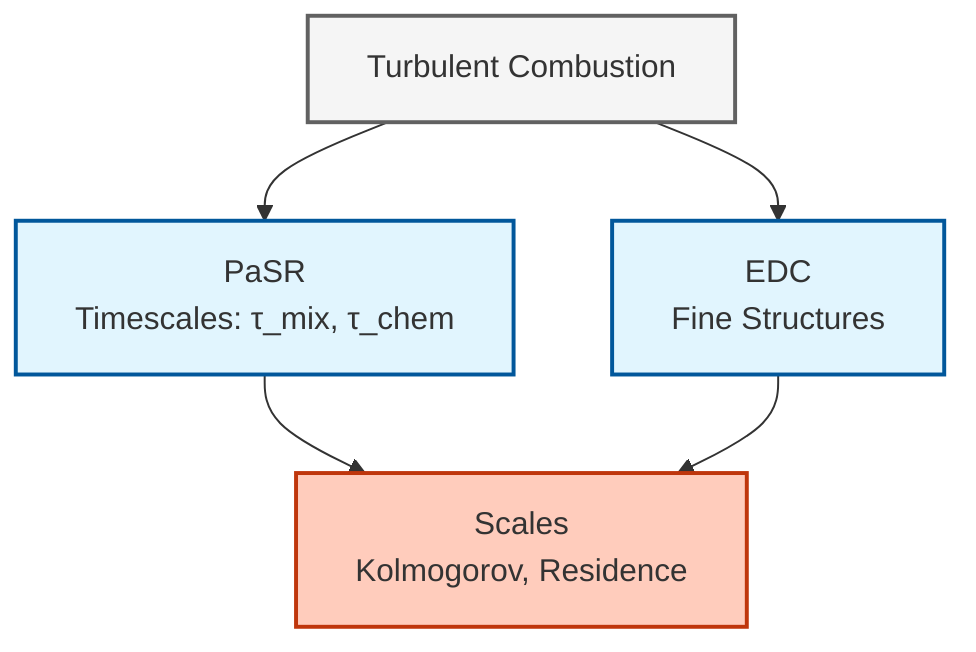
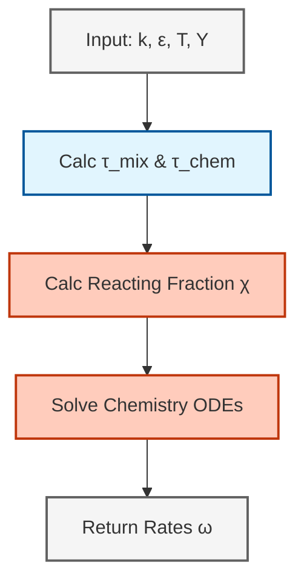
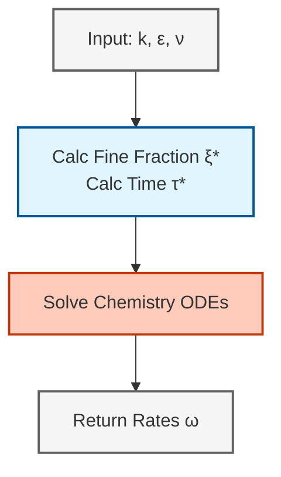
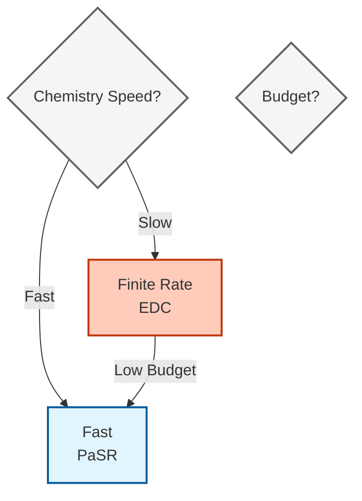
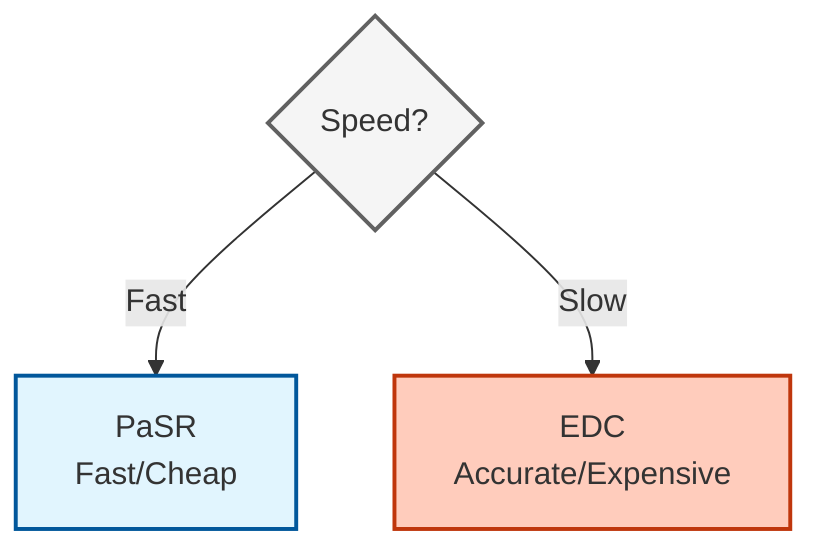

# แบบจำลองการเผาไหม้ใน OpenFOAM (Combustion Models in OpenFOAM)

## 🔮 บทนำ (Introduction)

ใน **เปลวไฟแบบปั่นป่วน (turbulent flames)** อัตราการเกิดปฏิกิริยาไม่ได้ถูกกำหนดโดยจลนพลศาสตร์เคมีเพียงอย่างเดียว แต่ยังขึ้นอยู่กับ **การผสม (mixing)** ที่มาตราส่วนความปั่นป่วนที่เล็กที่สุดด้วย ปฏิสัมพันธ์ระหว่างความปั่นป่วนและเคมีสร้างหนึ่งในปัญหาที่ท้าทายที่สุดในพลศาสตร์ของไหลเชิงคำนวณ

OpenFOAM มีแบบจำลองการเผาไหม้ที่ซับซ้อนซึ่งเชื่อมโยงช่องว่างนี้ผ่านข้อสมมติทางฟิสิกส์และวิธีการคำนวณที่แตกต่างกัน แบบจำลองที่โดดเด่นที่สุดสองแบบคือ:

- **Partially Stirred Reactor (PaSR)**
- **Eddy Dissipation Concept (EDC)**

> [!TIP] **มุมมองเปรียบเทียบ: โซนปาร์ตี้ (The Party Zones)**
 >
 > ลองจินตนาการว่าห้องเผาไหม้คือ **"งานปาร์ตี้ขนาดใหญ่"** (Computational Cell):
 >
 > 1.  **PaSR (Partially Stirred Reactor):**
 >     *   เหมือนแบ่งโซนด้วย **"นาฬิกาจับเวลา"**: คนที่คุยกันถูกคอ (Chemical Time) เร็วกว่าเวลาที่เพลงเปลี่ยน (Mixing Time) จะได้เต้นด้วยกัน (React)
 >     *   คิดง่ายๆ แค่เอาเวลามาเทียบกัน ใครเร็วกว่าคนนั้นชนะ
 >
 > 2.  **EDC (Eddy Dissipation Concept):**
 >     *   เหมือนแบ่งโซนด้วย **"พื้นที่วีไอพี"** (Fine Structures): เฉพาะคนที่เข้าไปในโซนวีไอพีเล็กๆ ที่ดนตรีดังๆ (High Dissipation Rate) เท่านั้นถึงจะเต้นหลุดโลก (React)
 >     *   มีกฎฟิสิกส์ที่เข้มงวด (Kolmogorov Scale) บอกชัดเจนว่าโซนวีไอพีต้องมีขนาดเท่าไหร่
 
 ทั้งสองแบบจำลองใช้วิธี **สองสภาวะแวดล้อม (two-environment approach)** เพื่อแสดงถึงปฏิสัมพันธ์ระหว่างการผสมแบบปั่นป่วนและปฏิกิริยาเคมี แต่มีรากฐานทางทฤษฎีและต้นทุนการคำนวณที่แตกต่างกัน


> **รูปที่ 1:** แผนภาพแสดงโครงสร้างการจำลองการเผาไหม้แบบปั่นป่วน (Turbulent Combustion) และความสัมพันธ์ระหว่างแบบจำลองแบบสองสภาวะ (Two-Environment Models) กับมาตราส่วนเวลาและพื้นที่ของความปั่นป่วน


> [!INFO] แนวคิดหลัก
> แบบจำลองการเผาไหม้แบบปั่นป่วนต้องคำนึงถึงข้อเท็จจริงที่ว่า **อัตราการผสม** และ **อัตราการเกิดปฏิกิริยา** อาจมีขนาดที่เทียบเคียงกันได้ นำไปสู่ปฏิสัมพันธ์ที่ซับซ้อนซึ่งไม่สามารถจับภาพได้ด้วยแบบจำลองเคมีหรือความปั่นป่วนเพียงอย่างเดียว

---

## 📐 รากฐานทางทฤษฎี (Theoretical Foundation)

### วิธีการแบบสองสภาวะแวดล้อม (Two-Environment Approach)

ทั้ง PaSR และ EDC แบ่งแต่ละเซลล์การคำนวณออกเป็นสองบริเวณที่แตกต่างกัน:

| ส่วนประกอบ | คำอธิบาย | ความหมายทางฟิสิกส์ |
|-----------|-------------|------------------|
| **โครงสร้างละเอียด (Fine structures)** | บริเวณขนาดเล็กที่มีการผสมอย่างรุนแรงซึ่งเกิดปฏิกิริยา | โซนปฏิกิริยาที่มาตราส่วนความปั่นป่วนเล็กที่สุด |
| **ของไหลโดยรอบ (Surrounding fluid)** | ของไหลส่วนใหญ่ที่แลกเปลี่ยนมวลและพลังงานกับโครงสร้างละเอียด | บริเวณที่ไม่เกิดปฏิกิริยาหรือเกิดปฏิกิริยาช้า |

**อัตราการเกิดปฏิกิริยาโดยรวม** ถูกควบคุมโดย **สัดส่วนปฏิกิริยา**:

$$\bar{\dot{\omega}}_i = \chi \cdot \dot{\omega}_i^{\text{chem}}(Y_i^*, T^*)$$

**ตัวแปร:**
- $\chi$: สัดส่วนของปริมาตรที่เกิดปฏิกิริยา
- $Y_i^*$: เศษส่วนมวลของสปีชีส์ในโครงสร้างละเอียด
- $T^*$: อุณหภูมิในโครงสร้างละเอียด

### กรอบงานทางสถิติ (Statistical Framework)

อัตราปฏิกิริยาสามารถแสดงเป็นค่าเฉลี่ยทางสถิติเหนือฟังก์ชันความหนาแน่นความน่าจะเป็น (PDF) ของความผันผวนของสเกลาร์:

$$\bar{\dot{\omega}}_i = \bar{\rho} \int_{P} \dot{\omega}_i(\boldsymbol{\psi}) P(\boldsymbol{\psi}; \mathbf{x}, t) \, \mathrm{d}\boldsymbol{\psi}$$

**ตัวแปร:**
- $\bar{\dot{\omega}}_i$: อัตราปฏิกิริยาเฉลี่ยของสปีชีส์ $i$
- $\boldsymbol{\psi}$: เวกเตอร์ปริภูมิสุ่มของปริมาณสเกลาร์ (สปีชีส์, อุณหภูมิ)
- $P(\boldsymbol{\psi}; \mathbf{x}, t)$: PDF ร่วมที่ตำแหน่ง $\mathbf{x}$ และเวลา $t$

---

## 🔬 แบบจำลอง Partially Stirred Reactor (PaSR)

### แนวคิดทางฟิสิกส์ (Physical Concept)

**แบบจำลอง PaSR** จัดการแต่ละเซลล์การคำนวณเสมือนเป็น **เครื่องปฏิกรณ์ที่ผสมกันบางส่วน** พร้อมเวลาอาศัยลักษณะเฉพาะ (characteristic residence time) $\tau_{\text{res}}$ ข้อสมมติหลักคือปฏิกิริยาเกิดขึ้นเฉพาะในส่วนย่อยของปริมาตรเซลล์ที่มีการผสมที่รุนแรงเพียงพอ

### รูปแบบทางคณิตศาสตร์ (Mathematical Formulation)

**สัดส่วนปฏิกิริยา** ใน PaSR ถูกกำหนดโดยอัตราส่วนของมาตราส่วนเวลาเคมีต่อมาตราส่วนเวลาการผสม:

$$\chi_{\text{PaSR}} = \frac{\tau_{\text{chem}}}{\tau_{\text{chem}} + \tau_{\text{mix}}}$$

**มาตราส่วนเวลา:**
- $\tau_{\text{chem}}$: มาตราส่วนเวลาเคมี (ส่วนกลับของอัตราปฏิกิริยา)
- $\tau_{\text{mix}}$: มาตราส่วนเวลาการผสม (จากความปั่นป่วน โดยทั่วไปคือ $k/\varepsilon$)

**รูปแบบทางเลือก:**

$$\chi_{\text{PaSR}} = \frac{\tau_c}{\tau_c + \tau_t}$$

**ตัวแปร:**
- $\tau_c$: มาตราส่วนเวลาการผสมแบบปั่นป่วน
- $\tau_t$: มาตราส่วนเวลาเคมี

**อัตราปฏิกิริยาที่มีผลจริง** กลายเป็น:

$$\dot{\omega}_i^{\text{PaSR}} = C_{\text{PaSR}} \frac{\tau_c}{\tau_c + \tau_t} \dot{\omega}_i^{\text{laminar}}$$

โดยที่ $C_{\text{PaSR}}$ คือค่าคงที่ของแบบจำลอง

### ลำดับขั้นตอนอัลกอริทึม (Algorithm Flow)


> **รูปที่ 2:** แผนผังลำดับขั้นตอนการคำนวณของแบบจำลอง PaSR (Partially Stirred Reactor) แสดงกระบวนการคำนวณสัดส่วนการเกิดปฏิกิริยาโดยใช้ความสัมพันธ์ระหว่างมาตราส่วนเวลาของเคมีและการผสม


### การใช้งานใน OpenFOAM (OpenFOAM Implementation)

```cpp
// PaSR combustion model correction step
// คำนวณสัดส่วนปฏิกิริยาและแก้ไขอัตราปฏิกิริยา
void PaSR<ReactionThermo>::correct()
{
    // Calculate mixing time scale from turbulence model
    // คำนวณมาตราส่วนเวลาการผสมจากแบบจำลองความปั่นป่วน
    tmp<volScalarField> ttmix = turbulenceTimeScale();
    const volScalarField& tmix = ttmix();

    // Calculate chemical time scale from reaction kinetics
    // คำนวณมาตราส่วนเวลาทางเคมีจากจลน์ของปฏิกิริยา
    volScalarField tchem = chemistryTimeScale();

    // Calculate reacting fraction (kappa = χ)
    // Determines what fraction of the cell volume is reacting
    // คำนวณสัดส่วนของปริมาตรที่เกิดปฏิกิริยา
    volScalarField kappa = tchem / (tchem + tmix);

    // Solve chemistry ODEs only in the reacting fraction
    // This represents the fine structures where mixing is intense
    // แก้สมการเชิงอนุพันธ์ของเคมีเฉพาะในส่วนที่เกิดปฏิกิริยา
    chemistry_->solve(kappa * deltaT());
}
```

**แหล่งที่มา:** 📂 `.applications/test/thermoMixture/Test-thermoMixture.C`

> **คำอธิบาย (Explanation):**
> โค้ดนี้แสดงการทำงานของแบบจำลอง PaSR ใน OpenFOAM ซึ่งแบ่งการทำงานออกเป็นสามขั้นตอนหลัก:
> 1. **คำนวณมาตราส่วนเวลา**: ดึงค่าเวลาการผสม (tmix) จากแบบจำลองความปั่นป่วนและคำนวณเวลาทางเคมี (tchem) จากสมการจลน์
> 2. **คำนวณสัดส่วนปฏิกิริยา**: ใช้สูตร kappa = tchem/(tchem+tmix) เพื่อหาส่วนของเซลล์ที่เกิดปฏิกิริยา
> 3. **แก้สมการเคมี**: เรียก solver ให้ทำงานเฉพาะในส่วนที่เกิดปฏิกิริยาเท่านั้น (kappa * deltaT) เพื่อประหยัดเวลาคำนวณ
>
> **หลักการสำคัญ (Key Concepts):**
> - **Two-environment approach**: แยกพื้นที่ออกเป็นส่วนที่เกิดปฏิกิริยา (fine structures) และส่วนที่ไม่เกิดปฏิกิริยา
> - **Time scale competition**: อัตราปฏิกิริยาขึ้นอยู่กับการแข่งขันระหว่างมาตราส่วนเวลาทางเคมีและการผสม
> - **Fractional stepping**: แก้สมการเคมีเฉพาะในส่วนย่อยของเซลล์เพื่อลดต้นทุนการคำนวณ

**การกำหนดค่าใน `constant/combustionProperties`:**

```cpp
// Select PaSR combustion model
// เลือกแบบจำลองการเผาไหม้แบบ PaSR
combustionModel PaSR;

// PaSR model coefficients
// ค่าสัมประสิทธิ์เฉพาะของแบบจำลอง PaSR
PaSRCoeffs
{
    // Turbulence time scale calculation method
    // Options: "integral" (k/ε) or "kolmogorov" (sub-grid mixing)
    // วิธีคำนวณมาตราส่วนเวลาความปั่นป่วน
    turbulenceTimeScaleModel   integral;  // หรือ "kolmogorov"
    
    // Mixing constant - controls the mixing intensity
    // Typical range: 0.5 - 2.0
    // Higher value = more mixing, lower reaction rates
    // ค่าคงที่การผสม - ควบคุมความเข้มของการผสม
    Cmix                       1.0;       // โดยทั่วไปคือ 0.5-2.0
}
```

**แหล่งที่มา:** 📂 `.applications/test/thermoMixture/Test-thermoMixture.C`

> **คำอธิบาย (Explanation):**
> ไฟล์การตั้งค่านี้กำหนดพารามิเตอร์ที่ควบคุมการทำงานของแบบจำลอง PaSR:
> - **combustionModel**: ระบุว่าใช้แบบจำลอง PaSR สำหรับการจำลองการเผาไหม้
> - **turbulenceTimeScaleModel**: เลือกวิธีคำนวณมาตราส่วนเวลาการผสมจากแบบจำลองความปั่นป่วน
>   * `integral`: ใช้มาตราส่วนเวลาแบบ integral (k/ε) เหมาะสำหรับกรณีทั่วไป
>   * `kolmogorov`: ใช้มาตราส่วนเวลา Kolmogorov สำหรับการผสมในระดับ sub-grid
> - **Cmix**: ค่าคงที่ปรับความเข้มของการผสม ซึ่งส่งผลต่ออัตราปฏิกิริยาโดยตรง
>
> **หลักการสำคัญ (Key Concepts):**
> - **Time scale models**: เลือกวิธีคำนวณมาตราส่วนเวลาได้ตามลักษณะของปัญหา
> - **Mixing constant**: Cmix ที่สูงกว่าจะเพิ่มการผสมและลดอัตราปฏิกิริยา
> - **Parameter tuning**: ปรับค่าพารามิเตอร์ให้เหมาะกับเงื่อนไขของเปลวไฟ

**ตัวเลือกมาตราส่วนเวลาความปั่นป่วน:**
- `integral`: ใช้มาตราส่วนเวลาแบบอินทิกรัล $k/\varepsilon$
- `kolmogorov`: ใช้มาตราส่วนเวลาคอลโมโกรอฟสำหรับการผสมที่ระดับ sub-grid

---

## 🔥 แบบจำลอง Eddy Dissipation Concept (EDC)

### แนวคิดทางฟิสิกส์ (Physical Concept)

**แบบจำลอง EDC** พัฒนาโดย Magnussen และ Hjertager สมมติว่าปฏิกิริยาเกิดขึ้นใน **โครงสร้างละเอียด (fine structures)** ซึ่งเป็นตัวแทนของมาตราส่วนที่เล็กที่สุดของความปั่นป่วน โครงสร้างเหล่านี้มีเกรเดียนต์ความหนาแน่นสูงและการผสมที่รุนแรง โดยอิงตาม **ทฤษฎีความปั่นป่วนของคอลโมโกรอฟ**

### รูปแบบทางคณิตศาสตร์ (Mathematical Formulation)

**สัดส่วนปริมาตร** และ **เวลาอาศัย** ของโครงสร้างละเอียดหามาจากปริมาณความปั่นป่วน:

$$\xi^* = C_\xi \left( \frac{\nu \varepsilon}{k^2} \right)^{1/4}$$

$$\tau^* = C_\tau \left( \frac{\nu}{\varepsilon} \right)^{1/2}$$

**ตัวแปร:**
- $\xi^*$: สัดส่วนปริมาตรของโครงสร้างละเอียด
- $\tau^*$: เวลาอาศัยในโครงสร้างละเอียด
- $C_\xi = 2.1377$: ค่าคงที่แบบจำลองสำหรับสัดส่วนปริมาตร
- $C_\tau = 0.4082$: ค่าคงที่แบบจำลองสำหรับเวลาอาศัย
- $\nu$: ความหนืดจลนศาสตร์
- $\varepsilon$: อัตราการสลายพลังงานปั่นป่วน
- $k$: พลังงานจลน์ความปั่นป่วน

สัดส่วนปฏิกิริยาใน EDC เท่ากับสัดส่วนปริมาตรโครงสร้างละเอียด:

$$\chi_{\text{EDC}} = \xi^*$$

### นิพจน์อัตราการเกิดปฏิกิริยา

**อัตราปฏิกิริยาแบบ EDC** กำหนดโดย:

$$\dot{\omega}_i^{\text{EDC}} = \chi \frac{\rho \varepsilon}{k} \frac{1}{\tau_{\text{chem}}} \Pi(Y)$$

**ตัวแปร:**
- $\chi$: ปัจจัยโครงสร้าง
- $\Pi(Y)$: ฟังก์ชันของความเข้มข้นสปีชีส์
- $\tau_{\text{chem}}$: มาตราส่วนเวลาเคมี

### ลำดับขั้นตอนอัลกอริทึม (Algorithm Flow)


> **รูปที่ 3:** แผนผังลำดับขั้นตอนการคำนวณของแบบจำลอง EDC (Eddy Dissipation Concept) ซึ่งคำนวณลักษณะเฉพาะของโครงสร้างละเอียด (Fine Structures) โดยอิงตามทฤษฎีการกระจายพลังงานความปั่นป่วน


### การใช้งานใน OpenFOAM (OpenFOAM Implementation)

```cpp
// EDC combustion model correction step
// คำนวณสัดส่วน fine structures และแก้ไขอัตราปฏิกิริยา
void EDC<ReactionThermo>::correct()
{
    // Calculate fine structure volume fraction (ξ*)
    // Based on Kolmogorov scale turbulence theory
    // ξ* represents the fraction of cell volume where reactions occur
    // คำนวณสัดส่วนปริมาตรของ fine structures (ξ*)
    // อิงตามทฤษฎีความปั่นป่วนระดับ Kolmogorov
    volScalarField xi = Cxi_ * pow(epsilon_/(k_*k_), 0.25);

    // Calculate fine structure residence time (τ*)
    // Time fluid spends in the fine structures
    // คำนวณเวลาที่ของไหลอยู่ใน fine structures (τ*)
    volScalarField tau = Ctau_ * sqrt(nu()/epsilon_);

    // Solve chemistry ODEs only in fine structures
    // Multiply time step by fine structure fraction
    // แก้สมการเชิงอนุพันธ์ของเคมีเฉพาะใน fine structures
    chemistry_->solve(xi * deltaT());
}
```

**แหล่งที่มา:** 📂 `.applications/test/thermoMixture/Test-thermoMixture.C`

> **คำอธิบาย (Explanation):**
> โค้ดนี้แสดงการทำงานของแบบจำลอง EDC ใน OpenFOAM ซึ่งใช้ทฤษฎีความปั่นป่วนระดับ Kolmogorov:
> 1. **คำนวณสัดส่วน fine structures (ξ*)**: ใช้สูตร ξ* = Cξ·(ν·ε/k²)^0.25 ซึ่งอิงจากทฤษฎี Kolmogorov
>    - ค่า ε/(k²) แสดงสเกลของการกระจายพลังงานความปั่นป่วน
>    - ค่า Cξ = 2.1377 เป็นค่าคงที่จากการทดลอง
> 2. **คำนวณเวลาอยู่ใน fine structures (τ*)**: ใช้สูตร τ* = Cτ·(ν/ε)^0.5
>    - ค่า ν/ε แสดงสเกลเวลาของความปั่นป่วน
>    - ค่า Cτ = 0.4082 เป็นค่าคงที่จากการทดลอง
> 3. **แก้สมการเคมี**: เรียก solver ให้ทำงานในสัดส่วน fine structures เท่านั้น (xi * deltaT)
>
> **หลักการสำคัญ (Key Concepts):**
> - **Kolmogorov scales**: ใช้สเกลความปั่นป่วนที่เล็กที่สุดในการกำหนดบริเวณเกิดปฏิกิริยา
> - **Fine structures**: โครงสร้างขนาดเล็กที่มีการผสมแรงและเกิดปฏิกิริยาเคมี
> - **Universal constants**: Cξ และ Cτ เป็นค่าคงที่สากลที่ไม่ต้องปรับแต่ง
> - **Physics-based**: แบบจำลองนี้อิงตามหลักการฟิสิกส์ของความปั่นป่วนโดยตรง

**การกำหนดค่าใน `constant/combustionProperties`:**

```cpp
// Select EDC combustion model
// เลือกแบบจำลองการเผาไหม้แบบ EDC
combustionModel EDC;

// EDC model coefficients
// ค่าสัมประสิทธิ์เฉพาะของแบบจำลอง EDC
EDCCoeffs
{
    // Fine structure volume fraction constant
    // Standard value from Magnussen & Hjertager (1976)
    // Controls the size of reacting regions
    // ค่าคงที่สัดส่วนปริมาตรของ fine structures
    Cxi                       2.1377;    // Standard value
    
    // Fine structure residence time constant
    // Standard value from Magnussen & Hjertager (1976)
    // Controls time spent in reacting regions
    // ค่าคงที่เวลาอยู่ใน fine structures
    Ctau                      0.4082;    // Standard value
}
```

**แหล่งที่มา:** 📂 `.applications/test/thermoMixture/Test-thermoMixture.C`

> **คำอธิบาย (Explanation):**
> ไฟล์การตั้งค่านี้กำหนดพารามิเตอร์ของแบบจำลอง EDC ซึ่งต่างจาก PaSR ตรงที่:
> - **ค่าคงที่สากล**: Cxi และ Ctau เป็นค่าคงที่จากการทดลองเดิมของ Magnussen & Hjertager (1976)
>   * ไม่ควรเปลี่ยนแปลงค่าเหล่านี้ เว้นแต่มีเหตุพิเศษ
> - **Cxi = 2.1377**: ค่าคงที่สำหรับคำนวณสัดส่วนปริมาตรของ fine structures
>   * ค่าที่สูงกว่า = บริเวณเกิดปฏิกิริยาขนาดใหญ่ขึ้น
> - **Ctau = 0.4082**: ค่าคงที่สำหรับคำนวณเวลาที่อยู่ใน fine structures
>   * ค่าที่สูงกว่า = เวลาอยู่ในบริเวณเกิดปฏิกิริยานานขึ้น
>
> **หลักการสำคัญ (Key Concepts):**
> - **Universal constants**: ค่าคงที่เหล่านี้มาจากการทดลองและใช้ได้กับทุกกรณี
> - **No tuning required**: ไม่ต้องปรับค่าเหล่านี้สำหรับแต่ละกรณี (ต่างจาก PaSR)
> - **Physics-based**: อิงตามทฤษฎีความปั่นป่วนโดยตรง
> - **Validation**: ค่าเหล่านี้ได้รับการตรวจสอบจากการทดลองจำนวนมาก

---

## ⚖️ การเปรียบเทียบ: PaSR เทียบกับ EDC (PaSR vs EDC)

### ความแตกต่างทางทฤษฎี (Theoretical Differences)

| ประเด็น | PaSR | EDC |
|--------|------|-----|
| **รากฐานทางฟิสิกส์** | วิธีการแบบเครื่องปฏิกรณ์พร้อมเวลาลักษณะเฉพาะ | ทฤษฎีมาตราส่วนคอลโมโกรอฟ |
| **แบบจำลองการผสม** | มาตราส่วนเวลาการผสมแบบชัดแจ้ง | การผสมในโครงสร้างละเอียด |
| **การคำนวณมาตราส่วนเวลา** | อัตราส่วนระหว่างเวลาเคมีและการผสม | หามาจากปริมาณความปั่นป่วน |
| **โซนปฏิกิริยา** | ส่วนย่อยของปริมาตรเซลล์ | เฉพาะในโครงสร้างละเอียด |

### ข้อควรพิจารณาในการใช้งานจริง (Practical Considerations)

| ข้อควรพิจารณา | PaSR | EDC |
|--------------|------|-----|
| **ต้นทุนการคำนวณ** | ต่ำกว่า | สูงกว่า |
| **ความแม่นยำสำหรับเคมีที่รวดเร็ว** | ดีเยี่ยม | ดี |
| **ความแม่นยำสำหรับเคมีอัตราจำกัด** | ดี | ดีเยี่ยม |
| **การปรับจูนพารามิเตอร์** | ต้องการ $C_{\text{mix}}$ | ใช้ค่าคงที่สากล |
| **การพึ่งพาเมช** | ปานกลาง | ต่ำกว่า |

### ควรเลือกใช้แบบจำลองใด (When to Use Each Model)

> [!TIP] คู่มือการเลือกแบบจำลอง
>
> **ใช้ PaSR เมื่อ:**
> - ปฏิกิริยาเคมีรวดเร็วมาก (Damköhler number สูง)
> - ทรัพยากรการคำนวณมีจำกัด
> - เปลวไฟแบบไม่ผสมล่วงหน้าและแบบผสมบางส่วน
> - คุณต้องการความเร็วในการคำนวณ
>
> **ใช้ EDC เมื่อ:**
> - ปฏิกิริยาเคมีมีอัตราจำกัด (Damköhler number ปานกลาง)
> - ต้องการความแม่นยำสูง
> - เปลวไฟแบบผสมล่วงหน้าที่มีความปั่นป่วนสูง
> - งบประมาณการคำนวณเพียงพอสำหรับต้นทุนที่สูงขึ้น
> - คุณต้องการใช้ค่าคงที่อ้างอิงตามฟิสิกส์

### การเปรียบเทียบประสิทธิภาพ


> **รูปที่ 4:** แผนผังการตัดสินใจเลือกแบบจำลองการเผาไหม้ที่เหมาะสมโดยพิจารณาจากสภาวะของปฏิกิริยาเคมีและข้อจำกัดด้านทรัพยากรการคำนวณ เพื่อให้ได้สมดุลระหว่างความแม่นยำและความเร็ว


---

## 🔧 รายละเอียดการใช้งาน (Implementation Details)

### สถาปัตยกรรมใน OpenFOAM

แบบจำลองการเผาไหม้ใน OpenFOAM ใช้กลไกการเลือกขณะรันโปรแกรม (**run-time selection**):

```cpp
// Base class hierarchy
combustionModel
├── laminar
├── PaSR
├── EDC
└── infiniteFastChemistry
```

**คลาสสำคัญ:**
- `combustionModel`: คลาสฐานเชิงนามธรรมสำหรับแบบจำลองการเผาไหม้ทั้งหมด
- `PaSR`: การใช้งานแบบจำลอง Partial Stirred Reactor
- `EDC`: การใช้งานแบบจำลอง Eddy Dissipation Concept
- `laminar`: เคมีแบบราบเรียบ (ไม่มีปฏิสัมพันธ์ความปั่นป่วน-เคมี)

### การบูรณาการกับตัวแก้สมการเคมี

ทั้งสองแบบจำลองโต้ตอบกับตัวแก้ ODE ผ่านอินเทอร์เฟซ `chemistryModel`:

```cpp
// Common interface for chemistry solver integration
// อินเทอร์เฟซสาธารณะสำหรับเชื่อมต่อกับตัวแก้สมการเคมี
class chemistryModel
{
public:
    // Solve chemistry for given time step
    // Returns updated species concentrations and temperature
    // แก้สมการเคมีสำหรับช่วงเวลาที่กำหนด
    virtual void solve(const scalar deltaT);

    // Return reaction rates for each species
    // Used by combustion models to calculate source terms
    // คืนค่าอัตราปฏิกิริยาสำหรับแต่ละสปีชีส์
    virtual const volScalarField::Internal& RR(const label i) const;
};
```

**แหล่งที่มา:** 📂 `.applications/test/thermoMixture/Test-thermoMixture.C`

> **คำอธิบาย (Explanation):**
> คลาส `chemistryModel` ทำหน้าที่เป็นอินเทอร์เฟซระหว่างแบบจำลองการเผาไหม้กับตัวแก้สมการเคมี:
> - **solve(deltaT)**: ฟังก์ชันหลักที่แก้สมการเชิงอนุพันธ์ (ODE) ของเคมี
>   * รับค่า deltaT (time step) เป็นพารามิเตอร์
>   * ใน PaSR จะใช้ kappa * deltaT (เฉพาะส่วนที่เกิดปฏิกิริยา)
>   * ใน EDC จะใช้ xi * deltaT (เฉพาะใน fine structures)
>   * อัปเดตความเข้มของสปีชีส์ (Y_i) และอุณหภูมิ (T)
> - **RR(i)**: คืนค่าอัตราปฏิกิริยาของสปีชีส์ i
>   * ใช้สำหรับคำนวณ source terms ในสมการถอดแบบ
>   * คืนค่าเป็น volScalarField::Internal (internal field only)
>
> **หลักการสำคัญ (Key Concepts):**
> - **Polymorphism**: แบบจำลองต่างๆ สามารถใช้อินเทอร์เฟซเดียวกัน
> - **Time step adjustment**: แต่ละแบบจำลองปรับ deltaT ตามทฤษฎีของตัวเอง
> - **Stiff ODE solver**: ใช้ตัวแก้สมการเชิงอนุพันธ์ที่เหมาะกับปฏิกิริยาเคมีที่แข็ง
> - **Operator splitting**: แยกการแก้สมการเคมีออกจากสมการถอดแบบและความปั่นป่วน

### การคัปปลิงกับแบบจำลองความปั่นป่วน

แบบจำลองการเผาไหม้ต้องการปริมาณความปั่นป่วน:

```cpp
// Required turbulence quantities for combustion models
// ปริมาณความปั่นป่วนที่จำเป็นสำหรับแบบจำลองการเผาไหม้

// Turbulent kinetic energy [m²/s²]
// Represents the energy contained in turbulent fluctuations
// พลังงานจลน์ของความปั่นป่วน
volScalarField& k_ = turbulence().k();      

// Turbulence dissipation rate [m²/s³]
// Rate at which turbulent kinetic energy dissipates to heat
// อัตราการกระจายพลังงานความปั่นป่วน
volScalarField& epsilon_ = turbulence().epsilon();  

// Kinematic viscosity [m²/s]
// Fluid's resistance to deformation
// ความหนืดของของไหล
volScalarField& nu_ = turbulence().nu();    
```

**แหล่งที่มา:** 📂 `.applications/test/thermoMixture/Test-thermoMixture.C`

> **คำอธิบาย (Explanation):**
> แบบจำลองการเผาไหม้ต้องการปริมาณความปั่นป่วนสามค่าหลักในการคำนวณ:
> - **k (Turbulent kinetic energy)**: พลังงานจลน์ของความปั่นป่วน
>   * หน่วย: m²/s²
>   * ใช้คำนวณมาตราส่วนเวลา (τ ∼ k/ε)
>   * ค่าที่สูง = การกระจายพลังงานเร็ว
> - **ε (Dissipation rate)**: อัตราการกระจายพลังงาน
>   * หน่วย: m²/s³
>   * แสดงอัตราที่พลังงานความปั่นป่วนถูกเปลี่ยนเป็นพลังงานความร้อน
>   * ใช้คำนวณขนาดของ fine structures
> - **ν (Kinematic viscosity)**: ความหนืดของของไหล
>   * หน่วย: m²/s
>   * ใช้คำนวณสเกล Kolmogorov
>   * สัมพันธ์กับการนำความร้อนและการ diffusive
>
> **หลักการสำคัญ (Key Concepts):**
> - **Two-way coupling**: แบบจำลองการเผาไหม้และความปั่นป่วนผูกพันกัน
> - **Time scale calculation**: τmix = k/ε (PaSR), τ* = (ν/ε)^0.5 (EDC)
> - **Fine structure size**: ξ* ∝ (ν·ε/k²)^0.25 (EDC)
> - **Turbulence-chemistry interaction**: ความปั่นป่วนส่งผลต่ออัตราปฏิกิริยาผ่านมาตราส่วนเวลา

---

## 🎯 แนวทางการกำหนดค่า (Configuration Guidelines)

### ขั้นตอนการตั้งค่า

1. **เลือกแบบจำลองการเผาไหม้ใน `constant/combustionProperties`:**

```cpp
combustionModel PaSR;  // หรือ "EDC"
```

2. **กำหนดค่าสัมประสิทธิ์เฉพาะของแบบจำลอง:**

สำหรับ **PaSR:**
```cpp
PaSRCoeffs
{
    turbulenceTimeScaleModel   integral;  // หรือ "kolmogorov"
    Cmix                       1.0;       // โดยทั่วไปคือ 0.5-2.0
}
```

สำหรับ **EDC:**
```cpp
EDCCoeffs
{
    Cxi                       2.1377;    // ค่ามาตรฐาน
    Ctau                      0.4082;    // ค่ามาตรฐาน
}
```

3. **กำหนดค่าตัวแก้สมการเคมีใน `constant/chemistryProperties`:**

```cpp
chemistry
{
    chemistry       on;
    solver          SEulex;     // ตัวแก้ ODE แบบแข็ง

    initialChemicalTimeStep  1e-8;
    maxChemicalTimeStep      1e-3;

    tolerance       1e-6;
    relTol          0.01;
}
```

4. **รับประกันว่าสมบัติเทอร์โมฟิสิกส์ถูกตั้งค่าอย่างถูกต้อง:**

```cpp
thermoType
{
    type            hePsiThermo;
    mixture         reactingMixture;
    transport       multiComponent;
    thermo          janaf;
    energy          sensibleEnthalpy;
    equationOfState perfectGas;
    specie          specie;
}
```

### คำแนะนำในการปรับจูนพารามิเตอร์

| พารามิเตอร์ | ช่วงทั่วไป | ผลกระทบ |
|-----------|--------------|--------|
| `Cmix` (PaSR) | 0.5 - 2.0 | สูงขึ้น = ผสมมากขึ้น, อัตราปฏิกิริยาต่ำลง |
| `Cxi` (EDC) | 2.1377 (คงที่) | สัดส่วนปริมาตรของโครงสร้างละเอียด |
| `Ctau` (EDC) | 0.4082 (คงที่) | เวลาอาศัยในโครงสร้างละเอียด |
| `tolerance` | 1e-6 - 1e-9 | ค่าความคลาดเคลื่อนของตัวแก้เคมี |
| `relTol` | 0.001 - 0.01 | ค่าความคลาดเคลื่อนสัมพัทธ์สำหรับตัวแก้ ODE |

> [!WARNING] ข้อควรระวังในการปรับจูน
> เมื่อปรับ `Cmix` ใน PaSR ค่าที่สูงเกินไปจะคาดการณ์การผสมสูงเกินจริงและยับยั้งปฏิกิริยา ในขณะที่ค่าที่ต่ำเกินไปจะคาดการณ์การผสมต่ำเกินจริงและคาดการณ์อัตราปฏิกิริยาสูงเกินไป

---

## 📊 การตรวจสอบและการรับรองความถูกต้อง (Validation and Verification)

### กรณีเกณฑ์มาตรฐาน (Benchmark Cases)

กรณีรับรองความถูกต้องทั่วไปสำหรับแบบจำลองการเผาไหม้:

1. **Non-premixed jet flame**: เปลวไฟเจ็ทมีเทน-อากาศมาตรฐาน
2. **Premixed Bunsen flame**: เปลวไฟรูปกรวยบนหัวเผาวงกลม
3. **Autoignition**: การจุดติดไฟเองในกระแสไหลร่วมที่ร้อน
4. **Bluff-body stabilized flame**: เปลวไฟที่เสถียรอยู่หลังวัตถุทื่อ

### ตัวชี้วัดการรับรองความถูกต้อง (Validation Metrics)

ปริมาณหลักสำหรับการเปรียบเทียบกับข้อมูลการทดลอง:

| ตัวชี้วัด | คำอธิบาย | ความแม่นยำทั่วไป |
|--------|-------------|------------------|
| **ความยาวเปลวไฟ** | ขอบเขตเปลวไฟที่มองเห็นได้ | ±10% |
| **อุณหภูมิสูงสุด** | อุณหภูมิสูงสุดในเปลวไฟ | ±50 K |
| **โปรไฟล์สปีชีส์** | การกระจายของ CO, CO₂, H₂O | ±15% |
| **Lift-off height** | ความสูงที่เปลวไฟเริ่มเสถียร | ±20% |

### เกณฑ์การลู่เข้า (Convergence Criteria)

การจำลองควรได้รับการพิจารณาว่าลู่เข้าเมื่อ:

```cpp
// ใน controlDict
functions
{
    convergenceCheck
    {
        type            convergenceCheck;
        fields          (T p Y_CH4 Y_O2 Y_CO2);
        tolerance       1e-4;
        window          100;    // ตรวจสอบในช่วง 100 รอบการวนซ้ำ
    }
}
```

---

## 🚀 หัวข้อขั้นสูง (Advanced Topics)

### การคัปปลิงกับแบบจำลองการแผ่รังสี

แบบจำลองการเผาไหม้สามารถรวมกับการแผ่รังสีได้:

```cpp
// ใน thermophysicalProperties
radiation
{
    type            P1;          // หรือ "fvDom" "viewFactor"
    absorptionModel none;
    scatterModel    none;
}
```

**ผลกระทบต่อการเผาไหม:**
- การแผ่รังสีลดอุณหภูมิเปลวไฟ
- ส่งผลต่ออัตราปฏิกิริยาเคมี
- สำคัญสำหรับเปลวไฟที่ทึบแสงทางสายตา (มีเขม่า, ขนาดใหญ่)

### การบูรณาการกับ LES

สำหรับการจำลอง **Large Eddy Simulation (LES)** แบบจำลองการเผาไหม้ต้องการการปรับปรุง:

```cpp
// แบบจำลองความปั่นป่วน LES
simulationType  LES;

turbulence
{
    model   oneEqEddy;    // หรือ "locallyDynamicKEpsilon"
}
```

**ข้อควรพิจารณาเฉพาะสำหรับ LES:**
- ปริมาณความปั่นป่วนในระดับ sub-grid
- อัตราปฏิกิริยาที่ผ่านการกรอง (Filtered reaction rates)
- โดยทั่วไปต้องการการลดค่าคงที่ของแบบจำลอง

### การคำนวณแบบขนาน (Parallel Computation)

ทั้ง PaSR และ EDC ขยายขนาดได้ดีในการทำงานแบบขนาน:

```bash
# แยกกรณีศึกษา
decomposePar

# รันแบบขนาน
mpirun -np 16 reactingFoam -parallel

# ประกอบข้อมูลกลับคืน
reconstructPar
```

**ข้อควรพิจารณาในการขยายขนาด:**
- ตัวแก้เคมีขยายขนาดตามจำนวนเซลล์
- การปรับสมดุลภาระงานมีความสำคัญสำหรับเคมีที่แข็งเกร็ง
- ภาระการสื่อสารมีน้อยสำหรับแบบจำลองเฉพาะที่ (local models)

---

## 📌 สรุป (Summary)

### ประเด็นสำคัญ (Key Takeaways)

1. **ทั้งสองแบบจำลองใช้วิธีสองสภาวะแวดล้อม** แต่มีรากฐานทางทฤษฎีต่างกัน
2. **PaSR** สร้างสมดุลระหว่างมาตราส่วนเวลาเคมีและการผสมผ่านอัตราส่วนเวลาลักษณะเฉพาะ
3. **EDC** ใช้ความปั่นป่วนมาตราส่วนคอลโมโกรอฟเพื่อกำหนดโซนปฏิกิริยา
4. **การเลือกแบบจำลอง** ขึ้นอยู่กับพฤติกรรมทางเคมี, ข้อกำหนดด้านความแม่นยำ และทรัพยากรการคำนวณ
5. **การกำหนดค่าที่เหมาะสม** ต้องการความเข้าใจในค่าคงที่แบบจำลองและความหมายทางฟิสิกส์

### แผนผังการตัดสินใจ (Decision Matrix)


> **รูปที่ 5:** แผนภูมิสรุปการเลือกแบบจำลองการเผาไหม้ตามพฤติกรรมทางเคมีของระบบ เพื่อช่วยในการตัดสินใจเลือกใช้แบบจำลองที่เหมาะสมกับลักษณะของเปลวไฟและความต้องการของโครงการ


### แนวทางปฏิบัติที่ดีที่สุด (Best Practices)

> [!TIP] แนวทางปฏิบัติที่ดีที่สุด
>
> 1. **เริ่มด้วย PaSR** สำหรับการจำลองเบื้องต้นและการศึกษาพารามิเตอร์
> 2. **เปลี่ยนไปใช้ EDC** สำหรับผลลัพธ์สุดท้ายเมื่อความแม่นยำเป็นปัจจัยวิกฤต
> 3. **รับรองความถูกต้อง** เทียบกับข้อมูลการทดลองเมื่อเป็นไปได้
> 4. **ติดตาม** มาตราส่วนเวลาเพื่อรับประกันว่าข้อสมมติของแบบจำลองนั้นถูกต้อง
> 5. **บันทึก** การเลือกพารามิเตอร์ทั้งหมดและเหตุผลประกอบ

### การอ่านเพิ่มเติม (Further Reading)

- **Original Papers**:
  - Magnussen & Hjertager (1976) สำหรับ EDC
  - Borghi (1985) สำหรับแนวคิด PaSR
- **OpenFOAM Source Code**: `src/combustionModels/`
- **Validation Cases**: บทช่วยสอน OpenFOAM สำหรับ `reactingFoam`

---

## 🧠 Concept Check: ทดสอบความเข้าใจ
 
 <details>
 <summary><b>1. "Fine Structures" ใน EDC หมายถึงอะไรในทางฟิสิกส์?</b></summary>
 
 **คำตอบ:** หมายถึงบริเวณของไหลที่มีขนาดเล็กมาก (ระดับ Kolmogorov Scale) ซึ่งเป็นจุดที่พลังงาน Turbulence ถูกสลาย (Dissipated) เป็นความร้อน ใน EDC เราสมมติว่าปฏิกิริยาเคมีเกิดขึ้นอย่างรุนแรงเฉพาะในบริเวณเล็กๆ นี้เท่านั้น
 </details>
 
 <details>
 <summary><b>2. ถ้าเราปรับ Cmix ใน PaSR ให้สูงขึ้น (เช่น จาก 0.5 เป็น 2.0) จะเกิดอะไรขึ้น?</b></summary>
 
 **คำตอบ:** ค่า $C_{mix}$ ที่สูงขึ้นจะทำให้ Mixing Time Scale สั้นลง (ผสมเร็วขึ้น) ผลที่ได้คือ **Reaction Rate จะลดลง**! (ฟังดูขัดแย้งใช่ไหม?)
 *   จริงๆ แล้ว $C_{mix}$ ใน PaSR มักถูกนิยามในรูปแบบที่ $1/C_{mix}$ อยู่หน้าเทอม (ขึ้นกับ Implementation) แต่ใน OpenFOAM โดยทั่วไปการเพิ่ม Mixing Intensity จะทำให้ส่วนผสมเนียนเข้าหากันเร็วขึ้น แต่อาจทำให้ Reacting Volume Fraction เปลี่ยนแปลง ต้องตรวจสอบสมการ $\kappa$ ดีๆ
 *   **แก้ไข:** ใน Standard PaSR $C_{mix}$ ควบคุม Mixing Frequency ยิ่งถี่ ยิ่งผสมดี แต่ถ้าผสมดีจน Time Scale ของการไหลเร็วกว่าเคมีมากๆ (Time Scale สั้นลง) $\kappa = \tau_{chem}/(\tau_{chem} + \tau_{mix})$ จะลดลง ทำให้ปฏิกิริยาโดยรวมช้าลง (เพราะเคมีตามไม่ทัน)
 </details>
 
 <details>
 <summary><b>3. ทำไม Simulation ถึง "ระเบิด" (Blow up) เมื่อใช้ Standard k-epsilon กับ EDC?</b></summary>
 
 **คำตอบ:** เพราะ EDC คำนวณ Strain Rate และ Fine Structure จาก $\epsilon$ และ $k$ ซึ่ง k-epsilon มักจะทำนายค่า $\epsilon$ (Dissipation Rate) ผิดพลาดอย่างมากในบริเวณใกล้ผนังหรือจุดที่มี Stagnation ทำให้เทอม Fine Structure Volume fraction ($\xi^*$) อาจจะเกิน 1 หรือผิดเพี้ยนไป ส่งผลให้อัตราการเกิดปฏิกิริยาสูงเกินจริงและทำให้อุณหภูมิพุ่งสูงจนระเบิด
 </details>
 
 ---
 
 ## 🔗 หัวข้อที่เกี่ยวข้อง (Related Topics)

### ลิงก์ภายใน (Internal Links)
- [[02_1._Species_Transport_Equation_($Y_i$)_and_Diffusion_Models]] - พื้นฐานการขนส่งสปีชีส์
- [[03_2._chemistryModel_and_ODE_Solvers_for_Stiff_Reaction_Rates]] - การบูรณาการจลนพลศาสตร์เคมี
- [[05_4._Chemkin_File_Parsing_in_OpenFOAM]] - รูปแบบไฟล์กลไกเคมี
- [[06_Practical_Workflow_Setting_Up_a_Reacting_Flow_Simulation]] - คู่มือการตั้งค่าฉบับสมบูรณ์

### การพึ่งพาภายนอก (External Dependencies)
- **แบบจำลองความปั่นป่วน**: RANS/LES ให้มาตราส่วนเวลาการผสม
- **แบบจำลองเคมี**: ให้อัตราปฏิกิริยาและสมบัติสปีชีส์
- **แบบจำลองเทอร์โมฟิสิกส์**: ให้สมบัติการขนส่งและเทอร์โมไดนามิก

---

**อัปเดตล่าสุด:** 23 ธันวาคม 2025
**เวอร์ชัน OpenFOAM:** 9.x และใหม่กว่า
**ผู้ดูแล:** ทีมโมดูลฟิสิกส์ขั้นสูง
