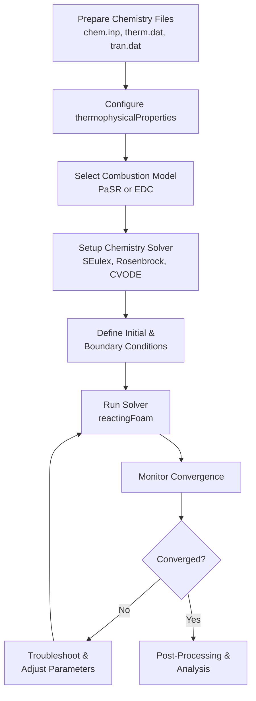

# Practical Workflow: Setting Up a Reacting Flow Simulation

## Overview

This guide provides a comprehensive workflow for setting up and running reacting flow simulations in OpenFOAM. It covers the complete process from chemistry file preparation to solver execution and troubleshooting.

---

## Step 1: Prepare Chemistry Files

The foundation of any reacting flow simulation is the **chemical reaction mechanism**. OpenFOAM requires chemistry data in Chemkin format to describe reaction mechanisms and thermodynamic properties of species involved.

### Required Files

| File | Description |
|------|-------------|
| **`chem.inp`** | Contains chemical reactions, Arrhenius parameters, and third-body efficiencies |
| **`therm.dat`** | Provides temperature-dependent thermodynamic data (Cp, H, S) for each species |
| **`tran.dat`** | Additional transport property file for molecular viscosity and thermal conductivity |

### Example: GRI-Mech 3.0 for Methane Combustion

For methane combustion, the widely-used GRI-Mech 3.0 mechanism provides detailed chemistry with **53 species** and **325 reactions**.

Place these files in your case directory:

```
case_directory/
├── chem.inp          # Reaction mechanism
├── therm.dat         # Thermodynamic data
└── tran.dat          # Transport data (optional)
```

The `chemistryReader` parses these files during solver initialization to generate reaction rate coefficients and species properties required for the simulation.

### Recommended Chemistry Sources

- **GRI-Mech**: Natural gas (methane) combustion mechanisms
- **LLNL mechanisms**: Large mechanisms for various fuels
- **San Diego mechanism**: Small hydrocarbon combustion
- **Konnov mechanism**: Hydrogen combustion

> [!TIP] Chemistry File Locations
> Place chemistry files in either the `constant/` directory or a dedicated `chem/` subdirectory. Reference them correctly in `thermophysicalProperties`.

---

## Step 2: Configure `thermophysicalProperties`

The `constant/thermophysicalProperties` file defines how thermodynamic and transport properties are calculated throughout the simulation.

### Thermophysical Model Configuration

```cpp
thermoType
{
    type            hePsiThermo;
    mixture         reactingMixture;
    transport       multiComponent;
    thermo          janaf;
    energy          sensibleEnthalpy;
    equationOfState idealGas;
    specie          specie;
}
```

### Configuration Breakdown

| Component | Description |
|-----------|-------------|
| **`hePsiThermo`** | Calculates enthalpy from compressibility ($\psi$) and temperature |
| **`reactingMixture`** | Enables multi-species reacting mixture calculations |
| **`multiComponent`** | Uses mixture-averaged transport properties |
| **`janaf`** | NASA polynomial format for thermodynamic properties |
| **`sensibleEnthalpy`** | Energy equation based on enthalpy rather than internal energy |
| **`idealGas`** | Equation of state: $p = \rho R_s T$ |
| **`specie`** | Properties of individual species |

### Referencing Chemistry Files

```cpp
mixture
{
    chemistryReader   chemkin;
    chemkinFile       "chem.inp";
    thermoFile        "therm.dat";
    // transportFile    "tran.dat";  // Uncomment if using tran.dat
}
```

This section tells OpenFOAM where to find the chemistry mechanism files from Step 1.

> [!INFO] Energy Formulation
> For low Mach number flows, use `sensibleEnthalpy`. For compressible flows with significant density variations, consider `sensibleInternalEnergy`.

---

## Step 3: Select Combustion Model

The combustion model determines how turbulence-chemistry interactions are handled, defined in `constant/combustionProperties`.

### Available Models

| Model | Description |
|--------|-------------|
| **PaSR** | Partial Stirred Reactor - treats each cell as a partially stirred reactor |
| **EDC** | Eddy Dissipation Concept - considers turbulence-chemistry interaction at sub-grid scales |
| **laminar** | No turbulence-chemistry interaction |

### PaSR Model Configuration

```cpp
combustionModel PaSR;

PaSRCoeffs
{
    turbulenceTimeScaleModel integral;
    Cmix                   1.0;
}
```

### EDC Model Configuration

```cpp
combustionModel EDC;

EDCCoeffs
{
    Cmix                   0.1;
    Ctau                   0.5;
    exp                    2.0;
}
```

### Model Parameters

**PaSR Parameters:**
- **`Cmix`**: Mixing constant (typically 0.5-2.0) controlling mixing level
- **`turbulenceTimeScaleModel`**: Method for calculating turbulence time scale
  - `integral`: Uses integral time scale based on turbulent kinetic energy
  - `kolmogorov`: Uses Kolmogorov time scale for fine-scale mixing

**EDC Parameters:**
- **`Cmix`**: Structure factor constant (default: 0.1)
- **`Ctau`**: Time scale constant (default: 0.5)
- **`exp`**: Exponent for volume fraction calculation (default: 2.0)

### Model Selection Guide

**Use PaSR when:**
- Fast chemistry (Da >> 1)
- Limited computational resources
- Non-premixed or partially premixed flames

**Use EDC when:**
- Finite-rate chemistry (intermediate Da)
- Higher accuracy required
- Adequate computational resources available
- Premixed flames with high turbulence

---

## Step 4: Setup Chemistry Solver

The chemistry solver controls how the stiff ODE system representing chemical reactions is integrated over time, specified in `constant/chemistryProperties`.

```cpp
chemistry
{
    chemistry       on;
    solver          SEulex;
    initialChemicalTimeStep 1e-8;
    maxChemicalTimeStep     1e-3;
    tolerance       1e-6;
    relTol          0.01;
}
```

### Solver Options

| Solver | Type | Stiffness Handling | Best For |
|--------|------|-------------------|----------|
| **`SEulex`** | Extrapolation-based | High | Moderate mechanisms (≤ 50 species) |
| **`Rosenbrock`** | Linearly implicit Runge-Kutta | Very High | Very stiff systems (H₂ combustion) |
| **`CVODE`** | Variable step/order (external) | Very High | Large mechanisms (≥ 100 species) |

### Time Step Control

Chemical integration often requires much smaller time steps than fluid dynamics due to reaction stiffness:

- **`initialChemicalTimeStep`**: Initial time step for chemistry integration ($10^{-8}$ s)
- **`maxChemicalTimeStep`**: Maximum allowed time step for chemistry ($10^{-3}$ s)
- **`tolerance`**: Absolute convergence tolerance for species concentrations
- **`relTol`**: Relative tolerance for convergence (1%)

The solver automatically adjusts the chemistry time step based on local reaction rates to maintain accuracy while reducing computational cost.

> [!WARNING] Stiff Chemistry
> For stiff mechanisms (large activation energies), explicit solvers will require time steps ~10⁻⁹ s, making simulations impractical. Always use implicit or semi-implicit solvers for reacting flows.

---

## Step 5: Define Initial and Boundary Conditions

Proper specification of species mass fractions, temperature, and pressure is critical for accurate combustion simulation.

### Species Mass Fractions

For each species in your mechanism, create field files in the `0/` directory:

#### Example: `0/CH4` (Methane)
```cpp
dimensions      [0 0 0 0 0 0 0];

internalField   uniform 0.055;    // 5.5% methane by mass

boundaryField
{
    inlet
    {
        type            fixedValue;
        value           uniform 0.055;
    }
    outlet
    {
        type            zeroGradient;
    }
    walls
    {
        type            zeroGradient;
    }
}
```

#### Example: `0/O2` (Oxygen)
```cpp
dimensions      [0 0 0 0 0 0 0];

internalField   uniform 0.233;    // 23.3% oxygen by mass

boundaryField
{
    inlet
    {
        type            fixedValue;
        value           uniform 0.233;
    }
    outlet
    {
        type            zeroGradient;
    }
    walls
    {
        type            zeroGradient;
    }
}
```

> [!TIP] Species Mass Fraction Sum
> Ensure that $\sum Y_i = 1.0$ for all species. Common practice is to specify major species and calculate the last one (usually N₂) as $Y_{N_2} = 1 - \sum_{i \neq N_2} Y_i$.

### Temperature Field (`0/T`)
```cpp
dimensions      [0 0 0 1 0 0 0];

internalField   uniform 300;      // Initial temperature 300 K

boundaryField
{
    inlet
    {
        type            fixedValue;
        value           uniform 600;      // Heated inlet 600 K
    }
    outlet
    {
        type            zeroGradient;
    }
    walls
    {
        type            fixedValue;
        value           uniform 1200;     // Hot walls 1200 K
    }
}
```

### Pressure Field (`0/p`)
```cpp
dimensions      [1 -1 -2 0 0 0 0];

internalField   uniform 101325;   // Atmospheric pressure

boundaryField
{
    inlet
    {
        type            zeroGradient;
    }
    outlet
    {
        type            fixedValue;
        value           uniform 101325;
    }
    walls
    {
        type            zeroGradient;
    }
}
```

### Boundary Condition Types

| BC Type | Appropriate Value | Location |
|---------|------------------|----------|
| `fixedValue` | Specific concentration/temperature | Inlets |
| `zeroGradient` | No change | Outlets |
| `inletOutlet` | Switches between inlet/outlet | Mixed boundaries |

---

## Step 6: Run Solver

### Selecting the Appropriate Solver

| Solver | Description | Application |
|--------|-------------|------------|
| **`reactingFoam`** | Low Mach number reacting flow | Small density variations |
| **`rhoReactingFoam`** | Compressible reacting flow | Large density variations |
| **`reactingEulerFoam`** | Multiphase reacting flow with phase change | Multiphase systems |

### Execution

```bash
# For low Mach number flow
reactingFoam -case your_case_directory

# For compressible flow
rhoReactingFoam -case your_case_directory
```

### Progress Monitoring

Key quantities to monitor during simulation:

1. **Residuals**: All equations should show decreasing residuals
2. **Temperature**: Should be physically reasonable (300-3000 K for combustion)
3. **Species**: Mass fractions should remain between 0 and 1
4. **Heat release**: Monitor chemical heat release rate

### Time Step Control

In `system/controlDict`, adjust time stepping as necessary:

```cpp
maxCo           0.5;         // Courant number limit
maxDeltaT       1e-3;        // Maximum time step
adjustTimeStep  yes;         // Enable adaptive time stepping
```

### Convergence Criteria

The simulation is considered converged when:
- All residual plots show consistent decrease
- Temperature field reaches steady state (for steady-state cases)
- Species concentrations stabilize
- Global heat release rate balances

> [!INFO] Typical Time Scales
> - Fluid time step: ~10⁻⁵ to 10⁻³ s (limited by Courant number)
> - Chemistry time step: ~10⁻⁸ to 10⁻⁶ s (limited by reaction stiffness)
> - Operator splitting allows different time scales for flow and chemistry

---

## Step 7: Post-Processing and Analysis

### Analysis Techniques

#### 1. Mass Balance Analysis

```bash
# Calculate inlet/outlet mass flow rates
postProcess -func "volFlowRate" -name "inlet"
postProcess -func "volFlowRate" -name "outlet"

# Calculate species production/destruction rates
foamCalc add Yi
```

#### 2. Energy Balance Analysis

Check energy balance between:
- Energy entering with fluid flow
- Heat from reactions (reaction heat)
- Heat loss at boundaries
- Change in internal energy

#### 3. Combustion Indicators

Key indicators for combustion analysis:

```bash
# Flame temperature
foamCalc max T

# Maximum reaction rate
postProcess -func "max(reactionRate)"

# Intermediate species concentrations
postProcess -func "volFieldValue" -name "OH" -region "reactorZone"
```

### Flow Tracers

Use intermediate species to track reaction zones:
- **OH radical**: Indicates high flame zones
- **CO/CO₂ ratio**: Indicates combustion efficiency
- **Temperature gradients**: Indicate reaction layer thickness

---

## Troubleshooting Guide

### Common Issues and Solutions

| Problem | Symptoms | Solution |
|---------|----------|----------|
| **Divergence** | Residuals increase, simulation crashes | Reduce time step, check boundary conditions |
| **Negative species** | Mass fractions < 0 | Improve mesh quality, reduce chemistry stiffness |
| **Temperature spikes** | Unrealistic temperatures (>4000 K) | Check reaction mechanism, verify thermodynamic data |
| **Slow convergence** | Residuals plateau | Check turbulence model, adjust combustion model parameters |
| **Mass imbalance** | Mass not conserved | Verify boundary conditions, check mass fraction sum |

### Divergence Checklist

- **Check `initialChemicalTimeStep`**: Reduce if chemistry is exploding
- **Check `T` boundaries**: Ensure realistic temperature values
- **Ensure reaction balance**: Verify stoichiometry
- **Check mesh quality**: Non-orthogonality < 70, aspect ratio < 1000
- **Verify solver settings**: Use appropriate schemes for reacting flows

### Performance Optimization

#### Mesh Refinement Strategy
- Use **dynamic mesh refinement** for reacting flows
- Base refinement on:
  - Temperature gradients
  - Species concentration gradients
  - Reaction rate magnitude
- Limit maximum refinement level to control memory and computation time

#### Chemistry Reduction Techniques
- **Mechanism reduction**: Remove unimportant reactions
- **Tabulation**: Use flamelet libraries for complex chemistry
- **Load balancing**: Essential for parallel simulations with local chemistry

### Numerical Scheme Recommendations

For `system/fvSchemes`:

```cpp
ddtSchemes
{
    default         Euler;  // or backward for better accuracy
}

gradSchemes
{
    default         Gauss linear;
}

divSchemes
{
    default         Gauss upwind;  // Stable for reacting flows
    div(phi,Yi)     Gauss upwind;  // Species transport
}

laplacianSchemes
{
    default         Gauss linear corrected;
}

interpolationSchemes
{
    default         linear;
}

snGradSchemes
{
    default         corrected;
}
```

For `system/fvSolution`:

```cpp
solvers
{
    "(U|k|epsilon)"
    {
        solver          PBiCGStab;
        preconditioner  DILU;
        tolerance       1e-05;
        relTol          0.1;
    }

    "(h|Yi.*)"
    {
        solver          PBiCGStab;
        preconditioner  DILU;
        tolerance       1e-06;
        relTol          0.01;
    }
}

PIMPLE
{
    nOuterCorrectors  2;
    nCorrectors       2;
    nNonOrthogonalCorrectors 0;
}

chemistry
{
    solver            SEulex;  // or Rosenbrock, CVODE
    tolerance         1e-06;
    relTol            0.01;
}
```

---

## Complete Workflow Summary



---

## Quick Reference Configuration

### Minimal `constant/thermophysicalProperties`

```cpp
thermoType
{
    type            hePsiThermo;
    mixture         reactingMixture;
    transport       multiComponent;
    thermo          janaf;
    energy          sensibleEnthalpy;
    equationOfState idealGas;
    specie          specie;
}

mixture
{
    chemistryReader   chemkin;
    chemkinFile       "chem.inp";
    thermoFile        "therm.dat";
}
```

### Minimal `constant/chemistryProperties`

```cpp
chemistry       on;
solver          SEulex;
initialChemicalTimeStep 1e-8;
maxChemicalTimeStep     1e-3;
tolerance       1e-6;
relTol          0.01;
```

### Minimal `constant/combustionProperties`

```cpp
combustionModel PaSR;

PaSRCoeffs
{
    turbulenceTimeScaleModel integral;
    Cmix                   1.0;
}
```

---

This workflow provides a robust foundation for setting up reacting flow simulations in OpenFOAM, enabling accurate prediction of combustion phenomena in engineering applications.
