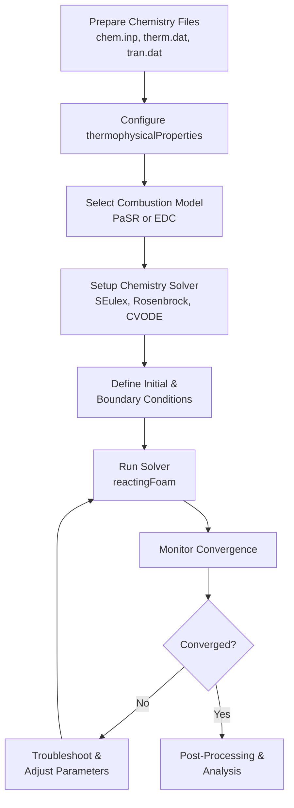

# Practical Workflow: Setting Up a Reacting Flow Simulation

## Overview

This guide provides a comprehensive workflow for setting up and running reacting flow simulations in OpenFOAM. It covers the complete process from chemistry file preparation to solver execution and troubleshooting.

---

## Step 1: Prepare Chemistry Files

The foundation of any reacting flow simulation is the **chemical reaction mechanism**. OpenFOAM requires chemistry data in Chemkin format to describe reaction mechanisms and thermodynamic properties of species involved.

### Required Files

| File | Description |
|------|-------------|
| **`chem.inp`** | Contains chemical reactions, Arrhenius parameters, and third-body efficiencies |
| **`therm.dat`** | Provides temperature-dependent thermodynamic data (Cp, H, S) for each species |
| **`tran.dat`** | Additional transport property file for molecular viscosity and thermal conductivity |

### Example: GRI-Mech 3.0 for Methane Combustion

For methane combustion, the widely-used GRI-Mech 3.0 mechanism provides detailed chemistry with **53 species** and **325 reactions**.

Place these files in your case directory:

```
case_directory/
├── chem.inp          # Reaction mechanism
├── therm.dat         # Thermodynamic data
└── tran.dat          # Transport data (optional)
```

The `chemistryReader` parses these files during solver initialization to generate reaction rate coefficients and species properties required for the simulation.

### Recommended Chemistry Sources

- **GRI-Mech**: Natural gas (methane) combustion mechanisms
- **LLNL mechanisms**: Large mechanisms for various fuels
- **San Diego mechanism**: Small hydrocarbon combustion
- **Konnov mechanism**: Hydrogen combustion

> [!TIP] Chemistry File Locations
> Place chemistry files in either the `constant/` directory or a dedicated `chem/` subdirectory. Reference them correctly in `thermophysicalProperties`.

---

## Step 2: Configure `thermophysicalProperties`

The `constant/thermophysicalProperties` file defines how thermodynamic and transport properties are calculated throughout the simulation.

### Thermophysical Model Configuration

```cpp
thermoType
{
    // Main thermodynamics type selector
    type            hePsiThermo;
    
    // Mixture type for reacting flows
    mixture         reactingMixture;
    
    // Transport property calculation method
    transport       multiComponent;
    
    // Thermodynamic property format
    thermo          janaf;
    
    // Energy formulation type
    energy          sensibleEnthalpy;
    
    // Equation of state model
    equationOfState idealGas;
    
    // Individual species properties
    specie          specie;
}
```

#### 📂 Source: `.applications/test/thermoMixture/Test-thermoMixture.C`

**Explanation:**
ไฟล์นี้กำหนดชนิดของเทอร์โมไดนามิกส์และการคำนวณคุณสมบัติทางกายภาพสำหรับการไหลแบบมีปฏิกิริยาเคมี การกำหนดค่าเหล่านี้ส่งผลต่อความแม่นยำและประสิทธิภาพของการจำลองแบบ

**Key Concepts:**
- `hePsiThermo`: คำนวณเอนทาลปีจากค่าความอัดตัว (ψ) และอุณหภูมิ
- `reactingMixture`: เปิดใช้งานการคำนวณสำหรับสารผสมหลายชนิดที่มีปฏิกิริยาเคมี
- `multiComponent`: ใช้คุณสมบัติการขนส่งแบบผสมเฉลี่ย
- `janaf`: รูปแบบพหุนาม NASA สำหรับคุณสมบัติเทอร์โมไดนามิกส์
- `sensibleEnthalpy`: สมการพลังงานอิงบนเอนทาลปี
- `idealGas`: สมการสถานะ: p = ρRₛT
- `specie`: คุณสมบัติของสารแต่ละชนิด

### Configuration Breakdown

| Component | Description |
|-----------|-------------|
| **`hePsiThermo`** | Calculates enthalpy from compressibility ($\psi$) and temperature |
| **`reactingMixture`** | Enables multi-species reacting mixture calculations |
| **`multiComponent`** | Uses mixture-averaged transport properties |
| **`janaf`** | NASA polynomial format for thermodynamic properties |
| **`sensibleEnthalpy`** | Energy equation based on enthalpy rather than internal energy |
| **`idealGas`** | Equation of state: $p = \rho R_s T$ |
| **`specie`** | Properties of individual species |

### Referencing Chemistry Files

```cpp
mixture
{
    // Chemistry file format reader
    chemistryReader   chemkin;
    
    // Chemical reaction mechanism file
    chemkinFile       "chem.inp";
    
    // Thermodynamic data file
    thermoFile        "therm.dat";
    
    // Transport properties file (optional)
    // transportFile    "tran.dat";
}
```

This section tells OpenFOAM where to find the chemistry mechanism files from Step 1.

> [!INFO] Energy Formulation
> For low Mach number flows, use `sensibleEnthalpy`. For compressible flows with significant density variations, consider `sensibleInternalEnergy`.

---

## Step 3: Select Combustion Model

The combustion model determines how turbulence-chemistry interactions are handled, defined in `constant/combustionProperties`.

### Available Models

| Model | Description |
|--------|-------------|
| **PaSR** | Partial Stirred Reactor - treats each cell as a partially stirred reactor |
| **EDC** | Eddy Dissipation Concept - considers turbulence-chemistry interaction at sub-grid scales |
| **laminar** | No turbulence-chemistry interaction |

### PaSR Model Configuration

```cpp
combustionModel PaSR;

PaSRCoeffs
{
    // Turbulence time scale calculation method
    turbulenceTimeScaleModel integral;
    
    // Mixing constant (0.5-2.0)
    Cmix                   1.0;
}
```

**Explanation:**
โมเดล Partially Stirred Reactor (PaSR) ถือว่าเซลล์แต่ละเซลล์เป็นเครื่องปฏิกรณ์ที่คนละส่วนผสม โดยพิจารณาปฏิสัมพันธ์ระหว่างความปั่นและปฏิกิริยาเคมีในระดับย่อย

**Key Concepts:**
- `turbulenceTimeScaleModel`: วิธีการคำนวณมาตราส่วนเวลาความปั่น
- `integral`: ใช้มาตราส่วนเวลาอินทิกรัลที่อิงกับพลังงานจลน์ของความปั่น
- `Cmix`: ค่าคงที่การผสม (0.5-2.0) ควบคุมระดับการผสม

### EDC Model Configuration

```cpp
combustionModel EDC;

EDCCoeffs
{
    // Structure factor constant
    Cmix                   0.1;
    
    // Time scale constant
    Ctau                   0.5;
    
    // Volume fraction exponent
    exp                    2.0;
}
```

**Explanation:**
โมเดล Eddy Dissipation Concept (EDC) พิจารณาปฏิสัมพันธ์ความปั่น-เคมีในระดับ sub-grid โดยใช้โครงสร้างโมเมนตัมแบบหมุนเวียน

**Key Concepts:**
- `Cmix`: ค่าคงที่โครงสร้าง (ค่าเริ่มต้น: 0.1)
- `Ctau`: ค่าคงที่มาตราส่วนเวลา (ค่าเริ่มต้น: 0.5)
- `exp`: เลขชี้กำลังสำหรับการคำนวณปริมาตรส่วน (ค่าเริ่มต้น: 2.0)

### Model Parameters

**PaSR Parameters:**
- **`Cmix`**: Mixing constant (typically 0.5-2.0) controlling mixing level
- **`turbulenceTimeScaleModel`**: Method for calculating turbulence time scale
  - `integral`: Uses integral time scale based on turbulent kinetic energy
  - `kolmogorov`: Uses Kolmogorov time scale for fine-scale mixing

**EDC Parameters:**
- **`Cmix`**: Structure factor constant (default: 0.1)
- **`Ctau`**: Time scale constant (default: 0.5)
- **`exp`**: Exponent for volume fraction calculation (default: 2.0)

### Model Selection Guide

**Use PaSR when:**
- Fast chemistry (Da >> 1)
- Limited computational resources
- Non-premixed or partially premixed flames

**Use EDC when:**
- Finite-rate chemistry (intermediate Da)
- Higher accuracy required
- Adequate computational resources available
- Premixed flames with high turbulence

---

## Step 4: Setup Chemistry Solver

The chemistry solver controls how the stiff ODE system representing chemical reactions is integrated over time, specified in `constant/chemistryProperties`.

```cpp
chemistry
{
    // Enable chemistry calculation
    chemistry       on;
    
    // ODE solver type
    solver          SEulex;
    
    // Initial chemistry time step [s]
    initialChemicalTimeStep 1e-8;
    
    // Maximum chemistry time step [s]
    maxChemicalTimeStep     1e-3;
    
    // Absolute convergence tolerance
    tolerance       1e-6;
    
    // Relative convergence tolerance
    relTol          0.01;
}
```

**Explanation:**
ตัวแก้สมการเคมีควบคุมการรวมระบบ ODE ที่แข็งแรงซึ่งเป็นตัวแทนของปฏิกิริยาเคมีตลอดเวลา การเลือก solver และการตั้งค่าแต่ละอย่างมีผลต่อความเสถียรและประสิทธิภาพของการคำนวณ

**Key Concepts:**
- `SEulex`: Solver แบบ extrapolation-based สำหรับระบบที่มี stiffness ปานกลาง
- `initialChemicalTimeStep`: ขั้นตอนเวลาเริ่มต้นสำหรับการรวมเคมี
- `maxChemicalTimeStep`: ขั้นตอนเวลาสูงสุดที่อนุญาต
- `tolerance`: ค่าความอดทนการบรรจบกันแบบสัมบูรณ์
- `relTol`: ค่าความอดทนการบรรจบกันแบบสัมพัทธ์

### Solver Options

| Solver | Type | Stiffness Handling | Best For |
|--------|------|-------------------|----------|
| **`SEulex`** | Extrapolation-based | High | Moderate mechanisms (≤ 50 species) |
| **`Rosenbrock`** | Linearly implicit Runge-Kutta | Very High | Very stiff systems (H₂ combustion) |
| **`CVODE`** | Variable step/order (external) | Very High | Large mechanisms (≥ 100 species) |

### Time Step Control

Chemical integration often requires much smaller time steps than fluid dynamics due to reaction stiffness:

- **`initialChemicalTimeStep`**: Initial time step for chemistry integration ($10^{-8}$ s)
- **`maxChemicalTimeStep`**: Maximum allowed time step for chemistry ($10^{-3}$ s)
- **`tolerance`**: Absolute convergence tolerance for species concentrations
- **`relTol`**: Relative tolerance for convergence (1%)

The solver automatically adjusts the chemistry time step based on local reaction rates to maintain accuracy while reducing computational cost.

> [!WARNING] Stiff Chemistry
> For stiff mechanisms (large activation energies), explicit solvers will require time steps ~10⁻⁹ s, making simulations impractical. Always use implicit or semi-implicit solvers for reacting flows.

---

## Step 5: Define Initial and Boundary Conditions

Proper specification of species mass fractions, temperature, and pressure is critical for accurate combustion simulation.

### Species Mass Fractions

For each species in your mechanism, create field files in the `0/` directory:

#### Example: `0/CH4` (Methane)

```cpp
dimensions      [0 0 0 0 0 0 0];

// Initial mass fraction of methane (5.5%)
internalField   uniform 0.055;

boundaryField
{
    inlet
    {
        // Fixed value at inlet
        type            fixedValue;
        value           uniform 0.055;
    }
    outlet
    {
        // Zero gradient at outlet
        type            zeroGradient;
    }
    walls
    {
        // Adiabatic walls
        type            zeroGradient;
    }
}
```

**Explanation:**
ไฟล์นี้กำหนดเงื่อนไขขอบเขตสำหรับส่วนประกอบชนิดหนึ่ง (เมเทน) ในการจำลองแบบการไหลแบบมีปฏิกิริยาเคมี การตั้งค่าอย่างถูกต้องสำคัญต่อความแม่นยำของการทำนาย

**Key Concepts:**
- `dimensions`: มิติของตัวแปร (มวลเศษเป็น无量纲)
- `internalField`: ค่าเริ่มต้นในโดเมน
- `fixedValue`: กำหนดค่าคงที่ที่ขอบเขต
- `zeroGradient`: การไล่ระดับเป็นศูนย์ (ไม่มีการเปลี่ยนแปลง)

#### Example: `0/O2` (Oxygen)

```cpp
dimensions      [0 0 0 0 0 0 0];

// Initial mass fraction of oxygen (23.3%)
internalField   uniform 0.233;

boundaryField
{
    inlet
    {
        // Fixed value at inlet
        type            fixedValue;
        value           uniform 0.233;
    }
    outlet
    {
        // Zero gradient at outlet
        type            zeroGradient;
    }
    walls
    {
        // Adiabatic walls
        type            zeroGradient;
    }
}
```

**Explanation:**
ไฟล์นี้กำหนดเงื่อนไขขอบเขตสำหรับออกซิเจนซึ่งเป็นส่วนประกอบสำคัญในปฏิกิริยาการเผาไหม้

**Key Concepts:**
- ค่า mass fraction ของ O₂ ในอากาศปกติคือ 23.3%
- การใช้ zeroGradient ที่ผนังหมายถึงไม่มีการแพร่ผ่าน

> [!TIP] Species Mass Fraction Sum
> Ensure that $\sum Y_i = 1.0$ for all species. Common practice is to specify major species and calculate the last one (usually N₂) as $Y_{N_2} = 1 - \sum_{i \neq N_2} Y_i$.

### Temperature Field (`0/T`)

```cpp
dimensions      [0 0 0 1 0 0 0];

// Initial temperature field [K]
internalField   uniform 300;

boundaryField
{
    inlet
    {
        // Heated inlet temperature
        type            fixedValue;
        value           uniform 600;
    }
    outlet
    {
        // Zero gradient at outlet
        type            zeroGradient;
    }
    walls
    {
        // Hot wall temperature
        type            fixedValue;
        value           uniform 1200;
    }
}
```

**Explanation:**
ไฟล์นี้กำหนดการกระจายของอุณหภูมิในโดเมนการจำลองแบบ ซึ่งมีผลต่อความเร็วปฏิกิริยาเคมีและคุณสมบัติของของไหล

**Key Concepts:**
- อุณหภูมิมีหน่วยเป็นเคลวิน (K)
- การใช้ fixedValue ที่ผนังสำหรับเงื่อนไขผนังร้อน
- การตั้งค่าอุณหภูมิเริ่มต้นที่สมเหตุสมผลสำคัญต่อความเสถียรของการคำนวณ

### Pressure Field (`0/p`)

```cpp
dimensions      [1 -1 -2 0 0 0 0];

// Initial pressure field [Pa]
internalField   uniform 101325;

boundaryField
{
    inlet
    {
        // Zero gradient at inlet
        type            zeroGradient;
    }
    outlet
    {
        // Fixed atmospheric pressure at outlet
        type            fixedValue;
        value           uniform 101325;
    }
    walls
    {
        // Zero gradient at walls
        type            zeroGradient;
    }
}
```

**Explanation:**
ไฟล์นี้กำหนดการกระจายของความดันในโดเมนการจำลองแบบ ซึ่งสำคัญต่อการคำนวณความเร็วและคุณสมบัติของของไหล

**Key Concepts:**
- ความดันมีหน่วยเป็นปาสกาล (Pa): [kg/(m·s²)]
- การกำหนดความดันคงที่ที่ outlet เป็นเงื่อนไขขอบเขตทั่วไป
- ความดันเริ่มต้นควรเป็นค่าทางกายภาพที่สมเหตุสมผล

### Boundary Condition Types

| BC Type | Appropriate Value | Location |
|---------|------------------|----------|
| `fixedValue` | Specific concentration/temperature | Inlets |
| `zeroGradient` | No change | Outlets |
| `inletOutlet` | Switches between inlet/outlet | Mixed boundaries |

---

## Step 6: Run Solver

### Selecting the Appropriate Solver

| Solver | Description | Application |
|--------|-------------|------------|
| **`reactingFoam`** | Low Mach number reacting flow | Small density variations |
| **`rhoReactingFoam`** | Compressible reacting flow | Large density variations |
| **`reactingEulerFoam`** | Multiphase reacting flow with phase change | Multiphase systems |

### Execution

```bash
# For low Mach number flow
reactingFoam -case your_case_directory

# For compressible flow
rhoReactingFoam -case your_case_directory
```

### Progress Monitoring

Key quantities to monitor during simulation:

1. **Residuals**: All equations should show decreasing residuals
2. **Temperature**: Should be physically reasonable (300-3000 K for combustion)
3. **Species**: Mass fractions should remain between 0 and 1
4. **Heat release**: Monitor chemical heat release rate

### Time Step Control

In `system/controlDict`, adjust time stepping as necessary:

```cpp
// Courant number limit for stability
maxCo           0.5;

// Maximum time step [s]
maxDeltaT       1e-3;

// Enable adaptive time stepping
adjustTimeStep  yes;
```

**Explanation:**
การควบคุมขั้นตอนเวลาสำคัญต่อความเสถียรและประสิทธิภาพของการจำลองแบบ โดยเฉพาะสำหรับปัญหาการไหลแบบมีปฏิกิริยาเคมีที่มีหลายมาตราส่วนเวลา

**Key Concepts:**
- `maxCo`: จำกัดเลข Courant สำหรับเสถียรภาพเชิงตัวเลข
- `maxDeltaT`: ขั้นตอนเวลาสูงสุดที่อนุญาต
- `adjustTimeStep`: เปิดใช้งานการปรับขั้นตอนเวลาอัตโนมัติ

### Convergence Criteria

The simulation is considered converged when:
- All residual plots show consistent decrease
- Temperature field reaches steady state (for steady-state cases)
- Species concentrations stabilize
- Global heat release rate balances

> [!INFO] Typical Time Scales
> - Fluid time step: ~10⁻⁵ to 10⁻³ s (limited by Courant number)
> - Chemistry time step: ~10⁻⁸ to 10⁻⁶ s (limited by reaction stiffness)
> - Operator splitting allows different time scales for flow and chemistry

---

## Step 7: Post-Processing and Analysis

### Analysis Techniques

#### 1. Mass Balance Analysis

```bash
# Calculate inlet/outlet mass flow rates
postProcess -func "volFlowRate" -name "inlet"
postProcess -func "volFlowRate" -name "outlet"

# Calculate species production/destruction rates
foamCalc add Yi
```

#### 2. Energy Balance Analysis

Check energy balance between:
- Energy entering with fluid flow
- Heat from reactions (reaction heat)
- Heat loss at boundaries
- Change in internal energy

#### 3. Combustion Indicators

Key indicators for combustion analysis:

```bash
# Flame temperature
foamCalc max T

# Maximum reaction rate
postProcess -func "max(reactionRate)"

# Intermediate species concentrations
postProcess -func "volFieldValue" -name "OH" -region "reactorZone"
```

### Flow Tracers

Use intermediate species to track reaction zones:
- **OH radical**: Indicates high flame zones
- **CO/CO₂ ratio**: Indicates combustion efficiency
- **Temperature gradients**: Indicate reaction layer thickness

---

## Troubleshooting Guide

### Common Issues and Solutions

| Problem | Symptoms | Solution |
|---------|----------|----------|
| **Divergence** | Residuals increase, simulation crashes | Reduce time step, check boundary conditions |
| **Negative species** | Mass fractions < 0 | Improve mesh quality, reduce chemistry stiffness |
| **Temperature spikes** | Unrealistic temperatures (>4000 K) | Check reaction mechanism, verify thermodynamic data |
| **Slow convergence** | Residuals plateau | Check turbulence model, adjust combustion model parameters |
| **Mass imbalance** | Mass not conserved | Verify boundary conditions, check mass fraction sum |

### Divergence Checklist

- **Check `initialChemicalTimeStep`**: Reduce if chemistry is exploding
- **Check `T` boundaries**: Ensure realistic temperature values
- **Ensure reaction balance**: Verify stoichiometry
- **Check mesh quality**: Non-orthogonality < 70, aspect ratio < 1000
- **Verify solver settings**: Use appropriate schemes for reacting flows

### Performance Optimization

#### Mesh Refinement Strategy
- Use **dynamic mesh refinement** for reacting flows
- Base refinement on:
  - Temperature gradients
  - Species concentration gradients
  - Reaction rate magnitude
- Limit maximum refinement level to control memory and computation time

#### Chemistry Reduction Techniques
- **Mechanism reduction**: Remove unimportant reactions
- **Tabulation**: Use flamelet libraries for complex chemistry
- **Load balancing**: Essential for parallel simulations with local chemistry

### Numerical Scheme Recommendations

For `system/fvSchemes`:

```cpp
ddtSchemes
{
    // First-order Euler scheme (implicit)
    default         Euler;
    
    // Or use second-order for better accuracy
    // default         backward;
}

gradSchemes
{
    // Linear interpolation for gradients
    default         Gauss linear;
}

divSchemes
{
    // Upwind scheme for stability
    default         Gauss upwind;
    
    // Species transport with upwind
    div(phi,Yi)     Gauss upwind;
}

laplacianSchemes
{
    // Linear scheme with non-orthogonal correction
    default         Gauss linear corrected;
}

interpolationSchemes
{
    // Linear interpolation for face values
    default         linear;
}

snGradSchemes
{
    // Corrected surface normal gradient
    default         corrected;
}
```

#### 📂 Source: `.applications/test/fieldMapping/pipe1D/system/fvSchemes`

**Explanation:**
การเลือกแบบจำลองเชิงตัวเลข (numerical schemes) มีผลต่อความเสถียร ความแม่นยำ และประสิทธิภาพของการจำลองแบบ สำหรับปัญหาการไหลแบบมีปฏิกิริยาเคมี ความเสถียรมักมีความสำคัญมากกว่าความแม่นยำ

**Key Concepts:**
- `Euler`: แบบจำลองอันดับหนึ่งแบบ implicit สำหรับความเสถียร
- `backward`: แบบจำลองอันดับสองสำหรับความแม่นยำที่ดีกว่า
- `Gauss upwind`: แบบจำลอง upwind สำหรับเสถียรภาพ
- `Gauss linear corrected`: แบบจำลองเชิงเส้นพร้อมการแก้ไข non-orthogonal

For `system/fvSolution`:

```cpp
solvers
{
    // Momentum and turbulence equation solvers
    "(U|k|epsilon)"
    {
        // Preconditioned bi-conjugate gradient solver
        solver          PBiCGStab;
        
        // Diagonal incomplete LU preconditioner
        preconditioner  DILU;
        
        // Absolute convergence tolerance
        tolerance       1e-05;
        
        // Relative convergence tolerance
        relTol          0.1;
    }

    // Energy and species equation solvers
    "(h|Yi.*)"
    {
        // Preconditioned bi-conjugate gradient solver
        solver          PBiCGStab;
        
        // Diagonal incomplete LU preconditioner
        preconditioner  DILU;
        
        // Absolute convergence tolerance
        tolerance       1e-06;
        
        // Relative convergence tolerance
        relTol          0.01;
    }
}

PIMPLE
{
    // Number of outer correctors
    nOuterCorrectors  2;
    
    // Number of inner correctors
    nCorrectors       2;
    
    // Non-orthogonal correctors
    nNonOrthogonalCorrectors 0;
}

chemistry
{
    // Chemistry ODE solver
    solver            SEulex;
    
    // Absolute tolerance
    tolerance         1e-06;
    
    // Relative tolerance
    relTol            0.01;
}
```

**Explanation:**
การตั้งค่า solver ใน fvSolution กำหนดวิธีการแก้สมการเชิงเส้นและเกณฑ์การบรรจบกัน ซึ่งมีผลต่อความเร็วและความแม่นยำของการคำนวณ

**Key Concepts:**
- `PBiCGStab`: Solver gradient conjugate แบบ preconditioned สำหรับเมทริกซ์ไม่สมมาตร
- `DILU`: Preconditioner แบบ incomplete LU สำหรับความเร็วในการบรรจบกัน
- `nOuterCorrectors`: จำนวนรอบการแก้ไขภายนอกสำหรับ PIMPLE
- `nCorrectors`: จำนวนรอบการแก้ไขภายในสำหรับ Pressure-Velocity coupling

---

## Complete Workflow Summary


> **Figure 1:** แผนผังลำดับขั้นตอนการปฏิบัติงานสำหรับการจำลองการไหลแบบมีปฏิกิริยาเคมีที่สมบูรณ์ ตั้งแต่การเตรียมข้อมูลกลไกปฏิกิริยาเคมี การตั้งค่าพารามิเตอร์ของ Solver ไปจนถึงกระบวนการวิเคราะห์ผลลัพธ์เชิงวิศวกรรมและการแก้ปัญหาความไม่ลู่เข้าของคำตอบ

---

## Quick Reference Configuration

### Minimal `constant/thermophysicalProperties`

```cpp
thermoType
{
    type            hePsiThermo;
    mixture         reactingMixture;
    transport       multiComponent;
    thermo          janaf;
    energy          sensibleEnthalpy;
    equationOfState idealGas;
    specie          specie;
}

mixture
{
    chemistryReader   chemkin;
    chemkinFile       "chem.inp";
    thermoFile        "therm.dat";
}
```

### Minimal `constant/chemistryProperties`

```cpp
chemistry       on;
solver          SEulex;
initialChemicalTimeStep 1e-8;
maxChemicalTimeStep     1e-3;
tolerance       1e-6;
relTol          0.01;
```

### Minimal `constant/combustionProperties`

```cpp
combustionModel PaSR;

PaSRCoeffs
{
    turbulenceTimeScaleModel integral;
    Cmix                   1.0;
}
```

---

This workflow provides a robust foundation for setting up reacting flow simulations in OpenFOAM, enabling accurate prediction of combustion phenomena in engineering applications.