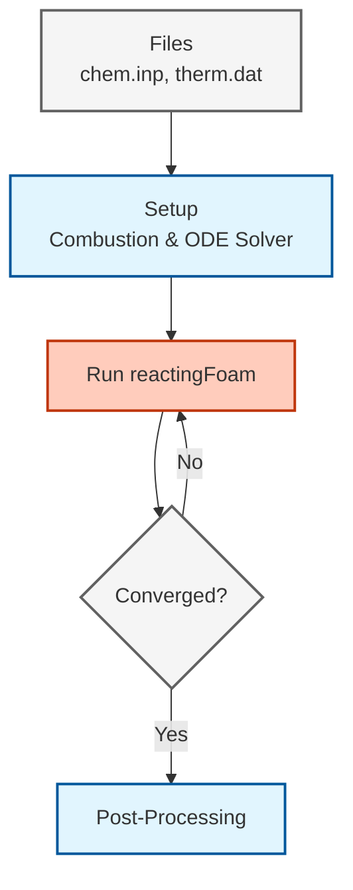

# ขั้นตอนการทำงานจริง: การตั้งค่าการจำลองการไหลแบบมีปฏิกิริยา (Practical Workflow: Setting Up a Reacting Flow Simulation)

## ภาพรวม (Overview)

คู่มือนี้จัดทำขั้นตอนการทำงานที่ครอบคลุมสำหรับการตั้งค่าและรันการจำลองการไหลแบบมีปฏิกิริยาใน OpenFOAM ครอบคลุมกระบวนการที่สมบูรณ์ตั้งแต่การเตรียมไฟล์เคมีไปจนถึงการรันตัวแก้ปัญหาและการแก้ไขปัญหา
 
 > [!TIP] **มุมมองเปรียบเทียบ: การเตรียมครัวระดับมิชลิน (Mise en Place)**
 >
 > การตั้งค่า Reacting Flow ก็เหมือนการเตรียมทำอาหารจานหรู:
 > 1.  **Prepare Ingredients (Step 1):** เตรียมวัตถุดิบให้พร้อม (`chem.inp`, `therm.dat`) เหมือนเตรียมเนื้อ ผัก เครื่องปรุง
 > 2.  **Kitchen Setup (Step 2):** จัดเตรียมอุปกรณ์เครื่องครัว (`thermophysicalProperties`) ว่าจะใช้เตาอบหรือกระทะ (Gas model, Energy Eq.)
 > 3.  **Cooking Method (Step 3):** เลือกวิธีการปรุง (`combustionModel`) จะผัดไฟแรง (PaSR) หรือตุ๋นไฟอ่อน (EDC)
 > 4.  **Chef's Technique (Step 4):** เทคนิคการคุมไฟ (`chemistryProperties`) เพื่อไม่ให้อาหารไหม้หรือดิบเกินไป (Time step control)
 
 ---

---

## ขั้นตอนที่ 1: เตรียมไฟล์เคมี (Prepare Chemistry Files)

รากฐานของการจำลองการไหลแบบมีปฏิกิริยาใดๆ คือ **กลไกปฏิกิริยาเคมี (chemical reaction mechanism)** OpenFOAM ต้องการข้อมูลทางเคมีในรูปแบบ Chemkin เพื่ออธิบายกลไกปฏิกิริยาและสมบัติทางเทอร์โมไดนามิกของสปีชีส์ที่เกี่ยวข้อง

### ไฟล์ที่จำเป็น

| ไฟล์ | คำอธิบาย |
|------|-------------|
| **`chem.inp`** | บรรจุปฏิกิริยาเคมี, พารามิเตอร์อาร์เรเนียส และประสิทธิภาพของตัวที่สาม |
| **`therm.dat`** | ให้ข้อมูลเทอร์โมไดนามิกที่ขึ้นกับอุณหภูมิ (Cp, H, S) สำหรับแต่ละสปีชีส์ |
| **`tran.dat`** | ไฟล์สมบัติการขนส่งเพิ่มเติมสำหรับความหนืดโมเลกุลและการนำความร้อน |

### ตัวอย่าง: GRI-Mech 3.0 สำหรับการเผาไหม้มีเทน

สำหรับการเผาไหม้มีเทน กลไก GRI-Mech 3.0 ที่ใช้กันอย่างแพร่หลายให้รายละเอียดทางเคมีด้วย **53 สปีชีส์** และ **325 ปฏิกิริยา**

วางไฟล์เหล่านี้ไว้ในไดเรกทอรีกรณีศึกษาของคุณ:

```
case_directory/
├── chem.inp          # กลไกปฏิกิริยา
├── therm.dat         # ข้อมูลเทอร์โมไดนามิก
└── tran.dat         # ข้อมูลการขนส่ง (ทางเลือก)
```

`chemistryReader` จะวิเคราะห์ไฟล์เหล่านี้ในระหว่างการเริ่มต้นตัวแก้ปัญหาเพื่อสร้างสัมประสิทธิ์อัตราปฏิกิริยาและสมบัติสปีชีส์ที่จำเป็นสำหรับการจำลอง

### แหล่งข้อมูลเคมีที่แนะนำ

- **GRI-Mech**: กลไกการเผาไหม้ก๊าซธรรมชาติ (มีเทน)
- **LLNL mechanisms**: กลไกขนาดใหญ่สำหรับเชื้อเพลิงหลากหลายชนิด
- **San Diego mechanism**: การเผาไหม้ไฮโดรคาร์บอนขนาดเล็ก
- **Konnov mechanism**: การเผาไหม้ไฮโดรเจน

> [!TIP] ตำแหน่งไฟล์เคมี
> วางไฟล์เคมีไว้ในไดเรกทอรี `constant/` หรือไดเรกทอรีย่อย `chem/` ที่สร้างขึ้นโดยเฉพาะ อ้างอิงไฟล์เหล่านี้ให้ถูกต้องใน `thermophysicalProperties`

---

## ขั้นตอนที่ 2: กำหนดค่า `thermophysicalProperties`

ไฟล์ `constant/thermophysicalProperties` กำหนดวิธีคำนวณคุณสมบัติทางเทอร์โมไดนามิกและการขนส่งตลอดการจำลอง

### การกำหนดค่ารูปแบบจำลองเทอร์โมฟิสิกส์

```cpp
thermoType
{
    // ตัวเลือกประเภทเทอร์โมไดนามิกหลัก
    type            hePsiThermo;
    
    // ประเภทส่วนผสมสำหรับการไหลแบบมีปฏิกิริยา
    mixture         reactingMixture;
    
    // วิธีการคำนวณสมบัติการขนส่ง
    transport       multiComponent;
    
    // รูปแบบสมบัติเทอร์โมไดนามิก
    thermo          janaf;
    
    // ประเภทรูปแบบพลังงาน
    energy          sensibleEnthalpy;
    
    // แบบจำลองสมการสภาวะ
    equationOfState idealGas;
    
    // สมบัติสปีชีส์แต่ละตัว
    specie          specie;
}
```

#### 📂 แหล่งที่มา: `.applications/test/thermoMixture/Test-thermoMixture.C`

**คำอธิบาย:**
ไฟล์นี้กำหนดชนิดของเทอร์โมไดนามิกส์และการคำนวณคุณสมบัติทางกายภาพสำหรับการไหลแบบมีปฏิกิริยาเคมี การกำหนดค่าเหล่านี้ส่งผลต่อความแม่นยำและประสิทธิภาพของการจำลองแบบ

**แนวคิดสำคัญ:**
- `hePsiThermo`: คำนวณเอนทาลปีจากค่าความอัดตัว (ψ) และอุณหภูมิ
- `reactingMixture`: เปิดใช้งานการคำนวณสำหรับสารผสมหลายชนิดที่มีปฏิกิริยาเคมี
- `multiComponent`: ใช้คุณสมบัติการขนส่งแบบผสมเฉลี่ย
- `janaf`: รูปแบบพหุนาม NASA สำหรับคุณสมบัติเทอร์โมไดนามิกส์
- `sensibleEnthalpy`: สมการพลังงานอิงบนเอนทาลปี
- `idealGas`: สมการสถานะ: p = ρRₛT
- `specie`: คุณสมบัติของสารแต่ละชนิด

### รายละเอียดการกำหนดค่า (Configuration Breakdown)

| ส่วนประกอบ | คำอธิบาย |
|-----------|-------------|
| **`hePsiThermo`** | คำนวณเอนทาลปีจากค่าความอัดตัว ($\psi$) และอุณหภูมิ |
| **`reactingMixture`** | เปิดใช้งานการคำนวณส่วนผสมแบบมีปฏิกิริยาหลายสปีชีส์ |
| **`multiComponent`** | ใช้สมบัติการขนส่งแบบเฉลี่ยส่วนผสม (mixture-averaged) |
| **`janaf`** | รูปแบบพหุนาม NASA สำหรับสมบัติเทอร์โมไดนามิก |
| **`sensibleEnthalpy`** | สมการพลังงานอ้างอิงตามเอนทาลปีแทนที่จะเป็นพลังงานภายใน |
| **`idealGas`** | สมการสภาวะ: $p = \rho R_s T$ |
| **`specie`** | สมบัติของสปีชีส์แต่ละตัว |

### การอ้างอิงไฟล์เคมี

```cpp
mixture
{
    // ตัวอ่านรูปแบบไฟล์เคมี
    chemistryReader   chemkin;
    
    // ไฟล์กลไกปฏิกิริยาเคมี
    chemkinFile       "chem.inp";
    
    // ไฟล์ข้อมูลเทอร์โมไดนามิก
    thermoFile        "therm.dat";
    
    // ไฟล์สมบัติการขนส่ง (ทางเลือก)
    // transportFile    "tran.dat";
}
```

ส่วนนี้บอก OpenFOAM ว่าจะหาไฟล์กลไกเคมีจากขั้นตอนที่ 1 ได้ที่ไหน

> [!INFO] รูปแบบพลังงาน
> สำหรับการไหลที่มีเลขมัค (Mach number) ต่ำ ให้ใช้ `sensibleEnthalpy` สำหรับการไหลที่อัดตัวได้ซึ่งมีการเปลี่ยนแปลงความหนาแน่นอย่างมีนัยสำคัญ ให้พิจารณาใช้ `sensibleInternalEnergy`

---

## ขั้นตอนที่ 3: เลือกแบบจำลองการเผาไหม้ (Select Combustion Model)

แบบจำลองการเผาไหม้กำหนดวิธีจัดการปฏิสัมพันธ์ระหว่างความปั่นป่วนและเคมี โดยระบุใน `constant/combustionProperties`

### แบบจำลองที่มีให้ใช้งาน

| แบบจำลอง | คำอธิบาย |
|--------|-------------|
| **PaSR** | Partial Stirred Reactor - จัดการแต่ละเซลล์เสมือนเครื่องปฏิกรณ์ที่ผสมกันบางส่วน |
| **EDC** | Eddy Dissipation Concept - พิจารณาปฏิสัมพันธ์ความปั่นป่วน-เคมีที่ระดับ sub-grid |
| **laminar** | ไม่มีการพิจารณาปฏิสัมพันธ์ความปั่นป่วน-เคมี |

### การกำหนดค่าแบบจำลอง PaSR

```cpp
combustionModel PaSR;

PaSRCoeffs
{
    // วิธีการคำนวณมาตราส่วนเวลาความปั่นป่วน
    turbulenceTimeScaleModel integral;
    
    // ค่าคงที่การผสม (0.5-2.0)
    Cmix                   1.0;
}
```

**คำอธิบาย:**
โมเดล Partially Stirred Reactor (PaSR) ถือว่าเซลล์แต่ละเซลล์เป็นเครื่องปฏิกรณ์ที่คนละส่วนผสม โดยพิจารณาปฏิสัมพันธ์ระหว่างความปั่นและปฏิกิริยาเคมีในระดับย่อย

**แนวคิดสำคัญ:**
- `turbulenceTimeScaleModel`: วิธีการคำนวณมาตราส่วนเวลาความปั่น
- `integral`: ใช้มาตราส่วนเวลาอินทิกรัลที่อิงกับพลังงานจลน์ของความปั่น
- `Cmix`: ค่าคงที่การผสม (0.5-2.0) ควบคุมระดับการผสม

### การกำหนดค่าแบบจำลอง EDC

```cpp
combustionModel EDC;

EDCCoeffs
{
    // ค่าคงที่ปัจจัยโครงสร้าง (Structure factor constant)
    Cmix                   0.1;
    
    // ค่าคงที่มาตราส่วนเวลา (Time scale constant)
    Ctau                   0.5;
    
    // เลขชี้กำลังสัดส่วนปริมาตร
    exp                    2.0;
}
```

**คำอธิบาย:**
โมเดล Eddy Dissipation Concept (EDC) พิจารณาปฏิสัมพันธ์ความปั่น-เคมีในระดับ sub-grid โดยใช้โครงสร้างโมเมนตัมแบบหมุนเวียน

**แนวคิดสำคัญ:**
- `Cmix`: ค่าคงที่โครงสร้าง (ค่าเริ่มต้น: 0.1)
- `Ctau`: ค่าคงที่มาตราส่วนเวลา (ค่าเริ่มต้น: 0.5)
- `exp`: เลขชี้กำลังสำหรับการคำนวณปริมาตรส่วน (ค่าเริ่มต้น: 2.0)

### พารามิเตอร์แบบจำลอง

**พารามิเตอร์ PaSR:**
- **`Cmix`**: ค่าคงที่การผสม (โดยทั่วไปคือ 0.5-2.0) ควบคุมระดับการผสม
- **`turbulenceTimeScaleModel`**: วิธีการคำนวณมาตราส่วนเวลาความปั่นป่วน
  - `integral`: ใช้มาตราส่วนเวลาแบบอินทิกรัลอิงตามพลังงานจลน์ปั่นป่วน
  - `kolmogorov`: ใช้มาตราส่วนเวลาคอลโมโกรอฟสำหรับการผสมระดับละเอียด

**พารามิเตอร์ EDC:**
- **`Cmix`**: ค่าคงที่ปัจจัยโครงสร้าง (ค่าเริ่มต้น: 0.1)
- **`Ctau`**: ค่าคงที่มาตราส่วนเวลา (ค่าเริ่มต้น: 0.5)
- **`exp`**: เลขชี้กำลังสำหรับการคำนวณสัดส่วนปริมาตร (ค่าเริ่มต้น: 2.0)

### คู่มือการเลือกแบบจำลอง

**ใช้ PaSR เมื่อ:**
- เคมีเกิดเร็วมาก (Da >> 1)
- ทรัพยากรการคำนวณมีจำกัด
- เปลวไฟแบบไม่ผสมล่วงหน้าหรือแบบผสมกันบางส่วน

**ใช้ EDC เมื่อ:**
- เคมีมีอัตราจำกัด (Da ระดับปานกลาง)
- ต้องการความแม่นยำสูงขึ้น
- มีทรัพยากรการคำนวณเพียงพอ
- เปลวไฟแบบผสมล่วงหน้าที่มีความปั่นป่วนสูง

---

## ขั้นตอนที่ 4: ตั้งค่าตัวแก้สมการเคมี (Setup Chemistry Solver)

ตัวแก้สมการเคมีควบคุมวิธีที่ระบบ ODE แบบแข็งซึ่งแทนปฏิกิริยาเคมีจะถูกบูรณาการในเวลา ระบุใน `constant/chemistryProperties`

```cpp
chemistry
{
    // เปิดใช้งานการคำนวณทางเคมี
    chemistry       on;
    
    // ประเภทตัวแก้ ODE
    solver          SEulex;
    
    // ช่วงเวลาเริ่มต้นสำหรับการบูรณาการเคมี [วินาที]
    initialChemicalTimeStep 1e-8;
    
    // ช่วงเวลาสูงสุดที่อนุญาตสำหรับการบูรณาการเคมี [วินาที]
    maxChemicalTimeStep     1e-3;
    
    // ค่าความคลาดเคลื่อนสัมบูรณ์สำหรับการลู่เข้า
    tolerance       1e-6;
    
    // ค่าความคลาดเคลื่อนสัมพัทธ์สำหรับการลู่เข้า
    relTol          0.01;
}
```

**คำอธิบาย:**
ตัวแก้สมการเคมีควบคุมการรวมระบบ ODE ที่แข็งแรงซึ่งเป็นตัวแทนของปฏิกิริยาเคมีตลอดเวลา การเลือก solver และการตั้งค่าแต่ละอย่างมีผลต่อความเสถียรและประสิทธิภาพของการคำนวณ

**แนวคิดสำคัญ:**
- `SEulex`: Solver แบบ extrapolation-based สำหรับระบบที่มี stiffness ปานกลาง
- `initialChemicalTimeStep`: ขั้นตอนเวลาเริ่มต้นสำหรับการรวมเคมี
- `maxChemicalTimeStep`: ขั้นตอนเวลาสูงสุดที่อนุญาต
- `tolerance`: ค่าความอดทนการบรรจบกันแบบสัมบูรณ์
- `relTol`: ค่าความอดทนการบรรจบกันแบบสัมพัทธ์

### ตัวเลือกตัวแก้ปัญหา (Solver Options)

| ตัวแก้ปัญหา | ประเภท | การจัดการความแข็งเกร็ง | เหมาะสำหรับ |
|--------|------|-------------------|----------|
| **`SEulex`** | อ้างอิงการประมาณค่า (Extrapolation) | สูง | กลไกขนาดปานกลาง (≤ 50 สปีชีส์) |
| **`Rosenbrock`** | แบบโดยนัยเชิงเส้น (Linearly implicit) Runge-Kutta | สูงมาก | ระบบที่แข็งเกร็งมาก (เช่น การเผาไหม้ H₂) |
| **`CVODE`** | ปรับช่วงเวลา/อันดับได้ (ภายนอก) | สูงมาก | กลไกขนาดใหญ่ (≥ 100 สปีชีส์) |

### การควบคุมช่วงเวลา

การบูรณาการทางเคมีมักต้องการช่วงเวลาที่เล็กกว่าพลศาสตร์การไหลมากเนื่องจากความแข็งเกร็งของปฏิกิริยา:

- **`initialChemicalTimeStep`**: ช่วงเวลาเริ่มต้นสำหรับการบูรณาการเคมี ($10^{-8}$ วินาที)
- **`maxChemicalTimeStep`**: ช่วงเวลาสูงสุดที่อนุญาตสำหรับเคมี ($10^{-3}$ วินาที)
- **`tolerance`**: ค่าความคลาดเคลื่อนสัมบูรณ์สำหรับการลู่เข้าของความเข้มข้นสปีชีส์
- **`relTol`**: ค่าความคลาดเคลื่อนสัมพัทธ์สำหรับการลู่เข้า (1%)

ตัวแก้ปัญหาจะปรับช่วงเวลาเคมีโดยอัตโนมัติตามอัตราปฏิกิริยาเฉพาะที่เพื่อรักษาความแม่นยำในขณะที่ลดต้นทุนการคำนวณ

> [!WARNING] เคมีแบบแข็งเกร็ง
> สำหรับกลไกที่แข็งเกร็งมาก (พลังงานก่อกัมมันต์สูง) ตัวแก้ปัญหาแบบชัดแจ้งจะต้องการช่วงเวลา ~10⁻⁹ วินาที ซึ่งทำให้การจำลองทำไม่ได้จริง ให้ใช้ตัวแก้ปัญหาแบบโดยนัยหรือกึ่งโดยนัยสำหรับการไหลแบบมีปฏิกิริยาเสมอ

---

## ขั้นตอนที่ 5: กำหนดเงื่อนไขเริ่มต้นและเงื่อนไขขอบเขต

การระบุเศษส่วนมวลของสปีชีส์ อุณหภูมิ และความดันที่เหมาะสมเป็นสิ่งสำคัญสำหรับการจำลองการเผาไหม้ที่แม่นยำ

### เศษส่วนมวลของสปีชีส์ (Species Mass Fractions)

สำหรับแต่ละสปีชีส์ในกลไกของคุณ ให้สร้างไฟล์ฟิลด์ในไดเรกทอรี `0/`:

#### ตัวอย่าง: `0/CH4` (มีเทน)

```cpp
dimensions      [0 0 0 0 0 0 0];

// เศษส่วนมวลเริ่มต้นของมีเทน (5.5%)
internalField   uniform 0.055;

boundaryField
{
    inlet
    {
        // ค่าคงที่ที่ทางเข้า
        type            fixedValue;
        value           uniform 0.055;
    }
    outlet
    {
        // เกรเดียนต์เป็นศูนย์ที่ทางออก
        type            zeroGradient;
    }
    walls
    {
        // ผนังแบบอะไดอะแบติก (Adiabatic walls)
        type            zeroGradient;
    }
}
```

**คำอธิบาย:**
ไฟล์นี้กำหนดเงื่อนไขขอบเขตสำหรับส่วนประกอบชนิดหนึ่ง (เมเทน) ในการจำลองแบบการไหลแบบมีปฏิกิริยาเคมี การตั้งค่าอย่างถูกต้องสำคัญต่อความแม่นยำของการทำนาย

**แนวคิดสำคัญ:**
- `dimensions`: มิติของตัวแปร (มวลเศษเป็นไร้มิติ)
- `internalField`: ค่าเริ่มต้นในโดเมน
- `fixedValue`: กำหนดค่าคงที่ที่ขอบเขต
- `zeroGradient`: การไล่ระดับเป็นศูนย์ (ไม่มีการเปลี่ยนแปลง)

#### ตัวอย่าง: `0/O2` (ออกซิเจน)

```cpp
dimensions      [0 0 0 0 0 0 0];

// เศษส่วนมวลเริ่มต้นของออกซิเจน (23.3%)
internalField   uniform 0.233;

boundaryField
{
    inlet
    {
        // ค่าคงที่ที่ทางเข้า
        type            fixedValue;
        value           uniform 0.233;
    }
    outlet
    {
        // เกรเดียนต์เป็นศูนย์ที่ทางออก
        type            zeroGradient;
    }
    walls
    {
        // ผนังแบบอะไดอะแบติก
        type            zeroGradient;
    }
}
```

**คำอธิบาย:**
ไฟล์นี้กำหนดเงื่อนไขขอบเขตสำหรับออกซิเจนซึ่งเป็นส่วนประกอบสำคัญในปฏิกิริยาการเผาไหม้

**แนวคิดสำคัญ:**
- ค่า mass fraction ของ O₂ ในอากาศปกติคือ 23.3%
- การใช้ zeroGradient ที่ผนังหมายถึงไม่มีการแพร่ผ่าน

> [!TIP] ผลรวมเศษส่วนมวลสปีชีส์
> ตรวจสอบให้แน่ใจว่า $\sum Y_i = 1.0$ สำหรับทุกสปีชีส์ แนวทางปฏิบัติทั่วไปคือระบุสปีชีส์หลักและคำนวณสปีชีส์สุดท้าย (มักจะเป็น N₂) เป็น $Y_{N_2} = 1 - \sum_{i \neq N_2} Y_i$

### ฟิลด์อุณหภูมิ (`0/T`)

```cpp
dimensions      [0 0 0 1 0 0 0];

// ฟิลด์อุณหภูมิเริ่มต้น [เคลวิน]
internalField   uniform 300;

boundaryField
{
    inlet
    {
        // อุณหภูมิทางเข้าที่ได้รับความร้อน
        type            fixedValue;
        value           uniform 600;
    }
    outlet
    {
        // เกรเดียนต์เป็นศูนย์ที่ทางออก
        type            zeroGradient;
    }
    walls
    {
        // อุณหภูมิผนังร้อน
        type            fixedValue;
        value           uniform 1200;
    }
}
```

**คำอธิบาย:**
ไฟล์นี้กำหนดการกระจายของอุณหภูมิในโดเมนการจำลองแบบ ซึ่งมีผลต่อความเร็วปฏิกิริยาเคมีและคุณสมบัติของของไหล

**แนวคิดสำคัญ:**
- อุณหภูมิมีหน่วยเป็นเคลวิน (K)
- การใช้ fixedValue ที่ผนังสำหรับเงื่อนไขผนังร้อน
- การตั้งค่าอุณหภูมิเริ่มต้นที่สมเหตุสมผลสำคัญต่อความเสถียรของการคำนวณ

### ฟิลด์ความดัน (`0/p`)

```cpp
dimensions      [1 -1 -2 0 0 0 0];

// ฟิลด์ความดันเริ่มต้น [ปาสกาล]
internalField   uniform 101325;

boundaryField
{
    inlet
    {
        // เกรเดียนต์เป็นศูนย์ที่ทางเข้า
        type            zeroGradient;
    }
    outlet
    {
        // กำหนดความดันบรรยากาศคงที่ที่ทางออก
        type            fixedValue;
        value           uniform 101325;
    }
    walls
    {
        // เกรเดียนต์เป็นศูนย์ที่ผนัง
        type            zeroGradient;
    }
}
```

**คำอธิบาย:**
ไฟล์นี้กำหนดการกระจายของความดันในโดเมนการจำลองแบบ ซึ่งสำคัญต่อการคำนวณความเร็วและคุณสมบัติของของไหล

**แนวคิดสำคัญ:**
- ความดันมีหน่วยเป็นปาสกาล (Pa): [kg/(m·s²)]
- การกำหนดความดันคงที่ที่ outlet เป็นเงื่อนไขขอบเขตทั่วไป
- ความดันเริ่มต้นควรเป็นค่าทางกายภาพที่สมเหตุสมผล

### ประเภทเงื่อนไขขอบเขต

| ประเภท BC | ค่าที่เหมาะสม | ตำแหน่ง |
|---------|------------------|----------|
| `fixedValue` | ความเข้มข้น/อุณหภูมิเฉพาะ | ทางเข้า (Inlets) |
| `zeroGradient` | ไม่มีการเปลี่ยนแปลง | ทางออก (Outlets) |
| `inletOutlet` | สลับระหว่างทางเข้า/ทางออก | ขอบเขตผสม |

---

## ขั้นตอนที่ 6: รันตัวแก้ปัญหา (Run Solver)

### การเลือกตัวแก้ปัญหาที่เหมาะสม

| ตัวแก้ปัญหา | คำอธิบาย | การประยุกต์ใช้ |
|--------|-------------|------------|
| **`reactingFoam`** | การไหลแบบมีปฏิกิริยาที่เลขมัคต่ำ | การเปลี่ยนแปลงความหนาแน่นน้อย |
| **`rhoReactingFoam`** | การไหลแบบมีปฏิกิริยาที่อัดตัวได้ | การเปลี่ยนแปลงความหนาแน่นมาก |
| **`reactingEulerFoam`** | การไหลแบบมีปฏิกิริยาหลายเฟสพร้อมการเปลี่ยนสถานะ | ระบบหลายเฟส |

### การรัน (Execution)

```bash
# สำหรับการไหลที่มีเลขมัคต่ำ
reactingFoam -case your_case_directory

# สำหรับการไหลที่อัดตัวได้
rhoReactingFoam -case your_case_directory
```

### การติดตามความคืบหน้า

ปริมาณหลักที่ต้องติดตามในระหว่างการจำลอง:

1. **ค่าตกค้าง (Residuals)**: สมการทั้งหมดควรแสดงค่าตกค้างที่ลดลง
2. **อุณหภูมิ**: ควรมีความสมเหตุสมผลทางฟิสิกส์ (300-3000 K สำหรับการเผาไหม้)
3. **สปีชีส์**: เศษส่วนมวลควรอยู่ระหว่าง 0 และ 1
4. **การคายความร้อน (Heat release)**: ติดตามอัตราการคายความร้อนทางเคมี

### การควบคุมช่วงเวลา (Time Step Control)

ในไฟล์ `system/controlDict` ให้ปรับการก้าวช่วงเวลาตามต้องการ:

```cpp
// ขีดจำกัดเลขคูแรนท์เพื่อเสถียรภาพ
maxCo           0.5;

// ช่วงเวลาสูงสุด [วินาที]
maxDeltaT       1e-3;

// เปิดใช้งานการปรับช่วงเวลาแบบปรับตัว
adjustTimeStep  yes;
```

**คำอธิบาย:**
การควบคุมขั้นตอนเวลาสำคัญต่อความเสถียรและประสิทธิภาพของการจำลองแบบ โดยเฉพาะสำหรับปัญหาการไหลแบบมีปฏิกิริยาเคมีที่มีหลายมาตราส่วนเวลา

**แนวคิดสำคัญ:**
- `maxCo`: จำกัดเลข Courant สำหรับเสถียรภาพเชิงตัวเลข
- `maxDeltaT`: ขั้นตอนเวลาสูงสุดที่อนุญาต
- `adjustTimeStep`: เปิดใช้งานการปรับขั้นตอนเวลาอัตโนมัติ

### เกณฑ์การลู่เข้า (Convergence Criteria)

การจำลองจะถือว่าลู่เข้าเมื่อ:
- พล็อตค่าตกค้างทั้งหมดแสดงการลดลงอย่างต่อเนื่อง
- สนามอุณหภูมิเข้าสู่สภาวะคงตัว (สำหรับกรณีสภาวะคงตัว)
- ความเข้มข้นของสปีชีส์คงที่
- อัตราการคายความร้อนโดยรวมเกิดความสมดุล

> [!INFO] มาตราส่วนเวลาทั่วไป
> - ช่วงเวลาของไหล: ~10⁻⁵ ถึง 10⁻³ วินาที (จำกัดโดยเลขคูแรนท์)
> - ช่วงเวลาเคมี: ~10⁻⁸ ถึง 10⁻⁶ วินาที (จำกัดโดยความแข็งเกร็งของปฏิกิริยา)
> - การแยกตัวดำเนินการ (Operator splitting) ช่วยให้ใช้มาตราส่วนเวลาที่ต่างกันสำหรับของไหลและเคมีได้

---

## ขั้นตอนที่ 7: การประมวลผลหลังการจำลองและการวิเคราะห์ (Post-Processing)

### เทคนิคการวิเคราะห์

#### 1. การวิเคราะห์สมดุลมวล

```bash
# คำนวณอัตราการไหลของมวลที่ทางเข้า/ทางออก
postProcess -func "volFlowRate" -name "inlet"
postProcess -func "volFlowRate" -name "outlet"

# คำนวณอัตราการผลิต/ทำลายสปีชีส์
foamCalc add Yi
```

#### 2. การวิเคราะห์สมดุลพลังงาน

ตรวจสอบสมดุลพลังงานระหว่าง:
- พลังงานที่เข้ามาพร้อมกับการไหลของของไหล
- ความร้อนจากปฏิกิริยา (ความร้อนจากปฏิกิริยา)
- การสูญเสียความร้อนที่ขอบเขต
- การเปลี่ยนแปลงพลังงานภายใน

#### 3. ตัวบ่งชี้การเผาไหม้

ตัวบ่งชี้หลักสำหรับการวิเคราะห์การเผาไหม้:

```bash
# อุณหภูมิเปลวไฟ
foamCalc max T

# อัตราปฏิกิริยาสูงสุด
postProcess -func "max(reactionRate)"

# ความเข้มข้นของสปีชีส์ตัวกลาง
postProcess -func "volFieldValue" -name "OH" -region "reactorZone"
```

### ตัวติดตามการไหล (Flow Tracers)

ใช้สปีชีส์ตัวกลางเพื่อติดตามโซนปฏิกิริยา:
- **อนุมูลอิสระ OH**: บ่งชี้โซนเปลวไฟที่มีความร้อนสูง
- **อัตราส่วน CO/CO₂**: บ่งชี้ประสิทธิภาพการเผาไหม้
- **เกรเดียนต์อุณหภูมิ**: บ่งชี้ความหนาของชั้นปฏิกิริยา

---

## คู่มือการแก้ไขปัญหา (Troubleshooting Guide)

### ปัญหาที่พบบ่อยและวิธีแก้ไข

| ปัญหา | อาการ | วิธีแก้ไข |
|---------|----------|----------|
| **การลู่ออก (Divergence)** | ค่าตกค้างเพิ่มขึ้น, การจำลองแครช | ลดช่วงเวลา, ตรวจสอบเงื่อนไขขอบเขต |
| **สปีชีส์เป็นลบ** | เศษส่วนมวล < 0 | ปรับปรุงคุณภาพเมช, ลดความแข็งเกร็งทางเคมี |
| **อุณหภูมิพุ่งสูง** | อุณหภูมิไม่สมจริง (>4000 K) | ตรวจสอบกลไกปฏิกิริยา, ยืนยันข้อมูลเทอร์โมไดนามิก |
| **การลู่เข้าช้า** | ค่าตกค้างคงที่ที่ระดับสูง | ตรวจสอบแบบจำลองความปั่นป่วน, ปรับพารามิเตอร์แบบจำลองการเผาไหม้ |
| **มวลไม่สมดุล** | มวลไม่ได้รับการอนุรักษ์ | ตรวจสอบเงื่อนไขขอบเขต, ตรวจสอบผลรวมเศษส่วนมวล |

### รายการตรวจสอบการลู่ออก (Divergence Checklist)

- **ตรวจสอบ `initialChemicalTimeStep`**: ลดลงหากเคมีเกิดการระเบิด (exploding)
- **ตรวจสอบขอบเขต `T`**: รับประกันว่าค่าอุณหภูมิมีความสมจริง
- **รับประกันสมดุลปฏิกิริยา**: ยืนยันปริมาณสัมพันธ์ (stoichiometry)
- **ตรวจสอบคุณภาพเมช**: ความไม่ตั้งฉาก < 70, อัตราส่วนรูปร่าง < 1000
- **ยืนยันการตั้งค่าตัวแก้ปัญหา**: ใช้รูปแบบ (schemes) ที่เหมาะสมสำหรับการไหลแบบมีปฏิกิริยา

### การเพิ่มประสิทธิภาพ

#### กลยุทธ์การปรับปรุงเมช
- ใช้ **การปรับปรุงเมชแบบพลวัต (dynamic mesh refinement)** สำหรับการไหลแบบมีปฏิกิริยา
- ปรับปรุงตาม:
  - เกรเดียนต์อุณหภูมิ
  - เกรเดียนต์ความเข้มข้นสปีชีส์
  - ขนาดของอัตราปฏิกิริยา
- จำกัดระดับการปรับปรุงสูงสุดเพื่อควบคุมหน่วยความจำและเวลาคำนวณ

#### เทคนิคการลดขนาดทางเคมี
- **การลดขนาดกลไก**: กำจัดปฏิกิริยาที่ไม่สำคัญออก
- **การทำตาราง (Tabulation)**: ใช้ไลบรารี flamelet สำหรับเคมีที่ซับซ้อน
- **การปรับสมดุลภาระงาน**: จำเป็นสำหรับการจำลองแบบขนานที่มีเคมีเฉพาะที่

### คำแนะนำรูปแบบเชิงตัวเลข (Numerical Scheme Recommendations)

สำหรับไฟล์ `system/fvSchemes`:

```cpp
ddtSchemes
{
    // รูปแบบ Euler อันดับหนึ่ง (โดยนัย)
    default         Euler;
    
    // หรือใช้อันดับสองเพื่อความแม่นยำที่ดีกว่า
    // default         backward;
}

gradSchemes
{
    // การประมาณค่าเชิงเส้นสำหรับเกรเดียนต์
    default         Gauss linear;
}

divSchemes
{
    // รูปแบบ upwind เพื่อเสถียรภาพ
    default         Gauss upwind;
    
    // การขนส่งสปีชีส์ด้วย upwind
    div(phi,Yi)     Gauss upwind;
}

laplacianSchemes
{
    // รูปแบบเชิงเส้นพร้อมการแก้ไขความไม่ตั้งฉาก
    default         Gauss linear corrected;
}

interpolationSchemes
{
    // การประมาณค่าเชิงเส้นสำหรับค่าที่หน้าผิว
    default         linear;
}

snGradSchemes
{
    // การแก้ไขเกรเดียนต์ในแนวตั้งฉากกับพื้นผิว
    default         corrected;
}
```

#### 📂 แหล่งที่มา: `.applications/test/fieldMapping/pipe1D/system/fvSchemes`

**คำอธิบาย:**
การเลือกแบบจำลองเชิงตัวเลข (numerical schemes) มีผลต่อความเสถียร ความแม่นยำ และประสิทธิภาพของการจำลองแบบ สำหรับปัญหาการไหลแบบมีปฏิกิริยาเคมี ความเสถียรมักมีความสำคัญมากกว่าความแม่นยำ

**แนวคิดสำคัญ:**
- `Euler`: แบบจำลองอันดับหนึ่งแบบ implicit สำหรับความเสถียร
- `backward`: แบบจำลองอันดับสองสำหรับความแม่นยำที่ดีกว่า
- `Gauss upwind`: แบบจำลอง upwind สำหรับเสถียรภาพ
- `Gauss linear corrected`: แบบจำลองเชิงเส้นพร้อมการแก้ไข non-orthogonal

สำหรับไฟล์ `system/fvSolution`:

```cpp
solvers
{
    // ตัวแก้สมการโมเมนตัมและความปั่นป่วน
    "(U|k|epsilon)"
    {
        // ตัวแก้สมการ bi-conjugate gradient แบบมีตัวปรับสภาพ (preconditioned)
        solver          PBiCGStab;
        
        // ตัวปรับสภาพแบบ Diagonal incomplete LU
        preconditioner  DILU;
        
        // ค่าความคลาดเคลื่อนสัมบูรณ์สำหรับการลู่เข้า
        tolerance       1e-05;
        
        // ค่าความคลาดเคลื่อนสัมพัทธ์สำหรับการลู่เข้า
        relTol          0.1;
    }

    // ตัวแก้สมการพลังงานและสปีชีส์
    "(h|Yi.*)"
    {
        // ตัวแก้สมการ bi-conjugate gradient แบบมีตัวปรับสภาพ
        solver          PBiCGStab;
        
        // ตัวปรับสภาพแบบ Diagonal incomplete LU
        preconditioner  DILU;
        
        // ค่าความคลาดเคลื่อนสัมบูรณ์สำหรับการลู่เข้า
        tolerance       1e-06;
        
        // ค่าความคลาดเคลื่อนสัมพัทธ์สำหรับการลู่เข้า
        relTol          0.01;
    }
}

PIMPLE
{
    // จำนวนรอบการแก้ไขรอบนอก
    nOuterCorrectors  2;
    
    // จำนวนรอบการแก้ไขรอบใน
    nCorrectors       2;
    
    // การแก้ไขความไม่ตั้งฉาก
    nNonOrthogonalCorrectors 0;
}

chemistry
{
    // ตัวแก้ ODE ทางเคมี
    solver            SEulex;
    
    // ค่าความคลาดเคลื่อนสัมบูรณ์
    tolerance         1e-06;
    
    // ค่าความคลาดเคลื่อนสัมพัทธ์
    relTol            0.01;
}
```

**คำอธิบาย:**
การตั้งค่า solver ใน fvSolution กำหนดวิธีการแก้สมการเชิงเส้นและเกณฑ์การบรรจบกัน ซึ่งมีผลต่อความเร็วและความแม่นยำของการคำนวณ

**แนวคิดสำคัญ:**
- `PBiCGStab`: Solver gradient conjugate แบบ preconditioned สำหรับเมทริกซ์ไม่สมมาตร
- `DILU`: Preconditioner แบบ incomplete LU สำหรับความเร็วในการบรรจบกัน
- `nOuterCorrectors`: จำนวนรอบการแก้ไขภายนอกสำหรับ PIMPLE
- `nCorrectors`: จำนวนรอบการแก้ไขภายในสำหรับ Pressure-Velocity coupling

---

## สรุปขั้นตอนการทำงานที่สมบูรณ์ (Complete Workflow Summary)


> **รูปที่ 1:** แผนผังลำดับขั้นตอนการปฏิบัติงานสำหรับการจำลองการไหลแบบมีปฏิกิริยาเคมีที่สมบูรณ์ ตั้งแต่การเตรียมข้อมูลกลไกปฏิกิริยาเคมี การตั้งค่าพารามิเตอร์ของ Solver ไปจนถึงกระบวนการวิเคราะห์ผลลัพธ์เชิงวิศวกรรมและการแก้ปัญหาความไม่ลู่เข้าของคำตอบ

---

## การกำหนดค่าอ้างอิงด่วน (Quick Reference Configuration)

### ค่าต่ำสุดสำหรับ `constant/thermophysicalProperties`

```cpp
thermoType
{
    type            hePsiThermo;
    mixture         reactingMixture;
    transport       multiComponent;
    thermo          janaf;
    energy          sensibleEnthalpy;
    equationOfState idealGas;
    specie          specie;
}

mixture
{
    chemistryReader   chemkin;
    chemkinFile       "chem.inp";
    thermoFile        "therm.dat";
}
```

### ค่าต่ำสุดสำหรับ `constant/chemistryProperties`

```cpp
chemistry       on;
solver          SEulex;
initialChemicalTimeStep 1e-8;
maxChemicalTimeStep     1e-3;
tolerance       1e-6;
relTol          0.01;
```

### ค่าต่ำสุดสำหรับ `constant/combustionProperties`

```cpp
combustionModel PaSR;

PaSRCoeffs
{
    turbulenceTimeScaleModel integral;
    Cmix                   1.0;
}
```

---

## 🧠 Concept Check: ทดสอบความเข้าใจ
 
 <details>
 <summary><b>1. ทำไมเราต้องตั้งค่า Dimensions ของ Y_default เป็น [0 0 0 0 0 0 0]?</b></summary>
 
 **คำตอบ:** เพราะ $Y_i$ คือ **Mass Fraction (เศษส่วนมวล)** ซึ่งเป็นสัดส่วนของมวลสปีชีส์ต่อมวลรวม ($kg/kg$) ดังนั้นจึงเป็นหน่วนไร้มิติ (Dimensionless)
 </details>
 
 <details>
 <summary><b>2. ถ้า Simulation ของเรา "Blow up" (อุณหภูมิพุ่งสูงผิดปกติ) สิ่งแรกที่ควรทำคืออะไร?</b></summary>
 
 **คำตอบ:** **ลด Time Step ลง** (โดยเฉพาะ `initialChemicalTimeStep`) เพราะปฏิกิริยาเคมีอาจเกิดขึ้นเร็วมากจน Solver ตามไม่ทัน อีกจุดที่ต้องเช็คคือ **Conditions Boundary** ว่าสมเหตุสมผลหรือไม่ (เช่น Inlet Temperature ร้อนเกินไปไหม) และ **Thermodynamic Data** ว่าครอบคลุมช่วงอุณหภูมิที่เกิดขึ้นจริงหรือไม่
 </details>
 
 <details>
 <summary><b>3. ความแตกต่างระหว่าง "reactingFoam" และ "rhoReactingFoam" คืออะไร?</b></summary>
 
 **คำตอบ:**
 *   `reactingFoam`: ออกแบบมาสำหรับ **Low-Mach number flows** (การไหลความเร็วต่ำ) ที่ความดันคงที่ทางเทอร์โมไดนามิก (แต่ความหนาแน่นเปลี่ยนได้เนื่องจากอุณหภูมิ)
 *   `rhoReactingFoam`: เป็น **Compressible solver** เต็มรูปแบบ เหมาะสำหรับการไหลความเร็วสูง (High-Speed flows) ที่มีคลื่นกระแทก (Shock waves) หรือการเปลี่ยนแปลงความดันที่มีนัยสำคัญ
 </details>
 
 ---
 
 ขั้นตอนการทำงานนี้จัดทำรากฐานที่แข็งแกร่งสำหรับการตั้งค่าการจำลองการไหลแบบมีปฏิกิริยาใน OpenFOAM ช่วยให้สามารถคาดการณ์ปรากฏการณ์การเผาไหม้ในการประยุกต์ใช้งานทางวิศวกรรมได้อย่างแม่นยำ
