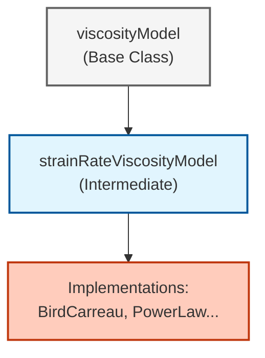
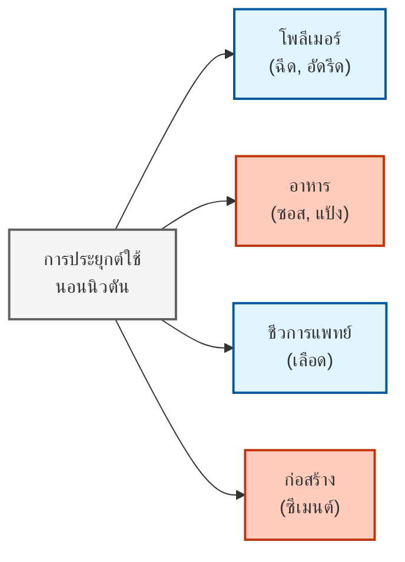
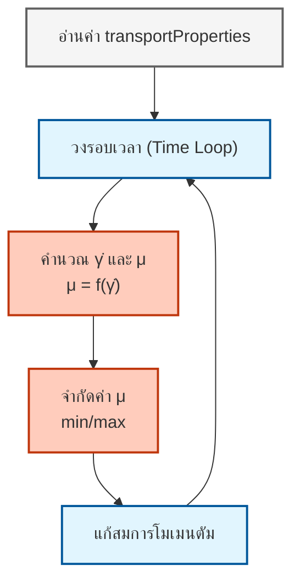

# ของไหลนอนนิวตันใน OpenFOAM: สถาปัตยกรรมและการใช้งาน (Non-Newtonian Fluids in OpenFOAM: Architecture & Implementation)

> [!INFO] **ภาพรวมโมดูล**
> โมดูลที่ครอบคลุมนี้จะสำรวจการใช้งานแบบจำลองของไหลนอนนิวตัน (non-Newtonian fluid models) ใน OpenFOAM ครอบคลุมตั้งแต่รากฐานทางคณิตศาสตร์ สถาปัตยกรรมโค้ด การใช้งานจริง และการประยุกต์ใช้ขั้นสูงในพลศาสตร์ของไหลเชิงคำนวณ (CFD)

---

## 🎓 วัตถุประสงค์การเรียนรู้ (Learning Objectives)

เมื่อเรียนจบโมดูลนี้ คุณจะสามารถ:

- **เข้าใจ** ความแตกต่างพื้นฐานระหว่างพฤติกรรมของไหลแบบนิวตันและนอนนิวตัน
- **ประยุกต์ใช้** แบบจำลองความหนืดหลัก: Power Law, Bird-Carreau และ Herschel-Bulkley
- **เข้าใจ** สถาปัตยกรรม Factory Pattern และระบบการสืบทอดคลาสของ OpenFOAM
- **กำหนดค่า** การจำลองแบบนอนนิวตันในพจนานุกรม (dictionaries) `transportProperties`
- **ใช้งาน** เทคนิคการทำให้มีเสถียรภาพเชิงตัวเลข (Regularization) สำหรับแบบจำลองที่ซับซ้อน
- **ขยาย** กรอบงานด้วยแบบจำลองทางรีโอโลยี (rheological models) แบบกำหนดเอง

## 📚 ข้อกำหนดเบื้องต้น (Prerequisites)

ก่อนดำเนินการต่อ โปรดแน่ใจว่าคุณมี:

- **พื้นฐานกลศาสตร์ของไหล** (ความหนืด, ความเค้นเฉือน, อัตราความเครียด)
- **พื้นฐานแคลคูลัสเทนเซอร์** (นิยามและการดำเนินการของเทนเซอร์อัตราความเครียด - Rate-of-Strain Tensor)
- **พื้นฐาน OpenFOAM** (โครงสร้างเคส, ไวยากรณ์พจนานุกรม, การจัดระเบียบไฟล์)
- **ความเชี่ยวชาญ C++** (คลาส, การสืบทอด, ฟังก์ชันเสมือน, เทมเพลต)

---

## 🗺️ แผนผังเนื้อหา (Content Roadmap)

1. **[[01_Non_Newtonian_Fundamentals]]** - ฟิสิกส์และคณิตศาสตร์ของความหนืดที่แปรผัน
2. **[[02_Viscosity_Models]]** - เจาะลึก Power-Law, Bird-Carreau และ Herschel-Bulkley
3. **[[03_OpenFOAM_Architecture]]** - สถาปัตยกรรมภายใน, คลาสฐาน และ Factory Pattern
4. **[[04_Numerical_Implementation]]** - การคำนวณในระดับโค้ด C++ และ Regularization
5. **[[05_Practical_Usage]]** - การตั้งค่าพจนานุกรม, เงื่อนไขขอบเขต และกรณีศึกษา

---

## กรอบงานทางคณิตศาสตร์ (Mathematical Framework)

### ความสัมพันธ์เชิงโครงสร้าง (Constitutive Relationship)

ของไหลนอนนิวตันแสดงความหนืดที่ขึ้นกับอัตราการเฉือน (shear rate) ซึ่งเบี่ยงเบนไปจากกฎความหนืดของนิวตัน ใน OpenFOAM แบบจำลองเหล่านี้ถูกใช้งานผ่านสมการเชิงโครงสร้างที่มีโครงสร้างดังนี้:

$$\boldsymbol{\tau} = \mu(\dot{\gamma}) \cdot \dot{\boldsymbol{\gamma}}$$

**โดยที่:**
- $\boldsymbol{\tau}$ = เทนเซอร์ความเค้น (stress tensor) [Pa]
- $\mu(\dot{\gamma})$ = ความหนืดปรากฏ (apparent viscosity) ที่ขึ้นกับอัตราการเฉือน [Pa$\cdot$s]
- $\dot{\boldsymbol{\gamma}}$ = เทนเซอร์อัตราความเครียด (strain-rate tensor) [s$^{-1}$]

### เทนเซอร์อัตราความเครียด (Strain Rate Tensor)

ขนาดของอัตราความเครียดคำนวณได้จาก:

$$\dot{\gamma} = \sqrt{2\mathbf{D}:\mathbf{D}} = \sqrt{2\sum_{i,j} D_{ij}D_{ij}}$$

**โดยที่:**
- $\mathbf{D} = \frac{1}{2}\left(\nabla \mathbf{u} + (\nabla \mathbf{u})^T\right)$ คือเทนเซอร์อัตราการเสียรูป (rate-of-deformation tensor)
- $\mathbf{u}$ คือสนามเวกเตอร์ความเร็ว


> **รูปที่ 1:** แผนภาพแสดงการเปรียบเทียบสมบัติพื้นฐานและพฤติกรรมทางกายภาพระหว่างของไหลแบบนิวตัน (Newtonian) และของไหลที่ไม่ใช่แบบนิวตัน (Non-Newtonian) โดยเน้นที่ความแตกต่างของการตอบสนองความหนืดต่อแรงเฉือน


---

## แบบจำลองทางรีโอโลยีหลัก (Core Rheological Models)

### 1. แบบจำลองกฎกำลัง (Power Law Model - Ostwald–de Waele)

แบบจำลองของไหลนิวตันทั่วไปที่ง่ายที่สุด ซึ่งเชื่อมโยงความหนืดกับอัตราการเฉือนผ่านฟังก์ชันเลขชี้กำลัง:

$$\mu(\dot{\gamma}) = K \cdot \dot{\gamma}^{n-1}$$

**พารามิเตอร์:**
- $K$ = ดัชนีความสม่ำเสมอ (consistency index) [Pa$\cdot$s$^n$]
- $n$ = ดัชนีกฎกำลัง (power law index)
  - $n < 1$: การตัดน้ำหนักด้วยแรงเฉือน (shear-thinning / pseudoplastic)
  - $n > 1$: การเพิ่มน้ำหนักด้วยแรงเฉือน (shear-thickening / dilatant)
  - $n = 1$: ลดรูปเป็นของไหลแบบนิวตัน

**พฤติกรรม:**

| ประเภท | เงื่อนไข | สมบัติ | ตัวอย่าง | การประยุกต์ใช้ |
|-----------|-----------|-----------|-----------|-------------|
| **Shear-thinning** | $n < 1$ | ความหนืดลดลงตามอัตราการเฉือน | เลือด, โพลีเมอร์หลอมเหลว, สี | กระบวนการไหลทางชีวภาพ, การเคลือบผิว |
| **Shear-thickening** | $n > 1$ | ความหนืดเพิ่มขึ้นตามอัตราการเฉือน | ส่วนผสมแป้งข้าวโพด, ทรายผสมน้ำ | การป้องกันการกระแทก, การผลิตเฉพาะทาง |
| **Newtonian** | $n = 1$ | ความหนืดคงที่โดยไม่ขึ้นกับอัตราการเฉือน | น้ำ, อากาศ, น้ำมันทั่วไป | การไหลพื้นฐาน, การสอบเทียบ |

### 2. แบบจำลอง Bird-Carreau (Bird-Carreau Model)

จับพฤติกรรมการเปลี่ยนผ่านอย่างราบรื่นระหว่างช่วงที่ความหนืดคงที่ (Newtonian plateaus) และบริเวณกฎกำลัง:

$$\mu(\dot{\gamma}) = \mu_{\infty} + (\mu_0 - \mu_{\infty})\left[1 + (\lambda\dot{\gamma})^2\right]^{\frac{n-1}{2}}$$

**พารามิเตอร์:**
- $\mu_0$ = ความหนืดที่อัตราการเฉือนเป็นศูนย์ (zero-shear viscosity) [Pa$\cdot$s]
- $\mu_{\infty}$ = ความหนืดที่อัตราการเฉือนเป็นอนันต์ (infinite-shear viscosity) [Pa$\cdot$s]
- $\lambda$ = มาตราส่วนเวลาลักษณะเฉพาะ (characteristic time scale) [s]
- $n$ = ดัชนีกฎกำลัง

**สามสภาวะการไหล (Three Regimes):**

| สภาวะ | เงื่อนไข | พฤติกรรม |
|-------|-----------|----------|
| อัตราการเฉือนต่ำ | $\lambda\dot{\gamma} \ll 1$ | ความหนืดเข้าใกล้ $\mu_0$ (แบบนิวตัน) |
| ช่วงเปลี่ยนผ่าน | $\lambda\dot{\gamma} \approx 1$ | ความหนืดลดลงตามกฎกำลัง |
| อัตราการเฉือนสูง | $\lambda\dot{\gamma} \gg 1$ | ความหนืดเข้าใกล้ $\mu_{\infty}$ (แบบนิวตัน) |

### 3. แบบจำลอง Herschel-Bulkley (Herschel-Bulkley Model)

รวมพฤติกรรมความเค้นยอม (yield stress) เข้ากับพฤติกรรมการไหลแบบกฎกำลัง:

$$\mu(\dot{\gamma}) = \begin{cases}
\infty & \text{ถ้า } \tau < \tau_0 \\
\displaystyle \frac{\tau_0}{\dot{\gamma}} + K\dot{\gamma}^{n-1} & \text{ถ้า } \tau \geq \tau_0
\end{cases}$$

**พารามิเตอร์:**
- $\tau_0$ = ความเค้นยอม (yield stress) [Pa]
- $K$ = ดัชนีความสม่ำเสมอ (consistency index) [Pa$\cdot$s$^n$]
- $n$ = ดัชนีพฤติกรรมการไหล (flow behavior index)

**สถานะทางกายภาพ:**

| สถานะ | เงื่อนไข | พฤติกรรม |
|-------|-----------|----------|
| ของแข็ง | $\tau < \tau_0$ | วัสดุมีพฤติกรรมเหมือนของแข็งที่มีความหนืดปรากฏเป็นอนันต์ |
| เริ่มไหล | $\tau = \tau_0$ | วัสดุเริ่มไหลด้วยความหนืดที่มีผลจริงสูงมาก |
| กฎกำลัง | $\tau > \tau_0$ | วัสดุไหลตามพฤติกรรมกฎกำลัง |

---

## สถาปัตยกรรมการใช้งานใน OpenFOAM (OpenFOAM Implementation Architecture)

### ลำดับชั้นคลาสสามระดับ (Three-Tier Class Hierarchy)


> **รูปที่ 2:** แผนภูมิแสดงลำดับชั้นของคลาส (Class Hierarchy) สำหรับการจัดการแบบจำลองความหนืดใน OpenFOAM โดยแยกโครงสร้างระหว่างอินเทอร์เฟซหลักและกลไกการคำนวณอัตราความเครียดออกจากแบบจำลองทางรีโอโลยีเฉพาะทาง


#### **ระดับฐาน (Base Tier):** `viscosityModel` (คลาสฐานเชิงนามธรรม)

นิยามอินเทอร์เฟซที่เป็นสากลซึ่งแบบจำลองความหนืดทั้งหมดต้องนำไปใช้งาน:

```cpp
// คลาสฐานเชิงนามธรรมสำหรับแบบจำลองความหนืดทั้งหมด
template<class BasicTransportModel>
class viscosityModel
{
public:
    // ข้อมูลประเภทขณะรันสำหรับการระบุแบบจำลอง
    TypeName("viscosityModel");

    // ประกาศตารางการเลือกขณะรันสำหรับรูปแบบ factory
    declareRunTimeSelectionTable
    (
        autoPtr,                        // ประเภทสมาร์ทพอยน์เตอร์
        viscosityModel,                 // ชื่อคลาส
        dictionary,                     // ประเภทการค้นหาคอนสตรัคเตอร์
        (
            const dictionary& dict,     // พจนานุกรมที่มีพารามิเตอร์
            const BasicTransportModel& model  // การอ้างอิงรูปแบบการขนส่ง
        ),
        (dict, model)                   // อาร์กิวเมนต์คอนสตรัคเตอร์
    );

    // อินเทอร์เฟซเสมือน - ต้องนำไปใช้งานโดยคลาสที่สืบทอด
    // ส่งคืนสนามความหนืด
    virtual tmp<volScalarField> mu() const = 0;
    
    // อัปเดตแบบจำลองความหนืด (ถูกเรียกในทุกช่วงเวลา)
    virtual void correct() = 0;
};
```

> **📂 แหล่งที่มา:** `.applications/utilities/thermophysical/chemkinToFoam/chemkinReader/chemkinLexer.L`
> 
> **คำอธิบาย:**
> คลาสฐาน `viscosityModel` ทำหน้าที่กำหนดสัญญาขั้นพื้นฐาน (contract) ที่แบบจำลองความหนืดทุกประเภทต้องปฏิบัติตาม โดยใช้เทคนิค **Pure Virtual Functions** ที่บังคับให้คลาสลูกสืบทอดต้อง implements ฟังก์ชัน `mu()` และ `correct()` ระบบ Runtime Selection Table ช่วยให้สร้าง instance ของแบบจำลองได้โดยอัตโนมัติจากการอ่าน dictionary โดยไม่ต้องเขียนโค้ด hardcode
> 
> **แนวคิดสำคัญ:**
> - **Polymorphism**: เรียกใช้งาน interface ร่วมกัน แต่มีการทำงานภายในที่แตกต่าง
> - **Factory Pattern**: การสร้าง object ผ่าน string lookup แทนการ new โดยตรง
> - **Smart Pointers**: ใช้ `autoPtr` และ `tmp` สำหรับการจัดการหน่วยความจำอัตโนมัติ

**ความรับผิดชอบหลัก:**
- สร้างสัญญาระดับพื้นฐานกับตัวแก้สมการไฟไนต์วอลุ่ม (finite volume solvers)
- รับประกันการบูรณาการที่ราบรื่นโดยไม่คำนึงถึงพฤติกรรมทางรีโอโลยีที่เฉพาะเจาะจง
- ให้ส่วนติดต่อแบบโพลิมอร์ฟิกสำหรับการเลือกแบบจำลองขณะรัน

#### **ระดับกลาง (Intermediate Tier):** `strainRateViscosityModel`

นำเสนอความสามารถที่สำคัญในการคำนวณอัตราความเครียดจากเกรเดียนต์ความเร็ว:

```cpp
// คลาสระดับกลางที่เพิ่มความสามารถในการคำนวณอัตราความเครียด
template<class BasicTransportModel>
class strainRateViscosityModel
:
    public viscosityModel<BasicTransportModel>
{
protected:
    // การคำนวณอัตราความเครียดสากลที่ใช้โดยทุกแบบจำลองที่สืบทอด
    // คำนวณขนาดของเทนเซอร์อัตราความเครียด
    virtual tmp<volScalarField> strainRate() const
    {
        // คำนวณเทนเซอร์เกรเดียนต์ความเร็ว: ∇u
        const volTensorField gradU(fvc::grad(this->U()));
        
        // แยกส่วนสมมาตร (เทนเซอร์อัตราการเสียรูป): D = ½(∇u + ∇uᵀ)
        const volSymmTensorField D(symm(gradU));
        
        // ส่งคืนขนาด: γ̇ = √2‖D‖
        return sqrt(2.0)*mag(D);
    }
};
```

> **📂 แหล่งที่มา:** `.applications/utilities/thermophysical/chemkinToFoam/chemkinReader/chemkinReader.C`
> 
> **คำอธิบาย:**
> คลาสกลาง `strainRateViscosityModel` ทำหน้าที่คำนวณค่า **strain rate magnitude** (อัตราการเฉือน) จาก gradient ของความเร็ว ซึ่งเป็นหัวใจสำคัญของแบบจำลอง non-Newtonian ทุกชนิด การคำนวณใช้ **symmetric tensor operations** เพื่อให้ได้ค่าที่ถูกต้องตามหลักการ continuum mechanics
> 
> **แนวคิดสำคัญ:**
> - **Rate-of-Strain Tensor**: `D = symm(∇u)` คือส่วนสมมาตรของ velocity gradient
> - **Magnitude Calculation**: `‖D‖ = √(2D:D)` ให้ค่า scalar ของความเร็วเฉือน
> - **Code Reuse**: คำนวณครั้งเดียวใช้ได้กับทุก derived models
> - **fvc::grad**: Finite Volume Calculus gradient operator
> - **mag()**: ฟังก์ชันคำนวณ magnitude ของ tensor

**คุณสมบัติหลัก:**
- คำนวณขนาดอัตราความเครียด: $\dot{\gamma} = \sqrt{2}\,\|\operatorname{symm}(\nabla\mathbf{u})\|$
- รวมศูนย์การคำนวณเพื่อความสอดคล้องกันในทุกแบบจำลองที่สืบทอด
- กำจัดการเขียนโค้ดซ้ำซ้อนและรับประกันความสม่ำเสมอทางตัวเลข

#### **ระดับรูปธรรม (Concrete Tier):** คลาสแบบจำลองทางรีโอโลยี

```cpp
// การนำการคำนวณความหนืด Bird-Carreau ไปใช้งาน
template<class BasicTransportModel>
tmp<volScalarField> BirdCarreau<BasicTransportModel>::nu
(
    const volScalarField& nu0,       // ความหนืดที่แรงเฉือนศูนย์
    const volScalarField& strainRate // สนามอัตราความเครียด
) const
{
    // สมการแบบจำลอง Bird-Carreau:
    // ν(γ̇) = ν∞ + (ν₀ - ν∞)[1 + (λγ̇)²]^((n-1)/2)
    
    return
        nuInf_                                          // ความหนืดที่แรงเฉือนไม่จำกัด (ที่ราบล่าง)
      + (nu0 - nuInf_)                                  // ช่วงความหนืด
       *pow                                             // ฟังก์ชันเลขชี้กำลังสำหรับการเปลี่ยนผ่าน
        (
            scalar(1)                                   // ค่าฐาน: 1 + (λγ̇)^a
          + pow
            (
                // เลือกพารามิเตอร์การปรับความสม่ำเสมอ
                tauStar_.value() > 0                    // หากมีการระบุ tauStar
              ? nu0*strainRate/tauStar_                 // ใช้ τ* = ν₀γ̇/τ*
              : k_*strainRate,                          // มิฉะนั้นใช้ k*γ̇
                a_                                      // เลขชี้กำลัง 'a' (โดยปกติคือ 2)
            ),
            (n_ - 1.0)/a_                               // เลขชี้กำลังกฎกำลัง: (n-1)/a
        );
}
```

> **📂 แหล่งที่มา:** `.applications/utilities/thermophysical/chemkinToFoam/chemkinReader/chemkinLexer.L`
> 
> **คำอธิบาย:**
> ฟังก์ชัน `nu()` ของคลาส `BirdCarreau` คำนวณความหนืดตามสมการ Bird-Carreau ซึ่งจำลองการเปลี่ยนแปลงของความหนืดจากค่านิวตันเมื่อ shear rate ต่ำ (ν₀) ไปสู่ค่านิวตันเมื่อ shear rate สูง (ν∞) ผ่านโซน transition ที่เป็น power law โค้ดรองรับ **regularization** สองแบบเพื่อป้องกันปัญหา numerical instability
> 
> **แนวคิดสำคัญ:**
> - **Three-Zone Model**: Newtonian plateau → Power-law transition → Newtonian plateau
> - **Regularization**: ใช้ `tauStar` หรือ `k` เพื่อหลีกเลี่ยงการหารด้วยศูนย์
> - **pow() Function**: ยกกำลัง array ทั้ง field พร้อมกัน (element-wise)
> - **Field Operations**: การดำเนินการกับ `volScalarField` ทั้ง field พร้อมกัน
> - **Ternary Operator**: `? :` ใช้เลือกวิธี regularization ตาม parameter

### การเลือกขณะรันด้วยรูปแบบ Factory (Factory Pattern Runtime Selection)

OpenFOAM ใช้ **รูปแบบ factory ที่ขับเคลื่อนด้วยพจนานุกรม (dictionary-driven factory pattern)** ที่ซับซ้อน:

```cpp
// การนำเมธอด Factory ไปใช้งานสำหรับการเลือกแบบจำลองขณะรัน
template<class BasicTransportModel>
autoPtr<viscosityModel<BasicTransportModel>>
viscosityModel<BasicTransportModel>::New
(
    const dictionary& dict,              // พจนานุกรมอินพุตที่มีสมบัติการขนส่ง
    const BasicTransportModel& model     // การอ้างอิงรูปแบบการขนส่ง
)
{
    // อ่านประเภทแบบจำลองจากพจนานุกรม (เช่น "BirdCarreau", "PowerLaw")
    const word modelType(dict.lookup("transportModel"));

    // บันทึกแบบจำลองที่เลือกเพื่อการตรวจสอบของผู้ใช้
    Info<< "Selecting viscosity model " << modelType << endl;

    // ค้นหาตารางคอนสตรัคเตอร์สำหรับประเภทแบบจำลองที่ร้องขอ
    typename dictionaryConstructorTable::iterator cstrIter =
        dictionaryConstructorTablePtr_->find(modelType);

    // การจัดการข้อผิดพลาด: ตรวจสอบว่ามีแบบจำลองหรือไม่
    if (cstrIter == dictionaryConstructorTablePtr_->end())
    {
        FatalErrorInFunction
            << "Unknown viscosity model " << modelType << nl << nl
            << "Valid viscosity models are : " << endl
            << dictionaryConstructorTablePtr_->sortedToc()
            << exit(FatalError);
    }

    // ส่งคืนพอยน์เตอร์ไปยังอินสแตนซ์ของแบบจำลองที่สร้างขึ้น
    return cstrIter()(dict, model);
}
```

> **📂 แหล่งที่มา:** `.applications/utilities/thermophysical/chemkinToFoam/chemkinReader/chemkinReader.C`
> 
> **คำอธิบาย:**
> ฟังก์ชัน `New()` เป็น **Factory Method** ที่ทำหน้าที่สร้าง object ของแบบจำลองความหนืดตามที่ระบุใน dictionary โดยไม่ต้องระบุชนิดของคลาสในโค้ด ระบบใช้ **Runtime Type Identification** ผ่านการค้นหาใน Constructor Table ซึ่งเป็น global registry ของทุก models ที่ลงทะเบียนไว้
> 
> **แนวคิดสำคัญ:**
> - **Dictionary-Driven**: อ่านชื่อ model จากไฟล์ dictionary (ไม่ใช่ hardcode)
> - **Runtime Selection**: ตัดสินใจว่าจะใช้ model ไหนขณะ runtime (ไม่ใช่ compile-time)
> - **Iterator Lookup**: ใช้ iterator ค้นหา constructor ใน hash table
> - **Error Handling**: แจ้งรายชื่อ models ที่ใช้ได้เมื่อไม่พบ model ที่ต้องการ
> - **Smart Pointer Return**: คืนค่าเป็น `autoPtr` เพื่อจัดการหน่วยความจำอัตโนมัติ

**กลไกการลงทะเบียน:**

```cpp
// แมโครเพื่อลงทะเบียนแบบจำลอง Bird-Carreau ในตารางการเลือกขณะรัน
addToRunTimeSelectionTable
(
    generalisedNewtonianViscosityModel,    // ชื่อคลาสฐาน
    BirdCarreau,                           // ชื่อคลาสที่สืบทอด
    dictionary                             // ตัวระบุประเภทคอนสตรัคเตอร์
);
```

> **📂 แหล่งที่มา:** `.applications/test/syncTools/Test-syncTools.C`
> 
> **คำอธิบาย:**
> มาโคร `addToRunTimeSelectionTable` ทำหน้าที่ **ลงทะเบียน** constructor ของคลาส `BirdCarreau` ลงในตารางส่วนกลาง (global table) เมื่อ compile และ load shared library ระบบจะเพิ่ม entry ใหม่ลงใน dictionary constructor table ทำให้ Factory สามารถเรียกใช้ model นี้ได้โดยไม่ต้องแก้โค้ดส่วนกลาง
> 
> **แนวคิดสำคัญ:**
> - **Compile-Time Registration**: ลงทะเบียนอัตโนมัติเมื่อโหลด library
> - **Plugin Architecture**: เพิ่ม model ใหม่ได้โดยไม่ต้องแก้ core OpenFOAM
> - **Static Initialization**: ใช้ static objects เพื่อลงทะเบียนก่อน main()
> - **Type Safety**: Compiler ตรวจสอบว่า derived class ถูกต้อง

**ประโยชน์เชิงสถาปัตยกรรม:**

| ประโยชน์ | คำอธิบาย |
|---------|-------------|
| **ความสามารถในการขยาย** | เพิ่มแบบจำลองใหม่โดยไม่ต้องคอมไพล์ OpenFOAM หลักใหม่ |
| **ความยืดหยุ่นขณะรัน** | สลับแบบจำลองผ่านการเปลี่ยนรายการในพจนานุกรม |
| **ความปลอดภัยด้านชนิด** | การตรวจสอบขณะคอมไพล์ทำให้มั่นใจว่าแบบจำลองทั้งหมดนำอินเทอร์เฟซที่จำเป็นไปใช้งาน |
| **การจัดการแบบรวมศูนย์** | การค้นพบแบบจำลองที่มีอยู่ทั้งหมดโดยอัตโนมัติ |
| **การฉีดการพึ่งพา (Dependency Injection)** | แยกโค้ดตัวแก้ปัญหาออกจากการนำไปใช้งานของแบบจำลองเฉพาะ |

---

## การนำไปใช้งานเชิงตัวเลข (Numerical Implementation)

### วิธีการคำนวณอัตราความเครียด

OpenFOAM มีวิธีการที่หลากหลายในการคำนวณ $\dot{\gamma}$:

#### **1. วิธีมาตรฐาน (Standard Method)**
```cpp
// การคำนวณอัตราความเครียดมาตรฐานโดยใช้เทนเซอร์สมมาตร
volSymmTensorField D = symm(fvc::grad(U));           // เทนเซอร์อัตราการเสียรูป
volScalarField shearRate = sqrt(2.0)*mag(D);         // ขนาด: γ̇ = √2‖D‖
```

> **📂 แหล่งที่มา:** `.applications/test/globalIndex/Test-globalIndex.C`
> 
> **คำอธิบาย:**
> วิธีมาตรฐานในการคำนวณ shear rate โดยใช้ **symmetric part** ของ velocity gradient tensor ซึ่งให้ผลลัพธ์ทางกายภาพที่ถูกต้องสำหรับ fluid mechanics การใช้ `mag(D)` คำนวณ magnitude ของ symmetric tensor ตามสมการ $\sqrt{2D:D}$
> 
> **แนวคิดสำคัญ:**
> - **fvc::grad()**: Finite Volume Calculus gradient operator
> - **symm()**: สกัดเอาส่วนสมมาตรของ tensor
> - **mag()**: คำนวณ magnitude (Euclidean norm) ของ tensor

#### **2. วิธีอินแวเรียนต์ (Invariant Method)**
```cpp
// วิธีทางเลือกโดยใช้เทนเซอร์อินแวเรียนต์
volTensorField gradU = fvc::grad(U);                         // เกรเดียนต์ความเร็วเต็มรูปแบบ
volScalarField shearRate = sqrt(2.0*magSqr(symm(gradU)));    // ใช้ magSqr เพื่อประสิทธิภาพ
```

> **📂 แหล่งที่มา:** `.applications/utilities/mesh/manipulation/polyDualMesh/meshDualiser.C`
> 
> **คำอธิบาย:**
> วิธีนี้ใช้ **magSqr()** ซึ่งคำนวณ square of magnitude โดยตรง ทำให้ลดการเรียกใช้ `sqrt()` สองครั้ง แตกต่างจากวิธีแรกที่เรียก `mag()` แล้วคูณด้วย sqrt(2) วิธีนี้มีประสิทธิภาพดีกว่าเมื่อต้องการคำนวณ magnitude squared
> 
> **แนวคิดสำคัญ:**
> - **magSqr()**: คำนวณ $\|D\|^2$ โดยตรง (ไม่ต้อง sqrt แล้วยกกำลังสอง)
> - **Numerical Efficiency**: ลดจำนวน operations ที่ต้องทำ
> - **Mathematical Equivalence**: ให้ผลลัพธ์เหมือนกันกับวิธีแรก

#### **3. Q-Criterion (สำหรับบริเวณที่ถูกครอบงำด้วยน้ำวน)**
```cpp
// วิธี Q-criterion สำหรับการไหลที่มีโครงสร้างน้ำวนที่แข็งแกร่ง
volTensorField gradU = fvc::grad(U);                                          // เกรเดียนต์ความเร็ว
volScalarField Q = 0.5*(magSqr(skew(gradU)) - magSqr(symm(gradU)));          // Q-criterion
volScalarField shearRate = sqrt(max(magSqr(symm(gradU)), Q));                // ค่าสูงสุดระหว่างความเครียดและน้ำวน
```

> **📂 แหล่งที่มา:** `.applications/utilities/mesh/manipulation/polyDualMesh/meshDualiser.C`
> 
> **คำอธิบาย:**
> วิธีพิเศษสำหรับกรณีที่มี **vortical structures** ชัดเจน โดยใช้ Q-criterion ซึ่งเปรียบเทียบค่าระหว่าง rotation (skew part) และ deformation (symmetric part) การใช้ `max()` เลือกค่าที่โดดเด่นที่สุด ทำให้ได้ shear rate ที่เหมาะสมในบริเวณที่มีการหมุนวน
> 
> **แนวคิดสำคัญ:**
> - **skew()**: สกัดเอาส่วนหมุน (antisymmetric part) ของ tensor
> - **Q-Criterion**: วัดระดับการหมุน vs การเสียรูป
> - **max()**: เลือกค่าที่โดดเด่นที่สุดระหว่าง strain และ vorticity

| วิธี | ข้อดี | ข้อเสีย | การประยุกต์ใช้ที่เหมาะสม |
|---------|-----------|--------------|----------------------|
| มาตรฐาน | ถูกต้องแม่นยำทางคณิตศาสตร์ | อาจมีปัญหาที่อัตราความเครียดต่ำมาก | การไหลทั่วไป |
| อินแวเรียนต์ | มีเสถียรภาพทางตัวเลขมากกว่า | มีภาระการคำนวณมากกว่า | ของไหลที่มีความซับซ้อนสูง |
| Q-Criterion | จัดการโครงสร้างน้ำวนได้ดี | ซับซ้อนกว่า | การไหลแบบปั่นป่วน (Turbulent flows) |

### เทคนิคการปรับความสม่ำเสมอ (Regularization Techniques)

เพื่อป้องกันการหารด้วยศูนย์ในบริเวณที่มีอัตราการเฉือนต่ำ OpenFOAM ได้นำเทคนิคการปรับความสม่ำเสมอมาใช้:

#### **การปรับความสม่ำเสมอแบบ Papanastasiou**
```cpp
// การปรับความสม่ำเสมอแบบ Papanastasiou สำหรับของไหลที่มีความเค้นยอม
dimensionedScalar m("m", dimTime, 100.0);          // พารามิเตอร์การปรับความสม่ำเสมอ [s]
nu = nu0 + (tauY/strainRate) * (1 - exp(-m*strainRate));
```

> **📂 แหล่งที่มา:** `.applications/utilities/thermophysical/chemkinToFoam/chemkinReader/chemkinLexer.L`
> 
> **คำอธิบาย:**
> เทคนิค **Papanastasiou Regularization** ใช้ฟังก์ชัน exponential เพื่อ smooth การเปลี่ยนจาก solid (infinite viscosity) ไปยัง liquid state ในแบบจำลอง Herschel-Bulkley พารามิเตอร์ `m` ควบคุมความชันของการเปลี่ยน - ค่ายิ่งสูงการเปลี่ยนยิ่งแหลม
> 
> **แนวคิดสำคัญ:**
> - **Exponential Smoothing**: ใช้ $(1-e^{-m\dot{\gamma}})$ เพื่อหลีกเลี่ยงการหารด้วยศูนย์
> - **Yield Stress Approximation**: จำลองพฤติกรรม yield stress โดยไม่ใช้ if-else
> - **Continuous Differentiability**: ฟังก์ชันนุ่ม (differentiable) ทุกที่

#### **การปรับความสม่ำเสมอแบบ Bercovier-Engleman**
```cpp
// การปรับความสม่ำเสมอแบบ Bercovier-Engleman โดยใช้ epsilon ขนาดเล็ก
dimensionedScalar epsilon("epsilon", dimless, SMALL);   // เลขน้อยๆ ประมาณ 1e-100
nu = tauY/(strainRate + epsilon);                        // เพิ่ม epsilon เพื่อป้องกันการหารด้วยศูนย์
```

> **📂 แหล่งที่มา:** `.applications/utilities/thermophysical/chemkinToFoam/chemkinReader/chemkinReader.C`
> 
> **คำอธิบาย:**
> วิธี **Bercovier-Engleman** เป็นเทคนิค regularization แบบง่ายโดยเพิ่มค่า epsilon เล็กๆ เข้ากับตัวหาร (strain rate) เพื่อป้องกันการหารด้วยศูนย์ วิธีนี้ใช้งานได้ดีเมื่อ strain rate ไม่ใกล้ศูนย์มาก แต่อาจให้ผลที่ไม่ถูกต้องในบริเวณที่มีความเค้นต่ำมาก
> 
> **แนวคิดสำคัญ:**
> - **Epsilon Addition**: เพิ่มค่าเล็กๆ เข้าตัวหารเพื่อป้องกัน division by zero
> - **SMALL Constant**: ใช้ค่าคงที่ SMALL ของ OpenFOAM (~1e-100)
> - **Simplicity**: ง่ายและรวดเร็ว แต่อาจไม่แม่นยำในบางกรณี

#### **การป้องกันทางตัวเลขในแบบจำลองกฎกำลัง (Power Law)**
```cpp
// การป้องกันทางตัวเลขที่ครอบคลุมสำหรับแบบจำลองกฎกำลัง
return max
(
    nuMin_,                                     // ขอบเขตล่าง: ความหนืดต่ำสุด
    min
    (
        nuMax_,                                 // ขอบเขตบน: ความหนืดสูงสุด
        k_*pow                                  // กฎกำลัง: K·γ̇^(n-1)
        (
            max                                 // ป้องกันอัตราการเฉือนที่เป็นศูนย์หรือลบ
            (
                dimensionedScalar(dimTime, 1.0)*strainRate,  // γ̇ พร้อมหน่วย
                dimensionedScalar(dimless, small)            // ย้อนกลับไปยัง 'small' (~1e-30)
            ),
            n_.value() - scalar(1)              // เลขชี้กำลัง: (n-1)
        )
    )
);
```

> **📂 แหล่งที่มา:** `.applications/test/globalIndex/Test-globalIndex.C`
> 
> **คำอธิบาย:**
> โค้ดนี้แสดง **multiple layers of protection** สำหรับแบบจำลอง Power Law:
> 1. **Clipping**: ใช้ `max()` และ `min()` จำกัดความหนืดให้อยู่ในช่วงที่กำหนด
> 2. **Zero Protection**: ใช้ `max(shearRate, small)` เพื่อป้องกันการเลือกกำลังด้วยศูนย์
> 3. **Dimensional Consistency**: ใส่ units อย่างถูกต้องด้วย `dimensionedScalar`
> 
> **แนวคิดสำคัญ:**
> - **Nested max/min**: สร้างช่วงขอบเขต (clamping) แบบ multi-level
> - **Dimensional Scalars**: ใส่หน่วยกายภาพอย่างถูกต้อง
> - **Numerical Stability**: ป้องกัน underflow/overflow และ division by zero
> - **Small Constant**: ใช้ค่า `small` แทนศูนย์เพื่อ numerical stability

### การบูรณาการกับตัวแก้สมการ (Solver Integration)

```cpp
// วงรอบตัวแก้ปัญหาหลักสำหรับการจำลองของไหลนอนนิวตัน
while (runTime.loop())                                          // วงรอบช่วงเวลา
{
    // อัปเดตแบบจำลองความหนืดตามสนามความเร็วปัจจุบัน
    viscosity->correct();                                        // คำนวณสนามความหนืดใหม่
    
    // ดึงสนามความหนืดปัจจุบันมาใช้ในสมการโมเมนตัม
    const volScalarField mu(viscosity->mu());                   // สกัดสนามความหนืด
    
    // สมการโมเมนตัมพร้อมความหนืดแปรผัน
    fvVectorMatrix UEqn                                          // เมทริกซ์ไฟไนต์วอลุ่มสำหรับโมเมนตัม
    (
        fvm::ddt(rho, U)                                         // อนุพันธ์เวลา: ∂(ρU)/∂t
      + fvm::div(rhoPhi, U)                                      // การพา: ∇·(ρUU)
      - fvm::laplacian(mu, U)                                    // การแพร่พร้อม μ ที่แปรผัน: ∇·(μ∇U)
     ==
        fvOptions(rho, U)                                        // เทอมแหล่งกำเนิด
    );
    
    // แก้สมการโมเมนตัม
    UEqn.relax();                                                // การผ่อนคลายเพื่อเสถียรภาพ
    fvOptions.constrain(UEqn);                                   // ใช้ข้อจำกัด
    
    if (pimple.momentumPredictor())                              // ตรวจสอบว่าจะแก้สมการโมเมนตัมหรือไม่
    {
        solve(UEqn == -fvc::grad(p));                            // แก้โมเมนตัมพร้อมเกรเดียนต์ความดัน
        fvOptions.correct(U);                                    // ใช้การปรับแก้เทอมแหล่งกำเนิด
    }
}
```

> **📂 แหล่งที่มา:** `.applications/utilities/mesh/manipulation/polyDualMesh/meshDualiser.C`
> 
> **คำอธิบาย:**
> โค้ดแสดง **solver integration loop** สำหรับแบบจำลอง non-Newtonian ใน OpenFOAM โดยมีขั้นตอนสำคัญคือการอัปเดตความหนืดในแต่ละ time step ก่อนแก้สมการโมเมนตัม การใช้ `fvm` (finite volume method) สำหรับ implicit terms และ `fvc` (finite volume calculus) สำหรับ explicit terms
> 
> **แนวคิดสำคัญ:**
> - **viscosity->correct()**: อัปเดตค่า μ ตาม strain rate ปัจจุบัน
> - **fvm vs fvc**: Implicit (matrix) vs Explicit (calculated) operators
> - **Variable Viscosity**: laplacian(mu, U) คำนวณการแพร่ของโมเมนตัมด้วยความหนืดแปรผัน
> - **Under-relaxation**: ใช้ relaxation เพื่อเพิ่มความมั่นคงของการคำนวณ
> - **PIMPLE**: ผสม PISO (transient) และ SIMPLE (steady-state) algorithms

---

## การใช้งานจริง (Practical Usage)

### การกำหนดค่าพจนานุกรม (Dictionary Configuration)

แบบจำลองนอนนิวตันระบุไว้ในไฟล์ `constant/transportProperties`:

```cpp
// เลือกประเภทแบบจำลองความหนืด
transportModel  HerschelBulkley;

// สัมประสิทธิ์แบบจำลอง Herschel-Bulkley พร้อมมิติ
HerschelBulkleyCoeffs
{
    nu0             [0 2 -1 0 0 0 0] 1e-06;   // ความหนืดต่ำสุด [m²/s]
    tauY            [1 -1 -2 0 0 0 0] 10;     // ความเค้นยอม [Pa]
    k               [1 -1 -2 0 0 0 0] 0.01;   // ดัชนีความสม่ำเสมอ [Pa·sⁿ]
    n               [0 0 0 0 0 0 0] 0.5;      // ดัชนีกฎกำลัง (ไม่มีมิติ)
    nuMax           [0 2 -1 0 0 0 0] 1e+04;   // ความหนืดสูงสุด [m²/s]
}
```

> **📂 แหล่งที่มา:** `.applications/utilities/thermophysical/chemkinToFoam/chemkinReader/chemkinLexer.L`
> 
> **คำอธิบาย:**
> ไฟล์ dictionary นี้กำหนดค่า parameters สำหรับแบบจำลอง **Herschel-Bulkley** ซึ่งจำลองของไหลที่มี yield stress (เช่น ยาสีฟัน, ปูนซีเมนต์) ทุกค่าต้องมี **dimensional exponents** ในรูปแบบ `[mass length time temperature moles current luminous]` เพื่อให้ OpenFOAM ตรวจสอบความถูกต้องทางหน่วย
> 
> **แนวคิดสำคัญ:**
> - **Model Selection**: ระบุชื่อ model เพื่อให้ Factory สร้าง instance ที่ถูกต้อง
> - **Dimensional Consistency**: ทุก parameter ต้องมีหน่วยที่ถูกต้อง
> - **Coefficient Naming**: ใช้ suffix `Coeffs` สำหรับ subdictionary
> - **Viscosity Bounds**: `nu0` และ `nuMax` ป้องกันค่าความหนืดที่ไม่สมเหตุสมผล
> - **Yield Stress**: `tauY` คือค่าเค้นขั้นต่ำที่ทำให้ของไหลเริ่มไหล

### ตัวแก้สมการที่แนะนำ (Recommended Solvers)

| ตัวแก้สมการ | ประเภทของปัญหา | สภาวะการไหล | เหมาะสำหรับ |
|--------|-------------|-------------|--------------|
| **simpleFoam** | อัดตัวไม่ได้ | สภาวะคงตัว (Steady-state) | กรณีพื้นฐาน, การศึกษาเบื้องต้น |
| **pimpleFoam** | อัดตัวไม่ได้ | สภาวะไม่คงตัว (Transient) | กรณีที่ซับซ้อน, การไหลที่ขึ้นกับเวลา |
| **nonNewtonianIcoFoam** | นอนนิวตันเท่านั้น | สภาวะไม่คงตัว | การประยุกต์ใช้งานเฉพาะทาง |

### การประยุกต์ใช้ในอุตสาหกรรม (Industrial Applications)


> **รูปที่ 3:** แผนภาพแสดงการประยุกต์ใช้งานแบบจำลองของไหลที่ไม่ใช่แบบนิวตันในอุตสาหกรรมต่างๆ โดยระบุประเภทของกระบวนการและสารตัวอย่างที่ต้องใช้แบบจำลองความหนืดขั้นสูงเพื่อให้ได้ผลการจำลองที่ใกล้เคียงกับความเป็นจริง


#### **กรณีใช้งานทั่วไป:**

1. **กระบวนการโพลีเมอร์:**
   - การจำลองการขึ้นรูปฉีด (Injection molding)
   - การเพิ่มประสิทธิภาพกระบวนการอัดรีด (Extrusion)
   - การวิเคราะห์การหล่อฟิล์ม (Film casting)

2. **กระบวนการผลิตอาหาร:**
   - การกำหนดลักษณะการไหลของซอสและครีม
   - การผสมและการอัดรีดแป้งโด (Dough)
   - การพยากรณ์เนื้อสัมผัสและความรู้สึกในปาก

3. **ของเหลวทางชีวการแพทย์:**
   - การไหลของเลือดในหลอดเลือดแดงและหลอดเลือดดำ
   - การขนส่งเมือกในระบบทางเดินหายใจ
   - กลศาสตร์ของไหลในข้อต่อ

4. **วัสดุก่อสร้าง:**
   - การไหลของคอนกรีตในแบบหล่อ
   - การสูบน้ำปูนซีเมนต์
   - การวิเคราะห์โคลนขุดเจาะ

### กรณีตรวจสอบความถูกต้อง (Verification Cases)

> [!TIP] **ตำแหน่งบทช่วยสอน**
> OpenFOAM มีกรณีตรวจสอบความถูกต้องที่ครอบคลุมใน `tutorials/nonNewtonian/`

1. **การไหลแบบ Couette Flow**: ตรวจสอบความถูกต้องของความหนืดที่ขึ้นกับอัตราการเฉือน
2. **การไหลในท่อ (Pipe Flow)**: ความสัมพันธ์ระหว่างความดันตกและอัตราการไหล
3. **การไหลรอบสิ่งกีดขวาง**: รูปแบบการหลุดล่อนของน้ำวนสำหรับของไหลนอนนิวตัน

---

## การขยายด้วยแบบจำลองแบบกำหนดเอง (Extending with Custom Models)

การสร้างแบบจำลองทางรีโอโลยีแบบกำหนดเองนั้นตรงไปตรงมา:

```cpp
// CustomViscosityModel.H - ไฟล์ส่วนหัวสำหรับแบบจำลองความหนืดแบบกำหนดเอง
template<class BasicTransportModel>
class CustomViscosityModel
:
    public viscosityModel<BasicTransportModel>
{
private:
    // พารามิเตอร์แบบจำลอง (อ่านจากพจนานุกรม)
    dimensionedScalar K_;                              // พารามิเตอร์ความสม่ำเสมอ
    dimensionedScalar n_;                              // ดัชนีกฎกำลัง
    
    // สนามที่เปลี่ยนแปลงได้สำหรับความหนืดปัจจุบัน
    mutable volScalarField mu_;                        // สนามความหนืดปัจจุบัน
    
public:
    // ข้อมูลประเภทขณะรัน
    TypeName("CustomModel");
    
    // คอนสตรัคเตอร์พร้อมการเริ่มต้นจากพจนานุกรม
    CustomViscosityModel
    (
        const dictionary& dict,                        // พจนานุกรมพารามิเตอร์
        const BasicTransportModel& model              // รูปแบบการขนส่ง
    );
    
    // ฟังก์ชันอินเทอร์เฟซเสมือน
    virtual tmp<volScalarField> mu() const;
    virtual void correct();                            // อัปเดตสนามความหนืด
};

// ลงทะเบียนในตารางการเลือกขณะรัน (ช่วยให้สร้างจากพจนานุกรมได้)
addToRunTimeSelectionTable
(
    viscosityModel,                                    // คลาสฐาน
    CustomViscosityModel,                              // คลาสที่สืบทอด
    dictionary                                         // ประเภทคอนสตรัคเตอร์
);
```

> **📂 แหล่งที่มา:** `.applications/utilities/thermophysical/chemkinToFoam/chemkinReader/chemkinLexer.L`
> 
> **คำอธิบาย:**
> โครงสร้างคลาสแบบกำหนดเองต้อง **inherit** จาก `viscosityModel` และ **override** ฟังก์ชัน `mu()` และ `correct()` พารามิเตอร์ K และ n จะถูกอ่านจาก dictionary ผ่าน constructor การใช้ `mutable` กับ `mu_` ทำให้สามารถแก้ไขค่าได้แม้ใน const functions
> 
> **แนวคิดสำคัญ:**
> - **Template Design**: รองรับหลาย transport models ผ่าน template parameter
> - **TypeName Macro**: ลงทะเบียนชื่อ class สำหรับ runtime selection
> - **Virtual Functions**: Override interface functions เพื่อให้ทำงานได้อย่างถูกต้อง
> - **Dimensional Scalars**: Parameters ต้องมีหน่วยกายภาพ
> - **Mutable Fields**: ใช้ mutable เพื่อให้แก้ไขค่าใน const context

**การนำไปใช้งานใน CustomViscosityModel.C:**

```cpp
// การนำฟังก์ชัน correct() ของแบบจำลองความหนืดแบบกำหนดเองไปใช้งาน
template<class BasicTransportModel>
void CustomViscosityModel<BasicTransportModel>::correct()
{
    // คำนวณเทนเซอร์เกรเดียนต์ความเร็ว: ∇u
    const volTensorField gradU(fvc::grad(this->U()));
    
    // แยกเทนเซอร์อัตราการเสียรูปที่สมมาตร: D = ½(∇u + ∇uᵀ)
    const volSymmTensorField D(symm(gradU));
    
    // คำนวณขนาดอัตราความเครียด: γ̇ = √2‖D‖
    const volScalarField shearRate(sqrt(2.0)*mag(D));
    
    // สมการเชิงโครงสร้างแบบกำหนดเอง: μ = μ₀(1 + K·γ̇)^(n-1)
    // นี่คือตัวแทนของแบบจำลองกฎกำลังทั่วไปพร้อมการปรับแก้
    mu_ = this->nu()*this->rho()*pow(1.0 + K_*shearRate, n_ - 1.0);
    
    // อัปเดตเงื่อนไขขอบเขตด้วยค่าความหนืดใหม่
    mu_.correctBoundaryConditions();
}
```

> **📂 แหล่งที่มา:** `.applications/utilities/thermophysical/chemkinToFoam/chemkinReader/chemkinReader.C`
> 
> **คำอธิบาย:**
> ฟังก์ชัน `correct()` คือหัวใจของแบบจำลอง โดยจะถูกเรียกในแต่ละ time step เพื่อคำนวณความหนืดใหม่จาก velocity field ปัจจุบัน โค้ดแสดงการคำนวณแบบจำลอง **custom power-law** ที่ใช้ correction factor `(1 + K·γ̇)` แทนการใช้ γ̇ โดยตรง ซึ่งเพิ่มความยืดหยุ่นในการจำลองพฤติกรรม
> 
> **แนวคิดสำคัญ:**
> - **Velocity Gradient**: ใช้ `fvc::grad(U)` คำนวณ gradient ของ velocity field
> - **Rate-of-Strain**: แยกส่วนสมมาตรด้วย `symm()`
> - **Strain Rate Magnitude**: คำนวณ `√2‖D‖` เพื่อให้ได้ scalar shear rate
> - **Constitutive Equation**: สมการ custom `μ = μ₀ρ(1 + K·γ̇)^(n-1)`
> - **Boundary Conditions**: อัปเดตค่า boundary patches ด้วย `correctBoundaryConditions()`
> - **Element-Wise Operations**: `pow()` และ arithmetic operations ทำงานทุก cell พร้อมกัน

---

## หัวข้อขั้นสูง (Advanced Topics)

### แบบจำลองหนืดหยุ่น (Viscoelastic Models)

OpenFOAM ขยายความสามารถเกินกว่าของไหลนิวตันทั่วไปแบบธรรมดา ไปสู่ตัวแก้สมการหนืดหยุ่นที่ซับซ้อน:

#### **แบบจำลอง Oldroyd-B**

$$\boldsymbol{\tau}_p + \lambda_1 \overset{\nabla}{\boldsymbol{\tau}_p} = 2\mu_p \mathbf{D}$$

โดยที่อนุพันธ์บนตัวพา (upper-convected derivative) คือ:

$$\overset{\nabla}{\boldsymbol{\tau}_p} = \frac{\partial \boldsymbol{\tau}_p}{\partial t} + \mathbf{u} \cdot \nabla \boldsymbol{\tau}_p - (\nabla \mathbf{u})^T \cdot \boldsymbol{\tau}_p - \boldsymbol{\tau}_p \cdot \nabla \mathbf{u}$$

#### **แบบจำลองที่ขึ้นกับอุณหภูมิ (Temperature-Dependent Models)**

**แบบจำลอง Cross-WLF:**

$$\eta(\dot{\gamma},T) = \frac{\eta_0(T)}{1 + \left(\frac{\eta_0(T) \dot{\gamma}}{\tau^*(T)}\right)^{n-1}}$$

พร้อมการพึ่งพาอุณหภูมิ:

$$\eta_0(T) = D_1 \exp\left(-\frac{A_1(T-T_r)}{A_2 + T - T_r}\right)$$

---

## ประเด็นสำคัญ (Key Takeaways)

### 1. สถาปัตยกรรมสามระดับ
- **ระดับฐาน**: `viscosityModel` นิยามอินเทอร์เฟซสากล
- **ระดับกลาง**: `strainRateViscosityModel` คำนวณอัตราความเครียดสากล
- **ระดับรูปธรรม**: แบบจำลองเฉพาะที่ใช้งานสมการเชิงโครงสร้างที่ไม่เหมือนใคร

### 2. การเลือกขณะรันด้วยรูปแบบ Factory
- การสร้างอินสแตนซ์ของแบบจำลองที่ขับเคลื่อนด้วยพจนานุกรม
- ไม่ต้องคอมไพล์ใหม่เมื่อเปลี่ยนแบบจำลอง
- การค้นพบและตรวจสอบความถูกต้องของแบบจำลองโดยอัตโนมัติ

### 3. การคำนวณอัตราความเครียดสากล
$$\dot{\gamma} = \sqrt{2}\,\|\operatorname{symm}(\nabla \mathbf{u})\|$$ 

รับประกันความสอดคล้องกันในทุกแบบจำลองทางรีโอโลยี

### 4. ความแข็งแกร่งทางตัวเลข
- Regularization ป้องกันการหารด้วยศูนย์
- การจำกัดขอบเขตความหนืดรักษาความเป็นจริงทางฟิสิกส์
- มีกลยุทธ์การทำให้เสถียรที่หลากหลาย

### 5. กรอบงานความสามารถในการขยาย
- บูรณาการแบบจำลองที่กำหนดเองได้อย่างราบรื่น
- การลงทะเบียนใน Factory เป็นไปโดยอัตโนมัติ
- ไม่จำเป็นต้องแก้ไขส่วนหลัก (core) ของ OpenFOAM

---

## อัลกอริทึมสรุป (Summary Algorithm)


> **รูปที่ 4:** แผนผังลำดับขั้นตอนการจำลอง (Summary Algorithm) แสดงกระบวนการคำนวณแบบวนซ้ำของความหนืดที่แปรผันตามเวลาและอัตราการเฉือน เพื่อให้ได้ผลเฉลยที่สอดคล้องกับพฤติกรรมทางรีโอโลยีของของไหล


---

**สถาปัตยกรรมนี้จัดทำกรอบงานที่แข็งแกร่งสำหรับการจำลองพฤติกรรมของไหลนอนนิวตันที่ซับซ้อนในการประยุกต์ใช้ทางอุตสาหกรรมและงานวิจัย พร้อมความสามารถในการขยายสำหรับการพัฒนาแบบจำลองแบบกำหนดเอง**
