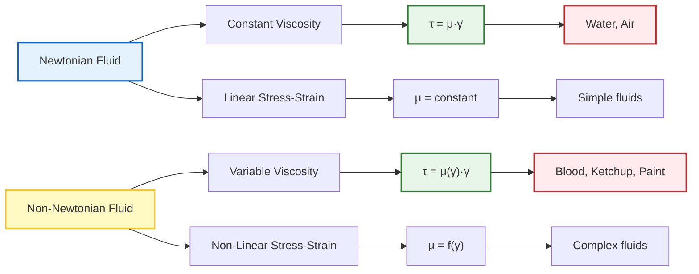
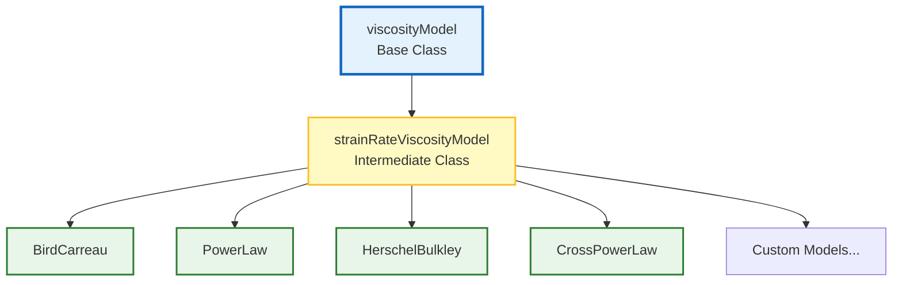
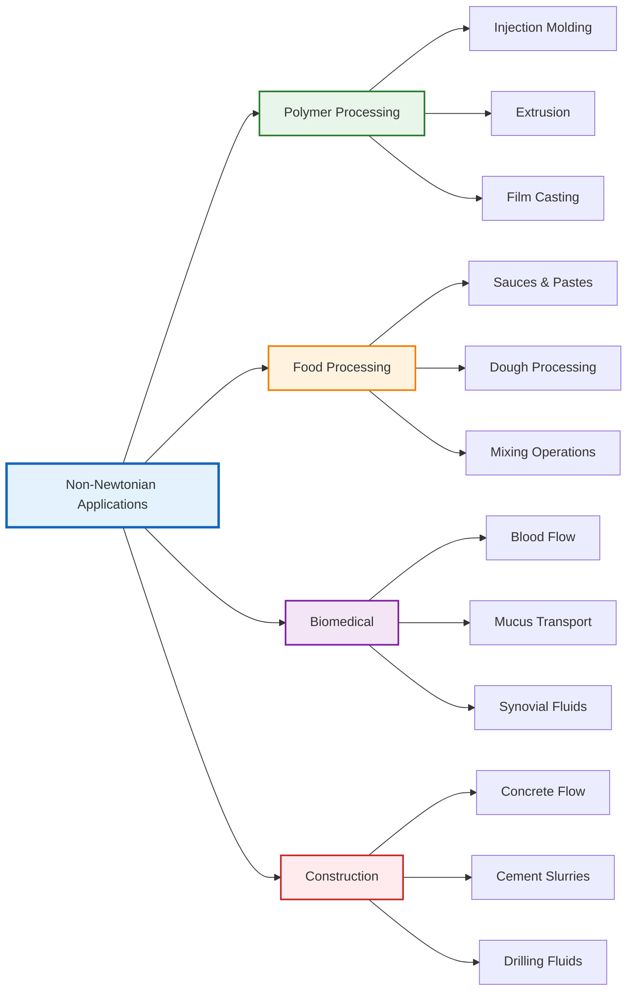
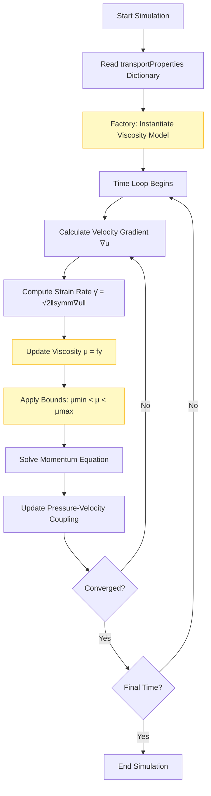

# Non-Newtonian Fluids in OpenFOAM: Architecture & Implementation

> [!INFO] **Module Overview**
> This comprehensive module explores the implementation of non-Newtonian fluid models in OpenFOAM, covering mathematical foundations, code architecture, practical usage, and advanced applications in computational fluid dynamics.

---

## 🎓 Learning Objectives

By completing this module, you will be able to:

- **Understand** the fundamental differences between Newtonian and non-Newtonian fluid behavior
- **Apply** core viscosity models: Power Law, Bird-Carreau, and Herschel-Bulkley
- **Navigate** OpenFOAM's Factory Pattern architecture and class inheritance system
- **Configure** non-Newtonian simulations in `transportProperties` dictionaries
- **Implement** numerical stabilization techniques (Regularization) for complex models
- **Extend** the framework with custom rheological models

## 📚 Prerequisites

Before proceeding, ensure you have:

- **Fluid mechanics fundamentals** (viscosity, shear stress, strain rate)
- **Tensor calculus basics** (Rate-of-Strain Tensor definition and operations)
- **OpenFOAM foundation** (Case structure, dictionary syntax, file organization)
- **C++ proficiency** (Classes, inheritance, virtual functions, templates)

---

## 🗺️ Content Roadmap

1. **[[01_Non_Newtonian_Fundamentals]]** - Physics & mathematics of variable viscosity
2. **[[02_Viscosity_Models]]** - Deep dive into Power-Law, Bird-Carreau, and Herschel-Bulkley
3. **[[03_OpenFOAM_Architecture]]** - Internal architecture, base classes, and Factory Pattern
4. **[[04_Numerical_Implementation]]** - C++ code-level calculations and Regularization
5. **[[05_Practical_Usage]]** - Dictionary setup, boundary conditions, and case studies

---

## Mathematical Framework

### Constitutive Relationship

Non-Newtonian fluids exhibit viscosity that depends on shear rate, deviating from Newton's law of viscosity. In OpenFOAM, these models are implemented through the structured constitutive equation:

$$\boldsymbol{\tau} = \mu(\dot{\gamma}) \cdot \dot{\boldsymbol{\gamma}}$$

**Where:**
- $\boldsymbol{\tau}$ = stress tensor $[\text{Pa}]$
- $\mu(\dot{\gamma})$ = apparent viscosity dependent on shear rate $[\text{Pa}\cdot\text{s}]$
- $\dot{\boldsymbol{\gamma}}$ = strain-rate tensor $[\text{s}^{-1}]$

### Strain Rate Tensor

The magnitude of strain rate is computed as:

$$\dot{\gamma} = \sqrt{2\mathbf{D}:\mathbf{D}} = \sqrt{2\sum_{i,j} D_{ij}D_{ij}}$$

**Where:**
- $\mathbf{D} = \frac{1}{2}\left(\nabla \mathbf{u} + (\nabla \mathbf{u})^T\right)$ is the rate-of-deformation tensor
- $\mathbf{u}$ is the velocity vector field



---

## Core Rheological Models

### 1. Power Law Model (Ostwald–de Waele)

The simplest generalized Newtonian fluid model, relating viscosity to shear rate via a power function:

$$\mu(\dot{\gamma}) = K \cdot \dot{\gamma}^{n-1}$$

**Parameters:**
- $K$ = consistency index $[\text{Pa}\cdot\text{s}^n]$
- $n$ = power law index
  - $n < 1$: shear-thinning (pseudoplastic)
  - $n > 1$: shear-thickening (dilatant)
  - $n = 1$: reduces to Newtonian fluid

**Behavior:**

| Type | Condition | Properties | Examples | Applications |
|-----------|-----------|-----------|-----------|-------------|
| **Shear-thinning** | $n < 1$ | Viscosity decreases with shear rate | Blood, polymer melts, paints | Biological flows, coating processes |
| **Shear-thickening** | $n > 1$ | Viscosity increases with shear rate | Cornstarch mixtures, sand-water | Impact protection, specialty manufacturing |
| **Newtonian** | $n = 1$ | Constant viscosity regardless of shear rate | Water, air, ordinary oils | Basic flows, calibration |

### 2. Bird-Carreau Model

Captures smooth transition between Newtonian plateaus and power-law region:

$$\mu(\dot{\gamma}) = \mu_{\infty} + (\mu_0 - \mu_{\infty})\left[1 + (\lambda\dot{\gamma})^2\right]^{\frac{n-1}{2}}$$

**Parameters:**
- $\mu_0$ = zero-shear viscosity $[\text{Pa}\cdot\text{s}]$
- $\mu_{\infty}$ = infinite-shear viscosity $[\text{Pa}\cdot\text{s}]$
- $\lambda$ = characteristic time scale $[\text{s}]$
- $n$ = power law index

**Three Regimes:**

| Regime | Condition | Behavior |
|-------|-----------|----------|
| Low shear rate | $\lambda\dot{\gamma} \ll 1$ | Viscosity approaches $\mu_0$ (Newtonian) |
| Transition | $\lambda\dot{\gamma} \approx 1$ | Viscosity follows power-law decrease |
| High shear rate | $\lambda\dot{\gamma} \gg 1$ | Viscosity approaches $\mu_{\infty}$ (Newtonian) |

### 3. Herschel-Bulkley Model

Combines yield stress with power-law flow behavior:

$$\mu(\dot{\gamma}) = \begin{cases}
\infty & \text{if } \tau < \tau_0 \\
\displaystyle \frac{\tau_0}{\dot{\gamma}} + K\dot{\gamma}^{n-1} & \text{if } \tau \geq \tau_0
\end{cases}$$

**Parameters:**
- $\tau_0$ = yield stress $[\text{Pa}]$
- $K$ = consistency index $[\text{Pa}\cdot\text{s}^n]$
- $n$ = flow behavior index

**Physical States:**

| State | Condition | Behavior |
|-------|-----------|----------|
| Solid | $\tau < \tau_0$ | Material behaves as solid with infinite apparent viscosity |
| Yield onset | $\tau = \tau_0$ | Material begins flowing with very high effective viscosity |
| Power-law | $\tau > \tau_0$ | Material flows according to power-law behavior |

---

## OpenFOAM Implementation Architecture

### Three-Tier Class Hierarchy



#### **Base Tier:** `viscosityModel` (Abstract Base Class)

Defines the universal interface that all viscosity models must implement:

```cpp
template<class BasicTransportModel>
class viscosityModel
{
public:
    TypeName("viscosityModel");

    declareRunTimeSelectionTable
    (
        autoPtr,
        viscosityModel,
        dictionary,
        (
            const dictionary& dict,
            const BasicTransportModel& model
        ),
        (dict, model)
    );

    // Virtual interface - must be implemented by derived classes
    virtual tmp<volScalarField> mu() const = 0;
    virtual void correct() = 0;
};
```

**Key responsibilities:**
- Establishes the fundamental contract with finite volume solvers
- Ensures seamless integration regardless of specific rheological behavior
- Provides polymorphic interface for runtime model selection

#### **Intermediate Tier:** `strainRateViscosityModel`

Introduces critical capability to compute strain rate from velocity gradient:

```cpp
template<class BasicTransportModel>
class strainRateViscosityModel
:
    public viscosityModel<BasicTransportModel>
{
protected:
    // Universal strain rate calculation
    virtual tmp<volScalarField> strainRate() const
    {
        const volTensorField gradU(fvc::grad(this->U()));
        const volSymmTensorField D(symm(gradU));
        return sqrt(2.0)*mag(D);
    }
};
```

**Key features:**
- Computes strain rate magnitude: $\dot{\gamma} = \sqrt{2}\,\|\operatorname{symm}(\nabla\mathbf{u})\|$
- Centralizes calculation for consistency across all derived models
- Eliminates code duplication and ensures numerical uniformity

#### **Concrete Tier:** Rheological Model Classes

```cpp
// BirdCarreau.C
template<class BasicTransportModel>
tmp<volScalarField> BirdCarreau<BasicTransportModel>::nu
(
    const volScalarField& nu0,
    const volScalarField& strainRate
) const
{
    return
        nuInf_
      + (nu0 - nuInf_)
       *pow
        (
            scalar(1)
          + pow
            (
                tauStar_.value() > 0
              ? nu0*strainRate/tauStar_
              : k_*strainRate,
                a_
            ),
            (n_ - 1.0)/a_
        );
}
```

### Factory Pattern Runtime Selection

OpenFOAM uses a sophisticated **dictionary-driven factory pattern**:

```cpp
// Factory method implementation
template<class BasicTransportModel>
autoPtr<viscosityModel<BasicTransportModel>>
viscosityModel<BasicTransportModel>::New
(
    const dictionary& dict,
    const BasicTransportModel& model
)
{
    // Read model type from dictionary
    const word modelType(dict.lookup("transportModel"));

    Info<< "Selecting viscosity model " << modelType << endl;

    typename dictionaryConstructorTable::iterator cstrIter =
        dictionaryConstructorTablePtr_->find(modelType);

    if (cstrIter == dictionaryConstructorTablePtr_->end())
    {
        FatalErrorInFunction
            << "Unknown viscosity model " << modelType << nl << nl
            << "Valid viscosity models are : " << endl
            << dictionaryConstructorTablePtr_->sortedToc()
            << exit(FatalError);
    }

    return cstrIter()(dict, model);
}
```

**Registration mechanism:**

```cpp
// In BirdCarreau.C
addToRunTimeSelectionTable
(
    generalisedNewtonianViscosityModel,
    BirdCarreau,
    dictionary
);
```

**Architectural benefits:**

| Benefit | Description |
|---------|-------------|
| **Extensibility** | Add new models without recompiling core OpenFOAM |
| **Runtime Flexibility** | Switch models via dictionary entry changes |
| **Type Safety** | Compile-time checking ensures all models implement required interface |
| **Centralized Management** | Automatic discovery of all available models |
| **Dependency Injection** | Decouples solver code from specific model implementations |

---

## Numerical Implementation

### Strain Rate Calculation Methods

OpenFOAM offers multiple approaches for computing $\dot{\gamma}$:

#### **1. Standard Method**
```cpp
volSymmTensorField D = symm(fvc::grad(U));
volScalarField shearRate = sqrt(2.0)*mag(D);
```

#### **2. Invariant Method**
```cpp
volTensorField gradU = fvc::grad(U);
volScalarField shearRate = sqrt(2.0*magSqr(symm(gradU)));
```

#### **3. Q-Criterion (for vorticity-dominated regions)**
```cpp
volTensorField gradU = fvc::grad(U);
volScalarField Q = 0.5*(magSqr(skew(gradU)) - magSqr(symm(gradU)));
volScalarField shearRate = sqrt(max(magSqr(symm(gradU)), Q));
```

| Method | Advantages | Disadvantages | Suitable Applications |
|---------|-----------|--------------|----------------------|
| Standard | Mathematically exact | May have issues at very low shear rates | General flows |
| Invariant | More numerically stable | Computationally heavier | Highly complex fluids |
| Q-Criterion | Handles vortex structures well | More complex | Turbulent flows |

### Regularization Techniques

To prevent division by zero in low shear rate regions, OpenFOAM implements regularization:

#### **Papanastasiou Regularization**
```cpp
dimensionedScalar m("m", dimTime, 100.0);
nu = nu0 + (tauY/strainRate) * (1 - exp(-m*strainRate));
```

#### **Bercovier-Engleman Regularization**
```cpp
dimensionedScalar epsilon("epsilon", dimless, SMALL);
nu = tauY/(strainRate + epsilon);
```

#### **Numerical Protection in Power Law**
```cpp
return max
(
    nuMin_,
    min
    (
        nuMax_,
        k_*pow
        (
            max
            (
                dimensionedScalar(dimTime, 1.0)*strainRate,
                dimensionedScalar(dimless, small)
            ),
            n_.value() - scalar(1)
        )
    )
);
```

### Solver Integration

```cpp
// Main solver loop
while (runTime.loop())
{
    // Update viscosity model
    viscosity->correct();

    // Get current viscosity field
    const volScalarField mu(viscosity->mu());

    // Momentum equation with variable viscosity
    fvVectorMatrix UEqn
    (
        fvm::ddt(rho, U)
      + fvm::div(rhoPhi, U)
      - fvm::laplacian(mu, U)
     ==
        fvOptions(rho, U)
    );

    // Solve momentum
    UEqn.relax();
    fvOptions.constrain(UEqn);

    if (pimple.momentumPredictor())
    {
        solve(UEqn == -fvc::grad(p));
        fvOptions.correct(U);
    }
}
```

---

## Practical Usage

### Dictionary Configuration

Non-Newtonian models are specified in `constant/transportProperties`:

```cpp
transportModel  HerschelBulkley;

HerschelBulkleyCoeffs
{
    nu0             [0 2 -1 0 0 0 0] 1e-06;  // Minimum viscosity
    tauY            [1 -1 -2 0 0 0 0] 10;    // Yield stress
    k               [1 -1 -2 0 0 0 0] 0.01;  // Consistency index
    n               [0 0 0 0 0 0 0] 0.5;     // Power law index
    nuMax           [0 2 -1 0 0 0 0] 1e+04;  // Maximum viscosity
}
```

### Recommended Solvers

| Solver | Problem Type | Flow Regime | Suitable For |
|--------|-------------|-------------|--------------|
| **simpleFoam** | Incompressible | Steady-state | Basic cases, initial studies |
| **pimpleFoam** | Incompressible | Transient | Complex cases, time-dependent flows |
| **nonNewtonianIcoFoam** | Non-Newtonian only | Transient | Specialized applications |

### Industrial Applications



#### **Common Use Cases:**

1. **Polymer Processing:**
   - Injection molding simulations
   - Extrusion process optimization
   - Film casting analysis

2. **Food Processing:**
   - Sauce and paste flow characterization
   - Dough mixing and extrusion
   - Texture and mouthfeel prediction

3. **Biomedical Fluids:**
   - Blood flow in arteries and veins
   - Mucus transport in respiratory systems
   - Joint fluid mechanics

4. **Construction Materials:**
   - Concrete flow in formwork
   - Cement slurry pumping
   - Drilling mud characterization

### Verification Cases

> [!TIP] **Tutorial Locations**
> OpenFOAM provides comprehensive verification cases in `tutorials/nonNewtonian/`

1. **Couette Flow**: Validation of shear-rate dependent viscosity
2. **Pipe Flow**: Pressure drop vs. flow rate relationships
3. **Flow Around Obstacles**: Vortex shedding patterns for non-Newtonian fluids

---

## Extending with Custom Models

Creating a custom rheological model is straightforward:

```cpp
// CustomViscosityModel.H
template<class BasicTransportModel>
class CustomViscosityModel
:
    public viscosityModel<BasicTransportModel>
{
private:
    dimensionedScalar K_;
    dimensionedScalar n_;
    mutable volScalarField mu_;

public:
    TypeName("CustomModel");

    CustomViscosityModel
    (
        const dictionary& dict,
        const BasicTransportModel& model
    );

    virtual tmp<volScalarField> mu() const;
    virtual void correct();
};

// Factory registration
addToRunTimeSelectionTable
(
    viscosityModel,
    CustomViscosityModel,
    dictionary
);
```

**Implementation in CustomViscosityModel.C:**

```cpp
template<class BasicTransportModel>
void CustomViscosityModel<BasicTransportModel>::correct()
{
    const volTensorField gradU(fvc::grad(this->U()));
    const volSymmTensorField D(symm(gradU));
    const volScalarField shearRate(sqrt(2.0)*mag(D));

    // Custom formulation
    mu_ = this->nu()*this->rho()*pow(1.0 + K_*shearRate, n_ - 1.0);
    mu_.correctBoundaryConditions();
}
```

---

## Advanced Topics

### Viscoelastic Models

OpenFOAM extends beyond simple generalized Newtonian fluids to complex viscoelastic solvers:

#### **Oldroyd-B Model**

$$\boldsymbol{\tau}_p + \lambda_1 \overset{\nabla}{\boldsymbol{\tau}_p} = 2\mu_p \mathbf{D}$$

Where the upper-convected derivative is:

$$\overset{\nabla}{\boldsymbol{\tau}_p} = \frac{\partial \boldsymbol{\tau}_p}{\partial t} + \mathbf{u} \cdot \nabla \boldsymbol{\tau}_p - (\nabla \mathbf{u})^T \cdot \boldsymbol{\tau}_p - \boldsymbol{\tau}_p \cdot \nabla \mathbf{u}$$

#### **Temperature-Dependent Models**

**Cross-WLF Model:**

$$\eta(\dot{\gamma},T) = \frac{\eta_0(T)}{1 + \left(\frac{\eta_0(T) \dot{\gamma}}{\tau^*(T)}\right)^{n-1}}$$

With temperature dependence:

$$\eta_0(T) = D_1 \exp\left(-\frac{A_1(T-T_r)}{A_2 + T - T_r}\right)$$

---

## Key Takeaways

### 1. Three-Tier Architecture
- **Base**: `viscosityModel` defines universal interface
- **Intermediate**: `strainRateViscosityModel` computes universal strain rate
- **Concrete**: Specific models implement unique constitutive equations

### 2. Factory Pattern Runtime Selection
- Dictionary-driven model instantiation
- No recompilation required for model changes
- Automatic model discovery and validation

### 3. Universal Strain Rate Calculation
$$\dot{\gamma} = \sqrt{2}\,\|\operatorname{symm}(\nabla\mathbf{u})\|$$

Ensures consistency across all rheological models.

### 4. Numerical Robustness
- Regularization prevents division by zero
- Viscosity bounding maintains physical realism
- Multiple stabilization strategies available

### 5. Extensibility Framework
- Custom models integrate seamlessly
- Factory registration is automatic
- No modification of core OpenFOAM required

---

## Summary Algorithm



---

**This architecture provides a robust framework for simulating complex non-Newtonian fluid behaviors in industrial and research applications, with extensibility for custom model development.**
