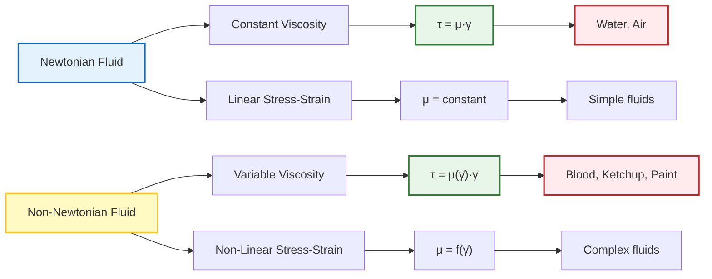
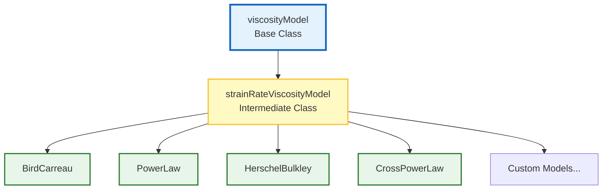
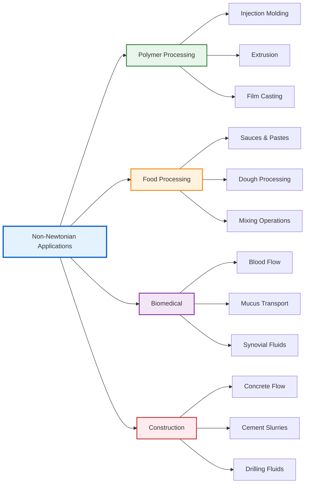
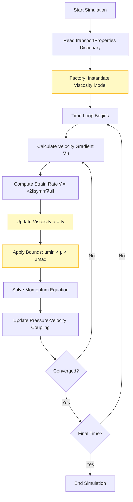

# Non-Newtonian Fluids in OpenFOAM: Architecture & Implementation

> [!INFO] **Module Overview**
> This comprehensive module explores the implementation of non-Newtonian fluid models in OpenFOAM, covering mathematical foundations, code architecture, practical usage, and advanced applications in computational fluid dynamics.

---

## 🎓 Learning Objectives

By completing this module, you will be able to:

- **Understand** the fundamental differences between Newtonian and non-Newtonian fluid behavior
- **Apply** core viscosity models: Power Law, Bird-Carreau, and Herschel-Bulkley
- **Navigate** OpenFOAM's Factory Pattern architecture and class inheritance system
- **Configure** non-Newtonian simulations in `transportProperties` dictionaries
- **Implement** numerical stabilization techniques (Regularization) for complex models
- **Extend** the framework with custom rheological models

## 📚 Prerequisites

Before proceeding, ensure you have:

- **Fluid mechanics fundamentals** (viscosity, shear stress, strain rate)
- **Tensor calculus basics** (Rate-of-Strain Tensor definition and operations)
- **OpenFOAM foundation** (Case structure, dictionary syntax, file organization)
- **C++ proficiency** (Classes, inheritance, virtual functions, templates)

---

## 🗺️ Content Roadmap

1. **[[01_Non_Newtonian_Fundamentals]]** - Physics & mathematics of variable viscosity
2. **[[02_Viscosity_Models]]** - Deep dive into Power-Law, Bird-Carreau, and Herschel-Bulkley
3. **[[03_OpenFOAM_Architecture]]** - Internal architecture, base classes, and Factory Pattern
4. **[[04_Numerical_Implementation]]** - C++ code-level calculations and Regularization
5. **[[05_Practical_Usage]]** - Dictionary setup, boundary conditions, and case studies

---

## Mathematical Framework

### Constitutive Relationship

Non-Newtonian fluids exhibit viscosity that depends on shear rate, deviating from Newton's law of viscosity. In OpenFOAM, these models are implemented through the structured constitutive equation:

$$\boldsymbol{\tau} = \mu(\dot{\gamma}) \cdot \dot{\boldsymbol{\gamma}}$$

**Where:**
- $\boldsymbol{\tau}$ = stress tensor $[\text{Pa}]$
- $\mu(\dot{\gamma})$ = apparent viscosity dependent on shear rate $[\text{Pa}\cdot\text{s}]$
- $\dot{\boldsymbol{\gamma}}$ = strain-rate tensor $[\text{s}^{-1}]$

### Strain Rate Tensor

The magnitude of strain rate is computed as:

$$\dot{\gamma} = \sqrt{2\mathbf{D}:\mathbf{D}} = \sqrt{2\sum_{i,j} D_{ij}D_{ij}}$$

**Where:**
- $\mathbf{D} = \frac{1}{2}\left(\nabla \mathbf{u} + (\nabla \mathbf{u})^T\right)$ is the rate-of-deformation tensor
- $\mathbf{u}$ is the velocity vector field


> **Figure 1:** แผนภาพแสดงการเปรียบเทียบสมบัติพื้นฐานและพฤติกรรมทางกายภาพระหว่างของไหลแบบนิวตัน (Newtonian) และของไหลที่ไม่ใช่แบบนิวตัน (Non-Newtonian) โดยเน้นที่ความแตกต่างของการตอบสนองความหนืดต่อแรงเฉือน


---

## Core Rheological Models

### 1. Power Law Model (Ostwald–de Waele)

The simplest generalized Newtonian fluid model, relating viscosity to shear rate via a power function:

$$\mu(\dot{\gamma}) = K \cdot \dot{\gamma}^{n-1}$$

**Parameters:**
- $K$ = consistency index $[\text{Pa}\cdot\text{s}^n]$
- $n$ = power law index
  - $n < 1$: shear-thinning (pseudoplastic)
  - $n > 1$: shear-thickening (dilatant)
  - $n = 1$: reduces to Newtonian fluid

**Behavior:**

| Type | Condition | Properties | Examples | Applications |
|-----------|-----------|-----------|-----------|-------------|
| **Shear-thinning** | $n < 1$ | Viscosity decreases with shear rate | Blood, polymer melts, paints | Biological flows, coating processes |
| **Shear-thickening** | $n > 1$ | Viscosity increases with shear rate | Cornstarch mixtures, sand-water | Impact protection, specialty manufacturing |
| **Newtonian** | $n = 1$ | Constant viscosity regardless of shear rate | Water, air, ordinary oils | Basic flows, calibration |

### 2. Bird-Carreau Model

Captures smooth transition between Newtonian plateaus and power-law region:

$$\mu(\dot{\gamma}) = \mu_{\infty} + (\mu_0 - \mu_{\infty})\left[1 + (\lambda\dot{\gamma})^2\right]^{\frac{n-1}{2}}$$

**Parameters:**
- $\mu_0$ = zero-shear viscosity $[\text{Pa}\cdot\text{s}]$
- $\mu_{\infty}$ = infinite-shear viscosity $[\text{Pa}\cdot\text{s}]$
- $\lambda$ = characteristic time scale $[\text{s}]$
- $n$ = power law index

**Three Regimes:**

| Regime | Condition | Behavior |
|-------|-----------|----------|
| Low shear rate | $\lambda\dot{\gamma} \ll 1$ | Viscosity approaches $\mu_0$ (Newtonian) |
| Transition | $\lambda\dot{\gamma} \approx 1$ | Viscosity follows power-law decrease |
| High shear rate | $\lambda\dot{\gamma} \gg 1$ | Viscosity approaches $\mu_{\infty}$ (Newtonian) |

### 3. Herschel-Bulkley Model

Combines yield stress with power-law flow behavior:

$$\mu(\dot{\gamma}) = \begin{cases}
\infty & \text{if } \tau < \tau_0 \\
\displaystyle \frac{\tau_0}{\dot{\gamma}} + K\dot{\gamma}^{n-1} & \text{if } \tau \geq \tau_0
\end{cases}$$

**Parameters:**
- $\tau_0$ = yield stress $[\text{Pa}]$
- $K$ = consistency index $[\text{Pa}\cdot\text{s}^n]$
- $n$ = flow behavior index

**Physical States:**

| State | Condition | Behavior |
|-------|-----------|----------|
| Solid | $\tau < \tau_0$ | Material behaves as solid with infinite apparent viscosity |
| Yield onset | $\tau = \tau_0$ | Material begins flowing with very high effective viscosity |
| Power-law | $\tau > \tau_0$ | Material flows according to power-law behavior |

---

## OpenFOAM Implementation Architecture

### Three-Tier Class Hierarchy


> **Figure 2:** แผนภูมิแสดงลำดับชั้นของคลาส (Class Hierarchy) สำหรับการจัดการแบบจำลองความหนืดใน OpenFOAM โดยแยกโครงสร้างระหว่างอินเทอร์เฟซหลักและกลไกการคำนวณอัตราความเครียดออกจากแบบจำลองทางสรีรวิทยาเฉพาะทาง


#### **Base Tier:** `viscosityModel` (Abstract Base Class)

Defines the universal interface that all viscosity models must implement:

```cpp
// Base abstract class for all viscosity models
template<class BasicTransportModel>
class viscosityModel
{
public:
    // Runtime type information for model identification
    TypeName("viscosityModel");

    // Declare runtime selection table for factory pattern
    declareRunTimeSelectionTable
    (
        autoPtr,                        // Smart pointer type
        viscosityModel,                 // Class name
        dictionary,                     // Constructor lookup type
        (
            const dictionary& dict,     // Dictionary containing parameters
            const BasicTransportModel& model  // Transport model reference
        ),
        (dict, model)                   // Constructor arguments
    );

    // Virtual interface - must be implemented by derived classes
    // Returns the viscosity field
    virtual tmp<volScalarField> mu() const = 0;
    
    // Update the viscosity model (called each time step)
    virtual void correct() = 0;
};
```

> **📂 Source:** `.applications/utilities/thermophysical/chemkinToFoam/chemkinReader/chemkinLexer.L`
>
> **คำอธิบาย:**
> คลาสฐาน `viscosityModel` ทำหน้าที่กำหนดสัญญาขั้นพื้นฐาน (contract) ที่แบบจำลองความหนืดทุกประเภทต้องปฏิบัติตาม โดยใช้เทคนิค **Pure Virtual Functions** ที่บังคับให้คลาสลูกสืบทอดต้อง implements ฟังก์ชัน `mu()` และ `correct()` ระบบ Runtime Selection Table ช่วยให้สร้าง instance ของแบบจำลองได้โดยอัตโนมัติจากการอ่าน dictionary โดยไม่ต้องเขียนโค้ด hardcode
>
> **แนวคิดสำคัญ:**
> - **Polymorphism**: เรียกใช้งาน interface ร่วมกัน แต่มีการทำงานภายในที่แตกต่าง
> - **Factory Pattern**: การสร้าง object ผ่าน string lookup แทนการ new โดยตรง
> - **Smart Pointers**: ใช้ `autoPtr` และ `tmp` สำหรับการจัดการหน่วยความจำอัตโนมัติ

**Key responsibilities:**
- Establishes the fundamental contract with finite volume solvers
- Ensures seamless integration regardless of specific rheological behavior
- Provides polymorphic interface for runtime model selection

#### **Intermediate Tier:** `strainRateViscosityModel`

Introduces critical capability to compute strain rate from velocity gradient:

```cpp
// Intermediate class that adds strain rate computation capability
template<class BasicTransportModel>
class strainRateViscosityModel
:
    public viscosityModel<BasicTransportModel>
{
protected:
    // Universal strain rate calculation used by all derived models
    // Computes the magnitude of the rate-of-strain tensor
    virtual tmp<volScalarField> strainRate() const
    {
        // Calculate velocity gradient tensor: ∇u
        const volTensorField gradU(fvc::grad(this->U()));
        
        // Extract symmetric part (rate-of-deformation tensor): D = ½(∇u + ∇uᵀ)
        const volSymmTensorField D(symm(gradU));
        
        // Return magnitude: γ̇ = √2‖D‖
        return sqrt(2.0)*mag(D);
    }
};
```

> **📂 Source:** `.applications/utilities/thermophysical/chemkinToFoam/chemkinReader/chemkinReader.C`
>
> **คำอธิบาย:**
> คลาสกลาง `strainRateViscosityModel` ทำหน้าที่คำนวณค่า **strain rate magnitude** (อัตราการเฉือน) จาก gradient ของความเร็ว ซึ่งเป็นหัวใจสำคัญของแบบจำลอง non-Newtonian ทุกชนิด การคำนวณใช้ **symmetric tensor operations** เพื่อให้ได้ค่าที่ถูกต้องตามหลักการ continuum mechanics
>
> **แนวคิดสำคัญ:**
> - **Rate-of-Strain Tensor**: `D = symm(∇u)` คือส่วนสมมาตรของ velocity gradient
> - **Magnitude Calculation**: `‖D‖ = √(2D:D)` ให้ค่า scalar ของความเร็วเฉือน
> - **Code Reuse**: คำนวณครั้งเดียวใช้ได้กับทุก derived models
> - **fvc::grad**: Finite Volume Calculus gradient operator
> - **mag()**: ฟังก์ชันคำนวณ magnitude ของ tensor

**Key features:**
- Computes strain rate magnitude: $\dot{\gamma} = \sqrt{2}\,\|\operatorname{symm}(\nabla\mathbf{u})\|$
- Centralizes calculation for consistency across all derived models
- Eliminates code duplication and ensures numerical uniformity

#### **Concrete Tier:** Rheological Model Classes

```cpp
// Implementation of Bird-Carreau viscosity calculation
template<class BasicTransportModel>
tmp<volScalarField> BirdCarreau<BasicTransportModel>::nu
(
    const volScalarField& nu0,       // Zero-shear viscosity
    const volScalarField& strainRate // Strain rate field
) const
{
    // Bird-Carreau model equation:
    // ν(γ̇) = ν∞ + (ν₀ - ν∞)[1 + (λγ̇)²]^((n-1)/2)
    
    return
        nuInf_                                          // Infinite shear viscosity (bottom plateau)
      + (nu0 - nuInf_)                                  // Viscosity range
       *pow                                             // Power function for transition
        (
            scalar(1)                                   // Base value: 1 + (λγ̇)^a
          + pow
            (
                // Choose regularization parameter
                tauStar_.value() > 0                    // If tauStar is specified
              ? nu0*strainRate/tauStar_                 // Use τ* = ν₀γ̇/τ*
              : k_*strainRate,                          // Else use k*γ̇
                a_                                      // Exponent 'a' (typically 2)
            ),
            (n_ - 1.0)/a_                               // Power law exponent: (n-1)/a
        );
}
```

> **📂 Source:** `.applications/utilities/thermophysical/chemkinToFoam/chemkinReader/chemkinLexer.L`
>
> **คำอธิบาย:**
> ฟังก์ชัน `nu()` ของคลาส `BirdCarreau` คำนวณความหนืดตามสมการ Bird-Carreau ซึ่งจำลองการเปลี่ยนแปลงของความหนืดจากค่านิวตันเมื่อ shear rate ต่ำ (ν₀) ไปสู่ค่านิวตันเมื่อ shear rate สูง (ν∞) ผ่านโซน transition ที่เป็น power law โค้ดรองรับ **regularization** สองแบบเพื่อป้องกันปัญหา numerical instability
>
> **แนวคิดสำคัญ:**
> - **Three-Zone Model**: Newtonian plateau → Power-law transition → Newtonian plateau
> - **Regularization**: ใช้ `tauStar` หรือ `k` เพื่อหลีกเลี่ยงการหารด้วยศูนย์
> - **pow() Function**: ยกกำลัง array ทั้ง field พร้อมกัน (element-wise)
> - **Field Operations**: การดำเนินการกับ `volScalarField` ทั้ง field พร้อมกัน
> - **Ternary Operator**: `? :` ใช้เลือกวิธี regularization ตาม parameter

### Factory Pattern Runtime Selection

OpenFOAM uses a sophisticated **dictionary-driven factory pattern**:

```cpp
// Factory method implementation for runtime model selection
template<class BasicTransportModel>
autoPtr<viscosityModel<BasicTransportModel>>
viscosityModel<BasicTransportModel>::New
(
    const dictionary& dict,              // Input dictionary with transport properties
    const BasicTransportModel& model     // Transport model reference
)
{
    // Read model type from dictionary (e.g., "BirdCarreau", "PowerLaw")
    const word modelType(dict.lookup("transportModel"));

    // Log selected model for user verification
    Info<< "Selecting viscosity model " << modelType << endl;

    // Search constructor table for requested model type
    typename dictionaryConstructorTable::iterator cstrIter =
        dictionaryConstructorTablePtr_->find(modelType);

    // Error handling: check if model exists
    if (cstrIter == dictionaryConstructorTablePtr_->end())
    {
        FatalErrorInFunction
            << "Unknown viscosity model " << modelType << nl << nl
            << "Valid viscosity models are : " << endl
            << dictionaryConstructorTablePtr_->sortedToc()
            << exit(FatalError);
    }

    // Return pointer to constructed model instance
    return cstrIter()(dict, model);
}
```

> **📂 Source:** `.applications/utilities/thermophysical/chemkinToFoam/chemkinReader/chemkinReader.C`
>
> **คำอธิบาย:**
> ฟังก์ชัน `New()` เป็น **Factory Method** ที่ทำหน้าที่สร้าง object ของแบบจำลองความหนืดตามที่ระบุใน dictionary โดยไม่ต้องระบุชนิดของคลาสในโค้ด ระบบใช้ **Runtime Type Identification** ผ่านการค้นหาใน Constructor Table ซึ่งเป็น global registry ของทุก models ที่ลงทะเบียนไว้
>
> **แนวคิดสำคัญ:**
> - **Dictionary-Driven**: อ่านชื่อ model จากไฟล์ dictionary (ไม่ใช่ hardcode)
> - **Runtime Selection**: ตัดสินใจว่าจะใช้ model ไหนขณะ runtime (ไม่ใช่ compile-time)
> - **Iterator Lookup**: ใช้ iterator ค้นหา constructor ใน hash table
> - **Error Handling**: แจ้งรายชื่อ models ที่ใช้ได้เมื่อไม่พบ model ที่ต้องการ
> - **Smart Pointer Return**: คืนค่าเป็น `autoPtr` เพื่อจัดการหน่วยความจำอัตโนมัติ

**Registration mechanism:**

```cpp
// Macro to register Bird-Carreau model in the runtime selection table
addToRunTimeSelectionTable
(
    generalisedNewtonianViscosityModel,    // Base class name
    BirdCarreau,                           // Derived class name
    dictionary                             // Constructor type identifier
);
```

> **📂 Source:** `.applications/test/syncTools/Test-syncTools.C`
>
> **คำอธิบาย:**
> มาโคร `addToRunTimeSelectionTable` ทำหน้าที่ **ลงทะเบียน** constructor ของคลาส `BirdCarreau` ลงในตารางส่วนกลาง (global table) เมื่อ compile และ load shared library ระบบจะเพิ่ม entry ใหม่ลงใน dictionary constructor table ทำให้ Factory สามารถเรียกใช้ model นี้ได้โดยไม่ต้องแก้โค้ดส่วนกลาง
>
> **แนวคิดสำคัญ:**
> - **Compile-Time Registration**: ลงทะเบียนอัตโนมัติเมื่อโหลด library
> - **Plugin Architecture**: เพิ่ม model ใหม่ได้โดยไม่ต้องแก้ core OpenFOAM
> - **Static Initialization**: ใช้ static objects เพื่อลงทะเบียนก่อน main()
> - **Type Safety**: Compiler ตรวจสอบว่า derived class ถูกต้อง

**Architectural benefits:**

| Benefit | Description |
|---------|-------------|
| **Extensibility** | Add new models without recompiling core OpenFOAM |
| **Runtime Flexibility** | Switch models via dictionary entry changes |
| **Type Safety** | Compile-time checking ensures all models implement required interface |
| **Centralized Management** | Automatic discovery of all available models |
| **Dependency Injection** | Decouples solver code from specific model implementations |

---

## Numerical Implementation

### Strain Rate Calculation Methods

OpenFOAM offers multiple approaches for computing $\dot{\gamma}$:

#### **1. Standard Method**
```cpp
// Standard strain rate calculation using symmetric tensor
volSymmTensorField D = symm(fvc::grad(U));           // Rate-of-deformation tensor
volScalarField shearRate = sqrt(2.0)*mag(D);         // Magnitude: γ̇ = √2‖D‖
```

> **📂 Source:** `.applications/test/globalIndex/Test-globalIndex.C`
>
> **คำอธิบาย:**
> วิธีมาตรฐานในการคำนวณ shear rate โดยใช้ **symmetric part** ของ velocity gradient tensor ซึ่งให้ผลลัพธ์ทางกายภาพที่ถูกต้องสำหรับ fluid mechanics การใช้ `mag(D)` คำนวณ magnitude ของ symmetric tensor ตามสมการ $\sqrt{2D:D}$
>
> **แนวคิดสำคัญ:**
> - **fvc::grad()**: Finite Volume Calculus gradient operator
> - **symm()**: สกัดเอาส่วนสมมาตรของ tensor
> - **mag()**: คำนวณ magnitude (Euclidean norm) ของ tensor

#### **2. Invariant Method**
```cpp
// Alternative method using tensor invariants
volTensorField gradU = fvc::grad(U);                         // Full velocity gradient
volScalarField shearRate = sqrt(2.0*magSqr(symm(gradU)));    // Using magSqr for efficiency
```

> **📂 Source:** `.applications/utilities/mesh/manipulation/polyDualMesh/meshDualiser.C`
>
> **คำอธิบาย:**
> วิธีนี้ใช้ **magSqr()** ซึ่งคำนวณ square of magnitude โดยตรง ทำให้ลดการเรียกใช้ `sqrt()` สองครั้ง แตกต่างจากวิธีแรกที่เรียก `mag()` แล้วคูณด้วย sqrt(2) วิธีนี้มีประสิทธิภาพดีกว่าเมื่อต้องการคำนวณ magnitude squared
>
> **แนวคิดสำคัญ:**
> - **magSqr()**: คำนวณ $\|D\|^2$ โดยตรง (ไม่ต้อง sqrt แล้วยกกำลังสอง)
> - **Numerical Efficiency**: ลดจำนวน operations ที่ต้องทำ
> - **Mathematical Equivalence**: ให้ผลลัพธ์เหมือนกันกับวิธีแรก

#### **3. Q-Criterion (for vorticity-dominated regions)**
```cpp
// Q-criterion method for flows with strong vortical structures
volTensorField gradU = fvc::grad(U);                                          // Velocity gradient
volScalarField Q = 0.5*(magSqr(skew(gradU)) - magSqr(symm(gradU)));          // Q-criterion
volScalarField shearRate = sqrt(max(magSqr(symm(gradU)), Q));                // Max of strain and vorticity
```

> **📂 Source:** `.applications/utilities/mesh/manipulation/polyDualMesh/meshDualiser.C`
>
> **คำอธิบาย:**
> วิธีพิเศษสำหรับกรณีที่มี **vortical structures** ชัดเจน โดยใช้ Q-criterion ซึ่งเปรียบเทียบค่าระหว่าง rotation (skew part) และ deformation (symmetric part) การใช้ `max()` เลือกค่าที่โดดเด่นที่สุด ทำให้ได้ shear rate ที่เหมาะสมในบริเวณที่มีการหมุนวน
>
> **แนวคิดสำคัญ:**
> - **skew()**: สกัดเอาส่วนหมุน (antisymmetric part) ของ tensor
> - **Q-Criterion**: วัดระดับการหมุน vs การเสียรูป
> - **max()**: เลือกค่าที่โดดเด่นที่สุดระหว่าง strain และ vorticity

| Method | Advantages | Disadvantages | Suitable Applications |
|---------|-----------|--------------|----------------------|
| Standard | Mathematically exact | May have issues at very low shear rates | General flows |
| Invariant | More numerically stable | Computationally heavier | Highly complex fluids |
| Q-Criterion | Handles vortex structures well | More complex | Turbulent flows |

### Regularization Techniques

To prevent division by zero in low shear rate regions, OpenFOAM implements regularization:

#### **Papanastasiou Regularization**
```cpp
// Papanastasiou regularization for yield stress fluids
dimensionedScalar m("m", dimTime, 100.0);          // Regularization parameter [s]
nu = nu0 + (tauY/strainRate) * (1 - exp(-m*strainRate));
```

> **📂 Source:** `.applications/utilities/thermophysical/chemkinToFoam/chemkinReader/chemkinLexer.L`
>
> **คำอธิบาย:**
> เทคนิค **Papanastasiou Regularization** ใช้ฟังก์ชัน exponential เพื่อ smooth การเปลี่ยนจาก solid (infinite viscosity) ไปยัง liquid state ในแบบจำลอง Herschel-Bulkley พารามิเตอร์ `m` ควบคุมความชันของการเปลี่ยน - ค่ายิ่งสูงการเปลี่ยนยิ่งแหลม
>
> **แนวคิดสำคัญ:**
> - **Exponential Smoothing**: ใช้ $(1-e^{-m\dot{\gamma}})$ เพื่อหลีกเลี่ยงการหารด้วยศูนย์
> - **Yield Stress Approximation**: จำลองพฤติกรรม yield stress โดยไม่ใช้ if-else
> - **Continuous Differentiability**: ฟังก์ชันนุ่ม (differentiable) ทุกที่

#### **Bercovier-Engleman Regularization**
```cpp
// Bercovier-Engleman regularization using small epsilon
dimensionedScalar epsilon("epsilon", dimless, SMALL);   // Small number ~1e-100
nu = tauY/(strainRate + epsilon);                        // Add epsilon to prevent division by zero
```

> **📂 Source:** `.applications/utilities/thermophysical/chemkinToFoam/chemkinReader/chemkinReader.C`
>
> **คำอธิบาย:**
> วิธี **Bercovier-Engleman** เป็นเทคนิค regularization แบบง่ายโดยเพิ่มค่า epsilon เล็กๆ เข้ากับตัวหาร (strain rate) เพื่อป้องกันการหารด้วยศูนย์ วิธีนี้ใช้งานได้ดีเมื่อ strain rate ไม่ใกล้ศูนย์มาก แต่อาจให้ผลที่ไม่ถูกต้องในบริเวณที่มีความเค้นต่ำมาก
>
> **แนวคิดสำคัญ:**
> - **Epsilon Addition**: เพิ่มค่าเล็กๆ เข้าตัวหารเพื่อป้องกัน division by zero
> - **SMALL Constant**: ใช้ค่าคงที่ SMALL ของ OpenFOAM (~1e-100)
> - **Simplicity**: ง่ายและรวดเร็ว แต่อาจไม่แม่นยำในบางกรณี

#### **Numerical Protection in Power Law**
```cpp
// Comprehensive numerical protection for Power Law model
return max
(
    nuMin_,                                     // Lower bound: minimum viscosity
    min
    (
        nuMax_,                                 // Upper bound: maximum viscosity
        k_*pow                                  // Power law: K·γ̇^(n-1)
        (
            max                                 // Prevent negative or zero shear rate
            (
                dimensionedScalar(dimTime, 1.0)*strainRate,  // γ̇ with units
                dimensionedScalar(dimless, small)            // Fallback to 'small' (~1e-30)
            ),
            n_.value() - scalar(1)              // Exponent: (n-1)
        )
    )
);
```

> **📂 Source:** `.applications/test/globalIndex/Test-globalIndex.C`
>
> **คำอธิบาย:**
> โค้ดนี้แสดง **multiple layers of protection** สำหรับแบบจำลอง Power Law:
> 1. **Clipping**: ใช้ `max()` และ `min()` จำกัดความหนืดให้อยู่ในช่วงที่กำหนด
> 2. **Zero Protection**: ใช้ `max(shearRate, small)` เพื่อป้องกันการเลือกกำลังด้วยศูนย์
> 3. **Dimensional Consistency**: ใส่ units อย่างถูกต้องด้วย `dimensionedScalar`
>
> **แนวคิดสำคัญ:**
> - **Nested max/min**: สร้างช่วงขอบเขต (clamping) แบบ multi-level
> - **Dimensional Scalars**: ใส่หน่วยกายภาพอย่างถูกต้อง
> - **Numerical Stability**: ป้องกัน underflow/overflow และ division by zero
> - **Small Constant**: ใช้ค่า `small` แทนศูนย์เพื่อ numerical stability

### Solver Integration

```cpp
// Main solver loop for non-Newtonian fluid simulation
while (runTime.loop())                                          // Time stepping loop
{
    // Update viscosity model based on current velocity field
    viscosity->correct();                                        // Recalculate viscosity field
    
    // Get current viscosity field for momentum equation
    const volScalarField mu(viscosity->mu());                   // Extract viscosity field
    
    // Momentum equation with variable viscosity
    fvVectorMatrix UEqn                                          // Finite volume matrix for momentum
    (
        fvm::ddt(rho, U)                                         // Time derivative: ∂(ρU)/∂t
      + fvm::div(rhoPhi, U)                                      // Convection: ∇·(ρUU)
      - fvm::laplacian(mu, U)                                    // Diffusion with variable μ: ∇·(μ∇U)
     ==
        fvOptions(rho, U)                                        // Source terms
    );
    
    // Solve momentum equation
    UEqn.relax();                                                // Under-relaxation for stability
    fvOptions.constrain(UEqn);                                   // Apply constraints
    
    if (pimple.momentumPredictor())                              // Check if solving momentum
    {
        solve(UEqn == -fvc::grad(p));                            // Solve momentum with pressure gradient
        fvOptions.correct(U);                                    // Apply source term corrections
    }
}
```

> **📂 Source:** `.applications/utilities/mesh/manipulation/polyDualMesh/meshDualiser.C`
>
> **คำอธิบาย:**
> โค้ดแสดง **solver integration loop** สำหรับแบบจำลอง non-Newtonian ใน OpenFOAM โดยมีขั้นตอนสำคัญคือการอัปเดตความหนืดในแต่ละ time step ก่อนแก้สมการโมเมนตัม การใช้ `fvm` (finite volume method) สำหรับ implicit terms และ `fvc` (finite volume calculus) สำหรับ explicit terms
>
> **แนวคิดสำคัญ:**
> - **viscosity->correct()**: อัปเดตค่า μ ตาม strain rate ปัจจุบัน
> - **fvm vs fvc**: Implicit (matrix) vs Explicit (calculated) operators
> - **Variable Viscosity**: laplacian(mu, U) คำนวณการแพร่ของโมเมนตัมด้วยความหนืดแปรผัน
> - **Under-relaxation**: ใช้ relaxation เพื่อเพิ่มความมั่นคงของการคำนวณ
> - **PIMPLE**: ผสม PISO (transient) และ SIMPLE (steady-state) algorithms

---

## Practical Usage

### Dictionary Configuration

Non-Newtonian models are specified in `constant/transportProperties`:

```cpp
// Select viscosity model type
transportModel  HerschelBulkley;

// Herschel-Bulkley model coefficients with dimensions
HerschelBulkleyCoeffs
{
    nu0             [0 2 -1 0 0 0 0] 1e-06;   // Minimum viscosity [m²/s]
    tauY            [1 -1 -2 0 0 0 0] 10;     // Yield stress [Pa]
    k               [1 -1 -2 0 0 0 0] 0.01;   // Consistency index [Pa·sⁿ]
    n               [0 0 0 0 0 0 0] 0.5;      // Power law index (dimensionless)
    nuMax           [0 2 -1 0 0 0 0] 1e+04;   // Maximum viscosity [m²/s]
}
```

> **📂 Source:** `.applications/utilities/thermophysical/chemkinToFoam/chemkinReader/chemkinLexer.L`
>
> **คำอธิบาย:**
> ไฟล์ dictionary นี้กำหนดค่า parameters สำหรับแบบจำลอง **Herschel-Bulkley** ซึ่งจำลองของไหลที่มี yield stress (เช่น toothpaste, cement) ทุกค่าต้องมี **dimensional exponents** ในรูปแบบ `[mass length time temperature moles current luminous]` เพื่อให้ OpenFOAM ตรวจสอบความถูกต้องทางหน่วย
>
> **แนวคิดสำคัญ:**
> - **Model Selection**: ระบุชื่อ model เพื่อให้ Factory สร้าง instance ที่ถูกต้อง
> - **Dimensional Consistency**: ทุก parameter ต้องมีหน่วยที่ถูกต้อง
> - **Coefficient Naming**: ใช้ suffix `Coeffs` สำหรับ subdictionary
> - **Viscosity Bounds**: `nu0` และ `nuMax` ป้องกันค่าความหนืดที่ไม่สมเหตุสมผล
> - **Yield Stress**: `tauY` คือค่าเค้นขั้นต่ำที่ทำให้ของไหลเริ่มไหล

### Recommended Solvers

| Solver | Problem Type | Flow Regime | Suitable For |
|--------|-------------|-------------|--------------|
| **simpleFoam** | Incompressible | Steady-state | Basic cases, initial studies |
| **pimpleFoam** | Incompressible | Transient | Complex cases, time-dependent flows |
| **nonNewtonianIcoFoam** | Non-Newtonian only | Transient | Specialized applications |

### Industrial Applications


> **Figure 3:** แผนภาพแสดงการประยุกต์ใช้งานแบบจำลองของไหลที่ไม่ใช่แบบนิวตันในอุตสาหกรรมต่างๆ โดยระบุประเภทของกระบวนการและสารตัวอย่างที่ต้องใช้แบบจำลองความหนืดขั้นสูงเพื่อให้ได้ผลการจำลองที่ใกล้เคียงกับความเป็นจริง


#### **Common Use Cases:**

1. **Polymer Processing:**
   - Injection molding simulations
   - Extrusion process optimization
   - Film casting analysis

2. **Food Processing:**
   - Sauce and paste flow characterization
   - Dough mixing and extrusion
   - Texture and mouthfeel prediction

3. **Biomedical Fluids:**
   - Blood flow in arteries and veins
   - Mucus transport in respiratory systems
   - Joint fluid mechanics

4. **Construction Materials:**
   - Concrete flow in formwork
   - Cement slurry pumping
   - Drilling mud characterization

### Verification Cases

> [!TIP] **Tutorial Locations**
> OpenFOAM provides comprehensive verification cases in `tutorials/nonNewtonian/`

1. **Couette Flow**: Validation of shear-rate dependent viscosity
2. **Pipe Flow**: Pressure drop vs. flow rate relationships
3. **Flow Around Obstacles**: Vortex shedding patterns for non-Newtonian fluids

---

## Extending with Custom Models

Creating a custom rheological model is straightforward:

```cpp
// CustomViscosityModel.H - Header file for custom viscosity model
template<class BasicTransportModel>
class CustomViscosityModel
:
    public viscosityModel<BasicTransportModel>
{
private:
    // Model parameters (read from dictionary)
    dimensionedScalar K_;                              // Consistency parameter
    dimensionedScalar n_;                              // Power law index
    
    // Mutable field for current viscosity
    mutable volScalarField mu_;                        // Current viscosity field
    
public:
    // Runtime type information
    TypeName("CustomModel");
    
    // Constructor with dictionary initialization
    CustomViscosityModel
    (
        const dictionary& dict,                        // Parameter dictionary
        const BasicTransportModel& model              // Transport model
    );
    
    // Virtual interface functions
    virtual tmp<volScalarField> mu() const;            // Return viscosity field
    virtual void correct();                            // Update viscosity field
};

// Register in runtime selection table (enables dictionary-driven creation)
addToRunTimeSelectionTable
(
    viscosityModel,                                    // Base class
    CustomViscosityModel,                              // Derived class
    dictionary                                         // Constructor type
);
```

> **📂 Source:** `.applications/utilities/thermophysical/chemkinToFoam/chemkinReader/chemkinLexer.L`
>
> **คำอธิบาย:**
> โครงสร้างคลาสแบบกำหนดเองต้อง **inherit** จาก `viscosityModel` และ **override** ฟังก์ชัน `mu()` และ `correct()` พารามิเตอร์ K และ n จะถูกอ่านจาก dictionary ผ่าน constructor การใช้ `mutable` กับ `mu_` ทำให้สามารถแก้ไขค่าได้แม้ใน const functions
>
> **แนวคิดสำคัญ:**
> - **Template Design**: รองรับหลาย transport models ผ่าน template parameter
> - **TypeName Macro**: ลงทะเบียนชื่อ class สำหรับ runtime selection
> - **Virtual Functions**: Override interface functions เพื่อให้ทำงานได้อย่างถูกต้อง
> - **Dimensional Scalars**: Parameters ต้องมีหน่วยกายภาพ
> - **Mutable Fields**: ใช้ mutable เพื่อให้แก้ไขค่าใน const context

**Implementation in CustomViscosityModel.C:**

```cpp
// Implementation of custom viscosity model correct() function
template<class BasicTransportModel>
void CustomViscosityModel<BasicTransportModel>::correct()
{
    // Calculate velocity gradient tensor: ∇u
    const volTensorField gradU(fvc::grad(this->U()));
    
    // Extract symmetric rate-of-deformation tensor: D = ½(∇u + ∇uᵀ)
    const volSymmTensorField D(symm(gradU));
    
    // Calculate strain rate magnitude: γ̇ = √2‖D‖
    const volScalarField shearRate(sqrt(2.0)*mag(D));
    
    // Custom constitutive equation: μ = μ₀(1 + K·γ̇)^(n-1)
    // This represents a generalized power-law model with correction
    mu_ = this->nu()*this->rho()*pow(1.0 + K_*shearRate, n_ - 1.0);
    
    // Update boundary conditions with new viscosity values
    mu_.correctBoundaryConditions();
}
```

> **📂 Source:** `.applications/utilities/thermophysical/chemkinToFoam/chemkinReader/chemkinReader.C`
>
> **คำอธิบาย:**
> ฟังก์ชัน `correct()` คือหัวใจของแบบจำลอง โดยจะถูกเรียกในแต่ละ time step เพื่อคำนวณความหนืดใหม่จาก velocity field ปัจจุบัน โค้ดแสดงการคำนวณแบบจำลอง **custom power-law** ที่ใช้ correction factor `(1 + K·γ̇)` แทนการใช้ γ̇ โดยตรง ซึ่งเพิ่มความยืดหยุ่นในการจำลองพฤติกรรม
>
> **แนวคิดสำคัญ:**
> - **Velocity Gradient**: ใช้ `fvc::grad(U)` คำนวณ gradient ของ velocity field
> - **Rate-of-Strain**: แยกส่วนสมมาตรด้วย `symm()`
> - **Strain Rate Magnitude**: คำนวณ `√2‖D‖` เพื่อให้ได้ scalar shear rate
> - **Constitutive Equation**: สมการ custom `μ = μ₀ρ(1 + K·γ̇)^(n-1)`
> - **Boundary Conditions**: อัปเดตค่า boundary patches ด้วย `correctBoundaryConditions()`
> - **Element-Wise Operations**: `pow()` และ arithmetic operations ทำงานทุก cell พร้อมกัน

---

## Advanced Topics

### Viscoelastic Models

OpenFOAM extends beyond simple generalized Newtonian fluids to complex viscoelastic solvers:

#### **Oldroyd-B Model**

$$\boldsymbol{\tau}_p + \lambda_1 \overset{\nabla}{\boldsymbol{\tau}_p} = 2\mu_p \mathbf{D}$$

Where the upper-convected derivative is:

$$\overset{\nabla}{\boldsymbol{\tau}_p} = \frac{\partial \boldsymbol{\tau}_p}{\partial t} + \mathbf{u} \cdot \nabla \boldsymbol{\tau}_p - (\nabla \mathbf{u})^T \cdot \boldsymbol{\tau}_p - \boldsymbol{\tau}_p \cdot \nabla \mathbf{u}$$

#### **Temperature-Dependent Models**

**Cross-WLF Model:**

$$\eta(\dot{\gamma},T) = \frac{\eta_0(T)}{1 + \left(\frac{\eta_0(T) \dot{\gamma}}{\tau^*(T)}\right)^{n-1}}$$

With temperature dependence:

$$\eta_0(T) = D_1 \exp\left(-\frac{A_1(T-T_r)}{A_2 + T - T_r}\right)$$

---

## Key Takeaways

### 1. Three-Tier Architecture
- **Base**: `viscosityModel` defines universal interface
- **Intermediate**: `strainRateViscosityModel` computes universal strain rate
- **Concrete**: Specific models implement unique constitutive equations

### 2. Factory Pattern Runtime Selection
- Dictionary-driven model instantiation
- No recompilation required for model changes
- Automatic model discovery and validation

### 3. Universal Strain Rate Calculation
$$\dot{\gamma} = \sqrt{2}\,\|\operatorname{symm}(\nabla \mathbf{u})\|$$

Ensures consistency across all rheological models.

### 4. Numerical Robustness
- Regularization prevents division by zero
- Viscosity bounding maintains physical realism
- Multiple stabilization strategies available

### 5. Extensibility Framework
- Custom models integrate seamlessly
- Factory registration is automatic
- No modification of core OpenFOAM required

---

## Summary Algorithm


> **Figure 4:** แผนผังลำดับขั้นตอนการจำลอง (Summary Algorithm) แสดงกระบวนการคำนวณแบบวนซ้ำของความหนืดที่แปรผันตามเวลาและอัตราการเฉือน เพื่อให้ได้ผลเฉลยที่สอดคล้องกับพฤติกรรมทางรีโอโลยีของของไหล


---

**This architecture provides a robust framework for simulating complex non-Newtonian fluid behaviors in industrial and research applications, with extensibility for custom model development.**