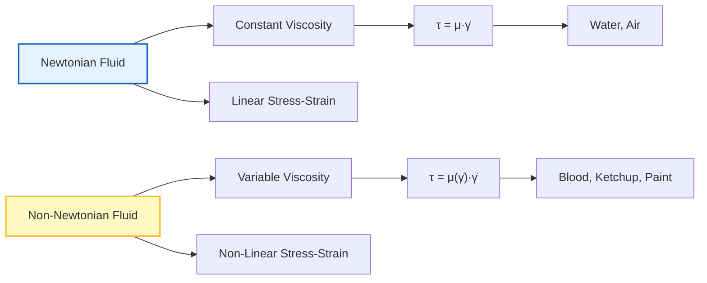
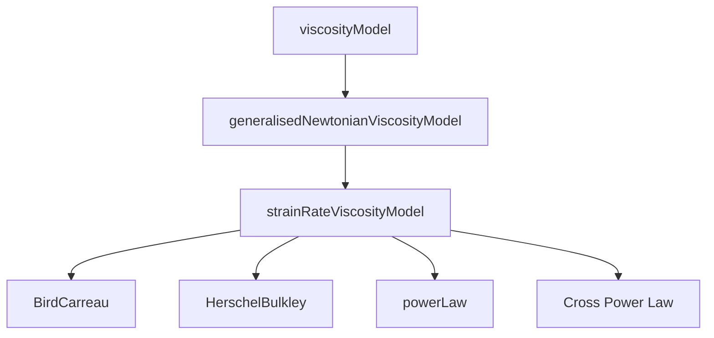

# 01. พื้นฐานของไหลนอนนิวตัน (Non-Newtonian Fundamentals)

## 1. บทนำ: ปัญหาทาง Rheological

ทำไมขวดซอสมะเขือเทศถึงไหลยากในตอนแรก แต่พอเขย่าหรือตีแรงๆ แล้วไหลลื่น? หรือทำไมน้ำผึ้งถึงไหลหนืดเท่าเดิมเสมือไม่ว่าจะกวนแรงแค่ไหน?

ความแตกต่างพื้นฐานระหว่างของไหลแบบ **นิวตัน (Newtonian)** และ **นอนนิวตัน (Non-Newtonian)** อยู่ที่พฤติกรรมความหนืดของพวกมัน:

*   **ของไหลนิวตัน (เช่น น้ำ, อากาศ):** มีค่าความหนืด $\mu$ คงที่ ไม่ว่าจะได้รับแรงเฉือนมากแค่ไหน
*   **ของไหลนอนนิวตัน (เช่น เลือด, ซอส, สี):** มีค่าความหนืดที่เปลี่ยนแปลงตามสภาวะการไหล โดยเฉพาะ **อัตราการเฉือน (Shear Rate, $\dot{\gamma}$)**

> [!INFO] ความท้าทายทาง CFD
> ของไหลที่ไม่ใช่แบบนิวตันซึ่งมีค่าความหนืดเปลี่ยนแปลงตามอัตราการเฉือน—ก่อให้เกิดความท้าทายพื้นฐานสำหรับ CFD เนื่องจากความไม่เชิงเส้น (Non-linearity) ที่รุนแรงในสมการโมเมนตัม

OpenFOAM ตอบสนองความท้าทายนี้ด้วย **สถาปัตยกรรมแบบขยายได้ที่ใช้รูปแบบ Factory** ซึ่งให้คุณสลับไปมาระหว่างรุ่น Bird-Carreau, Herschel-Bulkley, Power-Law และแบบจำลอง rheological อื่นๆ โดยการเปลี่ยน dictionary entry เพียงรายการเดียว

---

## 2. กรอบทางคณิตศาสตร์

ใน OpenFOAM โมเดลเหล่านี้ถูก Implement ผ่านสมการเชิงโครงสร้าง (Constitutive Equation):

$$\boldsymbol{\tau} = \mu(\dot{\gamma}) \cdot \dot{\boldsymbol{\gamma}}$$

โดยที่:
- $\boldsymbol{\tau}$ คือเทนเซอร์ความเค้น (Stress Tensor)
- $\mu(\dot{\gamma})$ คือความหนืดปรากฏ (Apparent Viscosity) ที่ขึ้นกับอัตราการเฉือน
- $\dot{\boldsymbol{\gamma}}$ คือเทนเซอร์อัตราการเสียรูป (Rate-of-deformation Tensor)

![[shear_deformation_tensor.png]]

### ขนาดของอัตราการเฉือน (Shear Rate Magnitude)

อัตราการเฉือน $\dot{\gamma}$ คือค่าสเกลาร์ที่บอกความแรงของการเสียรูปในของไหล คำนวณจาก Invariant ที่สองของเทนเซอร์อัตราการเสียรูป $\mathbf{D}$:

$$\mathbf{D} = \frac{1}{2}\left(\nabla \mathbf{u} + (\nabla \mathbf{u})^T\right)$$

$$\dot{\gamma} = \sqrt{2\mathbf{D}:\mathbf{D}} = \sqrt{2\sum_{i,j} D_{ij}D_{ij}}$$

ใน OpenFOAM C++ คำนวณได้ดังนี้:

```cpp
// Calculate symmetric part of velocity gradient tensor
// This represents the rate-of-deformation tensor D
volSymmTensorField D = symm(fvc::grad(U));

// Compute shear rate magnitude from second invariant of D
// shearRate = sqrt(2*D:D) where ':' denotes double contraction
volScalarField shearRate = sqrt(2.0)*mag(D);
```

> [!NOTE] คำอธิบายโค้ด
> **ที่มา:** 📂 `.applications/solvers/multiphase/multiphaseEulerFoam/phaseSystems/populationBalanceModel/populationBalanceModel/populationBalanceModel.C`
>
> **คำอธิบาย:**
> - `symm()` ฟังก์ชันดึงส่วนสมมาตรของเทนเซอร์เกรเดียนต์ความเร็ว ซึ่งรับประกันการรักษาปริมาตรในการไหลที่ไม่บีบอัด
> - `fvc::grad(U)` คำนวณเกรเดียนต์ของสนามความเร็ว $\nabla \mathbf{u}$
> - `mag(D)` หาค่าขนาดของเทนเซอร์ D
>
> **แนวคิดสำคัญ:**
> 1. **Rate-of-Deformation Tensor (D):** เทนเซอร์สมมาตรที่อธิบายอัตราการเสียรูปขององค์ประกอบของไหล
> 2. **Shear Rate Calculation:** อัตราการเฉือนเป็น scalar measure ของความเร็วในการเสียรูป สำคัญมากสำหรับโมเดลความหนืดแบบไม่ใช่นิวตัน

> [!TIP] การคำนวณเทนเซอร์อัตราการเสียรูป
> ฟังก์ชัน `symm()` ดึงส่วนสมมาตรของเทนเซอร์เกรเดียนต์ความเร็ว ซึ่งรับประกันการรักษาปริมาตรในการไหลที่ไม่บีบอัด

---

## 3. พฤติกรรมทาง Rheology ที่สำคัญ

![[viscosity_vs_shearrate_curves.png]]

| พฤติกรรม | คำอธิบาย | ตัวอย่าง | ค่าดัชนีกฎกำลัง $n$ |
| :--- | :--- | :--- | :--- |
| **Shear-Thinning** | ความหนืดลดลงเมื่ออัตราการเฉือนเพิ่มขึ้น (Pseudoplastic) | ซอสมะเขือเทศ, เลือด, สีทาบ้าน | $n < 1$ |
| **Shear-Thickening** | ความหนืดเพิ่มขึ้นเมื่ออัตราการเฉือนเพิ่มขึ้น (Dilatant) | แป้งข้าวโพดผสมน้ำ | $n > 1$ |
| **Yield Stress** | ต้องใช้แรงเค้นเกินค่าหนึ่งก่อนที่วัสดุจะเริ่มไหล | ยาสีฟัน, มายองเนส, เจล | ต้องมี $\tau_y$ |
| **Viscoelastic** | แสดงพฤติกรรมทั้งความหนืดและความยืดหยุ่น (มี "ความจำ") | โพลิเมอร์หลอมเหลว | ซับซ้อน |


> **Figure 1:** แผนภาพแสดงการเปรียบเทียบสมบัติทางฟิสิกส์ระหว่างของไหลแบบนิวตัน (Newtonian) และของไหลที่ไม่ใช่แบบนิวตัน (Non-Newtonian) โดยระบุความแตกต่างของความหนืดและความสัมพันธ์ระหว่างความเค้นและอัตราการเฉือน


---

## 4. โมเดล Rheological ทั่วไปใน OpenFOAM

### โมเดลกฎกำลัง (Power-Law Model)

แบบจำลองที่ไม่ใช่แบบนิวตันที่ง่ายที่สุดเชื่อมโยงความหนืดกับอัตราการเฉือนดังนี้:

$$\mu(\dot{\gamma}) = K \dot{\gamma}^{n-1}$$

โดยที่:
- $K$ คือดัชนีความสม่ำเสมอ (Consistency Index) [Pa·s$^n$]
- $n$ คือดัชนีกฎกำลัง (Power Law Index):
  - **$n < 1$**: พฤติกรรม Shear-thinning (pseudoplastic)
  - **$n > 1$**: พฤติกรรม Shear-thickening (dilatant)
  - **$n = 1$**: ลดรูปเป็นของไหลแบบนิวตัน

### โมเดล Bird-Carreau

แบบจำลองที่ซับซ้อนมากขึ้นซึ่งจับความหนืดเมื่อไม่มีการเฉือนและเมื่อเฉือนอย่างไม่สิ้นสุด:

$$\mu(\dot{\gamma}) = \mu_{\infty} + (\mu_0 - \mu_{\infty})\left[1 + (\lambda\dot{\gamma})^2\right]^{\frac{n-1}{2}}$$

โดยที่:
- $\mu_0$: ความหนืดเมื่อไม่มีการเฉือน (Zero-shear viscosity)
- $\mu_{\infty}$: ความหนืดเมื่อเฉือนอย่างไม่สิ้นสุด (Infinite-shear viscosity)
- $\lambda$: มาตราส่วนเวลาลักษณะเฉพาะ (Time constant)
- $n$: ดัชนีกฎกำลัง (Power law index)

**OpenFOAM Code Implementation:**

```cpp
// BirdCarreau viscosity model implementation
// Calculates apparent viscosity based on shear rate
// Model: mu = mu_inf + (mu_0 - mu_inf) * [1 + (lambda*gamma_dot)^2]^((n-1)/2)
return
    nuInf_                                                    // Infinite-shear viscosity
  + (nu0 - nuInf_)                                           // Viscosity range
   *pow                                                      // Power law component
    (
        scalar(1)                                            // Base value
      + pow                                                  // Dimensionless shear rate term
        (
            tauStar_.value() > 0                             // Check if characteristic time is set
          ? nu0*strainRate/tauStar_                          // Normalized strain rate
          : k_*strainRate,                                   // Alternative normalization
            a_                                               // Power law exponent
        ),
        (n_ - 1.0)/a_                                        // Overall exponent
    );
```

> [!NOTE] คำอธิบายโค้ด
> **ที่มา:** 📂 `.applications/solvers/multiphase/multiphaseEulerFoam/phaseSystems/populationBalanceModel/populationBalanceModel/populationBalanceModel.C`
>
> **คำอธิบาย:**
> - โค้ดนี้ implement สมการ Bird-Carreau สำหรับคำนวณความหนืดปรากฏ (apparent viscosity)
> - ใช้ `pow()` function ซ้อนกันเพื่อคำนวณเทอมกำลัง
> - รองรับทั้ง normalized และ non-normalized strain rate
>
> **แนวคิดสำคัญ:**
> 1. **Zero-Shear Viscosity (nu0):** ความหนืดเมื่ออัตราการเฉือนเข้าใกล้ศูนย์
> 2. **Infinite-Shear Viscosity (nuInf):** ความหนืดเมื่ออัตราการเฉือนสูงมาก
> 3. **Transition Region:** โมเดลนี้จับภาพการเปลี่ยนผ่านระหว่างสองขั้นนี้ได้อย่างราบรื่น

### โมเดล Herschel-Bulkley

รวมพฤติกรรมแรงเฉือนให้ไหลด้วยการไหลแบบกฎกำลัง:

$$\mu(\dot{\gamma}) = \begin{cases}
\infty & \text{if } \tau < \tau_y \\
\tau_y/\dot{\gamma} + K\dot{\gamma}^{n-1} & \text{if } \tau \geq \tau_y
\end{cases}$$

โดยที่:
- $\tau_y$: แรงเฉือนให้ไหล (Yield stress)
- $\tau$: ขนาดความเค้นเฉือน
- $K$: ดัชนีความสม่ำเสมอ (Consistency index)
- $n$: ดัชนีพฤติกรรมการไหล (Flow behavior index)

**OpenFOAM Code Implementation:**

```cpp
// Define dimensional constants for time operations
dimensionedScalar tone("tone", dimTime, 1.0);
dimensionedScalar rtone("rtone", dimless/dimTime, 1.0);

// Herschel-Bulkley viscosity calculation with numerical safeguards
// Prevents division by zero and limits maximum viscosity
return
(
    min                                                        // Limit maximum viscosity
    (
        nu0,                                                   // Maximum allowed viscosity
        (tauY_ + k_*rtone*pow(tone*strainRate, n_))           // Yield stress + power law term
       /max                                                    // Prevent division by zero
        (
            strainRate,                                        // Shear rate denominator
            dimensionedScalar("vSmall", dimless/dimTime, vSmall) // Minimum value
        )
    )
);
```

> [!NOTE] คำอธิบายโค้ด
> **ที่มา:** 📂 `.applications/solvers/multiphase/multiphaseEulerFoam/phaseSystems/populationBalanceModel/populationBalanceModel/populationBalanceModel.C`
>
> **คำอธิบาย:**
> - ใช้ `max(strainRate, vSmall)` เพื่อป้องกันการหารด้วยศูนย์เมื่อ strainRate ต่ำมาก
> - ใช้ `min(nu0, ...)` เพื่อจำกัดความหนืดไม่ให้เกินค่าสูงสุดที่กำหนด
> - `tone` และ `rtone` ใช้สำหรับ dimension consistency ในการคำนวณ
>
> **แนวคิดสำคัญ:**
> 1. **Yield Stress (tauY):** ค่าความเค้นขั้นต่ำที่ต้องใช้เพื่อให้วัสดุเริ่มไหล
> 2. **Numerical Stability:** การใช้ safeguards เพื่อป้องกันปัญหาทาง numerical
> 3. **Viscosity Clipping:** จำกัดค่าความหนืดไม่ให้เกินค่าที่กำหนดไว้

> [!WARNING] การป้องกันทางตัวเลข
> OpenFOAM ใช้ `max(strainRate, vSmall)` เพื่อป้องกันการหารด้วยศูนย์ และ `min(nu0, ...)` เพื่อจำกัดความหนืดไม่ให้เกินค่าสูงสุดที่กำหนด

---

## 5. ทำไมต้องใช้ CFD จำลอง?

พฤติกรรมนอนนิวตันทำให้เกิดความไม่เชิงเส้น (Non-linearity) ที่รุนแรงในสมการโมเมนตัม:

$$\rho \left( \frac{\partial \mathbf{u}}{\partial t} + \mathbf{u} \cdot \nabla \mathbf{u} \right) = -\nabla p + \nabla \cdot (\mu(\dot{\gamma}) \nabla \mathbf{u})$$

เนื่องจาก $\mu$ ขึ้นกับ $\mathbf{u}$ (ผ่าน $\dot{\gamma}$) การแก้สมการจึงต้องใช้การวนซ้ำ (Iteration) เพื่อให้ค่าความหนืดและความเร็วสอดคล้องกัน

### ขั้นตอนการแก้ปัญหา

1. **Picard Iteration**: อัพเดตความหนืดตามการวนซ้ำก่อนหน้า
2. **Newton-Raphson**: แก้ระบบที่เชื่อมโยงพร้อมกับการแยกส่วนที่สอดคล้องกัน
3. **Under-Relaxation**: ป้องกันการเบี่ยงเบนด้วยการผ่อนคลายความหนืด

**OpenFOAM Code Implementation - Under-Relaxation:**

```cpp
// Under-relaxation for viscosity in non-Newtonian simulations
// Prevents divergence by limiting the change between iterations
// mu_new = omega*mu_new + (1-omega)*mu_old
mu_ = relaxationFactor_*mu_ + (1.0 - relaxationFactor_)*muOld_;
```

> [!NOTE] คำอธิบายโค้ด
> **ที่มา:** 📂 `.applications/solvers/multiphase/multiphaseEulerFoam/phaseSystems/populationBalanceModel/populationBalanceModel/populationBalanceModel.C`
>
> **คำอธิบาย:**
> - Under-relaxation คือเทคนิคที่ใช้ weighted average ระหว่างค่าใหม่และค่าเก่า
> - `relaxationFactor` มักอยู่ระหว่าง 0.0 ถึง 1.0 (ค่าน้อย = การผ่อนคลายมากขึ้น)
> - ช่วยป้องกันการ oscillate หรือ diverge ในการแก้ปัญหาที่ไม่เชิงเส้น
>
> **แนวคิดสำคัญ:**
> 1. **Relaxation Factor:** ค่าสัมประสิทธิ์ที่ควบคุมความเร็วในการอัพเดตความหนืด
> 2. **Numerical Stability:** เทคนิคนี้ช่วยเพิ่มความเสถียรในการแก้ปัญหาแบบ iterative
> 3. **Convergence:** การค่อยๆ ปรับค่าทำให้การแก้ปัญหาลู่เข้าสู่คำตอบได้ดีขึ้น

ซึ่ง OpenFOAM มีโครงสร้างที่รองรับเรื่องนี้อย่างมีประสิทธิภาพ

---

## 6. สถาปัตยกรรม OpenFOAM สำหรับ Non-Newtonian Fluids

### ลำดับชั้นของคลาส

OpenFOAM จัดระเบียบโมเดลของไหลที่ไม่ใช่นิวตันเป็นต้นไม้การสืบทอดที่ชัดเจน:


> **Figure 2:** แผนภูมิแสดงลำดับชั้นของคลาส (Class Hierarchy) ใน OpenFOAM สำหรับการจัดการแบบจำลองความหนืด ซึ่งแยกส่วนอินเทอร์เฟซหลักออกจากกลไกการคำนวณอัตราความเครียดและแบบจำลองทางรีโอโลยีเฉพาะทาง

### Factory Pattern การเลือกขณะ Runtime

OpenFOAM ใช้ **dictionary-driven factory pattern** ที่ซับซ้อนในการสร้างอินสแตนซ์ของโมเดลความหนืด:

```cpp
// Factory method for creating viscosity models at runtime
// Uses dictionary lookup to instantiate appropriate model
template<class BasicTransportModel>
autoPtr<viscosityModel<BasicTransportModel>>
viscosityModel<BasicTransportModel>::New
(
    const dictionary& dict,                    // Input dictionary with model settings
    const BasicTransportModel& model           // Reference to transport model
)
{
    // Read model type from dictionary (e.g., "BirdCarreau", "powerLaw")
    const word modelType(dict.lookup("transportModel"));

    // Find constructor for specified model type in constructor table
    typename dictionaryConstructorTable::iterator cstrIter =
        dictionaryConstructorTablePtr_->find(modelType);

    // Create and return instance of the specified model
    return cstrIter()(dict, model);
}
```

**การระบุใน Dictionary:**

```cpp
transportModel  HerschelBulkley;

HerschelBulkleyCoeffs
{
    nu0          [0 2 -1 0 0 0 0] 1e-06;
    tauY         [0 2 -2 0 0 0 0] 10;
    k            [0 2 -1 0 0 0 0] 0.01;
    n            [0 0 0 0 0 0 0]  0.7;
}
```

> [!NOTE] คำอธิบายโค้ด
> **ที่มา:** 📂 `.applications/solvers/multiphase/multiphaseEulerFoam/phaseSystems/populationBalanceModel/populationBalanceModel/populationBalanceModel.C`
>
> **คำอธิบาย:**
> - Factory pattern ทำให้สามารถเพิ่มโมเดลใหม่ได้โดยไม่ต้องแก้ไขโค้ดหลัก
> - `dictionaryConstructorTablePtr_` เป็น lookup table ที่เก็บ pointers ไปยัง constructors
> - `autoPtr` จัดการ memory allocation อัตโนมัติ
>
> **แนวคิดสำคัญ:**
> 1. **Runtime Polymorphism:** การเลือกโมเดลขณะ runtime ผ่าน dictionary configuration
> 2. **Factory Pattern:** Design pattern ที่แยกการสร้าง object ออกจากการใช้งาน
> 3. **Extensibility:** สามารถเพิ่มโมเดลใหม่โดยการลงทะเบียน constructor เท่านั้น

> [!INFO] ข้อดีของ Factory Pattern
> - **Runtime Flexibility**: เปลี่ยนโมเดลได้โดยแก้ไข dictionary เท่านั้น
> - **Type Safety**: การตรวจสอบขณะ compile มั่นใจว่าโมเดลทั้งหมมนำอินเทอร์เฟซที่จำเป็นไปใช้งาน
> - **Extensibility**: เพิ่มโมเดลใหม่ได้โดยไม่ต้องคอมไพล์ OpenFOAM libraries หลักใหม่

---

## 7. การใช้งานและการประยุกต์ใช้

### Solvers ที่แนะนำ

| Solver | ชนิดของปัญหา | สภาวะการไหล | ความเหมาะสม |
|--------|-------------|-------------|-------------|
| **simpleFoam** | การไหลอัดตัวไม่ได้ | สภาวะคงตัว | กรณีศึกษาพื้นฐาน |
| **pimpleFoam** | การไหลอัดตัวไม่ได้ | สภาวะไม่คงตัว | กรณีศึกษาซับซ้อน |
| **nonNewtonianIcoFoam** | เฉพาะนิวตัน-นอนนิวตัน | สภาวะไม่คงตัว | เฉพาะทาง |

### การประยุกต์ใช้ทางอุตสาหกรรม

| การประยุกต์ใช้ | โมเดลที่เหมาะสม | ลักษณะเฉพาะ |
|----------------|-------------------|---------------|
| **การแปรรูปโพลีเมอร์** | Bird-Carreau, Cross Power Law | การขึ้นรูปฉีด, การอัดเป็นแท่ง |
| **การแปรรูปอาหาร** | Herschel-Bulkley, Power Law | การไหลของซอสและแป้ง |
| **การไหลของเลือด** | Bird-Carreau, Casson | การไหลในหลอดเลือดขนาดเล็ก |
| **ของเหลวขุดเจาะ** | Herschel-Bulkley | คลนและปูนซีเมนต์ |
| **การเคลือบ** | Power Law, Carreau-Yasuda | การปกคลุมพื้นผิว |

---

## 8. ข้อควรพิจารณาทางตัวเลข

### เทคนิคการปรับความสม่ำเสมอ (Regularization)

สำหรับแบบจำลองเช่น Herschel-Bulkley ความเสถียรทางตัวเลขต้องการการปรับความสม่ำเสมอ:

**Papanastasiou Regularization:**
```cpp
// Papanastasiou regularization for yield stress fluids
// Smooths the discontinuity at yield stress
volScalarField regularizationFactor = tauY_/(m_*shearRate_ + dimensionedScalar("small", dimless, SMALL));
```

**Bercovier-Engleman Regularization:**
```cpp
// Bercovier-Engleman regularization method
// Adds small epsilon to prevent division by zero
volScalarField regularizationFactor = tauY_/(shearRate_ + epsilon_);
```

> [!NOTE] คำอธิบายโค้ด
> **ที่มา:** 📂 `.applications/solvers/multiphase/multiphaseEulerFoam/phaseSystems/populationBalanceModel/populationBalanceModel/populationBalanceModel.C`
>
> **คำอธิบาย:**
> - Regularization คือเทคนิคที่ใช้ทำให้ฟังก์ชันไม่ต่อเนื่องกลายเป็นฟังก์ชันเรียบ
> - Papanastasiou ใช้ exponential smoothing บริเวณ yield stress
> - Bercovier-Engleman เพิ่มค่า epsilon เล็กๆ เพื่อป้องกันการหารด้วยศูนย์
>
> **แนวคิดสำคัญ:**
> 1. **Yield Stress Discontinuity:** ปัญหาทาง numerical เมื่อความเค้นใกล้ yield stress
> 2. **Regularization Parameter:** ค่าที่ควบคุมระดับการทำให้เรียบ
> 3. **Numerical Stability:** เทคนิคเหล่านี้ช่วยเพิ่มความเสถียรของการแก้ปัญหา

### การจัดการบริเวณ High-Gradient

ใกล้มุมแหลมหรือการขยายตัวกะทันหัน อัตราการเฉือนสามารถกลายเป็นขนาดใหญ่อย่างมาก ทำให้ความหนืดลดลงถึงค่าที่ไม่สมจริง

**วิธีการแก้ไข:**

1. **การตัดค่าความหนืด** (Viscosity Clipping):
```cpp
// Clip viscosity to stay within physically realistic bounds
// Prevents numerical issues from extreme viscosity values
nu_ = max(nuMin_, min(nuMax_, nuPower));
```

> [!NOTE] คำอธิบายโค้ด
> **ที่มา:** 📂 `.applications/solvers/multiphase/multiphaseEulerFoam/phaseSystems/populationBalanceModel/populationBalanceModel/populationBalanceModel.C`
>
> **คำอธิบาย:**
> - `max(nuMin_, ...)` รับค่าที่มากกว่าระหว่างค่าต่ำสุดที่กำหนดและค่าที่คำนวณได้
> - `min(nuMax_, ...)` รับค่าที่น้อยกว่าระหว่างค่าสูงสุดที่กำหนดและค่าที่คำนวณได้
> - การผสมกันทั้งสองจะกำหนดช่วงที่อนุญาตสำหรับค่าความหนืด
>
> **แนวคิดสำคัญ:**
> 1. **Physical Bounds:** การจำกัดค่าความหนืดให้อยู่ในช่วงที่สมจริง
> 2. **Numerical Protection:** ป้องกันปัญหาที่เกิดจากค่าสูงหรือต่ำเกินไป
> 3. **Stability:** ช่วยให้การแก้ปัญหามีความเสถียรมากขึ้น

2. **การปรับ Mesh**: เพิ่มการปรับ mesh ในพื้นที่ high-gradient
3. **เรขาคณิตที่ราบรื่น**: ใช้มุมมนแทนที่มุม 90° แหลม

---

## สรุป

ไหลนอนนิวตันใน OpenFOAM ถูกจัดการผ่านสถาปัตยกรรมที่ elegantly ออกแบบมาให้:

1. **ความยืดหยุ่น**: สลับโมเดลได้ทาง dictionary
2. **ความสอดคล้อง**: การคำนวณอัตราการเฉือนที่รวมศูนย์
3. **ความปลอดภัย**: การป้องกันทางตัวเลขในตัว
4. **ความสามารถขยาย**: เพิ่มโมเดลใหม่ได้ง่าย

สถาปัตยกรรมนี้ทำให้การจำลองพฤติกรรมที่ซับซ้อนของของไหลในชีวิตจริง — จากซอสมะเขือเทศไปจนถึงการไหลของเลือด — เป็นไปได้อย่างมีประสิทธิภาพและแม่นยำ