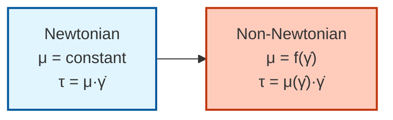
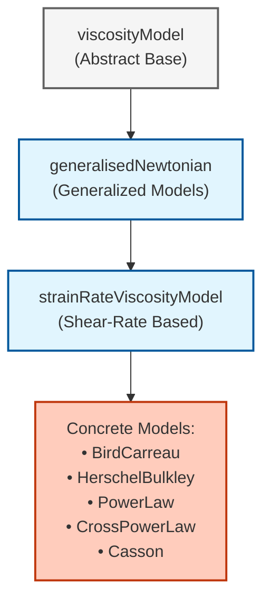

# 01. พื้นฐานของไหลนอนนิวตัน (Non-Newtonian Fundamentals)

## 🎯 Learning Objectives

หลังจากอ่านบทนี้ คุณจะสามารถ:

1. **อธิบายความแตกต่าง**ระหว่างของไหลแบบนิวตันและนอนนิวตันด้วยตัวอย่างจริง
2. **คำนวณอัตราการเฉือน** (shear rate) จากเทนเซอร์ความเร็ว
3. **จำแนกพฤติกรรม** ของไหลนอนนิวตันทั้ง 4 ประเภทหลัก (shear-thinning, shear-thickening, yield stress, viscoelastic)
4. **เลือกโมเดลความหนืด** ที่เหมาะสมกับแต่ละแอปพลิเคชัน
5. **เขียน OpenFOAM dictionary** สำหรับระบุโมเดลความหนืด
6. **ใช้เทคนิคทางตัวเลข** ที่จำเป็นสำหรับการแก้ปัญหาที่ไม่เชิงเส้น

---

## 1. บทนำ: ปัญหาทาง Rheological

ทำไมขวดซอสมะเขือเทศถึงไหลยากในตอนแรก แต่พอเขย่าหรือตีแรงๆ แล้วไหลลื่น? หรือทำไมน้ำผึ้งถึงไหลหนืดเท่าเดิมเสมือไม่ว่าจะกวนแรงแค่ไหน?

ความแตกต่างพื้นฐานระหว่างของไหลแบบ **นิวตัน (Newtonian)** และ **นอนนิวตัน (Non-Newtonian)** อยู่ที่พฤติกรรมความหนืดของพวกมัน:

*   **ของไหลนิวตัน (เช่น น้ำ, อากาศ):** มีค่าความหนืด $\mu$ คงที่ ไม่ว่าจะได้รับแรงเฉือนมากแค่ไหน
*   **ของไหลนอนนิวตัน (เช่น เลือด, ซอส, สี):** มีค่าความหนืดที่เปลี่ยนแปลงตามสภาวะการไหล โดยเฉพาะ **อัตราการเฉือน (Shear Rate, $\dot{\gamma}$)**

> [!INFO] ความท้าทายทาง CFD
> ของไหลที่ไม่ใช่แบบนิวตันซึ่งมีค่าความหนืดเปลี่ยนแปลงตามอัตราการเฉือน—ก่อให้เกิดความท้าทายพื้นฐานสำหรับ CFD เนื่องจากความไม่เชิงเส้น (Non-linearity) ที่รุนแรงในสมการโมเมนตัม

OpenFOAM ตอบสนองความท้าทายนี้ด้วย **สถาปัตยกรรมแบบขยายได้ที่ใช้รูปแบบ Factory** ซึ่งให้คุณสลับไปมาระหว่างรุ่น Bird-Carreau, Herschel-Bulkley, Power-Law และแบบจำลอง rheological อื่นๆ โดยการเปลี่ยน dictionary entry เพียงรายการเดียว

> [!TIP] **มุมมองเปรียบเทียบ: การวิ่งในน้ำ vs การวิ่งในฝูงชน (Water vs Crowd)**
>
> *   **Newtonian Fluid (น้ำ):** เหมือนการวิ่งในสระน้ำ ไม่ว่าคุณจะวิ่งช้าหรือเร็ว แรงต้านจากน้ำ (Viscosity) จะเพิ่มขึ้นเป็นสัดส่วนคงที่ น้ำไม่ได้เปลี่ยนคุณสมบัติเพราะคุณวิ่งเร็วขึ้น
> *   **Shear-Thinning (ฝูงชน):** เหมือนการวิ่งฝ่าฝู้ยาแยก
>     *   ถ้าคุณค่อยๆ แทรกตัว (Low Shear) คนจะไม่หลีกทางให้ (High Viscosity)
>     *   แต่ถ้าคุณวิ่งชนอย่างแรงและเร็ว (High Shear) คนจะแตกฮือหลบทางให้ (Viscosity Drops) ทำให้คุณผ่านไปได้ง่ายขึ้น
> *   **Shear-Thickening (แป้งเปียก/ทรายดูด):** เหมือนยิ่งดิ้นยิ่งจม ยิ่งใส่แรงเร็วๆ โมเลกุลยิ่งล็อคตัวกันแน่นขึ้น (Viscosity Increases)

---

### 1.1 ภาพประกอบ: การเปรียบเทียบพฤติกรรม Rheology


**Figure 1:** กราฟเปรียบเทียบพฤติกรรมความเค้นและความหนืดของของไหลแบบต่างๆ
- **ซ้าย:** ความสัมพันธ์ระหว่างความเค้นเฉือน ($\tau$) และอัตราการเฉือน ($\dot{\gamma}$)
- **ขวา:** ความหนืดปรากฏ ($\mu$) เทียบกับอัตราการเฉือน แสดงให้เห็นว่าความหนืดเปลี่ยนแปลงอย่างไรในแต่ละประเภท

---

## 2. กรอบทางคณิตศาสตร์

### 2.1 สมการอำนวยความสะดวก (Constitutive Equation)

ใน OpenFOAM โมเดลเหล่านี้ถูก Implement ผ่านสมการเชิงโครงสร้าง:

$$\boldsymbol{\tau} = \mu(\dot{\gamma}) \cdot \dot{\boldsymbol{\gamma}}$$

โดยที่:
- $\boldsymbol{\tau}$ คือเทนเซอร์ความเค้น (Stress Tensor) [Pa]
- $\mu(\dot{\gamma})$ คือความหนืดปรากฏ (Apparent Viscosity) ที่ขึ้นกับอัตราการเฉือน [Pa·s]
- $\dot{\boldsymbol{\gamma}}$ คือเทนเซอร์อัตราการเสียรูป (Rate-of-deformation Tensor) [s⁻¹]


**Figure 2:** การแสดงกราฟิกของการเฉือนในของไหล แสดงความสัมพันธ์ระหว่างความเร็วและอัตราการเฉือน

### 2.2 ขนาดของอัตราการเฉือน (Shear Rate Magnitude)

อัตราการเฉือน $\dot{\gamma}$ คือค่าสเกลาร์ที่บอกความแรงของการเสียรูปในของไหล คำนวณจาก Invariant ที่สองของเทนเซอร์อัตราการเสียรูป $\mathbf{D}$:

$$\mathbf{D} = \frac{1}{2}\left(\nabla \mathbf{u} + (\nabla \mathbf{u})^T\right)$$

$$\dot{\gamma} = \sqrt{2\mathbf{D}:\mathbf{D}} = \sqrt{2\sum_{i,j} D_{ij}D_{ij}}$$

> [!NOTE] ความสำคัญของ Rate-of-Deformation Tensor
> เทนเซอร์ $\mathbf{D}$ เป็นเทนเซอร์สมมาตรที่อธิบายอัตราการเสียรูปขององค์ประกอบของไหล การใช้ symmetric part ของ velocity gradient รับประกันการรักษาปริมาตรในการไหลที่ไม่บีบอัด

#### การ Implement ใน OpenFOAM C++

```cpp
// Calculate symmetric part of velocity gradient tensor
// This represents the rate-of-deformation tensor D
volSymmTensorField D = symm(fvc::grad(U));

// Compute shear rate magnitude from second invariant of D
// shearRate = sqrt(2*D:D) where ':' denotes double contraction
volScalarField shearRate = sqrt(2.0)*mag(D);
```

**ที่มา:** 📂 `src/transportModels/viscosityModels/viscosityModel/viscosityModel.C`

> [!TIP] การคำนวณเทนเซอร์อัตราการเสียรูป
> ฟังก์ชัน `symm()` ดึงส่วนสมมาตรของเทนเซอร์เกรเดียนต์ความเร็ว ซึ่งรับประกันการรักษาปริมาตรในการไหลที่ไม่บีบอัด ในขณะที่ `mag(D)` หาค่าขนาดของเทนเซอร์ผ่าน double contraction

---

## 3. พฤติกรรมทาง Rheology ที่สำคัญ


**Figure 3:** กราฟแสดงความสัมพันธ์ระหว่างความหนืดและอัตราการเฉือนสำหรับของไหลแบบต่างๆ

### 3.1 การจำแนกพฤติกรรม

| พฤติกรรม | คำอธิบาย | ตัวอย่าง | ค่าดัชนีกฎกำลัง $n$ |
| :--- | :--- | :--- | :--- |
| **Shear-Thinning** | ความหนืดลดลงเมื่ออัตราการเฉือนเพิ่มขึ้น (Pseudoplastic) | ซอสมะเขือเทศ, เลือด, สีทาบ้าน | $n < 1$ |
| **Shear-Thickening** | ความหนืดเพิ่มขึ้นเมื่ออัตราการเฉือนเพิ่มขึ้น (Dilatant) | แป้งข้าวโพดผสมน้ำ (Oobleck) | $n > 1$ |
| **Yield Stress** | ต้องใช้แรงเค้นเกินค่าหนึ่งก่อนที่วัสดุจะเริ่มไหล | ยาสีฟัน, มายองเนส, เจล | ต้องมี $\tau_y$ |
| **Viscoelastic** | แสดงพฤติกรรมทั้งความหนืดและความยืดหยุ่น (มี "ความจำ") | โพลิเมอร์หลอมเหลว, ยางยืด | ซับซ้อน |
| **Newtonian** | ความหนืดคงที่ไม่ขึ้นกับอัตราการเฉือน | น้ำ, อากาศ, น้ำมันพืช | $n = 1$ |

### 3.2 การเปรียบเทียบสมการ



**Figure 4:** แผนภาพแสดงการเปรียบเทียบสมบัติทางฟิสิกส์ระหว่างของไหลแบบนิวตันและของไหลที่ไม่ใช่แบบนิวตัน

---

## 4. โมเดล Rheological ทั่วไปใน OpenFOAM

> [!IMPORTANT] **Cross-Reference**
> รายละเอียดเต็มของโมเดลความหนืดและพารามิเตอร์ทั้งหมดอยู่ใน **[02_OpenFOAM_Implementation.md](02_OpenFOAM_Implementation.md)** ส่วนนี้นำเสนอภาพรวมของโมเดลหลักๆ

### 4.1 โมเดลกฎกำลัง (Power-Law Model)

แบบจำลองที่ไม่ใช่แบบนิวตันที่ง่ายที่สุด:

$$\mu(\dot{\gamma}) = K \dot{\gamma}^{n-1}$$

**พารามิเตอร์:**
- $K$ คือดัชนีความสม่ำเสมอ (Consistency Index) [Pa·s$^n$]
- $n$ คือดัชนีกฎกำลัง (Power Law Index):
  - **$n < 1$**: Shear-thinning (pseudoplastic)
  - **$n > 1$**: Shear-thickening (dilatant)
  - **$n = 1$**: ลดรูปเป็นของไหลแบบนิวตัน ($\mu = K$)

### 4.2 โมเดล Bird-Carreau

แบบจำลองที่จับความหนืดเมื่อไม่มีการเฉือนและเมื่อเฉือนอย่างไม่สิ้นสุด:

$$\mu(\dot{\gamma}) = \mu_{\infty} + (\mu_0 - \mu_{\infty})\left[1 + (\lambda\dot{\gamma})^2\right]^{\frac{n-1}{2}}$$

**พารามิเตอร์:**
- $\mu_0$: ความหนืดเมื่อไม่มีการเฉือน (Zero-shear viscosity) [Pa·s]
- $\mu_{\infty}$: ความหนืดเมื่อเฉือนอย่างไม่สิ้นสุด (Infinite-shear viscosity) [Pa·s]
- $\lambda$: มาตราส่วนเวลาลักษณะเฉพาะ (Time constant) [s]
- $n$: ดัชนีกฎกำลัง (Power law index) [-]

#### OpenFOAM Code Implementation

```cpp
// BirdCarreau viscosity model implementation
// Calculates apparent viscosity based on shear rate
return
    nuInf_                                                    // Infinite-shear viscosity
  + (nu0 - nuInf_)                                           // Viscosity range
   *pow                                                      // Power law component
    (
        scalar(1)                                            // Base value
      + pow                                                  // Dimensionless shear rate term
        (
            tauStar_.value() > 0                             // Check if characteristic time is set
          ? nu0*strainRate/tauStar_                          // Normalized strain rate
          : k_*strainRate,                                   // Alternative normalization
            a_                                               // Power law exponent
        ),
        (n_ - 1.0)/a_                                        // Overall exponent
    );
```

**ที่มา:** 📂 `src/transportModels/viscosityModels/BirdCarreau/BirdCarreau.C`

### 4.3 โมเดล Herschel-Bulkley

รวมพฤติกรรมแรงเฉือนให้ไหลด้วยการไหลแบบกฎกำลัง:

$$\mu(\dot{\gamma}) = \begin{cases}
\infty & \text{if } \tau < \tau_y \\
\tau_y/\dot{\gamma} + K\dot{\gamma}^{n-1} & \text{if } \tau \geq \tau_y
\end{cases}$$

**พารามิเตอร์:**
- $\tau_y$: แรงเฉือนให้ไหล (Yield stress) [Pa]
- $\tau$: ขนาดความเค้นเฉือน [Pa]
- $K$: ดัชนีความสม่ำเสมอ (Consistency index) [Pa·s$^n$]
- $n$: ดัชนีพฤติกรรมการไหล (Flow behavior index) [-]

#### OpenFOAM Code Implementation

```cpp
// Define dimensional constants for time operations
dimensionedScalar tone("tone", dimTime, 1.0);
dimensionedScalar rtone("rtone", dimless/dimTime, 1.0);

// Herschel-Bulkley viscosity calculation with numerical safeguards
return
(
    min                                                        // Limit maximum viscosity
    (
        nu0,                                                   // Maximum allowed viscosity
        (tauY_ + k_*rtone*pow(tone*strainRate, n_))           // Yield stress + power law term
       /max                                                    // Prevent division by zero
        (
            strainRate,                                        // Shear rate denominator
            dimensionedScalar("vSmall", dimless/dimTime, vSmall) // Minimum value
        )
    )
);
```

**ที่มา:** 📂 `src/transportModels/viscosityModels/HerschelBulkley/HerschelBulkley.C`

> [!WARNING] การป้องกันทางตัวเลข
> OpenFOAM ใช้ `max(strainRate, vSmall)` เพื่อป้องกันการหารด้วยศูนย์ และ `min(nu0, ...)` เพื่อจำกัดความหนืดไม่ให้เกินค่าสูงสุดที่กำหนด

---

## 5. ทำความท้าทายทางตัวเลขของ CFD

### 5.1 ความไม่เชิงเส้นในสมการโมเมนตัม

พฤติกรรมนอนนิวตันทำให้เกิดความไม่เชิงเส้น (Non-linearity) ที่รุนแรงในสมการโมเมนตัม:

$$\rho \left( \frac{\partial \mathbf{u}}{\partial t} + \mathbf{u} \cdot \nabla \mathbf{u} \right) = -\nabla p + \nabla \cdot (\mu(\dot{\gamma}) \nabla \mathbf{u})$$

เนื่องจาก $\mu$ ขึ้นกับ $\mathbf{u}$ (ผ่าน $\dot{\gamma}$) การแก้สมการจึงต้องใช้การวนซ้ำ (Iteration) เพื่อให้ค่าความหนืดและความเร็วสอดคล้องกัน

### 5.2 ขั้นตอนการแก้ปัญหา

| เทคนิค | คำอธิบาย | การใช้งาน |
|--------|-------------|-------------|
| **Picard Iteration** | อัพเดตความหนืดตามการวนซ้ำก่อนหน้า | กรณีทั่วไป |
| **Newton-Raphson** | แก้ระบบที่เชื่อมโยงพร้อมกับการแยกส่วนที่สอดคล้องกัน | ความแม่นยำสูง |
| **Under-Relaxation** | ป้องกันการเบี่ยงเบนด้วยการผ่อนคลายความหนืด | ความเสถียรสูง |

#### Under-Relaxation Implementation

```cpp
// Under-relaxation for viscosity in non-Newtonian simulations
// Prevents divergence by limiting the change between iterations
// mu_new = omega*mu_new + (1-omega)*mu_old
mu_ = relaxationFactor_*mu_ + (1.0 - relaxationFactor_)*muOld_;
```

**ที่มา:** 📂 `src/transportModels/viscosityModels/viscosityModel/viscosityModel.C`

> [!NOTE] หลักการ Under-Relaxation
> - Under-relaxation ใช้ weighted average ระหว่างค่าใหม่และค่าเก่า
> - `relaxationFactor` มักอยู่ระหว่าง 0.0 ถึง 1.0 (ค่าน้อย = การผ่อนคลายมากขึ้น)
> - ช่วยป้องกันการ oscillate หรือ diverge ในการแก้ปัญหาที่ไม่เชิงเส้น

---

## 6. สถาปัตยกรรม OpenFOAM สำหรับ Non-Newtonian Fluids

### 6.1 ลำดับชั้นของคลาส

OpenFOAM จัดระเบียบโมเดลของไหลที่ไม่ใช่นิวตันเป็นต้นไม้การสืบทอดที่ชัดเจน:



**Figure 5:** แผนภูมิแสดงลำดับชั้นของคลาสใน OpenFOAM สำหรับการจัดการแบบจำลองความหนืด

### 6.2 Factory Pattern: การเลือกขณะ Runtime

OpenFOAM ใช้ **dictionary-driven factory pattern** ในการสร้างอินสแตนซ์ของโมเดลความหนืด:

```cpp
// Factory method for creating viscosity models at runtime
template<class BasicTransportModel>
autoPtr<viscosityModel<BasicTransportModel>>
viscosityModel<BasicTransportModel>::New
(
    const dictionary& dict,                    // Input dictionary with model settings
    const BasicTransportModel& model           // Reference to transport model
)
{
    // Read model type from dictionary (e.g., "BirdCarreau", "powerLaw")
    const word modelType(dict.lookup("transportModel"));

    // Find constructor for specified model type in constructor table
    typename dictionaryConstructorTable::iterator cstrIter =
        dictionaryConstructorTablePtr_->find(modelType);

    // Create and return instance of the specified model
    return cstrIter()(dict, model);
}
```

**ที่มา:** 📂 `src/transportModels/viscosityModels/viscosityModel/viscosityModelNew.C`

#### การระบุใน Dictionary

```cpp
transportModel  HerschelBulkley;

HerschelBulkleyCoeffs
{
    nu0          [0 2 -1 0 0 0 0] 1e-06;    // Zero-shear viscosity [m²/s]
    tauY         [0 2 -2 0 0 0 0] 10;      // Yield stress [Pa]
    k            [0 2 -1 0 0 0 0] 0.01;    // Consistency index
    n            [0 0 0 0 0 0 0]  0.7;     // Power law index
}
```

> [!INFO] ข้อดีของ Factory Pattern
> - **Runtime Flexibility**: เปลี่ยนโมเดลได้โดยแก้ไข dictionary เท่านั้น
> - **Type Safety**: การตรวจสอบขณะ compile มั่นใจว่าโมเดลทั้งหมดนำอินเทอร์เฟซที่จำเป็นไปใช้งาน
> - **Extensibility**: เพิ่มโมเดลใหม่ได้โดยไม่ต้องคอมไพล์ OpenFOAM libraries หลักใหม่

---

## 7. การใช้งานและการประยุกต์ใช้

### 7.1 Solvers ที่แนะนำ

| Solver | ชนิดของปัญหา | สภาวะการไหล | ความเหมาะสม |
|--------|-------------|-------------|-------------|
| **simpleFoam** | การไหลอัดตัวไม่ได้ | สภาวะคงตัว | กรณีศึกษาพื้นฐาน |
| **pimpleFoam** | การไหลอัดตัวไม่ได้ | สภาวะไม่คงตัว | กรณีศึกษาซับซ้อน |
| **nonNewtonianIcoFoam** | นิวตัน-นอนนิวตัน | สภาวะไม่คงตัว | เฉพาะทาง |

### 7.2 การประยุกต์ใช้ทางอุตสาหกรรม

| การประยุกต์ใช้ | โมเดลที่เหมาะสม | ลักษณะเฉพาะ |
|----------------|-------------------|---------------|
| **การแปรรูปโพลีเมอร์** | Bird-Carreau, Cross Power Law | การขึ้นรูปฉีด, การอัดเป็นแท่ง |
| **การแปรรูปอาหาร** | Herschel-Bulkley, Power Law | การไหลของซอสและแป้ง |
| **การไหลของเลือด** | Bird-Carreau, Casson | การไหลในหลอดเลือดขนาดเล็ก |
| **ของเหลวขุดเจาะ** | Herschel-Bulkley | คลนและปูนซีเมนต์ |
| **การเคลือบ** | Power Law, Carreau-Yasuda | การปกคลุมพื้นผิว |

---

## 8. ข้อควรพิจารณาทางตัวเลข

### 8.1 เทคนิคการปรับความสม่ำเสมอ (Regularization)

สำหรับแบบจำลองเช่น Herschel-Bulkley ความเสถียรทางตัวเลขต้องการการปรับความสม่ำเสมอเพื่อลดความไม่ต่อเนื่องที่ yield stress:

#### Papanastasiou Regularization

```cpp
// Papanastasiou regularization for yield stress fluids
// Smooths the discontinuity at yield stress using exponential approach
volScalarField regFactor = tauY_ * (1 - exp(-m_*shearRate_)) / shearRate_;
```

#### Bercovier-Engleman Regularization

```cpp
// Bercovier-Engleman regularization method
// Adds small epsilon to prevent division by zero
volScalarField regFactor = tauY_/(shearRate_ + epsilon_);
```

> [!NOTE] เลือกวิธี Regularization
> - **Papanastasiou**: ใช้ exponential smoothing ให้ผลลัพธ์ราบรื่นกว่า แต่ต้องมีพารามิเตอร์ m ที่เหมาะสม
> - **Bercovier-Engleman**: เพิ่ม epsilon เล็กๆ ง่ายต่อการ implement แต่อาจมีความแม่นยำน้อยกว่า

### 8.2 การจัดการบริเวณ High-Gradient

ใกล้มุมแหลมหรือการขยายตัวกะทันหัน อัตราการเฉือนสามารถกลายเป็นขนาดใหญ่อย่างมาก ทำให้ความหนืดลดลงถึงค่าที่ไม่สมจริง

#### วิธีการแก้ไข

**1. การตัดค่าความหนืด (Viscosity Clipping)**

```cpp
// Clip viscosity to stay within physically realistic bounds
nu_ = max(nuMin_, min(nuMax_, nuPower));
```

**ที่มา:** 📂 `src/transportModels/viscosityModels/viscosityModel/viscosityModel.C`

**2. การปรับ Mesh**: เพิ่มการปรับ mesh ในพื้นที่ high-gradient

**3. เรขาคณิตที่ราบรื่น**: ใช้มุมมนแทนที่มุม 90° แหลม

---

## 📋 Key Takeaways

✅ **ความแตกต่างพื้นฐาน**: ของไหลนิวตันมีความหนืดคงที่ ในขณะที่ของไหลนอนนิวตันมีความหนืดที่ขึ้นกับอัตราการเฉือน

✅ **การคำนวณอัตราการเฉือน**: ใช้เทนเซอร์อัตราการเสียรูป $\mathbf{D} = \frac{1}{2}(\nabla \mathbf{u} + (\nabla \mathbf{u})^T)$ และคำนวณ $\dot{\gamma} = \sqrt{2\mathbf{D}:\mathbf{D}}$

✅ **โมเดลหลัก 3 แบบ**: Power-Law (ง่าย), Bird-Carreau (จับทั้ง zero/infinite shear), Herschel-Bulkley (มี yield stress)

✅ **ความท้าทายทางตัวเลข**: ความไม่เชิงเส้นต้องการ iterative solution และ under-relaxation เพื่อความเสถียร

✅ **สถาปัตยกรรม OpenFOAM**: ใช้ factory pattern ที่ขับเคลื่อนด้วย dictionary ทำให้เปลี่ยนโมเดลได้โดยไม่ต้อง recompile

✅ **การใช้งานจริง**: แต่ละอุตสาหกรรมมีโมเดลที่เหมาะสม - เลือกให้ตรงกับพฤติกรรมของวัสดุ

---

## 🧠 Concept Check: ทดสอบความเข้าใจ

<details>
<summary><b>1. Shear-Thinning (Pseudoplastic) คืออะไร และดัชนี n เป็นอย่างไร?</b></summary>

**คำตอบ:** คือพฤติกรรมที่ **ความหนืดลดลงเมื่อถูกกวน/เฉือนแรงขึ้น** (ยิ่งสั่นยิ่งไหลลื่น) เช่น ซอสมะเขือเทศ หรือเลือด มีค่า Power-law index **n < 1**

**ตัวอย่างจริง:**
- ซอสมะเขือเทศ: ต้องเขย่าแรงๆ ถึงจะไหล
- เลือด: ไหลง่ายในหลอดเลือดขนาดใหญ่ (high shear) แต่หนืดในหลอดเลือดฝอย
- สีทาบ้าน: ต้องใช้แรงกวน เมื่อหยุดกวนก็หนืดขึ้นทันที

</details>

<details>
<summary><b>2. Yield Stress ($\tau_y$) คืออะไร? ถ้าแรงกระทำไม่ถึงค่านี้จะเกิดอะไรขึ้น?</b></summary>

**คำตอบ:** คือ **ความเค้นขั้นต่ำที่ต้องเอาชนะก่อนที่ของไหลจะเริ่มไหล** (เหมือนแรงเสียดทานสถิตในของแข็ง) ถ้าความเค้น ($\tau$) น้อยกว่า $\tau_y$ วัสดุจะมีพฤติกรรมเหมือน **ของแข็ง** (Solid-like behavior) และไม่ไหล หรือมีความหนืดเป็นอนันต์ในทางทฤษฎี

**ตัวอย่างจริง:**
- ยาสีฟัน: อยู่ในท่อได้ไม่ไหล (เพราะไม่มีแรงเฉือน) แต่เมื่อบีบออกมา (เกิน $\tau_y$) ก็ไหลได้
- มายองเนส: อยู่บนช้อนได้ไม่ไหล แต่เมื่อสั่นหรือกดจึงจะไหล
- โคลนตะกอน: อยู่นิ่งๆ เหมือนของแข็ง แต่เมื่อมีแรงสั่นก็เริ่มไหล

</details>

<details>
<summary><b>3. ทำไมการแก้สมการ Non-Newtonian ถึงมักต้องใช้ Under-Relaxation?</b></summary>

**คำตอบ:** เพราะสมการมีความ **ไม่เชิงเส้นสูง (High Non-linearity)** ความหนืด ($\mu$) ขึ้นกับความเร็ว ($U$) และความเร็วก็ขึ้นกับความหนืด วนกันเป็นงูกินหาง การอัพเดตค่าแบบเต็มๆ (Full Update) ในแต่ละรอบอาจทำให้ค่าแกว่งไปมา (Oscillation) หรือระเบิด (Divergence) ได้ การใช้ Relaxation ช่วยหน่วงการเปลี่ยนแปลงให้ค่อยๆ ลู่เข้าสู่คำตอบที่ถูกต้องอย่างนิ่มนวล

**หลักการ:**
- ไม่มี Relaxation: $\mu_{new} = \text{calculated value}$ (อาจ oscillate)
- มี Relaxation: $\mu_{new} = \omega \cdot \mu_{calculated} + (1-\omega) \cdot \mu_{old}$ (ค่อยๆ เปลี่ยน)
- $\omega$ (relaxation factor) มักอยู่ระหว่าง 0.3-0.8

**ตัวอย่าง:**
```
Iteration 1: μ = 0.001 (ค่าเริ่มต้น)
Iteration 2: μ คำนวณได้ 0.010 → ใช้ 0.7*0.010 + 0.3*0.001 = 0.0073
Iteration 3: μ คำนวณได้ 0.008 → ใช้ 0.7*0.008 + 0.3*0.0073 = 0.0078
...
Convergence: μ → 0.008 (ลู่เข้า)
```

</details>

<details>
<summary><b>4. เลือกโมเดลอย่างไรให้เหมาะกับแอปพลิเคชัน?</b></summary>

**คำตอบ:** พิจารณาจากพฤติกรรมของวัสดุและเงื่อนไขการไหล:

| สถานการณ์ | โมเดลที่เหมาะสม | เหตุผล |
|------------|------------------|---------|
| ของไหลธรรมดาที่ไม่รู้จัก | Newtonian | เริ่มต้นง่ายที่สุด |
| เลือด/ซอส/สี | Bird-Carreau | จับทั้ง zero และ infinite shear viscosity |
| ยาสีฟัน/มายองเนส | Herschel-Bulkley | มี yield stress ชัดเจน |
| แป้ง/วัสดุเคลือบ | Power Law | ง่าย พอสำหรับงานวิศวกรรม |
| โพลิเมอร์หลอมเหลว | Cross Power Law | จับพฤติกรรมได้แม่นยำ |

**ขั้นตอนการเลือก:**
1. **วัด/ค้นหาข้อมูล** ของความหนืด vs อัตราการเฉือน
2. **วิเคราะห์พฤติกรรม** - มี yield stress ไหม? เปลี่ยนแค่ไหน?
3. **เริ่มจากง่าย** - Power law ก่อน ถ้าไม่พอค่อยเปลี่ยน
4. **ตรวจสอบกับทดลอง** - เปรียบเทียบ CFD กับข้อมูลจริง

</details>

<details>
<summary><b>5. Regularization คืออะไร ทำไมต้องใช้กับ Yield Stress Fluids?</b></summary>

**คำตอบ:** Regularization คือเทคนิคทางคณิตศาสตร์ที่ทำให้ฟังก์ชันที่ไม่ต่อเนื่องกลายเป็นฟังก์ชันเรียบ เพื่อให้แก้สมการได้ง่ายและเสถียรขึ้น สำหรับ yield stress fluids มีปัญหาที่ $\mu = \infty$ เมื่อ $\dot{\gamma} \rightarrow 0$ ซึ่งทำให้คอมพิวเตอร์ไม่สามารถคำนวณได้

**ปัญหา:**
- สมการ Herschel-Bulkley: $\mu = \tau_y/\dot{\gamma} + K\dot{\gamma}^{n-1}$
- เมื่อ $\dot{\gamma} \rightarrow 0$: พจน์แรก $\tau_y/\dot{\gamma} \rightarrow \infty$ (หารด้วยศูนย์!)
- คอมพิวเตอร์: ไม่สามารถคำนวณ $\infty$ ได้

**วิธีแก้:**
- **Papanastasiou**: $\mu = \frac{\tau_y}{\dot{\gamma}}(1-e^{-m\dot{\gamma}}) + K\dot{\gamma}^{n-1}$
  - เมื่อ $\dot{\gamma} \rightarrow 0$: $(1-e^{-m\dot{\gamma}}) \approx m\dot{\gamma}$ ทำให้ $\mu \rightarrow m\tau_y$ (finite!)
- **Bercovier-Engleman**: $\mu = \frac{\tau_y}{\dot{\gamma}+\epsilon} + K\dot{\gamma}^{n-1}$
  - บวก epsilon เล็กๆ ป้องกันการหารด้วยศูนย์

</details>

---

## 📖 เอกสารที่เกี่ยวข้อง

### ภายใน Module นี้
- **ภาพรวม:** [00_Overview.md](00_Overview.md) — แผนที่เนื้อหาและ roadmap ของ Non-Newtonian Fluids
- **บทถัดไป:** [02_OpenFOAM_Implementation.md](02_OpenFOAM_Implementation.md) — รายละเอียดการ implement โมเดลต่างๆ ใน OpenFOAM
- **เทคนิคขั้นสูง:** [04_Numerical_Methods.md](04_Numerical_Methods.md) — วิธีแก้ปัญหาทางตัวเลขขั้นสูง

### โมดูลที่เกี่ยวข้อง
- **Multiphase Fundamentals:** [../MODULE_04_MULTIPHASE_FUNDAMENTALS/CONTENT/04_INTERPHASE_FORCES/00_Overview.md](../../MODULE_04_MULTIPHASE_FUNDAMENTALS/CONTENT/04_INTERPHASE_FORCES/00_Overview.md) — แรงระหว่างเฟส
- **Coupled Physics:** [../02_COUPLED_PHYSICS/00_Overview.md](../02_COUPLED_PHYSICS/00_Overview.md) — ฟิสิกส์แบบคัปปลิง
- **Reacting Flows:** [../03_REACTING_FLOWS/00_Overview.md](../03_REACTING_FLOWS/00_Overview.md) — การไหลแบบมีปฏิกิริยา

### OpenFOAM Source Code References
- **viscosityModel base class:** 📂 `src/transportModels/viscosityModels/viscosityModel/viscosityModel.H`
- **Bird-Carreau implementation:** 📂 `src/transportModels/viscosityModels/BirdCarreau/BirdCarreau.C`
- **Herschel-Bulkley implementation:** 📂 `src/transportModels/viscosityModels/HerschelBulkley/HerschelBulkley.C`
- **Power Law implementation:** 📂 `src/transportModels/viscosityModels/powerLaw/powerLaw.C`

---

**หน้าถัดไป:** [02_OpenFOAM_Implementation.md](02_OpenFOAM_Implementation.md) → รายละเอียดการ implement โมเดลความหนืดใน OpenFOAM