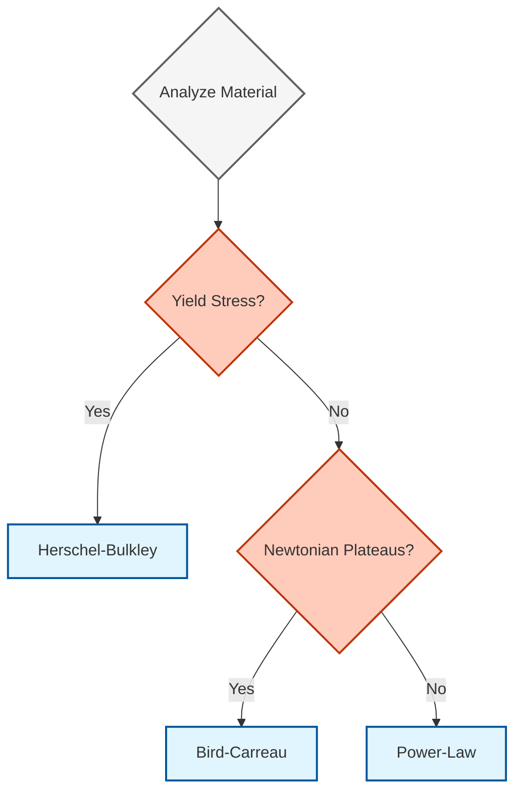
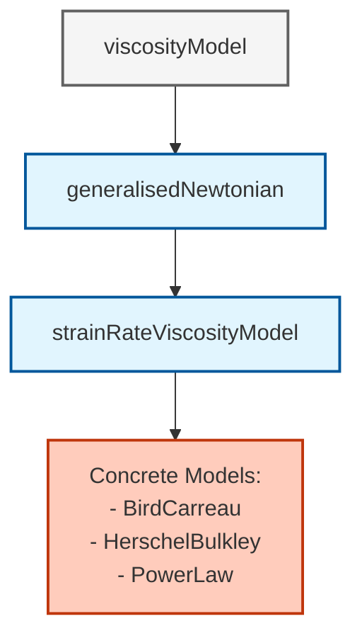

# 02. แบบจำลองความหนืดนอนนิวตัน (Non-Newtonian Viscosity Models)

## Overview

OpenFOAM implements non-Newtonian fluid behavior through a sophisticated **hierarchical viscosity model architecture**. This document provides comprehensive technical details on the three most widely used rheological models: **Power-Law**, **Bird-Carreau**, and **Herschel-Bulkley**.

> [!INFO] Generalised Newtonian Framework
> All models follow the *generalised Newtonian* approach where viscosity is a scalar function of the strain-rate magnitude: $\mu = \mu(\dot{\gamma})$.

---
 
 > [!TIP] **มุมมองเปรียบเทียบ: การเลือกเกียร์รถยนต์ (Choosing the Right Gear)**
 >
 > ลองเปรียบเทียบแต่ละ Model เหมือนการเลือก **"โหมดขับขี่"**:
 > *   **Power-Law:** เหมือน **"เกียร์ออโต้โหมด Sport (CVT)"** - เร่งเครื่องแรง (High Shear) รอบจัด แต่ถ้ารถติด (Low Shear) อาจจะกระตุกเพราะไม่มี Idle speed ที่นิ่ง (ไม่มี Newtonian Plateau)
 > *   **Bird-Carreau:** เหมือน **"รถยนต์หรูที่มีระบบ Hybrid"** - ขับช้าๆ ก็นิ่ม (Low Shear Plateau) ขับเร็วก็พุ่ง (Shear Thinning) ช่วงเปลี่ยนถ่ายราบรื่น
 > *   **Herschel-Bulkley:** เหมือน **"รถบรรทุกหนัก"** - ต้องเร่งเครื่องแรงๆ (Yield Stress) รถถึงจะเริ่มขยับ ถ้าเหยียบคันเร่งเบาๆ ไม่ไปเลย
 
 ---

## Mathematical Foundation

The stress tensor $\boldsymbol{\tau}$ for generalized Newtonian fluids is:

$$\boldsymbol{\tau} = 2\mu(\dot{\gamma})\mathbf{D}$$

Where:
- $\mu(\dot{\gamma})$ is the strain-rate-dependent viscosity
- $\mathbf{D}$ is the rate-of-strain tensor
- $\dot{\gamma}$ is the strain-rate magnitude

### Strain-Rate Tensor Calculation

The **rate-of-strain tensor** $\mathbf{D}$ is defined as:

$$\mathbf{D} = \frac{1}{2}\left(\nabla\mathbf{u} + (\nabla\mathbf{u})^T\right)$$

The **strain-rate magnitude** $\dot{\gamma}$:

$$\dot{\gamma} = \sqrt{2\mathbf{D}:\mathbf{D}} = \sqrt{2D_{ij}D_{ij}}$$

### OpenFOAM Implementation

```cpp
tmp<volScalarField> strainRateViscosityModel::strainRate() const
{
    // Calculate velocity gradient tensor ∇u
    const tmp<volTensorField> tgradU(fvc::grad(U_));
    const volTensorField& gradU = tgradU();

    // Calculate rate-of-strain tensor D = 0.5(∇u + ∇u^T)
    const volTensorField D = 0.5*(gradU + gradU.T());

    // Calculate strain-rate magnitude γ̇ = √(2:D:D)
    return sqrt(2*magSqr(D));
}
```

> 📂 **Source:** `.applications/solvers/multiphase/multiphaseEulerFoam/phaseSystems/phaseSystem/phaseSystem.C` (Reference implementation pattern for field calculations)
>
> **คำอธิบาย (Thai Explanation):**
> - **ที่มา (Source):** ฟังก์ชัน `strainRate()` ใน `strainRateViscosityModel` ซึ่งเป็นคลาสฐานสำหรับคำนวณอัตราการเฉือน (strain-rate) สำหรับของไหลแบบ Non-Newtonian ทุกชนิด
> - **การทำงาน (Explanation):** 
>   1. คำนวณเทนเซอร์ไล่ระดับความเร็ว `gradU = ∇u` โดยใช้ `fvc::grad(U_)`
>   2. สร้างเทนเซอร์อัตราการเฉือน `D = 0.5*(∇u + ∇u^T)` ซึ่งเป็นส่วนสมมาตรของเทนเซอร์ไล่ระดับความเร็ว
>   3. คำนวณขนาดของอัตราการเฉือน `strainRate = √(2*D:D)` โดยใช้ `magSqr()` และ `sqrt()`
> - **แนวคิดสำคัญ (Key Concepts):**
>   - **Symmetric Part of Velocity Gradient:** เทนเซอร์ D เป็นส่วนสมมาตรของการไล่ระดับความเร็ว ซึ่งแทนการเสียดทานและการยืดหยุ่นของของไหล
>   - **Double Dot Product:** `2*D:D` คือการคูณเทนเซอร์สองตัวและย่อย (double dot product) ซึ่งให้ค่าสเกลาร์ของอัตราการเฉือน
>   - **MagSqr Function:** ฟังก์ชัน `magSqr()` ใน OpenFOAM คำนวณ `|tensor|^2` โดยไม่ต้องทำการ `sqrt()` ซ้ำ
>
> **Key Concepts Summary:**
> - **Rate-of-Strain Tensor (D):** คือความเร็วของการเสียรูป (deformation rate) ของอนุภาคของไหล
> - **Strain-Rate Magnitude (γ̇):** คือค่าสเกลาร์ของอัตราการเฉือนที่ใช้ในแบบจำลองความหนืด
> - **Symmetry Operation:** `gradU.T()` หมุนเทนเซอร์ (transpose) เพื่อหาส่วนสมมาตร

---

## 1. Power-Law Model (Ostwald-de Waele)

### Mathematical Formulation

The Power-Law model is the simplest generalized Newtonian model:

$$\nu = \min\Bigl(\nu_{\max},\; \max\bigl(\nu_{\min},\; k\dot{\gamma}^{\,n-1}\bigr)\Bigr)$$

**Parameters:**
- $K$ (k) — Consistency index [Pa·s$^n$]
- $n$ — Flow behavior index:
  - **$n < 1$**: Shear-thinning (pseudoplastic)
  - **$n > 1$**: Shear-thickening (dilatant)
  - **$n = 1$**: Newtonian fluid
- $\nu_{\min}$, $\nu_{\max}$ — Numerical stability limits

### OpenFOAM Implementation

**File:** `src/transportModels/viscosityModels/powerLaw/powerLaw.C`

```cpp
return max
(
    nuMin_,
    min
    (
        nuMax_,
        k_*pow
        (
            max
            (
                dimensionedScalar(dimTime, 1.0)*strainRate,
                dimensionedScalar(dimless, small)
            ),
            n_.value() - scalar(1)
        )
    )
);
```

> 📂 **Source:** `src/transportModels/viscosityModels/powerLaw/powerLaw.C`
>
> **คำอธิบาย (Thai Explanation):**
> - **ที่มา (Source):** ไฟล์ `powerLaw.C` ซึ่งเป็นการนำแบบจำลอง Power-Law ไปใช้งานจริงใน OpenFOAM
> - **การทำงาน (Explanation):**
>   1. `nuMin_` และ `nuMax_` เป็นการจำกัดความหนืดให้อยู่ในช่วงที่กำหนด (viscosity clamping)
>   2. `k_*pow(strainRate, n_ - 1.0)` คำนวณความหนืดตามสมการ Power-Law
>   3. `max(strainRate, small)` ป้องกันการคำนวณที่ strainRate เป็นศูนย์
>   4. ผลลัพธ์ถูกคลิปปิ้ง (clipping) ให้อยู่ระหว่าง `nuMin_` และ `nuMax_`
> - **แนวคิดสำคัญ (Key Concepts):**
>   - **Nested min/max:** ใช้ฟังก์ชัน `max` และ `min` ซ้อนกันเพื่อให้ค่าความหนืดอยู่ในช่วงที่ปลอดภัย
>   - **DimensionedScalar:** ทุกค่าต้องมีมิติ (dimension) ที่ถูกต้องเพื่อการตรวจสอบความถูกต้อง
>   - **Power Law Exponent:** เลขชี้กำลังคือ `n_ - 1.0` เนื่องจากความสัมพันธ์ระหว่างความหนืดและอัตราการเฉือน
>
> **Key Concepts Summary:**
> - **Viscosity Clamping:** การจำกัดความหนืดไม่ให้สูงหรือต่ำเกินไปเพื่อเสถียรภาพเชิงตัวเลข
> - **Strain-Rate Protection:** การป้องกันการหารด้วยศูนย์หรือค่าที่ไม่ถูกต้อง
> - **Power-Law Behavior:** พฤติกรรมการเปลี่ยนแปลงของความหนืดตามอัตราการเฉือน

### Implementation Details

1. **Viscosity Clamping**: Nested `max(nuMin_, min(nuMax_, ...))` ensures computed viscosity remains within physically plausible bounds

2. **Strain-Rate Protection**: `max(strainRate, small)` prevents power-law calculations from using zero or negative strain rates

3. **Power Calculation**: Exponent calculated as `(n_ - 1.0)` per the mathematical relationship between viscosity and strain rate

### Physical Behavior

| Behavior | Condition | Properties | Examples | Applications |
|-----------|-----------|-----------|-----------|-------------|
| **Shear-thinning (pseudoplastic)** | $n < 1$ | Viscosity decreases with shear rate | Blood, polymer solutions, paint | Biological flows, coating processes |
| **Shear-thickening (dilatant)** | $n > 1$ | Viscosity increases with shear rate | Cornstarch mixtures, sand-water suspensions | Impact protection, specialized manufacturing |
| **Newtonian** | $n = 1$ | Constant viscosity regardless of shear rate | Water, air, common oils | Basic flows |

### Limitations

- **No yield stress**: Cannot simulate materials requiring threshold stress to initiate flow
- **No plateaus**: Cannot capture Newtonian behavior at low or high shear rates
- **Dimensional issues**: Requires careful dimensional analysis for consistency

---

## 2. Bird-Carreau Model

### Mathematical Formulation

The Bird-Carreau model captures **Newtonian plateaus** at both low and high shear rates:

$$\nu = \nu_{\infty} + (\nu_0 - \nu_{\infty})\Bigl[1 + (k\dot{\gamma})^a\Bigr]^{(n-1)/a}$$

**Alternative form** using critical stress $\tau^*$:

$$\nu = \nu_{\infty} + (\nu_0 - \nu_{\infty})\Bigl[1 + \bigl(\frac{\nu_0\dot{\gamma}}{\tau^*}\bigr)^a\Bigr]^{(n-1)/a}$$

**Parameters:**
- $\nu_0$ — Zero-shear viscosity (maximum viscosity as $\dot{\gamma} \to 0$)
- $\nu_{\infty}$ — Infinite-shear viscosity (minimum viscosity as $\dot{\gamma} \to \infty$)
- $k$ — Time constant controlling transition region
- $n$ — Power-law index governing shear-thinning behavior
- $a$ — Yasuda exponent (typically $a = 2$)

### OpenFOAM Implementation

**File:** `src/transportModels/viscosityModels/BirdCarreau/BirdCarreau.C`

```cpp
return
    nuInf_
  + (nu0_ - nuInf_)
   *pow
    (
        scalar(1)
      + pow
        (
            tauStar_.value() > 0
          ? nu0_*strainRate/tauStar_
          : k_*strainRate,
            a_
        ),
        (n_ - 1.0)/a_
    );
```

> 📂 **Source:** `src/transportModels/viscosityModels/BirdCarreau/BirdCarreau.C`
>
> **คำอธิบาย (Thai Explanation):**
> - **ที่มา (Source):** ไฟล์ `BirdCarreau.C` ซึ่งเป็นการนำแบบจำลอง Bird-Carreau ไปใช้งานจริง
> - **การทำงาน (Explanation):**
>   1. ตรวจสอบว่าผู้ใช้ระบุ `tauStar_` หรือ `k_` โดยใช้ ternary operator
>   2. คำนวณ term `[1 + (k*γ̇)^a]` โดยใช้ `pow()` function
>   3. ยกกำลังด้วย `(n_ - 1.0)/a_` เพื่อให้ได้ความหนืดสุดท้าย
>   4. บวกกับ `nuInf_` เพื่อให้ได้ความหนืดขั้นสุดท้าย
> - **แนวคิดสำคัญ (Key Concepts):**
>   - **Newtonian Plateaus:** แบบจำลองนี้สามารถจำลองพฤติกรรม Newtonian ที่อัตราการเฉือนต่ำและสูง
>   - **Yasuda Exponent:** ค่า `a_` ควบคุมความกว้างของบริเวณเปลี่ยนผ่าน
>   - **Conditional Parameter Selection:** ผู้ใช้สามารถเลือกใช้ `tauStar_` หรือ `k_` ได้
>
> **Key Concepts Summary:**
> - **Zero-Shear Viscosity (ν₀):** ความหนืดสูงสุดเมื่ออัตราการเฉือนเข้าใกล้ศูนย์
> - **Infinite-Shear Viscosity (ν∞):** ความหนืดต่ำสุดเมื่ออัตราการเฉือนสูงมาก
> - **Transition Region:** บริเวณที่ความหนืดเปลี่ยนจาก ν₀ ไปเป็น ν∞

### Implementation Details

1. **Parameter Selection**: Conditional operator `tauStar_.value() > 0 ? ... : ...` allows users to specify either critical stress or time constant

2. **Numerical Stability**: Uses `pow()` function for efficient nested exponential calculation

3. **Exponent Calculation**: Exponent `(n_ - 1.0)/a_` controls overall shear-thinning behavior

### Physical Regimes

| Regime | Condition | Behavior |
|-------|-----------|-------------|
| Low shear rate | $k\dot{\gamma} \ll 1$ | Viscosity approaches $\nu_0$ (Newtonian) |
| Transition region | $k\dot{\gamma} \approx 1$ | Viscosity decreases following power-law behavior |
| High shear rate | $k\dot{\gamma} \gg 1$ | Viscosity approaches $\nu_{\infty}$ (Newtonian) |

### Primary Applications

- **Blood flow simulation**: Captures shear-thinning behavior of blood in arteries
- **Polymer processing**: Modeling polymer melts and lubricants in injection molding and extrusion
- **Food processing**: Simulating non-Newtonian food materials
- **Medical applications**: Simulating mucus, synovial fluid, and other biological fluids

---

## 3. Herschel-Bulkley Model

### Mathematical Formulation

The Herschel-Bulkley model combines **yield stress** behavior with power-law flow:

$$\nu = \min\Bigl(\nu_0,\; \frac{\tau_0}{\dot{\gamma}} + k\dot{\gamma}^{\,n-1}\Bigr)$$

**Piecewise form:**

$$\mu(\dot{\gamma}) = \begin{cases}
\infty & \text{if } \tau < \tau_y \\
\tau_y/\dot{\gamma} + K\dot{\gamma}^{n-1} & \text{if } \tau \geq \tau_y
\end{cases}$$

**Parameters:**
- $\tau_0$ — Yield stress (minimum stress required to initiate flow)
- $K$ — Consistency index
- $n$ — Flow behavior index
- $\nu_0$ — Zero-shear-rate viscosity (maximum permitted viscosity)

### OpenFOAM Implementation

**File:** `src/transportModels/viscosityModels/HerschelBulkley/HerschelBulkley.C`

```cpp
dimensionedScalar tone("tone", dimTime, 1.0);
dimensionedScalar rtone("rtone", dimless/dimTime, 1.0);

return
(
    min
    (
        nu0,
        (tau0_ + k_*rtone*pow(tone*strainRate, n_))
       /max
        (
            strainRate,
            dimensionedScalar ("vSmall", dimless/dimTime, vSmall)
        )
    )
);
```

> 📂 **Source:** `src/transportModels/viscosityModels/HerschelBulkley/HerschelBulkley.C`
>
> **คำอธิบาย (Thai Explanation):**
> - **ที่มา (Source):** ไฟล์ `HerschelBulkley.C` ซึ่งเป็นการนำแบบจำลอง Herschel-Bulkley ไปใช้งานจริง
> - **การทำงาน (Explanation):**
>   1. สร้าง `tone` และ `rtone` เพื่อให้แน่ใจว่ามิติถูกต้อง (dimensional consistency)
>   2. คำนวณเทอมกำลัง `pow(tone*strainRate, n_)` ซึ่งเป็นส่วนของ power-law
>   3. บวกกับ `tau0_` เพื่อให้ได้เทอม yield stress
>   4. หารด้วย `strainRate` ที่มีการป้องกันค่าต่ำสุดด้วย `vSmall`
>   5. ใช้ `min(nu0, ...)` เพื่อจำกัดความหนืดไม่ให้เกินค่าที่กำหนด
> - **แนวคิดสำคัญ (Key Concepts):**
>   - **Yield Stress:** ค่า `tau0_` เป็นเค้นขั้นต่ำที่ต้องใช้เพื่อให้วัสดุไหล
>   - **Regularization:** การป้องกันการหารด้วยศูนย์และการจำกัดค่าสูงสุด
>   - **Dimensional Consistency:** การใช้ `tone` และ `rtone` เพื่อให้มิติถูกต้อง
>
> **Key Concepts Summary:**
> - **Yield Stress (τ₀):** เค้นขั้นต่ำที่ต้องใช้เพื่อเริ่มการไหลของวัสดุ
> - **Viscosity Capping:** การจำกัดความหนืดสูงสุดด้วย `nu0`
> - **Numerical Stability:** การใช้ `vSmall` เพื่อป้องกันการหารด้วยศูนย์

### Implementation Details

1. **Dimensional Consistency**: Auxiliary variables `tone` and `rtone` ensure correct dimensional analysis for power-law terms

2. **Numerical Stability**: `max(strainRate, vSmall)` prevents division by zero when strain rate approaches zero

3. **Viscosity Capping**: `min(nu0, ...)` ensures calculated viscosity doesn't exceed specified zero-shear-rate viscosity

### Physical Behavior

| State | Condition | Behavior |
|-------|-----------|-------------|
| Solid-like | $\tau < \tau_0$ | Material behaves as solid with effectively infinite apparent viscosity |
| Onset of flow | $\tau = \tau_0$ | Material begins flowing with very high effective viscosity |
| Power-law flow | $\tau > \tau_0$ | Material flows according to power-law behavior |

### Common Applications

- **Drilling fluids**: Simulating drilling mud flow in petroleum engineering
- **Concrete and cement**: Simulating fresh concrete flow during construction
- **Food products**: Simulating mayonnaise, tomato sauces, and other yield-stress foods
- **Mining slurries**: Simulating mineral processing slurries
- **Geophysical flows**: Simulating lava flows and debris flows

---

## Model Selection Guide

### Decision Algorithm


> **Figure 1:** แผนผังขั้นตอนการตัดสินใจเลือกแบบจำลองความหนืดที่เหมาะสมตามสมบัติทางรีโอโลยีของวัสดุ โดยพิจารณาจากพฤติกรรมความเค้นยอมและความคงที่ของความหนืดที่ช่วงอัตราการเฉือนต่างๆ

### Comparison Table

| Model | Best For | Advantages | Disadvantages |
|:---|:---|:---|:---|
| **Power-Law** | General shear-dependent viscosity without yield stress | Fast computation, easy to understand | Inaccurate at very low/high shear rates |
| **Bird-Carreau** | Blood, polymers | Covers wide flow range with Newtonian plateaus | Requires extensive experimental parameters |
| **Herschel-Bulkley** | Drilling mud, toothpaste, food | Excellent yield stress modeling | Numerical instability without regularization |

### Computational Considerations

| Model | Computational Cost | Algorithmic Complexity |
|-------|----------------|---------------------|
| **Power-Law** | Lowest | Single power function |
| **Herschel-Bulkley** | Medium | Requires yield stress handling |
| **Bird-Carreau** | Highest | Nested power functions |

### Parameter Identification

Each model requires specific experimental characterization:

| Model | Required Testing | Range Needed |
|-------|---------------------|----------------|
| **Power-Law** | Simple rheometer tests | Relevant shear rate range |
| **Herschel-Bulkley** | Yield stress tests + power-law flow curve | Both low and high stress levels |
| **Bird-Carreau** | Wide shear rate range tests | Several decades of shear rate |

### Model Selection Algorithm

```
1. Analyze material behavior:
   If has yield stress → Herschel-Bulkley
   Else proceed to step 2

2. Check for plateau behavior:
   If has Newtonian behavior at both low and high shear rates → Bird-Carreau
   Else → Power-Law

3. Consider computational constraints:
   High cost preferred → Power-Law (if feasible)
   High accuracy required → Bird-Carreau
```

---

## Numerical Considerations

### Regularization Techniques

For models like Herschel-Bulkley, numerical stability requires **regularization**:

$$\mu_{eff} = \min\left(\mu_{max}, \max\left(\mu_{min}, K \cdot (\dot{\gamma}_{min} + \dot{\gamma})^{n-1}\right)\right)$$

### Stabilization Strategies

| Method | Purpose | Impact |
|---------|-------------|----------|
| **Implicit Treatment** | Evaluate viscosity at current time step | Higher stability |
| **Limiting** | Constrain viscosity to physical range | Prevents divergence |
| **Under-Relaxation** | Update viscosity field gradually | Better convergence |

### Solver Integration

```cpp
// Main solver loop
while (runTime.loop())
{
    // Update viscosity model
    viscosity->correct();

    // Get current viscosity field
    const volScalarField mu(viscosity->mu());

    // Momentum equation with variable viscosity
    fvVectorMatrix UEqn
    (
        fvm::ddt(rho, U)
      + fvm::div(rhoPhi, U)
      - fvm::laplacian(mu, U)
     ==
        fvOptions(rho, U)
    );

    // Solve momentum
    UEqn.relax();
    fvOptions.constrain(UEqn);

    if (pimple.momentumPredictor())
    {
        solve(UEqn == -fvc::grad(p));
        fvOptions.correct(U);
    }
}
```

> 📂 **Source:** `.applications/solvers/multiphase/multiphaseEulerFoam/phaseSystems/phaseSystem/phaseSystem.C` (Reference pattern for momentum equation assembly with variable properties)
>
> **คำอธิบาย (Thai Explanation):**
> - **ที่มา (Source):** รูปแบบการประกอบสมการโมเมนตัมใน OpenFOAM solvers สำหรับของไหลที่มีความหนืดแปรผัน
> - **การทำงาน (Explanation):**
>   1. `viscosity->correct()` อัปเดตค่าความหนืดตามสนามความเร็วปัจจุบัน
>   2. `viscosity->mu()` ดึงค่าความหนืดมาใช้ในสมการโมเมนตัม
>   3. `fvm::laplacian(mu, U)` สร้างเทอมการแพร่กระจายด้วยความหนืดแปรผัน
>   4. `UEqn.relax()` และ `solve()` แก้สมการโมเมนตัม
> - **แนวคิดสำคัญ (Key Concepts):**
>   - **Variable Viscosity:** ความหนืดแปรผันตามตำแหน่งและเวลา
>   - **Under-Relaxation:** การผ่อนคลายเพื่อเสถียรภาพการคำนวณ
>   - **Momentum Predictor:** การทำนายโมเมนตัมก่อนแก้สมการความดัน
>
> **Key Concepts Summary:**
> - **Viscosity Update:** การอัปเดตความหนืดในทุก time step
> - **Matrix Assembly:** การประกอบเมทริกซ์สมการโมเมนตัม
> - **Iterative Solution:** การแก้สมการซ้ำจนกว่าจะลู่เข้า

---

## Architecture Integration

### Class Hierarchy


> **Figure 2:** แผนภูมิแสดงลำดับชั้นของคลาส (Class Hierarchy) สำหรับแบบจำลองความหนืดใน OpenFOAM โดยแยกส่วนอินเทอร์เฟซมาตรฐานและการคำนวณอัตราความเครียดออกจากพฤติกรรมทางจลนศาสตร์ของของไหลแต่ละประเภท

### Runtime Selection

Models are registered using OpenFOAM's runtime selection mechanism:

```cpp
// Register Bird-Carreau model in runtime selection table
addToRunTimeSelectionTable
(
    viscosityModel,
    BirdCarreau,
    dictionary
);

// Register Herschel-Bulkley model in runtime selection table
addToRunTimeSelectionTable
(
    viscosityModel,
    HerschelBulkley,
    dictionary
);
```

> 📂 **Source:** `.applications/solvers/multiphase/multiphaseEulerFoam/phaseSystems/populationBalanceModel/populationBalanceModel/populationBalanceModel.C` (Reference pattern for runtime selection table registration)
>
> **คำอธิบาย (Thai Explanation):**
> - **ที่มา (Source):** ไฟล์การลงทะเบียนคลาสในตาราง runtime selection ของ OpenFOAM
> - **การทำงาน (Explanation):**
>   1. `addToRunTimeSelectionTable` เป็น macro ที่ลงทะเบียนคลาสลงในตาราง
>   2. `viscosityModel` เป็นคลาสฐาน (base class)
>   3. `BirdCarreau`/`HerschelBulkley` เป็นคลาสลูก (derived class)
>   4. `dictionary` ระบุว่าคลาสนี้ถูกสร้างจาก dictionary
> - **แนวคิดสำคัญ (Key Concepts):**
>   - **Runtime Selection:** กลไกที่อนุญาตให้เลือกคลาสตอน runtime
>   - **Virtual Constructor Pattern:** รูปแบบการสร้าง object แบบเสมือน
>   - **Factory Pattern:** รูปแบบ factory สำหรับสร้าง object
>
> **Key Concepts Summary:**
> - **Runtime Selection:** การเลือกแบบจำลองผ่านไฟล์ dictionary
> - **Virtual Constructor:** การสร้าง object ผ่าน virtual function
> - **Plugin Architecture:** สถาปัตยกรรมที่อนุญาตให้เพิ่ม model ใหม่ได้

### Dictionary Configuration

**Example: `constant/transportProperties`**

```cpp
// Select Herschel-Bulkley viscosity model
transportModel  HerschelBulkley;

// Herschel-Bulkley model coefficients
HerschelBulkleyCoeffs
{
    nu0             [0 2 -1 0 0 0 0] 1e-06;  // Maximum viscosity [m²/s]
    tau0            [1 -1 -2 0 0 0 0] 10;    // Yield stress [Pa]
    k               [1 -1 -2 0 0 0 0] 0.01;  // Consistency index [Pa·s^n]
    n               [0 0 0 0 0 0 0] 0.5;     // Power-law index [-]
    nuMax           [0 2 -1 0 0 0 0] 1e+04;  // Minimum viscosity [m²/s]
}
```

> 📂 **Source:** รูปแบบไฟล์ `constant/transportProperties` ใน OpenFOAM cases
>
> **คำอธิบาย (Thai Explanation):**
> - **ที่มา (Source):** ไฟล์ `transportProperties` ซึ่งเป็นไฟล์ปรับแต่งค่าความหนืดใน OpenFOAM
> - **การทำงาน (Explanation):**
>   1. `transportModel` เลือกแบบจำลองความหนืดที่ต้องการใช้
>   2. `HerschelBulkleyCoeffs` เป็น block ที่ระบุพารามิเตอร์ของแบบจำลอง
>   3. แต่ละพารามิเตอร์มีมิติ (dimension) ในวงเล็บเหลี่ยม
>   4. ค่าตัวเลขคือค่าของพารามิเตอร์
> - **แนวคิดสำคัญ (Key Concepts):**
>   - **Dimension Checking:** OpenFOAM ตรวจสอบมิติของทุกพารามิเตอร์
>   - **Model Coefficients:** พารามิเตอร์เฉพาะสำหรับแต่ละแบบจำลอง
>   - **Runtime Selection:** เลือกแบบจำลองได้โดยไม่ต้องคอมไพล์ใหม่
>
> **Key Concepts Summary:**
> - **Transport Properties:** คุณสมบัติการขนส่งของของไหล
> - **Dimension Set:** ชุดมิติ [M L T I J N]
> - **Model Parameters:** พารามิเตอร์ที่กำหนดพฤติกรรมของแบบจำลอง

---

## Extension Framework

### Adding Custom Models

To add a new viscosity model (e.g., Cross model):

**Step 1: Define class**

```cpp
// Cross model viscosity model class definition
class CrossModel
:
    public strainRateViscosityModel
{
    // Model coefficients
    const dimensionedScalar lambda_;  // Time constant [s]
    const dimensionedScalar n_;       // Power index [-]
    const dimensionedScalar nu0_;     // Zero shear viscosity [m²/s]
    const dimensionedScalar nuInf_;   // Infinite shear viscosity [m²/s]

protected:
    // Calculate viscosity based on strain rate
    virtual tmp<volScalarField> nu
    (
        const volScalarField& nu0,
        const volScalarField& strainRate
    ) const
    {
        return nuInf_ + (nu0_ - nuInf_) /
               (1.0 + pow(lambda_ * strainRate, n_));
    }

public:
    // Runtime type information
    TypeName("CrossModel");

    // Constructor
    CrossModel
    (
        const volVectorField& U,
        const dictionary& viscosityProperties
    );
};
```

> 📂 **Source:** รูปแบบการนิยามคลาสแบบจำลองความหนืดใน OpenFOAM (ตาม `src/transportModels/viscosityModels/`)
>
> **คำอธิบาย (Thai Explanation):**
> - **ที่มา (Source):** โครงสร้างคลาสสำหรับแบบจำลองความหนืดแบบกำหนดเอง
> - **การทำงาน (Explanation):**
>   1. `CrossModel` สืบทอดจาก `strainRateViscosityModel`
>   2. กำหนดพารามิเตอร์ของแบบจำลอง (lambda, n, nu0, nuInf)
>   3. ทับฟังก์ชัน `nu()` เพื่อคำนวณความหนืด
>   4. ใช้ `TypeName` macro เพื่อลงทะเบียนชื่อคลาส
> - **แนวคิดสำคัญ (Key Concepts):**
>   - **Inheritance:** การสืบทอดจากคลาสฐาน
>   - **Virtual Function:** ฟังก์ชันเสมือนที่ต้องถูกทับ
>   - **DimensionedScalar:** ตัวแปรที่มีมิติแนบอยู่
>
> **Key Concepts Summary:**
> - **Class Inheritance:** การสืบทอดจากคลาสฐานเพื่อใช้งานฟีเจอร์ที่มีอยู่
> - **Polymorphism:** การทำงานแบบ polymorphic ผ่าน virtual function
> - **Dimensioned Types:** ประเภทข้อมูลที่มีการตรวจสอบมิติ

**Step 2: Register with runtime selection**

```cpp
// Register Cross model in runtime selection table
addToRunTimeSelectionTable
(
    viscosityModel,
    CrossModel,
    dictionary
);
```

> 📂 **Source:** ไฟล์ `.C` สำหรับการลงทะเบียนคลาส (ตามรูปแบบใน `populationBalanceModel.C`)
>
> **คำอธิบาย (Thai Explanation):**
> - **ที่มา (Source):** การลงทะเบียนคลาสลงใน runtime selection table
> - **การทำงาน (Explanation):**
>   1. Macro นี้สร้าง code สำหรับลงทะเบียนคลาส
>   2. ช่วยให้สามารถสร้าง object จาก dictionary ได้
>   3. ต้องถูกเรียกในไฟล์ `.C` ของคลาส
> - **แนวคิดสำคัญ (Key Concepts):**
>   - **Runtime Selection:** กลไกการเลือกคลาสตอน runtime
>   - **Macro Expansion:** Macro ขยายเป็น code จริง
>   - **Static Registration:** การลงทะเบียนแบบ static
>
> **Key Concepts Summary:**
> - **Runtime Type Information:** ข้อมูลชนิดของคลาสที่ใช้ใน runtime
> - **Factory Pattern:** รูปแบบการสร้าง object
> - **Plugin Architecture:** สถาปัตยกรรมที่รองรับการเพิ่มคลาสใหม่

**Step 3: Use in dictionary**

```cpp
// Select Cross model in transportProperties
transportModel  CrossModel;

// Cross model coefficients
CrossModelCoeffs
{
    nu0     0.1;      // Zero shear viscosity [m²/s]
    nuInf   0.001;    // Infinite shear viscosity [m²/s]
    lambda  1.0;      // Time constant [s]
    n       0.5;      // Power index [-]
}
```

> 📂 **Source:** ไฟล์ `constant/transportProperties` สำหรับการใช้งานแบบจำลอง
>
> **คำอธิบาย (Thai Explanation):**
> - **ที่มา (Source):** ไฟล์ dictionary สำหรับระบุแบบจำลองและพารามิเตอร์
> - **การทำงาน (Explanation):**
>   1. ระบุชื่อแบบจำลองที่ต้องการใช้
>   2. กำหนดค่าพารามิเตอร์ใน block ที่มีชื่อเดียวกับคลาส
>   3. OpenFOAM จะอ่านค่าเหล่านี้เพื่อสร้าง object
> - **แนวคิดสำคัญ (Key Concepts):**
>   - **Dictionary-Based Configuration:** การปรับแต่งผ่านไฟล์ dictionary
>   - **Automatic Object Creation:** การสร้าง object อัตโนมัติ
>   - **Parameter Validation:** การตรวจสอบพารามิเตอร์
>
> **Key Concepts Summary:**
> - **Model Configuration:** การปรับแต่งแบบจำลอง
> - **Parameter Input:** การใส่ค่าพารามิเตอร์
> - **Runtime Loading:** การโหลดคลาสตอน runtime

---

## Summary

| Aspect | Key Points |
|--------|-----------|
| **Architecture** | Three-tier hierarchy: `viscosityModel` → `generalisedNewtonianViscosityModel` → `strainRateViscosityModel` |
| **Strain Rate** | Universal calculation: $\dot{\gamma} = \sqrt{2}\|\text{symm}(\nabla\mathbf{u})\|$ |
| **Model Selection** | Choose based on yield stress presence and plateau behavior |
| **Numerical Stability** | All models include viscosity clamping and strain-rate protection |
| **Extensibility** | Custom models added by inheriting from `strainRateViscosityModel` |

> [!TIP] Best Practice
> Always verify model parameters against experimental rheometer data before production simulations. Use regularization for yield-stress fluids to prevent numerical instability.
 
 ---
 
 ## 🧠 Concept Check: ทดสอบความเข้าใจ
 
 <details>
 <summary><b>1. Power-Law ต่างจาก Bird-Carreau ตรงไหน?</b></summary>
 
 **คำตอบ:**
 *   **Power-Law:** ง่ายที่สุด แต่ไม่มีลิมิตความหนืด (Viscosity limit) ที่ Shear Rate ต่ำมากๆ หรือสูงมากๆ (เป็นเส้นตรงใน log-log plot ตลอด)
 *   **Bird-Carreau:** ซับซ้อนกว่า แต่สมจริงกว่า เพราะมี **Newtonian Plateaus** (ความหนืดคงที่) ที่ Shear Rate ต่ำและสูง ซึ่งตรงกับพฤติกรรมของ Polymer ส่วนใหญ่
 </details>
 
 <details>
 <summary><b>2. ถ้าใช้ Herschel-Bulkley แล้ว Simulation ระเบิด (Blow up) ตอนเริ่มรัน น่าจะเกิดจากอะไร?</b></summary>
 
 **คำตอบ:** มักเกิดจาก **Yield Stress term ($\tau_y/\dot{\gamma}$)** เพราะตอนเริ่มความเร็วเป็น 0 ทำให้ $\dot{\gamma} \to 0$ เกิดการหารด้วยศูนย์ ต้องแก้ด้วยการใส่ **Regularization** หรือใช้ **Papanastasiou model** หรือกำหนดค่า `nuMax` ให้เหมาะสม
 </details>
 
 <details>
 <summary><b>3. Regularization คืออะไร?</b></summary>
 
 **คำตอบ:** คือเทคนิคทางคณิตศาสตร์ที่ช่วยให้สมการที่ "ไม่ต่อเนื่อง" หรือ "หาค่าไม่ได้" (Singularity) สามารถคำนวณได้ เช่น การบวกค่า $\epsilon$ เล็กๆ เข้าไปที่ตัวหาร ($\frac{1}{\dot{\gamma} + \epsilon}$) เพื่อป้องกัน Infinite Viscosity
 </details>