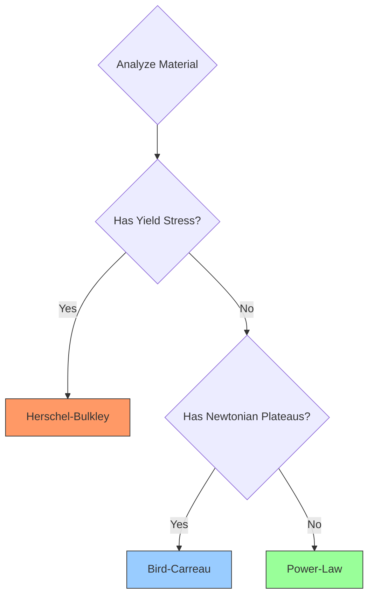
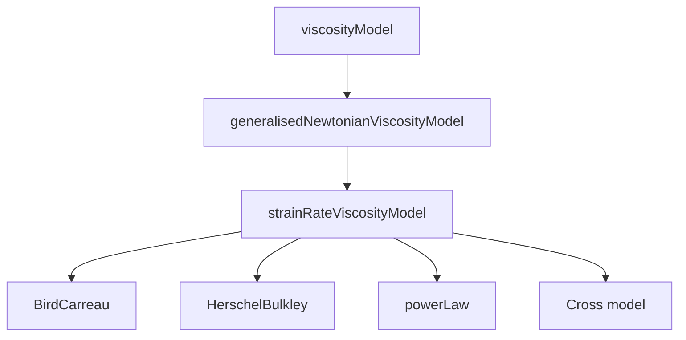

# 02. Non-Newtonian Viscosity Models

## Overview

OpenFOAM implements non-Newtonian fluid behavior through a sophisticated **hierarchical viscosity model architecture**. This document provides comprehensive technical details on the three most widely used rheological models: **Power-Law**, **Bird-Carreau**, and **Herschel-Bulkley**.

> [!INFO] Generalised Newtonian Framework
> All models follow the *generalised Newtonian* approach where viscosity is a scalar function of the strain-rate magnitude: $\mu = \mu(\dot{\gamma})$.

---

## Mathematical Foundation

The stress tensor $\boldsymbol{\tau}$ for generalized Newtonian fluids is:

$$\boldsymbol{\tau} = 2\mu(\dot{\gamma})\mathbf{D}$$

Where:
- $\mu(\dot{\gamma})$ is the strain-rate-dependent viscosity
- $\mathbf{D}$ is the rate-of-strain tensor
- $\dot{\gamma}$ is the strain-rate magnitude

### Strain-Rate Tensor Calculation

The **rate-of-strain tensor** $\mathbf{D}$ is defined as:

$$\mathbf{D} = \frac{1}{2}\left(\nabla\mathbf{u} + (\nabla\mathbf{u})^T\right)$$

The **strain-rate magnitude** $\dot{\gamma}$:

$$\dot{\gamma} = \sqrt{2\mathbf{D}:\mathbf{D}} = \sqrt{2D_{ij}D_{ij}}$$

### OpenFOAM Implementation

```cpp
tmp<volScalarField> strainRateViscosityModel::strainRate() const
{
    // Calculate velocity gradient tensor ∇u
    const tmp<volTensorField> tgradU(fvc::grad(U_));
    const volTensorField& gradU = tgradU();

    // Calculate rate-of-strain tensor D = 0.5(∇u + ∇u^T)
    const volTensorField D = 0.5*(gradU + gradU.T());

    // Calculate strain-rate magnitude γ̇ = √(2:D:D)
    return sqrt(2*magSqr(D));
}
```

---

## 1. Power-Law Model (Ostwald-de Waele)

### Mathematical Formulation

The Power-Law model is the simplest generalized Newtonian model:

$$\nu = \min\Bigl(\nu_{\max},\; \max\bigl(\nu_{\min},\; k\dot{\gamma}^{\,n-1}\bigr)\Bigr)$$

**Parameters:**
- $K$ (k) — Consistency index [Pa·s$^n$]
- $n$ — Flow behavior index:
  - **$n < 1$**: Shear-thinning (pseudoplastic)
  - **$n > 1$**: Shear-thickening (dilatant)
  - **$n = 1$**: Newtonian fluid
- $\nu_{\min}$, $\nu_{\max}$ — Numerical stability limits

### OpenFOAM Implementation

**File:** `src/transportModels/viscosityModels/powerLaw/powerLaw.C`

```cpp
return max
(
    nuMin_,
    min
    (
        nuMax_,
        k_*pow
        (
            max
            (
                dimensionedScalar(dimTime, 1.0)*strainRate,
                dimensionedScalar(dimless, small)
            ),
            n_.value() - scalar(1)
        )
    )
);
```

### Implementation Details

1. **Viscosity Clamping**: Nested `max(nuMin_, min(nuMax_, ...))` ensures computed viscosity remains within physically plausible bounds

2. **Strain-Rate Protection**: `max(strainRate, small)` prevents power-law calculations from using zero or negative strain rates

3. **Power Calculation**: Exponent calculated as `(n_ - 1.0)` per the mathematical relationship between viscosity and strain rate

### Physical Behavior

| Behavior | Condition | Properties | Examples | Applications |
|-----------|-----------|-----------|-----------|-------------|
| **Shear-thinning (pseudoplastic)** | $n < 1$ | Viscosity decreases with shear rate | Blood, polymer solutions, paint | Biological flows, coating processes |
| **Shear-thickening (dilatant)** | $n > 1$ | Viscosity increases with shear rate | Cornstarch mixtures, sand-water suspensions | Impact protection, specialized manufacturing |
| **Newtonian** | $n = 1$ | Constant viscosity regardless of shear rate | Water, air, common oils | Basic flows |

### Limitations

- **No yield stress**: Cannot simulate materials requiring threshold stress to initiate flow
- **No plateaus**: Cannot capture Newtonian behavior at low or high shear rates
- **Dimensional issues**: Requires careful dimensional analysis for consistency

---

## 2. Bird-Carreau Model

### Mathematical Formulation

The Bird-Carreau model captures **Newtonian plateaus** at both low and high shear rates:

$$\nu = \nu_{\infty} + (\nu_0 - \nu_{\infty})\Bigl[1 + (k\dot{\gamma})^a\Bigr]^{(n-1)/a}$$

**Alternative form** using critical stress $\tau^*$:

$$\nu = \nu_{\infty} + (\nu_0 - \nu_{\infty})\Bigl[1 + \bigl(\frac{\nu_0\dot{\gamma}}{\tau^*}\bigr)^a\Bigr]^{(n-1)/a}$$

**Parameters:**
- $\nu_0$ — Zero-shear viscosity (maximum viscosity as $\dot{\gamma} \to 0$)
- $\nu_{\infty}$ — Infinite-shear viscosity (minimum viscosity as $\dot{\gamma} \to \infty$)
- $k$ — Time constant controlling transition region
- $n$ — Power-law index governing shear-thinning behavior
- $a$ — Yasuda exponent (typically $a = 2$)

### OpenFOAM Implementation

**File:** `src/transportModels/viscosityModels/BirdCarreau/BirdCarreau.C`

```cpp
return
    nuInf_
  + (nu0_ - nuInf_)
   *pow
    (
        scalar(1)
      + pow
        (
            tauStar_.value() > 0
          ? nu0_*strainRate/tauStar_
          : k_*strainRate,
            a_
        ),
        (n_ - 1.0)/a_
    );
```

### Implementation Details

1. **Parameter Selection**: Conditional operator `tauStar_.value() > 0 ? ... : ...` allows users to specify either critical stress or time constant

2. **Numerical Stability**: Uses `pow()` function for efficient nested exponential calculation

3. **Exponent Calculation**: Exponent `(n_ - 1.0)/a_` controls overall shear-thinning behavior

### Physical Regimes

| Regime | Condition | Behavior |
|-------|-----------|-------------|
| Low shear rate | $k\dot{\gamma} \ll 1$ | Viscosity approaches $\nu_0$ (Newtonian) |
| Transition region | $k\dot{\gamma} \approx 1$ | Viscosity decreases following power-law behavior |
| High shear rate | $k\dot{\gamma} \gg 1$ | Viscosity approaches $\nu_{\infty}$ (Newtonian) |

### Primary Applications

- **Blood flow simulation**: Captures shear-thinning behavior of blood in arteries
- **Polymer processing**: Modeling polymer melts and lubricants in injection molding and extrusion
- **Food processing**: Simulating non-Newtonian food materials
- **Medical applications**: Simulating mucus, synovial fluid, and other biological fluids

---

## 3. Herschel-Bulkley Model

### Mathematical Formulation

The Herschel-Bulkley model combines **yield stress** behavior with power-law flow:

$$\nu = \min\Bigl(\nu_0,\; \frac{\tau_0}{\dot{\gamma}} + k\dot{\gamma}^{\,n-1}\Bigr)$$

**Piecewise form:**

$$\mu(\dot{\gamma}) = \begin{cases}
\infty & \text{if } \tau < \tau_y \\
\tau_y/\dot{\gamma} + K\dot{\gamma}^{n-1} & \text{if } \tau \geq \tau_y
\end{cases}$$

**Parameters:**
- $\tau_0$ — Yield stress (minimum stress required to initiate flow)
- $K$ — Consistency index
- $n$ — Flow behavior index
- $\nu_0$ — Zero-shear-rate viscosity (maximum permitted viscosity)

### OpenFOAM Implementation

**File:** `src/transportModels/viscosityModels/HerschelBulkley/HerschelBulkley.C`

```cpp
dimensionedScalar tone("tone", dimTime, 1.0);
dimensionedScalar rtone("rtone", dimless/dimTime, 1.0);

return
(
    min
    (
        nu0,
        (tau0_ + k_*rtone*pow(tone*strainRate, n_))
       /max
        (
            strainRate,
            dimensionedScalar ("vSmall", dimless/dimTime, vSmall)
        )
    )
);
```

### Implementation Details

1. **Dimensional Consistency**: Auxiliary variables `tone` and `rtone` ensure correct dimensional analysis for power-law terms

2. **Numerical Stability**: `max(strainRate, vSmall)` prevents division by zero when strain rate approaches zero

3. **Viscosity Capping**: `min(nu0, ...)` ensures calculated viscosity doesn't exceed specified zero-shear-rate viscosity

### Physical Behavior

| State | Condition | Behavior |
|-------|-----------|-------------|
| Solid-like | $\tau < \tau_0$ | Material behaves as solid with effectively infinite apparent viscosity |
| Onset of flow | $\tau = \tau_0$ | Material begins flowing with very high effective viscosity |
| Power-law flow | $\tau > \tau_0$ | Material flows according to power-law behavior |

### Common Applications

- **Drilling fluids**: Simulating drilling mud flow in petroleum engineering
- **Concrete and cement**: Simulating fresh concrete flow during construction
- **Food products**: Simulating mayonnaise, tomato sauces, and other yield-stress foods
- **Mining slurries**: Simulating mineral processing slurries
- **Geophysical flows**: Simulating lava flows and debris flows

---

## Model Selection Guide

### Decision Algorithm


> **Figure 1:** แผนผังขั้นตอนการตัดสินใจเลือกแบบจำลองความหนืดที่เหมาะสมตามสมบัติทางรีโอโลยีของวัสดุ โดยพิจารณาจากพฤติกรรมความเค้นยอมและความคงที่ของความหนืดที่ช่วงอัตราการเฉือนต่างๆ


### Comparison Table

| Model | Best For | Advantages | Disadvantages |
|:---|:---|:---|:---|
| **Power-Law** | General shear-dependent viscosity without yield stress | Fast computation, easy to understand | Inaccurate at very low/high shear rates |
| **Bird-Carreau** | Blood, polymers | Covers wide flow range with Newtonian plateaus | Requires extensive experimental parameters |
| **Herschel-Bulkley** | Drilling mud, toothpaste, food | Excellent yield stress modeling | Numerical instability without regularization |

### Computational Considerations

| Model | Computational Cost | Algorithmic Complexity |
|-------|----------------|---------------------|
| **Power-Law** | Lowest | Single power function |
| **Herschel-Bulkley** | Medium | Requires yield stress handling |
| **Bird-Carreau** | Highest | Nested power functions |

### Parameter Identification

Each model requires specific experimental characterization:

| Model | Required Testing | Range Needed |
|-------|---------------------|----------------|
| **Power-Law** | Simple rheometer tests | Relevant shear rate range |
| **Herschel-Bulkley** | Yield stress tests + power-law flow curve | Both low and high stress levels |
| **Bird-Carreau** | Wide shear rate range tests | Several decades of shear rate |

### Model Selection Algorithm

```
1. Analyze material behavior:
   If has yield stress → Herschel-Bulkley
   Else proceed to step 2

2. Check for plateau behavior:
   If has Newtonian behavior at both low and high shear rates → Bird-Carreau
   Else → Power-Law

3. Consider computational constraints:
   High cost preferred → Power-Law (if feasible)
   High accuracy required → Bird-Carreau
```

---

## Numerical Considerations

### Regularization Techniques

For models like Herschel-Bulkley, numerical stability requires **regularization**:

$$\mu_{eff} = \min\left(\mu_{max}, \max\left(\mu_{min}, K \cdot (\dot{\gamma}_{min} + \dot{\gamma})^{n-1}\right)\right)$$

### Stabilization Strategies

| Method | Purpose | Impact |
|---------|-------------|----------|
| **Implicit Treatment** | Evaluate viscosity at current time step | Higher stability |
| **Limiting** | Constrain viscosity to physical range | Prevents divergence |
| **Under-Relaxation** | Update viscosity field gradually | Better convergence |

### Solver Integration

```cpp
// Main solver loop
while (runTime.loop())
{
    // Update viscosity model
    viscosity->correct();

    // Get current viscosity field
    const volScalarField mu(viscosity->mu());

    // Momentum equation with variable viscosity
    fvVectorMatrix UEqn
    (
        fvm::ddt(rho, U)
      + fvm::div(rhoPhi, U)
      - fvm::laplacian(mu, U)
     ==
        fvOptions(rho, U)
    );

    // Solve momentum
    UEqn.relax();
    fvOptions.constrain(UEqn);

    if (pimple.momentumPredictor())
    {
        solve(UEqn == -fvc::grad(p));
        fvOptions.correct(U);
    }
}
```

---

## Architecture Integration

### Class Hierarchy


> **Figure 2:** แผนภูมิแสดงลำดับชั้นของคลาส (Class Hierarchy) สำหรับแบบจำลองความหนืดใน OpenFOAM โดยแยกส่วนอินเทอร์เฟซมาตรฐานและการคำนวณอัตราความเครียดออกจากพฤติกรรมทางจลนศาสตร์ของของไหลแต่ละประเภท


### Runtime Selection

Models are registered using OpenFOAM's runtime selection mechanism:

```cpp
addToRunTimeSelectionTable
(
    viscosityModel,
    BirdCarreau,
    dictionary
);

addToRunTimeSelectionTable
(
    viscosityModel,
    HerschelBulkley,
    dictionary
);
```

### Dictionary Configuration

**Example: `constant/transportProperties`**

```cpp
transportModel  HerschelBulkley;

HerschelBulkleyCoeffs
{
    nu0             [0 2 -1 0 0 0 0] 1e-06;  // Maximum viscosity
    tau0            [1 -1 -2 0 0 0 0] 10;    // Yield stress
    k               [1 -1 -2 0 0 0 0] 0.01;  // Consistency index
    n               [0 0 0 0 0 0 0] 0.5;     // Power-law index
    nuMax           [0 2 -1 0 0 0 0] 1e+04;  // Minimum viscosity
}
```

---

## Extension Framework

### Adding Custom Models

To add a new viscosity model (e.g., Cross model):

**Step 1: Define class**

```cpp
class CrossModel
:
    public strainRateViscosityModel
{
    const dimensionedScalar lambda_;  // Time constant
    const dimensionedScalar n_;       // Power index
    const dimensionedScalar nu0_;     // Zero shear viscosity
    const dimensionedScalar nuInf_;   // Infinite shear viscosity

protected:
    virtual tmp<volScalarField> nu
    (
        const volScalarField& nu0,
        const volScalarField& strainRate
    ) const
    {
        return nuInf_ + (nu0_ - nuInf_) /
               (1.0 + pow(lambda_ * strainRate, n_));
    }

public:
    TypeName("CrossModel");

    CrossModel
    (
        const volVectorField& U,
        const dictionary& viscosityProperties
    );
};
```

**Step 2: Register with runtime selection**

```cpp
addToRunTimeSelectionTable
(
    viscosityModel,
    CrossModel,
    dictionary
);
```

**Step 3: Use in dictionary**

```cpp
transportModel  CrossModel;

CrossModelCoeffs
{
    nu0     0.1;
    nuInf   0.001;
    lambda  1.0;
    n       0.5;
}
```

---

## Summary

| Aspect | Key Points |
|--------|-----------|
| **Architecture** | Three-tier hierarchy: `viscosityModel` → `generalisedNewtonianViscosityModel` → `strainRateViscosityModel` |
| **Strain Rate** | Universal calculation: $\dot{\gamma} = \sqrt{2}\|\text{symm}(\nabla\mathbf{u})\|$ |
| **Model Selection** | Choose based on yield stress presence and plateau behavior |
| **Numerical Stability** | All models include viscosity clamping and strain-rate protection |
| **Extensibility** | Custom models added by inheriting from `strainRateViscosityModel` |

> [!TIP] Best Practice
> Always verify model parameters against experimental rheometer data before production simulations. Use regularization for yield-stress fluids to prevent numerical instability.
