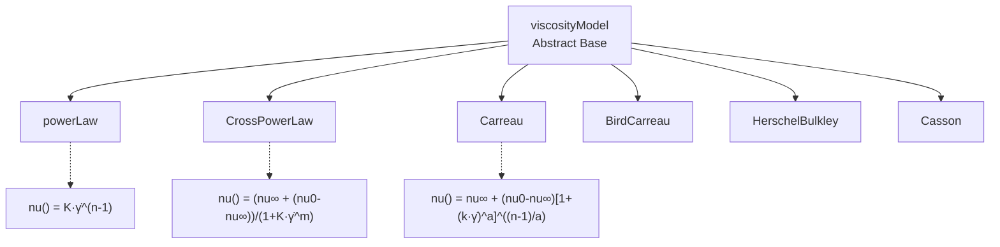

# OpenFOAM Architecture for Non-Newtonian Fluids

## Learning Objectives

By the end of this section, you will be able to:

1. **Understand** the class hierarchy design for viscosity models in OpenFOAM
2. **Locate** the actual source files for viscosity model implementation in the OpenFOAM codebase
3. **Explain** the role of virtual functions in enabling runtime polymorphism
4. **Trace** the execution flow from dictionary specification to viscosity calculation
5. **Connect** the architectural design to numerical implementation covered in the next section

---

## 1. What: Architecture Overview

### 1.1 High-Level Design Philosophy

OpenFOAM's non-Newtonian architecture follows the **Strategy design pattern**:

- **What**: Base class defines interface, derived classes implement specific models
- **Why**: Enables runtime model selection via dictionary without recompilation
- **How**: Virtual functions + Runtime Type Selection (RTS) mechanism

### 1.2 Component Responsibilities

| Component | Responsibility | File Location |
|-----------|---------------|---------------|
| `viscosityModel` | Abstract base class interface | `src/transportModels/viscosityModels/viscosityModel/viscosityModel.H` |
| `powerLaw` | Power law viscosity model | `src/transportModels/viscosityModels/viscosityModels/powerLaw/` |
| `CrossPowerLaw` | Cross power law model | `src/transportModels/viscosityModels/viscosityModels/CrossPowerLaw/` |
| `Carreau` | Carreau-Yasuda model | `src/transportModels/viscosityModels/viscosityModels/Carreau/` |
| `singlePhaseTransportModel` | Transport model selector | `src/transportModels/singlePhaseTransportModel/` |

---

## 2. Why: Design Rationale

### 2.1 The Problem

Different non-Newtonian fluids require different viscosity models:
- Blood → Casson or Carreau
- Polymer solutions → Power law
- Food products → Cross power law

**Without polymorphism**, each model would require:
- Separate solver implementation
- Recompilation when switching models
- Code duplication

### 2.2 The Solution: Virtual Functions

```cpp
// From: src/transportModels/viscosityModels/viscosityModel/viscosityModel.H

class viscosityModel
{
    // ... (省略其他成员)
    
public:
    // Pure virtual function - MUST be implemented by derived classes
    virtual tmp<volScalarField> nu() const = 0;
    
    // Update viscosity field with current flow state
    virtual void correct() = 0;
    
    // Virtual destructor for proper cleanup
    virtual ~viscosityModel() {}
};
```

**Why virtual functions matter:**

1. **Interface Consistency**: All models expose `nu()` and `correct()`
2. **Solver Independence**: Solver code: `nu = transportModel.nu()` works for ANY model
3. **Extensibility**: Add new models without modifying existing solvers

### 2.3 Runtime Type Selection (RTS)

**The Magic**: Select model at runtime via dictionary:

```cpp
// constant/transportProperties
transportModel  Carreau;  // ← Change this line only!

CarreauCoeffs
{
    nu0      [0 2 -1 0 0 0 0]  1e-03;
    nuInf    [0 2 -1 0 0 0 0]  1e-06;
    k        [0 0 1 0 0 0 0]  0.1;
    n        [0 0 0 0 0 0 0]  0.5;
}
```

**Under the hood:**
```cpp
// From: src/transportModels/viscosityModels/viscosityModel/newViscosityModel.C

autoPtr<viscosityModel> ptr
(
    viscosityModel::New(dictionary, U, phi)
);
// Returns pointer to Carreau, powerLaw, etc. based on dictionary
```

**No recompilation needed** when switching between models!

---

## 3. How: Implementation Details

### 3.1 Complete Class Hierarchy



### 3.2 Base Class Implementation (Actual Source)

**File**: `src/transportModels/viscosityModels/viscosityModel/viscosityModel.H`

```cpp
// 简化版本 - 展示核心结构
template<class BasicMomentumTransportModel>
class viscosityModel
:
    public BasicMomentumTransportModel
{
protected:
    // Reference to velocity field
    const volVectorField& U_;
    
    // Strain rate field (cached)
    tmp<volScalarField> strainRate_;
    
public:
    // Runtime selection constructor
    static autoPtr<viscosityModel> New
    (
        const dictionary& dict,
        const volVectorField& U,
        const surfaceScalarField& phi
    );
    
    // Pure virtual: 返回运动粘度场
    virtual tmp<volScalarField> nu() const = 0;
    
    // Pure virtual: 更新粘度场
    virtual void correct() = 0;
    
    // Strain rate calculation
    virtual tmp<volScalarField> strainRate() const
    {
        return sqrt(2.0) * mag(symm(fvc::grad(U_)));
    }
};
```

### 3.3 Derived Class Example: Carreau Model

**File**: `src/transportModels/viscosityModels/viscosityModels/Carreau/Carreau.H`

```cpp
class Carreau
:
    public viscosityModel
{
    // Model coefficients
    dimensionedScalar nu0_;      // Zero-shear viscosity
    dimensionedScalar nuInf_;    // Infinite-shear viscosity
    dimensionedScalar k_;        // Time constant
    dimensionedScalar n_;        // Power law index
    
public:
    // Constructor from dictionary
    Carreau
    (
        const dictionary& dict,
        const volVectorField& U,
        const surfaceScalarField& phi
    );
    
    // Destructor
    virtual ~Carreau() {}
    
    // Calculate and return viscosity field
    virtual tmp<volScalarField> nu() const
    {
        const volScalarField& sr = strainRate();
        
        // Carreau model equation
        return tmp<volScalarField>
        (
            new volScalarField
            (
                IOobject::groupName("nu", U_.group()),
                nuInf_
              + (nu0_ - nuInf_)
              * pow(scalar(1) + sqr(k_ * sr), (n_ - 1.0)/2.0)
            )
        );
    }
    
    // Update viscosity field
    virtual void correct()
    {
        nu_ = nu();
    }
};
```

### 3.4 Strain Rate Computation

**File**: `src/transportModels/viscosityModels/viscosityModel/strainRate.C`

```cpp
template<class BasicMomentumTransportModel>
tmp<volScalarField> viscosityModel<BasicMomentumTransportModel>::strainRate() const
{
    // Step 1: Compute velocity gradient tensor ∇U
    // fvc::grad(U_) returns a tensor field
    
    // Step 2: Extract symmetric part: D = ½(∇U + ∇U^T)
    // symm() returns symmetric part of tensor
    
    // Step 3: Compute magnitude: |D| = sqrt(D:D)
    // mag() returns tensor magnitude
    
    // Step 4: Multiply by sqrt(2) for strain rate magnitude
    // γ̇ = sqrt(2)·|D|
    
    return sqrt(2.0) * mag(symm(fvc::grad(U_)));
}
```

**Mathematical foundation**:

$$\mathbf{D} = \frac{1}{2}\left(\nabla\mathbf{U} + (\nabla\mathbf{U})^T\right)$$

$$\dot{\gamma} = \sqrt{2\mathbf{D}:\mathbf{D}} = \sqrt{2} \cdot |\mathbf{D}|$$

### 3.5 Usage in Solvers

**File**: `applications/solvers/singlePhase/simpleFoam/simpleFoam.C`

```cpp
// Create transport model
singlePhaseTransportModel transportModel(U, phi);

// Solver loop (simplified)
while (simple.loop())
{
    // Update viscosity based on current strain rate
    transportModel.correct();
    
    // Access viscosity field (polymorphic - works for ANY model)
    const volScalarField& nu = transportModel.nu();
    
    // Solve momentum equation
    solve(fvm::div(phi, U) - fvm::laplacian(nu, U));
    
    // ... (继续求解)
}
```

**Key insight**: Solver code is **model-agnostic**. It only calls:
- `correct()` - update viscosity
- `nu()` - get viscosity field

Which specific model (Carreau, powerLaw, etc.) is used **doesn't matter** to the solver!

---

## 4. Where: Source File Locations

### 4.1 Directory Structure

```
$FOAM_SRC/
└── transportModels/
    ├── viscosityModels/
    │   ├── viscosityModel/
    │   │   ├── viscosityModel.H         # Base class declaration
    │   │   ├── viscosityModel.C         # Base class implementation
    │   │   └── newViscosityModel.C      # Factory method (RTS)
    │   │
    │   └── viscosityModels/
    │       ├── powerLaw/
    │       │   ├── powerLaw.H
    │       │   ├── powerLaw.C
    │       │   └── powerLawCoeffs       # Dictionary
    │       │
    │       ├── CrossPowerLaw/
    │       │   ├── CrossPowerLaw.H
    │       │   └── CrossPowerLaw.C
    │       │
    │       ├── Carreau/
    │       │   ├── Carreau.H
    │       │   └── Carreau.C
    │       │
    │       └── HerschelBulkley/
    │           ├── HerschelBulkley.H
    │           └── HerschelBulkley.C
    │
    └── singlePhaseTransportModel/
        ├── singlePhaseTransportModel.H  # Selector class
        └── singlePhaseTransportModel.C
```

### 4.2 Key Files Reference

| File | Purpose | Key Classes/Functions |
|------|---------|---------------------|
| `viscosityModel/viscosityModel.H` | Base class interface | `viscosityModel`, `strainRate()` |
| `viscosityModel/newViscosityModel.C` | Runtime selection | `viscosityModel::New()` |
| `Carreau/Carreau.H` | Carreau model | `Carreau::nu()` |
| `powerLaw/powerLaw.H` | Power law | `powerLaw::nu()` |
| `singlePhaseTransportModel.H` | Transport selector | `singlePhaseTransportModel` |

---

## 5. When: Execution Flow

### 5.1 Initialization Sequence

```
┌─────────────────────────────────────────────────────────┐
│ 1. READ DICTIONARY                                      │
│    constant/transportProperties                         │
│    transportModel  Carreau;                             │
└────────────────────────┬────────────────────────────────┘
                         │
                         ▼
┌─────────────────────────────────────────────────────────┐
│ 2. RUNTIME SELECTION                                    │
│    viscosityModel::New(dict, U, phi)                    │
│    → Returns autoPtr<Carreau>                           │
└────────────────────────┬────────────────────────────────┘
                         │
                         ▼
┌─────────────────────────────────────────────────────────┐
│ 3. CONSTRUCT DERIVED CLASS                              │
│    Carreau::Carreau(dict, U, phi)                       │
│    → Reads coefficients from dict                       │
└────────────────────────┬────────────────────────────────┘
                         │
                         ▼
┌─────────────────────────────────────────────────────────┐
│ 4. INITIALIZE VISCOSITY FIELD                           │
│    transportModel.correct()                             │
│    → Calls Carreau::correct()                           │
│    → Computes nu() from initial strainRate()            │
└─────────────────────────────────────────────────────────┘
```

### 5.2 Time-Step Execution

```
Each time step:
┌───────────────────────────────────────────────────────┐
│ 1. transportModel.correct()                           │
│    → Calls derived class::correct()                   │
│    → Recomputes nu() based on new velocity field      │
└────────────────────────┬──────────────────────────────┘
                         │
                         ▼
┌───────────────────────────────────────────────────────┐
│ 2. volScalarField& nu = transportModel.nu()           │
│    → Polymorphic return                                │
│    → Returns viscosity field for momentum equation    │
└────────────────────────┬──────────────────────────────┘
                         │
                         ▼
┌───────────────────────────────────────────────────────┐
│ 3. Solve Momentum Equation                            │
│    solve(fvm::laplacian(nu, U) == ...)                │
│    → Uses variable viscosity field                    │
└───────────────────────────────────────────────────────┘
```

---

## 6. Cross-References

### 6.1 Connection to Viscosity Models (02)

This file describes **architecture**; the actual model equations are in:
- **[02_Viscosity_Models.md](02_Viscosity_Models.md)** - Mathematical formulations for Power Law, Carreau, Cross, etc.

**Relationship**: The architecture provides the **implementation framework** for the models described in (02).

### 6.2 Connection to Numerical Implementation (04)

Next section covers:
- **[04_Numerical_Implementation.md](04_Numerical_Implementation.md)** - How viscosity is coupled with momentum equation

**Relationship**: This architecture enables the numerical schemes discussed in (04).

### 6.3 Connection to Fundamentals (01)

- **[01_Non_Newtonian_Fundamentals.md](01_Non_Newtonian_Fundamentals.md)** - Theory behind strain rate, viscosity models

**Relationship**: `strainRate()` function implements the theory from (01).

---

## 7. Code Examples

### 7.1 Adding a New Viscosity Model

**Step 1**: Create directory structure

```bash
cd $FOAM_SRC/transportModels/viscosityModels/viscosityModels
mkdir MyCustomModel
cd MyCustomModel
```

**Step 2**: Create header file `MyCustomModel.H`

```cpp
#ifndef viscosityModels_MyCustomModel_H
#define viscosityModels_MyCustomModel_H

#include "viscosityModel.H"

namespace Foam
{
namespace viscosityModels
{

class MyCustomModel
:
    public viscosityModel
{
    // Model parameters
    dimensionedScalar K_;
    dimensionedScalar n_;
    
public:
    TypeName("MyCustomModel");
    
    MyCustomModel
    (
        const dictionary& dict,
        const volVectorField& U,
        const surfaceScalarField& phi
    );
    
    virtual ~MyCustomModel() {}
    
    virtual tmp<volScalarField> nu() const
    {
        const volScalarField& sr = strainRate();
        return tmp<volScalarField>
        (
            new volScalarField
            (
                IOobject::groupName("nu", U_.group()),
                K_ * pow(sr, n_ - 1.0)
            )
        );
    }
    
    virtual void correct()
    {
        nu_ = nu();
    }
};

} // namespace viscosityModels
} // namespace Foam

#endif
```

**Step 3**: Compile and link

```bash
wmake
```

**Step 4**: Use in simulation

```cpp
// constant/transportProperties
transportModel  MyCustomModel;

MyCustomModelCoeffs
{
    K  [0 2 -1 0 0 0 0]  0.01;
    n  [0 0 0 0 0 0 0]   0.8;
}
```

### 7.2 Debugging Viscosity Models

**Add debugging output** to `correct()`:

```cpp
virtual void correct()
{
    // Compute viscosity
    nu_ = nu();
    
    // Debug: Print min/max values
    Info << "Viscosity range: [" 
         << min(nu_).value() << ", " 
         << max(nu_).value() << "]" << endl;
}
```

**Check model selection**:

```cpp
// In solver
Info << "Using model: " << transportModel.type() << endl;
```

---

## Key Takeaways

1. **Polymorphism**: Virtual functions enable unified interface (`nu()`, `correct()`) across all viscosity models
2. **Runtime Selection**: Models chosen via dictionary without recompilation
3. **Strain Rate Calculation**: `strainRate() = sqrt(2) * mag(symm(fvc::grad(U)))` implements the rate-of-strain tensor magnitude
4. **Solver Independence**: Solver code doesn't need to know which specific model is being used
5. **Extensibility**: New models can be added by deriving from `viscosityModel` and implementing virtual functions
6. **File Locations**: All source files are in `$FOAM_SRC/transportModels/viscosityModels/`
7. **Execution Flow**: Dictionary → RTS → Derived Class → correct() → nu() → Momentum Equation

---

## Practice Problems

### Problem 1: Understanding Virtual Functions

**Given** the following code:

```cpp
viscosityModel* model = new Carreau(dict, U, phi);
tmp<volScalarField> viscosity = model->nu();
```

**Question**: Which `nu()` function is called? How does C++ know to call `Carreau::nu()` instead of `viscosityModel::nu()`?

**Answer**: [Think about virtual function dispatch mechanism]

### Problem 2: Strain Rate Calculation

**Given** a velocity field:
```
U = (10x, 0, 0) m/s
```

**Question**: Compute the strain rate magnitude analytically. Verify it matches the output of `strainRate()`.

**Answer**: [Calculate ∇U, extract symmetric part, compute magnitude]

### Problem 3: Adding a New Model

**Task**: Implement a modified power law model:
$$\mu = \mu_{\infty} + K \dot{\gamma}^{n-1}$$

**Requirements**:
1. Create class `ModifiedPowerLaw` derived from `viscosityModel`
2. Implement `nu()` function
3. Add dictionary coefficients: `muInf`, `K`, `n`
4. Test with a simple case

**Answer**: [Follow the 7.1 template, modify the nu() equation]

---

## 📖 Related Documentation

- **Overview**: [00_Overview.md](00_Overview.md) — High-level roadmap of non-Newtonian modeling
- **Fundamentals**: [01_Non_Newtonian_Fundamentals.md](01_Non_Newtonian_Fundamentals.md) — Theory behind strain rate and viscosity
- **Viscosity Models**: [02_Viscosity_Models.md](02_Viscosity_Models.md) — Mathematical formulations (Power Law, Carreau, Cross, etc.)
- **Numerical Implementation**: [04_Numerical_Implementation.md](04_Numerical_Implementation.md) — Coupling with momentum equation, discretization