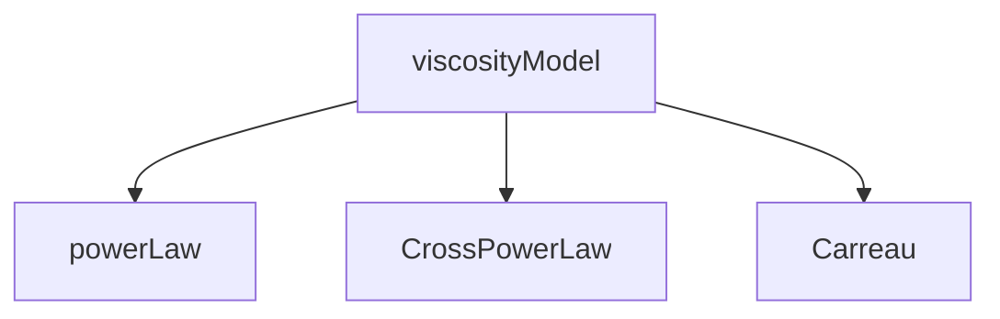

# OpenFOAM Architecture for Non-Newtonian

สถาปัตยกรรม Non-Newtonian ใน OpenFOAM

---

## Overview

> Class hierarchy สำหรับ viscosity models

---

## 1. Class Hierarchy



---

## 2. Base Class

```cpp
class viscosityModel
{
public:
    virtual tmp<volScalarField> nu() const = 0;
    virtual void correct() = 0;
};
```

---

## 3. Strain Rate

```cpp
tmp<volScalarField> strainRate() const
{
    return sqrt(2.0) * mag(symm(fvc::grad(U_)));
}
```

---

## 4. Transport Model

```cpp
singlePhaseTransportModel transportModel(U, phi);
const volScalarField& nu = transportModel.nu();
```

---

## Quick Reference

| Class | Purpose |
|-------|---------|
| viscosityModel | Base |
| strainRate() | γ̇ |
| nu() | Viscosity |

## 🧠 Concept Check

<details>
<summary><b>1. Runtime Type Selection (RTS) คืออะไร?</b></summary>

**RTS** คือกลไกที่ทำให้เลือก viscosity model ได้จาก **dictionary ขณะ runtime:**

```cpp
// constant/transportProperties
transportModel Carreau;  // เลือก Carreau model

CarreauCoeffs
{
    nu0  [0 2 -1 0 0 0 0] 1e-03;
    nuInf [0 2 -1 0 0 0 0] 1e-06;
    ...
}
```

**ไม่ต้อง recompile** เมื่อเปลี่ยน model!

</details>

<details>
<summary><b>2. strainRate() คำนวณอย่างไร?</b></summary>

Strain rate ($\dot{\gamma}$) คำนวณจาก **symmetric part** ของ velocity gradient:

$$\mathbf{D} = \frac{1}{2}\left(\nabla\mathbf{U} + (\nabla\mathbf{U})^T\right)$$
$$\dot{\gamma} = \sqrt{2\mathbf{D}:\mathbf{D}} = \sqrt{2} \cdot |\mathbf{D}|$$

**โค้ด:**
```cpp
strainRate = sqrt(2.0) * mag(symm(fvc::grad(U)));
```

</details>

<details>
<summary><b>3. ทำไมใช้ virtual function `nu()`?</b></summary>

เพื่อให้ทุก viscosity model มี **interface เดียวกัน:**

```cpp
class viscosityModel {
public:
    virtual tmp<volScalarField> nu() const = 0;  // Pure virtual
};
```

**ประโยชน์:**
- Solver ไม่ต้องรู้ว่าใช้ model อะไร
- เปลี่ยน model ได้โดยไม่ต้องแก้ solver code
- Polymorphism → ยืดหยุ่นสูง

</details>

---

## 📖 เอกสารที่เกี่ยวข้อง

- **ภาพรวม:** [00_Overview.md](00_Overview.md) — ภาพรวม Non-Newtonian
- **บทก่อนหน้า:** [02_Viscosity_Models.md](02_Viscosity_Models.md) — Viscosity Models
- **บทถัดไป:** [04_Numerical_Implementation.md](04_Numerical_Implementation.md) — การใช้งานเชิงตัวเลข
- **Fundamentals:** [01_Non_Newtonian_Fundamentals.md](01_Non_Newtonian_Fundamentals.md) — พื้นฐาน