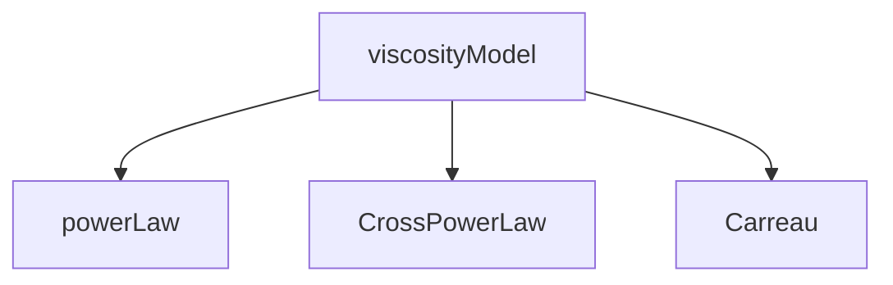

# OpenFOAM Architecture for Non-Newtonian

สถาปัตยกรรม Non-Newtonian ใน OpenFOAM

---

## Overview

> Class hierarchy สำหรับ viscosity models

---

## 1. Class Hierarchy



---

## 2. Base Class

```cpp
class viscosityModel
{
public:
    virtual tmp<volScalarField> nu() const = 0;
    virtual void correct() = 0;
};
```

---

## 3. Strain Rate

```cpp
tmp<volScalarField> strainRate() const
{
    return sqrt(2.0) * mag(symm(fvc::grad(U_)));
}
```

---

## 4. Transport Model

```cpp
singlePhaseTransportModel transportModel(U, phi);
const volScalarField& nu = transportModel.nu();
```

---

## Quick Reference

| Class | Purpose |
|-------|---------|
| viscosityModel | Base |
| strainRate() | γ̇ |
| nu() | Viscosity |

---

## Concept Check

<details>
<summary><b>1. RTS?</b></summary>

**Runtime selection** จาก dictionary
</details>

---

## Related Documents

- **ภาพรวม:** [00_Overview.md](00_Overview.md)