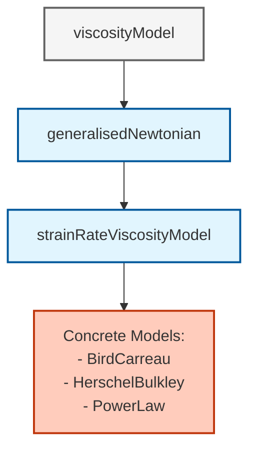
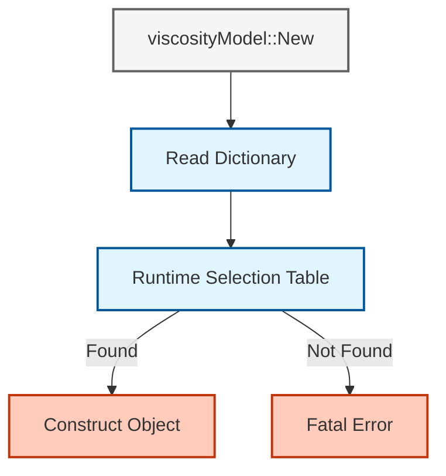

# 03. สถาปัตยกรรม OpenFOAM สำหรับของไหลนอนนิวตัน

> [!INFO] **ภาพรวม**
> เอกสารนี้วิเคราะห์สถาปัตยกรรมภายในของ OpenFOAM ที่ใช้จัดการของไหลนอนนิวตัน (Non-Newtonian fluids) โดยเน้นที่โครงสร้างคลาสแบบลำดับชั้น กลไก Run-Time Selection ผ่าน Factory Pattern และกระบวนการคำนวณความหนืดที่ขึ้นกับอัตราการเฉือน (strain-rate dependent viscosity)

---

## 1. กรอบทางคณิตศาสตร์

ของไหลนิวตัน-นอนนิวตันแสดงพฤติกรรมความหนืดที่ขึ้นกับความเค้นเฉือน ซึ่งแตกต่างจากกฎของนิวตัน ใน OpenFOAM โมเดลเหล่านี้ถูก implement ผ่านสมการเชิงโครงสร้าง:

$$\boldsymbol{\tau} = \mu(\dot{\gamma}) \cdot \dot{\boldsymbol{\gamma}}$$

โดยที่:
- $\boldsymbol{\tau}$ คือเทนเซอร์ความเค้น
- $\mu(\dot{\gamma})$ คือความหนืดปรากฏที่ขึ้นกับอัตราการเฉือน
- $\dot{\boldsymbol{\gamma}}$ คือเทนเซอร์อัตราการเสียรูป

### อัตราการเฉือนและเทนเซอร์อัตราการเสียรูป

**ขนาดอัตราความเครียด** $\dot{\gamma}$ ถูกนิยามเป็น:

$$\dot{\gamma} = \sqrt{2\mathbf{D}:\mathbf{D}} = \sqrt{2D_{ij}D_{ij}}$$

**เทนเซอร์อัตราความเครียด** $\mathbf{D}$ ถูกกำหนดโดย:

$$\mathbf{D} = \frac{1}{2}\left(\nabla\mathbf{u} + (\nabla\mathbf{u})^T\right)$$

โดยที่ $\mathbf{u}$ เป็นสนามความเร็ว

---

## 2. ลำดับชั้นคลาส (Class Hierarchy)

OpenFOAM ออกแบบมาให้มีความยืดหยุ่นสูง โดยใช้หลักการ Object-Oriented Programming (OOP) เพื่อให้สามารถเพิ่มโมเดลใหม่ได้โดยไม่ต้องแก้ไข Solver หลัก


> **Figure 1:** แผนภูมิแสดงลำดับชั้นของคลาส (Class Hierarchy) สำหรับแบบจำลองความหนืดใน OpenFOAM ซึ่งสะท้อนถึงการออกแบบเชิงวัตถุที่แยกส่วนอินเทอร์เฟซและการคำนวณทางกายภาพออกจากแบบจำลองทางรีโอโลยีเฉพาะทาง


### คลาสฐาน `viscosityModel`

**ตำแหน่ง**: `src/physicalProperties/viscosityModels/viscosityModel/viscosityModel.H`

คลาส `viscosityModel` ทำหน้าที่เป็นพื้นฐานสำหรับโมเดลความหนืดทั้งหมดใน OpenFOAM มันนิยามอินเทอร์เฟซที่จำเป็นผ่านเมธอดเสมือนบริสุทธิ์:

```cpp
//- Return the kinematic viscosity [m^2/s]
virtual tmp<volScalarField> nu() const = 0;

//- Correct the viscosity field
virtual void correct() = 0;

//- Read and set model coefficients if they have changed
virtual bool read(const dictionary& viscosityProperties) = 0;
```

> **📂 Source:** `src/physicalProperties/viscosityModels/viscosityModel/viscosityModel.H`
>
> **คำอธิบาย:**
> โค้ดนี้นิยาม **อินเทอร์เฟซพื้นฐาน** (Base Interface) ที่ทุกโมเดลความหนืดต้อง Implement:
> - `nu()` - คืนค่าสนามความหนืดลามาร์กเป็น `volScalarField`
> - `correct()` - อัปเดตค่าความหนืดตามเงื่อนไขปัจจุบัน
> - `read()` - อ่านค่าพารามิเตอร์จาก Dictionary
>
> **แนวคิดสำคัญ:**
> - **Pure Virtual Methods** (= 0) บังคับให้ Derived Classes ต้อง Implement
> - **Interface Segregation** - แยกส่วนนิยามอินเทอร์เฟซออกจากการทำงานจริง
> - **Runtime Polymorphism** - เรียกใช้ผ่าน Pointer ของ Base Class

คลาสนี้สร้างสัญญาที่โมเดลความหนืดทั้งหมดต้องเติมเต็ม ขณะที่ยังคงไม่แสดงความเห็นเกี่ยวกับความสัมพันธ์จลนศาสตร์เฉพาะ

### `generalisedNewtonianViscosityModel`

สร้างขึ้นจากอินเทอร์เฟซฐาน คลาสนี้นำเสนอข้อกำหนดพื้นฐานสำหรับของไหลนิวตันทั่วไป:

```cpp
class generalisedNewtonianViscosityModel
:
    public viscosityModel
{
protected:
    // Reference to the velocity field
    const volVectorField& U_;

    // Reference viscosity field
    const dimensionedScalar viscosity_;

    // Strain-rate magnitude field
    volScalarField strainRate_;

public:
    //- Update strain-rate and viscosity fields
    virtual void correct() = 0;

    //- Return strain-rate magnitude field
    const volScalarField& strainRate() const;
};
```

> **📂 Source:** `src/physicalProperties/viscosityModels/generalisedNewtonianViscosityModel/generalisedNewtonianViscosityModel.H`
>
> **คำอธิบาย:**
> คลาสนี้เป็น **Abstract Intermediate Class** ที่เพิ่มฟังก์ชันการทำงานสำหรับของไหลนิวตันทั่วไป:
> - เก็บ Reference ไปยังสนามความเร็ว `U_`
> - เก็บสนามอัตราการเฉือน `strainRate_`
> - มีสมาชิกที่มีการป้องกัน (protected members) สำหรับใช้โดย Derived Classes
>
> **แนวคิดสำคัญ:**
> - **Template Method Pattern** - ให้โครงสร้างพื้นฐานสำหรับ Derived Classes
> - **Protected Members** - ให้การเข้าถึงแก่ Derived Classes แต่ไม่ให้ภายนอก
> - **Reference Semantics** - ใช้ Reference เพื่อหลีกเลี่ยงการคัดลอกข้อมูลขนาดใหญ่

### `strainRateViscosityModel`

นี่คือคลาส **หลัก** ที่จัดการกับเครื่องมือคณิตศาสตร์ทั้งหมดสำหรับการคำนวณอัตราความเครียด:

```cpp
class strainRateViscosityModel
:
    public generalisedNewtonianViscosityModel
{
protected:
    // Kinematic viscosity field
    volScalarField nu_;

    // Core strain-rate calculation method
    virtual tmp<volScalarField> strainRate() const;

    // Interface for concrete models to implement
    virtual tmp<volScalarField> nu
    (
        const volScalarField& nu0,
        const volScalarField& strainRate
    ) const = 0;

public:
    //- Update viscosity based on strain rate
    virtual void correct();

    //- Return kinematic viscosity
    virtual tmp<volScalarField> nu() const;
};
```

> **📂 Source:** `src/physicalProperties/viscosityModels/strainRateViscosityModel/strainRateViscosityModel.H`
>
> **คำอธิบาย:**
> คลาสนี้เป็น **Core Implementation** ที่มีการคำนวณทางคณิตศาสตร์ทั้งหมด:
> - `strainRate()` - คำนวณอัตราการเฉือนจากเกรเดียนต์ความเร็ว
> - `nu(nu0, strainRate)` - เมธอด Virtual Pure ที่ Derived Classes ต้อง Implement ด้วยสมการจลนศาสตร์เฉพาะ
> - `correct()` - อัปเดตความหนืดโดยเรียก `strainRate()` และ `nu()`
>
> **แนวคิดสำคัญ:**
> - **Separation of Concerns** - แยกการคำนวณเทนเซอร์ (Tensor Calculus) ออกจากสมการจลนศาสตร์ (Rheology)
> - **Template Method** - เฟรมเวิร์กทำงานหนัก ส่วน Derived Classes เพียง Implement สมการ
> - **Temporary Field Management** - ใช้ `tmp<>` สำหรับการจัดการหน่วยความจำอัตโนมัติ

---

## 3. กลไก Run-Time Selection (Factory Pattern)

ความยอดเยี่ยมของ OpenFOAM คือคุณสามารถเปลี่ยนโมเดลได้เพียงแค่เปลี่ยนคำในไฟล์ `transportProperties` โดยไม่ต้อง Compile โค้ดใหม่


> **Figure 2:** แผนภาพแสดงกลไกการเลือกแบบจำลองขณะรันโปรแกรม (Run-Time Selection) ตามรูปแบบโรงงาน (Factory Pattern) ซึ่งเป็นจุดแข็งของ OpenFOAM ที่ช่วยให้ผู้ใช้สามารถสลับเปลี่ยนฟิสิกส์ของการจำลองผ่านไฟล์ Dictionary ได้อย่างรวดเร็ว


### โครงสร้างพื้นฐานการเลือกขณะ Runtime

| แมโคร | ตำแหน่งที่ใช้ | หน้าที่หลัก | ผลลัพธ์ |
|--------|-------------|-------------|----------|
| **`declareRunTimeSelectionTable`** | ไฟล์ส่วนหัวของคลาสพื้นฐาน (`viscosityModel.H`) | ประกาศตารางแบบคงที่สำหรับจับคู่สตริงกับ constructor | สถาปนาอินเทอร์เฟซสำหรับคลาสที่ได้มา |
| **`defineRunTimeSelectionTable`** | ไฟล์ต้นฉบับของคลาสพื้นฐาน (`viscosityModel.C`) | กำหนดการจัดเก็บและเริ่มต้นโครงสร้าง factory | สร้างโครงสร้างพื้นฐานของ factory |
| **`addToRunTimeSelectionTable`** | ไฟล์การนำไปใช้ของโมเดลเฉพาะ | ลงทะเบียนโมเดลเฉพาะกับตาราง factory | ทำให้พร้อมใช้งานสำหรับการเลือกขณะ runtime |

### การนำไปใช้ Factory Method

Factory method หลักใน `viscosityModel`:

```cpp
// From src/physicalProperties/viscosityModels/viscosityModel/viscosityModelNew.C
Foam::autoPtr<Foam::viscosityModel> Foam::viscosityModel::New
(
    const fvMesh& mesh,
    const word& group
)
{
    // Read the model type from the dictionary
    const word modelType = IOdictionary
    (
        IOobject
        (
            "transportProperties",
            mesh.time().constant(),
            mesh,
            IOobject::MUST_READ_IF_MODIFIED,
            IOobject::NO_WRITE
        )
    ).lookupOrDefault<word>("viscosityModel", "Newtonian");

    Info<< "Selecting viscosity model " << modelType << endl;

    typename viscosityModel::dictionaryConstructorTable::iterator cstrIter =
        viscosityModel::dictionaryConstructorTablePtr_->find(modelType);

    if (cstrIter == viscosityModel::dictionaryConstructorTablePtr_->end())
    {
        FatalErrorInFunction
            << "Unknown viscosity model " << modelType << nl << nl
            << "Valid viscosity models are : " << endl
            << viscosityModel::dictionaryConstructorTablePtr_->sortedToc()
            << exit(FatalError);
    }

    return autoPtr<viscosityModel>(cstrIter()(mesh, group));
}
```

> **📂 Source:** `src/physicalProperties/viscosityModels/viscosityModel/viscosityModelNew.C`
>
> **คำอธิบาย:**
> นี่คือ **Factory Method Implementation** ที่สำคัญที่สุดในระบบ Run-Time Selection:
> 1. **Dictionary Lookup** - อ่าน `transportProperties` จาก `constant/` directory
> 2. **Model Identification** - ดึงค่า `viscosityModel` entry (default = "Newtonian")
> 3. **Factory Lookup** - ค้นหาใน `dictionaryConstructorTable`
> 4. **Error Handling** - แสดงรายการโมเดลที่ใช้ได้ถ้าไม่พบ
> 5. **Instantiation** - เรียก Constructor และคืนค่า `autoPtr`
>
> **แนวคิดสำคัญ:**
> - **Factory Pattern** - สร้างออบเจกต์โดยไม่ต้องระบุคลาสที่แน่นอน
> - **AutoPtr Management** - การจัดการหน่วยความจำอัตโนมัติ
> - **Reflection-Like Behavior** - การค้นหาและเรียก Constructor ผ่าน String

**กระบวนการทำงาน:**

1. **Dictionary Lookup**
   - อ่าน `transportProperties` dictionary จาก `constant/` directory
   - ใช้ `IOobject` สำหรับการจัดการไฟล์อย่างปลอดภัย

2. **Model Identification**
   - ดึง `viscosityModel` entry
   - ค่าเริ่มต้นเป็น "Newtonian" หากไม่ระบุ

3. **Factory Lookup**
   - ค้นหา `dictionaryConstructorTable` สำหรับประเภทโมเดลที่ร้องขอ

4. **Error Handling**
   - ตรวจสอบว่าพบโมเดลหรือไม่
   - แสดงข้อความผิดพลาดที่ครอบคลุม

5. **Instantiation**
   - เรียก constructor ที่เหมาะสม
   - ส่งคืน `autoPtr` ไปยังโมเดลที่สร้างขึ้น

### กลไกการลงทะเบียนแบบคงที่

```cpp
// In BirdCarreau.C
addToRunTimeSelectionTable
(
    generalisedNewtonianViscosityModel,
    BirdCarreau,
    dictionary
);
```

> **📂 Source:** `src/physicalProperties/viscosityModels/BirdCarreau/BirdCarreau.C`
>
> **คำอธิบาย:**
> แมโครนี้สร้าง **Static Registration Object** ที่ทำงานอัตโนมัติ:
> - **Self-Registration** - ลงทะเบียนเองก่อน `main()` ทำงาน
> - **Compile-Time Binding** - Compiler สร้างโค้ดลงทะเบียนอัตโนมัติ
> - **Zero Overhead** - ไม่มีค่าใช้จ่ายรันไทม์หลังจากลงทะเบียน
>
> **แนวคิดสำคัญ:**
> - **Static Initialization** - ใช้ Global Static Constructors สำหรับการลงทะเบียน
> - **Macro Metaprogramming** - แมโครสร้างโค้ดซ้ำๆ อัตโนมัติ
> - **Open-Closed Principle** - เปิดสำหรับการขยาย ปิดสำหรับการแก้ไข

แมโครนี้ขยายออกเพื่อสร้างออบเจกต์แบบคงที่ที่:
- **Self-registers** ระหว่างการเริ่มต้นแบบคงที่ (ก่อนที่ `main()` จะทำงาน)
- **Inserts** `BirdCarreau::New` ลงใน factory table
- **Enables** การค้นพบโมเดลโดยอัตโนมัติโดย factory

---

## 4. กลไก: การคำนวณเทนเซอร์อัตราการเฉือนใน C++

### การนิยามทางคณิตศาสตร์

เทนเซอร์อัตราการเฉือน $\dot{\boldsymbol{\gamma}}$ ถูกนิยามเป็น **ส่วนสมมาตรของเกรเดียนต์ความเร็ว**:

$$\dot{\boldsymbol{\gamma}} = \nabla \mathbf{u} + (\nabla \mathbf{u})^{\mathrm{T}}$$

ในโมเดลที่ขึ้นกับอัตราการเฉือนของ OpenFOAM จะใช้ **ขนาดสเกลาร์ของอัตราการเฉือน** $\dot{\gamma}$:

$$\dot{\gamma} = \sqrt{2} \; \bigl\| \dot{\boldsymbol{\gamma}} \bigr\|$$

### OpenFOAM Code Implementation

```cpp
// src/.../strainRateViscosityModel/strainRateViscosityModel.C
tmp<volScalarField> strainRateViscosityModel::strainRate() const
{
    return sqrt(2.0)*mag(symm(fvc::grad(U_)));
}
```

> **📂 Source:** `src/physicalProperties/viscosityModels/strainRateViscosityModel/strainRateViscosityModel.C`
>
> **คำอธิบาย:**
> นี่คือ **Core Tensor Calculus Implementation** ที่แปลงสมการทางคณิตศาสตร์เป็นโค้ด:
> - `fvc::grad(U_)` - คำนวณ $\nabla\mathbf{u}$ เป็น `volTensorField`
> - `symm(...)` - ดึงส่วนสมมาตร: $\frac{1}{2}(\nabla\mathbf{u} + (\nabla\mathbf{u})^T)$
> - `mag(...)` - คำนวณ Frobenius norm: $\|\mathbf{D}\| = \sqrt{D_{ij}D_{ij}}$
> - `sqrt(2.0)` - ปรับสเกลาให้ได้ $\dot{\gamma} = \sqrt{2\mathbf{D}:\mathbf{D}}$
>
> **แนวคิดสำคัญ:**
> - **Finite Volume Calculus** - ใช้ `fvc` (Finite Volume Calculus) สำหรับการดำเนินการสนาม
> - **Tensor Algebra** - Operations บนเทนเซอร์ถูก Abstract ออกมาเป็นฟังก์ชัน
> - **Expression Templates** - การประเมินนิพจน์อัจฉริยะที่หลีกเลี่ยงการคัดลอกชั่วคราว
> - **Temporary Management** - `tmp<>` จัดการวัตถุชั่วคราวอัตโนมัติ

**การแยกส่วนการคำนวณ:**

- `fvc::grad(U_)` – คำนวณเทนเซอร์เกรเดียนต์ความเร็ว $\nabla \mathbf{u}$ เป็น `volTensorField`
- `symm(...)` – ดึงส่วนสมมาตร $\frac{1}{2}(\nabla\mathbf{u} + (\nabla\mathbf{u})^{\mathrm{T}})$
- `mag(...)` – ส่งคืนค่า Frobenius norm
- `sqrt(2.0)` – ปรับขนาด norm

### ขั้นตอนการคำนวณ

1. **คำนวณการไล่ระดับของความเร็ว**: $\nabla\mathbf{u}$

2. **สร้างเทนเซอร์อัตราความเครียด**: $\mathbf{D} = \frac{1}{2}(\nabla\mathbf{u} + (\nabla\mathbf{u})^T)$

3. **คำนวณขนาดของอัตราความเครียด**: $\dot{\gamma} = \sqrt{2\mathbf{D}:\mathbf{D}}$

### พื้นฐานทางคณิตศาสตร์

เทนเซอร์อัตราการเฉือนแทน **อัตราการเปลี่ยนรูปขององค์ประกอบของของไหล** และเป็นพื้นฐานสำหรับ rheology ที่ไม่ใช่นิวตัน

สำหรับการไหลที่ไม่บีบอัด **trace ของ $\dot{\boldsymbol{\gamma}}$ จะเป็นศูนย์**:

$$\text{tr}(\dot{\boldsymbol{\gamma}}) = \nabla \cdot \mathbf{u} = 0$$

---

## 5. การวิเคราะห์โค้ดของโมเดลสำคัญ

### Bird‑Carreau

**สมการ Bird-Carreau:**

$$\nu = \nu_{\infty} + (\nu_0 - \nu_{\infty})\Bigl[1 + (k\dot{\gamma})^a\Bigr]^{(n-1)/a}$$

โดยที่:
- $\nu_0$ คือความหนืดที่อัตราเฉือนเป็นศูนย์ (ความหนืดสูงสุด)
- $\nu_{\infty}$ คือความหนืดที่อัตราเฉือนไม่จำกัด (ความหนืดต่ำสุด)
- $k$ คือค่าคงที่เวลาที่ควบคุมพื้นที่การเปลี่ยนผ่าน
- $n$ คือดัชนีกฎกำลัง
- $a$ คือเลขชี้กำลัง Yasuda

**การวิเคราะห์การ implement:**

```cpp
return
    nuInf_
  + (nu0 - nuInf_)
   *pow
    (
        scalar(1)
      + pow
        (
            tauStar_.value() > 0
          ? nu0*strainRate/tauStar_
          : k_*strainRate,
            a_
        ),
        (n_ - 1.0)/a_
    );
```

> **📂 Source:** `src/physicalProperties/viscosityModels/BirdCarreau/BirdCarreau.C`
>
> **คำอธิบาย:**
> โค้ดนี้แปลง **Bird-Carreau Rheological Model** เป็น C++:
> - **Conditional Branch** - ใช้ `tauStar_ > 0` เพื่อเลือกระหว่างรูปแบบพารามิเตอร์
> - **Power Law Scaling** - `pow(..., a_)` และ `pow(..., (n_-1.0)/a_)` สร้างพฤติกรรม Power Law
> - **Viscosity Bounds** - ค่าจะถูกคลอกระหว่าง `nuInf_` และ `nu0` โดยอัตโนมัติ
> - **Numerical Stability** - การตรวจสอบเงื่อนไขป้องกันค่าที่ไม่ถูกต้อง
>
> **แนวคิดสำคัญ:**
> - **Direct Translation** - สมการทางคณิตศาสตร์ถูกแปลงเป็นโค้ดโดยตรง
> - **Parameter Flexibility** - รองรับทั้งรูปแบบ `k` และ `tauStar`
> - **Type Safety** - ใช้ `scalar(1)` แทน `1` เพื่อความชัดเจน

### Herschel‑Bulkley

**สมการ Herschel-Bulkley:**

$$\nu = \min\Bigl(\nu_0,\; \frac{\tau_0}{\dot{\gamma}} + k\dot{\gamma}^{\,n-1}\Bigr)$$

โดยที่:
- $\tau_0$ คือความเค้นยอม (ความเค้นขั้นต่ำที่จำเป็นในการเริ่มต้นการไหล)
- $k$ คือดัชนีความสม่ำเสมอ
- $n$ คือดัชนีพฤติกรรมการไหล
- $\nu_0$ คือความหนืดที่อัตราเฉือนเป็นศูนย์

**การวิเคราะห์การ implement:**

```cpp
dimensionedScalar tone("tone", dimTime, 1.0);
dimensionedScalar rtone("rtone", dimless/dimTime, 1.0);

return
(
    min
    (
        nu0,
        (tau0_ + k_*rtone*pow(tone*strainRate, n_))
       /max
        (
            strainRate,
            dimensionedScalar ("vSmall", dimless/dimTime, vSmall)
        )
    )
);
```

> **📂 Source:** `src/physicalProperties/viscosityModels/HerschelBulkley/HerschelBulkley.C`
>
> **คำอธิบาย:**
> การ Implement ที่ซับซ้อนซึ่งมี **Numerical Safeguards** หลายระดับ:
> - **Yield Stress Handling** - บวก `tau0_` เข้ากับเทอม Power Law
> - **Division Protection** - `max(strainRate, vSmall)` ป้องกันการหารด้วยศูนย์
> - **Viscosity Capping** - `min(nu0, ...)` จำกัดไม่ให้ความหนืดเกิน `nu0`
> - **Dimensional Consistency** - `tone` และ `rtone` ปรับมิติอย่างถูกต้อง
>
> **แนวคิดสำคัญ:**
> - **Yield Stress Fluids** - ของไหลที่ต้องการความเค้นขั้นต่ำก่อนไหล
> - **Regularization** - หลีกเลี่ยงความไม่ต่อเนื่องที่ $\dot{\gamma} \to 0$
> - **Bounded Computation** - รับประกันว่าค่าอยู่ในช่วงที่กายภาพ

### Power‑Law (Ostwald–de Waele)

**สมการกฎกำลัง:**

$$\nu = \min\Bigl(\nu_{\max},\; \max\bigl(\nu_{\min},\; k\dot{\gamma}^{\,n-1}\bigr)\Bigr)$$

**การวิเคราะห์การ implement:**

```cpp
return max
(
    nuMin_,
    min
    (
        nuMax_,
        k_*pow
        (
            max
            (
                dimensionedScalar(dimTime, 1.0)*strainRate,
                dimensionedScalar(dimless, small)
            ),
            n_.value() - scalar(1)
        )
    )
);
```

> **📂 Source:** `src/physicalProperties/viscosityModels/powerLaw/powerLaw.C`
>
> **คำอธิบาย:**
> การ Implement ที่เรียบง่ายแต่มี **Bounds Enforcement** ที่แข็งแกร่ง:
> - **Double Clipping** - `max(nuMin_, min(nuMax_, ...))` บังคับช่วง `[nuMin_, nuMax_]`
> - **Power Law Core** - `pow(strainRate, n-1)` สร้างพฤติกรรม Power Law
> - **Zero Protection** - `max(strainRate, small)` ป้องกันค่า `strainRate = 0`
> - **Dimensional Construction** - `dimensionedScalar(dimTime, 1.0)` สร้างค่าที่มีมิติถูกต้อง
>
> **แนวคิดสำคัญ:**
> - **Shear-Thinning/Thickening** - `n < 1` (shear-thinning), `n > 1` (shear-thickening)
> - **Physical Bounds** - ความหนืดต้องอยู่ในช่วงที่กายภาพ
> - **Numerical Robustness** - การป้องกันค่าสุดโต่ง

---

## 6. ทำไมจึงออกแบบแบบนี้? (หลักการ)

### ความยืดหยุ่นผ่านรูปแบบ Factory

การใช้งานรูปแบบ factory ช่วยให้สามารถขยายโมเดล rheology ได้อย่างราบรื่นโดยไม่ต้องแก้ไขไลบรารีหลักของ OpenFOAM แนวทางนี้เป็นไปตามหลักการเปิด-ปิด: **ระบบเปิดสำหรับการขยาย แต่ปิดสำหรับการแก้ไข**

ผู้ใช้สามารถเพิ่มโมเดลความหนืดแบบกำหนดเองได้โดย:

```cpp
// การใช้งานโมเดลแบบกำหนดเอง
class customViscosityModel : public strainRateViscosityModel
{
    // การลงทะเบียน constructor
    addToRunTimeSelectionTable
    (
        strainRateViscosityModel,
        customViscosityModel,
        dictionary
    );

    // การใช้งานเมธอดหลัก
    virtual tmp<volScalarField> nu
    (
        const dimensionedScalar& nu0,
        const volScalarField& strainRate
    ) const;
};
```

> **📂 Source:** ตัวอย่างโค้ดสำหรับ Custom Model Implementation
>
> **คำอธิบาย:**
> นี่คือ **Blueprint สำหรับการสร้าง Custom Viscosity Model**:
> - **Inheritance** - สืบทอดจาก `strainRateViscosityModel` เพื่อรับโครงสร้างพื้นฐาน
> - **Runtime Registration** - แมโคร `addToRunTimeSelectionTable` ลงทะเบียนโมเดลอัตโนมัติ
> - **Interface Implementation** - Override เมธอด `nu()` เพื่อใส่สมการจลนศาสตร์
> - **Dictionary-Based** - อ่านพารามิเตอร์จากไฟล์ Dictionary ผ่าน Constructor
>
> **แนวคิดสำคัญ:**
> - **Open-Closed Principle** - เปิดสำหรับการขยาย (เพิ่มโมเดล) แต่ปิดสำหรับการแก้ไข (ไม่ต้องแก้ Core)
> - **Plugin Architecture** - โมเดลใหม่ทำงานเหมือน Plugin
> - **Zero Core Modification** - ไม่ต้อง Recompile OpenFOAM Library

### การนามธรรมทางคณิตศาสตร์และการแยกความกังวล

สถาปัตยกรรมนี้แยกการดำเนินการแคลคูลัสเทนเซอร์ออกจากความสัมพันธ์ rheology สเกลาร์อย่างชัดเจน:

**การจัดการเทนเซอร์:**
`strainRateViscosityModel` จัดการกับการคำนวณเทนเซอร์อัตราการเสียรูป:

$$\mathbf{D} = \frac{1}{2}\left(\nabla \mathbf{u} + (\nabla \mathbf{u})^T\right)$$

**เรียโอโลยีสเกลาร์:**
โมเดลที่เป็นรูปธรรมมุ่งเน้นเพียงความสัมพันธ์ตามรูปแบบ:

$$\mu = f(\dot{\gamma}, \text{พารามิเตอร์โมเดล})$$

### ความปลอดภัยด้านมิติและการตรวจสอบชนิด

ระบบมิติของ OpenFOAM ให้การตรวจสอบความสอดคล้องด้านมิติในระยะคอมไพล์และรันไทม์:

```cpp
dimensionedScalar k("k", dimensionSet(1, -1, -2, 0, 0, 0, 0), 0.1);
// ทำให้แน่ใจว่า k มีหน่วย [Pa·s^n] เพื่อความสอดคล้องกับโมเดล
```

> **📂 Source:** ตัวอย่าง Dimensioned Type Usage
>
> **คำอธิบาย:**
> OpenFOAM มี **Dimension-Aware Type System** ที่เข้มงวด:
> - **dimensionSet** - นิยามมิติ [M, L, T, θ, I, J, N] (Mass, Length, Time, Temperature, etc.)
> - **Compile-Time Checking** - Compiler ตรวจสอบความสอดคล้องของมิติ
> - **Runtime Validation** - การดำเนินการที่ไม่ถูกต้องจะเกิด Runtime Error
> - **Self-Documenting** - หน่วยถูกฝังใน Type เอง
>
> **แนวคิดสำคัญ:**
> - **Dimensional Homogeneity** - สมการต้องมีมิติสอดคล้องกัน
> - **Type Safety** - ป้องกันการผสมหน่วยที่ไม่ถูกต้อง
> - **Physical Correctness** - ตรวจสอบความถูกต้องทางกายภาพ

### กลยุทธ์ความแข็งแกร่งทางตัวเลข

การใช้งานแต่ละอย่างรวมการป้องกันทางตัวเลขเฉพาะเพื่อให้แน่ใจว่าการจำลองแบบเสถียร:

**การป้องกันอัตราการเสียรูปศูนย์:**
```cpp
const dimensionedScalar epsilon = "small", dimless, SMALL;
strainRate = max(strainRate, epsilon);  // ป้องกันการหารด้วยศูนย์
```

**การจำกัดความหนืด:**
```cpp
// ขอบเขตความหนืดที่สมจริง
const dimensionedScalar nuMin("nuMin", dimViscosity, 1e-6);
const dimensionedScalar nuMax("nuMax", dimViscosity, 1e-6);
nu = max(nuMin, min(nu, nuMax));
```

> **📂 Source:** ตัวอย่าง Numerical Safeguards
>
> **คำอธิบาย:**
> **Numerical Robustness Strategies** ที่ใช้ในโมเดลต่างๆ:
> - **Zero Division Protection** - ใช้ `max(strainRate, epsilon)` เพื่อหลีกเลี่ยง NaN
> - **Value Clipping** - บังคับค่าให้อยู่ในช่วงที่กายภาพ
> - **Regularization** - แก้ปัญหาความไม่ต่อเนื่องที่จุดวิกฤต
> - **Gradual Transitions** - หลีกเลี่ยงการเปลี่ยนแบบขั้นบันได
>
> **แนวคิดสำคัญ:**
> - **Numerical Stability** - ป้องกัน Simulation ล้มเหลว
> - **Physical Realism** - ค่าต้องสอดคล้องกับความเป็นจริง
> - **Robustness** - ทำงานได้ดีในทุกเงื่อนไข

---

## 7. การใช้งาน: การกำหนดค่ากรณีของไหล Non-Newtonian

### การกำหนดค่าคุณสมบัติการขนส่ง

ดิกชันนารี `constant/transportProperties` ทั่วไปสำหรับของไหลแบบ Herschel-Bulkley:

```cpp
transportModel  Newtonian;   // หรือ nonNewtonian

// ความหนืดลามาร์กเมื่อไม่มีแรงเฉือน
nu              nu [0 2 -1 0 0 0 0] 0.01;

// เลือกโมเดลที่ขึ้นอยู่กับอัตราความเครียด
viscosityModel  HerschelBulkley;

HerschelBulkleyCoeffs
{
    tau0        0.01;        // ค่าความเครียดใหญ่สูงสุด [Pa]
    k           0.001;       // ดัชนีความสม่ำเสมอ [Pa·sⁿ]
    n           0.2;         // ดัชนีกฎกำลัง
}
```

> **📂 Source:** ไฟล์ตัวอย่าง Case: `constant/transportProperties`
>
> **คำอธิบาย:**
> ไฟล์ **Dictionary Configuration** สำหรับการตั้งค่าโมเดลความหนืด:
> - **Model Selection** - ระบุ `viscosityModel HerschelBulkley` เพื่อเลือกโมเดล
> - **Coefficient Dictionary** - `HerschelBulkleyCoeffs` เก็บพารามิเตอร์เฉพาะโมเดล
> - **Dimension Specification** - `[0 2 -1 0 0 0 0]` นิยามหน่วย [L²/T] สำหรับความหนืด
> - **Runtime Switching** - เปลี่ยนโมเดลได้โดยไม่ต้อง Recompile
>
> **แนวคิดสำคัญ:**
> - **Dictionary-Driven** - การตั้งค่าผ่านไฟล์ Text
> - **Hierarchical Structure** - จัดระเบียบพารามิเตอร์แบบลำดับชั้น
> - **Self-Documenting** - ชื่อพารามิเตอร์บอกความหมาย

### พารามิเตอร์ของโมเดล Herschel-Bulkley

| พารามิเตอร์ | สัญลักษณ์ | หน่วย | คำอธิบาย |
|------------|----------|--------|--------------------------------|
| ค่าความเครียดใหญ่สูงสุด | $\tau_0$ | Pa | ค่าความเครียดขั้นต่ำที่จำเป็นในการเริ่มการไหล |
| ดัชนีความสม่ำเสมอ | $k$ | Pa·s$^n$ | ตัววัดความสม่ำเสมอของความหนืด |
| ดัชนีกฎกำลัง | $n$ | ไม่มีหน่วย | กำหนดพฤติกรรมการตัดน้ำหนัก/เหนียวขึ้นเมื่อถูกเฉือน |

---

## 8. โมเดลนิวตัน-นอนนิวตันที่มีให้ใช้งาน

| โมเดล | สมการจลนศาสตร์ | พารามิเตอร์ | การประยุกต์ใช้ |
|--------|------------------|-------------|----------------|
| **BirdCarreau** | $\mu = \mu_\infty + (\mu_0 - \mu_\infty)[1 + (k\dot{\gamma})^a]^{(n-1)/a}$ | $k, n, \mu_0, \mu_\infty, a$ | เลือด, โพลีเมอร์, ของเหลวทางชีวภาพ |
| **HerschelBulkley** | $\mu = \tau_0/\dot{\gamma} + k\dot{\gamma}^{n-1}$ | $\tau_0, k, n$ | ของเหลวขุดเจาะ, คอนกรีต, อาหาร |
| **powerLaw** | $\mu = k\dot{\gamma}^{n-1}$ | $k, n$ | สลัalลัน, เคลือบ, การไหลง่าย |

---

## 9. ตำแหน่งของ Source Code ในระบบ

หากต้องการศึกษาโค้ดหรือสร้างโมเดลของตัวเอง คุณสามารถค้นหาได้ที่:

*   `src/transportModels/viscosityModels/` (สำหรับโมเดลทั่วไป)
*   `src/transportModels/incompressible/viscosityModels/` (สำหรับ Incompressible flow)

---

## 10. การคำนวณใน Solver Loop

ในแต่ละ Time Step หรือ Iteration ของ Solver (เช่น `simpleFoam`), โมเดลความหนืดจะถูก Update เสมอ:

```cpp
while (runTime.loop())
{
    // 1. คำนวณความหนืดใหม่ตามความเร็ว (U) ปัจจุบัน
    transport->correct();

    // 2. ดึงค่าความหนืดออกมาใช้งานในสมการโมเมนตัม
    const volScalarField& nu = transport->nu();

    // 3. แก้สมการ U และ p ต่อไป...
}
```

> **📂 Source:** ตัวอย่างจาก Solver Loop (เช่น `simpleFoam.C`)
>
> **คำอธิบาย:**
> **Time Integration Loop** ที่ใช้โมเดลความหนืด:
> - **Viscosity Update** - `transport->correct()` คำนวณความหนืดใหม่จากความเร็วปัจจุบัน
> - **Field Access** - `transport->nu()` คืนค่าสนามความหนืดสำหรับสมการโมเมนตัม
> - **Decoupling** - Solver ไม่จำเป็นต้องรู้โมเดลที่แน่นอน
> - **Iterative Coupling** - ความหนืดและความเร็ว Update จนถึง Convergence
>
> **แนวคิดสำคัญ:**
> - **Segregated Solution** - แก้สมการแยกกันแล้ว Coupling
> - **Non-Linear Iteration** - ความหนืดเปลี่ยนตามความเร็วในแต่ละ Iteration
> - **Interface-Based Design** - Solver ทำงานกับ Base Class Pointer

โครงสร้างแบบนี้ช่วยให้ Solver หลักไม่จำเป็นต้องรู้ว่าของไหลเป็นนิวตันหรือนอนนิวตัน—มันแค่ขอค่า `nu` ล่าสุดมาใช้งานเท่านั้น

---

> [!TIP] **ประโยชน์ของสถาปัตยกรรมนี้**
>
> 1. **การซ้ำรหัสน้อยที่สุด**: การคำนวณอัตราความเครียดและการจัดการสนามถูก Implement ครั้งเดียวในคลาสฐาน
> 2. **อินเทอร์เฟซที่สอดคล้องกัน**: โมเดลทั้งหมดให้เมธอด `nu()` และ `correct()` เหมือนกัน
> 3. **การขยายง่าย**: การเพิ่มโมเดลใหม่ต้องการเพียง Implement สมการจลนศาสตร์
> 4. **ความยืดหยุ่นรันไทม์**: โมเดลสามารถเปลี่ยนในไฟล์อินพุตโดยไม่ต้องคอมไพล์ซ้ำ
> 5. **ความสม่ำเสมอทางตัวเลข**: โมเดลทั้งหมดใช้วิธีการคำนวณอัตราความเครียดเหมือนกัน