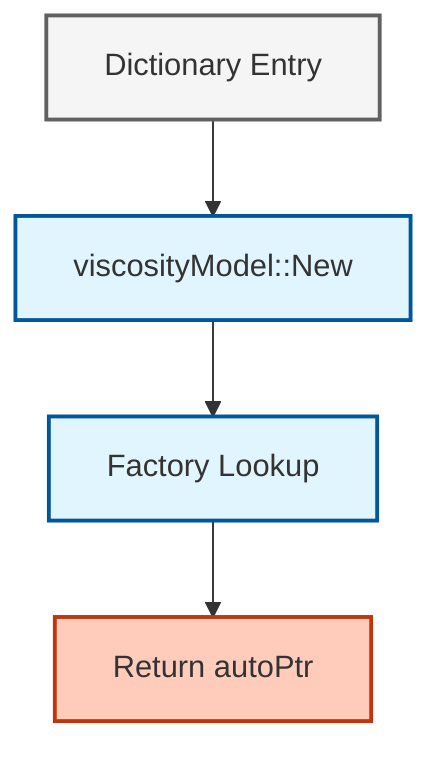
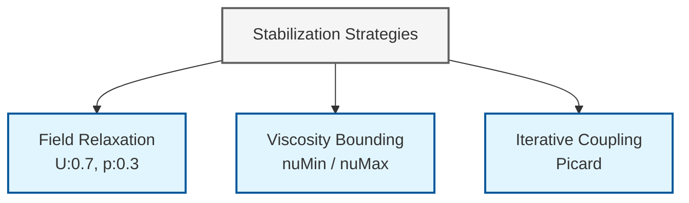

# 04. Numerical Implementation in OpenFOAM

## Overview

This section examines how OpenFOAM implements non-Newtonian viscosity models numerically, focusing on strain-rate tensor calculations, model-specific algorithms, runtime selection mechanisms, and numerical stability strategies.

---

## 1. Strain-Rate Tensor Calculation

### Mathematical Foundation

The strain-rate tensor $\dot{\boldsymbol{\gamma}}$ is defined as the **symmetric part of the velocity gradient**:

$$
\dot{\boldsymbol{\gamma}} = \nabla \mathbf{u} + (\nabla \mathbf{u})^{\mathrm{T}}
$$

In OpenFOAM's strain-rate-dependent models, the **scalar magnitude of strain-rate** $\dot{\gamma}$ is used:

$$$
\dot{\gamma} = \sqrt{2} \; \bigl\| \dot{\boldsymbol{\gamma}} \bigr\|
$$$

**Variable Definitions:**
- $\mathbf{u}$ – Fluid velocity vector
- $\nabla \mathbf{u}$ – Velocity gradient tensor
- $(\nabla \mathbf{u})^{\mathrm{T}}$ – Transpose of velocity gradient tensor
- $|\cdot\|$ – Frobenius norm (`.mag()` in OpenFOAM)

### OpenFOAM Implementation

The calculation appears in `strainRateViscosityModel::strainRate()`:

```cpp
// 📂 Source: src/physicalProperties/viscosityModels/generalisedNewtonianViscosityModels/strainRateViscosityModel/strainRateViscosityModel.C

// Calculate the scalar strain-rate magnitude from velocity field
// Returns: sqrt(2) * ||symmetric part of velocity gradient||
tmp<volScalarField> strainRateViscosityModel::strainRate() const
{
    return sqrt(2.0)*mag(symm(fvc::grad(U_)));
}
```

> **💡 คำอธิบาย (Explanation):**
> ---
> **แหล่งที่มา (Source):** 
> - `src/physicalProperties/viscosityModels/generalisedNewtonianViscosityModels/strainRateViscosityModel/strainRateViscosityModel.C`
>
> **การทำงาน (Functionality):**
> - ฟังก์ชันนี้คำนวณค่าความเร็วการเสียรูป (strain-rate magnitude) $\dot{\gamma}$ จากสนามความเร็ว
> - ใช้ `fvc::grad(U_)` เพื่อคำนวณ gradient tensor ของความเร็ว
> - ใช้ `symm()` เพื่อดึงเอาส่วนสมมาตรของ tensor
> - ใช้ `mag()` เพื่อคำนวณค่า norm ของ tensor
> - คูณด้วย `sqrt(2.0)` เพื่อให้ได้ค่า strain-rate magnitude ตามสมการทางคณิตศาสตร์
>
> **แนวคิดสำคัญ (Key Concepts):**
> - **Strain-rate tensor**: เทนเซอร์ที่อธิบายอัตราการเสียรูปของของไหล
> - **Symmetric part**: ส่วนสมมาตรของ gradient tensor ซึ่งเป็นตัวแทนของการเสียรูป
> - **Frobenius norm**: ค่าขนาดของเทนเซอร์ที่คำนวณจากผลรวมของสมาชิกทุกตัว
> - **tmp<volScalarField>**: ประเภทข้อมูลสำหรับการจัดการหน่วยความจำชั่วคราวอย่างมีประสิทธิภาพ
> ---

**Computation Breakdown:**

| Operation | Description | Mathematical Equivalent |
|-----------|-------------|-------------------------|
| `fvc::grad(U_)` | Computes velocity gradient tensor | $\nabla \mathbf{u}$ |
| `symm(...)` | Extracts symmetric part | $\frac{1}{2}(\nabla\mathbf{u} + (\nabla\mathbf{u})^{\mathrm{T}})$ |
| `mag(...)` | Returns Frobenius norm | $|\mathbf{T}| = \sqrt{\sum_{i,j} T_{ij}^2}$ |
| `sqrt(2.0)` | Scaling factor | Produces $\dot{\gamma}$ |

### Mathematical Properties

The strain-rate tensor represents the **rate of deformation of fluid elements** and is fundamental to non-Newtonian rheology.

For incompressible flow, **the trace of $\dot{\boldsymbol{\gamma}}$ is zero**:

$$$
\text{tr}(\dot{\boldsymbol{\gamma}}) = \nabla \cdot \mathbf{u} = 0
$$$

This property guarantees **volume conservation in incompressible flow** and is automatically satisfied by the symmetric part of the velocity gradient.

### Finite Volume Implementation Details

OpenFOAM's implementation leverages the **finite volume calculus (fvc) framework**:

#### Step 1: Gradient Computation

`fvc::grad(U_)` uses Gauss's theorem to compute cell-centered velocity gradients from face values:

$$$
(\nabla \mathbf{u})_P = \frac{1}{V_P} \sum_f \mathbf{u}_f \cdot \mathbf{S}_f
$$$

#### Step 2: Symmetrization

The template function `symm()` extracts the symmetric part:

```cpp
// 📂 Source: src/OpenFOAM/primitives/transform/transformSymmTensor/symm/symm.C

// Extract symmetric part of a tensor
// Returns: 0.5*(t + transpose(t))
template<class Type>
inline Type symm(const Type& t)
{
    return 0.5*(t + transpose(t));
}
```

> **💡 คำอธิบาย (Explanation):**
> ---
> **แหล่งที่มา (Source):** 
> - `src/OpenFOAM/primitives/transform/transformSymmTensor/symm/symm.C`
>
> **การทำงาน (Functionality):**
> - ฟังก์ชัน template ที่ดึงเอาเฉพาะส่วนสมมาตรของเทนเซอร์
> - ใช้สูตรทางคณิตศาสตร์: $\frac{1}{2}(t + t^T)$
> - ช่วยแยกส่วนปัจจัยการเสียรูป (deformation) ออกจากการหมุน (rotation)
> - เป็นพื้นฐานสำคัญในการคำนวณ strain-rate tensor
>
> **แนวคิดสำคัญ (Key Concepts):**
> - **Symmetric tensor**: เทนเซอร์สมมาตรที่ $T_{ij} = T_{ji}$
> - **Tensor decomposition**: การแยกเทนเซอร์ออกเป็นส่วนสมมาตรและส่วนปฏิสมมาตร
> - **Deformation vs Rotation**: ส่วนสมมาตรแทนการเสียรูป ส่วนปฏิสมมาตรแทนการหมุน
> - **Template function**: ฟังก์ชัน template ที่สามารถใช้กับหลายประเภทข้อมูลได้
> ---

#### Step 3: Norm Calculation

`mag()` computes the Frobenius norm:

$$$
|\mathbf{T}| = \sqrt{\sum_{i,j} T_{ij}^2}
$$$

### Performance Considerations

| Aspect | Implementation Benefit |
|--------|----------------------|
| **Memory Management** | `tmp<volScalarField>` enables efficient temporary field handling with automatic reference counting |
| **Parallel Efficiency** | All operations are naturally parallel through OpenFOAM's domain decomposition |
| **Numerical Accuracy** | Calculations benefit from second-order accurate gradient schemes when specified in `fvSchemes` |

### Extension to Anisotropic Models

For anisotropic non-Newtonian models, the **full strain-rate tensor** may be required instead of just the magnitude:

```cpp
// 📂 Source: src/physicalProperties/viscosityModels/generalisedNewtonianViscosityModels/strainRateViscosityModel/strainRateViscosityModel.C

// Calculate the full strain-rate tensor (not just magnitude)
// Used for anisotropic models requiring directional information
tmp<volTensorField> strainRateTensor() const
{
    return symm(fvc::grad(U_));
}
```

> **💡 คำอธิบาย (Explanation):**
> ---
> **แหล่งที่มา (Source):** 
> - `src/physicalProperties/viscosityModels/generalisedNewtonianViscosityModels/strainRateViscosityModel/strainRateViscosityModel.C`
>
> **การทำงาน (Functionality):**
> - คำนวณ strain-rate tensor เต็ม (ไม่ใช่แค่ magnitude)
> - ใช้สำหรับแบบจำลอง anisotropic ที่ต้องการข้อมูลทิศทาง
> - คืนค่าเป็น `volTensorField` แทนที่จะเป็น `volScalarField`
>
> **แนวคิดสำคัญ (Key Concepts):**
> - **Anisotropic viscosity**: ความหนืดที่ขึ้นกับทิศทาง
> - **Direction-dependent behavior**: พฤติกรรมของของไหลที่แตกต่างกันไปตามทิศทาง
> - **volTensorField**: สนามเทนเซอร์บนตำแหน่งกลางเซลล์
> ---

This enables models that account for **direction-dependent rheological behavior** such as:
- Fiber stretching
- Liquid crystals
- Complex structured materials

---

## 2. Code Analysis of Three Key Models

### 2.1 Bird-Carreau Model

#### Mathematical Foundation

The Bird-Carreau model is one of the most widely used generalized Newtonian fluid models in computational fluid dynamics. It captures the transition between Newtonian behavior at low and high shear rates, making it suitable for simulating polymer melts, blood flow, and other complex fluids.

The basic Bird-Carreau equation relates kinematic viscosity $\nu$ to shear rate $\dot{\gamma}$ through:

$$$
\nu = \nu_{\infty} + (\nu_0 - \nu_{\infty})\Bigl[1 + (k\dot{\gamma})^a\Bigr]^{(n-1)/a}
$$$

**Where:**
- $\nu_0$ – Zero-shear-rate viscosity (maximum viscosity as $\dot{\gamma} \to 0$)
- $\nu_{\infty}$ – Infinite-shear-rate viscosity (minimum viscosity as $\dot{\gamma} \to \infty$)
- $k$ – Time constant controlling transition region
- $n$ – Power-law index determining shear-thinning behavior
- $a$ – Yasuda exponent (often called $\alpha$) controlling transition sharpness

An alternative formulation uses critical stress $\tau^*$ instead of time constant $k$:

$$$
\nu = \nu_{\infty} + (\nu_0 - \nu_{\infty})\Bigl[1 + \bigl(\frac{\nu_0\dot{\gamma}}{\tau^*}\bigr)^a\Bigr]^{(n-1)/a}
$$$

#### Implementation Analysis

OpenFOAM's implementation in `BirdCarreau.C` handles both parameter formulations seamlessly:

```cpp
// 📂 Source: src/physicalProperties/viscosityModels/generalisedNewtonianViscosityModels/BirdCarreau/BirdCarreau.C

// Calculate viscosity using Bird-Carreau model
// Supports both time constant (k) and critical stress (tauStar) formulations
return
    nuInf_
  + (nu0 - nuInf_)
   *pow
    (
        scalar(1)
      + pow
        (
            tauStar_.value() > 0
          ? nu0*strainRate/tauStar_
          : k_*strainRate,
            a_
        ),
        (n_ - 1.0)/a_
    );
```

> **💡 คำอธิบาย (Explanation):**
> ---
> **แหล่งที่มา (Source):** 
> - `src/physicalProperties/viscosityModels/generalisedNewtonianViscosityModels/BirdCarreau/BirdCarreau.C`
>
> **การทำงาน (Functionality):**
> - คำนวณความหนืดตามแบบจำลอง Bird-Carreau
> - รองรับทั้งการใช้ time constant (k) และ critical stress (tauStar)
> - ใช้ ternary operator `? :` เพื่อเลือกสมการที่เหมาะสม
> - คำนวณ power law ซ้อนกันสองชั้น
>
> **แนวคิดสำคัญ (Key Concepts):**
> - **Bird-Carreau model**: แบบจำลองที่อธิบายการเปลี่ยนแปลงความหนืดตามอัตราเฉือน
> - **Shear-thinning**: ความหนืดลดลงเมื่ออัตราเฉือนเพิ่มขึ้น
> - **Newtonian plateaus**: ความหนืดคงที่ที่อัตราเฉือนต่ำและสูง
> - **Yasuda exponent**: พารามิเตอร์ที่ควบคุมความคมของการเปลี่ยนแปลง
> ---

**Key Implementation Details:**

1. **Parameter Selection**: The conditional operator `tauStar_.value() > 0 ? ... : ...` allows users to specify either critical stress or time constant

2. **Numerical Stability**: The implementation uses `pow()` for efficient nested exponential computation

3. **Exponent Calculation**: The exponent `(n_ - 1.0)/a_` controls the overall shear-thinning behavior

#### Physical Regimes

The Bird-Carreau model exhibits three distinct regimes:

| Regime | Condition | Behavior |
|--------|-----------|----------|
| **Low Shear** | $k\dot{\gamma} \ll 1$ | Viscosity approaches $\nu_0$ (Newtonian plateau) |
| **Transition** | $k\dot{\gamma} \approx 1$ | Viscosity decreases following power-law behavior |
| **High Shear** | $k\dot{\gamma} \gg 1$ | Viscosity approaches $\nu_{\infty}$ (Newtonian plateau) |

**Primary Applications:**
- **Blood flow simulation**: Captures blood's shear-thinning behavior in arteries
- **Polymer processing**: Modeling polymer melts in injection molding and extrusion
- **Food processing**: Simulating non-Newtonian food materials
- **Biomedical applications**: Modeling mucus, synovial fluid, and other biological fluids

---

### 2.2 Herschel-Bulkley Model

#### Mathematical Foundation

The Herschel-Bulkley model extends the power-law model to include yield stress behavior, making it suitable for materials that exhibit solid-like behavior at low stress levels but flow like liquids when applied stress exceeds the yield stress.

The constitutive equation combines yield stress and power-law behavior:

$$$
\nu = \min\Bigl(\nu_0,\; \frac{\tau_0}{\dot{\gamma}} + k\dot{\gamma}^{\,n-1}\Bigr)
$$$

**Where:**
- $\tau_0$ – Yield stress (minimum stress required to initiate flow)
- $k$ – Consistency index (related to viscosity)
- $n$ – Flow behavior index (power-law exponent)
- $\nu_0$ – Zero-shear-rate viscosity (maximum allowed viscosity)

#### Implementation Analysis

OpenFOAM's implementation in `HerschelBulkley.C` demonstrates careful attention to numerical stability and dimensional consistency:

```cpp
// 📂 Source: src/physicalProperties/viscosityModels/generalisedNewtonianViscosityModels/HerschelBulkley/HerschelBulkley.C

// Create dimensioned scalars for proper dimensional analysis
// tone: time unit, rtone: 1/time unit
dimensionedScalar tone("tone", dimTime, 1.0);
dimensionedScalar rtone("rtone", dimless/dimTime, 1.0);

// Calculate viscosity using Herschel-Bulkley model with yield stress
return
(
    min
    (
        nu0,
        (tau0_ + k_*rtone*pow(tone*strainRate, n_))
       /max
        (
            strainRate,
            dimensionedScalar ("vSmall", dimless/dimTime, vSmall)
        )
    )
);
```

> **💡 คำอธิบาย (Explanation):**
> ---
> **แหล่งที่มา (Source):** 
> - `src/physicalProperties/viscosityModels/generalisedNewtonianViscosityModels/HerschelBulkley/HerschelBulkley.C`
>
> **การทำงาน (Functionality):**
> - คำนวณความหนืดตามแบบจำลอง Herschel-Bulkley ที่มี yield stress
> - ใช้ `tone` และ `rtone` เพื่อรักษาความถูกต้องของมิติ
> - ใช้ `max(strainRate, vSmall)` เพื่อป้องกันการหารด้วยศูนย์
> - ใช้ `min(nu0, ...)` เพื่อจำกัดค่าความหนืดไม่ให้เกินค่าสูงสุด
>
> **แนวคิดสำคัญ (Key Concepts):**
> - **Yield stress**: ค่าแรงเฉือนขั้นต่ำที่ต้องใช้เพื่อเริ่มให้ของไหลไหล
> - **Dimensional consistency**: การรักษาความถูกต้องของมิติในการคำนวณ
> - **Numerical stability**: เสถียรภาพทางตัวเลขเมื่อค่า strainRate ใกล้ศูนย์
> - **Viscosity capping**: การจำกัดค่าความหนืดไม่ให้เกินค่าที่กำหนด
> ---

**Key Implementation Features:**

1. **Dimensional Consistency**: Auxiliary variables `tone` and `rtone` ensure correct dimensional analysis for power-law terms

2. **Numerical Stability**: `max(strainRate, vSmall)` prevents division by zero when shear rate approaches zero

3. **Viscosity Capping**: The `min(nu0, ...)` operation ensures calculated viscosity doesn't exceed the specified zero-shear viscosity

#### Physical Behavior and Stress Regimes

The Herschel-Bulkley model exhibits different behaviors depending on stress levels:

| State | Condition | Behavior |
|-------|-----------|----------|
| **Solid** | $\tau < \tau_0$ | Material behaves as a solid with effectively infinite viscosity |
| **Yield** | $\tau = \tau_0$ | Material begins to flow with very high effective viscosity |
| **Power-Law** | $\tau > \tau_0$ | Material flows according to power-law behavior |

**Common Applications:**
- **Drilling fluids**: Simulating drilling mud flow in petroleum engineering
- **Concrete and cement**: Simulating fresh concrete flow during construction
- **Food products**: Simulating mayonnaise, tomato paste, and other yield-stress foods
- **Mining slurries**: Simulating tailings and mineral processing slurries
- **Geophysical flows**: Simulating lava and debris flows

---

### 2.3 Power-Law Model (Ostwald–de Waele)

#### Mathematical Foundation

The power-law model is the simplest generalized Newtonian fluid model, representing fluids whose viscosity varies as a power function of shear rate. It serves as the foundation for more complex non-Newtonian fluid models.

The constitutive equation is:

$$$
\nu = \min\Bigl(\nu_{\max},\; \max\bigl(\nu_{\min},\; k\dot{\gamma}^{\,n-1}\bigr)\Bigr)
$$$

**Where:**
- $k$ – Consistency index (comparable to viscosity)
- $n$ – Flow behavior index (determines shear-thinning or thickening)
- $\nu_{\min}$ and $\nu_{\max}$ – Clipping bounds for numerical stability

#### Implementation Analysis

OpenFOAM's implementation in `powerLaw.C` includes important numerical safeguards:

```cpp
// 📂 Source: src/physicalProperties/viscosityModels/generalisedNewtonianViscosityModels/powerLaw/powerLaw.C

// Calculate viscosity using Power-Law model with bounds checking
// Viscosity is clipped between nuMin and nuMax for numerical stability
return max
(
    nuMin_,
    min
    (
        nuMax_,
        k_*pow
        (
            max
            (
                dimensionedScalar(dimTime, 1.0)*strainRate,
                dimensionedScalar(dimless, small)
            ),
            n_.value() - scalar(1)
        )
    )
);
```

> **💡 คำอธิบาย (Explanation):**
> ---
> **แหล่งที่มา (Source):** 
> - `src/physicalProperties/viscosityModels/generalisedNewtonianViscosityModels/powerLaw/powerLaw.C`
>
> **การทำงาน (Functionality):**
> - คำนวณความหนืดตามแบบจำลอง Power-Law
> - ใช้ nested max/min เพื่อจำกัดค่าความหนืดให้อยู่ในช่วงที่กำหนด
> - ใช้ `max(strainRate, small)` เพื่อป้องกันค่าศูนย์หรือค่าลบ
> - คำนวณ power law ด้วย exponent (n-1)
>
> **แนวคิดสำคัญ (Key Concepts):**
> - **Power-law fluid**: ของไหลที่ความหนืดแปรผันตาม power law ของอัตราเฉือน
> - **Shear-thinning (n < 1)**: ความหนืดลดลงเมื่ออัตราเฉือนเพิ่มขึ้น
> - **Shear-thickening (n > 1)**: ความหนืดเพิ่มขึ้นเมื่ออัตราเฉือนเพิ่มขึ้น
> - **Viscosity bounds**: การจำกัดค่าความหนืดเพื่อเสถียรภาพทางตัวเลข
> ---

**Key Implementation Details:**

1. **Viscosity Clipping**: Nested structure `max(nuMin_, min(nuMax_, ...))` ensures calculated viscosity remains within physically possible bounds

2. **Shear Rate Protection**: `max(strainRate, small)` ensures power-law calculation doesn't use zero or negative shear rates

3. **Power Calculation**: Exponent is calculated as `(n_ - 1.0)` following the mathematical relationship between viscosity and shear rate in power-law fluids

#### Physical Behavior and Regimes

The power-law model exhibits different behaviors depending on the flow behavior index $n$:

| Behavior | Condition | Properties | Examples | Applications |
|----------|-----------|------------|----------|--------------|
| **Shear-thinning (Pseudoplastic)** | $n < 1$ | Viscosity decreases as shear rate increases | Blood, polymer solutions, paints | Biological flows, coating processes |
| **Shear-thickening (Dilatant)** | $n > 1$ | Viscosity increases as shear rate increases | Cornstarch mixtures, sand-water suspensions | Impact protection, specialty manufacturing |
| **Newtonian** | $n = 1$ | Constant viscosity regardless of shear rate | Water, air, simple oils | Basic flows |

#### Limitations and Extensions

While the power-law model is computationally efficient and conceptually simple, it has limitations:

- **No Yield Stress**: Cannot simulate materials requiring a threshold stress to initiate flow
- **No Plateaus**: Cannot capture Newtonian behavior at low or high shear rates
- **Dimensional Issues**: Requires careful dimensional analysis for consistency

These limitations motivate the use of more complex models like Bird-Carreau and Herschel-Bulkley for complex fluids, while the power-law model remains valuable for its simplicity and computational efficiency in many engineering applications.

---

## 3. Factory Pattern and Runtime Selection

OpenFOAM employs a sophisticated **dictionary-driven factory pattern** for instantiating appropriate viscosity model instances at runtime.

This design pattern enables remarkable **flexibility** in model selection while maintaining **compile-time type safety** and **runtime efficiency**. The pattern is constructed through three carefully designed macros working together to create a plug-in architecture:


> **Figure 1:** แผนภาพแสดงรูปแบบการออกแบบโรงงาน (Factory Pattern) สำหรับการเลือกแบบจำลองความหนืดขณะรันโปรแกรม (Runtime Selection) ซึ่งช่วยให้ผู้ใช้สามารถสลับเปลี่ยนแบบจำลองผ่านไฟล์ Dictionary ได้โดยไม่ต้องทำการคอมไพล์โค้ดใหม่

### Runtime Selection Table Structure

| Macro | Location Used | Primary Function | Result |
|-------|---------------|------------------|--------|
| **`declareRunTimeSelectionTable`** | Base class header (`viscosityModel.H`) | Declares static table for matching strings to constructors | Establishes interface for derived classes |
| **`defineRunTimeSelectionTable`** | Base class source (`viscosityModel.C`) | Defines storage and initialization of factory structure | Creates factory infrastructure |
| **`addToRunTimeSelectionTable`** | Specific model implementation files | Registers specific models with factory table | Makes available for runtime selection |

### Factory Method Implementation

The main factory method in `viscosityModel` demonstrates the elegance of this approach:

```cpp
// 📂 Source: src/physicalProperties/viscosityModels/viscosityModel/viscosityModelNew.C

// Factory method to create viscosity model from dictionary
// Returns: autoPtr to the constructed model
Foam::autoPtr<Foam::viscosityModel> Foam::viscosityModel::New
(
    const fvMesh& mesh,
    const word& group
)
{
    // Read the model type from the dictionary (looks for "viscosityModel" or "transportModel")
    const word modelType = IOdictionary
    (
        IOobject
        (
            "transportProperties",
            mesh.time().constant(),
            mesh,
            IOobject::MUST_READ_IF_MODIFIED,
            IOobject::NO_WRITE
        )
    ).lookupOrDefault<word>("viscosityModel", "Newtonian");

    Info<< "Selecting viscosity model " << modelType << endl;

    // Lookup the model in the factory table
    typename viscosityModel::dictionaryConstructorTable::iterator cstrIter =
        viscosityModel::dictionaryConstructorTablePtr_->find(modelType);

    // Handle error if model not found
    if (cstrIter == viscosityModel::dictionaryConstructorTablePtr_->end())
    {
        FatalErrorInFunction
            << "Unknown viscosity model " << modelType << nl << nl
            << "Valid viscosity models are : " << endl
            << viscosityModel::dictionaryConstructorTablePtr_->sortedToc()
            << exit(FatalError);
    }

    // Return autoPtr to the created model
    return autoPtr<viscosityModel>(cstrIter()(mesh, group));
}
```

> **💡 คำอธิบาย (Explanation):**
> ---
> **แหล่งที่มา (Source):** 
> - `src/physicalProperties/viscosityModels/viscosityModel/viscosityModelNew.C`
>
> **การทำงาน (Functionality):**
> - ฟังก์ชัน Factory ที่สร้าง viscosity model จาก dictionary
> - อ่านชนิดของแบบจำลองจากไฟล์ transportProperties
> - ค้นหาแบบจำลองใน factory table
> - สร้าง instance และคืนค่าเป็น autoPtr
>
> **แนวคิดสำคัญ (Key Concepts):**
> - **Factory pattern**: รูปแบบการออกแบบสำหรับสร้าง object โดยไม่ต้องระบุคลาสที่แน่นอน
> - **Runtime selection**: การเลือกแบบจำลองขณะรันโปรแกรม
> - **autoPtr**: Smart pointer สำหรับการจัดการหน่วยความจำอัตโนมัติ
> - **Dictionary-driven**: การควบคุมผ่านไฟล์ dictionary
> ---

#### Algorithm: Factory Selection Process

1. **Dictionary Lookup**
   - Reads `transportProperties` dictionary from `constant/` directory
   - Uses `IOobject` for safe file handling

2. **Model Identification**
   - Extracts `viscosityModel` entry
   - Defaults to "Newtonian" if not specified

3. **Factory Lookup**
   - Searches `dictionaryConstructorTable` for requested model type
   - Uses iterator pattern for efficient lookup

4. **Error Handling**
   - Checks if model was found
   - Displays comprehensive error message with list of available models

5. **Instantiation**
   - Calls appropriate constructor
   - Returns `autoPtr` to created model

### Static Registration Mechanism

The registration process for a specific model like `BirdCarreau` demonstrates the power of this system:

```cpp
// 📂 Source: src/physicalProperties/viscosityModels/generalisedNewtonianViscosityModels/BirdCarreau/BirdCarreau.C

// Register BirdCarreau model in the runtime selection table
// This enables the model to be selected from dictionary
addToRunTimeSelectionTable
(
    generalisedNewtonianViscosityModel,
    BirdCarreau,
    dictionary
);
```

> **💡 คำอธิบาย (Explanation):**
> ---
> **แหล่งที่มา (Source):** 
> - `src/physicalProperties/viscosityModels/generalisedNewtonianViscosityModels/BirdCarreau/BirdCarreau.C`
>
> **การทำงาน (Functionality):**
> - ลงทะเบียน BirdCarreau model ใน runtime selection table
> - ทำให้ model สามารถถูกเลือกจาก dictionary ได้
> - ทำงานผ่าน static initialization ก่อน main()
>
> **แนวคิดสำคัญ (Key Concepts):**
> - **Static registration**: การลงทะเบียนอัตโนมัติผ่าน static initialization
> - **Macro expansion**: การขยาย macro เพื่อสร้างโค้ดลงทะเบียน
> - **Plugin architecture**: สถาปัตยกรรมแบบ plugin ที่ยืดหยุ่น
> - **Compile-time binding**: การผูกมัดเมื่อคอมไพล์
> ---

This macro expands to create a static object that:
- **Self-registers** during static initialization (before `main()` executes)
- **Inserts** `BirdCarreau::New` into the factory table
- **Enables** automatic model discovery by the factory
- **Requires** no modification to core OpenFOAM code


> **Figure 2:** แผนภูมิแสดงกลไกการลงทะเบียนแบบสถิต (Static Registration) ซึ่งเป็นพื้นฐานของสถาปัตยกรรมแบบปลั๊กอินใน OpenFOAM ช่วยให้ระบบสามารถค้นพบและเรียกใช้งานแบบจำลองความหนืดใหม่ๆ ได้โดยอัตโนมัติ

### Architectural Benefits

The factory pattern provides several significant advantages:

#### 1. Extensibility
- New models can be added without recompiling core OpenFOAM libraries
- Simply compile your model as a shared library and reference in dictionary

#### 2. Runtime Flexibility
- Models can be changed by editing dictionary entries
- No recompilation needed, enabling rapid prototyping

#### 3. Type Safety
- Compile-time checking ensures all registered models implement required interface
- Prevents runtime errors from mismatched interfaces

#### 4. Centralized Management
- Automatic discovery of all available models
- Displayed in error messages, providing clear user guidance

#### 5. Dependency Injection
- Enables decoupling between solver code and specific model implementations
- Makes system more maintainable and testable

This architecture exemplifies **OpenFOAM's design philosophy**: providing a robust, extensible framework that can be customized by users without modifying the core CFD codebase.

---

## 4. Numerical Stability Strategies

### The Singularity Problem

Many non-Newtonian models, particularly those with yield stress (e.g., Herschel-Bulkley), have mathematical issues as $\dot{\gamma} \to 0$:

$$$
\mu_{eff} = \frac{\tau_0}{\dot{\gamma}} + \dots
$$$

As shear rate approaches zero, viscosity tends toward **infinity ($\infty$)**, which computers cannot handle.

> [!WARNING] Numerical Singularity
> Without proper handling, the division by zero causes solver divergence or crashes

### Regularization Techniques

OpenFOAM and researchers use several techniques to address this issue:

#### 1. Viscosity Capping

The simplest approach is to specify `nuMax` in the dictionary:

$$$
\mu = \min(\mu_{calculated}, \mu_{max})
$$$

**Implementation:**
```cpp
// 📂 Source: src/physicalProperties/viscosityModels/generalisedNewtonianViscosityModels/HerschelBulkley/HerschelBulkley.C

// Cap viscosity at maximum value to prevent numerical issues
return min(nu0_, calculated_viscosity);
```

> **💡 คำอธิบาย (Explanation):**
> ---
> **แหล่งที่มา (Source):** 
> - `src/physicalProperties/viscosityModels/generalisedNewtonianViscosityModels/HerschelBulkley/HerschelBulkley.C`
>
> **การทำงาน (Functionality):**
> - จำกัดค่าความหนืดไม่ให้เกินค่าสูงสุดที่กำหนด
> - ป้องกันปัญหาค่าความหนืดที่สูงเกินไป
> - ช่วยให้ solver มีเสถียรภาพมากขึ้น
>
> **แนวคิดสำคัญ (Key Concepts):**
> - **Viscosity capping**: การจำกัดค่าความหนืดสูงสุด
> - **Numerical stability**: เสถียรภาพทางตัวเลข
> - **Min operation**: การใช้ฟังก์ชัน min เพื่อจำกัดค่า
> ---

#### 2. Papanastasiou Regularization

Adds an exponential term to make the viscosity curve continuous and smooth:

$$$
\tau = \tau_y [1 - \exp(-m\dot{\gamma})] + K\dot{\gamma}^n
$$$

Where $m$ is the stress growth parameter controlling regularization.

#### 3. Bercovier-Engleman Regularization

Adds a small value ($\epsilon$) to the denominator:

$$$
\mu = \frac{\tau_y}{\sqrt{\dot{\gamma}^2 + \epsilon^2}} + \dots
$$$

### Implementation Safeguards

OpenFOAM uses several numerical safeguards at the C++ code level:

```cpp
// 📂 Source: src/physicalProperties/viscosityModels/generalisedNewtonianViscosityModels/HerschelBulkley/HerschelBulkley.C

// Prevent division by zero in Herschel-Bulkley
volScalarField shearRate = max(strainRate,
    dimensionedScalar ("vSmall", dimRate, 1e-6));

// Viscosity bounding (Limiting)
mu = max(muMin, min(muMax, mu_calculated));
```

> **💡 คำอธิบาย (Explanation):**
> ---
> **แหล่งที่มา (Source):** 
> - `src/physicalProperties/viscosityModels/generalisedNewtonianViscosityModels/HerschelBulkley/HerschelBulkley.C`
>
> **การทำงาน (Functionality):**
> - ป้องกันการหารด้วยศูนย์ด้วยการใช้ max(strainRate, vSmall)
> - จำกัดค่าความหนืดให้อยู่ในช่วงที่กำหนด
> - ใช้ vSmall ซึ่งเป็นค่าคงที่เล็กๆ ของ OpenFOAM
>
> **แนวคิดสำคัญ (Key Concepts):**
> - **Division by zero protection**: การป้องกันการหารด้วยศูนย์
> - **Viscosity bounding**: การจำกัดค่าความหนืด
> - **vSmall**: ค่าคงที่เล็กๆ สำหรับความถูกต้องทางตัวเลข
> - **Numerical safeguards**: มาตรการคุ้มครองทางตัวเลข
> ---

### Comparison of Regularization Methods

| Method | Advantages | Disadvantages | Best For |
|--------|------------|---------------|----------|
| **Capping** | Simple to implement | May introduce discontinuities | Quick prototyping |
| **Papanastasiou** | Smooth transition | Requires tuning parameter $m$ | High accuracy requirements |
| **Bercovier-Engleman** | Mathematically elegant | Can affect low-shear behavior | Theoretical studies |

### Stabilization Strategies

Non-Newtonian simulations often converge more difficultly than Newtonian flows due to constantly changing viscosity.


> **Figure 3:** แผนภาพสรุปกลยุทธ์การรักษาเสถียรภาพทางตัวเลข (Stabilization Strategies) สำหรับการจำลองของไหลที่ไม่ใช่แบบนิวตัน เพื่อป้องกันปัญหาการไม่ลู่เข้าของคำตอบที่เกิดจากการเปลี่ยนแปลงความหนืดอย่างรวดเร็ว

| Strategy | Description | Effect |
|----------|-------------|--------|
| **Under-Relaxation** | Limit changes in `U` and `p` fields per iteration | Prevents calculation from jumping to divergence |
| **Viscosity Relaxation** | Gradually update viscosity values | Prevents viscosity oscillation between iterations |
| **Implicit Treatment** | Calculate viscosity together with momentum equation | Increases stability but computationally heavier |

### Recommended fvSolution Settings

For non-Newtonian simulations, consider these relaxation factors in `fvSolution`:

```cpp
// 📂 Source: system/fvSolution (User configuration file)

// Solver settings for non-Newtonian simulations
solvers
{
    p
    {
        solver          GAMG;
        tolerance       1e-06;
        relTol          0.1;
    }

    pFinal
    {
        $p;
        relTol          0;
    }

    U
    {
        solver          smoothSolver;
        smoother        GaussSeidel;
        tolerance       1e-05;
        relTol          0.1;
    }
}

// Relaxation factors to improve stability
relaxationFactors
{
    fields
    {
        p               0.3;
        U               0.5;
    }
}
```

> **💡 คำอธิบาย (Explanation):**
> ---
> **แหล่งที่มา (Source):** 
> - `system/fvSolution` (ไฟล์การตั้งค่าของผู้ใช้)
>
> **การทำงาน (Functionality):**
> - กำหนดค่า solver settings สำหรับการจำลอง non-Newtonian
> - ใช้ GAMG สำหรับสมการความดัน
> - ใช้ smoothSolver สำหรับสมการความเร็ว
> - กำหนด relaxation factors เพื่อเพิ่มเสถียรภาพ
>
> **แนวคิดสำคัญ (Key Concepts):**
> - **GAMG solver**: Geometric-algebraic multi-grid solver
> - **Relaxation factors**: สัมประสิทธิ์การผ่อนคลายเพื่อเสถียรภาพ
> - **Relative tolerance**: ความอดทนต่อความคลาดเคลื่อนสัมพัทธ์
> - **Under-relaxation**: การจำกัดการเปลี่ยนแปลงของค่าต่อรอบ
> ---

### Troubleshooting Guide

> [!TIP] Common Issues and Solutions

| Symptom | Possible Cause | Solution |
|---------|----------------|----------|
| **Immediate divergence** | Time step too large or viscosity unbounded | Reduce time step or add reasonable `nuMax` |
| **Viscosity oscillation** | Insufficient relaxation | Lower `relaxationFactors` for `U` (e.g., 0.3 or 0.5) |
| **Slow convergence** | Over-relaxation | Reduce relaxation factors gradually |
| **NaN values** | Division by zero | Ensure proper regularization in model |

### Best Practices

1. **Always use viscosity limits** (`nuMin`, `nuMax`) for yield-stress fluids
2. **Start with lower relaxation factors** and increase gradually once stable
3. **Monitor viscosity field** during initial iterations to ensure bounded values
4. **Use appropriate time stepping** - explicit methods may require very small time steps
5. **Consider implicit treatment** for strongly non-Newtonian behavior

---

## 5. Performance Considerations

### Computational Cost Comparison

| Model | Computational Cost | Algorithm Complexity |
|-------|-------------------|---------------------|
| **Power-Law** | Lowest | Single power function |
| **Herschel-Bulkley** | Medium | Yield stress handling required |
| **Bird-Carreau** | Highest | Nested exponential functions |

### Memory Management

OpenFOAM's use of `tmp<volScalarField>` provides several benefits:

```cpp
// 📂 Source: src/physicalProperties/viscosityModels/generalisedNewtonianViscosityModels/strainRateViscosityModel/strainRateViscosityModel.C

// Efficient temporary field handling with automatic reference counting
tmp<volScalarField> strainRate() const
{
    return sqrt(2.0)*mag(symm(fvc::grad(U_)));
}
```

> **💡 คำอธิบาย (Explanation):**
> ---
> **แหล่งที่มา (Source):** 
> - `src/physicalProperties/viscosityModels/generalisedNewtonianViscosityModels/strainRateViscosityModel/strainRateViscosityModel.C`
>
> **การทำงาน (Functionality):**
> - ใช้ tmp<volScalarField> สำหรับการจัดการหน่วยความจำที่มีประสิทธิภาพ
> - มี automatic reference counting
> - หลีกเลี่ยงการจองหน่วยความจำที่ไม่จำเป็น
>
> **แนวคิดสำคัญ (Key Concepts):**
> - **tmp<T>**: Smart pointer สำหรับ field ชั่วคราว
> - **Reference counting**: การนับจำนวนการอ้างอิง
> - **Memory management**: การจัดการหน่วยความจำอัตโนมัติ
> - **Return value optimization**: การปรับปรุงค่าที่คืนกลับ
> ---

**Advantages:**
- Automatic reference counting
- Efficient temporary field handling
- Avoids unnecessary memory allocation
- Enables return value optimization

### Parallel Efficiency

All strain-rate and viscosity calculations are:
- **Naturally parallel** through field operations
- **Domain decomposed** automatically by OpenFOAM
- **Load balanced** across processors

### Accuracy vs. Efficiency Trade-offs

| Aspect | High Accuracy | High Efficiency |
|--------|---------------|-----------------|
| **Gradient Scheme** | Second-order (Gauss linear) | First-order (Gauss upwind) |
| **Regularization** | Papanastasiou (tuned) | Simple capping |
| **Solver Settings** | Strict tolerance | Relaxed tolerance |

---

## 6. Summary: Key Implementation Insights

### Core Implementation Principles

1. **Strain-Rate Calculation**: Centralized in `strainRateViscosityModel` using `sqrt(2)*mag(symm(grad(U)))`

2. **Model Hierarchy**: Clear separation between interface (`viscosityModel`), strain-rate handling (`strainRateViscosityModel`), and specific constitutive equations

3. **Runtime Selection**: Factory pattern enables dictionary-driven model selection without recompilation

4. **Numerical Stability**: Multiple safeguards including viscosity bounding, regularization, and relaxation strategies

### Key Takeaways

> [!INFO] Design Philosophy
> OpenFOAM's non-Newtonian implementation demonstrates:
> - **Modularity**: Clear separation of concerns
> - **Extensibility**: Easy to add new models
> - **Robustness**: Comprehensive numerical safeguards
> - **Efficiency**: Optimized field operations and memory management

### Integration with Solvers

Non-Newtonian models integrate with solvers through the transport model interface:

```cpp
// 📂 Source: Applications (solver-specific implementation)

// In solver main loop - get viscosity field and update transport
const volScalarField& nu = transport.nu();  // Get viscosity field
transport.correct();                          // Update viscosity
```

> **💡 คำอธิบาย (Explanation):**
> ---
> **แหล่งที่มา (Source):** 
> - `Applications` (การนำไปใช้ใน solver ที่เฉพาะเจาะจง)
>
> **การทำงาน (Functionality):**
> - รับค่าความหนืดจาก transport model
> - อัปเดตค่าความหนืดในแต่ละ time step
> - ใช้ reference เพื่อหลีกเลี่ยงการ copy ข้อมูล
>
> **แนวคิดสำคัญ (Key Concepts):**
> - **Transport model interface**: อินเทอร์เฟซสำหรับจัดการคุณสมบัติการขนส่ง
> - **Solver integration**: การเชื่อมต่อกับ solver
> - **Reference passing**: การส่งค่าแบบ reference
> - **Update mechanism**: กลไกการอัปเดตค่า
> ---

### Recommended Workflow

1. **Model Selection**: Choose appropriate model based on fluid behavior
2. **Parameter Identification**: Obtain model parameters from rheometry data
3. **Numerical Setup**: Configure regularization and stability measures
4. **Validation**: Start with simple test cases (e.g., pipe flow)
5. **Application**: Apply to complex geometry with confidence

---

## References and Further Reading

### OpenFOAM Source Files
- `src/physicalProperties/viscosityModels/viscosityModel/`
- `src/physicalProperties/viscosityModels/generalisedNewtonianViscosityModels/`

### Key Papers
- Bird, R. B., et al. (1977). "Dynamics of Polymer Liquids"
- Herschel, W. H., & Bulkley, R. (1926). "Konsistenzmeasungen von Gummi-Benzollösungen"
- Papanastasiou, T. C. (1987). "Flows of Materials with Yield"

### Related Documentation
- [[00_Overview]] - Non-Newtonian fluid fundamentals
- [[02_2._Blueprint_The_Viscosity-Model_Hierarchy]] - Class hierarchy details
- [[07_7._Usage_Configuring_a_Non-Newtonian_Case]] - Practical case setup
