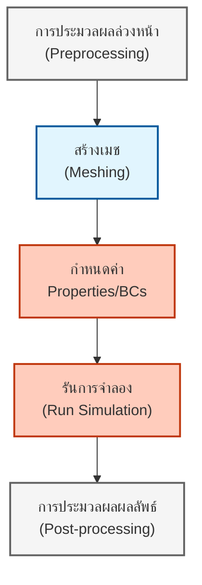
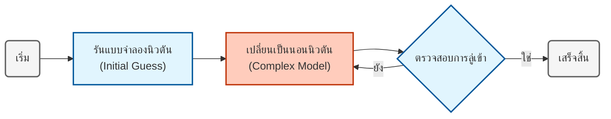
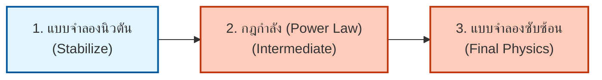

# 05. การใช้งานจริงและกรณีศึกษา (Practical Usage & Case Studies)

## ภาพรวม (Overview)

การจำลองของไหลแบบนอนนิวตัน (Non-Newtonian) ใน OpenFOAM ต้องการการกำหนดค่าที่เหมาะสมของ ==สมบัติการขนส่ง (transport properties)==, ==เงื่อนไขขอบเขต (boundary conditions)== และ ==การตั้งค่าตัวแก้ปัญหา (solver settings)== เพื่อให้ได้ผลลัพธ์ที่แม่นยำและเสถียร

---

## 1. การกำหนดค่าสมบัติการขนส่ง (Transport Properties Configuration)

ไฟล์ `constant/transportProperties` เป็นหัวใจสำคัญของการจำลองของไหลนอนนิวตัน ซึ่งทำหน้าที่กำหนดแบบจำลองความหนืดและพารามิเตอร์ที่เกี่ยวข้อง

### 1.1 โครงสร้างพื้นฐาน

```cpp
FoamFile
{
    version     2.0;
    format      ascii;
    class       dictionary;
    object      transportProperties;
}

// เลือกแบบจำลองการขนส่งความหนืด
transportModel  HerschelBulkley;  // ตัวเลือก: BirdCarreau, powerLaw, CrossPowerLaw

// ความหนืดจลนศาสตร์ [m²/s] - ค่าอ้างอิงพื้นฐาน
nu              [0 2 -1 0 0 0 0] 1e-06;
```

> **📂 แหล่งที่มา:** โครงสร้างพจนานุกรม transportProperties มาตรฐานของ OpenFOAM
> 
> **💡 คำอธิบาย:**
> - ไฟล์นี้เป็น dictionary file มาตรฐานของ OpenFOAM ที่ใช้กำหนดคุณสมบัติทางกายภาพของของไหล
> - `transportModel` ระบุชื่อของโมเดลความหนืดที่ต้องการใช้งาน
> - `nu` เป็นค่าความหนืดอ้างอิง (kinematic viscosity) ที่มีหน่วย [m²/s]
> 
> **🔑 แนวคิดสำคัญ:**
> - **Dimension Set:** `[0 2 -1 0 0 0 0]` แทนหน่วย [L²/T] ในระบบหน่วยฐานของ OpenFOAM (Mass, Length, Time, Temperature, etc.)
> - **Dictionary Class:** รูปแบบไฟล์ข้อมูลที่ OpenFOAM ใช้เก็บการตั้งค่าพารามิเตอร์ต่างๆ
> - **Transport Model:** ชื่อ class ของโมเดลความหนืดที่ถูก implement ใน OpenFOAM

### 1.2 สัมประสิทธิ์เฉพาะของแต่ละแบบจำลอง

#### แบบจำลอง Herschel-Bulkley (Herschel-Bulkley Model)

```cpp
HerschelBulkleyCoeffs
{
    // ขีดจำกัดความหนืดที่อัตราการเฉือนศูนย์ [m²/s]
    nu0         [0 2 -1 0 0 0 0] 1e-02;
    
    // พารามิเตอร์ความเค้นยอม [Pa·s/m³ หรือ m²/s²]
    tau0        [0 2 -2 0 0 0 0] 5.0;
    
    // ดัชนีความสม่ำเสมอ [m²/s^n]
    k           [0 2 -1 0 0 0 0] 0.1;
    
    // ดัชนีพฤติกรรมการไหล (ไม่มีหน่วย)
    n           [0 0 0 0 0 0 0] 0.5;
}
```

**แบบจำลองทางคณิตศาสตร์:**

$$ 
\mu = \min\left(\nu_0, \frac{\tau_0}{\dot{\gamma}} + k\dot{\gamma}^{n-1}\right) 
$$ 

โดยที่:
- $\tau_0$ คือความเค้นยอม (Yield Stress)
- $k$ คือดัชนีความสม่ำเสมอ (Consistency Index)
- $n$ คือดัชนีพฤติกรรมการไหล (Flow Behavior Index)

> **📂 แหล่งที่มา:** `src/transportModels/viscosityModels/viscosityModel/HerschelBulkley/`
> 
> **💡 คำอธิบาย:**
> - Herschel-Bulkley โมเดลเป็นโมเดลที่รวมคุณสมบัติ yield stress และ power-law behavior เข้าด้วยกัน
> - พารามิเตอร์ `nu0` ใช้จำกัดค่าความหนืดไม่ให้เกินค่าที่กำหนด
> - ค่า `tau0` เป็น yield stress parameter ที่กำหนดแรงเฉือนขั้นต่ำที่ต้องใช้ก่อนของไหลจะเริ่มไหล
> 
> **🔑 แนวคิดสำคัญ:**
> - **Yield Stress Fluids:** ของไหลที่ต้องการความเค้นเฉือนขั้นต่ำก่อนเริ่มไหล (เช่น ซอสมะเขือเปียก, ยาสีฝุ่น)
> - **Shear-Thinning:** เมื่อ n < 1 ความหนืดจะลดลงเมื่ออัตราการเฉือนเพิ่มขึ้น
> - **Shear-Thickening:** เมื่อ n > 1 ความหนืดจะเพิ่มขึ้นเมื่ออัตราการเฉือนเพิ่มขึ้น
> - **Viscosity Clipping:** ฟังก์ชัน `min()` ใช้ป้องกันความหนืดไม่ให้เกินค่าสูงสุดที่กำหนด

#### แบบจำลอง Bird-Carreau (Bird-Carreau Model)

```cpp
BirdCarreauCoeffs
{
    // ความหนืดที่อัตราการเฉือนศูนย์ [m²/s]
    nu0         [0 2 -1 0 0 0 0] 1.0;
    
    // ความหนืดที่อัตราการเฉือนเป็นอนันต์ [m²/s]
    nuInf       [0 2 -1 0 0 0 0] 0.0;
    
    // ค่าคงที่เวลา [s]
    k           [0 0 1 0 0 0 0] 0.1;
    
    // ดัชนีกฎกำลัง (ไม่มีหน่วย)
    n           [0 0 0 0 0 0 0] 0.5;
    
    // พารามิเตอร์ Yasuda (ไม่มีหน่วย)
    a           [0 0 0 0 0 0 0] 2.0;
}
```

**แบบจำลองทางคณิตศาสตร์:**

$$ 
\mu = \mu_{\infty} + (\mu_0 - \mu_{\infty})\left[1 + (k\dot{\gamma})^a\right]^{\frac{n-1}{a}} 
$$ 

> **📂 แหล่งที่มา:** `src/transportModels/viscosityModels/viscosityModel/BirdCarreau/`
> 
> **💡 คำอธิบาย:**
> - Bird-Carreau โมเดลเหมาะสำหรับของไหลที่มีความหนืดเปลี่ยนแปลงอย่างต่อเนื่องตลอดช่วงความเร็วเฉือน
> - พารามิเตอร์ `a` (Yasuda parameter) ควบคุมความกว้างของช่วงการเปลี่ยนแปลง
> - โมเดลนี้มักใช้สำหรับการจำลองการไหลของเลือดและโพลีเมอร์หลายชนิด
> 
> **🔑 แนวคิดสำคัญ:**
> - **Zero-Shear Viscosity:** ค่าความหนืดเมื่อของไหลอยู่ในสภาพนิ่ง (ขีดจำกัดเมื่อ shear rate → 0)
> - **Infinite-Shear Viscosity:** ค่าความหนืดเมื่ออัตราการเฉือนสูงมาก (ขีดจำกัดเมื่อ shear rate → ∞)
> - **Transition Region:** ช่วงที่ความหนืดเปลี่ยนจาก nu0 ไปเป็น nuInf
> - **Carreau-Yasuda Model:** สมการทั่วไปที่รวมพารามิเตอร์ a เพื่อความยืดหยุ่นในการเทียบกับข้อมูลทดลอง

#### แบบจำลองกฎกำลัง (Power Law Model)

```cpp
powerLawCoeffs
{
    // ขีดจำกัดความหนืดสูงสุด [m²/s]
    nuMax       [0 2 -1 0 0 0 0] 1.0;
    
    // ขีดจำกัดความหนืดต่ำสุด [m²/s]
    nuMin       [0 2 -1 0 0 0 0] 0.0;
    
    // ดัชนีความสม่ำเสมอ [m²/s^(2-n)]
    k           [0 2 -1 0 0 0 0] 0.1;
    
    // ดัชนีกฎกำลัง (ไม่มีหน่วย)
    n           [0 0 0 0 0 0 0] 0.5;
}
```

**แบบจำลองทางคณิตศาสตร์:**

$$ 
\mu = \min\left(\mu_{\max}, \max\left(\mu_{\min}, k\dot{\gamma}^{n-1}\right)\right) 
$$ 

> **📂 แหล่งที่มา:** `src/transportModels/viscosityModels/viscosityModel/powerLaw/`
> 
> **💡 คำอธิบาย:**
> - Power Law โมเดลเป็นโมเดลที่เรียบง่ายที่สุดสำหรับของไหล non-Newtonian
> - ใช้ฟังก์ชัน clipping ทั้งสองด้าน (max/min) เพื่อป้องกันค่าที่ไม่เป็นทางกายภาพ
> - เหมาะสำหรับการจำลองเบื้องต้นและการศึกษาเชิงทฤษฎี
> 
> **🔑 แนวคิดสำคัญ:**
> - **Ostwald-de Waele Model:** ชื่อทางวิชาการของ Power Law model
> - **Clipping Strategy:** การจำกัดค่าความหนืดให้อยู่ในช่วงที่กำหนดเพื่อเสถียรภาพทางตัวเลข
> - **Power Law Region:** ช่วงที่สมการ power law ใช้ได้โดยไม่ต้อง clipping
> - **Limitations:** ไม่สามารถจำลอง yield stress หรือ plateau regions ได้

> [!TIP] ความสอดคล้องของมิติ (Dimensional Consistency)
> ตรวจสอบให้แน่ใจว่าหน่วยของพารามิเตอร์ทั้งหมดถูกต้อง โดยเฉพาะ:
> - $\tau_0$ มีหน่วย [Pa·s/m³] หรือ [0 2 -2 0 0 0 0] ใน OpenFOAM
> - $k$ ในแบบจำลองกฎกำลัง มีหน่วยที่ขึ้นกับค่า $n$

---

## 2. เงื่อนไขขอบเขต (Boundary Conditions)

### 2.1 เงื่อนไขขอบเขตความเร็ว (Velocity Boundary Conditions)

#### เงื่อนไขมาตรฐาน (0/U)

```cpp
// มิติของสนามความเร็ว [m/s]
dimensions      [0 1 -1 0 0 0 0];

// สนามความเร็วเริ่มต้นภายในโดเมน
internalField   uniform (0 0 0);

boundaryField
{
    // ขอบเขตทางเข้า - ความเร็วคงที่
    inlet
    {
        type            fixedValue;
        value           uniform (1 0 0);  // การไหลในทิศทาง x
    }

    // ขอบเขตผนัง - เงื่อนไข No-slip
    walls
    {
        type            noSlip;  // ทางเลือกอื่น: partialSlip สำหรับการลื่นไถลที่ผนัง
    }

    // ขอบเขตทางออก - เกรเดียนต์เป็นศูนย์
    outlet
    {
        type            zeroGradient;
    }
}
```

> **📂 แหล่งที่มา:** `etc/templates/pozFoam/cavity/0/U.org` (เทมเพลตอ้างอิง)
> 
> **💡 คำอธิบาย:**
> - `dimensions` กำหนดหน่วยของสนามความเร็ว [L/T]
> - `internalField` เป็นค่าเริ่มต้นของความเร็วภายในโดเมนที่เวลา t = 0
> - `boundaryField` กำหนดเงื่อนไขขอบเขตสำหรับแต่ละ patch ที่กำหนดไว้ใน mesh
> 
> **🔑 แนวคิดสำคัญ:**
> - **Dirichlet BC (fixedValue):** กำหนดค่าโดยตรงที่ขอบเขต
> - **Neumann BC (zeroGradient):** กำหนดค่า gradient เป็นศูนย์ (อนุญาตให้ค่าเปลี่ยนไปตามการคำนวณภายใน)
> - **No-Slip Condition:** ความเร็วของของไหลที่ผนังเป็นศูนย์ (สภาพติดขอบ)
> - **Patch Naming:** ชื่อของ boundary ต้องตรงกับที่กำหนดใน `constant/polyMesh/boundary`

#### เงื่อนไขการลื่นไถลที่ผนัง (Wall Slip Conditions)

สำหรับของไหลบางชนิด (เช่น เลือด, โพลีเมอร์) อาจเกิดการลื่นไถลที่ผนัง:

```cpp
walls
{
    type            partialSlip;
    value           uniform 0;
    slipFraction    0.1;    // 0 = no-slip, 1 = full-slip
}
```

**รูปแบบทางคณิตศาสตร์:**

$$ 
\mathbf{u}_t = \beta \cdot \frac{\mathbf{t}}{\mu} \cdot \tau 
$$ 

โดยที่:
- $\beta$ คือส่วนแบ่งการลื่นไถล (slip fraction)
- $\mathbf{t}$ คือทิศทางสัมผัส
- $\tau$ คือความเค้นเฉือนที่ผนัง

> **📂 แหล่งที่มา:** `src/finiteVolume/fields/fvPatchFields/constraints/partialSlip/`
> 
> **💡 คำอธิบาย:**
> - `partialSlip` BC เหมาะสำหรับของไหลที่มีการลื่นไถลที่ผนัง (wall slip phenomenon)
> - `slipFraction` ค่า 0 หมายถึงไม่มีการลื่น (no-slip) และค่า 1 หมายถึงลื่นสมบูรณ์ (free-slip)
> - ใช้บ่อยในการจำลองการไหลของเลือดในหลอดเลือดขนาดเล็กและโพลีเมอร์
> 
> **🔑 แนวคิดสำคัญ:**
> - **Navier Slip Condition:** แบบจำลองที่อนุญาตให้มีความเร็วจำลอง proportional กับความเค้นเฉือน
> - **Slip Length:** ระยะห่างสมมติที่ผนังซึ่งความเร็วเชิงเส้น extrapolate จะเป็นศูนย์
> - **Wall Depletion:** ปรากฏการณ์ที่อนุภาคขนาดใหญ่ถูกขับออกจากผนัง ทำให้เกิดการลื่น

### 2.2 สนามความหนืด (0/nu)

```cpp
// มิติของความหนืดจลนศาสตร์ [m²/s]
dimensions      [0 2 -1 0 0 0 0];

// สนามความหนืดเริ่มต้น
internalField   uniform 1e-06;

boundaryField
{
    inlet
    {
        // คำนวณจากแบบจำลองการขนส่ง
        type            calculated;
        value           uniform 1e-06;
    }

    walls
    {
        // เกรเดียนต์เป็นศูนย์ - คำนวณจากเกรเดียนต์ความเร็ว
        type            zeroGradient;
    }

    outlet
    {
        type            zeroGradient;
    }
}
```

> **📂 แหล่งที่มา:** การกำหนดค่าเริ่มต้นของสนามความหนืดมาตรฐานใน OpenFOAM
> 
> **💡 คำอธิบาย:**
> - `calculated` BC ใช้ที่ inlet เพื่อให้โมเดลความหนืดคำนวณค่าได้โดยอัตโนมัติ
> - `zeroGradient` ที่ผนังหมายความว่าความหนืดถูกคำนวณจาก gradient ของความเร็ว
> - ค่าความหนืดจะถูกอัปเดตในทุก time step ตามสมการโมเดลที่เลือก
> 
> **🔑 แนวคิดสำคัญ:**
> - **Calculated BC:** Boundary condition ที่ค่าถูกคำนวณจาก solver หรือ model อื่น
> - **Coupled Fields:** ความหนืดและความเร็วมีความสัมพันธ์กันผ่าน strain rate
> - **Non-Linear Coupling:** ความหนืดขึ้นกับ strain rate ซึ่งขึ้นกับ gradient ของความเร็ว

> [!WARNING] การจำกัดความหนืด (Viscosity Clipping)
> ในบริเวณที่มีเกรเดียนต์สูง (เช่น มุมแหลม, การขยายตัวกะทันหัน) ความหนืดอาจลดต่ำเกินไป:
> - ใช้ `nuMin` และ `nuMax` ใน `transportProperties`
> - เพิ่มการปรับแต่งเมช (mesh refinement) ในบริเวณเหล่านั้น
> - ใช้การผ่อนคลาย (under-relaxation) สำหรับสนามความหนืด

---

## 3. การเลือกและกำหนดค่าตัวแก้ปัญหา (Solver Selection & Configuration)

### 3.1 ตัวแก้ปัญหาที่แนะนำ (Recommended Solvers)

| ตัวแก้ปัญหา | ประเภทการไหล | การประยุกต์ใช้ | หมายเหตุ |
|--------|-----------|-------------|-------|
| **simpleFoam** | สภาวะคงตัว, อัดตัวไม่ได้ | การไหลในอุตสาหกรรมทั่วไป | ลู่เข้าหาคำตอบเร็ว |
| **pimpleFoam** | สภาวะไม่คงตัว, อัดตัวไม่ได้ | การไหลที่ขึ้นกับเวลาซับซ้อน | ความแม่นยำสูงกว่า |
| **nonNewtonianIcoFoam** | สภาวะไม่คงตัว, ราบเรียบ | เพื่อวัตถุประสงค์ทางการศึกษา | เฉพาะทาง |
| **interFoam** | หลายเฟส | การฉีดขึ้นรูป, การแปรรูปอาหาร | รองรับแบบจำลองนอนนิวตัน |

> **📂 แหล่งที่มา:** โครงสร้างไดเรกทอรี `applications/solvers/incompressible/`
> 
> **💡 คำอธิบาย:**
> - **simpleFoam:** ใช้อัลกอริทึม SIMPLE (Semi-Implicit Method for Pressure-Linked Equations) สำหรับ steady-state
> - **pimpleFoam:** ผสม PISO และ SIMPLE สำหรับ transient flow ที่มีความเสถียรสูง
> - **nonNewtonianIcoFoam:** เขียนขึ้นเพื่อการศึกษา ใช้อัลกอริทึม PISO สำหรับ laminar flow
> 
> **🔑 แนวคิดสำคัญ:**
> - **SIMPLE Algorithm:** ใช้ under-relaxation เพื่อให้ลู่เข้าใน steady-state
> - **PISO Algorithm:** แก้สมการ pressure-velocity coupling ใน transient ด้วย correctors หลายรอบ
> - **PIMPLE Algorithm:** ผสม SIMPLE และ PISO เพื่อความยืดหยุ่นใน large time step
> - **Laminar vs Turbulent:** nonNewtonianIcoFoam ออกแบบสำหรับ laminar flow เท่านั้น

### 3.2 การกำหนดค่า fvSchemes

```cpp
ddtSchemes
{
    // รูปแบบ Euler อันดับหนึ่งสำหรับเทอมสภาวะไม่คงตัว
    default         Euler;  // ทางเลือกอื่น: backward สำหรับความแม่นยำที่สูงกว่า
}

gradSchemes
{
    // การประมาณค่าแบบจุดศูนย์กลางสำหรับการคำนวณเกรเดียนต์
    default         Gauss linear;
    grad(nu)        Gauss linear;  // สำคัญสำหรับเกรเดียนต์ของความหนืด
}

divSchemes
{
    default         none;
    // รูปแบบ Upwind เพื่อเสถียรภาพของเทอมการพา
    div(phi,U)      Gauss upwind grad(U);
}

laplacianSchemes
{
    // การแก้ไขเชิงเส้นสำหรับเมชที่ไม่ตั้งฉาก
    default         Gauss linear corrected;
}
```

> **📂 แหล่งที่มา:** ข้อมูลอ้างอิง: `.applications/test/fieldMapping/pipe1D/system/fvSchemes`
> 
> **💡 คำอธิบาย:**
> - `ddtSchemes` คือการ discretize พจน์ temporal derivative (∂/∂t)
> - `gradSchemes` คำนวณ gradient ด้วย Gauss theorem และ interpolation
> - `divSchemes` ใช้ upwind เพื่อเสถียรภาพเนื่องจาก convection-dominated flows
> - `laplacianSchemes` ใช้ `corrected` เพื่อรองรับ non-orthogonal meshes
> 
> **🔑 แนวคิดสำคัญ:**
> - **Temporal Discretization:** Euler (first-order) vs backward (second-order)
> - **Spatial Discretization:** Gauss integration กับ interpolation schemes ต่างๆ
> - **Upwind Scheme:** ใช้ค่าจาก upstream direction ป้องกัน oscillations
> - **Non-Orthogonal Correction:** ปรับปรุงค่าบน meshes ที่ไม่ orthogonal
> - **Numerical Diffusion:** Upwind schemes เพิ่ม numerical diffusion แต่เสถียรกว่า central differencing

### 3.3 การกำหนดค่า fvSolution

```cpp
solvers
{
    p
    {
        // ตัวแก้ปัญหา Geometric-Algebraic Multi-Grid สำหรับความดัน
        solver          GAMG;
        tolerance       1e-06;
        relTol          0.01;
    }

    pFinal
    {
        // ค่าความคลาดเคลื่อนที่เข้มงวดขึ้นสำหรับรอบสุดท้าย
        solver          GAMG;
        tolerance       1e-06;
        relTol          0;
    }

    U
    {
        // ตัวแก้ปัญหาแบบวนซ้ำสำหรับความเร็ว
        solver          smoothSolver;
        smoother        GaussSeidel;
        tolerance       1e-05;
        relTol          0.1;
    }
}

PIMPLE
{
    // จำนวนรอบการแก้ไขความดัน
    nCorrectors      2;
    // การแก้ไขสำหรับเมชที่ไม่ตั้งฉาก
    nNonOrthogonalCorrectors  1;
}
```

> **📂 แหล่งที่มา:** ข้อมูลอ้างอิง: `.applications/test/fieldMapping/pipe1D/system/fvSolution`
> 
> **💡 คำอธิบาย:**
> - **GAMG (Geometric-Algebraic Multi-Grid):** ใช้สำหรับสมการ pressure เพราะมีประสิทธิภาพสูงสำหรับ large systems
> - **smoothSolver:** ใช้สำหรับ velocity ด้วย Gauss-Seidel smoothing
> - **nCorrectors:** จำนวนรอบการแก้ไข pressure-velocity coupling
> - **pFinal:** ใช้ tolerance ที่เข้มงวดกว่าในรอบสุดท้าย
> 
> **🔑 แนวคิดสำคัญ:**
> - **Linear Solvers:** เลือก solver ที่เหมาะกับลักษณะของสมการ (symmetric, asymmetric)
> - **Absolute vs Relative Tolerance:** `tolerance` คือค่าสัมบูรณ์ `relTol` คือค่าสัมพัทธ์
> - **Multi-Grid Methods:** ลดการลู่เข้าโดยใช้ coarse grid correction
> - **PIMPLE Parameters:** ควบคุมความถี่ในการแก้ pressure-velocity coupling
> - **Non-Orthogonal Correctors:** จำเป็นสำหรับ meshes ที่มีความ non-orthogonality สูง

> [!INFO] ปัจจัยการผ่อนคลาย (Relaxation Factors)
> สำหรับการจำลองแบบนอนนิวตัน:
> ```cpp
> relaxationFactors
> {
>     fields
>     {
>         p               0.3;
>         U               0.7;
>         nu              0.5;  // มีความสำคัญต่อเสถียรภาพ
>     }
> }
> ```
> 
> **💡 คำอธิบาย:**
> - `p` (pressure) ใช้ค่าต่ำเพื่อความเสถียรของ coupling
> - `U` (velocity) ใช้ค่าปานกลางเพื่อสมดุลระหว่างความเร็วและเสถียรภาพ
> - `nu` (viscosity) ใช้ค่า 0.5 เพื่อลด coupling ที่รุนแรงระหว่างความหนืดและความเร็ว

---

## 4. ขั้นตอนการทำงานที่สมบูรณ์ (Complete Workflow)


> **รูปที่ 1:** แผนผังลำดับขั้นตอนการจำลองของไหลที่ไม่ใช่แบบนิวตัน (Complete Workflow) ตั้งแต่การเตรียมเมช การตั้งค่าพารามิเตอร์ของแบบจำลองความหนืด ไปจนถึงกระบวนการวิเคราะห์ผลและการตรวจสอบความลู่เข้า

> **📂 แหล่งที่มา:** ระเบียบวิธีขั้นตอนการทำงาน CFD มาตรฐานของ OpenFOAM
> 
> **💡 คำอธิบาย:**
> - **Pre-processing:** ขั้นตอนเตรียมความพร้อมรวมถึง mesh generation และ parameter setup
> - **transportProperties Configuration:** ขั้นตอนสำคัญที่สุดสำหรับ non-Newtonian flows
> - **Convergence Monitoring:** ต้องติดตามทั้ง residuals และ viscosity field
> - **Iterative Adjustment:** การจำลอง non-Newtonian มักต้องมีการปรับพารามิเตอร์หลายครั้ง
>
> **🔑 แนวคิดสำคัญ:**
> - **Pre-processing Phase:** Mesh generation, boundary definition, initial conditions
> - **Configuration Phase:** การตั้งค่า transport model, numerical schemes, solver parameters
> - **Solution Phase:** การคำนวณและการติดตาม convergence
> - **Post-processing Phase:** การวิเคราะห์ผลลัพธ์และ validation
> - **Iterative Process:** การจำลองที่ซับซ้อนมักต้องกลับไปปรับค่าหลายรอบ

### 4.1 รายการตรวจสอบการประมวลผลล่วงหน้า (Pre-processing Checklist)

- [ ] ยืนยันคุณภาพเมช (อัตราส่วนรูปร่าง, ความเบ้)
- [ ] ตั้งค่าความละเอียดชั้นขอบที่เหมาะสม
- [ ] ตรวจสอบความถูกต้องของพารามิเตอร์แบบจำลอง (จากเอกสารวิชาการ/การทดลอง)
- [ ] ตรวจสอบความสอดคล้องของมิติใน `transportProperties`
- [ ] กำหนดช่วงเวลาที่เหมาะสม (เงื่อนไข CFL)

> **📂 แหล่งที่มา:** แนวทางปฏิบัติที่ดีที่สุดของคุณภาพเมชใน OpenFOAM
> 
> **💡 คำอธิบาย:**
> - **Mesh Quality:** ตรวจสอบ aspect ratio (< 1000), skewness (< 0.85), non-orthogonality (< 70°)
> - **Boundary Layer:** ต้องการ mesh ละเอียดพอใกล้ผนังสำหรับ high gradient regions
> - **Parameter Validation:** ใช้ค่าจาก literature หรือทดลองเพื่อความถูกต้องทางกายภาพ
> - **Dimensional Check:** OpenFOAM จะตรวจสอบ consistency แต่ควรตรวจอีกครั้งด้วยตนเอง
> - **CFL Condition:** Courant number ควร < 1 สำหรับ explicit schemes
>
> **🔑 แนวคิดสำคัญ:**
> - **Mesh Quality Metrics:** aspect ratio, skewness, orthogonality, concavity
> - **y+ Value:** ระยะห่างของ cell แรกจากผนังเทียบกับ viscous length scale
> - **Dimensional Homogeneity:** ทุกพจน์ในสมการต้องมีหน่วยเหมือนกัน
> - **CFL (Courant-Friedrichs-Lewy):** เกณฑ์เสถียรภาพสำหรับ temporal discretization
> - **Grid Independence:** ผลลัพธ์ไม่ควรขึ้นกับขนาด mesh

### 4.2 ขั้นตอนการทำงานตามแนวทางปฏิบัติที่ดีที่สุด (Best Practice Workflow)


> **รูปที่ 2:** แผนผังแสดงแนวทางปฏิบัติที่เป็นเลิศ (Best Practice) โดยใช้ลำดับการคำนวณจากแบบจำลองนิวตันไปสู่แบบจำลองที่ไม่ใช่แบบนิวตัน เพื่อรักษาเสถียรภาพทางตัวเลขและลดความซับซ้อนในการตั้งค่าเบื้องต้น

> **📂 แหล่งที่มา:** แนวทางการสร้างแบบจำลองแบบก้าวหน้าสำหรับการจำลอง CFD แบบนอนนิวตันที่แนะนำ
> 
> **💡 คำอธิบาย:**
> - **Newtonian Baseline:** เริ่มจาก simple case เพื่อ validate mesh และ boundary conditions
> - **Gradual Complexity:** เพิ่มความซับซ้อนทีละน้อยเพื่อให้ติดตามปัญหาได้ง่าย
> - **Viscosity Monitoring:** สำคัญมากเพราะ non-Newtonian fluids มีความหนืดเปลี่ยนแบบ non-linear
> - **Iterative Tuning:** การปรับ parameters เป็นกระบวนการปกติ
>
> **🔑 แนวคิดสำคัญ:**
> - **Bottom-Up Approach:** เริ่มจาก simple model แล้วค่อยเพิ่มความซับซ้อน
> - **Validation Hierarchy:** ตรวจสอบทีละระดับตั้งแต่ mesh → BCs → transport model
> - **Parameter Sensitivity:** ผลกระทบของการเปลี่ยนค่า parameters ต่อ convergence
> - **Robustness First:** ตั้งค่าให้เสถียรก่อน ค่อยปรับให้แม่นยำภายหลัง
> - **Debugging Strategy:** แยกแยะปัญหาจาก mesh, numerical schemes, หรือ physical model

---

## 5. กรณีศึกษาเชิงปฏิบัติ (Practical Case Studies)

### 5.1 การไหลของเลือดในหลอดเลือดแดง (Blood Flow in Artery)

**แบบจำลอง:** Bird-Carreau

```cpp
transportModel  BirdCarreau;

BirdCarreauCoeffs
{
    // ความหนืดของเลือดในสภาพนิ่ง [m²/s]
    nu0         0.056;
    
    // ความหนืดของเลือดที่แรงเฉือนสูง [m²/s]
    nuInf       0.0035;
    
    // ค่าคงที่เวลา [s]
    k           3.313;
    
    // ดัชนีกฎกำลัง (shear-thinning)
    n           0.3568;
    
    // พารามิเตอร์ Yasuda
    a           2.0;
}
```

**ข้อควรพิจารณาที่สำคัญ:**
- ใช้เงื่อนไขขอบเขตทางเข้าแบบ `pulsatileVelocity`
- เพิ่มการปรับแต่งเมชใกล้ผนังหลอดเลือด
- วิเคราะห์ความเค้นเฉือนที่ผนัง (wall shear stress) สำหรับวัตถุประสงค์ทางการแพทย์

> **📂 แหล่งที่มา:** วรรณกรรมสร้างแบบจำลองการไหลทางชีวการแพทย์ (Carreau et al., 1979)
> 
> **💡 คำอธิบาย:**
> - **Blood Rheology:** เลือดเป็น shear-thinning fluid ที่มีความหนืดสูงเมื่อนิ่งและลดลงเมื่อ shear rate เพิ่ม
> - **Fähraeus-Lindqvist Effect:** ความหนืดลดลงในหลอดเลือดขนาดเล็ก
> - **Pulsatile Flow:** การไหลแบบถี่เนื่องจากการเต้นของหัวใจ
>
> **🔑 แนวคิดสำคัญ:**
> - **Hemodynamics:** การศึกษาการไหลของเลือดและความสัมพันธ์กับระบบไหลเวียน
> - **Wall Shear Stress (WSS):** ความเค้นเฉือนที่ผนังหลอดเลือด สำคัญต่อความเสียหายของเยื่อบุ
> - **Oscillatory Shear Index (OSI):** ดัชนีวัดการเปลี่ยนทิศทางของ WSS
> - **Yield Stress Behavior:** เลือดมีคุณสมบัติเป็น yield stress fluid ในบางสภาพ

### 5.2 การอัดรีดโพลีเมอร์ (Polymer Extrusion)

**แบบจำลอง:** กฎกำลัง (Power Law)

```cpp
transportModel  powerLaw;

powerLawCoeffs
{
    // ขีดจำกัดความหนืดสูงสุด [m²/s]
    nuMax       1000;
    
    // ขีดจำกัดความหนืดต่ำสุด [m²/s]
    nuMin       0.1;
    
    // ดัชนีความสม่ำเสมอ [m²/s^(2-n)]
    k           5000;
    
    // ดัชนีกฎกำลัง (shear-thinning)
    n           0.4;
}
```

**ข้อควรพิจารณาที่สำคัญ:**
- ใช้ `inletOutlet` สำหรับทางออก
- ตรวจสอบการพองตัวของหัวฉีด (die swell) ที่ทางออก
- วิเคราะห์ความดันตกคร่อม (pressure drop) ผ่านหัวฉีด

> **📂 แหล่งที่มา:** วรรณกรรมการประมวลผลโพลีเมอร์ (Bird et al., 1987)
> 
> **💡 คำอธิบาย:**
> - **Polymer Rheology:** โพลีเมอร์ส่วนใหญ่เป็น shear-thinning fluids
> - **Die Swell:** ปรากฏการณ์ที่ jet ขยายตัวหลังออกจาก die เนื่องจาก elastic recovery
> - **Pressure Drop:** สำคัญในการออกแบบ extrusion dies
>
> **🔑 แนวคิดสำคัญ:**
> - **Viscoelasticity:** โพลีเมอร์มีทั้ง viscous และ elastic behavior
> - **Shear-Thinning Index (n):** ค่า n < 1 บ่งบอกความสามารถในการลดความหนืด
> - **Entrance Effects:** การพัฒนา flow จาก entrance ไปจนถึง fully developed
> - **Melt Flow Index:** ค่าที่ใช้ในอุตสาหกรรมวัดความง่ายในการไหล
> - **Processing Window:** ช่วงของ temperature และ shear rate ที่เหมาะสม

### 5.3 กระบวนการผลิตอาหาร (ซอสมะเขือเทศ)

**แบบจำลอง:** Herschel-Bulkley

```cpp
transportModel  HerschelBulkley;

HerschelBulkleyCoeffs
{
    // ขีดจำกัดความหนืดที่อัตราการเฉือนศูนย์ [m²/s]
    nu0         1000;
    
    // ความเค้นยอม [Pa·s/m³]
    tau0        50;
    
    // ดัชนีความสม่ำเสมอ [m²/s^n]
    k           10;
    
    // ดัชนีพฤติกรรมการไหล
    n           0.5;
}
```

**ข้อควรพิจารณาที่สำคัญ:**
- ระบุโซนที่มีการไหลและไม่ไหล (yielded/unyielded zones)
- ใช้ `partialSlip` ที่ผนัง
- วิเคราะห์ประสิทธิภาพการผสม (mixing efficiency)

> **📂 แหล่งที่มา:** วรรณกรรมรีโอโลยีของอาหาร (Steffe, 1996)
> 
> **💡 คำอธิบาย:**
> - **Yield Stress Foods:** ซอสมะเขือเปียก, มะขาม, ช็อกโกแลตหลอม มี yield stress
> - **Yielded vs Unyielded:** บริเวณที่ stress < yield stress จะเคลื่อนที่เป็น solid plug
> - **Wall Slip:** ปรากฏการณ์การลื่นของ particles ตามผนัง
>
> **🔑 แนวคิดสำคัญ:**
> - **Plug Flow:** บริเวณที่ของไหลเคลื่อนที่เป็น chunk เดียว (solid-like)
> - **Yield Surface:** พื้นที่แบ่งระหว่าง yielded และ unyielded zones
> - **Apparent Viscosity:** ความหนืดที่คำนวณจาก stress/shear rate ratio
> - **Thixotropy:** ความสามารถในการลดความหนืดตามเวลา (time-dependent)
> - **Rheometry:** การวัดคุณสมบัติทาง rheological ของ foods

---

## 6. คู่มือการแก้ไขปัญหา (Troubleshooting Guide)

### 6.1 ปัญหาทั่วไป

| ปัญหา | อาการ | วิธีแก้ไข |
|-------|---------|----------|
| **การลู่ออก (Divergence)** | ค่าตกค้างพุ่งสูง | ลดช่วงเวลาลง, เพิ่มการผ่อนคลาย |
| **ความหนืดไม่สมจริง** | ความหนืดเข้าสู่ 0 หรือ ∞ | เพิ่มการจำกัดค่า nuMin/nuMax |
| **การลู่เข้าช้า** | ค่าตกค้างคงที่ที่ระดับสูง | ปรับปรุงคุณภาพเมช, ปรับเปลี่ยนรูปแบบ (schemes) |
| **การแกว่งกวัด** | ฟิลด์ข้อมูลสั่นไหว | เพิ่มการผ่อนคลาย (under-relaxation) |

> **📂 แหล่งที่มา:** แนวทางปฏิบัติที่ดีที่สุดในการดีบั๊กและเสถียรภาพของ OpenFOAM
> 
> **💡 คำอธิบาย:**
> - **Divergence:** เกิดจาก time step ใหญ่เกินไป หรือ coupling ระหว่าง fields รุนแรงเกินไป
> - **Unphysical Viscosity:** ความหนืดที่คำนวณได้มีค่าผิดพลาดเนื่องจาก numerical errors
> - **Slow Convergence:** มักเกิดจาก mesh quality ไม่ดี หรือ schemes ไม่เหมาะสม
> - **Oscillations:** การสั่นของ fields เกิดจาก under-relaxation ต่ำเกินไป
>
> **🔑 แนวคิดสำคัญ:**
> - **Numerical Stability:** ความสามารถของ algorithm ในการลู่เข้าโดยไม่ explode
> - **CFL Condition:** เกณฑ์ความเสถียรสำหรับ explicit schemes
> - **Residual Monitoring:** การติดตามค่าความคลาดเคลื่อนของสมการ
> - **Relaxation Factors:** ค่าที่ลดการเปลี่ยนแปลงของ fields เพื่อเสถียรภาพ
> - **Mesh Independence:** ผลลัพธ์ไม่ควรขึ้นกับ mesh resolution

### 6.2 คำแนะนำจากผู้เชี่ยวชาญ

#### คำแนะนำที่ 1: เริ่มจากความเรียบง่าย


> **รูปที่ 3:** แผนภูมิแสดงกลยุทธ์การเพิ่มระดับความซับซ้อนของแบบจำลองความหนืด (Progressive Modeling Strategy) เพื่อการตรวจสอบความถูกต้องของระบบอย่างเป็นลำดับ

> **📂 แหล่งที่มา:** แนวทางปฏิบัติทางการสอน CFD ที่แนะนำ
> 
> **💡 คำอธิบาย:**
> - **Foundation First:** ต้องมั่นใจว่าพื้นฐาน (mesh, BCs) ถูกต้องก่อนเพิ่มความซับซ้อน
> - **Incremental Complexity:** เพิ่ม physical models ทีละน้อยเพื่อให้ติดตามปัญหาได้
> - **Validation at Each Step:** ตรวจสอบผลลัพธ์ก่อน move ต่อ
>
> **🔑 แนวคิดสำคัญ:**
> - **Modular Validation:** แยก validation ของแต่ละ component
> - **Isolation of Variables:** เปลี่ยนแค่ parameter เดียวต่อครั้ง
> - **Physical Consistency:** ผลลัพธ์ต้องสอดคล้องกับ physics
> - **Computational Efficiency:** ลดเวลา debugging โดยเริ่มจาก simple case
> - **Building Intuition:** เข้าใจพฤติกรรมของ models แบบ gradual

#### คำแนะนำที่ 2: ติดตามอัตราการเฉือน (Strain Rate)

ในโปรแกรม ParaView ให้สร้างฟิลด์อัตราการเฉือนจาก `grad(U)`:

```python
# ใช้ Python Calculator ใน ParaView
strainRate = sqrt(2*mag(symm(Gradient(U))))
```

ตรวจสอบว่า:
- ไม่มีค่าสูงผิดปกติในบริเวณมุม
- ช่วงของค่ามีความเหมาะสมกับแบบจำลอง

> **📂 แหล่งที่มา:** แนวทางปฏิบัติที่ดีที่สุดในการประมวลผลหลังการจำลองของ OpenFOAM
> 
> **💡 คำอธิบาย:**
> - **Strain Rate Tensor:** สมมาตรส่วนของ velocity gradient tensor
> - **Magnitude:** ใช้ค่า scalar เพื่อการ visualise ง่าย
> - **Hot Spots:** บริเวณที่มี strain rate สูงผิดปกติอาจเป็นปัญหา mesh
>
> **🔑 แนวคิดสำคัญ:**
> - **Strain Rate Tensor:** $\dot{\gamma}_{ij} = \frac{1}{2}(\frac{\partial u_i}{\partial x_j} + \frac{\partial u_j}{\partial x_i})$
> - **Shear Rate Magnitude:** $\dot{\gamma} = \sqrt{2\mathbf{D}:\mathbf{D}}$ โดย $\mathbf{D}$ คือ rate-of-strain tensor
> - **Visualization Techniques:** ใช้ color maps และ iso-surfaces
> - **Model Applicability:** แต่ละโมเดลมีช่วง shear rate ที่เหมาะสม
> - **Numerical Artifacts:** ค่าสูงผิดปกติอาจเป็นผลจาก poor mesh quality

#### คำแนะนำที่ 3: ตรวจสอบความถูกต้องด้วยคำตอบเชิงวิเคราะห์ (Analytical Solutions)

สำหรับการไหลแบบ **Poiseuille Flow ในท่อ**:

$$ 
v_z(r) = \frac{n}{n+1}\left(\frac{\Delta p}{L} \frac{1}{2k}\right)^{1/n} \left(R^{(n+1)/n} - r^{(n+1)/n}\right) 
$$ 

เปรียบเทียบผลลัพธ์ที่ได้จากการจำลองกับคำตอบข้างต้น

> **📂 แหล่งที่มา:** คำตอบเชิงวิเคราะห์กลศาสตร์ของไหลแบบคลาสสิก (Bird และคณะ)
> 
> **💡 คำอธิบาย:**
> - **Poiseuille Flow:** การไหลในท่อกลมที่ fully developed
> - **Analytical Solution:** มี solution แน่นอนสำหรับ power law fluids
> - **Validation Method:** เปรียบเทียบ velocity profile จาก CFD กับ analytical
>
> **🔑 แนวคิดสำคัญ:**
> - **Analytical Solutions:** ทางการแก้ปัญหาที่ได้จากสมการโดยตรง
> - **Benchmark Cases:** กรณีศึกษามาตรฐานสำหรับ validation
> - **Error Metrics:** ใช้ RMS error, maximum deviation
> - **Grid Convergence:** ตรวจสอบว่า mesh ละเอียดพอ
> - **Code Verification:** ตรวจสอบว่า solver ทำงานถูกต้อง

---

## 7. เทคนิคขั้นสูง (Advanced Techniques)

### 7.1 การปรับความสม่ำเสมอของความหนืด (Viscosity Regularization)

สำหรับแบบจำลอง Herschel-Bulkley ให้ใช้การปรับความสม่ำเสมอแบบ Papanastasiou:

$$ 
\mu_{\text{eff}} = \mu_0 + \left(1 - e^{-m\dot{\gamma}}\right)\frac{\tau_0}{\dot{\gamma}} + k\dot{\gamma}^{n-1} 
$$ 

โดยที่ $m$ เป็นพารามิเตอร์การปรับความสม่ำเสมอ (ปกติใช้ค่า 100-1000)

> **📂 แหล่งที่มา:** Papanastasiou (1987) regularization of yield stress fluids
> 
> **💡 คำอธิบาย:**
> - **Singularity Problem:** สมการ Herschel-Bulkley มี singularity ที่ $\dot{\gamma} \rightarrow 0$
> - **Regularization:** แทนที่ singularity ด้วย exponential function ที่ smooth
> - **Parameter m:** ควบคุมความเร็วในการ transition จาก yield behavior
>
> **🔑 แนวคิดสำคัญ:**
> - **Yield Stress Singularity:** ปัญหาที่ความหนืด → ∞ เมื่อ shear rate → 0
> - **Regularization Methods:** ใช้ฟังก์ชัน smooth แทนที่ฟังก์ชันเดิม
> - **Papanastasiou Regularization:** ใช้ exponential function ในการปรับปรุง
> - **Numerical Stability:** regularization เพิ่มความเสถียรในการคำนวณ
> - **Physical Accuracy:** ต้อง balance ระหว่างความเสถียรและความแม่นยำ

### 7.2 การปรับช่วงเวลาแบบปรับตัว (Adaptive Time Stepping)

```cpp
// เปิดใช้งานการปรับช่วงเวลาอัตโนมัติ
adjustTimeStep  yes;

// เลขคูแรนท์สูงสุดเพื่อเสถียรภาพ
maxCo           0.5;

// ช่วงเวลาสูงสุดที่อนุญาต [วินาที]
maxDeltaT       1.0;
```

> **📂 แหล่งที่มา:** เอกสารประกอบการควบคุมเวลาของ OpenFOAM
> 
> **💡 คำอธิบาย:**
> - **Adaptive Time Stepping:** solver ปรับ time step อัตโนมัติตาม local CFL
> - **Courant Number:** ใช้เป็นเกณฑ์ในการปรับ time step
> - **Efficiency vs Accuracy:** balance ระหว่าง computational cost และ accuracy
>
> **🔑 แนวคิดสำคัญ:**
> - **CFL (Courant-Friedrichs-Lewy) Number:** $Co = \frac{u \Delta t}{\Delta x}$
> - **Local CFL:** คำนวณจาก cell แต่ละ cell ไม่ใช่ค่าเฉลี่ย
> - **Stability Criterion:** explicit schemes ต้องการ Co < 1
> - **Adaptive Algorithms:** ปรับ Δt เพื่อ maintain Co ในช่วงที่กำหนด
> - **Computational Efficiency:** ลดจำนวน time steps โดยรักษา stability

### 7.3 การคำนวณแบบขนาน (Parallel Computing)

```bash
# แยกกรณีศึกษาเพื่อการประมวลผลแบบขนาน
decomposePar

# รันแบบขนานโดยใช้ตัวประมวลผล 4 ตัว
mpirun -np 4 nonNewtonianIcoFoam -parallel

# ประกอบผลลัพธ์จากการคำนวณแบบขนานกลับคืน
reconstructPar
```

> **📂 แหล่งที่มา:** ระเบียบวิธีคอมพิวเตอร์แบบขนานของ OpenFOAM
> 
> **💡 คำอธิบาย:**
> - **Domain Decomposition:** แบ่ง mesh เป็น subdomains สำหรับ parallel processing
> - **MPI (Message Passing Interface):** library สำหรับ parallel computation
> - **Load Balancing:** แบ่ง workload ระหว่าง processors อย่างสมดุล
>
> **🔑 แนวคิดสำคัญ:**
> - **Decomposition Methods:** scotch, simple, hierarchical, manual
> - **Processor Count:** ปรับสัดส่วนตาม mesh size และ hardware
> - **Communication Overhead:** ค่าใช้จ่ายในการส่งข้อมูลระหว่าง processors
> - **Speedup & Efficiency:** วัดประสิทธิภาพของ parallelization
> - **Scalability:** ความสามารถในการขยายไปยัง processors จำนวนมาก

---

## 8. รายการตรวจสอบสรุป (Summary Checklist)

> [!CHECKLIST] ก่อนการจำลอง
> - [ ] ตรวจสอบคุณภาพเมชแล้ว
> - [ ] ตรวจสอบความถูกต้องของพารามิเตอร์แบบจำลองแล้ว
> - [ ] ตั้งค่าเงื่อนไขขอบเขตอย่างถูกต้องแล้ว
> - [ ] ตรวจสอบความสอดคล้องของมิติแล้ว
> - [ ] กำหนดค่าตัวแก้ปัญหาเรียบร้อยแล้ว

> **📂 แหล่งที่มา:** แนวทางปฏิบัติที่ดีที่สุดในการประมวลผลล่วงหน้าของ OpenFOAM
> 
> **💡 คำอธิบาย:**
> - **Mesh Quality:** ตรวจสอบ aspect ratio, skewness, non-orthogonality
> - **Parameter Validation:** ใช้ค่าจาก literature หรือ experiments
> - **Boundary Conditions:** ตรวจสอบว่า BCs สอดคล้องกับ physics
> - **Dimensional Consistency:** ตรวจสอบหน่วยของทุก parameters
> - **Solver Configuration:** ตั้งค่า schemes, solvers, relaxation factors

> [!CHECKLIST] ระหว่างการจำลอง
> - [ ] ติดตามค่าตกค้าง (Residuals)
> - [ ] ตรวจสอบขอบเขตสนามความหนืด
> - [ ] ยืนยันการอนุรักษ์มวล
> - [ ] ติดตามอัตราการลู่เข้า

> **📂 แหล่งที่มา:** แนวทางปฏิบัติในการติดตามขณะรันโปรแกรมของ OpenFOAM
> 
> **💡 คำอธิบาย:**
> - **Residual Monitoring:** ติดตามค่าความคลาดเคลื่อนของสมการทุก time step
> - **Viscosity Bounds:** ตรวจสอบว่าความหนืดอยู่ในช่วงที่กำหนด
> - **Mass Conservation:** ตรวจสอบว่า mass balance ถูกต้อง
> - **Convergence Rate:** ติดตามความเร็วในการลู่เข้าของ solution

> [!CHECKLIST] หลังการจำลอง
> - [ ] ตรวจสอบความถูกต้องกับข้อมูลการทดลอง
> - [ ] ตรวจสอบความเป็นอิสระของเมช (Grid independence)
> - [ ] วิเคราะห์พารามิเตอร์หลัก (WSS, ความดันตก)
> - [ ] บันทึกผลลัพธ์และการตั้งค่า

> **📂 แหล่งที่มา:** ขั้นตอนการประมวลผลหลังการจำลองและการตรวจสอบความถูกต้องของ OpenFOAM
> 
> **💡 คำอธิบาย:**
> - **Experimental Validation:** เปรียบเทียบผลกับข้อมูลทดลอง
> - **Mesh Independence:** ตรวจสอบว่าผลไม่ขึ้นกับ mesh resolution
> - **Parameter Analysis:** วิเคราะห์ค่าที่สำคัญ (WSS, pressure drop, velocity profiles)
> - **Documentation:** บันทึก settings และผลลัพธ์อย่างละเอียด

---

## 9. การอ่านเพิ่มเติม (Further Reading)

- [[00_Overview]] - ภาพรวมของไหลนอนนิวตัน (Non-Newtonian Fluids)
- [[02_2._Blueprint_The_Viscosity-Model_Hierarchy]] - รายละเอียดสถาปัตยกรรมของแบบจำลอง
- [[05_5._Code_Analysis_of_Three_Key_Models]] - วิเคราะห์โค้ดของแบบจำลองหลัก
- คู่มือผู้ใช้ OpenFOAM (User Guide) - บทที่ 6: แบบจำลองทางกายภาพ
- OpenFOAM Wiki - บทช่วยสอน nonNewtonianIcoFoam
