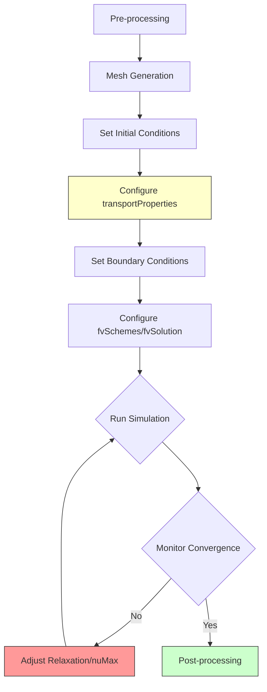
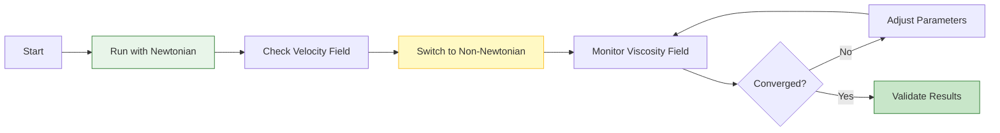

# 05. Practical Usage & Case Studies

## Overview

การจำลองของไหลแบบ Non-Newtonian ใน OpenFOAM ต้องการการกำหนดค่าที่เหมาะสมของ ==transport properties==, ==boundary conditions==, และ ==solver settings== เพื่อให้ได้ผลลัพธ์ที่แม่นยำและเสถียร

---

## 1. Transport Properties Configuration

ไฟล์ `constant/transportProperties` เป็นหัวใจสำคัญของการจำลอง Non-Newtonian fluids ซึ่งกำหนดโมเดลความหนืดและพารามิเตอร์ที่เกี่ยวข้อง

### 1.1 Basic Structure

```cpp
FoamFile
{
    version     2.0;
    format      ascii;
    class       dictionary;
    object      transportProperties;
}

transportModel  HerschelBulkley;  // หรือ BirdCarreau, powerLaw, CrossPowerLaw

// Kinematic viscosity [m²/s]
nu              [0 2 -1 0 0 0 0] 1e-06;
```

### 1.2 Model-Specific Coefficients

#### Herschel-Bulkley Model

```cpp
HerschelBulkleyCoeffs
{
    nu0         [0 2 -1 0 0 0 0] 1e-02;  // Zero-shear viscosity limit
    tau0        [0 2 -2 0 0 0 0] 5.0;    // Yield stress [Pa/rho]
    k           [0 2 -1 0 0 0 0] 0.1;    // Consistency index
    n           [0 0 0 0 0 0 0] 0.5;     // Flow behavior index
}
```

**Mathematical Model:**

$$
\mu = \min\left(\nu_0, \frac{\tau_0}{\dot{\gamma}} + k\dot{\gamma}^{n-1}\right)
$$

โดยที่:
- $\tau_0$ คือความเค้นจุดยอด (Yield Stress)
- $k$ คือดัชนีความสม่ำเสมอ (Consistency Index)
- $n$ คือดัชนีพฤติกรรมการไหล (Flow Behavior Index)

#### Bird-Carreau Model

```cpp
BirdCarreauCoeffs
{
    nu0         [0 2 -1 0 0 0 0] 1.0;    // Zero-shear viscosity
    nuInf       [0 2 -1 0 0 0 0] 0.0;    // Infinite-shear viscosity
    k           [0 0 1 0 0 0 0] 0.1;     // Time constant
    n           [0 0 0 0 0 0 0] 0.5;     // Power law index
    a           [0 0 0 0 0 0 0] 2.0;     // Yasuda parameter
}
```

**Mathematical Model:**

$$
\mu = \mu_{\infty} + (\mu_0 - \mu_{\infty})\left[1 + (k\dot{\gamma})^a\right]^{\frac{n-1}{a}}
$$

#### Power Law Model

```cpp
powerLawCoeffs
{
    nuMax       [0 2 -1 0 0 0 0] 1.0;    // Maximum viscosity
    nuMin       [0 2 -1 0 0 0 0] 0.0;    // Minimum viscosity
    k           [0 2 -1 0 0 0 0] 0.1;    // Consistency index
    n           [0 0 0 0 0 0 0] 0.5;     // Power law index
}
```

**Mathematical Model:**

$$
\mu = \min\left(\mu_{\max}, \max\left(\mu_{\min}, k\dot{\gamma}^{n-1}\right)\right)
$$

> [!TIP] Dimensional Consistency
> ตรวจสอบให้แน่ใจว่าหน่วยของพารามิเตอร์ทั้งหมดถูกต้อง โดยเฉพาะ:
> - $\tau_0$ มีหน่วย [Pa·s/m³] หรือ [0 2 -2 0 0 0 0] ใน OpenFOAM
> - $k$ ใน Power Law มีหน่วยที่ขึ้นกับค่า $n$

---

## 2. Boundary Conditions

### 2.1 Velocity Boundary Conditions

#### Standard Conditions (0/U)

```cpp
dimensions      [0 1 -1 0 0 0 0];
internalField   uniform (0 0 0);

boundaryField
{
    inlet
    {
        type            fixedValue;
        value           uniform (1 0 0);
    }

    walls
    {
        type            noSlip;  // หรือ partialSlip สำหรับ wall slip
    }

    outlet
    {
        type            zeroGradient;
    }
}
```

#### Wall Slip Conditions

สำหรับของไหลบางชนิด (เลือด, โพลีเมอร์) อาจเกิดการลื่นไถลที่ผนัง:

```cpp
walls
{
    type            partialSlip;
    value           uniform 0;
    slipFraction    0.1;    // 0 = no-slip, 1 = full-slip
}
```

**Mathematical Formulation:**

$$
\mathbf{u}_t = \beta \cdot \frac{\mathbf{t}}{\mu} \cdot \tau
$$

โดยที่:
- $\beta$ คือส่วนแบ่งการลื่นไถล (slip fraction)
- $\mathbf{t}$ คือทิศทางสัมผัส
- $\tau$ คือความเค้นเฉือนที่ผนัง

### 2.2 Viscosity Field (0/nu)

```cpp
dimensions      [0 2 -1 0 0 0 0];
internalField   uniform 1e-06;

boundaryField
{
    inlet
    {
        type            calculated;
        value           uniform 1e-06;
    }

    walls
    {
        type            zeroGradient;  // คำนวณจาก gradient ของความเร็ว
    }

    outlet
    {
        type            zeroGradient;
    }
}
```

> [!WARNING] Viscosity Clipping
> ในบริเวณ high-gradient (มุมแหลม, ขยายกะทันหัน) ความหนืดอาจลดต่ำเกินไป:
> - ใช้ `nuMin` และ `nuMax` ใน transportProperties
> - เพิ่ม mesh refinement ในบริเวณเหล่านั้น
> - ใช้ under-relaxation สำหรับ viscosity field

---

## 3. Solver Selection & Configuration

### 3.1 Recommended Solvers

| Solver | Flow Type | Application | Notes |
|--------|-----------|-------------|-------|
| **simpleFoam** | Steady-state, incompressible | General industrial flows | Fast convergence |
| **pimpleFoam** | Transient, incompressible | Complex time-dependent flows | Higher accuracy |
| **nonNewtonianIcoFoam** | Transient, laminar | Educational purposes | Specialized |
| **interFoam** | Multiphase | Injection molding, food processing | Supports non-Newtonian |

### 3.2 fvSchemes Configuration

```cpp
ddtSchemes
{
    default         Euler;  // หรือ backward สำหรับความแม่นยำสูง
}

gradSchemes
{
    default         Gauss linear;
    grad(nu)        Gauss linear;  // สำคัญสำหรับ viscosity gradient
}

divSchemes
{
    default         none;
    div(phi,U)      Gauss upwind grad(U);  // ใช้ upwind สำหรับเสถียรภาพ
}

laplacianSchemes
{
    default         Gauss linear corrected;
}
```

### 3.3 fvSolution Configuration

```cpp
solvers
{
    p
    {
        solver          GAMG;
        tolerance       1e-06;
        relTol          0.01;
    }

    pFinal
    {
        solver          GAMG;
        tolerance       1e-06;
        relTol          0;
    }

    U
    {
        solver          smoothSolver;
        smoother        GaussSeidel;
        tolerance       1e-05;
        relTol          0.1;
    }
}

PIMPLE
{
    nCorrectors      2;
    nNonOrthogonalCorrectors  1;
}
```

> [!INFO] Relaxation Factors
> สำหรับการจำลอง Non-Newtonian:
> ```cpp
> relaxationFactors
> {
>     fields
>     {
>         p               0.3;
>         U               0.7;
>         nu              0.5;  // สำคัญมากสำหรับเสถียรภาพ
>     }
> }
> ```

---

## 4. Complete Workflow



### 4.1 Pre-processing Checklist

- [ ] Verify mesh quality (aspect ratio, skewness)
- [ ] Set appropriate boundary layer resolution
- [ ] Validate model parameters (literature/experiment)
- [ ] Check dimensional consistency in transportProperties
- [ ] Configure appropriate time step (CFL condition)

### 4.2 Best Practice Workflow



---

## 5. Practical Case Studies

### 5.1 Blood Flow in Artery

**Model:** Bird-Carreau

```cpp
transportModel  BirdCarreau;

BirdCarreauCoeffs
{
    nu0         0.056;    // Blood at rest
    nuInf       0.0035;   // Blood at high shear
    k           3.313;    // Time constant
    n           0.3568;   // Power law index
    a           2.0;      // Yasuda parameter
}
```

**Key Considerations:**
- ใช้ `pulsatileVelocity` inlet boundary condition
- เพิ่ม mesh refinement ใกล้ผนังหลอดเลือด
- วิเคราะห์ wall shear stress สำหรับการแพทย์

### 5.2 Polymer Extrusion

**Model:** Power Law

```cpp
transportModel  powerLaw;

powerLawCoeffs
{
    nuMax       1000;
    nuMin       0.1;
    k           5000;
    n           0.4;     // Shear-thinning
}
```

**Key Considerations:**
- ใช้ `inletOutlet` สำหรับ outlet
- ตรวจสอบ die swell ที่ outlet
- วิเคราะห์ pressure drop ผ่าน die

### 5.3 Food Processing (Tomato Sauce)

**Model:** Herschel-Bulkley

```cpp
transportModel  HerschelBulkley;

HerschelBulkleyCoeffs
{
    nu0         1000;
    tau0        50;      // Yield stress
    k           10;
    n           0.5;
}
```

**Key Considerations:**
- ระบุ yielded/unyielded zones
- ใช้ `partialSlip` ที่ผนัง
- วิเคราะห์ mixing efficiency

---

## 6. Troubleshooting Guide

### 6.1 Common Issues

| Issue | Symptom | Solution |
|-------|---------|----------|
| **Divergence** | Residuals explode | Reduce time step, increase relaxation |
| **Unphysical viscosity** | Viscosity → 0 or ∞ | Add nuMin/nuMax clipping |
| **Slow convergence** | Residuals plateau | Improve mesh quality, adjust schemes |
| **Oscillations** | Fields wobble | Increase under-relaxation |

### 6.2 Expert Tips

#### Tip 1: Start Simple


#### Tip 2: Monitor Strain Rate

ใน ParaView, สร้างฟิลด์ strain rate จาก `grad(U)`:

```python
# Python Calculator in ParaView
strainRate = sqrt(2*mag(symm(Gradient(U))))
```

ตรวจสอบว่า:
- ไม่มีค่าสูงผิดปกติในบริเวณมุม
- ช่วงของค่าเหมาะสมกับโมเดล

#### Tip 3: Validate with Analytical Solutions

สำหรับ **Poiseuille Flow in Pipe**:

$$
v_z(r) = \frac{n}{n+1}\left(\frac{\Delta p}{L} \frac{1}{2k}\right)^{1/n} \left(R^{(n+1)/n} - r^{(n+1)/n}\right)
$$

เปรียบเทียบกับผลการจำลอง

---

## 7. Advanced Techniques

### 7.1 Viscosity Regularization

สำหรับ Herschel-Bulkley, ใช้ Papanastasiou regularization:

$$
\mu_{\text{eff}} = \mu_0 + \left(1 - e^{-m\dot{\gamma}}\right)\frac{\tau_0}{\dot{\gamma}} + k\dot{\gamma}^{n-1}
$$

โดยที่ $m$ เป็น regularization parameter (100-1000)

### 7.2 Adaptive Time Stepping

```cpp
adjustTimeStep  yes;

maxCo           0.5;     // Courant number
maxDeltaT       1.0;
```

### 7.3 Parallel Computing

```bash
# Decompose case
decomposePar

# Run in parallel
mpirun -np 4 nonNewtonianIcoFoam -parallel

# Reconstruct
reconstructPar
```

---

## 8. Summary Checklist

> [!CHECKLIST] Pre-Simulation
> - [ ] Mesh quality verified
> - [ ] Model parameters validated
> - [ ] Boundary conditions set correctly
> - [ ] Dimensional consistency checked
> - [ ] Solver settings configured

> [!CHECKLIST] During Simulation
> - [ ] Monitor residuals
> - [ ] Check viscosity field bounds
> - [ ] Verify mass conservation
> - [ ] Track convergence rate

> [!CHECKLIST] Post-Simulation
> - [ ] Validate with experimental data
> - [ ] Check mesh independence
> - [ ] Analyze key parameters (WSS, pressure drop)
> - [ ] Document results and settings

---

## 9. Further Reading

- [[00_Overview]] - ภาพรวม Non-Newtonian Fluids
- [[02_2._Blueprint_The_Viscosity-Model_Hierarchy]] - สถาปัตยกรรมโมเดล
- [[05_5._Code_Analysis_of_Three_Key_Models]] - วิเคราะห์โค้ดโมเดลหลัก
- OpenFOAM User Guide - Chapter 6: Physical Models
- OpenFOAM Wiki - nonNewtonianIcoFoam Tutorial
