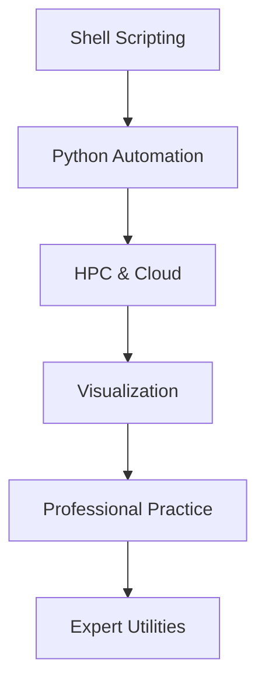

# 🗺️ Learning Navigator: Utilities & Automation

> เส้นทางการเรียนรู้สำหรับ OpenFOAM Utilities และ Automation

---

## 📋 สารบัญ

1. [Shell Scripting](#1-shell-scripting)
2. [Python Automation](#2-python-automation)
3. [HPC and Cloud](#3-hpc-and-cloud)
4. [Advanced Visualization](#4-advanced-visualization)
5. [Professional Practice](#5-professional-practice)
6. [Expert Utilities](#6-expert-utilities)

---

## 1. Shell Scripting

> **Domain:** Automation & Workflow

| เนื้อหา | คำอธิบาย |
|--------|----------|
| [00_Overview](CONTENT/01_SHELL_SCRIPTING/00_Overview.md) | ภาพรวม Shell Scripting |
| [01_Automation_Strategy](CONTENT/01_SHELL_SCRIPTING/01_Automation_Strategy.md) | กลยุทธ์การ Automate |
| [02_Automation_Framework](CONTENT/01_SHELL_SCRIPTING/02_Automation_Framework.md) | Framework สำหรับ Automation |

---

## 2. Python Automation

> **Domain:** Data Analysis & Automation

| เนื้อหา | คำอธิบาย |
|--------|----------|
| [00_Overview](CONTENT/02_PYTHON_AUTOMATION/00_Overview.md) | ภาพรวม Python Automation |
| [01_Environment_Setup](CONTENT/02_PYTHON_AUTOMATION/01_Python_Environment_Setup.md) | การตั้งค่า Environment |
| [02_PyFoam](CONTENT/02_PYTHON_AUTOMATION/02_PyFoam_Fundamentals.md) | PyFoam Fundamentals |
| [03_Pandas](CONTENT/02_PYTHON_AUTOMATION/03_Data_Analysis_with_Pandas.md) | Data Analysis |
| [04_Parametric](CONTENT/02_PYTHON_AUTOMATION/04_Automated_Parametric_Study.md) | Parametric Studies |

---

## 3. HPC and Cloud

> **Domain:** High Performance Computing

| เนื้อหา | คำอธิบาย |
|--------|----------|
| [00_Overview](CONTENT/03_HPC_AND_CLOUD/00_Overview.md) | ภาพรวม HPC |
| [01_Decomposition](CONTENT/03_HPC_AND_CLOUD/01_Domain_Decomposition.md) | Domain Decomposition |
| [02_Monitoring](CONTENT/03_HPC_AND_CLOUD/02_Performance_Monitoring.md) | Performance Monitoring |
| [03_Optimization](CONTENT/03_HPC_AND_CLOUD/03_Optimization_Techniques.md) | Optimization |
| [04_HPC](CONTENT/03_HPC_AND_CLOUD/04_HPC_Integration.md) | HPC Integration |

---

## 4. Advanced Visualization

> **Domain:** Post-Processing & Visualization

| เนื้อหา | คำอธิบาย |
|--------|----------|
| [00_Overview](CONTENT/04_ADVANCED_VISUALIZATION/00_Overview.md) | ภาพรวม Visualization |
| [01_ParaView](CONTENT/04_ADVANCED_VISUALIZATION/01_ParaView_Visualization.md) | ParaView |
| [02_Python](CONTENT/04_ADVANCED_VISUALIZATION/02_Python_Plotting.md) | Python Plotting |

---

## 5. Professional Practice

> **Domain:** Best Practices & Collaboration

| เนื้อหา | คำอธิบาย |
|--------|----------|
| [00_Overview](CONTENT/05_PROFESSIONAL_PRACTICE/00_Overview.md) | ภาพรวม |
| [01_Organization](CONTENT/05_PROFESSIONAL_PRACTICE/01_Project_Organization.md) | Project Organization |
| [02_Documentation](CONTENT/05_PROFESSIONAL_PRACTICE/02_Documentation_Standards.md) | Documentation |
| [04_Git](CONTENT/05_PROFESSIONAL_PRACTICE/04_Version_Control_Git.md) | Version Control |
| [05_Testing](CONTENT/05_PROFESSIONAL_PRACTICE/05_Testing_and_QA.md) | Testing & QA |

---

## 6. Expert Utilities

> **Domain:** OpenFOAM Utilities

| เนื้อหา | คำอธิบาย |
|--------|----------|
| [00_Overview](CONTENT/06_EXPERT_UTILITIES/00_Overview.md) | ภาพรวม Utilities |
| [01_Categories](CONTENT/06_EXPERT_UTILITIES/01_Utility_Categories_and_Organization.md) | Utility Categories |
| [02_Architecture](CONTENT/06_EXPERT_UTILITIES/02_Architecture_and_Design_Patterns.md) | Architecture |
| [03_Essential](CONTENT/06_EXPERT_UTILITIES/03_Essential_Utilities_for_Common_CFD_Tasks.md) | Essential Utilities |
| [05_Custom](CONTENT/06_EXPERT_UTILITIES/05_Creating_Custom_Utilities.md) | Custom Utilities |
| [06_Integration](CONTENT/06_EXPERT_UTILITIES/06_Integration_with_Solver_Workflows.md) | Solver Integration |
| [07_Best_Practices](CONTENT/06_EXPERT_UTILITIES/07_Best_Practices.md) | Best Practices |

---

## 🎯 Learning Path

---

*Last Updated: 2025-12-28*
