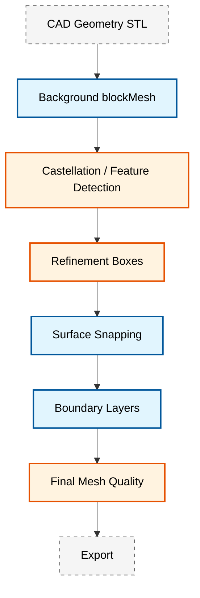
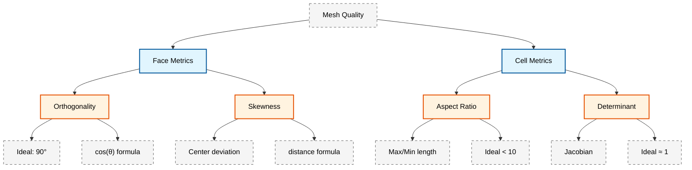

# 🧰 Module 07: Utilities and Automation (ยูทิลิตี้และการทำงานอัตโนมัติ)

**ระยะเวลาโมดูล**: 2 สัปดาห์ | **เงื่อนไขก่อนหน้า**: Module 02 (OpenFOAM Basics), Module 03 (Single-Phase Flow) | **โมดูลถัดไป**: Module 08 (Testing and Validation)

---

## 📋 ภาพรวมโมดูล (Module Overview)

โมดูลเชิงปฏิบัติการนี้แนะนำเครื่องมือพื้นฐานและเทคนิคการทำงานอัตโนมัติที่เป็นกระดูกสันหลังของการปฏิบัติงาน CFD ด้วย OpenFOAM ในระดับมืออาชีพ คุณจะเชี่ยวชาญเครื่องมือ Preprocessing สำหรับการสร้าง Mesh และการเตรียม Case, เครื่องมือ Post-processing สำหรับการวิเคราะห์ข้อมูลและการสร้างภาพ และกรอบงานอัตโนมัติ (Automation Frameworks) สำหรับการจัดการเวิร์กโฟลว์อย่างมีประสิทธิภาพ

> [!INFO] จุดเน้นของโมดูล
> โมดูลนี้เน้นการประยุกต์ใช้ OpenFOAM Utilities ร่วมกับเทคนิคการทำงานอัตโนมัติเพื่อสร้างเวิร์กโฟลว์ CFD ที่ **แข็งแกร่ง (Robust)** และ **ทำซ้ำได้ (Reproducible)** ซึ่งเหมาะสมสำหรับทั้งงานวิจัยและงานในระดับอุตสาหกรรม

### 🎯 วัตถุประสงค์การเรียนรู้หลัก

เมื่อสำเร็จโมดูลนี้ คุณจะสามารถ:

1. **เชี่ยวชาญ OpenFOAM Utilities**: ใช้งานเครื่องมือสร้าง Mesh, การตั้งค่า Case, การจัดการ และการวิเคราะห์ในระดับมืออาชีพ
2. **พัฒนาเวิร์กโฟลว์อัตโนมัติ**: สร้าง Shell Scripting และกรอบงานอัตโนมัติด้วย Python สำหรับเวิร์กโฟลว์ CFD ที่ซับซ้อน
3. **ใช้งานการประกันคุณภาพ (Quality Assurance - QA)**: จัดตั้งกระบวนการ Verification and Validation (V&V) สำหรับคุณภาพ Mesh, การบรรจบของ Solution และความสอดคล้องทางกายภาพ
4. **เพิ่มประสิทธิภาพเวิร์กโฟลว์การคำนวณ**: ออกแบบกลยุทธ์การรันแบบขนาน (Parallel Execution) และการจัดการทรัพยากรอย่างมีประสิทธิภาพ
5. **บูรณาการแนวปฏิบัติที่เป็นเลิศ**: ประยุกต์ใช้มาตรฐานอุตสาหกรรมสำหรับการจัดระเบียบโค้ด, การสร้างเอกสาร และการทำงานร่วมกัน

---

## 🔍 โครงสร้างโมดูล

โมดูลนี้แบ่งออกเป็น 5 ส่วนหลัก ครอบคลุมระยะเวลา 2 สัปดาห์:

### ส่วนที่ 1: Pre-processing Utilities (สัปดาห์ที่ 1)

![[mesh_generation_pipeline_overview.png]]
> **รูปที่ 1.1:** ขั้นตอนการเตรียม Mesh ตั้งแต่เรขาคณิต CAD ไปจนถึง Mesh ที่พร้อมสำหรับการจำลอง

ส่วนนี้ครอบคลุมเครื่องมือพื้นฐานสำหรับการสร้าง Computational Meshes และการเตรียม Case สำหรับการจำลอง

#### เครื่องมือหลัก (Core Utilities)

- **blockMesh**: การสร้าง Mesh แบบโครงสร้าง (Structured Hexahedral Mesh) พร้อมการนิยามบล็อกขั้นสูงและการจัดการเรขาคณิตที่ซับซ้อน
- **snappyHexMesh**: กลยุทธ์การสร้าง Mesh บนพื้นผิว, เทคนิคการปรับปรุงความละเอียด (Refinement) และการเพิ่ม Boundary Layer
- **Case Setup Automation**: การตั้งค่า Boundary Condition อัตโนมัติ, การระบุ Field เริ่มต้น และการกำหนดค่า Solver
- **Geometry Preparation**: การนำเข้า, ทำความสะอาด และเตรียม CAD geometries สำหรับ CFD

#### รากฐานทางคณิตศาสตร์ (Mathematical Foundations)

**Block Mesh Transformation:**

เครื่องมือ blockMesh ใช้การแม็พพารามิเตอร์ (Parametric Mapping) โดยที่แต่ละเซลล์ในพื้นที่การคำนวณ (Computational Space) $(\xi_1, \xi_2, \xi_3)$ จะถูกแม็พไปยังพื้นที่ทางกายภาพ (Physical Space) $(x, y, z)$:

$$\mathbf{x} = \mathbf{x}_0 + \sum_{i=1}^{3} \xi_i \mathbf{e}_i$$

**ตัวแปร:**
- $\mathbf{x}$ = ตำแหน่งในพื้นที่ทางกายภาพ
- $\mathbf{x}_0$ = ตำแหน่งจุดกำเนิดของบล็อก
- $\xi_i$ = พิกัดท้องถิ่น (0 ถึง 1)
- $\mathbf{e}_i$ = เวกเตอร์ขอบ (Edge Vectors)

#### ตัวอย่างการใช้งานโค้ด

**โครงสร้าง blockMesh Dictionary:**
```cpp
// blockMeshDict example for a simple channel
convertToMeters 1;

vertices
(
    (0 0 0)        // 0 - origin
    (1 0 0)        // 1 - x-direction
    (1 1 0)        // 2 - xy-plane
    (0 1 0)        // 3 - y-direction
    (0 0 0.1)      // 4 - z-direction
    (1 0 0.1)      // 5
    (1 1 0.1)      // 6
    (0 1 0.1)      // 7
);

blocks
(
    hex (0 1 2 3 4 5 6 7) (100 50 10) simpleGrading (1 1 1)
);

boundary
(
    inlet
    {
        type patch;
        faces ((0 4 7 3));
    }
    outlet
    {
        type patch;
        faces ((1 5 6 2));
    }
    walls
    {
        type wall;
        faces ((0 1 5 4) (1 2 6 5) (2 3 7 6) (3 0 4 7));
    }
);
```

> **📂 Source:** `.applications/utilities/mesh/generation/blockMesh/`
> 
> **คำอธิบาย (Explanation):**
> ไฟล์นี้เป็นการตั้งค่า Dictionary สำหรับ `blockMesh` utility ใน OpenFOAM ซึ่งใช้สร้าง Structured Hexahedral Mesh สำหรับพื้นที่ทดสอบแบบ Channel Flow ไฟล์ประกอบด้วย 3 ส่วนหลัก:
> 
> 1. **vertices**: นิยามจุดยอด (Vertices) ทั้ง 8 จุดของบล็อกสามมิติในระบบพิกัด (x, y, z)
> 2. **blocks**: นิยามการแบ่งส่วนเซลล์ภายในบล็อกโดยระบุจำนวนเซลล์ในแต่ละทิศทาง (100 ใน x, 50 ใน y, 10 ใน z) พร้อม Grading ratio
> 3. **boundary**: นิยาม Boundary Conditions สำหรับแต่ละพื้นผิว (inlet, outlet, walls) พร้อมระบุประเภทและหน้า (Faces) ที่เกี่ยวข้อง
> 
> **แนวคิดสำคัญ (Key Concepts):**
> - **Vertex Ordering**: การจัดลำดับ Vertex ต้องทำตามมาตรฐาน OpenFOAM (Right-handed rule) เพื่อให้บล็อกถูกสร้างได้ถูกต้อง
> - **Cell Grading**: `simpleGrading (1 1 1)` หมายถึงการกระจายเซลล์แบบสม่ำเสมอ หากต้องการความละเอียดเฉพาะบริเวณ สามารถปรับค่าได้
> - **Patch Definition**: แต่ละ Patch ต้องระบุ Faces ที่เป็นส่วนประกอบ โดย Face จะถูกนิยามด้วย Vertex indices ในลำดับที่ถูกต้อง
> - **Unit Conversion**: `convertToMeters` ใช้แปลงหน่วยของพิกัดจากหน่วยที่ระบุใน vertices เป็นเมตร

#### เวิร์กโฟลว์ SnappyHexMesh


> **Figure 1:** แผนภูมิขั้นตอนการทำงานของ `snappyHexMesh` ตั้งแต่การนำเข้าเรขาคณิต CAD การสร้างเมชพื้นหลัง การเพิ่มความละเอียดเฉพาะจุด การปรับพื้นผิวให้แนบชิด ไปจนถึงการเพิ่มชั้นขอบเขตและการตรวจสอบคุณภาพเมชขั้นสุดท้าย

#### มาตรวัดคุณภาพ Mesh (Mesh Quality Metrics)

**1. Non-orthogonality:** วัดการเบี่ยงเบนจากการเชื่อมต่อระหว่างศูนย์กลางหน้าและเซลล์ที่เป็นแนวตั้งฉาก
   $$\text{Non-orthogonality} = \arccos\left(\frac{\mathbf{d} \cdot \mathbf{n}_f}{|\mathbf{d}| |\mathbf{n}_f|}\right)$$

**2. Skewness:** วัดการเบี่ยงเบนของศูนย์กลางหน้าจากตำแหน่งในอุดมคติ
   $$\text{Skewness} = \frac{|\mathbf{c}_f - \mathbf{c}_{\text{ideal}}|}{|\mathbf{c}_1 - \mathbf{c}_2|}$$

**ตัวแปร:**
- $\mathbf{d}$ = เวกเตอร์ระหว่างศูนย์กลางเซลล์
- $\mathbf{n}_f$ = เวกเตอร์ปกติของหน้า (Face Normal Vector)
- $\mathbf{c}_f$ = ศูนย์กลางหน้าจริง
- $\mathbf{c}_{\text{ideal}}$ = ศูนย์กลางหน้าในอุดมคติ
- $\mathbf{c}_1, \mathbf{c}_2$ = ศูนย์กลางเซลล์ของเซลล์ที่อยู่ติดกัน

---

### ส่วนที่ 2: Post-processing & Analysis (สัปดาห์ที่ 1)

![[data_analysis_insights_pipeline.png]]
> **รูปที่ 2.1:** ไปป์ไลน์การวิเคราะห์ข้อมูลจากผลลัพธ์ CFD สู่ข้อมูลเชิงวิศวกรรม

ส่วนนี้ครอบคลุมการสกัดข้อมูลที่มีความหมายจากผลการจำลอง

#### ขีดความสามารถในการวิเคราะห์ (Analysis Capabilities)

- **Field Data Analysis**: การสกัดและวิเคราะห์ความเร็ว, ความดัน และปริมาณที่คำนวณได้ (Derived Quantities)
- **Visualization Techniques**: การสร้างแผนภาพและภาพเคลื่อนไหวคุณภาพสูงด้วย ParaView และเครื่องมือภายนอก
- **Forces and Moments**: การคำนวณและวิเคราะห์แรงและโมเมนต์อากาศพลศาสตร์เพื่อการเพิ่มประสิทธิภาพการออกแบบ
- **Custom Post-processing**: การพัฒนาเครื่องมือวิเคราะห์เฉพาะทางสำหรับแอปพลิเคชันเฉพาะ

#### กรอบการประเมินคุณภาพ (Quality Assessment Framework)


> **Figure 2:** กรอบการประเมินคุณภาพเมช (Quality Assessment Framework) แสดงรายละเอียดมาตรวัดที่สำคัญสำหรับหน้าเซลล์ (Faces) เช่น Orthogonality และ Skewness และสำหรับตัวเซลล์ (Cells) เช่น Aspect Ratio และ Determinant พร้อมคำอธิบายเกณฑ์ที่เหมาะสม

---

### ส่วนที่ 3: Workflow Automation (สัปดาห์ที่ 2)

![[automation_framework_connections.png]]
> **รูปที่ 3.1:** กรอบงานอัตโนมัติที่เชื่อมต่อ Python Scripts และ OpenFOAM Utilities

ส่วนนี้มุ่งเน้นที่การสร้างเวิร์กโฟลว์ที่ทำซ้ำได้และเป็นไปอย่างอัตโนมัติ

#### องค์ประกอบของการทำงานอัตโนมัติ

- **Shell Scripting**: การสร้าง Bash Scripts ที่แข็งแกร่งสำหรับการจัดการ Case และการประมวลผลแบบกลุ่ม (Batch Processing)
- **Python Integration**: การใช้ Python สำหรับการทำงานอัตโนมัติขั้นสูง, การประมวลผลข้อมูล และการบูรณาการ Machine Learning
- **Parameter Studies**: การดำเนินการศึกษาพารามิเตอร์อย่างเป็นระบบและเวิร์กโฟลว์การเพิ่มประสิทธิภาพ
- **Error Handling & Logging**: การพัฒนากรอบงานการตรวจจับและจัดการข้อผิดพลาดที่ครอบคลุม

#### การกำหนดค่าเริ่มต้น Field อัตโนมัติ (Automated Field Initialization)

**การใช้งาน Python สำหรับ Smart Boundary Conditions:**
```python
#!/usr/bin/env python3
"""
Automated boundary condition generator for OpenFOAM cases
"""
import yaml

class BoundaryConditionGenerator:
    def __init__(self, config_file):
        self.config = self.load_config(config_file)

    def generate_velocity_field(self, field_name="U"):
        """Generate velocity field with automated boundary conditions"""
        template = f"""FoamFile
{{
    version     2.0;
    format      ascii;
    class       volVectorField;
    object      {field_name};
}}

dimensions      [0 1 -1 0 0 0 0];

internalField   uniform {self.config['internal_velocity']};

boundaryField
{{
"""

        for boundary, bc_data in self.config['boundaries'].items():
            template += self.generate_boundary_block(boundary, bc_data)

        template += """}}
"""
        return template

    def generate_boundary_block(self, boundary, bc_data):
        """Generate boundary condition block for specific patch"""
        bc_type = bc_data.get('type', 'fixedValue')

        if bc_type == 'fixedValue':
            value = bc_data.get('value', 'uniform (0 0 0)')
            return f"""    {boundary}
    {{
        type            fixedValue;
        value           {value};
    }}
"""
        elif bc_type == 'zeroGradient':
            return f"""    {boundary}
    {{
        type            zeroGradient;
    }}
"""
```

> **📂 Source:** Custom Python utility script for OpenFOAM automation
> 
> **คำอธิบาย (Explanation):**
> โค้ดนี้เป็นส่วนหนึ่งของระบบอัตโนมัติสำหรับสร้างไฟล์ Boundary Condition ใน OpenFOAM โดยอ่านการตั้งค่าจากไฟล์ YAML และสร้างไฟล์ Field Dictionary (เช่น `U` สำหรับความเร็ว) โดยอัตโนมัติ คลาส `BoundaryConditionGenerator` ทำหน้าที่:
> 
> 1. **Configuration Loading**: โหลดการตั้งค่า Boundary Conditions จากไฟล์ YAML
> 2. **Field Generation**: สร้างเนื้อหาไฟล์ Field โดยระบุ FoamFile header, dimensions, internalField และ boundaryField
> 3. **Boundary Block Creation**: สร้างส่วนประกอบของแต่ละ Boundary Patch ตามประเภท (fixedValue, zeroGradient, ฯลฯ)
> 
> **แนวคิดสำคัญ (Key Concepts):**
> - **YAML Configuration**: การใช้ YAML สำหรับเก็บการตั้งค่าทำให้ง่ายต่อการแก้ไขและบำรุงรักษา โดยไม่ต้องแก้ไฟล์ Dictionary โดยตรง
> - **Template Generation**: การใช้ f-string ใน Python ช่วยให้สร้างไฟล์ OpenFOAM Dictionary ได้อย่างยืดหยุ่น
> - **Field Dictionary Structure**: ไฟล์ Field ใน OpenFOAM ประกอบด้วย FoamFile (metadata), dimensions (หน่วย SI), internalField (ค่าเริ่มต้น) และ boundaryField (ค่าบน Boundary)
> - **Boundary Condition Types**: โค้ดรองรับ `fixedValue` (กำหนดค่าคงที่) และ `zeroGradient` (ค่ากระจายเป็นศูนย์) ซึ่งเป็น BC ที่ใช้บ่อยใน OpenFOAM
> - **Extensibility**: โครงสร้างนี้สามารถขยายเพื่อรองรับ Boundary Condition ประเภทอื่นๆ (เช่น `fixedFluxPressure`, `inletOutlet`) ได้อย่างง่ายดาย

---

### ส่วนที่ 4: Parallel Computing & Optimization (สัปดาห์ที่ 2)

![[parallel_computing_load_balancing.png]]
> **รูปที่ 4.1:** เวิร์กโฟลว์การคำนาณแบบขนานแสดงการย่อยโดเมน (Domain Decomposition) และการปรับสมดุลภาระ (Load Balancing)

ส่วนนี้ครอบคลุมเทคนิคการคำนวณประสิทธิภาพสูง (High-Performance Computing - HPC)

#### กลยุทธ์การเพิ่มประสิทธิภาพ

- **Domain Decomposition**: เชี่ยวชาญการใช้ `decomposePar` และกลยุทธ์การรันแบบขนาน
- **Performance Optimization**: การปรับแต่ง Solver, การจัดการหน่วยความจำ และประสิทธิภาพ I/O
- **Resource Management**: การจัดสรรทรัพยากรการคำนวณอย่างมีประสิทธิภาพและการจัดตารางงาน (Job Scheduling)
- **Large-Scale Simulations**: การออกแบบเวิร์กโฟลว์สำหรับการจำลองมัลติฟิสิกส์ที่ซับซ้อน

#### การพิจารณาด้านประสิทธิภาพ

**Parallel Decomposition Strategy:**

ประสิทธิภาพของการย่อยแบบขนานขึ้นอยู่กับ:
- **Load Balance**: การลด Communication Overhead
- **Domain Topology**: การปรับพิกัดพื้นที่ส่วนติดต่อ (Interface Areas) ให้เหมาะสม
- **Memory Distribution**: การปรับสมดุลการใช้หน่วยความจำในแต่ละ Processor

$$\text{Speedup} = \frac{T_1}{T_p} = \frac{p}{1 + (p-1)\alpha}$$

**ตัวแปร:**
- $T_1$ = เวลาในการประมวลผลแบบลำดับ (Serial Execution Time)
- $T_p$ = เวลาในการประมวลผลแบบขนานด้วย $p$ processors
- $\alpha$ = อัตราส่วน Communication/Synchronization Overhead

---

### ส่วนที่ 5: Professional Practice & Integration (สัปดาห์ที่ 2)

![[professional_cfd_workflow_standards.png]]
> **รูปที่ 5.1:** เวิร์กโฟลว์ CFD ระดับมืออาชีพแสดงการสร้างเอกสาร, การควบคุมเวอร์ชัน และการประกันคุณภาพ

ส่วนนี้จัดทำมาตรฐานระดับมืออาชีพสำหรับการปฏิบัติงาน CFD

#### มาตรฐานระดับมืออาชีพ

- **Code Organization**: การใช้โครงสร้างไดเรกทอรีและการตั้งชื่อตามมาตรฐานอุตสาหกรรม
- **Documentation Standards**: การสร้างเอกสารทางเทคนิคที่ครอบคลุมและคู่มือผู้ใช้
- **Collaborative Workflows**: การจัดตั้งระบบการควบคุมเวอร์ชัน (Version Control) และระบบการทำงานร่วมกันในทีม
- **Quality Assurance**: การพัฒนากระบวนการทดสอบ, การตรวจสอบ และการยืนยันความถูกต้องอย่างเป็นระบบ

---

## 🛠️ การพัฒนาทักษะทางเทคนิค (Technical Skills Development)

### ความสามารถหลัก (Core Competencies)

| หมวดหมู่ | รายละเอียดทักษะ |
|---|---|
| **การเชี่ยวชาญเครื่องมือ** | ความชำนาญในการใช้ `blockMesh`, `snappyHexMesh`, `mapFields`, `sample`, `foamCalc`, `paraFoam` |
| **การเขียนสคริปต์และอัตโนมัติ** | Bash/Python ขั้นสูง, Regular Expressions, การประมวลผล JSON/YAML |
| **การเพิ่มประสิทธิภาพ** | Parallel Decomposition, การจัดการหน่วยความจำ, การปรับแต่ง Solver, การตรวจสอบประสิทธิภาพ |

### แอปพลิเคชันขั้นสูง (Advanced Applications)

#### การวิจัยและพัฒนา (Research & Development)

- **AI-Driven Meshing**: การสร้าง Mesh อัตโนมัติและการเพิ่มประสิทธิภาพคุณภาพ
- **Adaptive Refinement**: กลยุทธ์การปรับปรุงความละเอียดตามผลลัพธ์ (Solution-Adaptive Refinement)
- **Multi-objective Optimization**: การสำรวจพื้นที่การออกแบบและการเพิ่มประสิทธิภาพแบบหลายวัตถุประสงค์ (Pareto Optimization)
- **Uncertainty Quantification**: การวิเคราะห์ทางสถิติและการศึกษาความไว (Sensitivity Studies)

#### แอปพลิเคชันในอุตสาหกรรม (Industrial Applications)

- **Automated Workflows**: ไปป์ไลน์การจำลองแบบ End-to-End สำหรับการทำซ้ำการออกแบบ (Design Iterations)
- **High-Performance Processing**: การจัดการการจำลองขนาดใหญ่และการเพิ่มประสิทธิภาพคลัสเตอร์
- **Data Integration**: การบูรณาระบบ CAD/PLM และการพัฒนา Digital Twin
- **Regulatory Compliance**: กระบวนการ Verification สำหรับการรับรองและการวิเคราะห์ความปลอดภัย

---

## 📊 แอปพลิเคชันทางปฏิบัติ (Practical Applications)

### โปรเจควิศวกรรม

#### 1. การออกแบบและเพิ่มประสิทธิภาพอากาศพลศาสตร์ (Aerodynamic Design Optimization)
- **โปรเจค**: การออกแบบและเพิ่มประสิทธิภาพแอร์ฟอยล์
- **เครื่องมือ**: blockMesh → snappyHexMesh → simpleFoam → postProcess
- **การทำงานอัตโนมัติ**: Parameter scanning โดยใช้ Python + MPI
- **ผลลัพธ์**: สัมประสิทธิ์ Lift/Drag, แผนภูมิการกระจายความดัน

#### 2. การวิเคราะห์การถ่ายเทความร้อน (Heat Transfer Analysis)
- **โปรเจค**: ระบบระบายความร้อนอุปกรณ์อิเล็กทรอนิกส์
- **เครื่องมือ**: extrude2DMesh → buoyantBoussinesqSimpleFoam → foamCalc
- **การทำงานอัตโนมัติ**: ระบบตรวจสอบและแจ้งเตือนอุณหภูมิ
- **ผลลัพธ์**: สนามอุณหภูมิ, เวกเตอร์ฟลักซ์ความร้อน, ความต้านทานความร้อน (Thermal Resistance)

#### 3. ระบบการไหลแบบหลายเฟส (Multiphase Flow Systems)
- **โปรเจค**: การออกแบบเครื่องแยกน้ำมัน-น้ำ (Oil-Water Separator)
- **เครื่องมือ**: snappyHexMesh → multiphaseEulerFoam → sample
- **การทำงานอัตโนมัติ**: การติดตามอินเตอร์เฟสและการคำนวณประสิทธิภาพการแยก
- **ผลลัพธ์**: การกระจายเฟส, ประสิทธิภาพการแยก, โปรไฟล์ความเร็ว

#### 4. การตรวจสอบโมเดลความปั่นป่วน (Turbulence Model Validation)
- **โปรเจค**: การศึกษาเปรียบเทียบ LES/DNS
- **เครื่องมือ**: refineMesh → pisoFoam → postProcess -forces
- **การทำงานอัตโนมัติ**: การตรวจสอบการบรรจบกันทางสถิติและการหาค่าเฉลี่ย
- **ผลลัพธ์**: สถิติความปั่นป่วน, Energy Spectra, มาตรวัดการตรวจสอบ (Validation Metrics)

---

## 📈 การประเมินผล (Assessment)

### แบบฝึกหัดทางปฏิบัติ

1. **Mesh Generation Challenge**: สร้างเรขาคณิตที่ซับซ้อนโดยใช้ blockMesh และ snappyHexMesh
2. **Automation Project**: พัฒนาไปป์ไลน์การตั้งค่าและรัน Case แบบสมบูรณ์
3. **Performance Optimization**: เพิ่มประสิทธิภาพการตั้งค่า Solver เพื่อประสิทธิภาพการคำนวณสูงสุด
4. **Post-processing Suite**: สร้างเครื่องมือวิเคราะห์และการสร้างภาพที่ครอบคลุม
5. **Parameter Study**: ใช้งานเวิร์กโฟลว์การเพิ่มประสิทธิภาพพร้อมการวิเคราะห์อัตโนมัติ

### โครงการสุดท้าย (Capstone Project)

**Comprehensive Automated CFD Workflow**:
- พัฒนาเวิร์กโฟลว์อัตโนมัติสำหรับปัญหาทางวิศวกรรมที่ซับซ้อน
- ใช้งานกระบวนการประกันคุณภาพและการตรวจสอบ
- สร้างเอกสารและคู่มือผู้ใช้สำหรับเครื่องมือที่พัฒนาขึ้น
- นำเสนอผลลัพธ์พร้อมการสร้างภาพระดับมืออาชีพและการรายงานทางเทคนิค

### เกณฑ์การประเมิน (Evaluation Criteria)

| ประเภท | รายละเอียด |
|---|---|
| **ความชำนาญทางเทคนิค** | ความเชี่ยวชาญในเครื่องมือ OpenFOAM และเทคนิคอัตโนมัติ |
| **คุณภาพโค้ด** | มาตรฐานการเขียนโปรแกรมระดับมืออาชีพและการจัดทำเอกสาร |
| **การแก้ปัญหา** | แนวทางที่สร้างสรรค์สำหรับความท้าทาย CFD ที่ซับซ้อน |
| **การสื่อสาร** | ทักษะการจัดทำเอกสารทางเทคนิคและการนำเสนอที่ชัดเจน |

---

## 🎯 ตัวบ่งชี้ความสำเร็จ (Success Indicators)

เมื่อสำเร็จโมดูลนี้ คุณจะแสดงให้เห็นถึง:

### ขีดความสามารถทางเทคนิค

- [ ] การใช้งาน OpenFOAM Utilities หลักทั้งหมดได้อย่างเชี่ยวชาญ
- [ ] การพัฒนากรอบงานอัตโนมัติที่แข็งแกร่งสำหรับเวิร์กโฟลว์ที่ซับซ้อน
- [ ] การใช้งานกลยุทธ์การคำนาณแบบขนานที่มีประสิทธิภาพ
- [ ] การสร้างเครื่องมือ Post-processing และการสร้างภาพข้อมูลที่ซับซ้อน

### แนวปฏิบัติระดับมืออาชีพ

- [ ] การประยุกต์ใช้มาตรฐานการสร้างเอกสารและการควบคุมเวอร์ชันระดับอุตสาหกรรม
- [ ] การใช้งานกระบวนการ Verification and Validation อย่างเป็นระบบ
- [ ] การพัฒนาเครื่องมืออัตโนมัติที่นำกลับมาใช้ใหม่ได้และบำรุงรักษาได้
- [ ] การสื่อสารผลลัพธ์และระเบียบวิธีทางเทคนิคอย่างมีประสิทธิภาพ

### ทักษะขั้นสูง

- [ ] การออกแบบและเพิ่มประสิทธิภาพเวิร์กโฟลว์ CFD ที่ซับซ้อน
- [ ] การบูรณาการเครื่องมือภายนอกและการประยุกต์ใช้ Machine Learning
- [ ] การพัฒนาเครื่องมือที่กำหนดเองและการปรับเปลี่ยน Solver
- [ ] ความเป็นผู้นำในการจัดการโครงการ CFD และการทำงานร่วมกันเป็นทีม

---

## 🔗 บันทึกที่เกี่ยวข้อง

- [[01_Preprocessing_Utilities]] - รายละเอียดการสร้าง Mesh และการเตรียม Case
- [[02_Postprocessing_Tools]] - เทคนิคการวิเคราะห์ข้อมูลและการสร้างภาพ
- [[03_Automation_Frameworks]] - สคริปต์และเวิร์กโฟลว์อัตโนมัติ
- [[04_Parallel_Computing]] - กลยุทธ์การคำนาณประสิทธิภาพสูง (HPC)
- [[05_Professional_Practice]] - การสร้างเอกสาร, การควบคุมเวอร์ชัน และการประกันคุณภาพ

---

**🚀 เริ่มต้นการเดินทางของคุณสู่ความเป็นเลิศด้านเวิร์กโฟลว์ CFD!** โมดูลนี้จะมอบทักษะที่จำเป็นสำหรับการปฏิบัติงาน OpenFOAM ในระดับมืออาชีพและแอปพลิเคชัน CFD ขั้นสูง