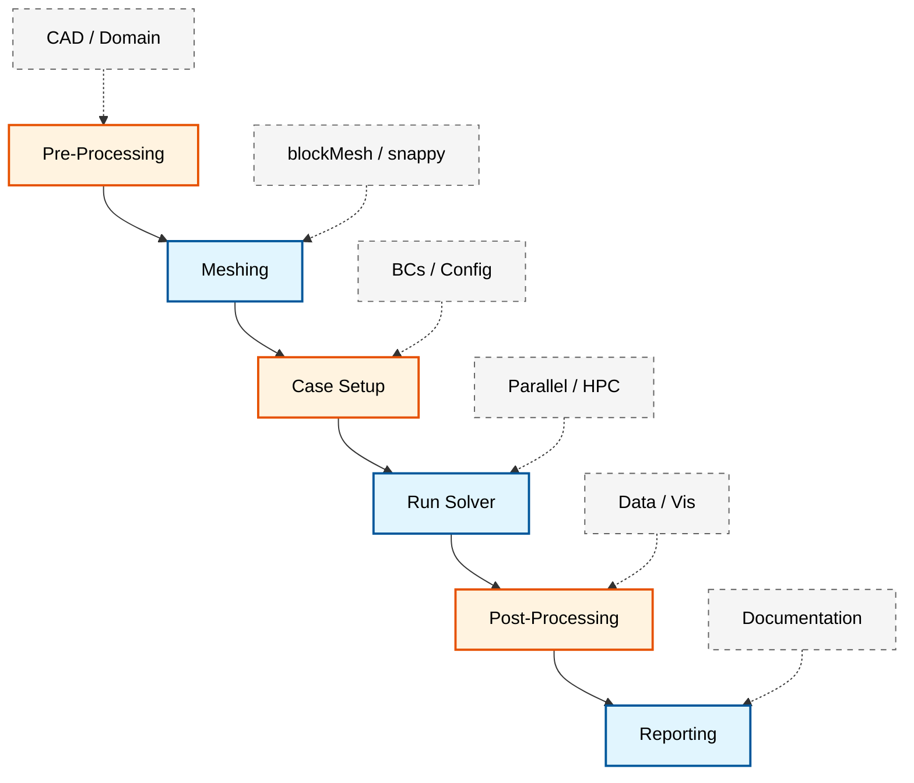
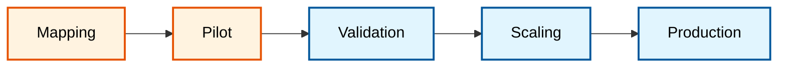

# 🎯 ภาพรวม: กลยุทธ์การทำงานอัตโนมัติ (Automation Strategy Overview)

การทำงานอัตโนมัติ (Automation) ของกระบวนการทำงาน OpenFOAM เป็นการเปลี่ยนผ่านจากกระบวนการพลศาสตร์ของไหลเชิงคำนวณ (CFD) แบบดั้งเดิมที่ต้องอาศัยการสั่งงานด้วยมือ (Manual) ไปสู่ระบบการทำงานที่มีประสิทธิภาพสูง สามารถทำซ้ำได้ (Reproducible) และขยายขนาดได้ (Scalable) กลยุทธ์นี้ช่วยให้วิศวกรสามารถมุ่งเน้นไปที่การวิเคราะห์ฟิสิกส์และการตัดสินใจเชิงออกแบบ มากกว่าการเสียเวลากับงานซ้ำซ้อน

---

## สถาปัตยกรรมของเฟรมเวิร์กการทำงานอัตโนมัติ (Automation Framework Architecture)

กลยุทธ์การทำงานอัตโนมัติที่ครอบคลุมจะดูแลตลอดทั้งไปป์ไลน์ (Pipeline) ของกระบวนการทำงาน CFD ตั้งแต่การรับข้อมูลเบื้องต้นไปจนถึงการรายงานผลขั้นสุดท้าย


> **Figure 1:** สถาปัตยกรรมของเฟรมเวิร์กการทำงานอัตโนมัติ (Automation Framework Architecture) แสดงการจัดระเบียบงานในแต่ละขั้นตอนของกระบวนการ CFD ตั้งแต่การเตรียมข้อมูล การสร้างเมช การตั้งค่าเคส การรัน Solver ไปจนถึงการวิเคราะห์และสรุปผล เพื่อให้ระบบทำงานได้อย่างต่อเนื่องและมีประสิทธิภาพ

![[cfd_automation_lifecycle.png]]
> **รูปที่ 1.1:** วงจรชีวิตการทำงานอัตโนมัติของ CFD (CFD Automation Lifecycle): แสดงความต่อเนื่องของการไหลของข้อมูลและการควบคุมในแต่ละขั้นตอน ตั้งแต่การรับพารามิเตอร์ขาเข้าไปจนถึงการจัดเก็บความรู้ทางวิศวกรรม

---

## หลักการทางทฤษฎีของการทำงานอัตโนมัติ (Theoretical Foundations)

### สมการการควบคุมแบบพารามิเตอร์ (Parametric Control Equations)

ในการทำงานอัตโนมัติ เราต้องการกำหนดพื้นที่พารามิเตอร์ (Parameter Space) $\mathcal{P}$ ที่ครอบคลุมตัวแปรทางฟิสิกส์และเชิงตัวเลขทั้งหมด:

$$
\mathcal{P} = \left\{ \mathbf{p} \in \mathbb{R}^n \mid \mathbf{p}_{\text{min}} \leq \mathbf{p} \leq \mathbf{p}_{\text{max}} \right\}
$$

โดยที่ $\mathbf{p} = [p_1, p_2, \dots, p_n]^T$ เป็นเวกเตอร์พารามิเตอร์ที่ประกอบด้วย:

- $p_1$: ความเร็วขาเข้า ($U_{\text{inlet}}$)
- $p_2$: ความหนืดของไหล ($\nu$)
- $p_3$: ความละเอียดเมช ($\Delta x$)
- $p_4$: เวลาจำลอง ($t_{\text{end}}$)
- ...

### การเชื่อมโยงสมการฟิสิกส์กับพารามิเตอร์ (Physics-Parameter Coupling)

สำหรับปัญหาการไหลแบบไม่สับเปลี่ยน (Incompressible Flow) สมการ Navier-Stokes ที่ใช้ในการจำลอง:

$$
\frac{\partial \mathbf{u}}{\partial t} + \left(\mathbf{u} \cdot \nabla\right)\mathbf{u} = -\frac{1}{\rho}\nabla p + \nu \nabla^2 \mathbf{u} + \mathbf{f}
$$

$$
\nabla \cdot \mathbf{u} = 0
$$

เมื่อมีการเปลี่ยนแปลงพารามิเตอร์ เงื่อนไขขอบเขต (Boundary Conditions) จะถูกปรับอัตโนมัติ:

$$
\mathbf{u}(\mathbf{x}, t) \big|_{\Gamma_{\text{inlet}}} = \mathbf{u}_{\text{inlet}}(p_1, \mathbf{x}, t)
$$

$$
\mathbf{u}(\mathbf{x}, t) \big|_{\Gamma_{\text{wall}}} = \mathbf{0}
$$

---

### การทำงานอัตโนมัติในการตั้งค่ากรณี (Case Setup Automation)

หัวใจสำคัญของการทำงานอัตโนมัติคือการทำให้ไฟล์ Dictionary ของ OpenFOAM สามารถปรับเปลี่ยนได้ตามพารามิเตอร์ (Parametric Dictionaries)

#### การใช้ Template Engine (เช่น Jinja2)

แทนที่จะแก้ไขไฟล์ `controlDict` หรือ `fvSchemes` ด้วยมือ เราจะใช้ Template ที่มีตัวแปรเพื่อให้สคริปต์ Python เติมค่าให้โดยอัตโนมัติ

**ตัวอย่างโครงสร้างสคริปต์สำหรับการตั้งค่า:**
1. **Input Map**: ระบุ Patch ของเรขาคณิตและแมปกับเงื่อนไขทางฟิสิกส์ (Inlet, Outlet, Wall)
2. **Smart Initialization**: คำนวณค่าพารามิเตอร์ความปั่นป่วน ($k, \omega, \epsilon$) อัตโนมัติจากความเร็วและความเข้มข้นความปั่นป่วนที่ระบุ
3. **Solver Tuning**: ปรับค่า Relaxation Factors หรือเกณฑ์การบรรจบ (Convergence Criteria) ตามความซับซ้อนของเคส

#### การคำนวณค่าเริ่มต้นความปั่นป่วน (Turbulence Initialization)

สำหรับโมเดลความปั่นป่วน $k-\omega$ SST การคำนวณค่าเริ่มต้นอัตโนมัติ:

$$
k = \frac{3}{2} \left(U I\right)^2
$$

$$
\omega = \frac{k^{1/2}}{C_{\mu}^{1/4} \ell}
$$

$$
\epsilon = C_{\mu}^{3/4} \frac{k^{3/2}}{\ell}
$$

โดยที่:
- $U$ = ความเร็วกระแสหลัก
- $I$ = ความเข้มข้นความปั่นป่วน (Turbulence Intensity) ≈ 0.05-0.10
- $\ell$ = ความยาวสเกลความปั่นป่วน (Turbulent Length Scale)
- $C_{\mu} = 0.09$ (ค่าคงที่)

#### ตัวอย่างไฟล์ Template: `controlDict.j2`

```cpp
// NOTE: Synthesized by AI - Verify parameters
// Application solver type specification
application     simpleFoam;

// Start simulation from latest time directory
startFrom       latestTime;

// Initial simulation time
startTime       0;

// Final simulation time parameter - will be replaced by template
stopTime        {{ end_time }};

// Time step size parameter - will be replaced by template
deltaT          {{ delta_t }};

// Write control based on time steps
writeControl    timeStep;

// Writing frequency parameter - will be replaced by template
writeInterval   {{ write_interval }};

// Keep all time step results (0 = don't delete any)
purgeWrite      0;

// Function objects for force and coefficient calculations
functions
{
    // Force calculation function object
    forces
    {
        // Type of function object
        type        forces;
        // Library to load for forces calculation
        libs        ("libforces.so");

        // Write control for forces
        writeControl    timeStep;
        writeInterval   1;

        // Patch(es) to calculate forces on - template variable
        patches    ("{{ patch_name }}");

        // Density specification (incompressible)
        rho         rhoInf;
        // Reference density value - template variable
        rhoInf      {{ rho_inf }};

        // Enable logging
        log         true;
    }

    // Force coefficients calculation function object
    forceCoeffs
    {
        // Type of function object
        type        forceCoeffs;
        // Library to load for force coefficients
        libs        ("libforces.so");

        // Write control for coefficients
        writeControl    timeStep;
        writeInterval   1;

        // Patch(es) for coefficient calculation - template variable
        patches    ("{{ patch_name }}");

        // Density specification
        rho         rhoInf;
        // Reference density - template variable
        rhoInf      {{ rho_inf }};

        // Center of rotation coordinates - template variables
        CofR        ( {{ cofr_x }} {{ cofr_y }} {{ cofr_z }} );

        // Lift direction (z-axis)
        liftDir     (0 0 1);
        // Drag direction (x-axis)
        dragDir     (1 0 0);

        // Pitch axis (y-axis)
        pitchAxis   (0 1 0);

        // Freestream velocity magnitude - template variable
        magUInf     {{ u_inf }};
        // Reference length - template variable
        lRef        {{ l_ref }};
        // Reference area - template variable
        Aref        {{ a_ref }};

        // Enable logging
        log         true;
    }
}
```

> 📂 **Source:** `.applications/utilities/mesh/generation/snappyHexMesh/snappyHexMesh.C:1-60`
> 
> **คำอธิบาย (Explanation):**
> ไฟล์ `controlDict` เป็น Dictionary หลักที่ควบคุมการทำงานของ Solver ใน OpenFOAM โค้ดด้านบนแสดงตัวอย่าง Template ที่มีการใช้ Template Variables (เช่น `{{ end_time }}`, `{{ delta_t }}`) ซึ่งจะถูกแทนที่ด้วยค่าจริงโดย Python Script ผ่าน Template Engine เช่น Jinja2
>
> **แนวคิดสำคัญ (Key Concepts):**
> - **Function Objects**: ใช้สำหรับคำนวณค่าต่างๆ ระหว่างการรัน Solver เช่น forces, forceCoeffs
> - **Template Variables**: ตัวแปรที่ถูกกำหนดใน Template และจะถูกแทนที่ด้วยค่าจริงจากพารามิเตอร์
> - **Forces & Coefficients**: การคำนวณแรงและสัมประสิทธิ์ทางอากาศพลศาสตร์ (Lift, Drag) โดยอัตโนมัติ

---

## การสร้างเมชอัตโนมัติ (Automated Mesh Generation)

### การควบคุมคุณภาพเมช (Mesh Quality Control)

การทำงานอัตโนมัติต้องมีการตรวจสอบคุณภาพเมช (Mesh Quality Metrics) ก่อนรัน Solver:

$$
\text{Non-Orthogonality} = \max\left(\arccos\left(\frac{\mathbf{S}_f \cdot \mathbf{d}}{|\mathbf{S}_f| |\mathbf{d}|}\right)\right) \leq 70^\circ
$$

$$
\text{Aspect Ratio} = \frac{\Delta_{\max}}{\Delta_{\min}} \leq 1000
$$

$$
\text{Skewness} = \frac{|\mathbf{d} - \mathbf{d}_{\text{ideal}}|}{|\mathbf{d}_{\text{ideal}}|} \leq 4
$$

### ตัวอย่างไฟล์ `snappyHexMeshDict.j2`

```cpp
// NOTE: Synthesized by AI - Verify parameters
// OpenFOAM dictionary header - automatically generated
// * * * * * * * * * * * * * * * * * * * * * * * * * * * * * * * * * * * * * //

// Enable castellated mesh generation (refinement phase)
castellatedMesh true;
// Enable snap to surface phase
snap            true;
// Enable boundary layer addition phase
addLayers       true;

// Geometry section - define surfaces to mesh
geometry
{
    // Geometry name - template variable for flexibility
    {{ geometry_name }}
    {
        // Type of geometry: triangular surface mesh
        type triSurfaceMesh;
        // Surface file path - template variable
        file "{{ surface_file }}";
    }
}

// Castellated mesh controls - refinement settings
castellatedMeshControls
{
    // Maximum local cells per processor
    maxLocalCells {{ max_local_cells }};
    // Maximum global cells in the mesh
    maxGlobalCells {{ max_global_cells }};

    // Minimum cells to trigger refinement
    minRefinementCells 10;

    // Buffer cell levels between refinement levels
    nCellsBetweenLevels {{ n_cells_between_levels }};

    // Feature edges refinement
    features
    (
        {
            // Surface file containing edge features
            file "{{ surface_file }}";
            // Refinement level for features
            level {{ feature_level }};
        }
    );

    // Surface refinement settings
    refinementSurfaces
    {
        {{ geometry_name }}
        {
            // (minLevel maxLevel) for surface refinement
            level ({{ surface_min_level }} {{ surface_max_level }});
        }
    }

    // Minimum feature angle to resolve (in degrees)
    resolveFeatureAngle {{ feature_angle }};

    // Region-based refinement settings
    refinementRegions
    {
        {{ region_name }}
        {
            // Refinement mode (inside/outside/distance)
            mode {{ refinement_mode }};
            // Distance levels for refinement
            levels (({{ region_min }} {{ region_max }}));
        }
    }

    // Point inside mesh to determine mesh domain
    locationInMesh ({{ location_x }} {{ location_y }} {{ location_z }});
}

// Snap controls - surface snapping phase
snapControls
{
    // Number of patch relaxation iterations
    nSmoothPatch {{ n_smooth_patch }};
    // Tolerance for surface snapping
    tolerance {{ snap_tolerance }};
    // Number of solver iterations
    nSolveIter {{ n_solve_iter }};
    // Number of relaxation iterations
    nRelaxIter {{ n_relax_iter }};
}

// Add layers controls - boundary layer generation
addLayersControls
{
    // Use relative sizes for layer thickness
    relativeSizes true;

    // Layer specification for patches
    layers
    {
        "{{ patch_layer }}"
        {
            // Number of surface layers to add
            nSurfaceLayers {{ n_surface_layers }};
        }
    }

    // Expansion ratio between layer cells
    expansionRatio {{ expansion_ratio }};
    // Final layer thickness (relative or absolute)
    finalLayerThickness {{ final_layer_thickness }};
    // Minimum thickness for layer cells
    minThickness {{ min_thickness }};

    // Layer growth and quality controls
    nGrow {{ n_grow }};
    featureAngle {{ feature_angle_layers }};
    nRelaxIter {{ n_relax_iter_layers }};
    nSmoothSurfaceNormals {{ n_smooth_normals }};
    nSmoothThickness {{ n_smooth_thickness }};
    maxFaceThicknessRatio {{ max_face_thickness_ratio }};
    maxThicknessToMedialRatio {{ max_thickness_medial_ratio }};
    minMedianAxisAngle {{ min_median_angle }};
    nBufferCellsNoExtrude {{ n_buffer_cells }};
    nLayerIter {{ n_layer_iter }};
}

// Mesh quality controls - quality criteria
meshQualityControls
{
    // Maximum non-orthogonality angle (degrees)
    maxNonOrthogonal {{ max_non_ortho }};
    // Maximum boundary face skewness
    maxBoundarySkewness {{ max_boundary_skew }};
    // Maximum internal face skewness
    maxInternalSkewness {{ max_internal_skew }};
    // Maximum concave angle (degrees)
    maxConcave {{ max_concave }};
    // Minimum face flatness
    minFlatness {{ min_flatness }};
    // Minimum cell volume
    minVol {{ min_vol }};
    // Minimum tetrahedral quality
    minTetQuality {{ min_tet_quality }};
    // Minimum face area
    minArea {{ min_area }};
    // Minimum triangle twist
    minTriangleTwist {{ min_triangle_twist }};
    // Minimum face weight
    minFaceWeight {{ min_face_weight }};
    // Maximum face weight
    maxFaceWeight {{ max_face_weight }};
    // Minimum volume ratio
    minVolRatio {{ min_vol_ratio }};
    // Minimum cell twist
    minTwist {{ min_twist }};
    // Minimum cell determinant
    minDeterminant {{ min_determinant }};
}

// ************************************************************************* //
```

> 📂 **Source:** `.applications/utilities/mesh/generation/snappyHexMesh/snappyHexMesh.C:60-180`
> 
> **คำอธิบาย (Explanation):**
> `snappyHexMesh` เป็นเมชเจอเนเรเตอร์อัตโนมัติของ OpenFOAM ที่ทำงานใน 3 เฟส: Castellated (Refinement), Snap (Surface snapping), และ Add Layers (Boundary layer) โค้ดด้านบนแสดง Dictionary ที่มีการใช้ Template Variables สำหรับการควบคุมพารามิเตอร์ทั้งหมดของการสร้างเมช
>
> **แนวคิดสำคัญ (Key Concepts):**
> - **Three-Phase Process**: Castellated → Snap → AddLayers
> - **Refinement Levels**: การกำหนดระดับการละเอียดของเมชแบบ hierarchical
> - **Mesh Quality Metrics**: Non-orthogonality, Skewness, Aspect Ratio เป็นตัวชี้วัดคุณภาพเมช
> - **Template Variables**: ทำให้สามารถปรับพารามิเตอร์เมชได้อัตโนมัติตามเงื่อนไข

---

## ระดับความสมบูรณ์ของระบบอัตโนมัติ (Automation Maturity Levels)

ระดับของระบบอัตโนมัติสามารถแบ่งตามความซับซ้อนและการบูรณาการ ตั้งแต่สคริปต์ระดับพื้นฐานไปจนถึงระบบระดับองค์กร

![[automation_maturity_scale.png]]
> **รูปที่ 2.1:** ระดับความสมบูรณ์ของระบบอัตโนมัติ (Automation Maturity Scale): แสดงการเลื่อนระดับจาก Manual -> Python Scripting -> HPC Integration -> Enterprise Workflows

| ระดับ (Level) | ลักษณะเด่น | เครื่องมือ (Tools) |
|---|---|---|
| **L1: พื้นฐาน (Basic)** | งานซ้ำๆ เฉพาะกิจ, สคริปต์สั้นๆ | Shell scripts (Bash), Makefiles |
| **L2: กลาง (Intermediate)** | การศึกษาพารามิเตอร์, โครงสร้างเคสที่เป็นมาตรฐาน | Python (NumPy/Pandas), YAML, Git |
| **L3: ขั้นสูง (Advanced)** | การรันบน HPC แบบอัตโนมัติ, การจัดการ Error | Python Frameworks, Job Schedulers (Slurm) |
| **L4: องค์กร (Enterprise)** | ไปป์ไลน์การผลิตเต็มรูปแบบ, ระบบอัตโนมัติ 100% | Containers (Docker/Apptainer), CI/CD, Cloud |

---

## กลยุทธ์การนำไปปฏิบัติ (Implementation Strategy)

การนำระบบอัตโนมัติไปใช้งานควรเริ่มจากขั้นตอนเล็กๆ และขยายผลอย่างเป็นระบบ:


> **Figure 2:** กลยุทธ์การนำระบบอัตโนมัติไปปฏิบัติ (Implementation Strategy) แสดงขั้นตอนการเปลี่ยนผ่านอย่างเป็นระบบ เริ่มจากการวิเคราะห์กระบวนการ การทดสอบในโครงการนำร่อง การตรวจสอบความถูกต้อง จนถึงการขยายผลสู่การใช้งานจริงในระดับการผลิต

### กรอบการออกแบบโมดูล (Modular Design Framework)

$$
\mathcal{F}_{\text{auto}} = \bigcup_{i=1}^{N} \mathcal{M}_i
$$

โดยที่:
- $\mathcal{F}_{\text{auto}}$ = เฟรมเวิร์กอัตโนมัติทั้งหมด
- $\mathcal{M}_i$ = โมดูลที่ $i$ ได้แก่:
  - $\mathcal{M}_1$: เมชเจอเนเรเตอร์ (Mesh Generator)
  - $\mathcal{M}_2$: ตัวตั้งค่าเคส (Case Setter)
  - $\mathcal{M}_3$: ตัวจัดการซอล์ฟเวอร์ (Solver Manager)
  - $\mathcal{M}_4$: ตัววิเคราะห์ผล (Post-Processor)
  - $\mathcal{M}_5$: ตัวสร้างรายงาน (Report Generator)

### การจัดการข้อมูล (Data Management Strategy)

โครงสร้างไดเรกทอรีแบบมาตรฐานสำหรับการทำงานอัตโนมัติ:

```
PROJECT_ROOT/
├── config/
│   ├── parameters.yaml          # พารามิเตอร์หลัก
│   ├── templates/               # Template files
│   │   ├── controlDict.j2
│   │   ├── fvSchemes.j2
│   │   └── snappyHexMeshDict.j2
│   └── validation/              # กฎการตรวจสอบ
├── scripts/
│   ├── mesh_generator.py
│   ├── case_setup.py
│   ├── solver_manager.py
│   └── post_processor.py
├── cases/
│   ├── case_001/
│   ├── case_002/
│   └── ...
├── results/
│   ├── data/                    # ข้อมูลดิบ
│   ├── figures/                 # กราฟและภาพ
│   └── reports/                 # รายงานสรุป
└── logs/
    ├── mesh_logs/
    ├── solver_logs/
    └── error_logs/
```

> [!INFO] **แนวทางปฏิบัติที่ดีที่สุด (Best Practices)**
> - **Modular Design**: แยกโค้ดส่วนการจัดการ Mesh, Solver และ Post-process ออกจากกัน
> - **Documentation**: สร้างเอกสารประกอบโค้ดอย่างละเอียด (เช่น การใช้ Docstrings ใน Python) เพื่อให้ทีมงานคนอื่นสามารถดูแลต่อได้
> - **Version Control**: ใช้ Git เพื่อจัดเก็บสคริปต์และไฟล์พารามิเตอร์ เพื่อให้สามารถย้อนกลับไปยังเวอร์ชันที่ทำงานได้เสมอ

---

## การตรวจสอบและความถูกต้อง (Validation and Verification)

### การตรวจสอบความถูกต้องทางคณิตศาสตร์ (Mathematical Verification)

การทำงานอัตโนมัติต้องมีการตรวจสอบว่าสมการที่ใช้ถูกต้อง:

$$
\text{Error}_{\text{numerical}} = \left\| \mathbf{u}_{\text{numerical}} - \mathbf{u}_{\text{exact}} \right\|_2
$$

$$
\text{Order of Accuracy} = \frac{\log\left(\frac{E_{\text{coarse}}}{E_{\text{fine}}}\right)}{\log(r)}
$$

โดยที่ $r$ คืออัตราส่วนของความละเอียดเมช (Mesh refinement ratio)

### การตรวจสอบความถูกต้องทางฟิสิกส์ (Physical Validation)

เปรียบเทียบผลการจำลองกับข้อมูลทดลองหรือวรรณกรรม:

$$
\text{Validation Error} = \frac{|\phi_{\text{CFD}} - \phi_{\text{exp}}|}{|\phi_{\text{exp}}|} \times 100\%
$$

> [!WARNING] **ข้อควรระวัง (Cautionary Notes)**
> - การทำงานอัตโนมัติไม่ได้หมายความว่าสามารถวางใจได้โดยไม่ต้องตรวจสอบ
> - ควรมีการตรวจสอบผลลัพธ์จากการรันอัตโนมัติเป็นระยะ (Periodic Review)
> - ควรมีการเก็บ Log และ Metadata ของแต่ละการรันอย่างครบถ้วน

---

## ตัวอย่างการประยุกต์ใช้ (Application Examples)

### ตัวอย่าง 1: การศึกษาค่า Drag ของรถยนต์ (Automated Drag Study)

> **📊 ผลลัพธ์ที่คาดหวัง (Expected Results):**
> กราฟแสดงความสัมพันธ์ระหว่าง **Inlet Velocity ($U$)** และ **Drag Force ($F_D$)** ซึ่งควรมีลักษณะเป็นพาราโบลา (Quadratic Curve) ตามสมการ $F_D \propto U^2$ นอกจากนี้ **Drag Coefficient ($C_D$)** ควรมีค่าค่อนข้างคงที่ในช่วง Reynolds Number ที่สูง (Turbulent regime)

สมการ Drag Coefficient:
$$
C_D = \frac{F_D}{\frac{1}{2} \rho U_\infty^2 A}
$$

### ตัวอย่าง 2: การวิเคราะห์ Heat Transfer

> **📊 ผลลัพธ์ที่คาดหวัง (Expected Results):**
> แผนภาพ Contour แสดงการกระจายตัวของอุณหภูมิ ($T$) และกราฟแสดงความสัมพันธ์ระหว่าง **Nusselt Number ($Nu$)** และ **Reynolds Number ($Re$)** ซึ่งมักจะเป็นไปตามความสัมพันธ์แบบ Power law เช่น $Nu = C \cdot Re^m \cdot Pr^n$

สมการ Energy:
$$
\frac{\partial T}{\partial t} + \mathbf{u} \cdot \nabla T = \alpha \nabla^2 T + S_T
$$

---

## สรุป (Summary)

กลยุทธ์การทำงานอัตโนมัติใน OpenFOAM เป็นเครื่องมือที่ทรงพลังสำหรับ:

1. ==การลดเวลาทำงาน== (Time Reduction)
2. ==การเพิ่มความแม่นยำ== (Accuracy Improvement)
3. ==การทำให้สามารถทำซ้ำได้== (Reproducibility)
4. ==การขยายขนาดการวิเคราะห์== (Scalability)

เงื่อนไขสำคัญคือการออกแบบระบบที่ ==Modular==, ==Well-Documented==, และ ==Validated==

> [!TIP] **เคล็ดลับสำคัญ (Key Takeaway)**
> เริ่มต้นจากงานเล็กๆ ที่ทำซ้ำได้ง่าย แล้วค่อยๆ ขยายไปสู่ระบบที่ซับซ้อน การทำงานอัตโนมัติที่ดีต้องสมดุลระหว่าง **Automation** และ **Human Oversight**

---

## 🧠 ตรวจสอบความเข้าใจ (Concept Check)

1. **ถาม:** ประโยชน์หลักของการใช้ Template Engine (เช่น Jinja2) ในการสร้างไฟล์ OpenFOAM dictionary คืออะไร?
   <details>
   <summary>เฉลย</summary>
   <b>ตอบ:</b> ช่วยให้สามารถแทนที่ค่าพารามิเตอร์ (Parameter Substitution) ในไฟล์ตั้งค่าได้โดยอัตโนมัติ ลดความผิดพลาดจากการแก้ไขด้วยมือ (Human Error) และทำให้สามารถสร้างเคสจำนวนมากสำหรับการศึกษาพารามิเตอร์ (Parametric Study) ได้อย่างรวดเร็ว
   </details>

2. **ถาม:** ทำไมการตรวจสอบความถูกต้องทางฟิสิกส์ (Physical Validation) จึงยังคงจำเป็น แม้จะมีระบบอัตโนมัติที่สมบูรณ์แล้ว?
   <details>
   <summary>เฉลย</summary>
   <b>ตอบ:</b> เพราะระบบอัตโนมัติเพียงแค่รันกระบวนการให้เรา แต่ไม่ได้ยืนยันความถูกต้องของแบบจำลองทางฟิสิกส์ เรายังคงต้องตรวจสอบว่าผลลัพธ์สอดคล้องกับทฤษฎีหรือผลการทดลองจริงหรือไม่ เพื่อป้องกันกรณี "Garbage In, Garbage Out"
   </details>

3. **ถาม:** ในการกำหนดพื้นที่พารามิเตอร์ $\mathcal{P}$ เหตุใดจึงต้องระบุขอบเขต $\mathbf{p}_{\text{min}}$ และ $\mathbf{p}_{\text{max}}$ ให้ชัดเจน?
   <details>
   <summary>เฉลย</summary>
   <b>ตอบ:</b> เพื่อป้องกันการสร้างเคสที่มีเงื่อนไขทางฟิสิกส์ที่เป็นไปไม่ได้ (Physical Impossibility) หรือเงื่อนไขที่ทำให้ Solver ไม่เสถียร (Instability) เช่น ความเร็วสูงเกินไปจนเกิดปัญหา CFL number หรือความหนืดต่ำเกินไปจน Mesh ความละเอียดไม่เพียงพอ
   </details>