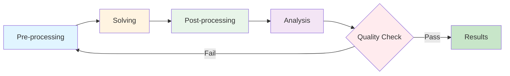

# Automation Strategy

กลยุทธ์การ Automate

---

## Overview

> **Strategy** สำหรับ effective automation ในการทำ CFD simulation อย่างเป็นระบบ

Effective automation ไม่ได้หมายความว่าแค่การ run script ให้ได้ผลลัพธ์ แต่หมายถึงการสร้าง workflow ที่ **reproducible** (ทำซ้ำได้), **efficient** (มีประสิทธิภาพ), และ **maintainable** (บำรุงรักษาได้) ตลอดจนเกิดประโยชน์สูงสุดจากการใช้เวลา compute

---

## Learning Objectives

🎯 **เป้าหมายการเรียนรู้ (Learning Objectives)**

After completing this module, you should be able to:

1. **Understand** หลักการพื้นฐานของ CFD automation strategy
2. **Design** workflow ที่เหมาะสมกับปัญหาของคุณ
3. **Implement** script structure ที่ modular และ reusable
4. **Troubleshoot** common issues ใน automation pipeline

---

## 1. What is CFD Automation?

### 📌 แนวคิด (Concept)

**CFD Automation** คือการใช้ shell scripts, Python, หรือเครื่องมืออื่นๆ เพื่อ:
- Execute CFD simulations จาก preprocessing ไปจนถึง postprocessing
- Minimize manual intervention และ human error
- Standardize workflows ข้าม cases และ team members
- Enable batch processing ของ parametric studies

### 💡 Why Automate?

| Benefit | Description | Impact |
|---------|-------------|--------|
| **Reproducibility** | ได้ผลลัพธ์เหมือนเดิมเสมอเมื่อใช้ input เดิม | ✅ High confidence in results |
| **Efficiency** | Run multiple cases overnight/weekend | ⏰ 10-100x more simulations |
| **Consistency** | Standardized approach across team | 👥 Collaboration improves |
| **Documentation** | Script คือ documentation ที่ live ได้ | 📝 Self-documenting workflow |
| **Error Reduction** | Eliminate typos, forgotten steps | ⚠️ Fewer failed runs |

---

## 2. Core Principles of Effective Automation

### 🎯 หลักการสำคัญ

| Principle | **What** (คืออะไร) | **Why** (ทำไมสำคัญ) | **How** (ทำอย่างไร) |
|-----------|---------------------|----------------------|---------------------|
| **Reproducible** | ได้ผลลัพธ์เหมือนเดิมเสมอเมื่อ run ซ้ำ | เพื่อความมั่นใจในผลลัพธ์และ verification | ✅ Version control inputs<br>✅ Record parameters<br>✅ Fix random seeds |
| **Documented** | มีคำอธิบายว่า script ทำอะไร | เพื่อให้คนอื่น (และตัวเราในอนาคต) เข้าใจได้ | ✅ Comment liberally<br>✅ Add README files<br>✅ Use descriptive names |
| **Error Handling** | จัดการ failure อย่างเหมาะสม | เพื่อไม่ให้ simulation แลกมิ่งโดยไม่รู้ตัว | ✅ Check return codes<br>✅ Log errors<br>✅ Send notifications |
| **Modular** | แบ่งเป็น reusable components | เพื่อให้ reuse ได้และ maintain ง่าย | ✅ Separate phases<br>✅ Parameterize values<br>✅ Use functions |
| **Scalable** | ขยายจาก single case → batch cases | เพื่อรองรับ parametric studies | ✅ Loop structures<br>✅ Case templates<br>✅ Parallel execution |

---

## 3. CFD Automation Workflow

### 🔄 Complete Automation Pipeline



<!-- IMAGE: IMG_07_003 -->
<!-- 
Purpose: เพื่อแสดงวงจร "CFD Automation Pipeline" ที่สมบูรณ์. การ Automate ไม่ใช่แค่การรัน Solver แต่ต้องครอบคลุมตั้งแต่การสร้าง Mesh ($\rightarrow$ Pre) ไปจนถึงการสรุปผลกราฟ ($\rightarrow$ Post) เพื่อให้มั่นใจในความ "Reproducible"
Prompt: "Sequential CFD Automation Pipeline. **Stage 1 (Pre-processing):** Icons for 'CAD Import' and 'Meshing (blockMesh)'. **Stage 2 (Solving):** Icon for 'CPU/Server Rack' running calculations. **Stage 3 (Post-processing):** Icons for 'Sampling' and 'Visualization (ParaView)'. **Integration:** A conveyor belt connecting all stages, driven by a 'Script/Bot'. Label: 'Fully Automated Workflow'. STYLE: Industrial process diagram, clean and efficient looking."
-->
[[IMG_07_003.jpg]]

### 📋 Workflow Phases Explained

#### Phase 1: Pre-processing (เตรียมการ)

**Purpose:** เตรียม case สำหรับการ solve

**When to use:** เมื่อต้องเตรียม mesh, boundary conditions, หรือ initial conditions

**Typical operations:**
```bash
#!/bin/bash
# Allrun.pre

echo "=== Pre-processing Phase ==="

# 1. Generate mesh
blockMesh > log.blockMesh 2>&1

# 2. Refine mesh (optional)
snappyHexMesh -overwrite > log.snappyHexMesh 2>&1

# 3. Initialize fields
setFields > log.setFields 2>&1

# 4. Decompose for parallel
decomposePar > log.decomposePar 2>&1

echo "Pre-processing complete!"
```

#### Phase 2: Solving (คำนวณ)

**Purpose:** Run CFD solver

**When to use:** เมื่อ pre-processing เสร็จสมบูรณ์

**Typical operations:**
```bash
#!/bin/bash
# Allrun.solve

echo "=== Solving Phase ==="

# Get number of processors
NPROC=$(grep numberOfSubdomains system/decomposeParDict | tail -1 | awk '{print $2}')

# Run solver in parallel
mpirun -np $NPROC simpleFoam -parallel > log.simpleFoam 2>&1

# Check convergence
if [ $? -eq 0 ]; then
    echo "Solver completed successfully!"
else
    echo "Solver failed! Check log.simpleFoam"
    exit 1
fi
```

#### Phase 3: Post-processing (ประมวลผล)

**Purpose:** สร้างกราฟ, plots, และ reports

**When to use:** เมื่อ solver converge แล้ว

**Typical operations:**
```bash
#!/bin/bash
# Allrun.post

echo "=== Post-processing Phase ==="

# 1. Reconstruct parallel results
reconstructPar > log.reconstructPar 2>&1

# 2. Sample data for plotting
postProcess -func sampleDict > log.sample 2>&1

# 3. Generate plots (Python/gnuplot)
python plotResults.py

# 4. Create ParaView images
paraFoam -batch -script script.pvsm

echo "Post-processing complete!"
```

#### Phase 4: Analysis (วิเคราะห์)

**Purpose:** ตรวจสอบคุณภาพผลลัพธ์ และสรุป

**When to use:** เมื่อต้องการ verify และ validate ผลลัพธ์

**Typical operations:**
- Mass balance check
- Convergence analysis
- Comparison with experimental data
- Documentation generation

---

## 4. Script Structure Design

### 🏗️ When to Use Single vs. Multiple Scripts

| Scenario | Recommended Approach | Why |
|----------|---------------------|-----|
| **Simple case** | Single `Allrun` script | Easy to understand, less files |
| **Complex workflow** | Separate `.pre`, `.solve`, `.post` | Debug easier, can rerun specific phases |
| **Development** | Multiple scripts | Faster iteration, don't rerun mesh every time |
| **Production** | Single master calling sub-scripts | Best of both worlds: structure + convenience |

### 📁 Best Practice: Master Script + Modular Components

```bash
#!/bin/bash
# Allrun - Master script

set -e  # Exit on error
set -u  # Exit on undefined variable

# Configuration
CASE_DIR=$(pwd)
RUN_PRE=true
RUN_SOLVE=true
RUN_POST=true

# Parse command line arguments
while [[ $# -gt 0 ]]; do
    case $1 in
        --pre-only)
            RUN_SOLVE=false
            RUN_POST=false
            shift
            ;;
        --post-only)
            RUN_PRE=false
            RUN_SOLVE=false
            shift
            ;;
        --no-post)
            RUN_POST=false
            shift
            ;;
        *)
            echo "Unknown option: $1"
            exit 1
            ;;
    esac
done

# Execute phases
if [ "$RUN_PRE" = true ]; then
    echo "=== Running Pre-processing ==="
    ./Allrun.pre || exit 1
fi

if [ "$RUN_SOLVE" = true ]; then
    echo "=== Running Solver ==="
    ./Allrun.solve || exit 1
fi

if [ "$RUN_POST" = true ]; then
    echo "=== Running Post-processing ==="
    ./Allrun.post || exit 1
fi

echo "=== All phases completed successfully! ==="
```

---

## 5. Practical Examples

### Example 1: Simple Single-Phase Flow

```bash
#!/bin/bash
# Allrun - Simple case

echo "Starting simulation..."

# Clean previous results
foamCleanTutorials

# Mesh
blockMesh

# Initialize
setFields

# Run solver (serial)
simpleFoam

echo "Simulation complete!"
```

### Example 2: Complex Multiphase Case

```bash
#!/bin/bash
# Allrun - Multiphase with quality checks

echo "=== Multiphase Case Automation ==="

# Pre-processing
echo "--- Phase 1: Meshing ---"
blockMesh > log.blockMesh 2>&1
if ! grep -q "mesh OK" log.blockMesh; then
    echo "ERROR: blockMesh failed!"
    exit 1
fi

snappyHexMesh -overwrite > log.snappyHexMesh 2>&1
checkMesh > log.checkMesh 2>&1

echo "--- Phase 2: Decomposition ---"
decomposePar

echo "--- Phase 3: Solving ---"
NPROC=$(grep numberOfSubdomains system/decomposeParDict | tail -1 | awk '{print $2}')
mpirun -np $NPROCM interFoam -parallel > log.interFoam 2>&1

# Monitor convergence
tail -f log.interFoam | grep "Finalising" &
TAIL_PID=$!

# Wait for solver
wait $TAIL_PID

echo "--- Phase 4: Reconstruction ---"
reconstructPar

echo "--- Phase 5: Post-processing ---"
postProcess -func 'mag(U)' -func 'p'
paraFoam -batch -script animate.py

echo "=== Simulation complete! ==="
```

### Example 3: Parametric Study Loop

```bash
#!/bin/bash
# runParametricStudy.sh

# Define parameter ranges
VELOCITIES=(1.0 2.0 5.0 10.0)
VISCOSITIES=(1e-3 1e-4 1e-5)

# Loop over parameters
for VEL in "${VELOCITIES[@]}"; do
    for VISC in "${VISCOSITIES[@]}"; do
        echo "=== Running U=$VEL, nu=$VISC ==="
        
        # Create new case directory
        CASE_DIR="case_U${VEL}_nu${VISC}"
        cp -r base_case $CASE_DIR
        cd $CASE_DIR
        
        # Modify parameters
        sed -i "s/INLET_VELOCITY/$VEL/g" 0/U
        sed -i "s/KINEMATIC_VISCOSITY/$VISC/g" constant/transportProperties
        
        # Run simulation
        ./Allrun
        
        cd ..
    done
done

echo "=== Parametric study complete! ==="
```

---

## 6. Common Pitfalls & Solutions

### ⚠️ ปัญหาที่พบบ่อย

| Pitfall | ❌ Problem | ✅ Solution |
|---------|-----------|-------------|
| **Hardcoded paths** | Script fails on different machines | Use `$WM_PROJECT_USER_DIR` or relative paths |
| **No error checking** | Simulation fails silently | Always check exit codes (`set -e`, check logs) |
| **Missing logs** | Can't debug failures | Redirect all output to log files |
| **Overwriting results** | Lose previous simulations | Add timestamps or case directories |
| **No backup** | Can't recover from errors | Copy original case before modifying |
| **Forgotten steps** | Incomplete workflow | Create checklist/template |
| **Mixed serial/parallel** | Confusion and errors | Detect decomposition consistently |

### Example: Robust Error Handling

```bash
#!/bin/bash
# Allrun with comprehensive error handling

# Configuration
LOG_DIR="logs"
mkdir -p $LOG_DIR

# Function to run and check
run_check() {
    local CMD=$1
    local LOG=$2
    local MSG=$3
    
    echo "Running: $CMD"
    eval $CMD > $LOG_DIR/$LOG 2>&1
    
    if [ $? -eq 0 ]; then
        echo "✓ $MSG"
        return 0
    else
        echo "✗ $MSG failed! Check $LOG_DIR/$LOG"
        tail -20 $LOG_DIR/$LOG
        return 1
    fi
}

# Main workflow
run_check "blockMesh" "blockMesh.log" "Mesh generation" || exit 1
run_check "setFields" "setFields.log" "Field initialization" || exit 1
run_check "decomposePar" "decomposePar.log" "Domain decomposition" || exit 1
run_check "mpirun -np 4 simpleFoam -parallel" "solver.log" "Solver" || exit 1
run_check "reconstructPar" "reconstructPar.log" "Result reconstruction" || exit 1

echo "=== All steps successful! ==="
```

---

## 7. Quick Reference Tables

### 📊 Automation Commands Reference

| Category | Command | Purpose | Example |
|----------|---------|---------|---------|
| **Mesh** | `blockMesh` | Generate base mesh | `blockMesh > log.blockMesh` |
| | `snappyHexMesh` | Refine mesh | `snappyHexMesh -overwrite` |
| | `checkMesh` | Validate mesh | `checkMesh > log.checkMesh` |
| **Decomposition** | `decomposePar` | Split domain | `decomposePar > log.decomposePar` |
| | `reconstructPar` | Merge results | `reconstructPar > log.reconstructPar` |
| **Solvers** | `simpleFoam` | Steady turbulent | `simpleFoam > log.simpleFoam` |
| | `pimpleFoam` | Transient | `pimpleFoam > log.pimpleFoam` |
| | `interFoam` | Multiphase | `interFoam > log.interFoam` |
| **Post-process** | `sample` | Extract data | `sample -dict system/sampleDict` |
| | `foamToVTK` | Convert format | `foamToVTK` |
| | `paraFoam` | Visualize | `paraFoam -batch` |

### 📋 Script Template Comparison

| Template | Best For | Complexity | Flexibility |
|----------|----------|------------|-------------|
| **Single script** | Simple cases, learning | ⭐ | ⭐ |
| **Phase scripts** | Development, debugging | ⭐⭐ | ⭐⭐⭐ |
| **Master + subs** | Production, team use | ⭐⭐⭐ | ⭐⭐⭐⭐⭐ |
| **Python wrapper** | Complex studies, optimization | ⭐⭐⭐⭐⭐ | ⭐⭐⭐⭐ |

---

## 8. Advanced Topics

### 🔗 Integration with Version Control

```bash
#!/bin/bash
# Allrun with Git integration

# Record simulation metadata
GIT_COMMIT=$(git rev-parse HEAD)
GIT_BRANCH=$(git rev-parse --abbrev-ref HEAD)
TIMESTAMP=$(date +%Y%m%d_%H%M%S)

echo "=== Simulation Metadata ===" > simulation_info.txt
echo "Git commit: $GIT_COMMIT" >> simulation_info.txt
echo "Git branch: $GIT_BRANCH" >> simulation_info.txt
echo "Timestamp: $TIMESTAMP" >> simulation_info.txt
echo "Host: $(hostname)" >> simulation_info.txt

# Run simulation
./Allrun

# Archive results
tar -czf results_${TIMESTAMP}.tar.gz simulation_info.txt logs/ 0.[0-9]*/
```

### 📧 Automated Notifications

```bash
#!/bin/bash
# Allrun with email notifications

EMAIL="your.email@example.com"
CASE_NAME=$(basename $PWD)

send_notification() {
    local STATUS=$1
    local MESSAGE=$2
    
    echo "$MESSAGE" | mail -s "[$STATUS] $CASE_NAME" $EMAIL
}

# Run with error trapping
trap "send_notification 'FAILED' 'Simulation failed!'" ERR

./Allrun

send_notification "SUCCESS" "Simulation completed successfully!"
```

---

## Key Takeaways

### ✅ สรุปสิ่งสำคัญ

1. **Automation = Reproducibility + Efficiency**
   - Script คือ documentation ที่ live ได้
   - Reduce human error และ save time

2. **Modular Design Wins**
   - แยก pre/solve/post สำหรับ debugging
   - Master script เรียก sub-scripts สำหรับ convenience

3. **Error Handling is Essential**
   - Always check exit codes
   - Log everything
   - Fail gracefully with clear messages

4. **Choose Right Structure**
   - Simple case → Single script
   - Complex workflow → Modular approach
   - Parametric study → Loop structures

5. **Standardize Across Team**
   - Use consistent naming conventions
   - Create template scripts
   - Document decisions

---

## 🧠 Concept Check

<details>
<summary><b>1. ทำไมต้องแยกเป็น 3 phase scripts (.pre, .solve, .post)?</b></summary>

**Answer:** 
- ✅ **Debug easier:** ถ้า mesh fail ไม่ต้องรัน solve ซ้ำ
- ✅ **Save time:** แก้ parameter ใน post-processing ไม่ต้องรันทั้งหมดใหม่
- ✅ **Development flexibility:** Test different post-processing บน results เดิม
- ✅ **Partial rerun:** เมื่อมีการ fail สามารถ rerun เฉพาะ phase ที่มีปัญหา

</details>

<details>
<summary><b>2. When should you use a single Allrun vs. separate scripts?</b></summary>

**Answer:**
- **Single Allrun:** เหมาะกับ simple cases, learning, หรือ cases ที่ไม่เคย fail
- **Separate scripts:** เหมาะกับ complex workflows, development, cases ที่ต้อง iterate บ่อย
- **Best practice:** Master Allrun เรียก sub-scripts → ได้ทั้งความสะดวกและ modularity

</details>

<details>
<summary><b>3. ทำไมต้องมี error handling ใน automation scripts?</b></summary>

**Answer:**
- ✅ **Detect failures early:** ไม่ปล่อยให้ simulation แลกมิ่งโดยไม่รู้ตัว
- ✅ **Meaningful logs:** รู้ว่า fail ที่ step ไหน และทำไม
- ✅ **Save resources:** ไม่เสีย compute time บน simulation ที่ fail อยู่แล้ว
- ✅ **Automated alerts:** แจ้งเตือนเมื่อมีปัญหาโดยไม่ต้อง monitor เอง

</details>

<details>
<summary><b>4. หลักการ 'Reproducible' ใน CFD automation หมายความว่าอย่างไร?</b></summary>

**Answer:**
Reproducible แปลว่า:
- 🔒 **Fixed inputs:** Version control ทุกอย่าง (meshDict, boundary conditions, schemes)
- 🔒 **Recorded parameters:** Log ค่าที่ใช้ (solver settings, time step, mesh size)
- 🔒 **Consistent environment:** Document OpenFOAM version, compiler, library versions
- 🔒 **Same output:** Run ซ้ำด้วย input เดิม → ได้ผลลัพธ์เหมือนเดิม (bit-for-bit เมื่อมั่นใจ)

</details>

<details>
<summary><b>5. จงออกแบบ workflow สำหรับ parametric study ที่ test 3 mesh resolutions × 4 turbulence models</b></summary>

**Answer:**
```bash
#!/bin/bash
# runParametricStudy.sh

MESHES=("coarse" "medium" "fine")
MODELS=("kEpsilon" "kOmegaSST" "SpalartAllmaras" "LES")

for MESH in "${MESHES[@]}"; do
    for MODEL in "${MODELS[@]}"; do
        CASE="case_${MESH}_${MODEL}"
        echo "=== Running $CASE ==="
        
        # Copy base case
        cp -r base_case $CASE
        cd $CASE
        
        # Configure mesh
        sed -i "s/MESH_SIZE/${MESH}/g" system/blockMeshDict
        
        # Configure turbulence model
        sed -i "s/TURBULENCE_MODEL/${MODEL}/g" constant/turbulenceProperties
        
        # Run simulation
        ./Allrun
        
        cd ..
    done
done
```
Key points:
- ✅ Use nested loops สำหรับ multi-parameter studies
- ✅ Descriptive case names
- ✅ Parallel execution ถ้ามี resources
- ✅ Error handling เพื่อไม่ให้ case เดียว fail ทำลายทั้ง batch

</details>

---

## 📖 เอกสารที่เกี่ยวข้อง

- **ภาพรวม:** [00_Overview.md](00_Overview.md)
- **Shell Scripting Basics:** [01_Shell_Scripting_Basics.md](01_Shell_Scripting_Basics.md)
- **OpenFOAM Utilities:** [02_OpenFOAM_Commands.md](02_OpenFOAM_Commands.md)
- **Batch Processing:** [03_Batch_Processing.md](03_Batch_Processing.md)
- **Advanced Automation:** [04_Advanced_Workflows.md](04_Advanced_Workflows.md)