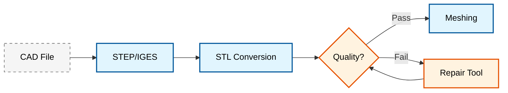
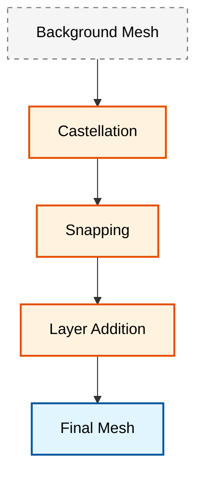

# โมดูล 07: ยูทิลิตี้ของ OpenFOAM และการทำงานอัตโนมัติ (OpenFOAM Utilities & Workflow Automation)

## 📋 บทสรุปผู้บริหาร (Executive Summary)

โมดูลนี้จัดทำขึ้นเพื่อฝึกอบรมอย่างครอบคลุมในระบบนิเวศยูทิลิตี้ที่กว้างขวางของ OpenFOAM และกลยุทธ์การทำงานอัตโนมัติ (workflow automation) ซึ่งช่วยให้สามารถจัดการกระบวนการทำงาน CFD ที่สมบูรณ์ได้อย่างมีประสิทธิภาพ ตั้งแต่การเตรียมเรขาคณิตไปจนถึงการประมวลผลภายหลังและการรายงานผลขั้นสูง

**จุดเน้นหลัก**: ขั้นตอนการทำงานจริง, การทำงานอัตโนมัติ และการบูรณาการกับตัวแก้สมการของ OpenFOAM สำหรับการประยุกต์ใช้งานทางวิศวกรรม

---

## 🎯 วัตถุประสงค์ของโมดูล (Module Objectives)

### เป้าหมายหลัก

**ความเชี่ยวชาญในยูทิลิตี้ของ OpenFOAM**
- ควบคุมยูทิลิตี้ของ OpenFOAM สำหรับการจัดการเมช, การตั้งค่ากรณีศึกษา และการประมวลผลภายหลัง
- พัฒนาความเชี่ยวชาญในยูทิลิตี้การเตรียมประมวลผล: `blockMesh`, `snappyHexMesh`, และเครื่องมือเตรียมพื้นผิว
- ดำเนินการคำนวณฟิลด์ขั้นสูงด้วย `foamCalc` และขั้นตอนการประมวลผลภายหลังแบบกำหนดเอง
- ใช้งานการตั้งค่าเงื่อนไขขอบเขตและการกำหนดค่าเริ่มต้นฟิลด์แบบอัตโนมัติ

**การทำงานอัตโนมัติและการบูรณาการ**
- สร้างท่อส่งข้อมูล (pipelines) ของ CFD แบบอัตโนมัติโดยใช้การเขียนสคริปต์ bash และการบูรณาการ Python
- พัฒนาเฟรมเวิร์กการศึกษาพารามิเตอร์และการออกแบบการทดลอง (DOE)
- บูรณาการ OpenFOAM กับระบบจัดการทรัพยากรบน HPC (เช่น SLURM, PBS) สำหรับการประมวลผลแบบกลุ่ม (batch processing)
- สร้างขั้นตอนการทำงานแบบครบวงจรตั้งแต่เรขาคณิตไปจนถึงรายงานทางวิศวกรรม

**การรับประกันคุณภาพและการเพิ่มประสิทธิภาพ**
- ใช้งานการประเมินคุณภาพเมชที่ครอบคลุมโดยใช้ตัวชี้วัดและการตรวจสอบอัตโนมัติ
- พัฒนาเฟรมเวิร์กการตรวจสอบความถูกต้องสำหรับข้อกำหนดเมชเฉพาะของแต่ละตัวแก้สมการ
- เพิ่มประสิทธิภาพขั้นตอนการทำงานสำหรับสภาพแวดล้อมการคำนวณสมรรถนะสูง (HPC)
- กำหนดแนวทางปฏิบัติที่ดีที่สุดสำหรับการจัดระเบียบโค้ดและการควบคุมเวอร์ชัน (version control)

### ผลลัพธ์ที่คาดหวัง

เมื่อจบหลักสูตรนี้ คุณจะแสดงให้เห็นถึงความเชี่ยวชาญในด้านต่างๆ ดังนี้:

- **การประมวลผลเรขาคณิต**: การแปลงรูปแบบ CAD, การซ่อมแซมเรขาคณิต และการเตรียมเมชที่พื้นผิว
- **การสร้างเมช**: การสร้างเมชแบบมีโครงสร้าง (structured) และไม่มีโครงสร้าง (unstructured) ด้วย `blockMesh`, `snappyHexMesh` และยูทิลิตี้เฉพาะทางอื่นๆ
- **การจัดการกรณีศึกษา**: การตั้งค่าเงื่อนไขขอบเขต, เงื่อนไขเริ่มต้น และการกำหนดค่าพารามิเตอร์ควบคุมตัวแก้ปัญหา
- **การทำงานอัตโนมัติ**: การเขียนสคริปต์สำหรับการประมวลผลแบบกลุ่ม, การศึกษาพารามิเตอร์ และการปรับปรุงขั้นตอนการทำงานให้เหมาะสมที่สุด
- **การประมวลผลภายหลัง**: การสกัดข้อมูลเชิงปริมาณ, การสร้างภาพกราฟิก และการรายงานผลทางวิศวกรรม
- **การบูรณาการ**: การเชื่อมต่อยูทิลิตี้กับตัวแก้ปัญหาแบบกำหนดเองและเครื่องมือจากภายนอก

---

## 📚 เส้นทางการเรียนรู้ (Learning Path)

### 🥉 พื้นฐาน: เครื่องมือจัดการเมชที่จำเป็น (Essential Mesh Tools)

#### 1. พื้นฐานของ blockMesh

**แนวคิดหลัก**

`blockMesh` เป็นยูทิลิตี้พื้นฐานของ OpenFOAM สำหรับสร้างเมชแบบมีโครงสร้างหกเหลี่ยม (hexahedral) จากการนิยามในไฟล์ `system/blockMeshDict` ยูทิลิตี้นี้ใช้วิธีการแบบอิงตามบล็อก โดยแบ่งโดเมนการคำนวณออกเป็นบล็อกหกเหลี่ยมหลายบล็อก ซึ่งแต่ละบล็อกกำหนดโดยจุดยอด (vertices) 8 จุด

**เทคนิคการปรับขนาดเซลล์ขั้นสูง (Advanced Grading Techniques)**

การปรับขนาดที่ขอบ (Edge grading) ช่วยให้สามารถกำหนดความละเอียดของเมชที่แปรผันได้ผ่านฟังก์ชันที่กำหนด รูปแบบการระบุการปรับขนาดมีดังนี้:

```cpp
// Edge grading syntax - Define curved edges using spline interpolation
edges
(
    spline 0 1
    (
        (0.0 0.0 0.0)
        (0.5 0.1 0.0)
        (1.0 0.0 0.0)
    )
);
```

> **📂 แหล่งที่มา:** OpenFOAM `applications/utilities/mesh/generation/blockMesh`
> 
> **คำอธิบาย (Explanation):**
> ไวยากรณ์นี้ใช้กำหนดเส้นบน (vertices) สองจุด โดยใช้การประมาณค่าแบบ spline เพื่อสร้างความลาดชันที่ไม่สม่ำเสมอของขนาดเซลล์ตามแนวเส้นขอบ
> 
> **แนวคิดสำคัญ (Key Concepts):**
> - **spline**: ฟังก์ชันการประมาณค่าเส้นโค้งที่ลื่นไหล
> - **0 1**: ดัชนีของจุดยอดเริ่มต้นและสิ้นสุดที่เชื่อมต่อกับเส้นโค้ง
> - **Point coordinates**: พิกัดจุดควบคุม (control points) ที่กำหนดรูปร่างของ spline

**ฟังก์ชันการปรับขนาด (Grading Functions)**
- **Linear grading**: ขนาดเซลล์เพิ่มขึ้นคงที่ตามลำดับ
- **Exponential grading**: ขนาดเซลล์เพิ่มขึ้นหรือลดลงตามฟังก์ชันเอกซ์โพเนนเชียล
- **Power law grading**: ขนาดเซลล์เป็นไปตามฟังก์ชัน $y = x^p$ โดยที่ $p$ คือพารามิเตอร์กำลัง

**รูปแบบโทโพโลยีเมช (Mesh Topology Patterns)**

```cpp
// O-grid topology for circular geometries - Define vertices for O-grid structure
vertices
(
    (0 0 0)           // จุดศูนย์กลาง
    (1 0 0)           // รัศมีด้านใน
    (2 0 0)           // รัศมีด้านนอก
    // ... จุดยอดเพิ่มเติม
);
```

> **📂 แหล่งที่มา:** OpenFOAM `applications/utilities/mesh/generation/blockMesh`
> 
> **คำอธิบาย (Explanation):**
> โครงสร้าง O-grid เป็นเทคนิคการสร้างเมชแบบโครงสร้างวงแหวนที่ล้อมรอบโดเมนหลัก ซึ่งเหมาะสำหรับเรขาคณิตแบบวงกลมหรือทรงกระบอก โดยจุดยอดแรกคือจุดศูนย์กลางและจุดถัดไปกำหนดรัศมีชั้นต่างๆ
> 
> **แนวคิดสำคัญ (Key Concepts):**
> - **O-grid topology**: โครงสร้างเมชวงแหวนที่ล้อมรอบโดเมนหลัก
> - **vertices**: จุดยอดที่กำหนดตำแหน่งในพื้นที่สามมิติ
> - **Center point**: จุดศูนย์กลางของโครงสร้าง O-grid
> - **Inner/Outer radius**: รัศมีชั้นในและชั้นนอกของโครงสร้าง

**ข้อควรพิจารณาเรื่องชั้นขอบเขต (Boundary Layer)**

เพื่อคุณภาพเมชในบริเวณชั้นขอบเขต การคำนวณความสูงของเซลล์แรกจะใช้ค่า $y^+$:

$$ y^+ = \frac{\rho u_\tau y}{\mu} $$

โดยที่ $u_\tau$ คือความเร็วเสียดทาน (friction velocity) คำนวณจาก:

$$ u_\tau = \sqrt{\frac{\tau_w}{\rho}} $$

#### 2. การเตรียมพื้นผิว (Surface Preparation)

**ข้อกำหนดของพื้นผิว**

เมชที่พื้นผิวที่มีคุณภาพจะต้องเป็นไปตามเงื่อนไขดังนี้:
- **ความเป็นระบบปิด (Watertightness)**: ไม่มีช่องว่างหรือรูในโครงสร้างสามเหลี่ยม
- **ความสอดคล้องของเวกเตอร์ปกติ (Normal consistency)**: เวกเตอร์ปกติของทุกหน้าผิวต้องชี้ออกด้านนอก
- **คุณภาพของรูปสามเหลี่ยม**: อัตราส่วนรูปร่าง (Aspect ratio) < 10 สำหรับบริเวณส่วนใหญ่
- **การรักษาคุณลักษณะ (Feature preservation)**: รักษาขอบและมุมที่แหลมคมไว้ได้

**ยูทิลิตี้ซ่อมแซมพื้นผิว**

```bash
# ตรวจสอบคุณภาพพื้นผิว - ยืนยันความสมบูรณ์และโทโพโลยี
surfaceCheck geometry.stl

# ดึงคุณลักษณะขอบแหลม - ระบุและสกัดขอบทางเรขาคณิต
surfaceFeatureExtract -angle 30 geometry.stl

# ทำให้พื้นผิวเรียบ - ลดความขรุขระและปรับปรุงคุณภาพ
surfaceSmoothFeatures geometry.stl
```

> **📂 แหล่งที่มา:** OpenFOAM `applications/utilities/surfaceHandling/surfaceCheck`, `applications/utilities/mesh/generation/surfaceFeatureExtract`
> 
> **คำอธิบาย (Explanation):**
> ชุดคำสั่งนี้ใช้ในกระบวนการเตรียมพื้นผิวก่อนการสร้างเมช โดยเริ่มจากการตรวจสอบคุณภาพ การดึงคุณลักษณะเชิงเรขาคณิต และการปรับปรุงความเรียบของพื้นผิว
> 
> **แนวคิดสำคัญ (Key Concepts):**
> - **surfaceCheck**: ตรวจสอบความสมบูรณ์ของพื้นผิว (watertightness)
> - **surfaceFeatureExtract**: ระบุและดึงคุณลักษณะเชิงเรขาคณิต เช่น ขอบแหลม
> - **-angle 30**: กำหนดมุมขั้นต่ำสำหรับการตรวจจับคุณลักษณะ (30 องศา)
> - **surfaceSmoothFeatures**: ปรับปรุงความเรียบของพื้นผิวเพื่อลดปัญหาการสร้างเมช

**ท่อส่งการแปลงรูปแบบไฟล์ (Format Conversion Pipeline)**


> **รูปที่ 1:** แผนภูมิแสดงขั้นตอนการแปลงรูปแบบไฟล์ (Format Conversion Pipeline) จากไฟล์ CAD ต้นฉบับผ่านมาตรฐาน STEP/IGES เข้าสู่รูปแบบ STL เพื่อเข้าสู่กระบวนการตรวจสอบคุณภาพและการซ่อมแซมก่อนการสร้างเมช

#### 3. การประเมินคุณภาพเมช (Mesh Quality Assessment)

**ตัวชี้วัดคุณภาพที่สำคัญ**

- **ความไม่ตั้งฉาก (Non-orthogonality)**: $\theta = \cos^{-1}\left(\frac{\mathbf{n}_f \cdot \mathbf{d}_{PN}}{|\mathbf{n}_f| \cdot |\mathbf{d}_{PN}|}\right)$
  - เป้าหมาย: < 70° สำหรับ CFD ทั่วไป
  - เป้าหมาย: < 40° สำหรับแบบจำลองความปั่นป่วนที่ซับซ้อน

- **อัตราส่วนรูปร่าง (Aspect Ratio)**: $AR = \frac{h_{max}}{h_{min}}$
  - เป้าหมาย: < 1000 สำหรับการประยุกต์ใช้งานทั่วไป
  - เป้าหมาย: < 100 สำหรับบริเวณชั้นขอบเขต

- **ความเบ้ (Skewness)**: $\text{skewness} = \frac{|\mathbf{C} - \mathbf{C}_{ideal}|}{|\mathbf{C}_{PF} - \mathbf{C}_{ideal}|}$
  - เป้าหมาย: < 4 สำหรับตัวแก้ปัญหาส่วนใหญ่
  - เป้าหมาย: < 2 สำหรับการจำลองที่ต้องการความแม่นยำสูง

- **อัตราส่วนการขยาย (Expansion Ratio)**: การเปลี่ยนแปลงขนาดเซลล์เฉพาะที่
  - เป้าหมาย: < 1.3 สำหรับ CFD ทั่วไป
  - เป้าหมาย: < 1.1 สำหรับบริเวณชั้นขอบเขต

**การตรวจสอบคุณภาพอัตโนมัติ**

```bash
# วิเคราะห์เมชอย่างครอบคลุม - ตรวจสอบเรขาคณิตและโทโพโลยีทั้งหมด
checkMesh -allGeometry -allTopology -time 0

# ตรวจสอบเฉพาะตัวชี้วัดคุณภาพ - เน้นที่พารามิเตอร์คุณภาพเมช
checkMesh -meshQuality

# รายงานรายละเอียดพร้อมเกณฑ์ที่กำหนด - สร้างรายงานคุณภาพโดยละเอียด
checkMesh -allRegions -writeFields
```

> **📂 แหล่งที่มา:** OpenFOAM `applications/utilities/mesh/manipulation/checkMesh`
> 
> **คำอธิบาย (Explanation):**
> เครื่องมือ checkMesh ใช้วิเคราะห์คุณภาพของเมชโดยตรวจสอบทั้งโครงสร้างเรขาคณิตและโทโพโลยี พร้อมทั้งสร้างรายงานคุณภาพและฟิลด์ข้อมูลสำหรับการวิเคราะห์เพิ่มเติม
> 
> **แนวคิดสำคัญ (Key Concepts):**
> - **-allGeometry**: ตรวจสอบคุณสมบัติเรขาคณิตทั้งหมดของเมช
> - **-allTopology**: ตรวจสอบโครงสร้างโทโพโลยี เช่น การเชื่อมต่อของเซลล์
> - **-time 0**: ตรวจสอบเมชที่เวลา t=0 (เมชเริ่มต้น)
> - **-meshQuality**: แสดงเฉพาะตัวชี้วัดคุณภาพเมช
> - **-writeFields**: เขียนฟิลด์คุณภาพลงไฟล์สำหรับการวิเคราะห์เชิงลึก

### 🏦 ระดับกลาง: ขั้นตอนการสร้างเมชขั้นสูง (Advanced Meshing Workflows)

#### 1. ความเชี่ยวชาญใน snappyHexMesh

**กระบวนการทำงานสามระยะ**


> **รูปที่ 2:** กระบวนการทำงาน 3 ขั้นตอนหลักของ `snappyHexMesh` ประกอบด้วยขั้นตอนการสร้างเมชแบบ Castellated การปรับพื้นผิวให้แนบชิด (Snapping) และการเพิ่มชั้นขอบเขต (Layer Addition) เพื่อให้ได้เมชสุดท้ายที่สมบูรณ์

**ระยะ Castellation**

```cpp
// snappyHexMeshDict - ส่วนควบคุม Castellation
// แปลงเมชพื้นหลังเป็นเมชแบบ castellated พร้อมการปรับความละเอียด
castellatedMesh true;
cestellatedMeshControls
{
    // จำนวนเซลล์สูงสุดที่อนุญาตในระดับท้องถิ่นและโดเมนรวม
    maxLocalCells        1000000;
    maxGlobalCells       20000000;
    
    // จำนวนเซลล์ขั้นต่ำที่จะกระตุ้นการปรับความละเอียด
    minRefinementCells   10;

    // จำนวนเซลล์ระหว่างระดับการปรับความละเอียด
    nCellsBetweenLevels  3;

    // ขอบคุณลักษณะเพื่อรักษาเรขาคณิต
    features
    (
        {
            file "geometry.eMesh";
            level 2;
        }
    );

    // การตั้งค่าการปรับความละเอียดที่พื้นผิว
    refinementSurfaces
    {
        geometry
        {
            // ระดับการปรับความละเอียดสำหรับพื้นผิวและภูมิภาค
            level (2 2);
            patchInfo
            {
                type wall;
            }
        }
    }

    // มุมขั้นต่ำสำหรับการตรวจจับคุณลักษณะ
    resolveFeatureAngle 30;
}
```

> **📂 แหล่งที่มา:** OpenFOAM `.applications/utilities/mesh/generation/snappyHexMesh`
> 
> **คำอธิบาย (Explanation):**
> ขั้นตอน Castellation เป็นการแปลงเมชพื้นหลังให้เป็นเมชแบบ castellated ที่มีการ refine ตามรูปทรงเรขาคณิต โดยใช้การควบคุมจำนวนเซลล์และระดับการ refine สำหรับพื้นผิวและคุณลักษณะเชิงเรขาคณิต
> 
> **แนวคิดสำคัญ (Key Concepts):**
> - **castellatedMesh**: เปิดใช้งานขั้นตอนการสร้างเมชแบบ castellated
> - **maxLocalCells/maxGlobalCells**: จำกัดจำนวนเซลล์สูงสุดเพื่อควบคุมหน่วยความจำ
> - **refinementSurfaces**: กำหนดระดับการ refine สำหรับแต่ละพื้นผิว
> - **resolveFeatureAngle**: มุมขั้นต่ำสำหรับการตรวจจับคุณลักษณะเชิงเรขาคณิต

**ระยะ Snapping**

```cpp
// ส่วนควบคุม Snapping - เลื่อนจุดยอดของเมชไปยังเรขาคณิตพื้นผิว
snapControls
{
    // จำนวนรอบการทำให้แพตช์เรียบ
    nSmoothPatch       3;
    
    // ค่าความคลาดเคลื่อนในการ snap เข้าหาพื้นผิว
    tolerance          2.0;
    
    // รอบการวนซ้ำของตัวแก้ปัญหาสำหรับการผ่อนคลาย
    nSolveIter         30;
    nRelaxIter         5;

    // รอบการวนซ้ำของการ snap คุณลักษณะ
    nFeatureSnapIter   10;
    
    // ใช้การ snap คุณลักษณะแบบ implicit
    implicitFeatureSnap false;
    
    // เปิดใช้งานการ snap คุณลักษณะแบบหลายภูมิภาค
    multiRegionFeatureSnap true;
}
```

> **📂 แหล่งที่มา:** OpenFOAM `.applications/utilities/mesh/generation/snappyHexMesh`
> 
> **คำอธิบาย (Explanation):**
> ขั้นตอน Snapping ทำหน้าที่ปรับจุดยอดของเมชให้แนบชิดกับพื้นผิวเรขาคณิต โดยใช้กระบวนการทางคณิตศาสตร์เพื่อให้ได้ความแม่นยำสูง
> 
> **แนวคิดสำคัญ (Key Concepts):**
> - **nSmoothPatch**: จำนวนรอบการปรับปรุงความเรียบของ patch
> - **tolerance**: ค่าความอดทนในการย้ายจุดยอดไปยังพื้นผิว
> - **implicitFeatureSnap**: การ snap แบบ implicit สำหรับคุณลักษณะเชิงเรขาคณิต

**ระยะการเพิ่มชั้น (Layer Addition Stage)**

```cpp
// ส่วนควบคุมการเพิ่มชั้น - เพิ่มเซลล์ชั้นขอบเขต
addLayersControls
{
    // ใช้การคำนวณขนาดสัมพัทธ์
    relativeSizes true;

    // กำหนดชั้นสำหรับแพตช์เฉพาะ
    layers
    {
        "geometry.*"
        {
            nSurfaceLayers 3;
        }
    }

    // พารามิเตอร์การขยายชั้น
    expansionRatio      1.3;
    finalLayerThickness 0.3;
    minThickness        0.1;
    
    // การควบคุมการเติบโตของชั้น
    nGrow               1;

    // มุมคุณลักษณะสำหรับการสิ้นสุดชั้น
    featureAngle        60;
    
    // รอบการวนซ้ำของการทำให้เรียบ
    nRelaxIter          3;
    nSmoothSurfaceNormals 3;
    nSmoothNormals      3;
}
```

> **📂 แหล่งที่มา:** OpenFOAM `.applications/utilities/mesh/generation/snappyHexMesh`
> 
> **คำอธิบาย (Explanation):**
> ขั้นตอน Layer Addition เพิ่มชั้นเซลล์บริเวณขอบเขตเพื่อให้ได้ความละเอียดที่เหมาะสมในบริเวณชั้นขอบเขต โดยควบคุมอัตราส่วนการขยายและความหนาของชั้น
> 
> **แนวคิดสำคัญ (Key Concepts):**
> - **nSurfaceLayers**: จำนวนชั้นเซลล์ที่เพิ่มบนพื้นผิว
> - **expansionRatio**: อัตราส่วนการขยายของขนาดเซลล์ระหว่างชั้น
> - **finalLayerThickness**: ความหนาสัมพัทธ์ของชั้นสุดท้าย
> - **featureAngle**: มุมที่ชั้นเซลล์จะสิ้นสุด

#### 2. การประกอบโดเมนแบบหลายบล็อก (Multi-Block Domain Assembly)

**การวางแผนโทโพโลยีบล็อก**

```cpp
// ตัวอย่างการกำหนดค่าหลายบล็อก - ประกอบบล็อกเมชหลายบล็อก
blocks
(
    // บล็อก 1: ภูมิภาคทางเข้า
    hex (0 1 2 3 4 5 6 7) (100 50 1) simpleGrading (1 1 1)

    // บล็อก 2: โดเมนหลัก
    hex (8 9 10 11 12 13 14 15) (200 100 1) simpleGrading (1 1 1)

    // บล็อก 3: ภูมิภาคทางออก
    hex (16 17 18 19 20 21 22 23) (100 50 1) simpleGrading (1 1 1)
);

// การเชื่อมต่อขอบเขต - รวมแพตช์ระหว่างบล็อก
mergePatchPairs
(
    (
        block1_outlet
        block2_inlet
    )
    (
        block2_outlet
        block3_inlet
    )
);
```

> **📂 แหล่งที่มา:** OpenFOAM `applications/utilities/mesh/generation/blockMesh`
> 
> **คำอธิบาย (Explanation):**
> การกำหนดค่าหลายบล็อกช่วยให้สามารถสร้างโดเมนที่ซับซ้อนได้โดยการแบ่งเป็นบล็อกย่อยที่เชื่อมต่อกัน พร้อมทั้งระบุจุดประสานระหว่างบล็อก
> 
> **แนวคิดสำคัญ (Key Concepts):**
> - **hex**: ประกาศบล็อก hexahedral พร้อมพิกัดจุดยอดและการแบ่งเซลล์
> - **simpleGrading**: กำหนดอัตราส่วนการขยายของขนาดเซลล์
> - **mergePatchPairs**: ระบุ patch ที่จะเชื่อมต่อระหว่างบล็อก

#### 3. กลยุทธ์การปรับความละเอียดแบบปรับตัว (Adaptive Refinement Strategies)

**การปรับความละเอียดตามผลเฉลย (Solution-Adaptive Refinement)**

```cpp
// dynamicRefineFvMeshDict สำหรับการปรับตัวขณะรันโปรแกรม
dynamicFvMesh dynamicRefineFvMesh;

refiner
{
    // ช่วงเวลาการปรับความละเอียดในหน่วยก้าวเวลา
    refineInterval  5;
    
    // ฟิลด์ที่จะติดตามเพื่อปรับความละเอียด
    field           alpha.water;
    
    // เกณฑ์การปรับความละเอียด
    lowerRefineLevel 0.3;
    upperRefineLevel 0.7;
    nRefineIterations 1;
    
    // ระดับการปรับความละเอียดและจำนวนเซลล์สูงสุด
    maxRefinement  4;
    maxCells       2000000;
}
```

> **📂 แหล่งที่มา:** OpenFOAM `applications/solvers/multiphase/interDynFoam`
> 
> **คำอธิบาย (Explanation):**
> การ refine แบบปรับตามผลเฉลย (solution-adaptive) ช่วยให้สามารถปรับความละเอียดของเมชตามค่าของฟิลด์ที่กำลังคำนวณในขณะทำงานจริง
> 
> **แนวคิดสำคัญ (Key Concepts):**
> - **dynamicFvMesh**: ประเภทของเมชแบบ dynamic
> - **refineInterval**: รอบเวลาที่มีการ refine
> - **lower/upperRefineLevel**: ช่วงค่าที่จะ trigger การ refine

**การปรับความละเอียดตามตัวบ่งชี้ข้อผิดพลาด (Error Indicator-Based Refinement)**

$$ \epsilon = \left| \nabla \phi \right| \cdot h^2 $$

โดยที่ $\phi$ คือตัวแปรฟิลด์ และ $h$ คือขนาดเซลล์เฉพาะที่

### 🚀 ขั้นสูง: การประยุกต์ใช้งานเฉพาะทาง (Specialized Applications)

#### 1. การสร้างเมชสำหรับการประยุกต์ใช้งานเฉพาะ

**O-Grid สำหรับเครื่องจักรเทอร์โบ (Turbomachinery O-Grid)**

```cpp
// โทโพโลยี O-grid สำหรับเครื่องจักรหมุน
blocks
(
    // บล็อก O-grid พร้อมการปรับขนาดขอบโค้ง
    hex (0 1 2 3 4 5 6 7) (200 80 1) edgeGrading (1 1 1 1 4 4 1 1 1 1 4 4)

    // บล็อก H-grid สำหรับทางเข้า/ทางออก
    hex (8 9 10 11 12 13 14 15) (50 20 1) simpleGrading (1 1 1)
);
```

> **📂 แหล่งที่มา:** OpenFOAM `applications/utilities/mesh/generation/blockMesh`
> 
> **คำอธิบาย (Explanation):**
> โครงสร้าง O-grid สำหรับเครื่องจักรหมุนใช้ grading แบบโค้งเพื่อให้ได้ความละเอียดที่เหมาะสมในบริเวณใกล้ใบพัด
> 
> **แนวคิดสำคัญ (Key Concepts):**
> - **edgeGrading**: กำหนด grading แบบโค้งสำหรับขอบโค้ง
> - **O-grid block**: บล็อกโครงสร้างวงแหวนสำหรับการหมุน

**การคำนวณ $y^+$ ของชั้นขอบเขต**

$$ y = \frac{y^+ \mu}{\rho u_\tau}, \quad u_\tau = U_\infty \sqrt{\frac{C_f}{2}} $$

สำหรับชั้นขอบเขตแบบปั่นป่วน:
$$ C_f \approx 0.0592 \cdot Re_x^{-0.2} $$

#### 2. การสร้างเมชแบบพลวัต (Dynamic Meshing)

**การกำหนดค่าตัวแก้การเคลื่อนที่ (Motion Solver Configuration)**

```cpp
// dynamicMeshDict - กำหนดค่าตัวแก้การเคลื่อนที่ของเมช
dynamicFvMesh   dynamicMotionSolverFvMesh;

motionSolverLibs ("libfvMotionSolvers.so");

solver          displacementLaplacian;

displacementLaplacianCoeffs
{
    diffusivity uniform 1;
}
```

> **📂 แหล่งที่มา:** OpenFOAM `applications/solvers/multiphase/interDyMFoam`
> 
> **คำอธิบาย (Explanation):**
> การกำหนดค่า motion solver สำหรับเมชแบบ dynamic ที่สามารถเคลื่อนที่ได้ตามเวลา เช่น ในปัญหา FSI
> 
> **แนวคิดสำคัญ (Key Concepts):**
> - **dynamicMotionSolverFvMesh**: ประเภทของเมชที่รองรับการเคลื่อนไหว
> - **displacementLaplacian**: วิธีการคำนวณการกระจายการเคลื่อนที่
> - **diffusivity**: ค่าสัมประสิทธิ์การกระจาย

#### 3. การสร้างเมชสำหรับการไหลหลายเฟส (Multi-Phase Meshing)

**ข้อกำหนดความละเอียดที่ส่วนต่อประสาน (Interface Resolution Requirements)**

$$ \Delta x < \frac{\sigma}{\rho U^2} $$

โดยที่ $\sigma$ คือแรงตึงผิว, $\rho$ คือความหนาแน่น และ $U$ คือความเร็วลักษณะเฉพาะ

**การติดตามส่วนต่อประสานแบบปรับตัว (Adaptive Interface Tracking)**

```cpp
// การตั้งค่าการปรับความละเอียดที่ส่วนต่อประสาน
refinementSurfaces
{
    interface
    {
        // ความละเอียดสูงสำหรับส่วนต่อประสาน
        level (4 4);
        
        // กำหนดโซนเซลล์และหน้าผิว
        cellZone interface;
        faceZone interface;
    }
}
```

> **📂 แหล่งที่มา:** OpenFOAM `.applications/utilities/mesh/generation/snappyHexMesh`
> 
> **คำอธิบาย (Explanation):**
> การ refine แบบปรับตาม interface ช่วยให้ได้ความละเอียดสูงบริเวณพื้นผิวระหว่างเฟสในปัญหา multiphase
> 
> **แนวคิดสำคัญ (Key Concepts):**
> - **refinementSurfaces**: กำหนดระดับการ refine สำหรับพื้นผิว interface
> - **cellZone/faceZone**: กำหนดโซนของเซลล์และหน้าผิวสำหรับ interface

---

## 🛠️ ผลลัพธ์ทางเทคนิค (Technical Outcomes)

### 1. การสร้างและจัดการเมชขั้นสูง

**เมชแบบมีโครงสร้างด้วย blockMesh**
- เชี่ยวชาญไวยากรณ์ของ `blockMeshDict` และการนิยามโทโพโลยี
- สร้างเมชแบบมีโครงสร้างหลายบล็อกสำหรับเรขาคณิตที่ซับซ้อน
- ใช้งานฟังก์ชันการปรับขนาดสำหรับการระบุความละเอียดชั้นขอบเขต
- ประยุกต์ใช้การปรับขนาดขอบขั้นสูงและการควบคุมความหนาแน่นเซลล์ตามความโค้ง
- สร้างเมชแบบ Conformal ที่มีการเชื่อมต่อที่สอดคล้องกัน

**เมชแบบไม่มีโครงสร้างด้วย snappyHexMesh**
- กำหนดค่าการสร้างเมชตามพื้นผิวรอบเรขาคณิต STL/OBJ
- ใช้งานการปรับความละเอียดเมชหลายระดับตามคุณลักษณะทางเรขาคณิต
- เพิ่มประสิทธิภาพคุณภาพเซลล์ผ่านกระบวนการเพิ่มชั้นและการ snap
- ควบคุมระดับการปรับความละเอียดสำหรับภูมิภาคที่สนใจ
- สร้างเมชชั้นขอบเขตคุณภาพสูงพร้อมค่า $y^+$ ที่เหมาะสม

### 2. การทำงานอัตโนมัติและการปรับปรุงขั้นตอนการทำงานให้เหมาะสม

**ขั้นตอนการสร้างเมชอัตโนมัติ**

```bash
#!/bin/bash
# ขั้นตอนการสร้างเมชอัตโนมัติ - ประมวลผลเรขาคณิตหลายรายการ
for geom in geometries/*.stl; do
    case_name=$(basename "$geom" .stl)
    mkdir -p "cases/$case_name"
    cp mesh_template/* "cases/$case_name/"

    # สกัดคุณลักษณะพื้นผิว
    surfaceFeatureExtract -case "cases/$case_name" "geometries/$case_name.stl"

    # รันกระบวนการสร้างเมช
    blockMesh -case "cases/$case_name"
    snappyHexMesh -case "cases/$case_name" -overwrite

    # ตรวจสอบคุณภาพ
    checkMesh -case "cases/$case_name" > "cases/$case_name/mesh_quality.txt"
done
```

> **📂 แหล่งที่มา:** OpenFOAM Workflow Automation
> 
> **คำอธิบาย (Explanation):**
> สคริปต์นี้ทำให้สามารถประมวลผลหลาย geometry ได้อัตโนมัติ โดยสร้าง case แยกสำหรับแต่ละ geometry และดำเนินการตาม workflow ที่กำหนด
> 
> **แนวคิดสำคัญ (Key Concepts):**
> - **for loop**: วนลูปผ่านไฟล์ STL ทั้งหมด
> - **surfaceFeatureExtract**: ดึงคุณลักษณะเชิงเรขาคณิตจากพื้นผิว
> - **blockMesh/snappyHexMesh**: สร้างเมชตามลำดับ
> - **checkMesh**: ตรวจสอบคุณภาพของเมช

**การประมวลผลแบบกลุ่มสำหรับการศึกษาพารามิเตอร์**
- ใช้งานการกวาดพารามิเตอร์ (parameter sweeps) พร้อมการสร้างกรณีศึกษาอัตโนมัติ
- สร้างขั้นตอนการประมวลผลแบบขนานสำหรับสภาพแวดล้อม HPC
- พัฒนาสคริปต์แบบกำหนดเองสำหรับการเปลี่ยนแปลงเรขาคณิตอย่างเป็นระบบ
- บูรณาการกับระบบจัดการงาน (เช่น SLURM, PBS) สำหรับการศึกษาสเกลใหญ่

**การบูรณาการ CAD และการประมวลผลเรขาคณิต**
- ทำให้การแปลงไฟล์ CAD และการเตรียมประมวลผลเป็นแบบอัตโนมัติ
- ใช้งานขั้นตอนการล้างข้อมูลและซ่อมแซมเรขาคณิต
- สร้างสคริปต์การสร้างเรขาคณิตแบบพารามิเตอร์
- บูรณาการกับ API ของซอฟต์แวร์ CAD เพื่อขั้นตอนการทำงานที่ลื่นไหล

### 3. การประเมินคุณภาพที่ครอบคลุม

**ท่อส่งการควบคุมคุณภาพอัตโนมัติ**

```python
# สคริปต์ Python สำหรับการประเมินคุณภาพเมชอัตโนมัติ
import numpy as np
import pandas as pd
import re

def extract_metric(content, metric_name):
    """สกัดค่าตัวชี้วัดจากผลลัพธ์ของ checkMesh"""
    pattern = rf"{metric_name}.*?([\d.]+)"
    match = re.search(pattern, content)
    return float(match.group(1)) if match else None

def calculate_quality_score(orthogonality, aspect_ratio, skewness):
    """คำนวณคะแนนคุณภาพแบบรวม"""
    # ตัวชี้วัดคุณภาพแบบถ่วงน้ำหนัก
    w_ortho = 0.4
    w_aspect = 0.3
    w_skew = 0.3

    # ปรับให้เป็นมาตรฐาน (ค่าน้อยกว่าดีกว่าสำหรับทุกตัวชี้วัด)
    score = (w_ortho * orthogonality / 70.0 +
             w_aspect * aspect_ratio / 1000.0 +
             w_skew * skewness / 4.0)
    return min(score, 1.0)  # จำกัดไว้ที่ 1.0

def assess_mesh_quality(case_path):
    # วิเคราะห์ผลลัพธ์จาก checkMesh
    with open(f"{case_path}/mesh_quality.txt", 'r') as f:
        content = f.read()

    # สกัดตัวชี้วัดหลัก
    orthogonality = extract_metric(content, "Non-orthogonality")
    aspect_ratio = extract_metric(content, "Aspect ratio")
    skewness = extract_metric(content, "Skewness")

    # การจำแนกประเภทคุณภาพ
    quality_score = calculate_quality_score(orthogonality, aspect_ratio, skewness)

    return {
        'case': case_path,
        'orthogonality': orthogonality,
        'aspect_ratio': aspect_ratio,
        'skewness': skewness,
        'quality_score': quality_score
    }
```

> **📂 แหล่งที่มา:** OpenFOAM Python Integration
> 
> **คำอธิบาย (Explanation):**
> สคริปต์ Python นี้ทำให้สามารถประเมินคุณภาพของเมชอัตโนมัติ โดยอ่านผลลัพธ์จาก checkMesh และคำนวณคะแนนคุณภาพแบบรวม
> 
> **แนวคิดสำคัญ (Key Concepts):**
> - **extract_metric**: ดึงค่าตัวชี้วัดจาก output ของ checkMesh
> - **calculate_quality_score**: คำนวณคะแนนคุณภาพแบบถ่วงน้ำหนัก
> - **assess_mesh_quality**: ฟังก์ชันหลักสำหรับประเมินคุณภาพ

### 4. การพัฒนายูทิลิตี้แบบกำหนดเอง (Custom Utility Development)

**เทมเพลตยูทิลิตี้ OpenFOAM แบบกำหนดเอง**

```cpp
// ยูทิลิตี้กำหนดเอง: meshStatisticsGenerator.C
// สร้างสถิติเมชที่ครอบคลุมสำหรับการประเมินคุณภาพ
#include "fvMesh.H"
#include "volFields.H"
#include "surfaceFields.H"
#include "OFstream.H"

using namespace Foam;

int main(int argc, char *argv[])
{
    // เริ่มต้นสภาพแวดล้อม OpenFOAM
    #include "setRootCase.H"
    #include "createTime.H"
    #include "createMesh.H"

    Info << "Calculating mesh statistics..." << endl;

    // คำนวณสถิติเมช
    const fvPatchList& patches = mesh.boundary();
    label nCells = mesh.nCells();
    label nFaces = mesh.nFaces();
    label nPoints = mesh.nPoints();
    label nInternalFaces = mesh.nInternalFaces();

    // แสดงผลสถิติโดยละเอียด
    OFstream outFile("meshStatistics.txt");
    outFile << "Mesh Statistics:" << nl
            << "  Cells: " << nCells << nl
            << "  Faces: " << nFaces << nl
            << "  Internal Faces: " << nInternalFaces << nl
            << "  Boundary Faces: " << (nFaces - nInternalFaces) << nl
            << "  Points: " << nPoints << nl
            << "  Patches: " << patches.size() << nl;

    // คำนวณตัวชี้วัดคุณภาพ
    scalar maxNonOrthog = 0.0;
    scalar maxSkewness = 0.0;

    // ... ส่วนการประเมินคุณภาพ

    outFile << "\nQuality Metrics:" << nl
            << "  Max Non-orthogonality: " << maxNonOrthog << nl
            << "  Max Skewness: " << maxSkewness << nl;

    Info << "Mesh statistics generated successfully" << endl;
    return 0;
}
```

> **📂 แหล่งที่มา:** การพัฒนายูทิลิตี้ OpenFOAM แบบกำหนดเอง
> 
> **คำอธิบาย (Explanation):**
> อรรถานุทค์ custom utility นี้สร้างสถิติที่ครอบคลุมของเมชเพื่อการประเมินคุณภาพ โดยรวบรวมข้อมูลพื้นฐานและตัวชี้วัดคุณภาพ
> 
> **แนวคิดสำคัญ (Key Concepts):**
> - **fvMesh**: คลาสเมชที่ใช้ใน OpenFOAM
> - **nCells/nFaces/nPoints**: จำนวนเซลล์ หน้า และจุดของเมช
> - **maxNonOrthog/maxSkewness**: ค่าตัวชี้วัดคุณภาพสูงสุด
> - **OFstream**: คลาสสำหรับเขียนไฟล์ output

**การคอมไพล์และการใช้งาน**

```bash
# คอมไพล์ยูทิลิตี้กำหนดเอง
wmake

# รันกับกรณีศึกษา
meshStatisticsGenerator -case <ไดเรกทอรีกรณีศึกษา>
```

---

## 🎯 การบูรณาการโมดูล (Module Integration)

### เงื่อนไขเบื้องต้น (Prerequisites)

ก่อนเริ่มโมดูลนี้ โปรดตรวจสอบให้แน่ใจว่าได้เรียนรู้สิ่งต่อไปนี้แล้ว:

**โมดูลที่จำเป็น**
- [x] **โมดูล 03**: พื้นฐานการสร้างเมชและเรขาคณิต
- [x] **โมดูล 04**: การพัฒนาตัวแก้ปัญหาเบื้องต้น (การใช้งาน SIMPLE/PISO)

**ทักษะทางเทคนิค**
- **คำสั่ง OpenFOAM**: ความเชี่ยวชาญใน `blockMesh`, `snappyHexMesh`, `refineMesh`, `checkMesh`
- **การเขียนสคริปต์**: การเขียนสคริปต์ BASH/Python สำหรับการทำงานอัตโนมัติ
- **ซอฟต์แวร์ CAD**: ความคุ้นเคยกับซอฟต์แวร์ CAD และรูปแบบไฟล์พื้นฐาน
- **เครื่องมือบรรทัดคำสั่ง**: ความคล่องแคล่วในการใช้ `grep`, `awk`, `sed` และยูทิลิตี้จัดการข้อความ
- **การจัดการไฟล์ I/O**: ความเข้าใจในรูปแบบไฟล์และโครงสร้างข้อมูลของ OpenFOAM

### ลำดับการเรียนรู้ที่แนะนำ

#### ระยะพื้นฐาน
1. เชี่ยวชาญพื้นฐานและโทโพโลยีของ `blockMesh`
2. พัฒนาทักษะการเตรียมพื้นผิวและการซ่อมแซม
3. ใช้งานขั้นตอนการประเมินคุณภาพเมช

#### ระยะกลาง
1. เชี่ยวชาญ `snappyHexMesh` สำหรับเรขาคณิตที่ซับซ้อน
2. เรียนรู้การประกอบโดเมนแบบหลายบล็อก
3. พัฒนากลยุทธ์การปรับความละเอียดอย่างเป็นระบบ
4. ใช้งานเทคนิคการปรับปรุงคุณภาพขั้นสูง

#### ระยะสูง
1. การสร้างเมชสำหรับการประยุกต์ใช้งาน CFD เฉพาะทาง
2. เมชแบบพลวัตสำหรับการประยุกต์ใช้งาน FSI
3. ข้อกำหนดเมชสำหรับการไหลหลายเฟส
4. ข้อควรพิจารณาสำหรับตัวแก้ปัญหาที่เร่งด้วย GPU

---

## 📊 โครงสร้างโมดูล (Module Structure)

### ไลบรารียูทิลิตี้ (`examples/`)

จัดระเบียบตามขอบเขตงาน:
- **การเตรียมเมช**: ขั้นตอนการสร้างเมชขั้นสูงสำหรับเรขาคณิตซับซ้อน
- **การตั้งค่าตัวแก้ปัญหา**: การศึกษาพารามิเตอร์และการสร้างกรณีศึกษาอัตโนมัติ
- **เงื่อนไขขอบเขต**: เครื่องมืออัตโนมัติสำหรับเงื่อนไขขอบเขต
- **การประมวลผลภายหลัง**: การวิเคราะห์ฟิลด์, การคำนวณแรง และการสร้างภาพ
- **การประมวลผลแบบขนาน**: เครื่องมือสำหรับ HPC และการทำงานแบบกลุ่ม
- **หลายเฟส**: การกำหนดค่าแบบจำลองเฟสและการวิเคราะห์เฉพาะทาง
- **เครื่องมือพัฒนา**: การดีบั๊ก C++, การวิเคราะห์ประสิทธิภาพ และเฟรมเวิร์กการทดสอบ

### ระบบขั้นตอนการทำงาน (`workflows/`)

การประสานงานขั้นตอนการทำงานแบบครบวงจร รวมถึง:
- **ขั้นตอนการทำงาน CFD ที่สมบูรณ์**: ตั้งแต่เรขาคณิตไปจนถึงผลลัพธ์พร้อมการเพิ่มประสิทธิภาพอัตโนมัติ
- **จากเมชสู่ตัวแก้ปัญหา**: การเตรียมเมชที่บูรณาการกับการตรวจสอบความถูกต้องของตัวแก้ปัญหา
- **ท่อส่งการประมวลผลภายหลัง**: ขั้นตอนการวิเคราะห์และการรายงานผลแบบบูรณาการ

### การเรียนรู้แบบก้าวหน้า (`tutorials/`)

บทเรียนที่มีโครงสร้างตั้งแต่ระดับเริ่มต้นจนถึงผู้เชี่ยวชาญ:
- **ระดับเริ่มต้น**: การสร้างเมชพื้นฐาน, ตัวแก้ปัญหาอย่างง่าย, การดำเนินการเบื้องต้น
- **ระดับกลาง**: เรขาคณิตที่ซับซ้อน, การสร้างเมชด้วย snappyHexMesh ขั้นสูง
- **ระดับสูง**: การไหลแบบปั่นป่วน, การถ่ายโอนความร้อนแบบคอนจูเกต, เมชที่เคลื่อนที่ได้
- **ระดับผู้เชี่ยวชาญ**: การพัฒนาตัวแก้ปัญหา, การเร่งความเร็วด้วย GPU, ฟิสิกส์เฉพาะทาง

---

## 🔧 คุณสมบัติเด่น (Key Features)

### การออกแบบที่เน้นการทำงานอัตโนมัติเป็นอันดับแรก (Automation-First Design)

ยูทิลิตี้และขั้นตอนการทำงานทั้งหมดถูกออกแบบมาโดยมีประสิทธิภาพการทำงานอัตโนมัติเป็นความต้องการหลัก เพื่อลดการแทรกแซงด้วยตนเองและข้อผิดพลาดจากมนุษย์

### สถาปัตยกรรมที่ขยายขนาดได้ (Scalable Architecture)

เครื่องมือต่างๆ สามารถขยายขนาดได้ตั้งแต่ CFD บนเดสก์ท็อปไปจนถึงคลัสเตอร์ HPC และสภาพแวดล้อมระบบคลาวด์ พร้อมความสามารถในการทำงานแบบขนานและเพิ่มประสิทธิภาพในตัว

### ครอบคลุมตั้งแต่ต้นจนจบ (End-to-End Coverage)

ตั้งแต่การนำเข้า CAD เริ่มต้น, การสร้างเมช, การรันตัวแก้ปัญหา, การประมวลผลภายหลัง ไปจนถึงการรายงานผลและการจัดทำเอกสารขั้นสุดท้าย

### พร้อมสำหรับการบูรณาการ (Integration-Ready)

ออกแบบมาเพื่อการบูรณาการกับเครื่องมือภายนอก, ฐานข้อมูล และบริการต่างๆ รวมถึงซอฟต์แวร์ CAD, แพลตฟอร์มคลาวด์ และระบบการติดตามตรวจสอบ

---

## 🎓 มาตรฐานวิชาชีพ (Professional Standards)

### เอกสารประกอบโค้ด

- ปฏิบัติตามแนวทางการจัดทำเอกสารของ OpenFOAM
- รักษาการเขียนคอมเมนต์ในบรรทัด (inline comments) อย่างครอบคลุม
- จัดทำตัวอย่างการใช้งานสำหรับยูทิลิตี้ที่กำหนดเองทั้งหมด
- จัดทำเอกสารสำหรับพารามิเตอร์อินพุตและผลลัพธ์ที่คาดหวัง

### แนวทางปฏิบัติที่ดีที่สุดในอุตสาหกรรม

- ขั้นตอนการทำงานการควบคุมเวอร์ชันสำหรับโครงการ CFD
- เฟรมเวิร์กการทดสอบและการตรวจสอบความถูกต้องอัตโนมัติ
- กระบวนการรีวิวโค้ดสำหรับยูทิลิตี้ที่กำหนดเอง
- แนวทางปฏิบัติสำหรับการวิจัยที่ทำซ้ำได้

### การรับประกันคุณภาพ

- ตัวชี้วัดคุณภาพเมชและเกณฑ์การยอมรับ
- เกณฑ์การลู่เข้าของตัวแก้ปัญหา
- การทดสอบการถดถอย (regression testing) อัตโนมัติ
- มาตรฐานการวัดประสิทธิภาพ (benchmarking)

---

## 📝 สรุป (Summary)

โมดูลนี้จัดทำขึ้นเพื่อการฝึกอบรมทางเทคนิคที่ครอบคลุมในยูทิลิตี้ของ OpenFOAM และการทำงานอัตโนมัติ ช่วยให้คุณสามารถพัฒนาขั้นตอนการทำงาน CFD ที่ซับซ้อนซึ่งสามารถจัดการกับปัญหาทางวิศวกรรมระดับสูงได้อย่างมีประสิทธิภาพและน่าเชื่อถือ ทักษะที่ได้รับจะเตรียมคุณให้พร้อมสำหรับการวิจัยขั้นสูงและการประยุกต์ใช้งานในอุตสาหกรรม ซึ่งการสร้างเมชอัตโนมัติคุณภาพสูงและการเพิ่มประสิทธิภาพกระบวนการเป็นข้อกำหนดที่สำคัญ

โมดูลนี้เชื่อมช่องว่างระหว่างการใช้งาน OpenFOAM ขั้นพื้นฐานและการปฏิบัติงาน CFD ระดับมืออาชีพ โดยเน้นที่:
- **ความเข้มงวดทางเทคนิค** พร้อมรากฐานทางคณิตศาสตร์สำหรับทุกวิธีการ
- **การประยุกต์ใช้งานจริง** พร้อมตัวอย่างโค้ดที่ทำงานได้จริงและขั้นตอนการทำงานในโลกจริง
- **มาตรฐานวิชาชีพ** สำหรับการจัดทำเอกสาร, การทดสอบ และการทำงานร่วมกัน
- **โซลูชันที่ขยายขนาดได้** ตั้งแต่ระดับเดสก์ท็อปไปจนถึงสภาพแวดล้อม HPC

เมื่อทำสำเร็จ คุณจะมีชุดเครื่องมือที่สมบูรณ์ซึ่งจำเป็นต่อการรับมือกับความท้าทายด้าน CFD ในภาคอุตสาหกรรมด้วยความมั่นใจและมีประสิทธิภาพ
