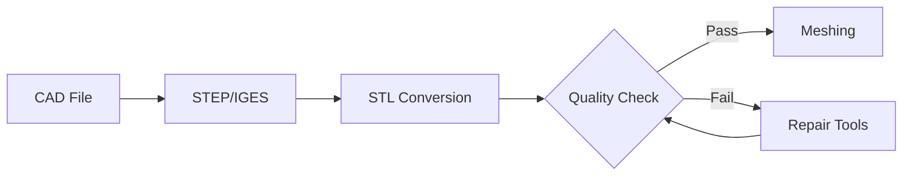
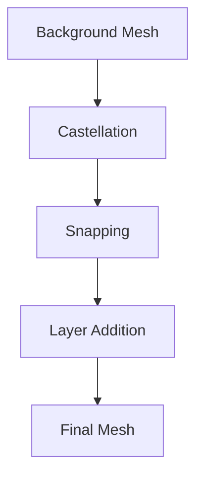

# Module 07: OpenFOAM Utilities & Workflow Automation

## 📋 Executive Summary

This module provides comprehensive training in OpenFOAM's extensive utilities ecosystem and workflow automation strategies, enabling efficient management of complete CFD workflows from geometry preparation to advanced post-processing and reporting.

**Core Focus**: Practical workflows, automation, and integration with OpenFOAM solvers for engineering applications.

---

## 🎯 Module Objectives

### Primary Goals

**Mastery of OpenFOAM Utilities**
- Control OpenFOAM utilities for mesh processing, case setup, and post-processing
- Develop proficiency in preprocessing utilities: `blockMesh`, `snappyHexMesh`, surface preparation tools
- Execute advanced field operations with `foamCalc` and custom post-processing workflows
- Implement automated boundary condition setup and field initialization

**Workflow Automation & Integration**
- Construct automated CFD pipelines using bash scripting and Python integration
- Develop parameter studies and design of experiments (DOE) frameworks
- Integrate OpenFOAM with HPC schedulers (SLURM, PBS) for batch processing
- Create end-to-end workflows from geometry to engineering reports

**Quality Assurance & Optimization**
- Implement comprehensive mesh quality assessment using metrics and automated checks
- Develop validation frameworks for solver-specific mesh requirements
- Optimize workflows for high-performance computing environments
- Establish best practices for code organization and version control

### Expected Outcomes

Upon completion, you will demonstrate expertise in:

- **Geometry Processing**: CAD format conversion, geometry repair, and surface mesh preparation
- **Mesh Generation**: Structured and unstructured mesh creation with `blockMesh`, `snappyHexMesh`, and specialized utilities
- **Case Management**: Boundary condition setup, initial conditions, and solver control parameter configuration
- **Automation**: Scripting for batch processing, parameter studies, and workflow optimization
- **Post-Processing**: Quantitative data extraction, visualization generation, and engineering reporting
- **Integration**: Connecting utilities with custom solvers and third-party tools

---

## 📚 Learning Path

### 🥉 Foundation: Essential Mesh Tools

#### 1. blockMesh Fundamentals

**Core Concepts**

`blockMesh` is OpenFOAM's foundational structured mesh generation utility, creating hexahedral meshes from definitions in `system/blockMeshDict`. The utility employs a block-based approach, dividing the computational domain into multiple hexahedral blocks, each defined by 8 vertices.

**Advanced Grading Techniques**

Edge grading enables variable mesh resolution through defined functions. The grading specification follows the format:

```cpp
// Edge grading syntax - Define curved edges using spline interpolation
edges
(
    spline 0 1
    (
        (0.0 0.0 0.0)
        (0.5 0.1 0.0)
        (1.0 0.0 0.0)
    )
);
```

> **📂 Source:** OpenFOAM `applications/utilities/mesh/generation/blockMesh`
> 
> **คำอธิบาย (Explanation):**
> ไวยากรณ์นี้ใช้กำหนดเส้นโค้งระหว่างจุดยอด (vertices) สองจุด โดยใช้การประมาณค่าแบบ spline เพื่อสร้างความลาดชันที่ไม่สม่ำเสมอของขนาดเซลล์ตามแนวเส้นขอบ
> 
> **แนวคิดสำคัญ (Key Concepts):**
> - **spline**: ฟังก์ชันการประมาณค่าเส้นโค้งที่ลื่นไหล
> - **0 1**: ดัชนีของจุดยอดเริ่มต้นและสิ้นสุดที่เชื่อมต่อกับเส้นโค้ง
> - **Point coordinates**: พิกัดจุดควบคุม (control points) ที่กำหนดรูปร่างของ spline

**Grading Functions**
- **Linear grading**: Uniform cell size progression
- **Exponential grading**: Cell size follows exponential growth/decay
- **Power law grading**: Cell size follows $y = x^p$ where $p$ is the power parameter

**Mesh Topology Patterns**

```cpp
// O-grid topology for circular geometries - Define vertices for O-grid structure
vertices
(
    (0 0 0)           // Center point
    (1 0 0)           // Inner radius
    (2 0 0)           // Outer radius
    // ... additional vertices
);
```

> **📂 Source:** OpenFOAM `applications/utilities/mesh/generation/blockMesh`
> 
> **คำอธิบาย (Explanation):**
> โครงสร้าง O-grid เป็นเทคนิคการสร้างเมชแบบโครงสร้างวงแหวนที่ล้อมรอบโดเมนหลัก ซึ่งเหมาะสำหรับเรขาคณิตแบบวงกลมหรือทรงกระบอก โดยจุดยอดแรกคือจุดศูนย์กลางและจุดถัดไปกำหนดรัศมีชั้นต่างๆ
> 
> **แนวคิดสำคัญ (Key Concepts):**
> - **O-grid topology**: โครงสร้างเมชวงแหวนที่ล้อมรอบโดเมนหลัก
> - **vertices**: จุดยอดที่กำหนดตำแหน่งในพื้นที่สามมิติ
> - **Center point**: จุดศูนย์กลางของโครงสร้าง O-grid
> - **Inner/Outer radius**: รัศมีชั้นในและชั้นนอกของโครงสร้าง

**Boundary Layer Considerations**

For boundary layer mesh quality, the first cell height calculation uses:

$$
y^+ = \frac{\rho u_\tau y}{\mu}
$$

where $u_\tau$ is the friction velocity computed from:

$$
u_\tau = \sqrt{\frac{\tau_w}{\rho}}
$$

#### 2. Surface Preparation

**Surface Requirements**

Quality surface meshes must satisfy:
- **Watertightness**: No gaps or holes in the triangulation
- **Normal consistency**: All face normals point outward
- **Triangle quality**: Aspect ratio < 10 for most regions
- **Feature preservation**: Sharp edges and corners maintained

**Surface Repair Utilities**

```bash
# Check surface quality - Verify mesh integrity and topology
surfaceCheck geometry.stl

# Extract sharp features - Identify and extract geometric edges
surfaceFeatureExtract -angle 30 geometry.stl

# Smooth surface - Reduce surface roughness and improve quality
surfaceSmoothFeatures geometry.stl
```

> **📂 Source:** OpenFOAM `applications/utilities/surfaceHandling/surfaceCheck`, `applications/utilities/mesh/generation/surfaceFeatureExtract`
> 
> **คำอธิบาย (Explanation):**
> ชุดคำสั่งนี้ใช้ในกระบวนการเตรียมพื้นผิวก่อนการสร้างเมช โดยเริ่มจากการตรวจสอบคุณภาพ การดึงคุณลักษณะเชิงเรขาคณิต และการปรับปรุงความเรียบของพื้นผิว
> 
> **แนวคิดสำคัญ (Key Concepts):**
> - **surfaceCheck**: ตรวจสอบความสมบูรณ์ของพื้นผิว (watertightness)
> - **surfaceFeatureExtract**: ระบุและดึงคุณลักษณะเชิงเรขาคณิต เช่น ขอบแหลม
> - **-angle 30**: กำหนดมุมขั้นต่ำสำหรับการตรวจจับคุณลักษณะ (30 องศา)
> - **surfaceSmoothFeatures**: ปรับปรุงความเรียบของพื้นผิวเพื่อลดปัญหาการสร้างเมช

**Format Conversion Pipeline**


> **Figure 1:** แผนภูมิแสดงขั้นตอนการแปลงรูปแบบไฟล์ (Format Conversion Pipeline) จากไฟล์ CAD ต้นฉบับผ่านมาตรฐาน STEP/IGES เข้าสู่รูปแบบ STL เพื่อเข้าสู่กระบวนการตรวจสอบคุณภาพและการซ่อมแซมก่อนการสร้างเมช

#### 3. Mesh Quality Assessment

**Essential Quality Metrics**

- **Non-orthogonality**: $\theta = \cos^{-1}\left(\frac{\mathbf{n}_f \cdot \mathbf{d}_{PN}}{|\mathbf{n}_f| \cdot |\mathbf{d}_{PN}|}\right)$
  - Target: < 70° for general CFD
  - Target: < 40° for complex turbulence models

- **Aspect Ratio**: $AR = \frac{h_{max}}{h_{min}}$
  - Target: < 1000 for general applications
  - Target: < 100 for boundary layer regions

- **Skewness**: $\text{skewness} = \frac{|\mathbf{C} - \mathbf{C}_{ideal}|}{|\mathbf{C}_{PF} - \mathbf{C}_{ideal}|}$
  - Target: < 4 for most solvers
  - Target: < 2 for high-accuracy simulations

- **Expansion Ratio**: Local cell size variation
  - Target: < 1.3 for general CFD
  - Target: < 1.1 for boundary layers

**Automated Quality Checks**

```bash
# Comprehensive mesh analysis - Check all geometry and topology
checkMesh -allGeometry -allTopology -time 0

# Quality metrics only - Focus on mesh quality parameters
checkMesh -meshQuality

# Detailed report with thresholds - Generate detailed quality report
checkMesh -allRegions -writeFields
```

> **📂 Source:** OpenFOAM `applications/utilities/mesh/manipulation/checkMesh`
> 
> **คำอธิบาย (Explanation):**
> เครื่องมือ checkMesh ใช้วิเคราะห์คุณภาพของเมชโดยตรวจสอบทั้งโครงสร้างเรขาคณิตและโทโพโลยี พร้อมทั้งสร้างรายงานคุณภาพและฟิลด์ข้อมูลสำหรับการวิเคราะห์เพิ่มเติม
> 
> **แนวคิดสำคัญ (Key Concepts):**
> - **-allGeometry**: ตรวจสอบคุณสมบัติเรขาคณิตทั้งหมดของเมช
> - **-allTopology**: ตรวจสอบโครงสร้างโทโพโลยี เช่น การเชื่อมต่อของเซลล์
> - **-time 0**: ตรวจสอบเมชที่เวลา t=0 (เมชเริ่มต้น)
> - **-meshQuality**: แสดงเฉพาะตัวชี้วัดคุณภาพเมช
> - **-writeFields**: เขียนฟิลด์คุณภาพลงไฟล์สำหรับการวิเคราะห์เชิงลึก

### 🏦 Intermediate: Advanced Meshing Workflows

#### 1. snappyHexMesh Mastery

**Three-Stage Process**


> **Figure 2:** กระบวนการทำงาน 3 ขั้นตอนหลักของ `snappyHexMesh` ประกอบด้วยขั้นตอนการสร้างเมชแบบ Castellated การปรับพื้นผิวให้แนบชิด (Snapping) และการเพิ่มชั้นขอบเขต (Layer Addition) เพื่อให้ได้เมชสุดท้ายที่สมบูรณ์

**Castellation Stage**

```cpp
// snappyHexMeshDict - Castellation controls
// Convert background mesh to castellated mesh with refinement
castellatedMesh true;
castellatedMeshControls
{
    // Maximum cells allowed in local and global domain
    maxLocalCells        1000000;
    maxGlobalCells       20000000;
    
    // Minimum cells to trigger refinement
    minRefinementCells   10;

    // Cells between refinement levels
    nCellsBetweenLevels  3;

    // Feature edges for geometry preservation
    features
    (
        {
            file "geometry.eMesh";
            level 2;
        }
    );

    // Surface refinement settings
    refinementSurfaces
    {
        geometry
        {
            // Refinement level for surface and region
            level (2 2);
            patchInfo
            {
                type wall;
            }
        }
    }

    // Minimum angle for feature detection
    resolveFeatureAngle 30;
}
```

> **📂 Source:** OpenFOAM `.applications/utilities/mesh/generation/snappyHexMesh`
> 
> **คำอธิบาย (Explanation):**
> ขั้นตอน Castellation เป็นการแปลงเมชพื้นหลังให้เป็นเมชแบบ castellated ที่มีการ refine ตามรูปทรงเรขาคณิต โดยใช้การควบคุมจำนวนเซลล์และระดับการ refine สำหรับพื้นผิวและคุณลักษณะเชิงเรขาคณิต
> 
> **แนวคิดสำคัญ (Key Concepts):**
> - **castellatedMesh**: เปิดใช้งานขั้นตอนการสร้างเมชแบบ castellated
> - **maxLocalCells/maxGlobalCells**: จำกัดจำนวนเซลล์สูงสุดเพื่อควบคุมหน่วยความจำ
> - **refinementSurfaces**: กำหนดระดับการ refine สำหรับแต่ละพื้นผิว
> - **resolveFeatureAngle**: มุมขั้นต่ำสำหรับการตรวจจับคุณลักษณะเชิงเรขาคณิต

**Snapping Stage**

```cpp
// Snapping controls - Move mesh vertices to surface geometry
snapControls
{
    // Number of patch smoothing iterations
    nSmoothPatch       3;
    
    // Tolerance for snapping to surface
    tolerance          2.0;
    
    // Solver iterations for relaxation
    nSolveIter         30;
    nRelaxIter         5;

    // Feature snapping iterations
    nFeatureSnapIter   10;
    
    // Use implicit feature snapping
    implicitFeatureSnap false;
    
    // Enable multi-region feature snapping
    multiRegionFeatureSnap true;
}
```

> **📂 Source:** OpenFOAM `.applications/utilities/mesh/generation/snappyHexMesh`
> 
> **คำอธิบาย (Explanation):**
> ขั้นตอน Snapping ทำหน้าที่ปรับจุดยอดของเมชให้แนบชิดกับพื้นผิวเรขาคณิต โดยใช้กระบวนการทางคณิตศาสตร์เพื่อให้ได้ความแม่นยำสูง
> 
> **แนวคิดสำคัญ (Key Concepts):**
> - **nSmoothPatch**: จำนวนรอบการปรับปรุงความเรียบของ patch
> - **tolerance**: ค่าความอดทนในการย้ายจุดยอดไปยังพื้นผิว
> - **implicitFeatureSnap**: การ snap แบบ implicit สำหรับคุณลักษณะเชิงเรขาคณิต

**Layer Addition Stage**

```cpp
// Layer addition controls - Add boundary layer cells
addLayersControls
{
    // Use relative size calculations
    relativeSizes true;

    // Define layers for specific patches
    layers
    {
        "geometry.*"
        {
            nSurfaceLayers 3;
        }
    }

    // Layer expansion parameters
    expansionRatio      1.3;
    finalLayerThickness 0.3;
    minThickness        0.1;
    
    // Layer growth control
    nGrow               1;

    // Feature angle for layer termination
    featureAngle        60;
    
    // Smoothing iterations
    nRelaxIter          3;
    nSmoothSurfaceNormals 3;
    nSmoothNormals      3;
}
```

> **📂 Source:** OpenFOAM `.applications/utilities/mesh/generation/snappyHexMesh`
> 
> **คำอธิบาย (Explanation):**
> ขั้นตอน Layer Addition เพิ่มชั้นเซลล์บริเวณขอบเขตเพื่อให้ได้ความละเอียดที่เหมาะสมในบริเวณชั้นขอบเขต โดยควบคุมอัตราส่วนการขยายและความหนาของชั้น
> 
> **แนวคิดสำคัญ (Key Concepts):**
> - **nSurfaceLayers**: จำนวนชั้นเซลล์ที่เพิ่มบนพื้นผิว
> - **expansionRatio**: อัตราส่วนการขยายของขนาดเซลล์ระหว่างชั้น
> - **finalLayerThickness**: ความหนาสัมพัทธ์ของชั้นสุดท้าย
> - **featureAngle**: มุมที่ชั้นเซลล์จะสิ้นสุด

#### 2. Multi-Block Domain Assembly

**Block Topology Planning**

```cpp
// Multi-block configuration example - Assemble multiple mesh blocks
blocks
(
    // Block 1: Inlet region
    hex (0 1 2 3 4 5 6 7) (100 50 1) simpleGrading (1 1 1)

    // Block 2: Main domain
    hex (8 9 10 11 12 13 14 15) (200 100 1) simpleGrading (1 1 1)

    // Block 3: Outlet region
    hex (16 17 18 19 20 21 22 23) (100 50 1) simpleGrading (1 1 1)
);

// Boundary connections - Merge patches between blocks
mergePatchPairs
(
    (
        block1_outlet
        block2_inlet
    )
    (
        block2_outlet
        block3_inlet
    )
);
```

> **📂 Source:** OpenFOAM `applications/utilities/mesh/generation/blockMesh`
> 
> **คำอธิบาย (Explanation):**
> การกำหนดค่าหลายบล็อกช่วยให้สามารถสร้างโดเมนที่ซับซ้อนได้โดยการแบ่งเป็นบล็อกย่อยที่เชื่อมต่อกัน พร้อมทั้งระบุจุดประสานระหว่างบล็อก
> 
> **แนวคิดสำคัญ (Key Concepts):**
> - **hex**: ประกาศบล็อก hexahedral พร้อมพิกัดจุดยอดและการแบ่งเซลล์
> - **simpleGrading**: กำหนดอัตราส่วนการขยายของขนาดเซลล์
> - **mergePatchPairs**: ระบุ patch ที่จะเชื่อมต่อระหว่างบล็อก

#### 3. Adaptive Refinement Strategies

**Solution-Adaptive Refinement**

```cpp
// dynamicRefineFvMeshDict for runtime adaptation
dynamicFvMesh dynamicRefineFvMesh;

refiner
{
    // Refinement interval in time steps
    refineInterval  5;
    
    // Field to monitor for refinement
    field           alpha.water;
    
    // Refinement thresholds
    lowerRefineLevel 0.3;
    upperRefineLevel 0.7;
    nRefineIterations 1;
    
    // Maximum refinement level and cells
    maxRefinement  4;
    maxCells       2000000;
}
```

> **📂 Source:** OpenFOAM `applications/solvers/multiphase/interDynFoam`
> 
> **คำอธิบาย (Explanation):**
> การ refine แบบปรับตามผลเฉลย (solution-adaptive) ช่วยให้สามารถปรับความละเอียดของเมชตามค่าของฟิลด์ที่กำลังคำนวณในขณะทำงานจริง
> 
> **แนวคิดสำคัญ (Key Concepts):**
> - **dynamicFvMesh**: ประเภทของเมชแบบ dynamic
> - **refineInterval**: รอบเวลาที่มีการ refine
> - **lower/upperRefineLevel**: ช่วงค่าที่จะ trigger การ refine

**Error Indicator-Based Refinement**

$$
\epsilon = \left| \nabla \phi \right| \cdot h^2
$$

where $\phi$ is the field variable and $h$ is the local cell size.

### 🚀 Advanced: Specialized Applications

#### 1. Application-Specific Meshing

**Turbomachinery O-Grid**

```cpp
// O-grid topology for rotating machinery
blocks
(
    // O-grid block with curved grading
    hex (0 1 2 3 4 5 6 7) (200 80 1) edgeGrading (1 1 1 1 4 4 1 1 1 1 4 4)

    // H-grid blocks for inlet/outlet
    hex (8 9 10 11 12 13 14 15) (50 20 1) simpleGrading (1 1 1)
);
```

> **📂 Source:** OpenFOAM `applications/utilities/mesh/generation/blockMesh`
> 
> **คำอธิบาย (Explanation):**
> โครงสร้าง O-grid สำหรับเครื่องจักรหมุนใช้ grading แบบโค้งเพื่อให้ได้ความละเอียดที่เหมาะสมในบริเวณใกล้ใบพัด
> 
> **แนวคิดสำคัญ (Key Concepts):**
> - **edgeGrading**: กำหนด grading แบบโค้งสำหรับขอบโค้ง
> - **O-grid block**: บล็อกโครงสร้างวงแหวนสำหรับการหมุน

**Boundary Layer $y^+$ Calculation**

$$
y = \frac{y^+ \mu}{\rho u_\tau}, \quad u_\tau = U_\infty \sqrt{\frac{C_f}{2}}
$$

For turbulent boundary layers:
$$
C_f \approx 0.0592 \cdot Re_x^{-0.2}
$$

#### 2. Dynamic Meshing

**Motion Solver Configuration**

```cpp
// dynamicMeshDict - Configure mesh motion solver
dynamicFvMesh   dynamicMotionSolverFvMesh;

motionSolverLibs ("libfvMotionSolvers.so");

solver          displacementLaplacian;

displacementLaplacianCoeffs
{
    diffusivity uniform 1;
}
```

> **📂 Source:** OpenFOAM `applications/solvers/multiphase/interDyMFoam`
> 
> **คำอธิบาย (Explanation):**
> การกำหนดค่า motion solver สำหรับเมชแบบ dynamic ที่สามารถเคลื่อนที่ได้ตามเวลา เช่น ในปัญหา FSI
> 
> **แนวคิดสำคัญ (Key Concepts):**
> - **dynamicMotionSolverFvMesh**: ประเภทของเมชที่รองรับการเคลื่อนไหว
> - **displacementLaplacian**: วิธีการคำนวณการกระจายการเคลื่อนที่
> - **diffusivity**: ค่าสัมประสิทธิ์การกระจาย

#### 3. Multi-Phase Meshing

**Interface Resolution Requirements**

$$
\Delta x < \frac{\sigma}{\rho U^2}
$$

where $\sigma$ is surface tension, $\rho$ is density, and $U$ is characteristic velocity.

**Adaptive Interface Tracking**

```cpp
// Interface refinement settings
refinementSurfaces
{
    interface
    {
        // High resolution for interface
        level (4 4);
        
        // Define cell and face zones
        cellZone interface;
        faceZone interface;
    }
}
```

> **📂 Source:** OpenFOAM `.applications/utilities/mesh/generation/snappyHexMesh`
> 
> **คำอธิบาย (Explanation):**
> การ refine แบบปรับตาม interface ช่วยให้ได้ความละเอียดสูงบริเวณพื้นผิวระหว่างเฟสในปัญหา multiphase
> 
> **แนวคิดสำคัญ (Key Concepts):**
> - **refinementSurfaces**: กำหนดระดับการ refine สำหรับพื้นผิว interface
> - **cellZone/faceZone**: กำหนดโซนของเซลล์และหน้าผิวสำหรับ interface

---

## 🛠️ Technical Outcomes

### 1. Advanced Mesh Generation & Management

**Structured Mesh with blockMesh**
- Master `blockMeshDict` syntax and topology definition
- Create multi-block structured meshes for complex geometries
- Implement grading functions for boundary layer resolution
- Apply advanced edge grading and curvature-based cell density control
- Generate conformal meshes with consistent connectivity

**Unstructured Mesh with snappyHexMesh**
- Configure surface-based meshing around STL/OBJ geometries
- Implement multi-level mesh refinement based on geometric features
- Optimize cell quality through layer addition and snapping processes
- Control refinement levels for regions of interest
- Generate high-quality boundary layer meshes with appropriate $y^+$ values

### 2. Process Automation & Workflow Optimization

**Automated Meshing Workflows**

```bash
#!/bin/bash
# Automated meshing workflow - Process multiple geometries
for geom in geometries/*.stl; do
    case_name=$(basename "$geom" .stl)
    mkdir -p "cases/$case_name"
    cp mesh_template/* "cases/$case_name/"

    # Generate surface features
    surfaceFeatureExtract -case "cases/$case_name" "geometries/$case_name.stl"

    # Run meshing pipeline
    blockMesh -case "cases/$case_name"
    snappyHexMesh -case "cases/$case_name" -overwrite

    # Quality check
    checkMesh -case "cases/$case_name" > "cases/$case_name/mesh_quality.txt"
done
```

> **📂 Source:** OpenFOAM Workflow Automation
> 
> **คำอธิบาย (Explanation):**
> สคริปต์นี้ทำให้สามารถประมวลผลหลาย geometry ได้อัตโนมัติ โดยสร้าง case แยกสำหรับแต่ละ geometry และดำเนินการตาม workflow ที่กำหนด
> 
> **แนวคิดสำคัญ (Key Concepts):**
> - **for loop**: วนลูปผ่านไฟล์ STL ทั้งหมด
> - **surfaceFeatureExtract**: ดึงคุณลักษณะเชิงเรขาคณิตจากพื้นผิว
> - **blockMesh/snappyHexMesh**: สร้างเมชตามลำดับ
> - **checkMesh**: ตรวจสอบคุณภาพของเมช

**Batch Processing for Parameter Studies**
- Implement parameter sweeps with automated case generation
- Create parallel processing workflows for HPC environments
- Develop custom scripts for systematic geometry variations
- Integrate with job schedulers (SLURM, PBS) for large-scale studies

**CAD Integration & Geometry Processing**
- Automate CAD file conversion and preprocessing
- Implement geometry cleaning and repair workflows
- Create parametric geometry generation scripts
- Integrate with CAD software APIs for seamless workflow

### 3. Comprehensive Quality Assessment

**Automated Quality Control Pipelines**

```python
# Python script for automated mesh quality assessment
import numpy as np
import pandas as pd
import re

def extract_metric(content, metric_name):
    """Extract metric value from checkMesh output."""
    pattern = rf"{metric_name}.*?([\d.]+)"
    match = re.search(pattern, content)
    return float(match.group(1)) if match else None

def calculate_quality_score(orthogonality, aspect_ratio, skewness):
    """Calculate composite quality score."""
    # Weighted quality metrics
    w_ortho = 0.4
    w_aspect = 0.3
    w_skew = 0.3

    # Normalize (lower is better for all metrics)
    score = (w_ortho * orthogonality / 70.0 +
             w_aspect * aspect_ratio / 1000.0 +
             w_skew * skewness / 4.0)
    return min(score, 1.0)  # Cap at 1.0

def assess_mesh_quality(case_path):
    # Parse checkMesh output
    with open(f"{case_path}/mesh_quality.txt", 'r') as f:
        content = f.read()

    # Extract key metrics
    orthogonality = extract_metric(content, "Non-orthogonality")
    aspect_ratio = extract_metric(content, "Aspect ratio")
    skewness = extract_metric(content, "Skewness")

    # Quality classification
    quality_score = calculate_quality_score(orthogonality, aspect_ratio, skewness)

    return {
        'case': case_path,
        'orthogonality': orthogonality,
        'aspect_ratio': aspect_ratio,
        'skewness': skewness,
        'quality_score': quality_score
    }
```

> **📂 Source:** OpenFOAM Python Integration
> 
> **คำอธิบาย (Explanation):**
> สคริปต์ Python นี้ทำให้สามารถประเมินคุณภาพของเมชอัตโนมัติ โดยอ่านผลลัพธ์จาก checkMesh และคำนวณคะแนนคุณภาพแบบรวม
> 
> **แนวคิดสำคัญ (Key Concepts):**
> - **extract_metric**: ดึงค่าตัวชี้วัดจาก output ของ checkMesh
> - **calculate_quality_score**: คำนวณคะแนนคุณภาพแบบถ่วงน้ำหนัก
> - **assess_mesh_quality**: ฟังก์ชันหลักสำหรับประเมินคุณภาพ

### 4. Custom Utility Development

**Custom OpenFOAM Utility Template**

```cpp
// Custom utility: meshStatisticsGenerator.C
// Generate comprehensive mesh statistics for quality assessment
#include "fvMesh.H"
#include "volFields.H"
#include "surfaceFields.H"
#include "OFstream.H"

using namespace Foam;

int main(int argc, char *argv[])
{
    // Initialize OpenFOAM environment
    #include "setRootCase.H"
    #include "createTime.H"
    #include "createMesh.H"

    Info << "Calculating mesh statistics..." << endl;

    // Calculate mesh statistics
    const fvPatchList& patches = mesh.boundary();
    label nCells = mesh.nCells();
    label nFaces = mesh.nFaces();
    label nPoints = mesh.nPoints();
    label nInternalFaces = mesh.nInternalFaces();

    // Output detailed statistics
    OFstream outFile("meshStatistics.txt");
    outFile << "Mesh Statistics:" << nl
            << "  Cells: " << nCells << nl
            << "  Faces: " << nFaces << nl
            << "  Internal Faces: " << nInternalFaces << nl
            << "  Boundary Faces: " << (nFaces - nInternalFaces) << nl
            << "  Points: " << nPoints << nl
            << "  Patches: " << patches.size() << nl;

    // Calculate quality metrics
    scalar maxNonOrthog = 0.0;
    scalar maxSkewness = 0.0;

    // ... quality assessment implementation

    outFile << "\nQuality Metrics:" << nl
            << "  Max Non-orthogonality: " << maxNonOrthog << nl
            << "  Max Skewness: " << maxSkewness << nl;

    Info << "Mesh statistics generated successfully" << endl;
    return 0;
}
```

> **📂 Source:** Custom OpenFOAM Utility Development
> 
> **คำอธิบาย (Explanation):**
> อรรถานุทค์ custom utility นี้สร้างสถิติที่ครอบคลุมของเมชเพื่อการประเมินคุณภาพ โดยรวบรวมข้อมูลพื้นฐานและตัวชี้วัดคุณภาพ
> 
> **แนวคิดสำคัญ (Key Concepts):**
> - **fvMesh**: คลาสเมชที่ใช้ใน OpenFOAM
> - **nCells/nFaces/nPoints**: จำนวนเซลล์ หน้า และจุดของเมช
> - **maxNonOrthog/maxSkewness**: ค่าตัวชี้วัดคุณภาพสูงสุด
> - **OFstream**: คลาสสำหรับเขียนไฟล์ output

**Compilation and Usage**

```bash
# Compile custom utility
wmake

# Run on case
meshStatisticsGenerator -case <case_directory>
```

---

## 🎯 Module Integration

### Prerequisites

Before starting this module, ensure completion of:

**Required Modules**
- [x] **Module 03**: Mesh Generation and Geometry Fundamentals
- [x] **Module 04**: Basic Solver Development (SIMPLE/PISO implementation)

**Technical Skills**
- **OpenFOAM Commands**: Proficiency with `blockMesh`, `snappyHexMesh`, `refineMesh`, `checkMesh`
- **Shell Scripting**: BASH/Python scripting for automation
- **CAD Software**: Familiarity with CAD software and basic file formats
- **Command Line Tools**: Comfort with `grep`, `awk`, `sed`, and text processing utilities
- **File I/O Management**: Understanding of OpenFOAM file formats and data structures

### Recommended Learning Sequence

#### Foundation Phase
1. Master `blockMesh` fundamentals and topology
2. Develop surface preparation and repair skills
3. Implement mesh quality assessment workflows

#### Intermediate Phase
1. Master `snappyHexMesh` for complex geometries
2. Learn multi-block domain assembly
3. Develop systematic refinement strategies
4. Implement advanced quality enhancement techniques

#### Advanced Phase
1. Specialized CFD application meshing
2. Dynamic meshing for FSI applications
3. Multi-phase mesh requirements
4. GPU-accelerated solver considerations

---

## 📊 Module Structure

### Utility Library (`examples/`)

Organized by domain:
- **Mesh Preparation**: Advanced meshing workflows for complex geometries
- **Solver Setup**: Parameter studies and automated case generation
- **Boundary Conditions**: Boundary condition automation tools
- **Post-Processing**: Field analysis, force calculations, and visualization
- **Parallel Processing**: HPC workflow tools and batch operations
- **Multi-Phase**: Phase model configurations and specialized analysis
- **Development Tools**: C++ debugging, performance analysis, and testing frameworks

### Workflow Systems (`workflows/`)

End-to-end workflow coordination including:
- **Complete CFD Workflows**: From geometry to results with automated optimization
- **Mesh to Solver**: Integrated mesh preparation with solver validation
- **Post-Processing Pipelines**: Integrated analysis and reporting workflows

### Progressive Learning (`tutorials/`)

Structured lessons from beginner to expert:
- **Beginner**: Basic mesh creation, simple solvers, basic operations
- **Intermediate**: Complex geometries, advanced snappyHexMesh meshing
- **Advanced**: Turbulent flows, conjugate heat transfer, moving meshes
- **Expert**: Solver development, GPU acceleration, specialized physics

---

## 🔧 Key Features

### Automation-First Design

All utilities and workflows designed with automation as the primary requirement, reducing manual intervention and human error.

### Scalable Architecture

Tools scale from desktop CFD to HPC clusters and cloud environments, with built-in parallelization and optimization capabilities.

### End-to-End Coverage

From initial CAD import, mesh generation, solver execution, post-processing, to final reporting and documentation.

### Integration-Ready

Designed for integration with external tools, databases, and services, including CAD software, cloud platforms, and monitoring systems.

---

## 🎓 Professional Standards

### Code Documentation

- Follow OpenFOAM documentation guidelines
- Maintain comprehensive inline comments
- Provide usage examples for all custom utilities
- Document input parameters and expected outputs

### Industry Best Practices

- Version control workflows for CFD projects
- Automated testing and validation frameworks
- Code review processes for custom utilities
- Reproducible research practices

### Quality Assurance

- Mesh quality metrics and thresholds
- Solver convergence criteria
- Automated regression testing
- Performance benchmarking standards

---

## 📝 Summary

This module provides comprehensive technical training in OpenFOAM utilities and workflow automation, enabling you to develop complex CFD workflows capable of handling sophisticated engineering problems efficiently and reliably. The acquired skills will prepare you for advanced research and industrial applications where high-quality automated mesh generation and process optimization are critical requirements.

The module bridges the gap between basic OpenFOAM usage and professional-grade CFD practice, emphasizing:
- **Technical rigor** with mathematical foundations for all methods
- **Practical application** with working code examples and real-world workflows
- **Professional standards** for documentation, testing, and collaboration
- **Scalable solutions** from desktop to HPC environments

Upon completion, you will possess the complete toolkit necessary to tackle industrial CFD challenges with confidence and efficiency.