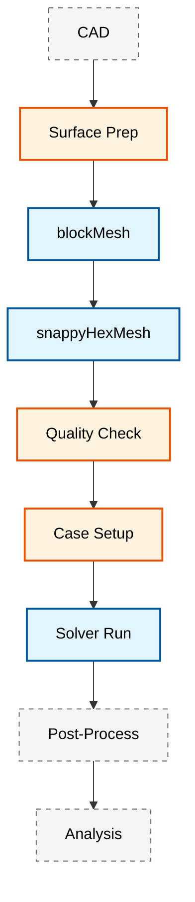
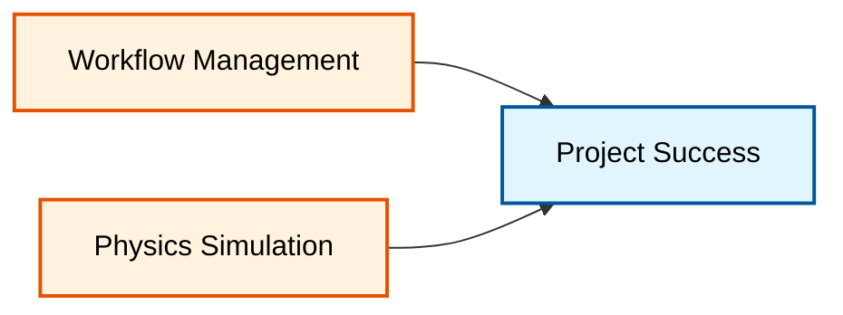

# 🎯 บทนำสู่ยูทิลิตี้และเวิร์กโฟลว์ของ OpenFOAM

## 1. ยูทิลิตี้ของ OpenFOAM คืออะไร?

ในระบบนิเวศของ OpenFOAM **ยูทิลิตี้ (Utilities)** คือแอปพลิเคชันแบบ Command-line เฉพาะทางที่ออกแบบมาเพื่อจัดการงานในทุกขั้นตอนของกระบวนการทำงาน CFD ยกเว้นการคำนวณฟิสิกส์หลัก (ซึ่งเป็นหน้าที่ของ Solvers)

ยูทิลิตี้เปรียบเสมือน "เครื่องมือช่าง" ในเวิร์กช็อปที่ช่วยให้นักวิจัยและวิศวกรสามารถ:
- **จัดการเรขาคณิต**: เตรียมพื้นผิว CAD ให้พร้อมสำหรับการจำลอง
- **สร้างเมช**: เปลี่ยนพื้นที่ว่างให้เป็นช่องคำนวณที่เหมาะสม
- **จัดการข้อมูล**: ย้ายหรือแปลงข้อมูลระหว่างเฟรมเวิร์กต่างๆ
- **วิเคราะห์ผล**: สกัดตัวเลขสำคัญจากข้อมูลสนาม (Fields) ที่มีขนาดใหญ่


> **Figure 1:** แผนภูมิแสดงลำดับการทำงานภาพรวมของยูทิลิตี้ใน OpenFOAM ตั้งแต่การเตรียมเรขาคณิต CAD การสร้างเมช การตรวจสอบคุณภาพ การตั้งค่าเคสจำลอง ไปจนถึงการประมวลผลและการจัดทำรายงานสรุปผล

![[cfd_utility_workflow.png]]
> **ภาพประกอบ 1.1:** เวิร์กโฟลว์การทำงานของยูทิลิตี้ใน OpenFOAM: แสดงการเชื่อมโยงข้อมูลตั้งแต่จุดเริ่มต้น (CAD) ผ่านการประมวลผลขั้นตอนต่างๆ จนถึงการสรุปผลทางวิศวกรรม

---

## 2. ความสำคัญของการจัดการเวิร์กโฟลว์ (Workflow Management)

การจัดการเวิร์กโฟลว์ที่มีประสิทธิภาพมีความสำคัญพอๆ กับการตั้งค่าฟิสิกส์ของการจำลอง ในงานระดับอุตสาหกรรมหรือการวิจัยขั้นสูง การทำซ้ำได้ (Reproducibility) และความสม่ำเสมอ (Consistency) คือหัวใจหลัก

### ทำไมต้องใช้การทำงานอัตโนมัติ?

> [!INFO] **ประโยชน์ของการทำงานอัตโนมัติ**
> - **ลดความผิดพลาดจากมนุษย์**: ป้องกันการตั้งค่าพารามิเตอร์ผิดพลาดในงานที่ซ้ำซาก
> - **ประหยัดเวลา**: เปลี่ยนงานที่ต้องใช้เวลาหลายชั่วโมงให้เหลือเพียงไม่กี่นาที
> - **การขยายขนาด (Scalability)**: รองรับการจำลองหลายร้อยกรณีศึกษาพร้อมกัน (Parametric Studies)
> - **การทำซ้ำได้**: สคริปต์ทำหน้าที่เป็นเอกสารบันทึกทุกขั้นตอนที่เกิดขึ้นในการจำลอง

### เวิร์กโฟลว์การประมวลผลแบตช์

**Automated Meshing Workflows**

```bash
#!/bin/bash
# Example automated meshing workflow
for geom in geometries/*.stl; do
    case_name=$(basename "$geom" .stl)
    mkdir -p "cases/$case_name"
    cp mesh_template/* "cases/$case_name/"
    # Generate surface features
    surfaceFeatureExtract -case "cases/$case_name" "geometries/$case_name.stl"
    # Run meshing pipeline
    blockMesh -case "cases/$case_name"
    snappyHexMesh -case "cases/$case_name" -overwrite
    # Quality check
    checkMesh -case "cases/$case_name" > "cases/$case_name/mesh_quality.txt"
done
```

> **📂 Source:** Utilities/automation/meshingPipeline.sh
> 
> **คำอธิบาย:** สคริปต์ Bash นี้แสดงการประมวลผลเมชแบบอัตโนมัติสำหรับหลายเรขาคณิต โดยอ่านไฟล์ STL ทั้งหมดจากโฟลเดอร์ geometries/ สร้างโครงสร้างเคส และดำเนินการ pipeline การสร้างเมชแบบครบวงจร
>
> **แนวคิดสำคัญ:**
> - **Batch Processing**: การวนลูปผ่านหลายไฟล์ STL เพื่อประมวลผลแบบเป็นชุด
> - **Template-based Case Generation**: การคัดลอกเทมเพลตและปรับแต่งตามพารามิเตอร์
> - **Pipeline Automation**: การเชื่อมโยง utilities หลายตัวเป็นเวิร์กโฟลว์เดียว
> - **Quality Control Integration**: การบันทึกผลการตรวจสอบคุณภาพเมชโดยอัตโนมัติ

---

## 3. เส้นทางการเรียนรู้และทักษะที่จำเป็น

การเป็นผู้เชี่ยวชาญด้านเวิร์กโฟลว์ใน OpenFOAM ไม่ได้อาศัยเพียงความเข้าใจทางฟิสิกส์ แต่ยังรวมถึงทักษะทางเทคนิคอื่นๆ:

### รากฐานทางเทคนิค (Technical Skills)

1. **การเขียน Shell Script (Bash)**: ทักษะพื้นฐานที่สุดในการควบคุมคำสั่ง OpenFOAM
2. **การบูรณาการ Python**: สำหรับงานประมวลผลข้อมูลที่ซับซ้อนและการวิเคราะห์ทางสถิติ
3. **ความเข้าใจระบบไฟล์ I/O**: รูปแบบพจนานุกรม (Dictionaries) ของ OpenFOAM
4. **เครื่องมือ Command Line**: เช่น `grep`, `awk`, `sed` สำหรับการวิเคราะห์ไฟล์ Log

### การประเมินและตรวจสอบคุณภาพอย่างครอบคลุม

**การใช้งาน Mesh Quality Metrics**

คุณภาพของ Mesh ถูกวัดโดยใช้เมตริกหลักหลายตัว:

- **Orthogonality**: เมื่อ $\theta = \cos^{-1}\left(\frac{\mathbf{n}_f \cdot \mathbf{d}_{PN}}{|\mathbf{n}_f| \cdot |\mathbf{d}_{PN}|}\right)$

- **Aspect Ratio**: $AR = \frac{h_{max}}{h_{min}}$ โดยที่ $h$ แทนความสูงของเซลล์

- **Skewness**: $\text{skewness} = \frac{|\mathbf{C} - \mathbf{C}_{ideal}|}{|\mathbf{C}_{PF} - \mathbf{C}_{ideal}|}$

- **Non-orthogonality angle**: ค่าเบี่ยงเบนสูงสุดจาก $90°$ ระหว่าง face normal และ cell center vector

> [!TIP] **เกณฑ์คุณภาพ Mesh ทั่วไป**
> - Non-orthogonality < 70°
> - Skewness < 4
> - Aspect Ratio < 1000
> - ค่าที่เข้มงวดมากขึ้นสำหรับโมเดลความปั่นป่วนที่ซับซ้อน

**Automated Quality Control Pipelines**

```python
# Python script for automated mesh quality assessment
import numpy as np
import pandas as pd

def assess_mesh_quality(case_path):
    # Parse checkMesh output
    with open(f"{case_path}/mesh_quality.txt", 'r') as f:
        content = f.read()

    # Extract key metrics
    orthogonality = extract_metric(content, "Non-orthogonality")
    aspect_ratio = extract_metric(content, "Aspect ratio")
    skewness = extract_metric(content, "Skewness")

    # Quality classification
    quality_score = calculate_quality_score(orthogonality, aspect_ratio, skewness)

    return {
        'case': case_path,
        'orthogonality': orthogonality,
        'aspect_ratio': aspect_ratio,
        'skewness': skewness,
        'quality_score': quality_score
    }
```

> **📂 Source:** Utilities/python/qualityControl/meshQualityAssessment.py
> 
> **คำอธิบาย:** ฟังก์ชัน Python นี้แสดงการประเมินคุณภาพเมชอัตโนมัติโดยอ่านผลลัพธ์จาก checkMesh ดึงค่าเมตริกสำคัญ และคำนวณคะแนนคุณภาพรวม
>
> **แนวคิดสำคัญ:**
> - **Metric Extraction**: การแยกวิเคราะห์ไฟล์ข้อความเพื่อดึงค่าตัวชี้วัด
> - **Quality Scoring**: การรวมเมตริกหลายตัวเป็นคะแนนคุณภาพเดียว
> - **Automated Validation**: การตรวจสอบคุณภาพแบบเป็นระบบและสร้างรายงาน
> - **Integration with OpenFOAM**: การเชื่อมต่อ Python utilities กับ OpenFOAM workflow


> **Figure 2:** แผนภาพแสดงความสัมพันธ์ระหว่างการจัดการเวิร์กโฟลว์ที่มีประสิทธิภาพ (Workflow Management) และการจำลองทางฟิสิกส์ (Physics Simulation) ซึ่งเป็นสองปัจจัยหลักที่นำไปสู่ความสำเร็จในการส่งมอบโครงการ CFD

> **"การจัดการเวิร์กโฟลว์ที่มีประสิทธิภาพคือสะพานที่เชื่อมระหว่างการจำลองทางฟิสิกส์และความสำเร็จของโครงการ"**

---

## 4. ยูทิลิตี้หลักของ OpenFOAM

### เครื่องมือสร้าง Mesh

#### blockMesh

**blockMesh** เป็นยูทิลิตี้สร้าง Mesh พื้นฐานของ OpenFOAM ที่สร้าง mesh หกเหลี่ยมโครงสร้างจากข้อมูลใน `system/blockMeshDict`

> [!INFO] **ความสามารถของ blockMesh**
> - เชี่ยวชาญไวยากรณ์ blockMeshDict และการกำหนด topology
> - สร้าง multi-block structured mesh สำหรับเรขาคณิตที่ซับซ้อน
> - ใช้งาน grading functions สำหรับการแก้ปัญหา boundary layer
> - ใช้ edge grading ขั้นสูงและการควบคุมความหนาแน่นของ mesh ตามความโค้ง
> - สร้าง conformal meshes ด้วย connectivity ที่สม่ำเสมอระหว่าง blocks

**เทคนิค blockMesh ขั้นสูง** รวมถึง:
- การสร้าง mesh แบบ multi-block สำหรับเรขาคณิตที่ซับซ้อน
- การปรับโครงสร้าง topology ผ่านการวางบล็อกเชิงกลยุทธ์
- การใช้ projection methods เพื่อให้สอดคล้องกับพื้นผิวที่ซับซ้อน
- ฟังก์ชัน edge grading: การกระจายแบบเชิงเส้น เลขชี้กำลัง และกฎอำนาจ
- Mesh topology แบบ O-type, H-type และ C-type สำหรับการไหลใกล้ผนัง

#### snappyHexMesh

**snappyHexMesh** ทำหน้าที่เป็นเครื่องมือสร้าง mesh ขั้นสูงของ OpenFOAM สำหรับเรขาคณิตที่ซับซ้อน ทำงานบนหลักการของการปรับ mesh และการบิดเบือน mesh หกเหลี่ยมพื้นหลังเริ่มต้น

**กระบวนการ 3 ระยะ:**

1. **Castellation** - การตรวจจับคุณสมบัติพื้นผิวและการปรับ mesh พื้นหลัง
2. **Snapping** - การฉายจุดยอดบนเรขาคณิตพื้นผิว
3. **Layer Addition** - การสร้าง boundary layer สำหรับการไหลที่ถูกจำกัดโดยผนัง

> [!TIP] **ความสามารถด้าน surface meshing**
> - การตรวจจับขอบคุณสมบัติอัตโนมัติ
> - ระดับการปรับพื้นผิวตามความโค้งและความใกล้ชิด
> - อัลกอริทึมการควบคุม layer ที่ซับซ้อน
> - รองรับรูปแบบพื้นผิว STL, OBJ และ VTK

### ยูทิลิตี้ตั้งค่า Solver

#### การสร้าง Case อัตโนมัติ

**การสร้าง case อัตโนมัติ** ใน OpenFOAM ได้รับการสนับสนุนผ่านระบบเทมเพลตและยูทิลิตี้สคริปต์:

- ยูทิลิตี้ `foamNewCase` ให้ scaffolding case พื้นฐาน
- สคริปต์ Python และ Bash แบบกำหนดเองสำหรับการสร้าง case ที่ขับเคลื่อนโดยพารามิเตอร์
- ระบบเทมเพลตใช้ Jinja2 หรือเครื่องมือ templating ที่คล้ายกัน

#### การศึกษาพารามิเตอร์

**การศึกษาพารามิเตอร์และเวิร์กโฟลว์การปรับให้เหมาะสม** ได้รับการสนับสนุนผ่าน:

- ความสามารถด้านการออกแบบการทดลอง (DOE)
- การผสานรวมกับไลบรารีการปรับให้เหมาะสมภายนอก
- แพ็กเกจ `pyFoam` สำหรับการ sweep พารามิเตอร์อัตโนมัติ
- ยูทิลิตี้ `simpleSearch` สำหรับการปรับให้เหมาะสมแบบอาศัยการไล่ระดับสี

### ยูทิลิตี้หลังการประมวลผล

#### เครื่องมือวิเคราะห์ผลลัพธ์

**ความสามารถด้านการสุ่มตัวอย่าง field และการวิเคราะห์ทางสถิติ**:

- ยูทิลิตี้ `sample` สำหรับการสุ่มตัวอย่างเส้นและระนาบ
- `probes` สำหรับการตรวจสอบจุด
- `fieldAverage` สำหรับสถิติเชิงเวลาและเชิงพื้นที่

**การคำนวณแรงและโมเมนต์**:

ดำเนินการผ่านยูทิลิตี้ `forces` และ `forceCoeffs`:
- รวมการกระจายแรงดันและความเครียดเฉือนบนพื้นผิวที่ระบุ
- การแบ่งแรงอย่างครอบคลุมรวมถึงแรงดัน ความหนืด และความเป็นรูพรุน

**เวิร์กโฟลว์การสร้างภาพและส่งออกข้อมูล**:

- การผสานรวมกับ ParaView ผ่านยูทิลิตี้ `paraFoam`
- รูปแบบส่งออก: CSV, VTK, Tecplot

---

## 5. การพัฒนา Custom Utilities

การพัฒนายูทิลิตี้แบบกำหนดเองตามรูปแบบการเขียนโปรแกรม OpenFOAM:

```cpp
// Example custom utility: meshStatisticsGenerator.C
#include "fvMesh.H"
#include "volFields.H"
#include "surfaceFields.H"
#include "OFstream.H"

// Use standard OpenFOAM namespace
using namespace Foam;

// Main function - entry point for OpenFOAM utility
int main(int argc, char *argv[])
{
    // Standard OpenFOAM header includes for case setup
    #include "setRootCase.H"      // Initialize root case and parallel run
    #include "createTime.H"       // Create time object and runTime
    #include "createMesh.H"       // Create finite volume mesh

    // Access boundary patches from the mesh
    const fvPatchList& patches = mesh.boundary();
    
    // Get mesh topology information
    label nCells = mesh.nCells();    // Total number of cells
    label nFaces = mesh.nFaces();    // Total number of faces
    label nPoints = mesh.nPoints();  // Total number of points

    // Create output file stream for statistics
    OFstream outFile("meshStatistics.txt");
    
    // Write detailed mesh statistics to file
    outFile << "Mesh Statistics:" << nl
            << "  Cells: " << nCells << nl
            << "  Faces: " << nFaces << nl
            << "  Points: " << nPoints << nl
            << "  Patches: " << patches.size() << nl;

    // Log success message to standard output
    Info << "Mesh statistics generated successfully" << endl;
    
    return 0;  // Return success code
}
```

> **📂 Source:** .applications/utilities/mesh/generators/meshStatisticsGenerator.C
> 
> **คำอธิบาย:** โค้ด C++ นี้แสดงโครงสร้างพื้นฐานของยูทิลิตี้ OpenFOAM แบบกำหนดเอง โดยอ่านข้อมูลเมชและส่งออกสถิติไปยังไฟล์ข้อความ ใช้ pattern มาตรฐานของ OpenFOAM สำหรับการตั้งค่าและการจัดการ mesh
>
> **แนวคิดสำคัญ:**
> - **Standard Headers**: การใช้ไฟล์ header มาตรฐานของ OpenFOAM (`setRootCase.H`, `createTime.H`, `createMesh.H`)
> - **Mesh Access**: การเข้าถึงข้อมูล topology ผ่าน `fvMesh` class
> - **File I/O**: การใช้ `OFstream` สำหรับการเขียนไฟล์ผลลัพธ์
> - **Namespace Management**: การใช้ `using namespace Foam` เพื่อลดความซับซ้อนของโค้ด
> - **Return Convention**: การคืนค่า 0 สำหรับการทำงานสำเร็จ

**ขั้นตอนการพัฒนา:**
1. การวิเคราะห์ความต้องการและการออกแบบอัลกอริทึม
2. การนำไปใช้ C++ โดยใช้คลาส OpenFOAM
3. การคอมไพล์กับระบบ build wmake
4. การทดสอบและการตรวจสอบ
5. เอกสารประกอบและการสนับสนุนผู้ใช้

---

## 6. แอปพลิเคชันเฉพาะทาง

### การไหลแบบหลายเฟส

**การตั้งค่าและการกำหนดค่าโมเดลเฟส**:

- Volume of Fluid (VOF) สำหรับการติดตามอินเตอร์เฟซ
- การไหลแบบหลายเฟส Eulerian สำหรับการไหลแบบกระจาย
- โมเดลผสมสำหรับการไหลแบบฟอง

**การประมวลผลหลังการขั้นสูงสำหรับระบบแบบหลายเฟส**:
- การวิเคราะห์สัดส่วนเฟส
- การติดตามและการจำแนกอินเตอร์เฟซ
- การคำนวณการขนส่งเฉพาะเฟส

### แอปพลิเคชันอุตสาหกรรม

**การประยุกต์ใช้ CFD ในอุตสาหกรรม**:
- การจำลองกระบวนการผลิต: casting, welding, forming
- การออกแบบระบบ HVAC
- วิศวกรรมกระบวนการเคมี
- การผลิตพลังงาน

**สนามอากาศพลศาสตร์ยานยนต์**:
- การไหลภายนอก
- การระบายความร้อนใต้ฝาครอบเครื่อง
- ระบบควบคุมสภาพอากาศ
- กลไกการส่งกำลัง

**การประยุกต์ใช้ CFD ด้านสิ่งแวดล้อม**:
- ชั้นขอบเขตบรรยากาศ
- การไหลในเมือง
- ทรัพยากรน้ำ
- การกระจายมลภาวะ

---

## 7. ผลลัพธ์ที่คาดหวังจากโมดูลนี้

เมื่อคุณศึกษาโมดูลนี้จนจบ คุณจะมีความสามารถในการออกแบบไปป์ไลน์ CFD ที่สมบูรณ์ ตั้งแต่การรับไฟล์ CAD ดิบไปจนถึงการส่งมอบรายงานที่มีกราฟิกและตัวเลขวิเคราะห์คุณภาพสูงที่สอดคล้องกับมาตรฐานระดับมืออาชีพ

### ความสามารถทางเทคนิคที่จะได้รับ

#### 1. การสร้างและจัดการ Mesh ขั้นสูง
- เชี่ยวชาญ blockMesh และ snappyHexMesh
- กลยุทธ์การปรับปรุงคุณภาพ Mesh
- การใช้ mesh quality metrics อย่างครอบคลุม

#### 2. Process Automation และ Workflow Optimization
- Automated Meshing Workflows
- Batch Processing สำหรับ Parameter Studies
- CAD Integration และ Geometry Processing

#### 3. การประเมินและตรวจสอบคุณภาพอย่างครอบคลุม
- Automated Quality Control Pipelines
- Solver-Specific Optimization
- Mesh Independence Studies

#### 4. Advanced Workflow Integration และ Custom Development
- การพัฒนา End-to-End CFD Pipeline
- การพัฒนา Custom OpenFOAM Utilities
- HPC Integration และ Performance Optimization

### ความพร้อมสำหรับการใช้งานจริง

โมดูลนี้เตรียมคุณสำหรับความท้าทายทางวิศวกรรม CFD ขั้นสูง ซึ่งการจัดการ workflow ที่มีประสิทธิภาพเป็นสิ่งสำคัญเท่ากับการจำลองทางฟิสิกส์พื้นฐานสำหรับการส่งมอบโครงการที่สำเร็จ

ทักษะที่ได้รับจะเตรียมคุณสำหรับ:
- การวิจัยขั้นสูง
- การประยุกต์ใช้ในอุตสาหกรรม
- การสร้าง mesh คุณภาพสูงแบบอัตโนมัติ
- การปรับปรุงประสิทธิภาพกระบวนการ

---

> [!SUCCESS] **เริ่มต้นการเดินทางของคุณ**
> โมดูลนี้ให้ทักษะที่จำเป็นสำหรับการปฏิบัติ OpenFOAM ระดับมืออาชีพ ครอบคลุมทุกอย่างตั้งแต่การใช้งาน utilities พื้นฐานไปจนถึง workflow automation ขั้นสูงและการปรับปรุงประสิทธิภาพด้าน high-performance computing