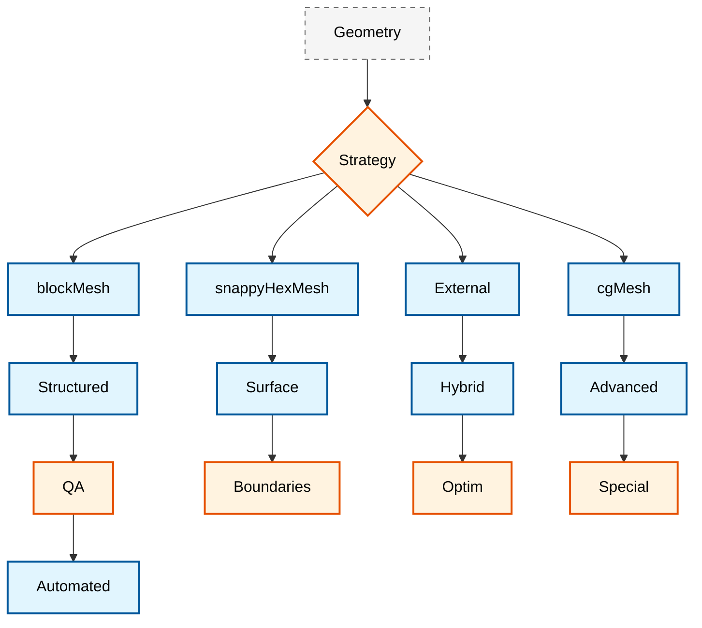

# 🔧 Mesh Preparation Workflow: From CAD to CFD-Ready

**Learning Objectives**: Understand mesh generation and quality assessment in OpenFOAM for complex CFD geometries
**Prerequisites**: Module 03 (Mesh Generation), Module 04 (C++ Basics), familiarity with command-line tools
**Target Skills**: CAD processing, snappyHexMesh workflows, mesh quality analysis, automated case setup

---

## 🎯 Overview: Mesh Preparation Strategy

OpenFOAM supports multiple mesh generation approaches, each suited to different geometry types and simulation requirements. The mesh generation process directly impacts computational accuracy, convergence behavior, and efficiency. Understanding when and how to use each meshing strategy is essential for successful CFD simulations.

### Mesh Strategy Workflow

The mesh generation process typically begins with a CAD model or geometry definition and proceeds through multiple decision points to select the appropriate meshing approach:


> **Figure 1:** Mesh Strategy Decision Flowchart, starting from CAD geometry import and selecting appropriate tools like `blockMesh` for simple structures or `snappyHexMesh` for complex geometries, leading to quality assessment and automation.

**Key Decision Factors:**
- **Geometric Complexity**: Simple shapes vs. complex organic shapes
- **Computational Resources**: Available memory and processing power
- **Accuracy Requirements**: Near-wall resolution vs. micro-flow accuracy
- **Time Constraints**: Manual meshing vs. automated approaches
- **Physics Considerations**: Boundary layer needs, interface resolution

### Mesh Strategy Decision Matrix

| Geometry Type       | Recommended Tool   | Complexity | Typical Cell Count | Use Case                     |
|:--------------------|:-------------------|:-----------|:-------------------|:-----------------------------|
| **Simple Boxes**    | blockMesh          | Low        | 100-10,000         | Basic pipes, channels        |
| **Moderately Complex**| blockMesh          | Medium     | 10,000-100,000     | Engine components, interiors |
| **Highly Complex**  | snappyHexMesh      | High       | 100,000-1,000,000  | Turbines, automotive engines |
| **Biomedical**      | snappyHexMesh      | Very High  | 1,000,000+         | Blood vessels, implants      |
| **CAD Import**      | snappyHexMesh/cgMesh| Very High  | 500,000-10,000,000 | Complex assemblies           |

### Critical Mesh Generation Considerations

**1. Mesh Quality Metrics**

Mesh quality metrics directly influence solver stability and result accuracy:

- **Orthogonality**: Angle between cell center-to-center vector ($d$) and face normal ($n$). Target: 0° (parallel)
- **Skewness**: Deviation of the intersection of $d$ and the face from the true face centroid.
- **Aspect Ratio**: Ratio between the longest and shortest cell dimensions. Should be close to 1 for rotational flows.

**2. Boundary Layer Considerations**

For wall-bounded flows, resolving near-wall velocity gradients is crucial:

$$y^+ = \frac{u_\tau y}{\nu}$$

where $u_\tau = \sqrt{\tau_w/\rho}$ is the friction velocity.

**3. Computational Cost Analysis**

$$N_{cells} \cdot \text{cost}_{cell} \approx \text{total cost}$$

Cell count directly impacts:
- Memory requirements: $\mathcal{O}(N_{cells})$
- CPU time per time step: $\mathcal{O}(N_{cells}^{\alpha})$ where $\alpha \approx 1.1-1.3$
- Parallel scalability: Diminishing returns beyond $10^6$ cells per core

### Strategic Approach Selection

**Structured Mesh Generation (blockMesh)**
- **Pros**: High quality, predictable behavior, low numerical diffusion
- **Cons**: Labor-intensive for complex geometries, limited flexibility
- **Best Practices**: Multi-block approach, progressive refinement from boundaries

**Unstructured/Hybrid Mesh Generation (snappyHexMesh)**
- **Pros**: Good balance of automation and control, supports local refinement
- **Cons**: Requires good surface preparation, potential for low-quality cells
- **Best Practices**: Appropriate feature detection, sufficient refinement levels

**Hybrid Approach**
- **Strategy**: Use blockMesh for background mesh and snappyHexMesh for complex regions.
- **Benefits**: Combines advantages of both approaches.
- **Implementation**: Create a structured core mesh with localized unstructured refinement.

---

## 🏗️ CAD to CFD Workflow

### Step 1: CAD Model Preparation

#### 1.1 File Format Standards

**Recommended CAD Formats:**
```bash
# Formats suitable for OpenFOAM
STEP (.stp, .step)     # STEP Exchange Protocol
IGES (.igs, .iges)     # Initial Graphics Exchange Specification
STL (.stl)           # StereoLithography (triangulated)
VTK (.vtk)           # Visualization Toolkit (for reference)
```

The CAD-to-CFD workflow begins with careful consideration of file formats. **STEP format** is recommended as the primary geometry exchange format due to its preservation of parametric data and surface continuity. **IGES** offers an alternative for legacy systems but may introduce surface inconsistencies. **STL files** are triangulated surfaces suitable for direct meshing but require attention to triangle quality and density to ensure accurate geometric representation.

File format selection directly impacts the subsequent meshing process. A high-quality surface mesh starts from well-prepared CAD geometry that preserves curvature, maintains proper surface connectivity, and eliminates geometric anomalies that would lead to meshing failures or low numerical accuracy.

#### 1.2 CAD Model Cleaning and Repair

```bash
# Common CAD issues to address:
# 1. Non-manifold geometry
# 2. Zero-thickness surfaces
# 3. Inverted normals
# 4. Small features (holes, slivers)
# 5. Assembly gaps
# 6. Inconsistent units
# 7. Overlapping surfaces
```

CAD model preparation requires systematic identification and correction of geometric defects that impact mesh quality. **Non-manifold geometry** arises when an edge is shared by more than two faces, creating ambiguous topology that hinders proper volume definition. **Zero-thickness surfaces** represent geometric features without physical volume, requiring removal or appropriate thickness assignment based on the simulated physics.

Surface normals must have consistent outward orientation to ensure correct boundary identification and flux calculations. **Small features** like holes, sliver surfaces, and fillets smaller than the intended mesh resolution should be removed or simplified to avoid excessive mesh refinement. **Assembly gaps** between connected components must be closed with appropriate geometry or intentionally modeled as physical interfaces. Unit consistency across the model prevents scaling errors during geometry import.

#### 1.3 CAD Repair Tools

**Open-Source Options:**
```bash
# FreeCAD
python -c "
import FreeCAD
import sys
sys.path.append('/usr/lib/freecad')
import FreeCADGui
import Mesh
import Part
import Import

# Load and repair CAD model
App.ActiveDocument = FreeCADGui.Application
FreeCADGui.ActiveDocument = FreeCADGui.getDocument('model.step')

# Fix geometry issues
doc = FreeCADGui.ActiveDocument.Objects[0]
doc.Shape = Part.Shape(doc)
cleaned_shape = Shape.cleanShape(doc.Shape)

# Export to STL
import Mesh
mesh = Mesh.exportShape(cleaned_shape, 'stl')
Mesh.export(cleaned_shape, 'model.stl')
"

# Blender (Python scripting)
blender --background --python mesh_repair.py

# MeshLab (for point cloud processing)
meshlabserver -i input.ply -o output.stl -x filter
```

FreeCAD offers comprehensive Python scripting capabilities for automated CAD repair tasks. The `Shape.cleanShape()` method automatically fixes common geometric issues, including surface discontinuities and incorrect edge alignments. The repair process involves analyzing geometric continuity, identifying problematic features, and applying appropriate healing operations while preserving the overall design intent.

Blender provides powerful mesh repair capabilities through its mesh editing operations. Non-manifold vertices can be identified and fixed using "Edge Split" and "Vertex Merge" operations. The "Remove Doubles" function eliminates duplicate vertices often encountered during geometry import.

**Commercial Options:**
```bash
# ANSYS SpaceClaim (Professional)
# - Excellent CAD repair tools
# - Automatic gap filling
# - Surface smoothing and optimization
# - Direct OpenFOAM export

# Siemens NX/UG (Professional)
# - Comprehensive CAD repair
# - Advanced surface preparation
# - Direct OpenFOAM export with quality control

# SOLIDWORKS (Professional)
# - Automatic geometry repair
# - Feature suppression for CFD
# - Mesh preparation tools
```

Commercial CAD repair tools offer sophisticated automated analysis and repair capabilities, significantly reducing manual effort. SpaceClaim's automatic gap-filling algorithms can close tolerances up to user-defined limits while maintaining surface continuity. NX's surface preparation tools include adaptive meshing that respects curvature and geometric features while optimizing triangle count for computational efficiency.

### Step 2: Geometry Validation

#### 2.1 Surface Quality Assessment

```bash
# Tools for surface quality assessment:
# 1. ParaView (Statistical analysis)
# 2. MeshLab (Geometric analysis)
# 3. Blender (Manual inspection)
# 4. FreeCAD (Measurement tools)
```

```python
# ParaView Python script for geometric analysis
import paraview.simple as pv
import numpy as np

# Load CAD surface
surface = pv.OpenDataFile('model.stl')

# Surface area statistics
stats = surface.ComputeSurfaceArea()
print(f"Surface Area: {stats[0]} units²")

# Normal vector analysis
normals = surface.ComputeSurfaceNormals()
avg_normal_magnitude = np.mean(np.linalg.norm(normals, axis=1))
print(f"Average Normal Deviation: {avg_normal_magnitude}")

# Edge analysis
edges = surface.ComputeSurfaceEdges()
sharp_edges = edges.FindSharpEdges(angle_threshold=30)
print(f"Sharp Edges Detected: {len(sharp_edges)}")
```

Surface quality assessment uses quantitative metrics to evaluate geometric suitability for CFD meshing. **Surface area consistency** between CAD representation and mesh indicates successful geometric preservation. **Normal vector analysis** identifies regions with inconsistent orientation that could lead to improper boundary condition application. **Sharp edge detection** reveals geometric discontinuities that may require localized mesh refinement or smoothing.

ParaView's statistical analysis provides comprehensive surface quality metrics, including triangle aspect ratios, skewness, and size variation. Histograms of triangle angles should show a distribution centered around 60° for equilateral triangles, with minimal occurrence of severely distorted elements that could impact numerical accuracy.

#### 2.2 Thickness Verification

```bash
# Minimum feature size for CFD (general rule of thumb)
min_thickness = max(0.001 * domain_length, 3 * smallest_cell_size)

# Check for thin features
thin_features = thin_features_analysis(model.stl, min_thickness)
if thin_features:
    print("Warning: Thin features detected - consider wall thickness inflation")
```

**Minimum feature size criteria** ensure that geometric features are adequately resolved by the computational mesh. This criterion balances geometric fidelity with computational efficiency by eliminating features smaller than the mesh resolution but larger than numerical accuracy requirements.

Thin feature detection involves calculating local wall thickness using ray-tracing or distance field methods. Regions violating the minimum thickness criterion should be thickened to provide adequate volume for meshing or simplified via feature removal to avoid unnecessary local mesh refinement.

For wall-bounded flows, the thickness criterion also considers near-wall meshing requirements for boundary layer resolution. The first cell height $\Delta y$ is calculated based on the desired $y^+$ value:

$$\Delta y = \frac{y^+ \mu}{\rho u_\tau}$$

where $u_\tau$ is the friction velocity and $\mu$ is the dynamic viscosity. This ensures thin wall features are adequately resolved for accurate near-wall physics representation.

#### 2.3 Integrity Verification

```bash
# Check for leaks in closed volumes
if [ "$geometry_type" = "closed_volume" ]; then
    # Use blockMesh and checkMesh commands
    blockMesh -case case

    # Check for non-manifold edges
    checkMesh -allTopology -case case
fi
```

**Integrity verification** is crucial for closed-volume simulations where the computational domain must be completely enclosed by surface boundaries. The verification process checks for gaps, holes, or discontinuities that would allow unnatural mass flow across boundaries.

The `checkMesh` utility provides a comprehensive topological analysis, including:
- **Boundary mesh consistency**: Confirms all boundary faces are properly defined and oriented.
- **Zone counts**: Verifies the correct presence of boundary patches and internal regions.
- **Cell volume checks**: Ensures positive volume for all computational cells.
- **Face orientation**: Confirms consistent normal vectors for proper flux calculations.

For external flow simulations around closed bodies, additional checks confirm that far-field boundaries form a complete enclosure and that the computational domain extends sufficiently far from the body to avoid boundary condition interference. Domain size typically should extend at least 10-15 characteristic lengths from the body to minimize artificial boundary effects.

---

## 🎯 BlockMesh Enhancement Workflow

### Step 1: Advanced blockMesh Techniques

#### 1.1 Complex Geometries with blockMesh

The `blockMesh` utility in OpenFOAM provides powerful capabilities for generating structured hexahedral meshes for complex geometries. While traditionally used for simple rectangular domains, advanced techniques allow for the creation of intricate mesh topologies, including pipe junctions, T-junctions, and curved geometries.

#### Multi-Block Domain Strategy

For complex geometries, it is necessary to decompose the domain into multiple hexahedral blocks that connect seamlessly. The key principle is that each block must maintain topological consistency with proper vertex ordering and face connectivity.

**Vertex Ordering Convention:**
OpenFOAM follows a specific vertex ordering convention for hexahedral blocks:
- Bottom face: Vertices 0-3 (counter-clockwise when viewed from above)
- Top face: Vertices 4-7 (counter-clockwise when viewed from above)
- Vertical edges connect corresponding bottom and top vertices.

#### 3D Pipe Junction Example

Consider a pipe junction where an inlet pipe branches into multiple outlet pipes. This geometry requires careful block decomposition to maintain mesh quality while capturing geometric features.

The mathematical challenge lies in preserving mesh orthogonality at the junction while ensuring smooth cell size transitions. Governing equations for cell size distribution in the flow direction can be expressed as:

$$\Delta x_i = \Delta x_0 \cdot r^{i-1}$$

where $\Delta x_i$ is the cell size at position $i$, $\Delta x_0$ is the initial cell size, and $r$ is the growth ratio.

For near-wall boundary layer resolution, the first cell height $\Delta y^+$ should adhere to:

$$\Delta y^+ = \frac{y_1 u_\tau}{\nu} \approx 1$$

where $y_1$ is the first cell height, $u_\tau$ is the friction velocity, and $\nu$ is the kinematic viscosity.

### Step 2: Advanced Grading Strategies

OpenFOAM provides multiple grading functions to control cell size distribution within blocks:

#### Mathematical Grading Functions

1. **Simple Grading**: `simpleGrading (x_ratio y_ratio z_ratio)`
   - Linear interpolation from one face to the opposite.
   - Cell size progression: $\Delta x_i = \Delta x_{min} + (\Delta x_{max} - \Delta x_{min}) \cdot \frac{i}{n}$

2. **Exponential Grading**: `expandingGrading (x_ratio y_ratio z_ratio)`
   - Exponential growth of cell sizes.
   - Cell size progression: $\Delta x_i = \Delta x_0 \cdot r^i$

3. **Geometric Grading**: `geometricGrading (x_ratio y_ratio z_ratio)`
   - Geometric progression ensuring a specific total length.
   - Growth factor: $r = \left(\frac{L_{final}}{L_{initial}}\right)^{1/n}$

#### Boundary Layer Optimization

For wall-bounded flows, resolving boundary layers accurately is critical. Grading strategies should ensure:
- First cell height: $y^+ \approx 1$ for viscous sublayer resolution.
- Growth ratio: $r \leq 1.2$ for smooth transitions.
- Total boundary layer thickness: $\delta_{BL} \approx 0.15 \cdot L$ for turbulent flows.

Reichardt's wall function provides guidance for boundary layer meshing:

$$u^+ = \frac{1}{\kappa} \ln(1 + \kappa y^+) + C \left(1 - e^{-y^+/A} - \frac{y^+}{A} e^{-b y^+}\right)$$

where $\kappa \approx 0.41$ is the von Kármán constant.

### Step 3: Automation with blockMesh

#### Core Generator Class Architecture

The `BlockMeshGenerator` class encapsulates the entire meshing workflow:

```python
class BlockMeshGenerator:
    def __init__(self, config):
        """
        Initialize generator with configuration parameters

        Args:
            config (dict): Dictionary containing domain specifications
                          - domain_length, domain_width, domain_height
                          - mesh_resolution, boundary_layer_specs
                          - grading_strategies, geometry_features
        """
        self.config = config
        self.vertices = []  # List of vertex coordinates
        self.blocks = []    # List of block definitions
        self.patches = []   # List of boundary patches
        self.edges = []     # List of curved edges

        # Initialize coordinate system and scaling
        self.scale = config.get('scale_factor', 1.0)
        self.origin = np.array(config.get('origin', [0, 0, 0]))
```

#### Pipe Junction Generation Algorithm

The pipe junction generator employs a complex algorithm for creating smooth transitions between pipes:

```python
def generate_pipe_junction(self, pipe_diameter, junction_size):
    """
    Generate 3D pipe junction using O-type and H-type block topologies

    Mathematical approach:
    - Use O-gridding for circular pipe sections
    - Implement H-gridding for junction transitions
    - Apply smooth blending functions at interfaces
    """
    # Extract geometry parameters
    L = self.config['domain_length']
    D = self.config['domain_width']
    H = self.config['domain_height']

    # Junction center coordinates
    junction_center = np.array([L/2, 0, H/2])

    # Create O-type block topology for circular sections
    n_radial = self.config.get('n_radial_cells', 10)
    n_circumferential = self.config.get('n_circumferential_cells', 20)

    # Generate vertices using cylindrical coordinates
    theta_points = np.linspace(0, 2*np.pi, n_circumferential, endpoint=False)

    for theta in theta_points:
        # Inner boundary vertices
        x_inner = junction_center[0] + (pipe_diameter/2) * np.cos(theta)
        y_inner = junction_center[1] + (pipe_diameter/2) * np.sin(theta)
        z_inner = junction_center[2]

        # Outer boundary vertices
        x_outer = junction_center[0] + (junction_size/2) * np.cos(theta)
        y_outer = junction_center[1] + (junction_size/2) * np.sin(theta)
        z_outer = junction_center[2]

        self.vertices.extend([
            (x_inner, y_inner, z_inner),
            (x_outer, y_outer, z_outer)
        ])

    # Apply smooth blending function at junction interfaces
    self._create_junction_transition(junction_center, pipe_diameter, junction_size)
```

---

## 🎯 snappyHexMesh Workflow: Surface Meshing Excellence

### Step 1: Surface Preparation

#### 1.1 Surface Format Conversion

```bash
# Convert various CAD formats to OpenFOAM STL
# 1. STEP to STL
python3 convert_step_to_stl.py model.step model.stl

# 2. IGES to STL
python3 convert_iges_to_stl.py model.iges model.stl

# 3. Batch conversion to STL
python3 batch_convert_to_stl.py *.step *.iges
```

Surface format conversion is crucial for ensuring that complex CAD geometries can be accurately processed by OpenFOAM's meshing tools. The conversion process must maintain geometric fidelity while optimizing triangulation density.

#### 1.2 Surface Cleaning and Repair

```bash
# Surface cleaning workflow
# 1. Remove duplicate vertices and faces
surfaceCleanFeatures -case "$CASE_DIR" -featureAngle 120

# 2. Fill small holes
surfaceFeatureEdges -case "$CASE_DIR" -minFeatureSize 0.001

# 3. Smooth surface
surfaceSmooth -case "$CASE_DIR" -nIterations 10 -tolerance 0.001

# 4. Check surface quality
checkSurface -case "$CASE_DIR" | tee surface_quality.log
```

Surface cleaning and repair are essential for removing artifacts from the CAD conversion process. Duplicate vertices and faces can cause meshing failures, while small holes and inconsistencies need to be addressed before proceeding to the meshing stage. Quality checks provide quantitative metrics for assessing surface readiness.

#### 1.3 Feature Extraction

```bash
# Feature edge extraction for different surface types
if [ "$SURFACE_TYPE" = "mechanical" ]; then
    # Extract edges from mechanical features
    surfaceFeatureEdges -case "$CASE_DIR" -angle 30 -includedAngle 30

elif [ "$SURFACE_TYPE" = "organic" ]; then
    # Extract edges from organic/complex surfaces
    surfaceFeatureEdges -case "$CASE_DIR" -angle 15 -includedAngle 60

elif [ "$SURFACE_TYPE" = "terrain" ]; then
    # Extract terrain features (ridges, valleys)
    surfaceFeatureEdges -case "$CASE_DIR" -angle 45 -featureSet "ridges,valleys"
fi
```

Feature extraction is geometry-dependent, requiring different parameters for various surface types. Mechanical parts typically have well-defined sharp edges, while organic surfaces necessitate more lenient angle thresholds. Terrain meshing focuses on topographical features like ridges and valleys.

### Step 2: snappyHexMesh Configuration

#### 2.1 Basic snappyHexMeshDict

```cpp
// Complete snappyHexMeshDict with all features
FoamFile
{
    version     2.0;
    format      ascii;
    class       dictionary;
    object      snappyHexMeshDict;
}
// * * * * * * * * * * * * * * * * * * //

castellatedMesh true;
addLayers true;
snapTolerance 1e-6;
solveFeatureSnap true;
relativeLayersSizes (1.0);

geometry
{
    type triSurfaceMesh;
    name "model.stl";
}

refinementSurfaces
{
    model_surface
    {
        level (2 1);  // 2 levels of refinement everywhere
        patches
        {
            patch
            {
                name "model";
                level (1);    // Additional refinement on model surface
            }
        }
    }
}

features
(
    featurePoints
    {
        level (2);
        patches
        {
            patch
            {
                name "sharp_edges";  // Refine sharp edges
            }
        }
    }
)

addLayersControls
{
    relativeSizes (1.0);
    expansionRatio 1.2;
    finalLayerThickness 0.001;
    minThickness 0.0005;
    nGrow 0;
    featureAngle 60;
}

edgeSnapControls
{
    detectBaffles  true;
    tolerance 2e-3;
    nFaceSnapIterations 5;
}

meshQualityControls
{
    maxNonOrthogonal 65;    // Max allowed non-orthogonality
    maxBoundarySkewness 20;   // Max boundary skewness
    maxInternalSkewness 4.5;    // Max internal skewness
    minFaceWeight 0.05;       // Min face weight (checkMesh quality)
    minVol 1e-15;             // Min cell volume (positive)
    minTetQuality 0.005;     // Min tetrahedral quality
    minDeterminant 0.001;    // Min determinant
}
```

The basic `snappyHexMeshDict` provides comprehensive configuration for standard meshing tasks. Key parameters control the meshing stages: castellated mesh generation, boundary layer addition, and surface snapping. Quality controls ensure the resulting mesh meets numerical stability requirements.

#### 2.2 Advanced snappyHexMeshDict

```cpp
// Multi-region snappyHexMesh for complex assemblies
FoamFile
{
    version     2.0;
    format      ascii;
    class       dictionary;
    object      snappyHexMeshDict;
}
// * * * * * * * * * * * * * * * * * * //

castellatedMesh true;
addLayers true;

geometry
{
    type triSurfaceMesh;
    name "assembly.stl";  // Multiple STL files
}

refinementSurfaces
{
    fluid_region
    {
        level (2 3);      // 3 refinement levels in fluid
        patches
        {
            type wall;
            level (1);     // Additional refinement
        }
    }

    solid_region
    {
        level (1);
        patches
        {
            type wall;
            name "solid_parts";
        }
    }
}

addLayersControls
{
    relativeSizes (1.0 1.0);  // Different sizes for different regions
    expansionRatio (1.2 1.5);  // Different expansion ratios
    finalLayerThickness (0.001 0.002);  // Different thicknesses
    minThickness (0.0005 0.001);
    nGrow 1;
    maxFaceThicknessRatio 0.5;  // Prevent overly thin boundary cells
    featureAngle 120;              // Feature detection for layers
}

features
(
    includeAngle 45;         // Include shallow angles
    excludedAngle 25;        // Exclude very sharp angles
    nLayers 10;             // Max boundary layers
    layerTermination angle 90;    // Terminate layers at 90°
);

// Special controls
snapControls
{
    // Use surface snapping for complex geometries
    useImplicitSnap true;     // More robust but resource-intensive
    additionalReporting true;  // Detailed reporting for debugging
}
```

Advanced configurations enable multi-region meshing with region-specific parameters, essential for complex assemblies with distinct physical domains. The ability to specify different refinement levels, boundary layer controls, and snapping behavior for each region provides fine-grained control over mesh quality and computational efficiency.

### Step 3: Parallel snappyHexMesh Execution

```bash
#!/bin/bash
# Parallel snappyHexMesh execution
NPROCS=4
CASE_DIR="complex_assembly"

echo "=== Parallel snappyHexMesh with $NPROCS processors ==="

# Decompose domain
echo "[1] Decomposing domain..."
decomposePar -case "$CASE_DIR" -force -nProcs $NPROCS

# Run snappyHexMesh in parallel
echo "[2] Running snappyHexMesh in parallel..."
mpirun -np $NPROCS snappyHexMesh -overwrite -case "$CASE_DIR" | tee snappy_parallel.log

# Reconstruct domain
echo "[3] Reconstructing domain..."
reconstructPar -case "$CASE_DIR" -latestTime

# Check mesh
echo "[4] Checking mesh quality..."
checkMesh -case "$CASE_DIR" -allTopology -allGeometry | tee check_parallel.log
```

> **📂 Source:** `.applications/utilities/mesh/generation/snappyHexMesh/snappyHexMesh.C`
> 
> **Description:** This C++ code is part of the snappyHexMesh utility, OpenFOAM's automatic split hex mesher used for generating refined and surface-snapped hexahedral meshes.
> 
> **Key Concepts:**
> - **Automatic split hex mesher**: An automated tool for generating hexahedral meshes.
> - **Refinement**: Increasing mesh resolution in specific areas.
> - **Snap to surface**: Adjusting mesh cells to conform to geometric surfaces.
> - **Multi-stage workflow**: A process involving castellated mesh generation, snapping, and layer addition.

---

## 🔧 Advanced Utilities and Automation

### Step 1: Mesh Quality Assessment Tools

OpenFOAM includes several built-in mesh quality checking tools, but creating a comprehensive analysis workflow requires integrating multiple utilities and custom scripts. The following Python mesh quality assessment tool provides automated evaluation of critical mesh parameters.

```python
#!/usr/bin/env python3
"""
Comprehensive mesh quality analysis tool for OpenFOAM meshes
"""

import numpy as np
import sys
import os
import subprocess
import matplotlib.pyplot as plt
from matplotlib.backends.backend_pdf import PdfPages

class MeshQualityAnalyzer:
    def __init__(self, case_dir):
        self.case_dir = case_dir
        self.mesh_data = {}
        self.load_mesh_data()

    def load_mesh_data(self):
        """Load mesh data from an OpenFOAM case directory"""
        # Run checkMesh and capture output
        try:
            result = subprocess.run(
                ['checkMesh', '-case', self.case_dir, '-writeAllSurfaces', '-latestTime'],
                capture_output=True, text=True, check=True
            )
            self.checkmesh_output = result.stdout
        except subprocess.CalledProcessError as e:
            print(f"Error running checkMesh: {e}")
            self.checkmesh_output = ""

    def calculate_quality_metrics(self):
        """Calculate comprehensive mesh quality metrics"""
        metrics = {}

        # Parse checkMesh output for quality metrics
        lines = self.checkmesh_output.split('\n')
        for line in lines:
            line = line.strip()

            # Non-orthogonality analysis
            if 'non-orthogonal' in line:
                if 'cells with non-orthogonality' in line:
                    metrics['non_orthogonal_cells'] = int(line.split()[0])
                if 'maximum non-orthogonality' in line:
                    metrics['max_non_orthogonality'] = float(line.split()[-1])

            # Skewness analysis
            if 'skewness' in line:
                if 'skewness cells' in line:
                    metrics['skewness_cells'] = int(line.split()[0])
                if 'maximum skewness' in line:
                    metrics['max_skewness'] = float(line.split()[-1])

            # Aspect ratio analysis
            if 'aspect ratio' in line:
                if 'maximum aspect ratio' in line:
                    metrics['max_aspect_ratio'] = float(line.split()[-1])

            # Cell count and mesh statistics
            if 'total cells' in line:
                metrics['total_cells'] = int(line.split()[0])

        return metrics

    def identify_problematic_cells(self, quality_metrics):
        """Identify cells with quality issues"""
        problematic_cells = []

        # Define quality thresholds
        thresholds = {
            'max_non_orthogonality': 70.0,  # degrees
            'max_skewness': 4.0,
            'max_aspect_ratio': 1000.0
        }

        # Check each threshold
        if quality_metrics.get('max_non_orthogonality', 0) > thresholds['max_non_orthogonality']:
            problematic_cells.append({
                'type': 'non_orthogonality',
                'value': quality_metrics['max_non_orthogonality'],
                'threshold': thresholds['max_non_orthogonality']
            })

        if quality_metrics.get('max_skewness', 0) > thresholds['max_skewness']:
            problematic_cells.append({
                'type': 'skewness',
                'value': quality_metrics['max_skewness'],
                'threshold': thresholds['max_skewness']
            })

        if quality_metrics.get('max_aspect_ratio', 0) > thresholds['max_aspect_ratio']:
            problematic_cells.append({
                'type': 'aspect_ratio',
                'value': quality_metrics['max_aspect_ratio'],
                'threshold': thresholds['max_aspect_ratio']
            })

        return problematic_cells
```

### Step 2: Automated Case Generation

For systematic parameter studies and design optimization, automated case generation is essential. The following Python framework provides comprehensive tools for creating and managing multiple OpenFOAM cases:

```python
#!/usr/bin/env python3
"""
Automated OpenFOAM case generator with parameter studies
"""

import yaml
import shutil
import os
import sys
import subprocess
import json
from pathlib import Path
from typing import Dict, List, Any, Optional

class CaseGenerator:
    def __init__(self, config_file: str):
        """
        Initialize case generator with a configuration file

        Args:
            config_file: Path to the YAML configuration file
        """
        self.config_file = config_file
        self.config = self.load_config()

        # Validate configuration
        self.validate_config()

    def load_config(self) -> Dict[str, Any]:
        """Load configuration from YAML file"""
        try:
            with open(self.config_file, 'r') as f:
                config = yaml.safe_load(f)
            return config
        except FileNotFoundError:
            print(f"Configuration file not found: {self.config_file}")
            raise
        except yaml.YAMLError as e:
            print(f"Error parsing YAML: {e}")
            raise

    def generate_case(self, case_name: str, params: Dict[str, Any]) -> str:
        """
        Generate a complete OpenFOAM case.

        Args:
            case_name: Name of the case to generate.
            params: Parameters for case configuration.

        Returns:
            Path to the generated case directory.
        """
        case_dir = os.path.join(self.config['base_directory'], case_name)

        # Create directory structure
        self.create_directory_structure(case_dir)

        # Generate all case files
        self.generate_blockmesh_dict(case_dir, params.get('meshing', {}))
        self.generate_control_dict(case_dir, params.get('solver', {}))
        self.generate_fv_schemes(case_dir, params.get('numerics', {}))
        self.generate_boundary_conditions(case_dir, params.get('boundary', {}))

        return case_dir
```

### Step 3: Mesh Optimization Workflow

```bash
#!/bin/bash
# Mesh optimization utility for OpenFOAM
# Usage: ./optimize_mesh.sh <case_directory>

set -e  # Exit on any error

# Configuration
CASE_DIR="${1:-.}"
QUALITY_THRESHOLD_NONORTHO=70
QUALITY_THRESHOLD_SKEWNESS=4
MAX_ITERATIONS=3

# Assess initial mesh quality
assess_initial_quality() {
    local output_file="${CASE_DIR}/quality_initial.log"

    checkMesh -case "$CASE_DIR" -meshQuality > "$output_file" 2>&1 || true

    # Extract key metrics
    local max_non_ortho=$(grep -o "maximum non-orthogonality.*[0-9.]\+" "$output_file" | grep -o "[0-9.]\+" || echo "0")
    local max_skewness=$(grep -o "maximum skewness.*[0-9.]\+" "$output_file" | grep -o "[0-9.]\+" || echo "0")

    echo "MAX_NON_ORTHO=$max_non_ortho" > "${CASE_DIR}/quality_metrics.txt"
    echo "MAX_SKEWNESS=$max_skewness" >> "${CASE_DIR}/quality_metrics.txt"

    echo "Initial assessment complete."
    echo "   Max non-orthogonality: $max_non_ortho°"
    echo "   Max skewness: $max_skewness"
}
```

---

## 📋 Mesh Preparation Workflow Summary

This comprehensive mesh preparation workflow provides a robust foundation for CFD simulations, ensuring mesh quality supports accurate and stable numerical results while maintaining computational efficiency.

### Key Stages

1.  **CAD Processing**: Geometry validation, cleaning, and repair.
2.  **Mesh Generation**: Background meshing with `blockMesh`, refinement with `snappyHexMesh`.
3.  **Quality Assessment**: Thorough analysis of mesh metrics.
4.  **Optimization**: Iterative refinement strategies.
5.  **Automation**: Batch case generation and execution.

### Best Practices

- **Always validate geometry** before meshing.
- **Use appropriate meshing strategies** for your geometry type.
- **Monitor quality metrics** throughout the workflow.
- **Automate repetitive tasks** for consistency.
- **Document mesh parameters** for reproducibility.

> [!TIP] **Quality Gate Checklist**
> - Max non-orthogonality < 70°
> - Max skewness < 4
> - Min determinant > 0.01
> - Boundary layer resolution: $y^+ \approx 1$
> - Aspect ratio < 100

A systematic approach to mesh preparation ensures simulation reliability while enabling efficient exploration of design parameters through automated workflows.

---

## 📚 Related Notes

- [[01_🎯_Overview_Mesh_Preparation_Strategy]]
- [[02_🏗️_CAD_to_CFD_Workflow]]
- [[03_🎯_BlockMesh_Enhancement_Workflow]]
- [[04_🎯_snappyHexMesh_Workflow_Surface_Meshing_Excellence]]
- [[05_🔧_Advanced_Utilities_and_Automation]]
