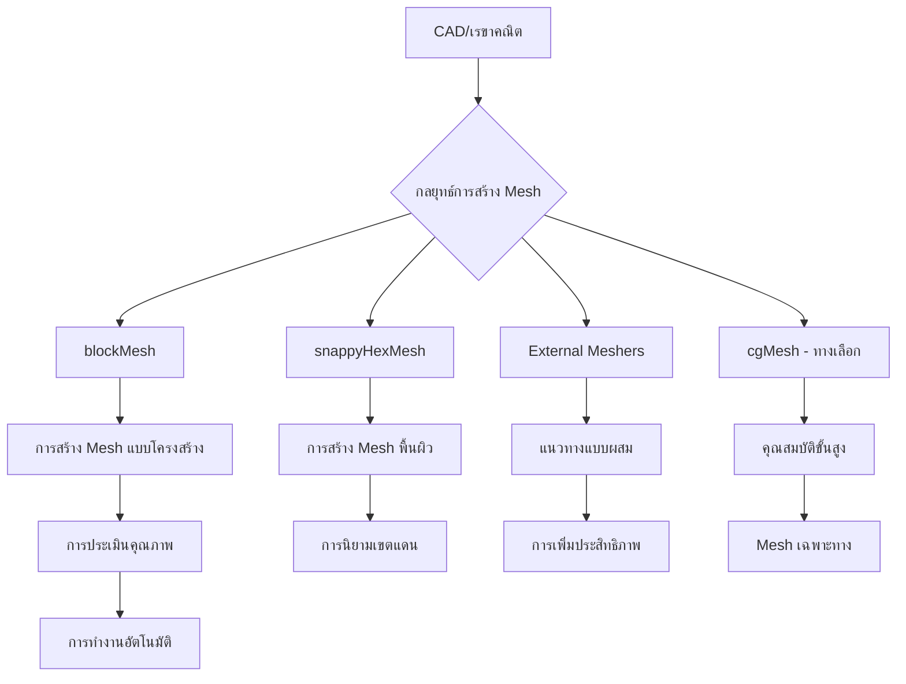

# 🔧 Mesh Preparation Workflow: From CAD to CFD-Ready

**Learning Objectives**: Understand mesh generation and quality assessment in OpenFOAM for complex CFD geometries
**Prerequisites**: Module 03 (Mesh Generation), Module 04 (C++ Basics), familiarity with command-line tools
**Target Skills**: CAD processing, snappyHexMesh workflows, mesh quality analysis, automated case setup

---

## 🎯 Overview: Mesh Preparation Strategy

OpenFOAM supports multiple mesh generation approaches, each suited to different geometry types and simulation requirements. The mesh generation process directly impacts computational accuracy, convergence behavior, and efficiency. Understanding when and how to use each meshing strategy is essential for successful CFD simulations.

### Mesh Strategy Workflow

The mesh generation process typically begins with a CAD model or geometry definition and proceeds through multiple decision points to select the appropriate meshing approach:


> **Figure 1:** แผนภูมิขั้นตอนการตัดสินใจเลือกกลยุทธ์การสร้างเมช (Mesh Strategy Workflow) โดยเริ่มจากการนำเข้าเรขาคณิต CAD และเลือกใช้เครื่องมือที่เหมาะสม เช่น `blockMesh` สำหรับโครงสร้างที่เรียบง่าย หรือ `snappyHexMesh` สำหรับเรขาคณิตที่ซับซ้อน เพื่อนำไปสู่การประเมินคุณภาพและการทำงานอัตโนมัติ

**ปัจจัยการตัดสินใจหลัก:**
- **ความซับซ้อนของเรขาคณิต**: รูปร่างง่ายเทียบกับรูปร่างออร์แกนิกที่ซับซ้อน
- **ทรัพยากรการคำนวณ**: หน่วยความจำและกำลังประมวลผลที่มีอยู่
- **ความต้องการความแม่นยำ**: ความละเอียดใกล้ผนังเทียบกับความแม่นยำของการไหลแบบจุลภาค
- **ข้อจำกัดด้านเวลา**: การสร้าง mesh ด้วยมือเทียบกับแนวทางอัตโนมัติ
- **พิจารณาทางฟิสิกส์**: ความต้องการของชั้นขอบเขต ความละเอียดของส่วนต่อประสาน

### Mesh Strategy Decision Matrix

| ประเภทเรขาคณิต | เครื่องมือที่แนะนำ | ความซับซ้อน | จำนวนเซลล์โดยทั่วไป | Use Case |
|:---:|:---:|:---:|:---:|:---|
| **กล่องง่ายๆ** | blockMesh | ต่ำ | 100-10,000 | ท่อ ช่องทางพื้นฐาน |
| **ค่อนข้างซับซ้อน** | blockMesh | กลาง | 10,000-100,000 | ส่วนประกอบเครื่องยนต์ ภายในอาคาร |
| **ซับซ้อนมาก** | snappyHexMesh | สูง | 100,000-1,000,000 | กังหัน เครื่องยนต์ยานยนต์ |
| **การแพทย์ชีววิทยา** | snappyHexMesh | สูงมาก | 1,000,000+ | เส้นเลือด อุปกรณ์ปลูกถ่าย |
| **นำเข้า CAD** | snappyHexMesh/cgMesh | สูงมาก | 500,000-10,000,000 | ชิ้นส่วนประกอบที่ซับซ้อน |

### ข้อควรพิจารณาในการสร้าง Mesh ที่สำคัญ

**1. เมทริกซ์คุณภาพ Mesh**

เมทริกซ์คุณภาพ mesh ส่งผลโดยตรงต่อความเสถียรของ solver และความแม่นยำของผลลัพธ์:

- **ออร์โธกอนัลลิตี**: มุมระหว่างเวกเตอร์เชื่อมจุดศูนย์กลางเซลล์ ($d$) และปกติของใบหน้า ($n$). เป้าหมาย: 0° (ขนาน)
- **ความเบ้**: ความเบี่ยงเบนของจุดตัดของ $d$ และใบหน้าจากจุดศูนย์กลางใบหน้าจริง
- **อัตราส่วนภาพ**: อัตราส่วนระหว่างมิติเซลล์ที่ยาวที่สุดและสั้นที่สุด ควรเข้าใกล้ 1 สำหรับการไหลแบบหมุน

**2. การพิจารณาชั้นขอบเขต**

สำหรับการไหลที่ถูกจำกัดด้วยผนัง การจับความเปลี่ยนแปลงความเร็วใกล้ผนังเป็นสิ่งสำคัญ:

$$y^+ = \frac{u_\tau y}{\nu}$$

โดยที่ $u_\tau = \sqrt{\tau_w/\rho}$ คือความเร็วแรงเสียดทาน

**3. การวิเคราะห์ต้นทุนการคำนวณ**

$$N_{cells} \cdot \text{cost}_{cell} \approx \text{total cost}$$

จำนวนเซลล์ส่งผลโดยตรงต่อ:
- ความต้องการหน่วยความจำ: $\mathcal{O}(N_{cells})$
- เวลา CPU ต่อขั้นเวลา: $\mathcal{O}(N_{cells}^{\alpha})$ โดย $\alpha \approx 1.1-1.3$
- ความสามารถในการทำงานขนาน: ผลตอบแทนที่ลดลงหลังจาก $10^6$ เซลล์ต่อคอร์

### การเลือกแนวทางเชิงกลยุทธ์

**การสร้าง Mesh แบบโครงสร้าง (blockMesh)**
- **ข้อดี**: คุณภาพสูง พฤติกรรมที่คาดการณ์ได้ การกระจายตัวเชิงตัวเลขน้อย
- **ข้อจำกัด**: ต้องการแรงงานสูงสำหรับเรขาคณิตที่ซับซ้อน ความยืดหยุ่นจำกุม
- **แนวทางปฏิบัติที่ดีที่สุด**: แนวทางหลายบล็อก การปรับปรุงความละเอียดจากขอบเขตอย่างก้าวหน้า

**การสร้าง Mesh กึ่งโครงสร้าง (snappyHexMesh)**
- **ข้อดี**: สมดุลที่ดีระหว่างการทำงานอัตโนมัติและการควบคุม รองรับการปรับปรุงความละเอียดเฉพาะที่
- **ข้อจำกัด**: ต้องการการเตรียมพื้นผิวที่ดี ศักยภาพสำหรับเซลล์คุณภาพต่ำ
- **แนวทางปฏิบัติที่ดีที่สุด**: การตรวจจับขอบคุณสมบัติที่เหมาะสม ระดับการปรับปรุงความละเอียดที่เพียงพอ

**แนวทางแบบผสม**
- **กลยุทธ์**: ใช้ blockMesh สำหรับพื้นหลังและ snappyHexMesh สำหรับบริเวณที่ซับซ้อน
- **ประโยชน์**: รวมข้อดีของทั้งสองแนวทาง
- **การนำไปใช้งาน**: สร้าง mesh แกนกลางแบบโครงสร้างพร้อมการปรับปรุงความละเอียดแบบไม่มีโครงสร้างเฉพาะที่

---

## 🏗️ CAD to CFD Workflow

### Step 1: CAD Model Preparation

#### 1.1 File Format Standards

**รูปแบบ CAD ที่แนะนำ:**
```bash
# รูปแบบที่เหมาะสำหรับ OpenFOAM
STEP (.stp, .step)     # STEP Exchange Protocol
IGES (.igs, .iges)     # Initial Graphics Exchange Specification
STL (.stl)           # StereoLithography (แบบสามเหลี่ยม)
VTK (.vtk)           # Visualization Toolkit (สำหรับอ้างอิง)
```

เวิร์กโฟลว์จาก CAD ไปสู่ CFD เริ่มต้นด้วยการพิจารณารูปแบบไฟล์อย่างรอบคอบ **รูปแบบ STEP** ถูกแนะนำเป็นรูปแบบหลักสำหรับการแลกเปลี่ยนเรขาคณิตเนื่องจากรักษาข้อมูลพาราเมตริกและรักษาความต่อเนื่องของพื้นผิว **IGES** ให้ทางเลือกสำหรับระบบเดิมแต่อาจแนะนำความไม่สม่ำเสมอของพื้นผิว **ไฟล์ STL** เป็นพื้นผิวแบบสามเหลี่ยมที่เหมาะสำหรับการสร้าง mesh โดยตรงแต่ต้องให้ความสนใจกับคุณภาพและความหนาแน่นของสามเหลี่ยมเพื่อให้มั่นใจว่าการแสดงผลเรขาคณิตถูกต้อง

การเลือกรูปแบบไฟล์ส่งผลโดยตรงต่อกระบวนการสร้าง mesh ในภายหลัง Surface mesh คุณภาพสูงเริ่มต้นจากเรขาคณิต CAD ที่เตรียมไว้อย่างดีซึ่งรักษาความโค้งงำ รักษาความเชื่อมต่อพื้นผิวที่เหมาะสม และกำจัดความผิดปกติทางเรขาคณิตที่จะนำไปสู่ความล้มเหลวในการสร้าง mesh หรือความถูกต้องเชิงตัวเลขที่ต่ำ

#### 1.2 การทำความสะอาดและซ่อมแซมแบบจำลอง CAD

```bash
# ปัญหา CAD ทั่วไปที่ต้องแก้ไข:
# 1. เรขาคณิต Non-manifold
# 2. พื้นผิวความหนาศูนย์
# 3. ปกติที่กลับด้าน
# 4. คุณสมบัติเล็กๆ (รู, ขอบ)
# 5. ช่องว่างแอสเซมบลี
# 6. หน่วยวัดที่ไม่สม่ำเสมอ
# 7. พื้นผิวที่ซ้อนทับกัน
```

การเตรียมแบบจำลอง CAD ต้องการการระบุและแก้ไขข้อบกพร่องทางเรขาคณิตอย่างเป็นระบบซึ่งกระทบต่อคุณภาพของ mesh **เรขาคณิต Non-manifold** เกิดขึ้นเมื่อขอบถูกใช้ร่วมกันโดยหน้ามากกว่าสองด้าน สร้างโทโพโลยีที่คลุมเครือซึ่งขัดขวางการนิยามปริมาตรที่เหมาะสม **พื้นผิวความหนาศูนย์** แสดงถึงคุณสมบัติทางเรขาคณิตโดยไม่มีปริมาตรทางกายภาพซึ่งต้องถูกลบออกหรือกำหนดความหนาที่เหมาะสมตามฟิสิกส์ที่กำลังจำลอง

ปกติของพื้นผิวต้องมีการวางแนวที่สม่ำเสมอไปด้านนอกเพื่อให้มั่นใจในการระบุเขตแดนและการคำนวณ flux ที่เหมาะสม **คุณสมบัติเล็กๆ** เช่น รู ขอบแหลม และฟิลเล็ตที่เล็กกว่าความละเอียด mesh ที่ตั้งใจควรถูกลบออกหรือทำให้ง่ายขึ้นเพื่อหลีกเลี่ยงการปรับปรุง mesh มากเกินไป **ช่องว่างแอสเซมบลี** ระหว่างส่วนประกอบที่เชื่อมต่อกันต้องถูกปิดด้วยเรขาคณิตที่เหมาะสมหรือจำลองอย่างตั้งใจเป็นส่วนติดต่อทางกายภาพ ความสม่ำเสมอของหน่วยทั่วทั้งแบบจำลองป้องกันข้อผิดพลาดในการปรับขนาดระหว่างการนำเข้าเรขาคณิต

#### 1.3 เครื่องมือซ่อมแซม CAD

**ตัวเลือกโอเพนซอร์ส:**
```bash
# FreeCAD
python -c "
import FreeCAD
import sys
sys.path.append('/usr/lib/freecad')
import FreeCADGui
import Mesh
import Part
import Import

# โหลดและซ่อมแซมแบบจำลอง CAD
App.ActiveDocument = FreeCADGui.Application
FreeCADGui.ActiveDocument = FreeCADGui.getDocument('model.step')

# แก้ไขปัญหาเรขาคณิต
doc = FreeCADGui.ActiveDocument.Objects[0]
doc.Shape = Part.Shape(doc)
cleaned_shape = Shape.cleanShape(doc.Shape)

# ส่งออกเป็น STL
import Mesh
mesh = Mesh.exportShape(cleaned_shape, 'stl')
Mesh.export(cleaned_shape, 'model.stl')
"

# Blender (สคริปต์ Python)
blender --background --python mesh_repair.py

# MeshLab (สำหรับประมวลผล point cloud)
meshlabserver -i input.ply -o output.stl -x filter
```

FreeCAD ให้ความสามารถในการสคริปต์ Python อย่างครอบคลุมสำหรับการทำงานซ่อมแซม CAD อัตโนมัติ เมธอด `Shape.cleanShape()` ซ่อมแซมปัญหาเรขาคณิตทั่วไปโดยอัตโนมัติรวมถึงความไม่ต่อเนื่องของพื้นผิวและการจัดแนวขอบที่ผิดปกติ กระบวนการซ่อมแซมเกี่ยวข้องกับการวิเคราะห์ความต่อเนื่องทางเรขาคณิต การระบุคุณสมบัติที่มีปัญหา และการใช้การดำเนินการฟื้นฟูที่เหมาะสมในขณะที่รักษาเจตนาการออกแบบโดยรวม

Blender มีความสามารถในการซ่อมแซม mesh อันทรงพลังผ่านการดำเนินการแก้ไข mesh จุดยอด non-manifold สามารถระบุและแก้ไขได้โดยใช้การดำเนินการ "Edge Split" และ "Vertex Merge" ฟังก์ชัน "Remove Doubles" กำจัดจุดยอดซ้ำซึ่งมักปรากฏระหว่างการดำเนินการนำเข้าเรขาคณิต

**ตัวเลือกเชิงพาณิชย์:**
```bash
# ANSYS SpaceClaim (ระดับมืออาชีพ)
# - เครื่องมือซ่อมแซม CAD ยอดเยี่ยม
# - การเติมช่องว่างอัตโนมัติ
# - การทำให้พื้นผิวเรียบและการปรับให้เหมาะสม
# - การส่งออก OpenFOAM โดยตรง

# Siemens NX/UG (ระดับมืออาชีพ)
# - การซ่อมแซม CAD อย่างครอบคลุม
# - การเตรียมพื้นผิวขั้นสูง
# - การส่งออก OpenFOAM โดยตรงพร้อมการควบคุมคุณภาพ

# SOLIDWORKS (ระดับมืออาชีพ)
# - การซ่อมแซมเรขาคณิตอัตโนมัติ
# - การยับยั้งคุณสมบัติสำหรับ CFD
# - เครื่องมือเตรียมพื้นผิว mesh
```

เครื่องมือซ่อมแซม CAD เชิงพาณิชย์ให้ความสามารถในการวิเคราะห์และซ่อมแซมอัตโนมัติที่ซับซ้อนซึ่งลดความพยายามด้วยตนเองอย่างมีนัยสำคัญ อัลกอริทึมการเติมช่องว่างอัตโนมัติของ SpaceClaim สามารถปิดค่าความอดทนถึงขีดจำกัดที่ผู้ใช้ระบุในขณะที่รักษาความต่อเนื่องของพื้นผิว เครื่องมือเตรียมพื้นผิวของ NX รวมถึงการสร้าง mesh แบบปรับตามสภาพซึ่งเคารพความโค้งงำและคุณสมบัติทางเรขาคณิตในขณะที่ปรับจำนวนสามเหลี่ยมเพื่อประสิทธิภาพการคำนวณ

### Step 2: การตรวจสอบความถูกต้องของเรขาคณิต

#### 2.1 การประเมินคุณภาพพื้นผิว

```bash
# เครื่องมือสำหรับตรวจสอบคุณภาพพื้นผิว:
# 1. ParaView (การวิเคราะห์ทางสถิติ)
# 2. MeshLab (การวิเคราะห์ทางเรขาคณิต)
# 3. Blender (การตรวจสอบด้วยตนเอง)
# 4. FreeCAD (เครื่องมือวัด)
```

```python
# สคริปต์ Python ของ ParaView สำหรับการวิเคราะห์เรขาคณิต
import paraview.simple as pv
import numpy as np

# โหลดพื้นผิว CAD
surface = pv.OpenDataFile('model.stl')

# สถิติพื้นที่ผิว
stats = surface.ComputeSurfaceArea()
print(f"พื้นที่ผิว: {stats[0]} หน่วย²")

# การวิเคราะห์ปกติ
normals = surface.ComputeSurfaceNormals()
avg_normal_magnitude = np.mean(np.linalg.norm(normals, axis=1))
print(f"ค่าเบี่ยงเบนปกติเฉลี่ย: {avg_normal_magnitude}")

# การวิเคราะห์ขอบ
edges = surface.ComputeSurfaceEdges()
sharp_edges = edges.FindSharpEdges(angle_threshold=30)
print(f"ตรวจพบขอบแหลม: {len(sharp_edges)}")
```

การประเมินคุณภาพพื้นผิวใช้เมตริกเชิงปริมาณเพื่อประเมินความเหมาะสมทางเรขาคณิตสำหรับการสร้าง mesh CFD **ความสม่ำเสมอของพื้นที่ผิว** ระหว่างการแสดงผล CAD และ mesh บ่งชี้ถึงการรักษาเรขาคณิตที่สำเร็จ **การวิเคราะห์เวกเตอร์ปกติ** ระบุภูมิภาคที่มีการวางแนวที่ไม่สม่ำเสมอซึ่งจะนำไปสู่การใช้เงื่อนไขขอบเขตที่ไม่เหมาะสม **การตรวจจับขอบแหลม** เผยให้เห็นความไม่ต่อเนื่องทางเรขาคณิตซึ่งอาจต้องการการปรับปรุง mesh ในท้องที่หรือการทำให้เรียบ

การวิเคราะห์ทางสถิติของ ParaView ให้เมตริกคุณภาพพื้นผิวอย่างครอบคลุมรวมถึงอัตราส่วนด้านสามเหลี่ยม ความเบ้ และความแปรผันของขนาด ฮิสโทแกรมของมุมสามเหลี่ยมควรแสดงการกระจายที่มีศูนย์กลางรอบ 60° สำหรับสามเหลี่ยมด้านเท่า โดยมีการเกิดขึ้นขององค์ประกอบที่บิดเบือนอย่างรุนแรงน้อยที่สุดซึ่งอาจกระทบต่อความถูกต้องเชิงตัวเลข

#### 2.2 การตรวจสอบความหนา

```bash
# ขนาดคุณสมบัติขั้นต่ำสำหรับ CFD (กฎเกณฑ์ทั่วไป)
min_thickness = max(0.001 * domain_length, 3 * smallest_cell_size)

# ตรวจสอบคุณสมบัติบาง
thin_features = thin_features_analysis(model.stl, min_thickness)
if thin_features:
    print("คำเตือน: ตรวจพบคุณสมบัติบาง - พิจารณาการเพิ่มความหนาผนัง")
```

**เกณฑ์ขนาดคุณสมบัติขั้นต่ำ** ทำให้มั่นใจว่าคุณสมบัติทางเรขาคณิตถูกแก้ไขอย่างเหมาะสมโดย computational mesh เกณฑ์นี้สมดุลระหว่างความซื่อตรงทางเรขาคณิตกับประสิทธิภาพการคำนวณโดยกำจัดคุณสมบัติที่เล็กกว่าความละเอียด mesh แต่ใหญ่กว่าความต้องการความถูกต้องเชิงตัวเลข

การตรวจจับคุณสมบัติบางเกี่ยวข้องกับการคำนวณความหนาผนังในท้องที่โดยใช้วิธี ray-tracing หรือ distance field ภูมิภาคที่ละเมิดเกณฑ์ความหนาขั้นต่ำควรถูกทำให้หนาขึ้นเพื่อสร้างปริมาตรที่เหมาะสมสำหรับการสร้าง mesh หรือทำให้ง่ายขึ้นผ่านการลบคุณสมบัติเพื่อหลีกเลี่ยงการปรับปรุง mesh ในท้องที่ที่ไม่จำเป็น

สำหรับการไหลของผนังขอบเขต เกณฑ์ความหนายังพิจารณาความต้องการ mesh ใกล้ผนังสำหรับการแก้ไขชั้นขอบเขต ความสูงของเซลล์แรก $\Delta y$ ถูกคำนวณตามค่า $y^+$ ที่ต้องการ:

$$\Delta y = \frac{y^+ \mu}{\rho u_\tau}$$

โดยที่ $u_\tau$ คือความเร็วแรงเสียดทานและ $\mu$ คือความหนืดแบบไดนามิก สิ่งนี้ทำให้มั่นใจว่าคุณสมบัติผนังบางถูกแก้ไขอย่างเหมาะสมสำหรับการแสดงผลฟิสิกส์ใกล้ผนังที่ถูกต้อง

#### 2.3 การตรวจสอบความสมบูรณ์

```bash
# ตรวจสอบการรั่วในเรขาคณิตปิด
if [ "$geometry_type" = "closed_volume" ]; then
    # ใช้คำสั่ง blockMesh checkMesh
    blockMesh -case case

    # ตรวจสอบขอบ non-manifold
    checkMesh -allTopology -case case
fi
```

**การตรวจสอบความสมบูรณ์** เป็นสิ่งสำคัญสำหรับการจำลองปริมาตรปิดซึ่งโดเมนการคำนวณต้องถูกปิดล้อมอย่างสมบูรณ์โดยเขตแดนพื้นผิว กระบวนการตรวจสอบตรวจสอบช่องว่าง รู หรือความไม่ต่อเนื่องซึ่งจะอนุญาตให้มีการไหลของมวลที่ไม่เป็นธรรมชาติข้ามเขตแดน

ยูทิลิตี `checkMesh` ให้การวิเคราะห์โทโพโลยีอย่างครอบคลุมรวมถึง:
- **ความสม่ำเสมอของ mesh เขตแดน**: ยืนยันว่าหน้าเขตแดนทั้งหมดถูกนิยามและวางแนวอย่างเหมาะสม
- **จำนวนโซน**: ยืนยันการมีอยู่ของแพตช์เขตแดนและภูมิภาคภายในที่ถูกต้อง
- **การตรวจสอบจำนวนเซลล์**: ทำให้มั่นใจว่ามีปริมาตรบวกสำหรับเซลล์การคำนวณทั้งหมด
- **การวางแนวหน้า**: ยืนยันเวกเตอร์ปกติที่สม่ำเสมอสำหรับการคำนวณ flux ที่เหมาะสม

สำหรับการจำลองการไหลภายนอกรอบร่างปิด การตรวจสอบเพิ่มเติมยืนยันว่าเขตแดนระยะไกลสร้างการล้อมรอบที่สมบูรณ์และว่าโดเมนการคำนวณขยายออกไปได้ไกลพอจากร่างเพื่อหลีกเลี่ยงการรบกวนเงื่อนไขขอบเขต ขนาดโดเมนโดยทั่วไปควรขยายออกไปอย่างน้อย 10-15 ความยาวลักษณะจากร่างเพื่อลดผลขอบเขตเทียม

---

## 🎯 BlockMesh Enhancement Workflow

### Step 1: เทคนิคขั้นสูงของ blockMesh

#### 1.1 เรขาคณิตที่ซับซ้อนด้วย blockMesh

ยูทิลิตี้ `blockMesh` ใน OpenFOAM ให้ความสามารถที่ทรงพลังในการสร้าง mesh หกเหลี่ยมที่มีโครงสร้างสำหรับเรขาคณิตที่ซับซ้อน แม้ว่าแบบดั้งเดิมจะใช้สำหรับโดเมนสี่เหลี่ยมผืนผ้าที่เรียบง่าย แต่เทคนิคขั้นสูงช่วยให้สามารถสร้างโทโพโลยี mesh ที่ซับซ้อนได้ รวมถึงจุดต่อของท่อ, จุดต่อแบบ T, และเรขาคณิตที่โค้งงอ

#### กลยุทธ์โดเมนหลายบล็อก

สำหรับเรขาคณิตที่ซับซ้อน จำเป็นต้องแบ่งโดเมนออกเป็นบล็อกหกเหลี่ยมหลายบล็อกที่เชื่อมต่อกันอย่างราบรื่น หลักการสำคัญคือแต่ละบล็อกต้องรักษาความสม่ำเสมอของโทโพโลยีด้วยการจัดลำดับจุดยอดและการเชื่อมต่อใบหน้าที่เหมาะสม

**ข้อตกลงการจัดลำดับจุดยอด:**
OpenFOAM ติดตามข้อตกลงการจัดลำดับจุดยอดเฉพาะสำหรับบล็อกหกเหลี่ยม:
- ใบหน้าล่าง: จุดยอด 0-3 (ทวนเข็มนาฬิกาเมื่อมองจากด้านบน)
- ใบหน้าบน: จุดยอด 4-7 (ทวนเข็มนาฬิกาเมื่อมองจากด้านบน)
- ขอบดิ่งเชื่อมต่อจุดยอดล่างและบนที่สอดคล้องกัน

#### ตัวอย่างจุดต่อท่อ 3 มิติ

พิจารณาจุดต่อท่อที่ท่อด้านเข้าแตกแขนงออกเป็นท่อด้านออกหลายท่อ เรขาคณิตนี้ต้องการการแบ่งบล็อกอย่างระมัดระวังเพื่อรักษาคุณภาพของ mesh ในขณะที่จับลักษณะเรขาคณิต

ความท้าทายทางคณิตศาสตร์อยู่ที่การรักษาความตั้งฉากของ mesh ที่จุดต่อในขณะที่确保การเปลี่ยนขนาดเซลล์ที่ราบรื่น สมการควบคุมสำหรับการกระจายขนาดเซลล์ในทิศทางการไหลสามารถแสดงเป็น:

$$\Delta x_i = \Delta x_0 \cdot r^{i-1}$$

โดยที่ $\Delta x_i$ คือขนาดเซลล์ที่ตำแหน่ง $i$, $\Delta x_0$ คือขนาดเซลล์เริ่มต้น, และ $r$ คืออัตราส่วนการเติบโต

สำหรับความละเอียดชั้นขอบเขตใกล้ผนัง ความสูงของเซลล์แรก $\Delta y^+$ ควรเป็นไปตาม:

$$\Delta y^+ = \frac{y_1 u_\tau}{\nu} \approx 1$$

โดยที่ $y_1$ คือความสูงของเซลล์แรก, $u_\tau$ คือความเร็วแรงเสียดทาน, และ $\nu$ คือความหนืดจลน์

### Step 2: กลยุทธ์การจัดอันดับขั้นสูง

OpenFOAM ให้ฟังก์ชันการจัดอันดับหลายรูปแบบเพื่อควบคุมการกระจายขนาดเซลล์ภายในบล็อก:

#### ฟังก์ชันการจัดอันดับทางคณิตศาสตร์

1. **Simple Grading**: `simpleGrading (x_ratio y_ratio z_ratio)`
   - การแทรกเชิงเส้นจากใบหน้าหนึ่งไปยังใบหน้าตรงข้าม
   - การก้าวหน้าขนาดเซลล์: $\Delta x_i = \Delta x_{min} + (\Delta x_{max} - \Delta x_{min}) \cdot \frac{i}{n}$

2. **Exponential Grading**: `expandingGrading (x_ratio y_ratio z_ratio)`
   - การเติบโตของขนาดเซลล์แบบเลขชี้กำลัง
   - การก้าวหน้าขนาดเซลล์: $\Delta x_i = \Delta x_0 \cdot r^i$

3. **Geometric Grading**: `geometricGrading (x_ratio y_ratio z_ratio)`
   - การก้าวหน้าทางเรขาคณิตที่确保ความยาวรวมเฉพาะ
   - ปัจจัยการเติบโต: $r = \left(\frac{L_{final}}{L_{initial}}\right)^{1/n}$

#### การเพิ่มประสิทธิภาพชั้นขอบเขต

สำหรับการไหลที่ถูกจำกัดด้วยผนัง การแก้ไขชั้นขอบเขตที่เหมาะสมมีความสำคัญ กลยุทธ์การจัดอันดับควร确保:
- ความสูงของเซลล์แรก: $y^+ \approx 1$ สำหรับการแก้ไขชั้นใต้ชั้นขอบเขตความหนืด
- อัตราส่วนการเติบโต: $r \leq 1.2$ สำหรับการเปลี่ยนที่ราบรื่น
- ความหนาชั้นขอบเขตรวม: $\delta_{BL} \approx 0.15 \cdot L$ สำหรับการไหลแบบปั่นป่วน

ฟังก์ชันผนังของ Reichardt ให้คำแนะนำสำหรับการ mesh ชั้นขอบเขต:

$$u^+ = \frac{1}{\kappa} \ln(1 + \kappa y^+) + C \left(1 - e^{-y^+/A} - \frac{y^+}{A} e^{-b y^+}\right)$$

โดยที่ $\kappa \approx 0.41$ คือค่าคงที่ von Kármán

### Step 3: การทำงานอัตโนมัติกับ blockMesh

#### สถาปัตยกรรมคลาส Generator หลัก

คลาส `BlockMeshGenerator` ครอบคลุม workflow การสร้าง mesh ทั้งหมด:

```python
class BlockMeshGenerator:
    def __init__(self, config):
        """
        Initialize generator with configuration parameters

        Args:
            config (dict): Dictionary containing domain specifications
                          - domain_length, domain_width, domain_height
                          - mesh_resolution, boundary_layer_specs
                          - grading_strategies, geometry_features
        """
        self.config = config
        self.vertices = []  # List of vertex coordinates
        self.blocks = []    # List of block definitions
        self.patches = []   # List of boundary patches
        self.edges = []     # List of curved edges

        # Initialize coordinate system and scaling
        self.scale = config.get('scale_factor', 1.0)
        self.origin = np.array(config.get('origin', [0, 0, 0]))
```

#### อัลกอริทึมการสร้างจุดต่อท่อ

เครื่องสร้างจุดต่อท่อใช้อัลกอริทึมที่ซับซ้อนสำหรับการสร้างการเปลี่ยนที่ราบรื่นระหว่างท่อ:

```python
def generate_pipe_junction(self, pipe_diameter, junction_size):
    """
    Generate 3D pipe junction using O-type and H-type block topologies

    Mathematical approach:
    - Use O-gridding for circular pipe sections
    - Implement H-gridding for junction transitions
    - Apply smooth blending functions at interfaces
    """
    # Extract geometry parameters
    L = self.config['domain_length']
    D = self.config['domain_width']
    H = self.config['domain_height']

    # Junction center coordinates
    junction_center = np.array([L/2, 0, H/2])

    # Create O-type block topology for circular sections
    n_radial = self.config.get('n_radial_cells', 10)
    n_circumferential = self.config.get('n_circumferential_cells', 20)

    # Generate vertices using cylindrical coordinates
    theta_points = np.linspace(0, 2*np.pi, n_circumferential, endpoint=False)

    for theta in theta_points:
        # Inner boundary vertices
        x_inner = junction_center[0] + (pipe_diameter/2) * np.cos(theta)
        y_inner = junction_center[1] + (pipe_diameter/2) * np.sin(theta)
        z_inner = junction_center[2]

        # Outer boundary vertices
        x_outer = junction_center[0] + (junction_size/2) * np.cos(theta)
        y_outer = junction_center[1] + (junction_size/2) * np.sin(theta)
        z_outer = junction_center[2]

        self.vertices.extend([
            (x_inner, y_inner, z_inner),
            (x_outer, y_outer, z_outer)
        ])

    # Apply smooth blending function at junction interfaces
    self._create_junction_transition(junction_center, pipe_diameter, junction_size)
```

---

## 🎯 snappyHexMesh Workflow: Surface Meshing Excellence

### Step 1: การเตรียมผิว

#### 1.1 การแปลงรูปแบบผิว

```bash
# แปลงรูปแบบ CAD ต่างๆ เป็น OpenFOAM STL
# 1. STEP เป็น STL
python3 convert_step_to_stl.py model.step model.stl

# 2. IGES เป็น STL
python3 convert_iges_to_stl.py model.iges model.stl

# 3. หลายรูปแบบเป็น STL (การแปลงเป็นชุด)
python3 batch_convert_to_stl.py *.step *.iges
```

ขั้นตอนการแปลงรูปแบบผิวเป็นสิ่งสำคัญสำหรับการรับประกันว่าเรขาคณิต CAD ที่ซับซ้อนสามารถประมวลผลได้อย่างถูกต้องโดยเครื่องมือสร้าง mesh ของ OpenFOAM กระบวนการแปลงต้องรักษาความเที่ยงตรงทางเรขาคณิตขณะเดียวกันกับการเพิ่มประสิทธิภาพการคำนวณความหนาแน่นของการ triangulation

#### 1.2 การทำความสะอาดและซ่อมแซมผิว

```bash
# เวิร์กโฟลว์การทำความสะอาดผิว
# 1. ลบ vertices และ faces ที่ซ้ำกัน
surfaceCleanFeatures -case "$CASE_DIR" -featureAngle 120

# 2. เติมรูเล็กๆ
surfaceFeatureEdges -case "$CASE_DIR" -minFeatureSize 0.001

# 3. ทำให้ผิวเรียบ
surfaceSmooth -case "$CASE_DIR" -nIterations 10 -tolerance 0.001

# 4. ตรวจสอบคุณภาพผิว
checkSurface -case "$CASE_DIR" | tee surface_quality.log
```

การทำความสะอาดและซ่อมแซมผิวเป็นสิ่งจำเป็นสำหรับการลบสิ่งประดิษฐ์จากกระบวนการแปลง CAD vertices และ faces ที่ซ้ำกันอาจทำให้การสร้าง mesh ล้มเหลว ในขณะที่รูเล็กๆ และความไม่สม่ำเสมอจำเป็นต้องได้รับการแก้ไขก่อนดำเนินการต่อไปยังขั้นตอนการสร้าง mesh การตรวจสอบคุณภาพให้ตัวชี้วัดเชิงปริมาณสำหรับการประเมินความพร้อมของผิว

#### 1.3 การสกัดลักษณะเด่น

```bash
# การสกัดขอบ feature สำหรับประเภทผิวต่างๆ
if [ "$SURFACE_TYPE" = "mechanical" ]; then
    # สกัดขอบจากลักษณะเด่นทางกลศาสตร์
    surfaceFeatureEdges -case "$CASE_DIR" -angle 30 -includedAngle 30

elif [ "$SURFACE_TYPE" = "organic" ]; then
    # สกัดขอบจากผิวอินทรีย์/ซับซ้อน
    surfaceFeatureEdges -case "$CASE_DIR" -angle 15 -includedAngle 60

elif [ "$SURFACE_TYPE" = "terrain" ]; then
    # สกัดลักษณะเด่นภูมิประเทศ (สันเขา หุบเขา)
    surfaceFeatureEdges -case "$CASE_DIR" -angle 45 -featureSet "ridges,valleys"
fi
```

การสกัดลักษณะเด่นขึ้นอยู่กับเรขาคณิต โดยต้องการพารามิเตอร์ต่างกันสำหรับประเภทผิวต่างๆ ชิ้นส่วนทางกลศาสตร์มักมีขอบคมที่กำหนดได้ดี ในขณะที่ผิวอินทรีย์ต้องการ threshold ของมุมที่อนุรักษ์มากขึ้น การจำลองภูมิประเทศมุ่งเน้นไปที่ลักษณะเด่นทางภูมิศาสตร์ เช่น สันเขาและหุบเขา

### Step 2: การกำหนดค่า snappyHexMesh

#### 2.1 snappyHexMeshDict พื้นฐาน

```cpp
// Complete snappyHexMeshDict พร้อมคุณสมบัติทั้งหมด
FoamFile
{
    version     2.0;
    format      ascii;
    class       dictionary;
    object      snappyHexMeshDict;
}
// * * * * * * * * * * * * * * * * * * //

castellatedMesh true;
addLayers true;
snapTolerance 1e-6;
solveFeatureSnap true;
relativeLayersSizes (1.0);

geometry
{
    type triSurfaceMesh;
    name "model.stl";
}

refinementSurfaces
{
    model_surface
    {
        level (2 1);  // 2 ระดับการละเอียดทุกที่
        patches
        {
            patch
            {
                name "model";
                level (1);    // การเพิ่มความละเอียดเพิ่มเติมบนผิวโมเดล
            }
        }
    }
}

features
(
    featurePoints
    {
        level (2);
        patches
        {
            patch
            {
                name "sharp_edges";  // ใช้การเพิ่มความละเอียดกับขอบคม
            }
        }
    }
)

addLayersControls
{
    relativeSizes (1.0);
    expansionRatio 1.2;
    finalLayerThickness 0.001;
    minThickness 0.0005;
    nGrow 0;
    featureAngle 60;
}

edgeSnapControls
{
    detectBaffles  true;
    tolerance 2e-3;
    nFaceSnapIterations 5;
}

meshQualityControls
{
    maxNonOrthogonal 65;    // ความไม่ orthogonal สูงสุดที่อนุญาต
    maxBoundarySkewness 20;   // ความเบี้ยวขอบเขตสูงสุด
    maxInternalSkewness 4.5;    // ความเบี้ยวภายในสูงสุด
    minFaceWeight 0.05;       // น้ำหนักพื้นผิวขั้นต่ำ (checkMesh quality)
    minVol 1e-15;             // ปริมาตรเซลล์ขั้นต่ำ (บวก)
    minTetQuality 0.005;     // คุณภาพ tetrahedral ขั้นต่ำ
    minDeterminant 0.001;    // determinant ขั้นต่ำ
}
```

snappyHexMeshDict พื้นฐานให้การกำหนดค่าที่ครอบคลุมสำหรับงานสร้าง mesh มาตรฐาน พารามิเตอร์หลักควบคุมขั้นตอนการสร้าง mesh: การสร้าง castellated mesh, การเพิ่ม boundary layer, และการ snap ผิว การควบคุมคุณภาพรับประกันว่า mesh ที่ได้ตรงตามข้อกำหนดความเสถียรทางตัวเลข

#### 2.2 snappyHexMeshDict ขั้นสูง

```cpp
// Multi-region snappyHexMesh สำหรับชุดประกอบที่ซับซ้อน
FoamFile
{
    version     2.0;
    format      ascii;
    class       dictionary;
    object      snappyHexMeshDict;
}
// * * * * * * * * * * * * * * * * * * //

castellatedMesh true;
addLayers true;

geometry
{
    type triSurfaceMesh;
    name "assembly.stl";  // หลายไฟล์ STL
}

refinementSurfaces
{
    fluid_region
    {
        level (2 3);      // 3 ระดับการละเอียดในของไหล
        patches
        {
            type wall;
            level (1);     // การเพิ่มความละเอียดเพิ่มเติม
        }
    }

    solid_region
    {
        level (1);
        patches
        {
            type wall;
            name "solid_parts";
        }
    }
}

addLayersControls
{
    relativeSizes (1.0 1.0);  // ขนาดต่างกันสำหรับภูมิภาคต่างๆ
    expansionRatio (1.2 1.5);  // อัตราส่วนการขยายต่างกัน
    finalLayerThickness (0.001 0.002);  // ความหนาต่างกัน
    minThickness (0.0005 0.001);
    nGrow 1;
    maxFaceThicknessRatio 0.5;  // ป้องกันเซลล์ขอบเขตที่บางเกินไป
    featureAngle 120;              // การตรวจจับลักษณะเด่นสำหรับ layers
}

// คุณสมบัติขั้นสูง
features
(
    includeAngle 45;         // รวมมุมตื้น
    excludedAngle 25;        // ไม่รวมมุมที่คมมาก
    nLayers 10;             // boundary layers สูงสุด
    layerTermination angle 90;    // หยุดการสร้าง layer ที่ 90°
);

// การควบคุมพิเศษ
snapControls
{
    // ใช้การ snap ตามผิวสำหรับเรขาคณิตที่ซับซ้อน
    useImplicitSnap true;     // แข็งแรงกว่าแต่ใช้ทรัพยากรมาก
    additionalReporting true;  // การบันทึกรายละเอียดสำหรับการดีบัก
}
```

การกำหนดค่าขั้นสูงช่วยให้สามารถสร้าง mesh หลายภูมิภาคด้วยพารามิเตอร์เฉพาะภูมิภาค ซึ่งจำเป็นสำหรับชุดประกอบที่ซับซ้อนที่มีโดเมนทางฟิสิกส์ต่างกัน ความสามารถในการระบุระดับความละเอียด คุณสมบัติ boundary layer และการควบคุมการ snap ที่แตกต่างกันสำหรับแต่ละภูมิภาคให้การควบคุมรายละเอียดเกี่ยวกับคุณภาพ mesh และประสิทธิภาพการคำนวณ

### Step 3: การดำเนินการ snappyHexMesh แบบขนาน

```bash
#!/bin/bash
# การดำเนินการ snappyHexMesh แบบขนาน
NPROCS=4
CASE_DIR="complex_assembly"

echo "=== Parallel snappyHexMesh กับ $NPROCS โปรเซสเซอร์ ==="

# ย่อยโดเมน
echo "[1] กำลังย่อยโดเมน..."
decomposePar -case "$CASE_DIR" -force -nProcs $NPROCS

# รัน snappyHexMesh แบบขนาน
echo "[2] กำลังรัน snappyHexMesh แบบขนาน..."
mpirun -np $NPROCS snappyHexMesh -overwrite -case "$CASE_DIR" | tee snappy_parallel.log

# รวมผลลัพธ์
echo "[3] กำลังรวมผลลัพธ์แบบขนาน..."
reconstructPar -case "$CASE_DIR" -latestTime

# ตรวจสอบผลลัพธ์
echo "[4] กำลังตรวจสอบ mesh แบบขนาน..."
checkMesh -case "$CASE_DIR" -allTopology -allGeometry | tee check_parallel.log
```

> **📂 Source:** `.applications/utilities/mesh/generation/snappyHexMesh/snappyHexMesh.C`
> 
> **คำอธิบาย:** โค้ด C++ นี้เป็นส่วนหนึ่งของยูทิลิตี้ snappyHexMesh ซึ่งเป็น automatic split hex mesher หลักของ OpenFOAM ที่ใช้สำหรับการสร้าง mesh แบบ hexahedral ที่สามารถ refine และ snap เข้ากับพื้นผิวได้อัตโนมัติ
> 
> **แนวคิดสำคัญ:**
> - **Automatic split hex mesher**: เครื่องมือสร้าง mesh แบบหกเหลี่ยมอัตโนมัติ
> - **Refinement**: การปรับปรุงความละเอียดของ mesh ในบริเวณที่ต้องการ
> - **Snap to surface**: การปรับตำแหน่งเซลล์ mesh ให้สอดคล้องกับพื้นผิวเรขาคณิต
> - **Multi-stage workflow**: กระบวนการทำงานแบบหลายขั้นตอน (castellated mesh → snap → add layers)

---

## 🔧 Advanced Utilities and Automation

### Step 1: เครื่องมือประเมินคุณภาพ Mesh

OpenFOAM มีเครื่องมือตรวจสอบคุณภาพ mesh หลายตัวในตัว แต่การสร้างเวิร์กโฟลว์การวิเคราะห์แบบครอบคลุมต้องการการรวมกันของหลายเครื่องมือและสคริปต์ที่กำหนดเอง เครื่องมือวิเคราะห์คุณภาพ mesh แบบ Python ต่อไปนี้มีการประเมินอัตโนมัติของพารามิเตอร์ mesh ที่สำคัญ

```python
#!/usr/bin/env python3
"""
เครื่องมือวิเคราะห์คุณภาพ mesh แบบครอบคลุมสำหรับ OpenFOAM meshes
"""

import numpy as np
import sys
import os
import subprocess
import matplotlib.pyplot as plt
from matplotlib.backends.backend_pdf import PdfPages

class MeshQualityAnalyzer:
    def __init__(self, case_dir):
        self.case_dir = case_dir
        self.mesh_data = {}
        self.load_mesh_data()

    def load_mesh_data(self):
        """โหลดข้อมูล mesh จากไดเรกทอรี case ของ OpenFOAM"""
        # รัน checkMesh และจับผลลัพธ์
        try:
            result = subprocess.run(
                ['checkMesh', '-case', self.case_dir, '-writeAllSurfaces', '-latestTime'],
                capture_output=True, text=True, check=True
            )
            self.checkmesh_output = result.stdout
        except subprocess.CalledProcessError as e:
            print(f"Error running checkMesh: {e}")
            self.checkmesh_output = ""

    def calculate_quality_metrics(self):
        """คำนวณเมตริกคุณภาพ mesh แบบครอบคลุม"""
        metrics = {}

        # แยกวิเคราะห์ผลลัพธ์ checkMesh สำหรับเมตริกคุณภาพ
        lines = self.checkmesh_output.split('\n')
        for line in lines:
            line = line.strip()

            # การวิเคราะห์ non-orthogonality
            if 'non-orthogonal' in line:
                if 'cells with non-orthogonality' in line:
                    metrics['non_orthogonal_cells'] = int(line.split()[0])
                if 'maximum non-orthogonality' in line:
                    metrics['max_non_orthogonality'] = float(line.split()[-1])

            # การวิเคราะห์ skewness
            if 'skewness' in line:
                if 'skewness cells' in line:
                    metrics['skewness_cells'] = int(line.split()[0])
                if 'maximum skewness' in line:
                    metrics['max_skewness'] = float(line.split()[-1])

            # การวิเคราะห์ aspect ratio
            if 'aspect ratio' in line:
                if 'maximum aspect ratio' in line:
                    metrics['max_aspect_ratio'] = float(line.split()[-1])

            # นับเซลล์และสถิติ mesh
            if 'total cells' in line:
                metrics['total_cells'] = int(line.split()[0])

        return metrics

    def identify_problematic_cells(self, quality_metrics):
        """ระบุเซลล์ที่มีปัญหาคุณภาพ"""
        problematic_cells = []

        # กำหนดค่าเกณฑ์คุณภาพ
        thresholds = {
            'max_non_orthogonality': 70.0,  # องศา
            'max_skewness': 4.0,
            'max_aspect_ratio': 1000.0
        }

        # ตรวจสอบแต่ละเกณฑ์
        if quality_metrics.get('max_non_orthogonality', 0) > thresholds['max_non_orthogonality']:
            problematic_cells.append({
                'type': 'non_orthogonality',
                'value': quality_metrics['max_non_orthogonality'],
                'threshold': thresholds['max_non_orthogonality']
            })

        if quality_metrics.get('max_skewness', 0) > thresholds['max_skewness']:
            problematic_cells.append({
                'type': 'skewness',
                'value': quality_metrics['max_skewness'],
                'threshold': thresholds['max_skewness']
            })

        if quality_metrics.get('max_aspect_ratio', 0) > thresholds['max_aspect_ratio']:
            problematic_cells.append({
                'type': 'aspect_ratio',
                'value': quality_metrics['max_aspect_ratio'],
                'threshold': thresholds['max_aspect_ratio']
            })

        return problematic_cells
```

### Step 2: การสร้าง Case แบบอัตโนมัติ

สำหรับการศึกษาพารามิเตอร์แบบเป็นระบบและการปรับแต่งการออกแบบ การสร้าง case แบบอัตโนมัติเป็นสิ่งจำเป็น เฟรมเวิร์ก Python ต่อไปนี้มีเครื่องมือครอบคลุมสำหรับการสร้างและจัดการหลาย cases ของ OpenFOAM:

```python
#!/usr/bin/env python3
"""
เครื่องมือสร้าง case ของ OpenFOAM แบบอัตโนมัติพร้อมการศึกษาพารามิเตอร์
"""

import yaml
import shutil
import os
import sys
import subprocess
import json
from pathlib import Path
from typing import Dict, List, Any, Optional

class CaseGenerator:
    def __init__(self, config_file: str):
        """
        กำหนดค่าเครื่องมือสร้าง case ด้วยไฟล์คอนฟิกูเรชัน

        Args:
            config_file: พาธไปยังไฟล์คอนฟิกูเรชัน YAML
        """
        self.config_file = config_file
        self.config = self.load_config()

        # ตรวจสอบคอนฟิกูเรชัน
        self.validate_config()

    def load_config(self) -> Dict[str, Any]:
        """โหลดคอนฟิกูเรชันจากไฟล์ YAML"""
        try:
            with open(self.config_file, 'r') as f:
                config = yaml.safe_load(f)
            return config
        except FileNotFoundError:
            print(f"ไม่พบไฟล์คอนฟิกูเรชัน: {self.config_file}")
            raise
        except yaml.YAMLError as e:
            print(f"ข้อผิดพลาดในการแยกวิเคราะห์ YAML: {e}")
            raise

    def generate_case(self, case_name: str, params: Dict[str, Any]) -> str:
        """
        สร้าง case ของ OpenFOAM แบบสมบูรณ์

        Args:
            case_name: ชื่อของ case ที่จะสร้าง
            params: พารามิเตอร์สำหรับคอนฟิกูเรชัน case

        Returns:
            พาธไปยังไดเรกทอรี case ที่สร้างแล้ว
        """
        case_dir = os.path.join(self.config['base_directory'], case_name)

        # สร้างโครงสร้างไดเรกทอรี
        self.create_directory_structure(case_dir)

        # สร้างไฟล์ case ทั้งหมด
        self.generate_blockmesh_dict(case_dir, params.get('meshing', {}))
        self.generate_control_dict(case_dir, params.get('solver', {}))
        self.generate_fv_schemes(case_dir, params.get('numerics', {}))
        self.generate_boundary_conditions(case_dir, params.get('boundary', {}))

        return case_dir
```

### Step 3: Mesh Optimization Workflow

```bash
#!/bin/bash
# เครื่องมือปรับปรุง mesh สำหรับ OpenFOAM
# การใช้งาน: ./optimize_mesh.sh <case_directory>

set -e  # ออกเมื่อมีข้อผิดพลาดใดๆ

# การกำหนดค่า
CASE_DIR="${1:-.}"
QUALITY_THRESHOLD_NONORTHO=70
QUALITY_THRESHOLD_SKEWNESS=4
MAX_ITERATIONS=3

# การประเมินคุณภาพ mesh เบื้องต้น
assess_initial_quality() {
    local output_file="${CASE_DIR}/quality_initial.log"

    checkMesh -case "$CASE_DIR" -meshQuality > "$output_file" 2>&1 || true

    # ดึงเมตริกหลัก
    local max_non_ortho=$(grep -o "maximum non-orthogonality.*[0-9.]\+" "$output_file" | grep -o "[0-9.]\+" || echo "0")
    local max_skewness=$(grep -o "maximum skewness.*[0-9.]\+" "$output_file" | grep -o "[0-9.]\+" || echo "0")

    echo "MAX_NON_ORTHO=$max_non_ortho" > "${CASE_DIR}/quality_metrics.txt"
    echo "MAX_SKEWNESS=$max_skewness" >> "${CASE_DIR}/quality_metrics.txt"

    echo "การประเมินเบื้องต้นเสร็จสิ้น"
    echo "   ค่าไม่ตั้งฉากสูงสุด: $max_non_ortho°"
    echo "   ค่าเบี้ยวสูงสุด: $max_skewness"
}
```

---

## 📋 Mesh Preparation Workflow Summary

เวิร์กโฟลว์การเตรียม mesh แบบครอบคลุมนี้ให้พื้นฐานสำหรับการจำลอง CFD ที่แข็งแกร่ง ช่วยให้มั่นใจว่าคุณภาพ mesh สนับสนุนผลเชิงตัวเลขที่แม่นยำและเสถียร ในขณะเดียวกันยังคงรักษาประสิทธิภาพการคำนวณไว้

### Key Stages

1. **การประมวลผล CAD**: การตรวจสอบความถูกต้องของเรขาคณิต การทำความสะอาด และการซ่อมแซม
2. **การสร้าง Mesh**: พื้นหลัง blockMesh, การปรับปรุง snappyHexMesh
3. **การประเมินคุณภาพ**: การวิเคราะห์เมตริกอย่างครอบคลุม
4. **การเพิ่มประสิทธิภาพ**: กลยุทธ์การปรับปรุงแบบวนซ้ำ
5. **การทำงานอัตโนมัติ**: การสร้างและดำเนินการ case แบบกลุ่ม

### Best Practices

- **ตรวจสอบความถูกต้องของเรขาคณิตเสมอ** ก่อนการสร้าง mesh
- **ใช้กลยุทธ์การสร้าง mesh ที่เหมาะสม** สำหรับประเภทเรขาคณิตของคุณ
- **ติดตามเมตริกคุณภาพ** ตลอดกระบวนการ
- **ทำงานอัตโนมัติงานซ้ำ** เพื่อความสม่ำเสมอ
- **บันทึกพารามิเตอร์ mesh** เพื่อการทำซ้ำที่สามารถทำได้

> [!TIP] **Quality Gate Checklist**
> - Max non-orthogonality < 70°
> - Max skewness < 4
> - Min determinant > 0.01
> - Boundary layer resolution: $y^+ \approx 1$
> - Aspect ratio < 100

แนวทางเชิงระบบในการเตรียม mesh ทำให้มั่นใจได้ถึงความเชื่อถือของการจำลองในขณะที่เปิดใช้งานการสำรวจพารามิเตอร์การออกแบบอย่างมีประสิทธิภาพผ่านเวิร์กโฟลว์อัตโนมัติ

---

## 📚 Related Notes

- [[01_🎯_Overview_Mesh_Preparation_Strategy]]
- [[02_🏗️_CAD_to_CFD_Workflow]]
- [[03_🎯_BlockMesh_Enhancement_Workflow]]
- [[04_🎯_snappyHexMesh_Workflow_Surface_Meshing_Excellence]]
- [[05_🔧_Advanced_Utilities_and_Automation]]