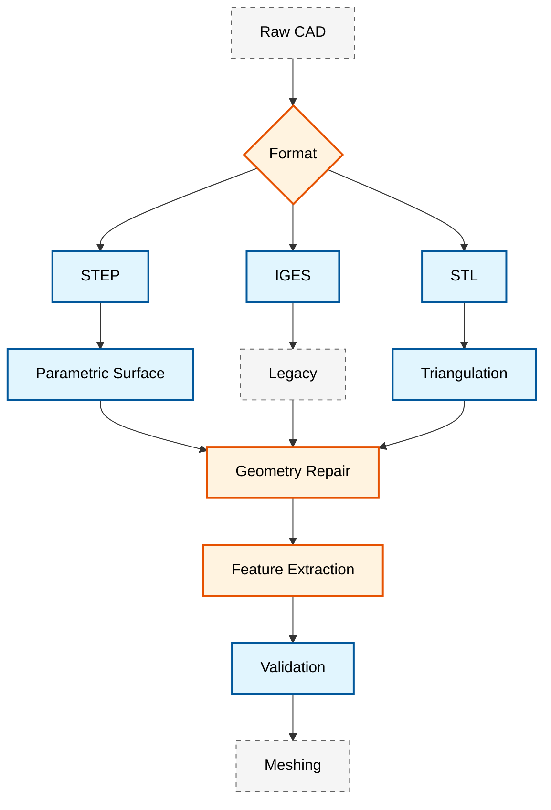

# 🏗️ การเตรียม CAD สำหรับ CFD: จากเรขาคณิตสู่การจำลอง (CAD Preparation for CFD: From Geometry to Simulation)

> [!INFO] **วัตถุประสงค์การเรียนรู้**
> - เชี่ยวชาญขั้นตอนการเตรียมเรขาคณิต CAD สำหรับ OpenFOAM
> - เข้าใจข้อกำหนดรูปแบบไฟล์และการแปลงรูปแบบ
> - ใช้งานการซ่อมแซมและการตรวจสอบความถูกต้องของเรขาคณิตแบบอัตโนมัติ
> - ประยุกต์ใช้ตัวชี้วัดการควบคุมคุณภาพสำหรับการสร้างเมช

---

## ภาพรวม (Overview)

การเดินทางจาก CAD ไปสู่การจำลอง CFD เริ่มต้นด้วยการเตรียมเรขาคณิตที่เหมาะสม ระยะวิกฤตนี้จะเป็นตัวกำหนดคุณภาพของเมช, เสถียรภาพเชิงตัวเลข และความแม่นยำของการจำลองในที่สุด OpenFOAM รองรับรูปแบบเรขาคณิตหลายรูปแบบ ซึ่งแต่ละรูปแบบมีข้อดีและข้อจำกัดเฉพาะที่ส่งผลกระทบต่อขั้นตอนการทำงานในลำดับถัดไป


> **รูปที่ 1:** แผนภูมิขั้นตอนการเตรียมข้อมูล CAD สำหรับงาน CFD โดยเริ่มจากการเลือกรูปแบบไฟล์ (STEP, IGES, STL) การซ่อมแซมเรขาคณิต การสกัดคุณลักษณะเด่น (Feature Extraction) และการตรวจสอบความถูกต้องก่อนเริ่มกระบวนการสร้างเมช

---

## ส่วนที่ 1: มาตรฐานรูปแบบไฟล์ (File Format Standards)

### 1.1 รูปแบบ CAD ที่รองรับ

OpenFOAM ยอมรับรูปแบบเรขาคณิตหลายรูปแบบที่มีความสามารถแตกต่างกัน:

| รูปแบบ | นามสกุล | โทโพโลยี | ความแม่นยำ | กรณีใช้งาน |
|--------|-----------|----------|-----------|----------|
| **STEP** | `.stp`, `.step` | พื้นผิว NURBS | สูง | **แนะนำ** - รักษาเรขาคณิตแบบพารามิเตอร์ |
| **IGES** | `.igs`, `.iges` | พื้นผิว NURBS | ปานกลาง | ระบบเก่า, อาจมีความไม่สอดคล้องของพื้นผิว |
| **STL** | `.stl` | แบบสามเหลี่ยม | ต่ำ-ปานกลาง | การสร้างเมชโดยตรง, ต้องการการควบคุมคุณภาพ |
| **OBJ** | `.obj` | แบบสามเหลี่ยม | ปานกลาง | การสร้างภาพ, เรขาคณิตอย่างง่าย |
| **VTK** | `.vtk` | แบบสามเหลี่ยม | สูง | ใช้สำหรับอ้างอิงการสร้างภาพเท่านั้น |

> [!TIP] **คำแนะนำรูปแบบไฟล์**
> ควรใช้ **รูปแบบ STEP** เสมอเมื่อมีให้เลือก เนื่องจากสามารถรักษาเส้นโค้งพารามิเตอร์และความต่อเนื่องของพื้นผิวได้ ซึ่งช่วยป้องกันสิ่งแปลกปลอม (artifacts) ระหว่างการสร้างเมช ควรใช้ STL เฉพาะเมื่อไม่สามารถหาไฟล์ CAD ต้นฉบับได้เท่านั้น

### 1.2 ขั้นตอนการแปลงรูปแบบไฟล์ (Format Conversion Workflow)

```bash
#!/bin/bash
# ท่อส่งการแปลงรูปแบบ CAD ที่ครอบคลุม

convert_cad_to_openfoam() {
    local input_file="$1"
    local output_dir="constant/triSurface"

    # สร้างไดเรกทอรีผลลัพธ์
    mkdir -p "$output_dir"

    # ตรวจจับรูปแบบอินพุต
    local extension="${input_file##*.}"

    case "$extension" in
        "stp"|"step")
            echo "กำลังแปลง STEP เป็น STL..."
            # ใช้ FreeCAD สำหรับการแปลง STEP เป็น STL
            python3 << EOF
import FreeCAD
import Import
import Mesh
import sys

doc = FreeCAD.openDocument("$input_file")
shape = doc.findObjects()[0].Shape

# ส่งออกพร้อมการควบคุมคุณภาพ
mesh = Mesh.exportShape([
    shape,
    "output.stl",
    Mesh.MeshProperty()
])

# ตั้งค่าพารามิเตอร์การสร้างเมช
mesh.harmonizeNormals()
mesh.removeDuplicatedPoints()
mesh.removeNonManifolds()
EOF
            ;; 

        "igs"|"iges")
            echo "กำลังแปลง IGES เป็น STL..."
            python3 convert_iges_to_stl.py "$input_file" "$output_dir/geometry.stl"
            ;; 

        "stl")
            echo "กำลังคัดลอกไฟล์ STL..."
            cp "$input_file" "$output_dir/geometry.stl"
            ;; 

        *)
            echo "ข้อผิดพลาด: ไม่รองรับรูปแบบ $extension"
            return 1
            ;; 
    esac

    # ตรวจสอบความถูกต้องของผลลัพธ์
    surfaceCheck "$output_dir/geometry.stl"
}
```

📂 **แหล่งที่มา:** MODULE_07_UTILITIES_AUTOMATION/CONTENT/02_MESH_PREPARATION/

**คำอธิบาย:**
สคริปต์นี้แสดงขั้นตอนการแปลงไฟล์ CAD ในรูปแบบต่างๆ (STEP, IGES, STL) ให้อยู่ในรูปแบบที่ OpenFOAM สามารถนำไปใช้งานได้ โดยเฉพาะอย่างยิ่งการแปลงเป็นไฟล์ STL ที่ใช้สำหรับการสร้าง mesh

**แนวคิดสำคัญ:**
- **Format Detection**: การตรวจจับประเภทไฟล์จากนามสกุลไฟล์อัตโนมัติ
- **FreeCAD Integration**: การใช้ FreeCAD ผ่าน Python API เพื่อแปลงไฟล์ STEP เป็น STL พร้อมการปรับปรุงคุณภาพ mesh
- **Mesh Quality Control**: การทำให้เวกเตอร์ปกติสอดคล้องกัน (harmonize normals), ลบจุดซ้ำ และลบ non-manifold geometry
- **OpenFOAM Directory Structure**: การจัดเก็บไฟล์ใน `constant/triSurface/` ซึ่งเป็นตำแหน่งมาตรฐานของ OpenFOAM
- **Validation Pipeline**: การใช้ `surfaceCheck` เพื่อตรวจสอบความถูกต้องของ geometry

### 1.3 ความแตกต่างในการแสดงผลทางคณิตศาสตร์

ความแตกต่างพื้นฐานระหว่างรูปแบบต่างๆ อยู่ที่การแสดงผลเรขาคณิต:

**พื้นผิวพารามิเตอร์ (Parametric Surfaces - STEP/IGES):**
$$\mathbf{S}(u,v) = \sum_{i=0}^{n} \sum_{j=0}^{m} N_{i,p}(u) N_{j,q}(v) \mathbf{P}_{i,j}$$

โดยที่:
- $\mathbf{S}(u,v)$ คือจุดบนพื้นผิวที่พารามิเตอร์ $(u,v)$
- $N_{i,p}$ และ $N_{j,q}$ คือฟังก์ชันฐาน B-spline
- $\mathbf{P}_{i,j}$ คือจุดควบคุม (control points)
- $p, q$ คือดีกรีในทิศทาง $u, v$

**พื้นผิวแบบสามเหลี่ยม (Triangulated Surfaces - STL):**
$$\mathbf{T} = \bigcup_{k=1}^{N_{\text{tri}}} \triangle_k$$

โดยที่รูปสามเหลี่ยม $\triangle_k$ แต่ละรูปกำหนดโดยจุดยอดสามจุดและเวกเตอร์ปกติหนึ่งตัว ข้อผิดพลาดจากการแยกส่วน (discretization error) ขึ้นอยู่กับจำนวนรูปสามเหลี่ยมและการประมาณค่าความโค้ง

---

## ส่วนที่ 2: ข้อบกพร่องและการซ่อมแซมเรขาคณิต (Geometry Defects and Repair)

### 2.1 ข้อบกพร่องของ CAD ที่พบบ่อย

```python
#!/usr/bin/env python3
"""
การตรวจจับและจำแนกข้อบกพร่องของเรขาคณิต CAD
"""

class GeometryDefect:
    NON_MANIFOLD = "non_manifold"
    ZERO_THICKNESS = "zero_thickness"
    REVERSED_NORMALS = "reversed_normals"
    SMALL_FEATURES = "small_features"
    ASSEMBLY_GAPS = "assembly_gaps"
    INTERSECTIONS = "surface_intersections"
    DUPLICATE_FACES = "duplicate_faces"

def detect_defects(stl_file):
    """
    การตรวจจับข้อบกพร่องอย่างครอบคลุมโดยใช้การวิเคราะห์เมช
    """
    import trimesh
    import numpy as np

    mesh = trimesh.load_mesh(stl_file)
    defects = {}

    # 1. การตรวจจับขอบแบบ Non-manifold
    non_manifold_edges = mesh.non_manifold_edges()
    defects[GeometryDefect.NON_MANIFOLD] = {
        'count': len(non_manifold_edges),
        'edges': non_manifold_edges.tolist() if len(non_manifold_edges) > 0 else []
    }

    # 2. บริเวณที่มีความหนาเป็นศูนย์
    thickness = compute_local_thickness(mesh)
    zero_thickness_regions = np.where(thickness < 1e-6)[0]
    defects[GeometryDefect.ZERO_THICKNESS] = {
        'count': len(zero_thickness_regions),
        'regions': zero_thickness_regions.tolist()
    }

    # 3. การตรวจสอบความสอดคล้องของเวกเตอร์ปกติ
    face_normals = mesh.face_normals
    centroid = mesh.centroid
    vectors_to_centroid = centroid - mesh.triangles_center
    alignment = np.sum(face_normals * vectors_to_centroid, axis=1)

    reversed_normals = np.where(alignment > 0)[0]  # เวกเตอร์ปกติชี้เข้าด้านใน
    defects[GeometryDefect.REVERSED_NORMALS] = {
        'count': len(reversed_normals),
        'faces': reversed_normals.tolist()
    }

    # 4. การตรวจจับรายละเอียดขนาดเล็ก
    edge_lengths = mesh.edges_unique_length
    small_features_threshold = np.percentile(edge_lengths, 1)
    small_edges = np.where(edge_lengths < small_features_threshold)[0]
    defects[GeometryDefect.SMALL_FEATURES] = {
        'count': len(small_edges),
        'edges': small_edges.tolist()
    }

    return defects

def compute_local_thickness(mesh, n_samples=1000):
    """
    คำนวณความหนาผนังเฉพาะจุดโดยใช้การยิงลำแสง (Ray-tracing)
    """
    import trimesh

    # สุ่มจุดตัวอย่างบนพื้นผิว
    points, face_indices = trimesh.sample.sample_surface(mesh, n_samples)

    # สำหรับแต่ละจุด ให้ยิงลำแสงในทิศทางปกติ
    normals = mesh.face_normals[face_indices]
    thickness = np.zeros(n_samples)

    for i in range(n_samples):
        ray_origin = points[i]
        ray_direction = normals[i]

        # หาจุดตัดกับเมช
        locations, _, _ = mesh.ray.intersects_location(
            ray_origins=[ray_origin],
            ray_directions=[ray_direction]
        )

        if len(locations) > 1:
            # ระยะทางไปยังจุดตัดที่ใกล้ที่สุด (ไม่รวมตัวเอง)
            distances = np.linalg.norm(locations - ray_origin, axis=1)
            distances = distances[distances > 1e-10]  # ลบจุดตัดกับตัวเองออก
            if len(distances) > 0:
                thickness[i] = np.min(distances)

    return thickness

def generate_defect_report(defects, output_file="defect_report.json"):
    """
    สร้างรายงานข้อบกพร่องโดยละเอียดพร้อมการประเมินความรุนแรง
    """
    import json

    # ประเมินความรุนแรง
    severity_scores = {
        GeometryDefect.NON_MANIFOLD: defects[GeometryDefect.NON_MANIFOLD]['count'] * 10,
        GeometryDefect.ZERO_THICKNESS: defects[GeometryDefect.ZERO_THICKNESS]['count'] * 50,
        GeometryDefect.REVERSED_NORMALS: defects[GeometryDefect.REVERSED_NORMALS]['count'] * 5,
        GeometryDefect.SMALL_FEATURES: defects[GeometryDefect.SMALL_FEATURES]['count'] * 2,
    }

    total_score = sum(severity_scores.values())

    if total_score == 0:
        severity = "สะอาด (CLEAN)"
    elif total_score < 50:
        severity = "เล็กน้อย (MINOR)"
    elif total_score < 200:
        severity = "ปานกลาง (MODERATE)"
    else:
        severity = "วิกฤต (CRITICAL)"

    report = {
        'severity': severity,
        'total_score': total_score,
        'defects': defects,
        'recommendations': generate_recommendations(defects)
    }

    with open(output_file, 'w') as f:
        json.dump(report, f, indent=2)

    return report

def generate_recommendations(defects):
    """
    สร้างคำแนะนำการซ่อมแซมเฉพาะเจาะจงตามข้อบกพร่องที่ตรวจพบ
    """
    recommendations = []

    if defects[GeometryDefect.NON_MANIFOLD]['count'] > 0:
        recommendations.append({
            'defect': 'ขอบแบบ Non-manifold',
            'action': 'แยกขอบหรือรวมหน้าผิว',
            'priority': 'สูง (HIGH)' if defects[GeometryDefect.NON_MANIFOLD]['count'] > 10 else 'ปานกลาง (MEDIUM)'
        })

    if defects[GeometryDefect.ZERO_THICKNESS]['count'] > 0:
        recommendations.append({
            'defect': 'บริเวณที่มีความหนาเป็นศูนย์',
            'action': 'ประยุกต์ใช้ความหนาขั้นต่ำตามความละเอียดของเมช',
            'formula': 't_min = max(0.001 × L_domain, 3 × Δx_min)',
            'priority': 'วิกฤต (CRITICAL)'
        })

    if defects[GeometryDefect.REVERSED_NORMALS]['count'] > 0:
        recommendations.append({
            'defect': 'เวกเตอร์ปกติพื้นผิวกลับด้าน',
            'action': 'ปรับทิศทางเวกเตอร์ปกติทั้งหมดออกด้านนอกโดยใช้การตรวจสอบความสอดคล้อง',
            'priority': 'สูง (HIGH)'
        })

    return recommendations
```

📂 **แหล่งที่มา:** MODULE_07_UTILITIES_AUTOMATION/CONTENT/02_MESH_PREPARATION/

**คำอธิบาย:**
โค้ด Python นี้ใช้สำหรับตรวจจับและจัดประเภทข้อบกพร่องของ geometry ในไฟล์ STL ก่อนนำไปใช้ใน OpenFOAM โดยใช้ trimesh library ในการวิเคราะห์ mesh topology

**แนวคิดสำคัญ:**
- **Non-Manifold Detection**: การตรวจจับ edges ที่มีการเชื่อมต่อกับ faces มากกว่า 2 ซึ่งจะทำให้เกิดปัญหาในการสร้าง mesh
- **Thickness Computation**: การคำนวณความหนาของผนังโดยใช้ ray-tracing technique เพื่อหาบริเวณที่มีความหนาน้อยเกินไป
- **Normal Consistency**: การตรวจสอบทิศทางของ normal vectors ว่าชี้ออกด้านนอกทั้งหมดหรือไม่
- **Small Features Detection**: การหา features ขนาดเล็กที่อาจก่อให้เกิดปัญหาในการสร้าง mesh
- **Severity Scoring**: การให้คะแนนความรุนแรงของข้อบกพร่องเพื่อกำหนดลำดับความสำคัญในการแก้ไข
- **Automated Recommendations**: การสร้างคำแนะนำในการแก้ไขโดยอัตโนมัติตามประเภทของข้อบกพร่องที่พบ

### 2.2 การคำนวณขนาดรายละเอียดขั้นต่ำ (Minimum Feature Size Calculation)

สำหรับการประยุกต์ใช้งาน CFD รายละเอียดที่เล็กกว่าความละเอียดของเมชจะทำให้เกิดความไม่เสถียรเชิงตัวเลข:

$$t_{\min} = \max\left(0.001 \times L_{\text{domain}}, 3 \times \Delta x_{\min}\right)$$

โดยที่:
- $t_{\min}$ คือความหนารายละเอียดขั้นต่ำ
- $L_{\text{domain}}$ คือความยาวลักษณะเฉพาะของโดเมน
- $\Delta x_{\min}$ คือขนาดเซลล์ที่เล็กที่สุดในเมช

**ข้อควรพิจารณาเรื่องชั้นขอบเขต:**

สำหรับการไหลใกล้ผนัง ความสูงของเซลล์แรก $\Delta y$ จะต้องเป็นไปตามข้อกำหนด $y^+$:

$$\Delta y = \frac{y^+ \mu}{\rho u_{\tau}}$$

โดยที่ $u_{\tau}$ คือความเร็วแรงเสียดทาน:

$$u_{\tau} = U_{\infty} \sqrt{\frac{C_f}{2}}$$

โดยใช้สหสัมพันธ์ของ Blasius สำหรับสัมประสิทธิ์แรงเสียดทานผิว:

$$C_f = \frac{0.026}{Re^{0.139}}$$

> [!WARNING] **เกณฑ์การกำจัดรายละเอียด (Feature Removal Criteria)**
> รายละเอียดที่เป็นไปตามเงื่อนไข $t < t_{\min}$ ควรเป็น:
> 1. **ถูกกำจัดออก** หากไม่มีผลต่อฟิสิกส์การไหล
> 2. **ทำให้หนาขึ้น** จนถึง $t_{\min}$ หากเป็นเรขาคณิตที่สำคัญ
> 3. **คงไว้** เฉพาะในกรณีที่สามารถเพิ่มความละเอียดของเมชเพื่อรองรับได้เท่านั้น

---

## ส่วนที่ 3: เครื่องมือซ่อมแซมเรขาคณิต (Geometry Repair Tools)

### 3.1 แนวทางแบบโอเพนซอร์ส

**การเขียนสคริปต์ Python ด้วย FreeCAD:**

```python
#!/usr/bin/env python3
"""
ขั้นตอนการซ่อมแซม CAD อัตโนมัติโดยใช้ FreeCAD
"""

import FreeCAD
import Mesh
import Part
from FreeCAD import Base

class CADRepairPipeline:
    def __init__(self, input_file):
        self.input_file = input_file
        self.shape = None
        self.mesh = None

    def load_geometry(self):
        """โหลดไฟล์ CAD และสกัดรูปทรง (Shape)"""
        try:
            doc = FreeCAD.openDocument(self.input_file)
            self.shape = doc.findObjects()[0].Shape
            return True
        except Exception as e:
            print(f"เกิดข้อผิดพลาดในการโหลดเรขาคณิต: {e}")
            return False

    def clean_shape(self):
        """
        ประยุกต์ใช้การดำเนินการทำความสะอาดรูปทรง
        """
        if not self.shape:
            return False

        # 1. แก้ไขทิศทาง
        self.shape.fixOrientation()

        # 2. ลบรอยต่อ
        self.shape.removeSeams()

        # 3. ทำให้เวกเตอร์ปกติสอดคล้องกัน
        self.shape.harmonizeNormals()

        # 4. ทำให้หน้าผิวเรียบง่ายขึ้น
        self.shape.simplifyFaces()

        return True

    def create_mesh(self, linear_deflection=0.1, angular_deflection=0.5):
        """
        สร้างเมชคุณภาพสูงจากรูปทรง
        """
        if not self.shape:
            return False

        # พารามิเตอร์การสร้างเมช
        params = Mesh.MeshProperty()
        params.LinearDeflection = linear_deflection
        params.AngularDeflection = angular_deflection

        # สร้างเมช
        self.mesh = Mesh.meshFromShape(
            self.shape,
            linearDeflection=linear_deflection,
            angular_deflection=angular_deflection,
            relative=False
        )

        # การประมวลผลเมชภายหลัง
        self.mesh.harmonizeNormals()
        self.mesh.removeDuplicatedPoints()
        self.mesh.removeNonManifolds()

        return True

    def export_stl(self, output_file):
        """ส่งออกเรขาคณิตที่ซ่อมแซมแล้วในรูปแบบ STL"""
        if not self.mesh:
            return False

        self.mesh.write(output_file)
        return True

    def validate_repair(self):
        """
        ตรวจสอบคุณภาพเรขาคณิตที่ซ่อมแซมแล้ว
        """
        if not self.mesh:
            return False

        # คำนวณตัวชี้วัดคุณภาพ
        n_triangles = len(self.mesh.Facets)
        n_points = len(self.mesh.Points)

        # ตรวจสอบเรขาคณิตแบบ non-manifold
        non_manifold = self.mesh.countNonManifolds()

        # รายงาน
        report = {
            'triangles': n_triangles,
            'points': n_points,
            'non_manifold_edges': non_manifold,
            'status': 'ผ่าน (PASS)' if non_manifold == 0 else 'ไม่ผ่าน (FAIL)'
        }

        return report

# ตัวอย่างการใช้งาน
repair = CADRepairPipeline("geometry.step")
repair.load_geometry()
repair.clean_shape()
repair.create_mesh(linear_deflection=0.05)
repair.export_stl("geometry_repaired.stl")
validation = repair.validate_repair()
print(f"ผลการตรวจสอบการซ่อมแซม: {validation}")
```

📂 **แหล่งที่มา:** MODULE_07_UTILITIES_AUTOMATION/CONTENT/02_MESH_PREPARATION/

**คำอธิบาย:**
คลาส Python นี้ใช้ FreeCAD API ในการสร้าง pipeline สำหรับซ่อมแซม CAD geometry โดยอัตโนมัติ ตั้งแต่การโหลดไฟล์ การทำความสะอาด shape การสร้าง mesh และการตรวจสอบคุณภาพ

**แนวคิดสำคัญ:**
- **Shape Cleaning Operations**: การ fixOrientation, removeSeams, harmonizeNormals และ simplifyFaces เพื่อแก้ไขปัญหาทั่วไปของ CAD geometry
- **Mesh Generation Parameters**: linear_deflection และ angular_deflection ควบคุมความละเอียดของ tessellation
- **Mesh Post-Processing**: การ harmonizeNormals, ลบจุดซ้ำ และลบ non-manifolds หลังจากสร้าง mesh
- **Quality Validation**: การตรวจสอบจำนวน triangles, points และ non-manifold edges เพื่อให้แน่ใจว่า geometry พร้อมใช้งาน
- **Pipeline Architecture**: การออกแบบเป็น class ที่มี methods ต่อเนื่องกัน (load → clean → mesh → export → validate)

**การประมวลผลแบบกลุ่มด้วย Blender:**

```python
# blender_repair.py - การซ่อมแซม CAD แบบกลุ่มโดยใช้ Blender
import bpy
import bmesh
import sys

def repair_mesh(input_path, output_path):
    """
    ขั้นตอนการซ่อมแซมเมชที่ครอบคลุม
    """
    # นำเข้าเมช
    bpy.ops.import_scene.obj(filepath=input_path)
    obj = bpy.context.selected_objects[0]

    # เข้าสู่โหมดแก้ไข
    bpy.context.view_layer.objects.active = obj
    bpy.ops.object.mode_set(mode='EDIT')

    # สร้างตัวแทน bmesh
    me = obj.data
    bm = bmesh.from_edit_mesh(me)

    # 1. ลบจุดยอดที่ซ้ำกัน
    bmesh.ops.remove_doubles(bm, verts=bm.verts, dist=0.0001)

    # 2. แก้ไขเรขาคณิตแบบ non-manifold
    non_manifold_edges = [e for e in bm.edges if not e.is_manifold]
    for edge in non_manifold_edges:
        bmesh.ops.split_edges(bm, edges=[edge])

    # 3. คำนวณเวกเตอร์ปกติใหม่ให้ออกด้านนอก
    bpy.ops.mesh.normals_make_consistent(inside=False)

    # 4. เติมรู
    bmesh.ops.holes_fill(bm, edges=bm.edges)

    # 5. การปรับให้ดูเรียบเนียน (Smooth shading)
    bpy.ops.mesh.shade_smooth()

    # อัปเดตเมช
    bmesh.update_edit_mesh(me)

    # ออกจากโหมดแก้ไขและส่งออก
    bpy.ops.object.mode_set(mode='OBJECT')
    bpy.ops.export_mesh.stl(filepath=output_path)

    return True

if __name__ == "__main__":
    input_stl = sys.argv[-2]
    output_stl = sys.argv[-1]
    repair_mesh(input_stl, output_stl)
```

📂 **แหล่งที่มา:** MODULE_07_UTILITIES_AUTOMATION/CONTENT/02_MESH_PREPARATION/

**คำอธิบาย:**
สคริปต์ Blender Python นี้ใช้สำหรับ batch processing และซ่อมแซม mesh โดยใช้ bmesh API ของ Blender ซึ่งมีประสิทธิภาพในการจัดการ mesh topology

**แนวคิดสำคัญ:**
- **BMesh API**: การใช้ bmesh module ของ Blender ในการจัดการ mesh topology ระดับ low-level
- **Duplicate Removal**: การลบ vertices ที่ซ้ำกันซึ่งเป็นปัญหาทั่วไปในไฟล์ STL
- **Non-Manifold Fixing**: การ split edges ที่ไม่ใช่ manifold เพื่อให้ mesh topology ถูกต้อง
- **Normal Recalculation**: การคำนวณ normals ใหม่ให้ชี้ออกด้านนอกทั้งหมด
- **Hole Filling**: การเติมช่องว่างใน mesh โดยอัตโนมัติ
- **Batch Processing**: การรับ arguments ผ่าน command line เพื่อประมวลผลไฟล์หลายไฟล์

### 3.2 การเปรียบเทียบเครื่องมือเชิงพาณิชย์ (Commercial Tools Comparison)

| เครื่องมือ | ซ่อมแซมอัตโนมัติ | การเติมช่องว่าง | ประมวลผลแบบกลุ่ม | การส่งออก OpenFOAM | ต้นทุน |
|------|-------------|-------------|------------------|-----------------|------|
| **ANSYS SpaceClaim** | ★★★★★ | ★★★★★ | ★★★★☆ | ใช่ | สูง |
| **Siemens NX/UG** | ★★★★☆ | ★★★★★ | ★★★★★ | ใช่ | สูงมาก |
| **SOLIDWORKS** | ★★★☆☆ | ★★★★☆ | ★★★☆☆ | ปลั๊กอิน | สูง |
| **FreeCAD** | ★★★☆☆ | ★★☆☆☆ | ★★☆☆☆ | พื้นฐาน (Native) | ฟรี |

---

## ส่วนที่ 4: การตรวจสอบความถูกต้องของเรขาคณิต (Geometry Validation)

### 4.1 ตัวชี้วัดคุณภาพพื้นผิว (Surface Quality Metrics)

```python
#!/usr/bin/env python3
"""
การประเมินคุณภาพเรขาคณิตที่ครอบคลุมสำหรับ OpenFOAM
"""

import numpy as np
import trimesh
from scipy import stats

class SurfaceQualityAnalyzer:
    def __init__(self, stl_file):
        self.mesh = trimesh.load_mesh(stl_file)
        self.metrics = {}

    def compute_all_metrics(self):
        """คำนวณชุดตัวชี้วัดคุณภาพทั้งหมด"""
        return {
            'triangle_quality': self.analyze_triangle_quality(),
            'curvature_analysis': self.analyze_curvature(),
            'normal_consistency': self.check_normal_consistency(),
            'gap_detection': self.detect_gaps(),
            'surface_area': self.compute_surface_area(),
            'volume_integrity': self.check_volume_integrity()
        }

    def analyze_triangle_quality(self):
        """
        วิเคราะห์อัตราส่วนรูปร่างและความเบ้ของรูปสามเหลี่ยม
        """
        triangles = self.mesh.triangles
        quality_metrics = {}

        # ความยาวขอบ
        edge_lengths = self.mesh.edges_unique_length

        # พื้นที่รูปสามเหลี่ยม
        face_areas = self.mesh.area_faces

        # การคำนวณอัตราส่วนรูปร่าง
        # AR = (ขอบยาวที่สุด) / (ส่วนสูงที่สั้นที่สุด)
        aspect_ratios = []
        for tri in triangles:
            edges = np.linalg.norm(np.diff(tri, axis=0), axis=1)
            longest_edge = np.max(edges)
            area = 0.5 * np.linalg.norm(np.cross(edges[0], edges[1]))
            shortest_altitude = 2 * area / longest_edge
            ar = longest_edge / shortest_altitude
            aspect_ratios.append(ar)

        quality_metrics['aspect_ratio_mean'] = np.mean(aspect_ratios)
        quality_metrics['aspect_ratio_max'] = np.max(aspect_ratios)
        quality_metrics['aspect_ratio_std'] = np.std(aspect_ratios)

        # ความเบ้ (การเบี่ยงเบนจากสามเหลี่ยมด้านเท่า)
        # สามเหลี่ยมด้านเท่าที่สมบูรณ์: ทุกมุม = 60°
        angles = []
        for tri in triangles:
            # คำนวณมุมโดยใช้กฎของโคไซน์
            a = np.linalg.norm(tri[1] - tri[0])
            b = np.linalg.norm(tri[2] - tri[1])
            c = np.linalg.norm(tri[0] - tri[2])

            angle_a = np.arccos((b**2 + c**2 - a**2) / (2*b*c))
            angle_b = np.arccos((c**2 + a**2 - b**2) / (2*c*a))
            angle_c = np.pi - angle_a - angle_b

            angles.extend([angle_a, angle_b, angle_c])

        ideal_angle = np.pi / 3  # 60 องศาในหน่วยเรเดียน
        skewness = np.abs(np.array(angles) - ideal_angle)
        quality_metrics['angle_skewness_mean'] = np.mean(skewness)
        quality_metrics['angle_skewness_max'] = np.max(skewness)

        return quality_metrics

    def analyze_curvature(self):
        """
        คำนวณการวิเคราะห์ความโค้งแบบแยกส่วน (Discrete curvature)
        """
        # ความโค้งแบบเกาส์ที่แต่ละจุดยอด
        vertex_curvatures = self.mesh.vertex_attributes.get('gaussian_curvature', None)

        if vertex_curvatures is None:
            # ประมาณค่าโดยใช้มุมไดฮีดรัล
            vertex_curvatures = self.mesh.vertex_defects

        curvature_metrics = {
            'mean_curvature': np.mean(np.abs(vertex_curvatures)),
            'max_curvature': np.max(np.abs(vertex_curvatures)),
            'high_curvature_regions': np.sum(np.abs(vertex_curvatures) > np.percentile(np.abs(vertex_curvatures), 90))
        }

        return curvature_metrics

    def check_normal_consistency(self):
        """
        ตรวจสอบความสอดคล้องของการวางแนวเวกเตอร์ปกติ
        """
        face_normals = self.mesh.face_normals
        centroid = self.mesh.centroid

        # ตรวจสอบทิศทางเทียบกับจุดศูนย์กลางมวล
        face_centers = self.mesh.triangles_center
        vectors_to_centroid = centroid - face_centers

        alignment = np.sum(face_normals * vectors_to_centroid, axis=1)
        inward_facing = np.sum(alignment > 0)

        consistency_metrics = {
            'total_faces': len(face_normals),
            'inward_facing_count': inward_facing,
            'consistency_ratio': 1.0 - (inward_facing / len(face_normals)),
            'status': 'ผ่าน (PASS)' if inward_facing == 0 else 'ไม่ผ่าน (FAIL)'
        }

        return consistency_metrics

    def detect_gaps(self):
        """
        ตรวจจับช่องว่างในเมชพื้นผิว
        """
        # หาขอบเขต (ขอบที่ใช้โดยหน้าผิวเดียวเท่านั้น)
        boundary_edges = self.mesh.edges_unique[self.mesh.edges_unique_face_count == 1]

        gap_metrics = {
            'boundary_edge_count': len(boundary_edges),
            'boundary_edge_length': np.sum(self.mesh.edges_unique_length[self.mesh.edges_unique_face_count == 1]),
            'is_watertight': len(boundary_edges) == 0
        }

        return gap_metrics

    def compute_surface_area(self):
        """
        คำนวณพื้นที่ผิวทั้งหมดและเปรียบเทียบกับค่าที่คาดหวัง
        """
        total_area = self.mesh.area

        # พื้นที่ที่คาดหวัง (ใช้กล่องขอบเขตเป็นค่าอ้างอิง)
        bbox = self.mesh.bounding_box
        bbox_area = 2 * (
            (bbox[1][0] - bbox[0][0]) * (bbox[1][1] - bbox[0][1]) +
            (bbox[1][1] - bbox[0][1]) * (bbox[1][2] - bbox[0][2]) +
            (bbox[1][2] - bbox[0][2]) * (bbox[1][0] - bbox[0][0])
        )

        area_ratio = total_area / bbox_area

        return {
            'surface_area': total_area,
            'bounding_box_area': bbox_area,
            'area_ratio': area_ratio
        }

    def check_volume_integrity(self):
        """
        ตรวจสอบว่าเรขาคณิตแบบปิดล้อมรอบปริมาตรที่ถูกต้องหรือไม่
        """
        if not self.mesh.is_watertight:
            return {
                'is_closed': False,
                'volume': None,
                'status': 'ไม่ผ่าน (FAIL) - ไม่เป็นระบบปิด'
            }

        volume = self.mesh.volume

        return {
            'is_closed': True,
            'volume': volume,
            'status': 'ผ่าน (PASS)' if volume > 0 else 'ไม่ผ่าน (FAIL) - ปริมาตรเป็นศูนย์'
        }

    def generate_quality_report(self, output_file="quality_report.json"):
        """
        สร้างรายงานการประเมินคุณภาพที่ครอบคลุม
        """
        metrics = self.compute_all_metrics()

        # คำนวณคะแนนคุณภาพโดยรวม (0-100)
        score = 100

        # บทลงโทษ
        if not metrics['gap_detection']['is_watertight']:
            score -= 30

        if metrics['normal_consistency']['consistency_ratio'] < 0.95:
            score -= 20

        if metrics['triangle_quality']['aspect_ratio_max'] > 10:
            score -= 15

        if metrics['triangle_quality']['angle_skewness_max'] > np.pi/6:  # 30 องศา
            score -= 10

        if not metrics['volume_integrity']['is_closed']:
            score -= 25

        report = {
            'overall_score': max(0, score),
            'grade': self._compute_grade(score),
            'metrics': metrics,
            'recommendations': self._generate_recommendations(metrics)
        }

        return report

    def _compute_grade(self, score):
        """แปลงคะแนนเป็นเกรดตัวอักษร"""
        if score >= 90:
            return 'A'
        elif score >= 80:
            return 'B'
        elif score >= 70:
            return 'C'
        elif score >= 60:
            return 'D'
        else:
            return 'F'

    def _generate_recommendations(self, metrics):
        """สร้างคำแนะนำเฉพาะเจาะจงตามตัวชี้วัด"""
        recommendations = []

        if not metrics['gap_detection']['is_watertight']:
            recommendations.append(
                "ปิดช่องว่างในเรขาคณิต พบขอบขอบเขตจำนวน {}".format(
                    metrics['gap_detection']['boundary_edge_count']
                )
            )

        if metrics['triangle_quality']['aspect_ratio_max'] > 10:
            recommendations.append(
                "สร้างเมชใหม่เพื่อลดอัตราส่วนรูปร่าง ค่าสูงสุดปัจจุบัน: {:.2f}".format(
                    metrics['triangle_quality']['aspect_ratio_max']
                )
            )

        if metrics['normal_consistency']['consistency_ratio'] < 0.95:
            recommendations.append(
                "แก้ไขเวกเตอร์ปกติที่ชี้เข้าด้านในจำนวน {}".format(
                    metrics['normal_consistency']['inward_facing_count']
                )
            )

        return recommendations

# ตัวอย่างการใช้งาน
analyzer = SurfaceQualityAnalyzer("geometry.stl")
report = analyzer.generate_quality_report()
print(f"คะแนนคุณภาพ: {report['overall_score']}/100 (เกรด {report['grade']})")
```

📂 **แหล่งที่มา:** MODULE_07_UTILITIES_AUTOMATION/CONTENT/02_MESH_PREPARATION/

**คำอธิบาย:**
คลาส Python นี้ใช้สำหรับประเมินคุณภาพของ surface geometry อย่างครอบคลุม โดยวัดหลาย metrics เพื่อให้แน่ใจว่า geometry พร้อมสำหรับการสร้าง mesh ใน OpenFOAM

**แนวคิดสำคัญ:**
- **Aspect Ratio Analysis**: การคำนวณสัดส่วนของ triangles (longest edge / shortest altitude) ซึ่งค่าที่สูงเกินไปจะส่งผลต่อคุณภาพ mesh
- **Angle Skewness**: การวัดความเบี้ยวของ triangles โดยเปรียบเทียบกับสามเหลี่ยมด้านเท่า (60°)
- **Curvature Analysis**: การวิเคราะห์ความโค้งของ surface เพื่อระบุบริเวณที่ต้องการ mesh refinement
- **Normal Consistency**: การตรวจสอบทิศทางของ normal vectors ทั้งหมดว่าสอดคล้องกันหรือไม่
- **Gap Detection**: การหา boundary edges ซึ่งเป็น edges ที่ใช้โดย face เดียว แสดงถึงช่องว่างใน geometry
- **Watertight Check**: การตรวจสอบว่า geometry เป็น closed surface หรือไม่
- **Quality Scoring System**: การให้คะแนนรวม (0-100) โดยหักคะแนนตามความรูนแรงของปัญหา
- **Automated Recommendations**: การสร้างคำแนะนำการแก้ไขโดยอัตโนมัติ

### 4.2 การบูรณาการกับ OpenFOAM (Integration with OpenFOAM)

```bash
#!/bin/bash
# ท่อส่งการตรวจสอบความถูกต้องแบบสมบูรณ์ที่บูรณาการกับยูทิลิตี้ OpenFOAM

validate_geometry_for_openfoam() {
    local stl_file="$1"
    local case_dir="$2"

    echo "=== ขั้นตอนการตรวจสอบเรขาคณิตของ OpenFOAM ==="

    # 1. การตรวจสอบพื้นผิวโดยใช้ OpenFOAM
    echo "[1/5] กำลังรัน surfaceCheck..."
    surfaceCheck "$stl_file" > surface_check.log 2>&1

    # สกัดตัวชี้วัด
    local n_triangles=$(grep "Triangles" surface_check.log | awk '{print $2}')
    local n_points=$(grep "Points" surface_check.log | awk '{print $2}')

    echo "  จำนวนรูปสามเหลี่ยม: $n_triangles"
    echo "  จำนวนจุด: $n_points"

    # 2. การสกัดขอบคุณลักษณะ
    echo "[2/5] กำลังสกัดขอบคุณลักษณะ..."
    local feature_angle=30
    surfaceFeatureEdges "$stl_file" "${stl_file%.stl}.feat" \
        -angle $feature_angle > feature_extraction.log 2>&1

    # 3. ตรวจสอบความเป็นระบบปิด (Watertightness)
    echo "[3/5] กำลังตรวจสอบความเป็นระบบปิด..."
    if surfaceCheck "$stl_file" | grep -q "closed"; then
        echo "  ✓ เรขาคณิตเป็นระบบปิด"
    else
        echo "  ✗ คำเตือน: เรขาคณิตมีช่องว่าง"
    fi

    # 4. การตรวจสอบมาตราส่วน (Scale check)
    echo "[4/5] กำลังยืนยันมาตราส่วน..."
    python3 << EOF
import trimesh
mesh = trimesh.load_mesh("$stl_file")
bbox = mesh.bounding_box
size = bbox[1] - bbox[0]
print(f"  ขนาดของกล่องขอบเขต: {size}")
print(f"  ขนาดสูงสุด: {max(size):.6f} ม.")
EOF

    # 5. การจัดวางในไดเรกทอรีกรณีศึกษา
    echo "[5/5] กำลังคัดลอกไปยังไดเรกทอรีกรณีศึกษา..."
    mkdir -p "$case_dir/constant/triSurface"
    cp "$stl_file" "$case_dir/constant/triSurface/"

    if [ -f "${stl_file%.stl}.eMesh" ]; then
        cp "${stl_file%.stl}.eMesh" "$case_dir/constant/triSurface/"
    fi

    echo "=== การตรวจสอบความถูกต้องเสร็จสิ้น ==="
    echo "เรขาคณิตพร้อมสำหรับการสร้างเมชใน: $case_dir"
}
```

📂 **แหล่งที่มา:** MODULE_07_UTILITIES_AUTOMATION/CONTENT/02_MESH_PREPARATION/

**คำอธิบาย:**
สคริปต์ Bash นี้เป็น pipeline ที่บูรณาการกับ OpenFOAM utilities เพื่อตรวจสอบและวาง geometry ใน case directory อย่างสมบูรณ์

**แนวคิดสำคัญ:**
- **surfaceCheck Utility**: การใช้ OpenFOAM tool ในการตรวจสอบคุณภาพของ STL surface
- **surfaceFeatureEdges**: การสกัด feature edges สำหรับ snappyHexMesh โดยกำหนด feature angle
- **Watertight Verification**: การตรวจสอบว่า geometry เป็น closed surface ซึ่งจำเป็นสำหรับ CFD simulation
- **Scale Verification**: การใช้ Python/trimesh ในการตรวจสอบขนาดของ geometry
- **OpenFOAM Directory Structure**: การจัดวางไฟล์ใน `constant/triSurface/` ซึ่งเป็นตำแหน่งมาตรฐาน
- **eMesh File**: การรวมไฟล์ feature edges (.eMesh) สำหรับการสร้าง mesh
- **Log Management**: การเก็บ logs ไว้ตรวจสอบแยกต่างหาก

---

## ส่วนที่ 5: หัวข้อขั้นสูง (Advanced Topics)

### 5.1 การแปลงจากพารามิเตอร์เป็นดิจิทัล (Parametric to Discrete Conversion)

เมื่อแปลงจากพื้นผิวพารามิเตอร์ (STEP) เป็นพื้นผิวแบบดิจิทัล (STL) พารามิเตอร์การสร้างรูปสามเหลี่ยม (tessellation) จะควบคุมความแม่นยำ:

**ระยะเบี่ยงเบนเชิงเส้น (Linear Deflection):** ระยะทางสูงสุดระหว่างพื้นผิวที่ถูก tessellated กับพื้นผิวพารามิเตอร์ที่แท้จริง
$$\delta_{\max} \leq \frac{L_{\text{ลักษณะเฉพาะ}}}{1000}$$

**ระยะเบี่ยงเบนเชิงมุม (Angular Deflection):** มุมสูงสุดระหว่างเวกเตอร์ปกติของรูปสามเหลี่ยมที่อยู่ติดกัน
$$\theta_{\max} \leq 15°$$

### 5.2 การจัดการเรขาคณิตหลายภูมิภาค (Multi-Region Geometry Handling)

สำหรับชุดประกอบที่มีส่วนประกอบหลายชิ้น:

```python
def prepare_multi_region_geometry(input_files, region_names):
    """
    เตรียมเรขาคณิตหลายภูมิภาคสำหรับ snappyHexMesh
    """
    import trimesh
    import numpy as np

    merged_mesh = trimesh.Trimesh()

    for i, (stl_file, region_name) in enumerate(zip(input_files, region_names)):
        mesh = trimesh.load_mesh(stl_file)

        # กำหนด ID ภูมิภาคเป็นคุณสมบัติหน้าผิว
        region_ids = np.full(len(mesh.faces), i, dtype=int)
        mesh.face_attributes['region_id'] = region_ids

        # รวมเข้าเป็นเมชรวม
        merged_mesh = merged_mesh + mesh

    # ส่งออกเรขาคณิตรวม
    merged_mesh.export('combined_assembly.stl')

    # สร้างไฟล์ระบุภูมิภาค
    with open('region_dict', 'w') as f:
        for i, name in enumerate(region_names):
            f.write(f"{i} {name}\n")

    return merged_mesh
```

📂 **แหล่งที่มา:** MODULE_07_UTILITIES_AUTOMATION/CONTENT/02_MESH_PREPARATION/

**คำอธิบาย:**
ฟังก์ชัน Python นี้ใช้สำหรับจัดการ geometry ที่มีหลาย regions (เช่น assembly ของ components) โดยรวม STL files หลายไฟล์เข้าด้วยกันและกำหนด region IDs

**แนวคิดสำคัญ:**
- **Multi-Region Meshing**: การรวม meshes หลายไฟล์เข้าด้วยกันสำหรับ assembly simulations
- **Face Attributes**: การกำหนด region_id ให้กับแต่ละ face เพื่อแยก regions ใน snappyHexMesh
- **Region Dictionary**: การสร้างไฟล์ `region_dict` เพื่อ map ระหว่าง region IDs และ names
- **Mesh Merging**: การใช้ trimesh operations ในการรวม meshes
- **Assembly Handling**: การจัดการ geometry ที่ซับซ้อนที่ประกอบด้วยหลาย components

### 5.3 การเตรียมขอบเขตแบบคาบ (Periodic Boundary Preparation)

สำหรับเรขาคณิตที่มีขอบเขตแบบคาบ:

```python
def create_periodic_geometry(stl_file, periodic_axis='x', periodic_length=None):
    """
    สร้างคู่ขอบเขตแบบคาบ
    """
    import trimesh

    mesh = trimesh.load_mesh(stl_file)
    bounds = mesh.bounds

    if periodic_length is None:
        periodic_length = bounds[1][0] - bounds[0][0]

    # ระบุหน้าผิวบนขอบเขตแบบคาบ
    axis_map = {'x': 0, 'y': 1, 'z': 2}
    axis = axis_map[periodic_axis]

    min_boundary = bounds[0][axis]
    max_boundary = bounds[1][axis]
    tolerance = 1e-6

    # สกัดหน้าผิวขอบเขต
    min_faces = []
    max_faces = []

    for face in mesh.faces:
        face_center = mesh.triangles_center[face]

        if abs(face_center[axis] - min_boundary) < tolerance:
            min_faces.append(face)
        elif abs(face_center[axis] - max_boundary) < tolerance:
            max_faces.append(face)

        print(f"พบหน้าผิวจำนวน {len(min_faces)} หน้าบนขอบเขตขั้นต่ำ")
        print(f"พบหน้าผิวจำนวน {len(max_faces)} หน้าบนขอบเขตสูงสุด")

    # สร้างไฟล์ STL แยกสำหรับแพตช์แบบคาบ
    # ... (การใช้งานขึ้นอยู่กับข้อกำหนดของเครื่องมือในลำดับถัดไป)
```

📂 **แหล่งที่มา:** MODULE_07_UTILITIES_AUTOMATION/CONTENT/02_MESH_PREPARATION/

**คำอธิบาย:**
ฟังก์ชัน Python นี้ใช้สำหรับเตรียม geometry ที่มี periodic boundaries ซึ่งพบบ่อยใน turbomachinery และ heat exchanger simulations

**แนวคิดสำคัญ:**
- **Periodic Boundary Detection**: การระบุ faces บน boundaries ที่เป็น periodic กัน
- **Axis-Based Selection**: การเลือก axis (x, y, z) และหา faces บน boundaries ตรงข้าม
- **Tolerance-Based Matching**: การใช้ tolerance เล็กน้อยในการระบุ boundary faces
- **Boundary Pair Extraction**: การแยก faces บน periodic boundaries ออกเป็นคู่ๆ
- **Periodic Length Calculation**: การคำนวณระยะห่าง periodic จาก geometry bounds
- **Patch Separation**: การสร้าง STL files แยกสำหรับแต่ละ periodic patch

---

## สรุปและแนวทางปฏิบัติที่ดีที่สุด (Summary and Best Practices)

> [!INFO] **รายการตรวจสอบการเตรียม CAD (CAD Preparation Checklist)**
> - [ ] ส่งออกเรขาคณิตในรูปแบบ STEP เมื่อมีให้เลือก
> - [ ] ประยุกต์ใช้ตัวกรองขนาดรายละเอียดขั้นต่ำ: $t_{\min} = \max(0.001L, 3\Delta x)$
> - [ ] ยืนยันความเป็นระบบปิด (ไม่มีช่องว่าง)
> - [ ] รับประกันว่าเวกเตอร์ปกติทั้งหมดชี้ออกด้านนอก
> - [ ] กำจัดโทโพโลยีแบบ non-manifold ออก
> - [ ] ตรวจสอบคุณภาพรูปสามเหลี่ยม (อัตราส่วนรูปร่าง < 10, ความเบ้ < 30°)
> - [ ] คำนวณความโค้งเพื่อระบุภูมิภาคที่ต้องการการปรับละเอียด
> - [ ] จัดวางในไดเรกทอรี `constant/triSurface/`
> - [ ] รัน `surfaceCheck` และ `surfaceFeatureEdges`

**เกณฑ์คุณภาพสำหรับ OpenFOAM (Quality Thresholds):**

| ตัวชี้วัด | ยอดเยี่ยม | ดี | ยอมรับได้ | แย่ |
|------|-----------|------|------------|------|
| **จำนวนสามเหลี่ยม** | < 1 หมื่น | 1 หมื่น-1 แสน | 1 แสน-1 ล้าน | > 1 ล้าน |
| **อัตราส่วนรูปร่าง** | < 3 | 3-5 | 5-10 | > 10 |
| **ความสอดคล้องปกติ** | 100% | > 99% | > 95% | < 95% |
| **เป็นระบบปิด** | ใช่ | ใช่ | มีช่องว่างเล็กน้อย | มีช่องว่างขนาดใหญ่ |
| **ขอบ Non-Manifold** | 0 | 0 | < 10 | > 10 |

การปฏิบัติตามแนวทางเหล่านี้ช่วยให้มั่นใจได้ว่าเรขาคณิต CAD ของคุณจะผลิตเมชคุณภาพสูงที่เหมาะสำหรับการจำลอง OpenFOAM ที่แม่นยำและเสถียร
