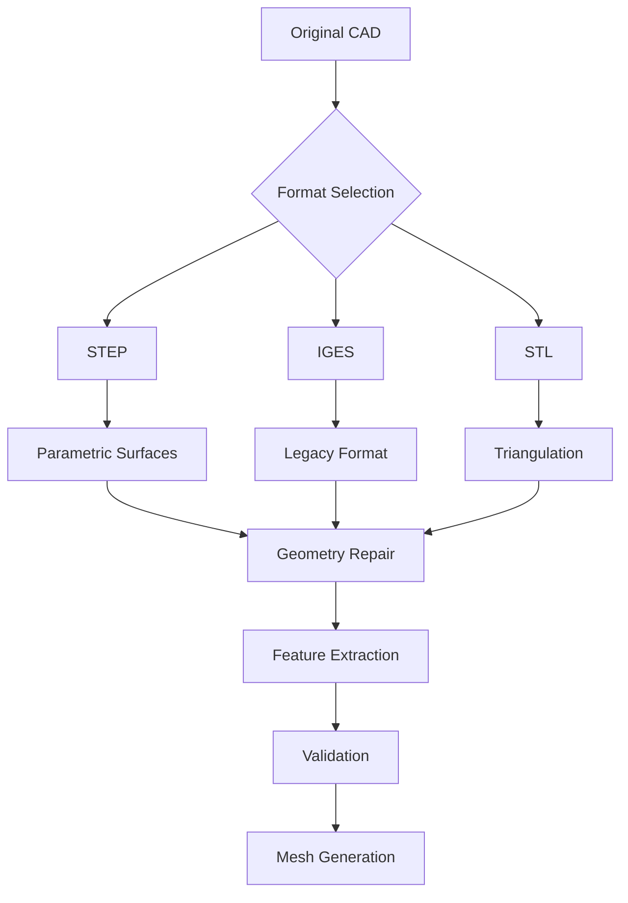

# 🏗️ CAD Preparation for CFD: From Geometry to Simulation

> [!INFO] **Learning Objectives**
> - Master CAD geometry preparation workflows for OpenFOAM
> - Understand file format requirements and conversions
> - Implement automated geometry repair and validation
> - Apply quality control metrics for mesh generation

---

## Overview

The journey from CAD to CFD simulation begins with proper geometry preparation. This critical phase determines mesh quality, numerical stability, and ultimately, simulation accuracy. OpenFOAM supports multiple geometry formats, each with specific advantages and limitations that impact the downstream workflow.


> **Figure 1:** แผนภูมิขั้นตอนการเตรียมข้อมูล CAD สำหรับงาน CFD โดยเริ่มจากการเลือกรูปแบบไฟล์ (STEP, IGES, STL) การซ่อมแซมเรขาคณิต การสกัดคุณลักษณะเด่น (Feature Extraction) และการตรวจสอบความถูกต้องก่อนเริ่มกระบวนการสร้างเมช

---

## Part 1: File Format Standards

### 1.1 Supported CAD Formats

OpenFOAM accepts multiple geometry formats with varying capabilities:

| Format | Extension | Topology | Precision | Use Case |
|--------|-----------|----------|-----------|----------|
| **STEP** | `.stp`, `.step` | NURBS Surfaces | High | **Recommended** - Parametric geometry preservation |
| **IGES** | `.igs`, `.iges` | NURBS Surfaces | Medium | Legacy systems, surface inconsistencies possible |
| **STL** | `.stl` | Triangulated | Low-Medium | Direct meshing, requires quality control |
| **OBJ** | `.obj` | Triangulated | Medium | Visualization, simple geometries |
| **VTK** | `.vtk` | Triangulated | High | Visualization reference only |

> [!TIP] **Format Recommendation**
> Always use **STEP format** when available. It preserves parametric curves and surface continuity, preventing artifacts during mesh generation. STL should only be used when source CAD is unavailable.

### 1.2 Format Conversion Workflow

```bash
#!/bin/bash
# Comprehensive CAD format conversion pipeline

convert_cad_to_openfoam() {
    local input_file="$1"
    local output_dir="constant/triSurface"

    # Create output directory
    mkdir -p "$output_dir"

    # Detect input format
    local extension="${input_file##*.}"

    case "$extension" in
        "stp"|"step")
            echo "Converting STEP to STL..."
            # Using FreeCAD for STEP to STL conversion
            python3 << EOF
import FreeCAD
import Import
import Mesh
import sys

doc = FreeCAD.openDocument("$input_file")
shape = doc.findObjects()[0].Shape

# Export with quality control
mesh = Mesh.exportShape([
    shape,
    "output.stl",
    Mesh.MeshProperty()
])

# Set meshing parameters
mesh.harmonizeNormals()
mesh.removeDuplicatedPoints()
mesh.removeNonManifolds()
EOF
            ;;

        "igs"|"iges")
            echo "Converting IGES to STL..."
            python3 convert_iges_to_stl.py "$input_file" "$output_dir/geometry.stl"
            ;;

        "stl")
            echo "Copying STL file..."
            cp "$input_file" "$output_dir/geometry.stl"
            ;;

        *)
            echo "Error: Unsupported format $extension"
            return 1
            ;;
    esac

    # Validate output
    surfaceCheck "$output_dir/geometry.stl"
}
```

### 1.3 Mathematical Representation Differences

The fundamental difference between formats lies in geometry representation:

**Parametric Surfaces (STEP/IGES):**
$$\mathbf{S}(u,v) = \sum_{i=0}^{n} \sum_{j=0}^{m} N_{i,p}(u) N_{j,q}(v) \mathbf{P}_{i,j}$$

Where:
- $\mathbf{S}(u,v)$ is the surface point at parameters $(u,v)$
- $N_{i,p}$ and $N_{j,q}$ are B-spline basis functions
- $\mathbf{P}_{i,j}$ are control points
- $p, q$ are degrees in $u, v$ directions

**Triangulated Surfaces (STL):**
$$\mathbf{T} = \bigcup_{k=1}^{N_{\text{tri}}} \triangle_k$$

Where each triangle $\triangle_k$ is defined by three vertices and a normal vector. The discretization error depends on triangle count and curvature approximation.

---

## Part 2: Geometry Defects and Repair

### 2.1 Common CAD Defects

```python
#!/usr/bin/env python3
"""
CAD geometry defect detection and classification
"""

class GeometryDefect:
    NON_MANIFOLD = "non_manifold"
    ZERO_THICKNESS = "zero_thickness"
    REVERSED_NORMALS = "reversed_normals"
    SMALL_FEATURES = "small_features"
    ASSEMBLY_GAPS = "assembly_gaps"
    INTERSECTIONS = "surface_intersections"
    DUPLICATE_FACES = "duplicate_faces"

def detect_defects(stl_file):
    """
    Comprehensive defect detection using mesh analysis
    """
    import trimesh
    import numpy as np

    mesh = trimesh.load_mesh(stl_file)
    defects = {}

    # 1. Non-manifold edges detection
    non_manifold_edges = mesh.non_manifold_edges()
    defects[GeometryDefect.NON_MANIFOLD] = {
        'count': len(non_manifold_edges),
        'edges': non_manifold_edges.tolist() if len(non_manifold_edges) > 0 else []
    }

    # 2. Zero-thickness regions
    thickness = compute_local_thickness(mesh)
    zero_thickness_regions = np.where(thickness < 1e-6)[0]
    defects[GeometryDefect.ZERO_THICKNESS] = {
        'count': len(zero_thickness_regions),
        'regions': zero_thickness_regions.tolist()
    }

    # 3. Normal consistency check
    face_normals = mesh.face_normals
    centroid = mesh.centroid
    vectors_to_centroid = centroid - mesh.triangles_center
    alignment = np.sum(face_normals * vectors_to_centroid, axis=1)

    reversed_normals = np.where(alignment > 0)[0]  # Normals pointing inward
    defects[GeometryDefect.REVERSED_NORMALS] = {
        'count': len(reversed_normals),
        'faces': reversed_normals.tolist()
    }

    # 4. Small features detection
    edge_lengths = mesh.edges_unique_length
    small_features_threshold = np.percentile(edge_lengths, 1)
    small_edges = np.where(edge_lengths < small_features_threshold)[0]
    defects[GeometryDefect.SMALL_FEATURES] = {
        'count': len(small_edges),
        'edges': small_edges.tolist()
    }

    return defects

def compute_local_thickness(mesh, n_samples=1000):
    """
    Compute local wall thickness using ray-tracing
    """
    import trimesh

    # Sample points on surface
    points, face_indices = trimesh.sample.sample_surface(mesh, n_samples)

    # For each point, cast ray in normal direction
    normals = mesh.face_normals[face_indices]
    thickness = np.zeros(n_samples)

    for i in range(n_samples):
        ray_origin = points[i]
        ray_direction = normals[i]

        # Find intersection with mesh
        locations, _, _ = mesh.ray.intersects_location(
            ray_origins=[ray_origin],
            ray_directions=[ray_direction]
        )

        if len(locations) > 1:
            # Distance to closest intersection (excluding self)
            distances = np.linalg.norm(locations - ray_origin, axis=1)
            distances = distances[distances > 1e-10]  # Remove self-intersection
            if len(distances) > 0:
                thickness[i] = np.min(distances)

    return thickness

def generate_defect_report(defects, output_file="defect_report.json"):
    """
    Generate detailed defect report with severity assessment
    """
    import json

    # Assess severity
    severity_scores = {
        GeometryDefect.NON_MANIFOLD: defects[GeometryDefect.NON_MANIFOLD]['count'] * 10,
        GeometryDefect.ZERO_THICKNESS: defects[GeometryDefect.ZERO_THICKNESS]['count'] * 50,
        GeometryDefect.REVERSED_NORMALS: defects[GeometryDefect.REVERSED_NORMALS]['count'] * 5,
        GeometryDefect.SMALL_FEATURES: defects[GeometryDefect.SMALL_FEATURES]['count'] * 2,
    }

    total_score = sum(severity_scores.values())

    if total_score == 0:
        severity = "CLEAN"
    elif total_score < 50:
        severity = "MINOR"
    elif total_score < 200:
        severity = "MODERATE"
    else:
        severity = "CRITICAL"

    report = {
        'severity': severity,
        'total_score': total_score,
        'defects': defects,
        'recommendations': generate_recommendations(defects)
    }

    with open(output_file, 'w') as f:
        json.dump(report, f, indent=2)

    return report

def generate_recommendations(defects):
    """
    Generate specific repair recommendations based on detected defects
    """
    recommendations = []

    if defects[GeometryDefect.NON_MANIFOLD]['count'] > 0:
        recommendations.append({
            'defect': 'Non-manifold edges',
            'action': 'Split edges or merge faces',
            'priority': 'HIGH' if defects[GeometryDefect.NON_MANIFOLD]['count'] > 10 else 'MEDIUM'
        })

    if defects[GeometryDefect.ZERO_THICKNESS]['count'] > 0:
        recommendations.append({
            'defect': 'Zero-thickness regions',
            'action': 'Apply minimum thickness based on mesh resolution',
            'formula': 't_min = max(0.001 × L_domain, 3 × Δx_min)',
            'priority': 'CRITICAL'
        })

    if defects[GeometryDefect.REVERSED_NORMALS]['count'] > 0:
        recommendations.append({
            'defect': 'Reversed surface normals',
            'action': 'Orient all normals outward using consistency check',
            'priority': 'HIGH'
        })

    return recommendations
```

### 2.2 Minimum Feature Size Calculation

For CFD applications, features smaller than the mesh resolution cause numerical instability:

$$t_{\min} = \max\left(0.001 \times L_{\text{domain}}, 3 \times \Delta x_{\min}\right)$$

Where:
- $t_{\min}$ is the minimum feature thickness
- $L_{\text{domain}}$ is the characteristic domain length
- $\Delta x_{\min}$ is the smallest cell size in the mesh

**Boundary Layer Consideration:**

For wall-bounded flows, the first cell height $\Delta y$ must satisfy $y^+$ requirements:

$$\Delta y = \frac{y^+ \mu}{\rho u_\tau}$$

Where $u_\tau$ is the friction velocity:

$$u_\tau = U_\infty \sqrt{\frac{C_f}{2}}$$

Using the Blasius correlation for skin friction coefficient:

$$C_f = \frac{0.026}{Re^{0.139}}$$

> [!WARNING] **Feature Removal Criteria**
> Features satisfying $t < t_{\min}$ should be:
> 1. **Removed** if they don't affect flow physics
> 2. **Thickened** to $t_{\min}$ if they represent critical geometry
> 3. **Kept** only if mesh resolution can be increased to resolve them

---

## Part 3: Geometry Repair Tools

### 3.1 Open-Source Solutions

**FreeCAD Python Scripting:**

```python
#!/usr/bin/env python3
"""
Automated CAD repair workflow using FreeCAD
"""

import FreeCAD
import Mesh
import Part
from FreeCAD import Base

class CADRepairPipeline:
    def __init__(self, input_file):
        self.input_file = input_file
        self.shape = None
        self.mesh = None

    def load_geometry(self):
        """Load CAD file and extract shape"""
        try:
            doc = FreeCAD.openDocument(self.input_file)
            self.shape = doc.findObjects()[0].Shape
            return True
        except Exception as e:
            print(f"Error loading geometry: {e}")
            return False

    def clean_shape(self):
        """
        Apply shape cleaning operations
        """
        if not self.shape:
            return False

        # 1. Fix orientation
        self.shape.fixOrientation()

        # 2. Remove seams
        self.shape.removeSeams()

        # 3. Harmonize normals
        self.shape.harmonizeNormals()

        # 4. Simplify shapes
        self.shape.simplifyFaces()

        return True

    def create_mesh(self, linear_deflection=0.1, angular_deflection=0.5):
        """
        Create high-quality mesh from shape
        """
        if not self.shape:
            return False

        # Meshing parameters
        params = Mesh.MeshProperty()
        params.LinearDeflection = linear_deflection
        params.AngularDeflection = angular_deflection

        # Create mesh
        self.mesh = Mesh.meshFromShape(
            self.shape,
            linearDeflection=linear_deflection,
            angularDeflection=angular_deflection,
            relative=False
        )

        # Post-process mesh
        self.mesh.harmonizeNormals()
        self.mesh.removeDuplicatedPoints()
        self.mesh.removeNonManifolds()

        return True

    def export_stl(self, output_file):
        """Export repaired geometry as STL"""
        if not self.mesh:
            return False

        self.mesh.write(output_file)
        return True

    def validate_repair(self):
        """
        Validate repaired geometry quality
        """
        if not self.mesh:
            return False

        # Compute quality metrics
        n_triangles = len(self.mesh.Facets)
        n_points = len(self.mesh.Points)

        # Check for non-manifold geometry
        non_manifold = self.mesh.countNonManifolds()

        # Report
        report = {
            'triangles': n_triangles,
            'points': n_points,
            'non_manifold_edges': non_manifold,
            'status': 'PASS' if non_manifold == 0 else 'FAIL'
        }

        return report

# Usage example
repair = CADRepairPipeline("geometry.step")
repair.load_geometry()
repair.clean_shape()
repair.create_mesh(linear_deflection=0.05)
repair.export_stl("geometry_repaired.stl")
validation = repair.validate_repair()
print(f"Repair validation: {validation}")
```

**Blender Batch Processing:**

```python
# blender_repair.py - Batch CAD repair using Blender
import bpy
import bmesh
import sys

def repair_mesh(input_path, output_path):
    """
    Comprehensive mesh repair workflow
    """
    # Import mesh
    bpy.ops.import_scene.obj(filepath=input_path)
    obj = bpy.context.selected_objects[0]

    # Enter edit mode
    bpy.context.view_layer.objects.active = obj
    bpy.ops.object.mode_set(mode='EDIT')

    # Create bmesh representation
    me = obj.data
    bm = bmesh.from_edit_mesh(me)

    # 1. Remove duplicate vertices
    bmesh.ops.remove_doubles(bm, verts=bm.verts, dist=0.0001)

    # 2. Fix non-manifold geometry
    non_manifold_edges = [e for e in bm.edges if not e.is_manifold]
    for edge in non_manifold_edges:
        bmesh.ops.split_edges(bm, edges=[edge])

    # 3. Recalculate normals outward
    bpy.ops.mesh.normals_make_consistent(inside=False)

    # 4. Fill holes
    bmesh.ops.holes_fill(bm, edges=bm.edges)

    # 5. Smooth shading
    bpy.ops.mesh.shade_smooth()

    # Update mesh
    bmesh.update_edit_mesh(me)

    # Exit edit mode and export
    bpy.ops.object.mode_set(mode='OBJECT')
    bpy.ops.export_mesh.stl(filepath=output_path)

    return True

if __name__ == "__main__":
    input_stl = sys.argv[-2]
    output_stl = sys.argv[-1]
    repair_mesh(input_stl, output_stl)
```

### 3.2 Commercial Tools Comparison

| Tool | Auto-Repair | Gap Filling | Batch Processing | OpenFOAM Export | Cost |
|------|-------------|-------------|------------------|-----------------|------|
| **ANSYS SpaceClaim** | ★★★★★ | ★★★★★ | ★★★★☆ | Yes | High |
| **Siemens NX/UG** | ★★★★☆ | ★★★★★ | ★★★★★ | Yes | Very High |
| **SOLIDWORKS** | ★★★☆☆ | ★★★★☆ | ★★★☆☆ | Plugin | High |
| **FreeCAD** | ★★★☆☆ | ★★☆☆☆ | ★★☆☆☆ | Native | Free |

---

## Part 4: Geometry Validation

### 4.1 Surface Quality Metrics

```python
#!/usr/bin/env python3
"""
Comprehensive geometry quality assessment for OpenFOAM
"""

import numpy as np
import trimesh
from scipy import stats

class SurfaceQualityAnalyzer:
    def __init__(self, stl_file):
        self.mesh = trimesh.load_mesh(stl_file)
        self.metrics = {}

    def compute_all_metrics(self):
        """Compute complete quality metric suite"""
        return {
            'triangle_quality': self.analyze_triangle_quality(),
            'curvature_analysis': self.analyze_curvature(),
            'normal_consistency': self.check_normal_consistency(),
            'gap_detection': self.detect_gaps(),
            'surface_area': self.compute_surface_area(),
            'volume_integrity': self.check_volume_integrity()
        }

    def analyze_triangle_quality(self):
        """
        Analyze triangle aspect ratios and skewness
        """
        triangles = self.mesh.triangles
        quality_metrics = {}

        # Edge lengths
        edge_lengths = self.mesh.edges_unique_length

        # Triangle areas
        face_areas = self.mesh.area_faces

        # Aspect ratio calculation
        # AR = (longest edge) / (shortest altitude)
        aspect_ratios = []
        for tri in triangles:
            edges = np.linalg.norm(np.diff(tri, axis=0), axis=1)
            longest_edge = np.max(edges)
            area = 0.5 * np.linalg.norm(np.cross(edges[0], edges[1]))
            shortest_altitude = 2 * area / longest_edge
            ar = longest_edge / shortest_altitude
            aspect_ratios.append(ar)

        quality_metrics['aspect_ratio_mean'] = np.mean(aspect_ratios)
        quality_metrics['aspect_ratio_max'] = np.max(aspect_ratios)
        quality_metrics['aspect_ratio_std'] = np.std(aspect_ratios)

        # Skewness (deviation from equilateral)
        # Perfect equilateral: all angles = 60°
        angles = []
        for tri in triangles:
            # Compute angles using law of cosines
            a = np.linalg.norm(tri[1] - tri[0])
            b = np.linalg.norm(tri[2] - tri[1])
            c = np.linalg.norm(tri[0] - tri[2])

            angle_a = np.arccos((b**2 + c**2 - a**2) / (2*b*c))
            angle_b = np.arccos((c**2 + a**2 - b**2) / (2*c*a))
            angle_c = np.pi - angle_a - angle_b

            angles.extend([angle_a, angle_b, angle_c])

        ideal_angle = np.pi / 3  # 60 degrees in radians
        skewness = np.abs(np.array(angles) - ideal_angle)
        quality_metrics['angle_skewness_mean'] = np.mean(skewness)
        quality_metrics['angle_skewness_max'] = np.max(skewness)

        return quality_metrics

    def analyze_curvature(self):
        """
        Compute discrete curvature analysis
        """
        # Gaussian curvature at each vertex
        vertex_curvatures = self.mesh.vertex_attributes.get('gaussian_curvature', None)

        if vertex_curvatures is None:
            # Approximate using dihedral angles
            vertex_curvatures = self.mesh.vertex_defects

        curvature_metrics = {
            'mean_curvature': np.mean(np.abs(vertex_curvatures)),
            'max_curvature': np.max(np.abs(vertex_curvatures)),
            'high_curvature_regions': np.sum(np.abs(vertex_curvatures) > np.percentile(np.abs(vertex_curvatures), 90))
        }

        return curvature_metrics

    def check_normal_consistency(self):
        """
        Verify normal vector orientation consistency
        """
        face_normals = self.mesh.face_normals
        centroid = self.mesh.centroid

        # Check orientation relative to centroid
        face_centers = self.mesh.triangles_center
        vectors_to_centroid = centroid - face_centers

        alignment = np.sum(face_normals * vectors_to_centroid, axis=1)
        inward_facing = np.sum(alignment > 0)

        consistency_metrics = {
            'total_faces': len(face_normals),
            'inward_facing_count': inward_facing,
            'consistency_ratio': 1.0 - (inward_facing / len(face_normals)),
            'status': 'PASS' if inward_facing == 0 else 'FAIL'
        }

        return consistency_metrics

    def detect_gaps(self):
        """
        Detect gaps in the surface mesh
        """
        # Find boundary edges (edges used by only one face)
        boundary_edges = self.mesh.edges_unique[self.mesh.edges_unique_face_count == 1]

        gap_metrics = {
            'boundary_edge_count': len(boundary_edges),
            'boundary_edge_length': np.sum(self.mesh.edges_unique_length[self.mesh.edges_unique_face_count == 1]),
            'is_watertight': len(boundary_edges) == 0
        }

        return gap_metrics

    def compute_surface_area(self):
        """
        Compute total surface area and compare to expected
        """
        total_area = self.mesh.area

        # Expected area (bounding box as reference)
        bbox = self.mesh.bounding_box
        bbox_area = 2 * (
            (bbox[1][0] - bbox[0][0]) * (bbox[1][1] - bbox[0][1]) +
            (bbox[1][1] - bbox[0][1]) * (bbox[1][2] - bbox[0][2]) +
            (bbox[1][2] - bbox[0][2]) * (bbox[1][0] - bbox[0][0])
        )

        area_ratio = total_area / bbox_area

        return {
            'surface_area': total_area,
            'bounding_box_area': bbox_area,
            'area_ratio': area_ratio
        }

    def check_volume_integrity(self):
        """
        Check if closed geometry encloses valid volume
        """
        if not self.mesh.is_watertight:
            return {
                'is_closed': False,
                'volume': None,
                'status': 'FAIL - Not watertight'
            }

        volume = self.mesh.volume

        return {
            'is_closed': True,
            'volume': volume,
            'status': 'PASS' if volume > 0 else 'FAIL - Zero volume'
        }

    def generate_quality_report(self, output_file="quality_report.json"):
        """
        Generate comprehensive quality assessment report
        """
        metrics = self.compute_all_metrics()

        # Compute overall quality score (0-100)
        score = 100

        # Penalties
        if not metrics['gap_detection']['is_watertight']:
            score -= 30

        if metrics['normal_consistency']['consistency_ratio'] < 0.95:
            score -= 20

        if metrics['triangle_quality']['aspect_ratio_max'] > 10:
            score -= 15

        if metrics['triangle_quality']['angle_skewness_max'] > np.pi/6:  # 30 degrees
            score -= 10

        if not metrics['volume_integrity']['is_closed']:
            score -= 25

        report = {
            'overall_score': max(0, score),
            'grade': self._compute_grade(score),
            'metrics': metrics,
            'recommendations': self._generate_recommendations(metrics)
        }

        return report

    def _compute_grade(self, score):
        """Convert score to letter grade"""
        if score >= 90:
            return 'A'
        elif score >= 80:
            return 'B'
        elif score >= 70:
            return 'C'
        elif score >= 60:
            return 'D'
        else:
            return 'F'

    def _generate_recommendations(self, metrics):
        """Generate specific recommendations based on metrics"""
        recommendations = []

        if not metrics['gap_detection']['is_watertight']:
            recommendations.append(
                "Close gaps in geometry. Found {} boundary edges.".format(
                    metrics['gap_detection']['boundary_edge_count']
                )
            )

        if metrics['triangle_quality']['aspect_ratio_max'] > 10:
            recommendations.append(
                "Remesh to reduce aspect ratio. Current max: {:.2f}".format(
                    metrics['triangle_quality']['aspect_ratio_max']
                )
            )

        if metrics['normal_consistency']['consistency_ratio'] < 0.95:
            recommendations.append(
                "Fix {} inward-facing normals.".format(
                    metrics['normal_consistency']['inward_facing_count']
                )
            )

        return recommendations

# Usage
analyzer = SurfaceQualityAnalyzer("geometry.stl")
report = analyzer.generate_quality_report()
print(f"Quality Score: {report['overall_score']}/100 ({report['grade']})")
```

### 4.2 Integration with OpenFOAM

```bash
#!/bin/bash
# Complete validation pipeline integrating with OpenFOAM utilities

validate_geometry_for_openfoam() {
    local stl_file="$1"
    local case_dir="$2"

    echo "=== OpenFOAM Geometry Validation Pipeline ==="

    # 1. Surface check using OpenFOAM
    echo "[1/5] Running surfaceCheck..."
    surfaceCheck "$stl_file" > surface_check.log 2>&1

    # Extract metrics
    local n_triangles=$(grep "Triangles" surface_check.log | awk '{print $2}')
    local n_points=$(grep "Points" surface_check.log | awk '{print $2}')

    echo "  Triangles: $n_triangles"
    echo "  Points: $n_points"

    # 2. Feature edge extraction
    echo "[2/5] Extracting feature edges..."
    local feature_angle=30
    surfaceFeatureEdges "$stl_file" "${stl_file%.stl}.feat" \
        -angle $feature_angle > feature_extraction.log 2>&1

    # 3. Check for watertightness
    echo "[3/5] Checking watertightness..."
    if surfaceCheck "$stl_file" | grep -q "closed"; then
        echo "  ✓ Geometry is watertight"
    else
        echo "  ✗ WARNING: Geometry has gaps"
    fi

    # 4. Scale check
    echo "[4/5] Verifying scale..."
    python3 << EOF
import trimesh
mesh = trimesh.load_mesh("$stl_file")
bbox = mesh.bounding_box
size = bbox[1] - bbox[0]
print(f"  Bounding box size: {size}")
print(f"  Max dimension: {max(size):.6f} m")
EOF

    # 5. Placement in case directory
    echo "[5/5] Copying to case directory..."
    mkdir -p "$case_dir/constant/triSurface"
    cp "$stl_file" "$case_dir/constant/triSurface/"

    if [ -f "${stl_file%.stl}.eMesh" ]; then
        cp "${stl_file%.stl}.eMesh" "$case_dir/constant/triSurface/"
    fi

    echo "=== Validation Complete ==="
    echo "Geometry ready for mesh generation in: $case_dir"
}
```

---

## Part 5: Advanced Topics

### 5.1 Parametric to Discrete Conversion

When converting from parametric (STEP) to discrete (STL) surfaces, the tessellation parameters control accuracy:

**Linear Deflection:** Maximum distance between tessellated surface and true parametric surface
$$\delta_{\max} \leq \frac{L_{\text{characteristic}}}{1000}$$

**Angular Deflection:** Maximum angle between adjacent triangle normals
$$\theta_{\max} \leq 15°$$

### 5.2 Multi-Region Geometry Handling

For assemblies with multiple components:

```python
def prepare_multi_region_geometry(input_files, region_names):
    """
    Prepare multi-region geometry for snappyHexMesh
    """
    import trimesh
    import numpy as np

    merged_mesh = trimesh.Trimesh()

    for i, (stl_file, region_name) in enumerate(zip(input_files, region_names)):
        mesh = trimesh.load_mesh(stl_file)

        # Assign region ID as face attribute
        region_ids = np.full(len(mesh.faces), i, dtype=int)
        mesh.face_attributes['region_id'] = region_ids

        # Merge into combined mesh
        merged_mesh = merged_mesh + mesh

    # Export combined geometry
    merged_mesh.export('combined_assembly.stl')

    # Generate region specification file
    with open('region_dict', 'w') as f:
        for i, name in enumerate(region_names):
            f.write(f"{i} {name}\n")

    return merged_mesh
```

### 5.3 Periodic Boundary Preparation

For geometries with periodic boundaries:

```python
def create_periodic_geometry(stl_file, periodic_axis='x', periodic_length=None):
    """
    Create periodic boundary pairs
    """
    import trimesh

    mesh = trimesh.load_mesh(stl_file)
    bounds = mesh.bounds

    if periodic_length is None:
        periodic_length = bounds[1][0] - bounds[0][0]

    # Identify faces on periodic boundaries
    axis_map = {'x': 0, 'y': 1, 'z': 2}
    axis = axis_map[periodic_axis]

    min_boundary = bounds[0][axis]
    max_boundary = bounds[1][axis]
    tolerance = 1e-6

    # Extract boundary faces
    min_faces = []
    max_faces = []

    for face in mesh.faces:
        face_center = mesh.triangles_center[face]

        if abs(face_center[axis] - min_boundary) < tolerance:
            min_faces.append(face)
        elif abs(face_center[axis] - max_boundary) < tolerance:
            max_faces.append(face)

    print(f"Found {len(min_faces)} faces on minimum boundary")
    print(f"Found {len(max_faces)} faces on maximum boundary")

    # Create separate STL files for periodic patches
    # ... (implementation depends on downstream tool requirements)
```

---

## Summary and Best Practices

> [!INFO] **CAD Preparation Checklist**
> - [ ] Export geometry in STEP format when available
> - [ ] Apply minimum feature size filter: $t_{\min} = \max(0.001L, 3\Delta x)$
> - [ ] Verify watertightness (zero gaps)
> - [ ] Ensure all normals point outward
> - [ ] Remove non-manifold topology
> - [ ] Validate triangle quality (aspect ratio < 10, skewness < 30°)
> - [ ] Compute curvature to identify refinement regions
> - [ ] Place in `constant/triSurface/` directory
> - [ ] Run `surfaceCheck` and `surfaceFeatureEdges`

**Quality Thresholds for OpenFOAM:**

| Metric | Excellent | Good | Acceptable | Poor |
|--------|-----------|------|------------|------|
| **Triangle Count** | < 10K | 10K-100K | 100K-1M | > 1M |
| **Aspect Ratio** | < 3 | 3-5 | 5-10 | > 10 |
| **Normal Consistency** | 100% | > 99% | > 95% | < 95% |
| **Watertight** | Yes | Yes | Minor gaps | Major gaps |
| **Non-Manifold Edges** | 0 | 0 | < 10 | > 10 |

Following these guidelines ensures that your CAD geometry will produce high-quality meshes suitable for accurate and stable OpenFOAM simulations.
