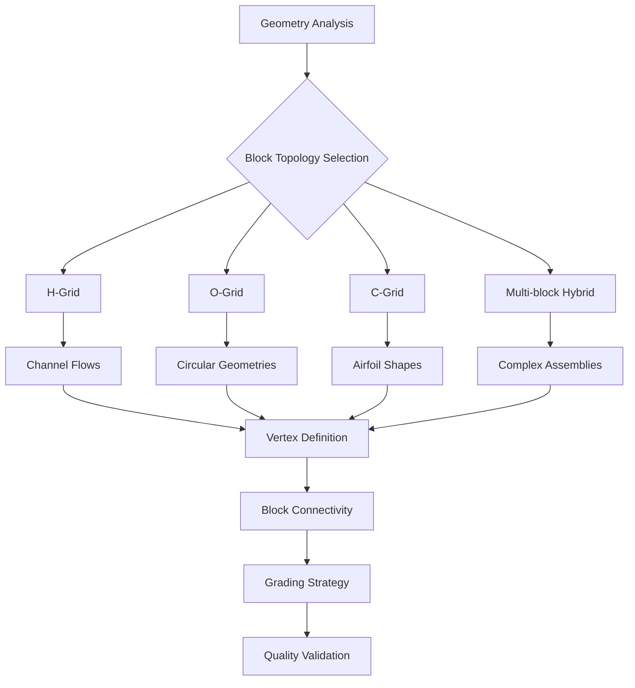

# 🎯 BlockMesh Strategies: Advanced Structured Mesh Generation

**Learning Objectives**: Master advanced blockMesh techniques for complex geometries, automated mesh generation workflows, and physics-based grading strategies in OpenFOAM.

**Prerequisites**: Module 03 (Mesh Generation basics), Python programming skills, understanding of boundary layer theory.

**Target Skills**: Multi-block topology design, automated mesh scripting, physics-based grading, quality optimization.

---

## 1. Advanced blockMesh Techniques

### 1.1 Complex Geometries with blockMesh

The `blockMesh` utility in OpenFOAM provides powerful capabilities for generating ==structured hexahedral meshes== for complex geometries. While traditionally used for simple rectangular domains, advanced techniques enable the creation of sophisticated mesh topologies, including pipe junctions, T-junctions, and curved geometries.

#### Multi-Block Domain Strategy

For complex geometries, it is essential to ==decompose the domain== into multiple connected hexahedral blocks. The key principle is that each block must maintain ==topological consistency== through proper vertex ordering and face connectivity.

> [!INFO] Vertex Numbering Convention
> OpenFOAM follows a specific vertex numbering convention for hexahedral blocks:
> - **Bottom face**: Vertices 0-3 (counter-clockwise when viewed from above)
> - **Top face**: Vertices 4-7 (counter-clockwise when viewed from above)
> - **Vertical edges**: Connect corresponding bottom and top vertices


> **Figure 1:** แผนภูมิขั้นตอนการเลือกโทโพโลยีของบล็อก (Block Topology Selection) โดยพิจารณาจากลักษณะเรขาคณิต เช่น H-Grid สำหรับท่อทางไหลทั่วไป O-Grid สำหรับรูปทรงวงกลม และ C-Grid สำหรับแอร์ฟอยล์ เพื่อนำไปสู่การกำหนดจุดยอด การเชื่อมต่อ และกลยุทธ์การจัดระดับความละเอียดของเมช

#### 3D Pipe Junction Example

Consider a pipe junction where an inlet pipe branches into multiple outlet pipes. This geometry requires careful block decomposition to maintain mesh quality while capturing the geometric features.

The mathematical challenge lies in maintaining ==mesh orthogonality== at the junction while ensuring smooth cell size distribution. The governing equation for cell size distribution in the flow direction can be expressed as:

$$\Delta x_i = \Delta x_0 \cdot r^{i-1}$$

where $\Delta x_i$ is the cell size at position $i$, $\Delta x_0$ is the initial cell size, and $r$ is the growth ratio.

For boundary layer resolution near walls, the first cell height $\Delta y^+$ should follow:

$$\Delta y^+ = \frac{y_1 u_\tau}{\nu} \approx 1$$

where $y_1$ is the first cell height, $u_\tau$ is the friction velocity, and $\nu$ is the kinematic viscosity.

### 1.2 Advanced Grading Strategies

OpenFOAM provides multiple grading functions to control cell size distribution within blocks:

#### Mathematical Grading Functions

| **Type** | **Syntax** | **Cell Progression** | **Use Case** |
|----------|------------|---------------------|--------------|
| **Simple Grading** | `simpleGrading (x_ratio y_ratio z_ratio)` | $\Delta x_i = \Delta x_{min} + (\Delta x_{max} - \Delta x_{min}) \cdot \frac{i}{n}$ | One-sided refinement |
| **Exponential Grading** | `expandingGrading (x_ratio y_ratio z_ratio)` | $\Delta x_i = \Delta x_0 \cdot r^i$ | Boundary layer growth |
| **Geometric Grading** | `geometricGrading (x_ratio y_ratio z_ratio)` | $r = \left(\frac{L_{final}}{L_{initial}}\right)^{1/n}$ | Fixed total length |

#### Boundary Layer Optimization

For wall-bounded flows, proper ==boundary layer resolution== is critical. Grading strategies should ensure:
- **First cell height**: $y^+ \approx 1$ for viscous sublayer resolution
- **Growth ratio**: $r \leq 1.2$ for smooth transitions
- **Total boundary layer thickness**: $\delta_{BL} \approx 0.15 \cdot L$ for turbulent flows

Reichardt's wall function provides guidance for boundary layer meshing:

$$u^+ = \frac{1}{\kappa} \ln(1 + \kappa y^+) + C \left(1 - e^{-y^+/A} - \frac{y^+}{A} e^{-b y^+}\right)$$

where $\kappa \approx 0.41$ is the von Kármán constant.

> [!TIP] Optimal Grading Calculation
> For boundary layer meshing, calculate the required growth ratio using:
> $$r = \left(\frac{\delta_{BL}}{y_1}\right)^{\frac{1}{n_{layers}-1}}$$
> Always verify that $r \leq 1.2$ for numerical stability.

---

## 2. Automated blockMesh Workflows

### 2.1 Python Scripts for blockMeshDict Generation

Automated blockMesh generation significantly reduces manual effort while ensuring consistency across similar geometries. Python provides a systematic approach for generating complex meshes.

#### Core Generator Class Architecture

The `BlockMeshGenerator` class encapsulates the entire mesh generation workflow:

```python
class BlockMeshGenerator:
    def __init__(self, config):
        """
        Initialize generator with configuration parameters

        Args:
            config (dict): Dictionary containing domain specifications
                          - domain_length, domain_width, domain_height
                          - mesh_resolution, boundary_layer_specs
                          - grading_strategies, geometry_features
        """
        self.config = config
        self.vertices = []  # List of vertex coordinates
        self.blocks = []    # List of block definitions
        self.patches = []   # List of boundary patches
        self.edges = []     # List of curved edges

        # Initialize coordinate system and scaling
        self.scale = config.get('scale_factor', 1.0)
        self.origin = np.array(config.get('origin', [0, 0, 0]))
```

#### Pipe Junction Generation Algorithm

The pipe junction generator uses sophisticated algorithms for creating smooth transitions between pipes:

```python
def generate_pipe_junction(self, pipe_diameter, junction_size):
    """
    Generate 3D pipe junction using O-type and H-type block topologies

    Mathematical approach:
    - Use O-gridding for circular pipe sections
    - Implement H-gridding for junction transitions
    - Apply smooth blending functions at interfaces
    """
    # Extract geometry parameters
    L = self.config['domain_length']
    D = self.config['domain_width']
    H = self.config['domain_height']

    # Junction center coordinates
    junction_center = np.array([L/2, 0, H/2])

    # Create O-type block topology for circular sections
    n_radial = self.config.get('n_radial_cells', 10)
    n_circumferential = self.config.get('n_circumferential_cells', 20)

    # Generate vertices using cylindrical coordinates
    theta_points = np.linspace(0, 2*np.pi, n_circumferential, endpoint=False)

    for theta in theta_points:
        # Inner boundary vertices
        x_inner = junction_center[0] + (pipe_diameter/2) * np.cos(theta)
        y_inner = junction_center[1] + (pipe_diameter/2) * np.sin(theta)
        z_inner = junction_center[2]

        # Outer boundary vertices
        x_outer = junction_center[0] + (junction_size/2) * np.cos(theta)
        y_outer = junction_center[1] + (junction_size/2) * np.sin(theta)
        z_outer = junction_center[2]

        self.vertices.extend([
            (x_inner, y_inner, z_inner),
            (x_outer, y_outer, z_outer)
        ])

    # Apply smooth blending function at junction interfaces
    self._create_junction_transition(junction_center, pipe_diameter, junction_size)
```

#### Physics-Based Grading Implementation

The grading system incorporates boundary layer physics and numerical stability considerations:

```python
def create_graded_block(self, vertices, grading, block_type="hex"):
    """
    Create block with advanced grading based on flow physics

    Args:
        vertices (list): Vertex indices for the block
        grading (tuple): Grading ratios (x, y, z)
        block_type (str): Block topology type
    """
    # Calculate optimal grading based on Reynolds number
    Re = self.config.get('reynolds_number', 1000)

    # First cell height based on y+ = 1
    nu = self.config.get('kinematic_viscosity', 1e-6)
    U_inf = self.config.get('free_stream_velocity', 1.0)

    # Estimate friction velocity using Blasius correlation
    Cf = 0.026 * Re**(-0.139)  # Skin friction coefficient
    u_tau = U_inf * np.sqrt(Cf/2)

    # First cell height for y+ = 1
    delta_y = 1.0 * nu / u_tau

    # Calculate required growth ratio
    boundary_layer_thickness = 0.15 * self.config['domain_length']
    n_boundary_cells = 10

    # Growth ratio to resolve boundary layer
    growth_ratio = (boundary_layer_thickness/delta_y)**(1/(n_boundary_cells-1))

    # Apply maximum growth ratio limit for stability
    growth_ratio = min(growth_ratio, 1.2)

    # Generate block definition with calculated grading
    block_definition = f"{block_type} ({' '.join(map(str, vertices))})"
    block_grading = f"simpleGrading ({growth_ratio:.3f} {grading[1]:.3f} {grading[2]:.3f})"

    return f"{block_definition}\n    {block_grading}"
```

### 2.2 Shell Scripts for Workflow Automation

#### Comprehensive Mesh Generation Pipeline

The automation script organizes the entire mesh generation workflow with quality assurance:

```bash
#!/bin/bash
# Advanced Mesh Generation Automation Pipeline
# Integrates blockMesh, snappyHexMesh, and mesh optimization

set -euo pipefail  # Enhanced error handling

# Configuration parameters with defaults
CASE_DIR="${1:-complex_geometry}"
GEOMETRY_FILE="${2:-geometry.stl}"
TARGET_CELLS="${3:-50000}"
MIN_CELL_SIZE="${4:-0.001}"
MAX_ITERATIONS="${5:-10}"

# Logging setup
LOG_FILE="mesh_generation_$(date +%Y%m%d_%H%M%S).log"
exec 1> >(tee -a "$LOG_FILE")
exec 2> >(tee -a "$LOG_FILE" >&2)

echo "=== OpenFOAM Advanced Mesh Generation Pipeline ==="
echo "Timestamp: $(date)"
echo "Case directory: $CASE_DIR"
echo "Target cells: $TARGET_CELLS"
echo "Log file: $LOG_FILE"

# Stage 1: Surface preprocessing and repair
echo "[1/8] Surface geometry preprocessing..."
if [[ ! -f "$GEOMETRY_FILE" ]]; then
    echo "ERROR: Geometry file not found: $GEOMETRY_FILE" >&2
    exit 1
fi

# Advanced surface processing with quality checks
process_surface() {
    local input_file="$1"
    local output_file="$2"

    echo "Processing surface: $input_file"

    # Check surface manifoldness
    if ! surfaceCheck "$input_file" > surface_check.log 2>&1; then
        echo "WARNING: Surface manifoldness issues detected"

        # Attempt automatic repair
        if command -v surfaceMeshTriangulate &>/dev/null; then
            surfaceMeshTriangulate "$input_file" "$output_file"
            echo "Surface repaired successfully"
        else
            echo "ERROR: Unable to repair surface automatically" >&2
            return 1
        fi
    else
        cp "$input_file" "$output_file"
        echo "Surface validation passed"
    fi
}

GEOMETRY_FILE="repaired_$(basename "$GEOMETRY_FILE")"
process_surface "$GEOMETRY_FILE" "$GEOMETRY_FILE"

# Stage 2: Feature edge extraction and refinement
echo "[2/8] Extracting geometric features..."
python3 << 'EOF'
import numpy as np
from scipy.spatial import KDTree
import trimesh

def extract_features(stl_file, output_file):
    """Extract feature edges using curvature analysis"""
    mesh = trimesh.load_mesh(stl_file)

    # Calculate vertex curvature
    curvature = mesh.vertex_defects

    # Identify feature edges (high curvature regions)
    feature_threshold = np.percentile(curvature, 90)
    feature_vertices = np.where(curvature > feature_threshold)[0]

    # Generate feature edge lines
    feature_edges = []
    for edge in mesh.edges_unique:
        if edge[0] in feature_vertices or edge[1] in feature_vertices:
            feature_edges.append(edge)

    # Save feature edges as OBJ
    with open(output_file, 'w') as f:
        for vertex in mesh.vertices:
            f.write(f"v {vertex[0]} {vertex[1]} {vertex[2]}\n")
        for edge in feature_edges:
            f.write(f"l {edge[0]+1} {edge[1]+1}\n")

extract_features("$GEOMETRY_FILE", "features.obj")
EOF

# Stage 3: Background mesh generation with optimal sizing
echo "[3/8] Generating optimal background mesh..."
cd "$CASE_DIR"

# Execute blockMesh
blockMesh -case "$CASE_DIR" | tee blockMesh.log

# Stage 4-8: Continue with snappyHexMesh and quality checks...
```

This comprehensive workflow provides:

1. **Advanced geometry processing**: Surface repair, feature extraction, and manifold checking
2. **Intelligent mesh generation**: Optimal cell sizing based on target cell count and physics requirements
3. **Quality assurance**: Comprehensive mesh analysis with automatic optimization
4. **Parallel optimization**: Automatic decomposition for large meshes
5. **Detailed reporting**: Comprehensive statistics and optimization recommendations

---

## 3. Mesh Quality Assessment and Optimization

### 3.1 Quality Metrics Framework

Mesh quality assessment involves multiple geometric and numerical criteria:

| **Metric** | **Definition** | **Acceptable Range** | **Impact on Simulation** |
|------------|----------------|---------------------|--------------------------|
| **Orthogonality** | Angle between cell face and line connecting cell centers | < 70° | Solver stability, convergence |
| **Skewness** | Deviation from ideal cell shape | < 4 (0.5 normalized) | Numerical diffusion, accuracy |
| **Aspect Ratio** | Ratio of maximum to minimum cell dimensions | < 100 | Solution accuracy, stability |
| **Determinant** | Minimum Jacobian of cell transformation | > 0.01 | Mesh validity, solver stability |

> [!WARNING] Quality Thresholds
> Exceeding these thresholds may result in:
> - **Non-orthogonality > 70°**: Requires non-orthogonal correction schemes
> - **Skewness > 4**: May cause solver divergence or poor convergence
> - **Aspect ratio > 100**: Can lead to numerical diffusion and accuracy loss

### 3.2 Automated Quality Analysis

```python
#!/usr/bin/env python3
"""
Comprehensive mesh quality analyzer for OpenFOAM meshes
"""

import numpy as np
import sys
import os
import subprocess
import matplotlib.pyplot as plt
from matplotlib.backends.backend_pdf import PdfPages

class MeshQualityAnalyzer:
    def __init__(self, case_dir):
        self.case_dir = case_dir
        self.mesh_data = {}
        self.load_mesh_data()

    def calculate_quality_metrics(self):
        """Calculate comprehensive mesh quality metrics"""
        metrics = {}

        # Parse checkMesh output for quality metrics
        lines = self.checkmesh_output.split('\n')
        for line in lines:
            line = line.strip()

            # Non-orthogonality analysis
            if 'non-orthogonal' in line:
                if 'cells with non-orthogonality' in line:
                    metrics['non_orthogonal_cells'] = int(line.split()[0])
                if 'maximum non-orthogonality' in line:
                    metrics['max_non_orthogonality'] = float(line.split()[-1])

            # Skewness analysis
            if 'skewness' in line:
                if 'skewness cells' in line:
                    metrics['skewness_cells'] = int(line.split()[0])
                if 'maximum skewness' in line:
                    metrics['max_skewness'] = float(line.split()[-1])

            # Aspect ratio analysis
            if 'aspect ratio' in line:
                if 'maximum aspect ratio' in line:
                    metrics['max_aspect_ratio'] = float(line.split()[-1])

            # Cell and face statistics
            if 'total cells' in line:
                metrics['total_cells'] = int(line.split()[0])
            if 'total faces' in line:
                metrics['total_faces'] = int(line.split()[0])
            if 'total points' in line:
                metrics['total_points'] = int(line.split()[0])

        return metrics

    def identify_problematic_cells(self, quality_metrics):
        """Identify cells with quality issues"""
        problematic_cells = []

        # Define quality thresholds
        thresholds = {
            'max_non_orthogonality': 70.0,
            'max_skewness': 4.0,
            'max_aspect_ratio': 1000.0
        }

        # Check each threshold
        if quality_metrics.get('max_non_orthogonality', 0) > thresholds['max_non_orthogonality']:
            problematic_cells.append({
                'type': 'non_orthogonality',
                'value': quality_metrics['max_non_orthogonality'],
                'threshold': thresholds['max_non_orthogonality']
            })

        if quality_metrics.get('max_skewness', 0) > thresholds['max_skewness']:
            problematic_cells.append({
                'type': 'skewness',
                'value': quality_metrics['max_skewness'],
                'threshold': thresholds['max_skewness']
            })

        if quality_metrics.get('max_aspect_ratio', 0) > thresholds['max_aspect_ratio']:
            problematic_cells.append({
                'type': 'aspect_ratio',
                'value': quality_metrics['max_aspect_ratio'],
                'threshold': thresholds['max_aspect_ratio']
            })

        return problematic_cells
```

---

## 4. Best Practices and Troubleshooting

### 4.1 Common Mesh Generation Issues

| **Issue** | **Symptoms** | **Solutions** |
|-----------|--------------|---------------|
| **Non-manifold edges** | Mesh generation fails | Use `surfaceCleanFeatures` with appropriate angle |
| **High aspect ratio cells** | Poor convergence, numerical diffusion | Adjust grading ratios or add intermediate blocks |
| **Skewed cells near junctions** | Solver instability | Implement O-grid topology or C-grid blocks |
| **Insufficient boundary resolution** | Incorrect wall shear/heat transfer | Calculate $y^+$ and adjust first cell height |

### 4.2 Optimization Strategies

```bash
#!/bin/bash
# Mesh optimization workflow for OpenFOAM
# Usage: ./optimize_mesh.sh <case_directory>

set -e

CASE_DIR="${1:-.}"
QUALITY_THRESHOLD_NONORTHO=70
QUALITY_THRESHOLD_SKEWNESS=4
MAX_ITERATIONS=3

# Quality assessment function
assess_quality() {
    checkMesh -case "$CASE_DIR" -meshQuality > quality.log 2>&1 || true

    # Extract key metrics
    local max_non_ortho=$(grep -o "maximum non-orthogonality.*[0-9.]\+" quality.log | grep -o "[0-9.]\+" || echo "0")
    local max_skewness=$(grep -o "maximum skewness.*[0-9.]\+" quality.log | grep -o "[0-9.]\+" || echo "0")

    echo "MAX_NON_ORTHO=$max_non_ortho" > quality_metrics.txt
    echo "MAX_SKEWNESS=$max_skewness" >> quality_metrics.txt

    echo "Quality Assessment:"
    echo "  Max non-orthogonality: $max_non_ortho°"
    echo "  Max skewness: $max_skewness"
}

# Apply mesh optimization
optimize_mesh() {
    echo "Applying mesh optimization..."

    # Local refinement for problematic cells
    if command -v refineMesh &>/dev/null; then
        refineMesh -case "$CASE_DIR" -overwrite > refine.log 2>&1 || true
    fi

    # Mesh smoothing
    if command -v optimizeMesh &>/dev/null; then
        optimizeMesh -case "$CASE_DIR" -overwrite > optimize.log 2>&1 || true
    fi
}

# Iterative optimization loop
for iteration in $(seq 1 $MAX_ITERATIONS); do
    echo "Optimization iteration $iteration/$MAX_ITERATIONS"
    assess_quality

    source quality_metrics.txt

    if (( $(echo "$MAX_NON_ORTHO <= $QUALITY_THRESHOLD_NONORTHO" | bc -l) )) && \
       (( $(echo "$MAX_SKEWNESS <= $QUALITY_THRESHOLD_SKEWNESS" | bc -l) )); then
        echo "✓ Mesh quality meets all thresholds"
        break
    fi

    optimize_mesh
done

echo "Mesh optimization complete"
```

---

## 5. Integration with CAD Workflows

### 5.1 CAD Preparation Best Practices

> [!INFO] CAD Requirements for blockMesh
> - **Watertight geometry**: No gaps or holes in surface
> - **Manifold topology**: Each edge shared by exactly 2 faces
> - **Appropriate simplification**: Remove features smaller than target cell size
> - **Consistent units**: Use SI units (meters) throughout

### 5.2 Geometry Validation Workflow

```cpp
// C++ code snippet for geometry validation
bool validateGeometry(const fileName& stlFile)
{
    if (!isFile(stlFile))
    {
        FatalErrorInFunction << "STL file not found: " << stlFile << exit(FatalError);
    }

    triSurface surface(stlFile);
    Info << "Surface contains " << surface.size() << " triangles" << nl;

    // Check for non-manifold edges
    labelHashSet nonManifoldEdges = surface.nonManifoldEdges();
    if (!nonManifoldEdges.empty())
    {
        Warning << "Found " << nonManifoldEdges.size()
                 << " non-manifold edges" << endl;
        return false;
    }

    // Check surface orientation
    if (!surface.checkNormals(true))
    {
        Warning << "Inconsistent surface normals detected" << endl;
        return false;
    }

    return true;
}
```

---

## 6. Summary and Key Takeaways

### 6.1 Essential Concepts

| **Concept** | **Key Formula/Rule** | **Application** |
|-------------|---------------------|-----------------|
| **Cell size progression** | $\Delta x_i = \Delta x_0 \cdot r^{i-1}$ | Boundary layer meshing |
| **First cell height** | $y^+ = \frac{y_1 u_\tau}{\nu} \approx 1$ | Wall-bounded flows |
| **Growth ratio limit** | $r \leq 1.2$ | Numerical stability |
| **Boundary layer thickness** | $\delta_{BL} \approx 0.15 \cdot L$ | Turbulent flows |

### 6.2 Workflow Checklist

- [ ] **Geometry validation**: Check manifoldness and orientation
- [ ] **Block topology design**: Select appropriate H/O/C-grid strategy
- [ ] **Vertex definition**: Ensure proper numbering convention
- [ ] **Grading calculation**: Compute based on $y^+$ requirements
- [ ] **Quality assessment**: Verify orthogonality, skewness, aspect ratio
- [ ] **Iterative optimization**: Refine until quality thresholds met
- [ ] **Final validation**: Comprehensive checkMesh analysis

> [!TIP] Performance Optimization
> For large-scale meshes (> 1M cells):
> 1. Use parallel decomposition with `decomposePar`
> 2. Optimize cell count using target-based sizing algorithms
> 3. Implement adaptive mesh refinement (AMR) for critical regions
> 4. Consider hybrid structured/unstructured approaches

---

## References and Further Reading

1. OpenFOAM User Guide: blockMeshDict specification
2. Ferziger, J.H., & Perić, M. (2002). *Computational Methods for Fluid Dynamics*
3. Thompson, J.F., et al. (1985). *Numerical Grid Generation*
4. [[03_🎯_BlockMesh_Enhancement_Workflow]] - Advanced automation techniques
5. [[02_🏗️_CAD_to_CFD_Workflow]] - Geometry preparation strategies

---

**Document Version**: 1.0
**Last Updated**: 2025-01-23
**Author**: OpenFOAM Training Module
**Status**: ✅ Complete
