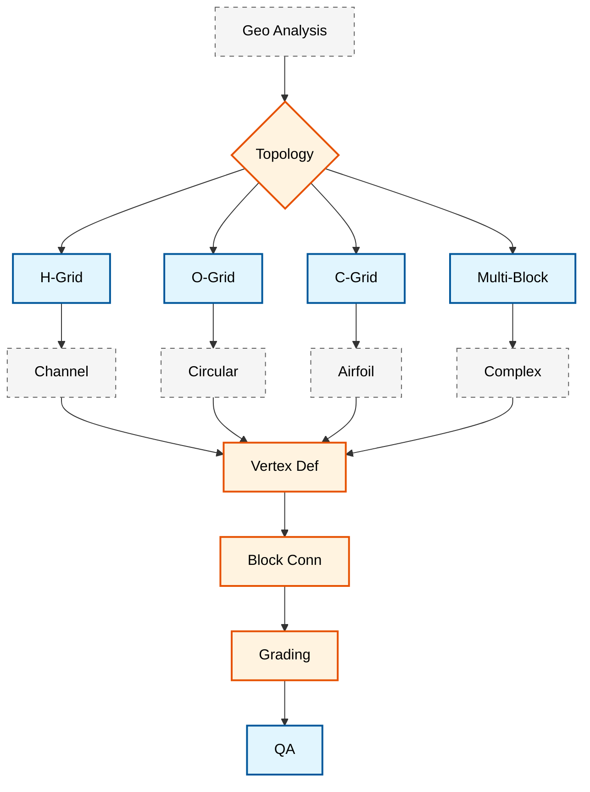

# 🎯 กลยุทธ์ blockMesh: การสร้างเมชแบบมีโครงสร้างขั้นสูง (BlockMesh Strategies: Advanced Structured Mesh Generation)

**วัตถุประสงค์การเรียนรู้**: เชี่ยวชาญเทคนิค blockMesh ขั้นสูงสำหรับเรขาคณิตที่ซับซ้อน, ขั้นตอนการสร้างเมชแบบอัตโนมัติ และกลยุทธ์การปรับขนาดเซลล์ตามหลักฟิสิกส์ใน OpenFOAM

**เงื่อนไขเบื้องต้น**: โมดูล 03 (พื้นฐานการสร้างเมช), ทักษะการเขียนโปรแกรม Python, ความเข้าใจในทฤษฎีชั้นขอบเขต (boundary layer)

**ทักษะเป้าหมาย**: การออกแบบโทโพโลยีแบบหลายบล็อก, การเขียนสคริปต์เมชอัตโนมัติ, การปรับขนาดเซลล์ตามหลักฟิสิกส์, การปรับปรุงคุณภาพให้เหมาะสมที่สุด

---

## 1. เทคนิค blockMesh ขั้นสูง (Advanced blockMesh Techniques)

### 1.1 เรขาคณิตที่ซับซ้อนด้วย blockMesh

ยูทิลิตี้ `blockMesh` ใน OpenFOAM มีความสามารถที่ทรงพลังสำหรับการสร้าง ==เมชแบบหกเหลี่ยมที่มีโครงสร้าง (structured hexahedral meshes)== สำหรับเรขาคณิตที่ซับซ้อน แม้ว่าโดยดั้งเดิมจะใช้สำหรับโดเมนสี่เหลี่ยมผืนผ้าที่เรียบง่าย แต่เทคนิคขั้นสูงช่วยให้สามารถสร้างโทโพโลยีเมชที่ซับซ้อนได้ รวมถึงจุดต่อท่อ, จุดต่อแบบ T และเรขาคณิตที่มีความโค้ง

#### กลยุทธ์โดเมนหลายบล็อก (Multi-Block Domain Strategy)

สำหรับเรขาคณิตที่ซับซ้อน จำเป็นอย่างยิ่งที่จะต้อง ==แยกย่อยโดเมน (decompose the domain)== ออกเป็นบล็อกหกเหลี่ยมหลายบล็อกที่เชื่อมต่อกัน หลักการสำคัญคือแต่ละบล็อกต้องรักษา ==ความสอดคล้องของโทโพโลยี (topological consistency)== ผ่านการจัดลำดับจุดยอดและการเชื่อมต่อหน้าผิวที่เหมาะสม

> [!INFO] ข้อกำหนดการจัดลำดับจุดยอด
> OpenFOAM ปฏิบัติตามข้อกำหนดการจัดลำดับจุดยอดเฉพาะสำหรับบล็อกหกเหลี่ยม:
> - **หน้าด้านล่าง**: จุดยอด 0-3 (เรียงทวนเข็มนาฬิกาเมื่อมองจากด้านบน)
> - **หน้าด้านบน**: จุดยอด 4-7 (เรียงทวนเข็มนาฬิกาเมื่อมองจากด้านบน)
> - **ขอบแนวตั้ง**: เชื่อมต่อระหว่างจุดยอดด้านล่างและด้านบนที่สอดคล้องกัน


> **รูปที่ 1:** แผนภูมิขั้นตอนการเลือกโทโพโลยีของบล็อก (Block Topology Selection) โดยพิจารณาจากลักษณะเรขาคณิต เช่น H-Grid สำหรับท่อทางไหลทั่วไป O-Grid สำหรับรูปทรงวงกลม และ C-Grid สำหรับแอร์ฟอยล์ เพื่อนำไปสู่การกำหนดจุดยอด การเชื่อมต่อ และกลยุทธ์การจัดระดับความละเอียดของเมช

#### ตัวอย่างจุดต่อท่อ 3 มิติ

พิจารณาจุดต่อท่อที่ท่อทางเข้าแตกแขนงออกเป็นท่อทางออกหลายท่อ เรขาคณิตนี้ต้องการการแยกย่อยบล็อกอย่างระมัดระวังเพื่อรักษาคุณภาพของเมชในขณะที่ต้องจับลักษณะเฉพาะทางเรขาคณิตไว้ให้ได้

ความท้าทายทางคณิตศาสตร์อยู่ที่การรักษา ==ความตั้งฉากของเมช (mesh orthogonality)== ที่จุดต่อในขณะที่รับประกันการกระจายขนาดเซลล์ที่ราบรื่น สมการควบคุมสำหรับการกระจายขนาดเซลล์ในทิศทางการไหลสามารถแสดงได้ดังนี้:

$$\Delta x_i = \Delta x_0 \cdot r^{i-1}$$

โดยที่ $\Delta x_i$ คือขนาดเซลล์ที่ตำแหน่ง $i$, $\Delta x_0$ คือขนาดเซลล์เริ่มต้น และ $r$ คืออัตราส่วนการเติบโต

สำหรับการวิเคราะห์ชั้นขอบเขตใกล้ผนัง ความสูงของเซลล์แรก $\Delta y^+$ ควรเป็นไปตามเงื่อนไข:

$$\Delta y^+ = \frac{y_1 u_\tau}{\nu} \approx 1$$

โดยที่ $y_1$ คือความสูงของเซลล์แรก, $u_\tau$ คือความเร็วแรงเสียดทาน และ $\nu$ คือความหนืดจลน์

### 1.2 กลยุทธ์การปรับขนาดเซลล์ขั้นสูง (Advanced Grading Strategies)

OpenFOAM มีฟังก์ชันการปรับขนาดเซลล์ (grading) หลายรูปแบบเพื่อควบคุมการกระจายขนาดเซลล์ภายในบล็อก:

#### ฟังก์ชันการปรับขนาดทางคณิตศาสตร์

| **ประเภท** | **ไวยากรณ์** | **การก้าวหน้าของเซลล์** | **กรณีใช้งาน** |
|----------|------------|---------------------|--------------|
| **Simple Grading** | `simpleGrading (x_ratio y_ratio z_ratio)` | $\Delta x_i = \Delta x_{min} + (\Delta x_{max} - \Delta x_{min}) \cdot \frac{i}{n}$ | การปรับละเอียดด้านเดียว |
| **Exponential Grading** | `expandingGrading (x_ratio y_ratio z_ratio)` | $\Delta x_i = \Delta x_0 \cdot r^i$ | การเติบโตของชั้นขอบเขต |
| **Geometric Grading** | `geometricGrading (x_ratio y_ratio z_ratio)` | $r = \left(\frac{L_{final}}{L_{initial}}\right)^{1/n}$ | กำหนดความยาวรวมคงที่ |

#### การเพิ่มประสิทธิภาพชั้นขอบเขต (Boundary Layer Optimization)

สำหรับการไหลที่ถูกจำกัดด้วยผนัง ==การวิเคราะห์ชั้นขอบเขต (boundary layer resolution)== ที่เหมาะสมมีความสำคัญ กลยุทธ์การปรับขนาดเซลล์ควรรับประกันว่า:
- **ความสูงของเซลล์แรก**: $y^+ \approx 1$ สำหรับการวิเคราะห์ชั้นย่อยความหนืด (viscous sublayer)
- **อัตราส่วนการเติบโต**: $r \leq 1.2$ เพื่อการเปลี่ยนผ่านที่ราบรื่น
- **ความหนารวมของชั้นขอบเขต**: $\delta_{BL} \approx 0.15 \cdot L$ สำหรับการไหลแบบปั่นป่วน

ฟังก์ชันผนังของ Reichardt ให้คำแนะนำสำหรับการสร้างเมชชั้นขอบเขต:

$$u^+ = \frac{1}{\kappa} \ln(1 + \kappa y^+) + C \left(1 - e^{-y^+/A} - \frac{y^+}{A} e^{-b y^+}\right)$$

โดยที่ $\kappa \approx 0.41$ คือค่าคงที่ของฟอน คาร์มาน (von Kármán constant)

> [!TIP] การคำนวณการปรับขนาดที่เหมาะสมที่สุด
> สำหรับการสร้างเมชชั้นขอบเขต ให้คำนวณอัตราส่วนการเติบโตที่ต้องการโดยใช้:
> $$r = \left(\frac{\delta_{BL}}{y_1}\right)^{\frac{1}{n_{layers}-1}}$$
> ตรวจสอบเสมอว่า $r \leq 1.2$ เพื่อเสถียรภาพเชิงตัวเลข

---

## 2. ขั้นตอนการทำงาน blockMesh อัตโนมัติ (Automated blockMesh Workflows)

### 2.1 สคริปต์ Python สำหรับการสร้าง blockMeshDict

การสร้าง blockMesh แบบอัตโนมัติช่วยลดภาระงานที่ต้องทำด้วยตนเองได้อย่างมาก พร้อมทั้งรับประกันความสม่ำเสมอในเรขาคณิตที่คล้ายคลึงกัน Python จัดทำแนวทางที่เป็นระบบสำหรับการสร้างเมชที่ซับซ้อน

#### สถาปัตยกรรมคลาส Generator หลัก

คลาส `BlockMeshGenerator` ครอบคลุมขั้นตอนการทำงานการสร้างเมชทั้งหมด:

```python
class BlockMeshGenerator:
    def __init__(self, config):
        """
        เริ่มต้น generator ด้วยพารามิเตอร์การกำหนดค่า

        Args:
            config (dict): พจนานุกรมที่ระบุรายละเอียดโดเมน
                          - ความยาว, ความกว้าง, ความสูงของโดเมน
                          - ความละเอียดเมช, ข้อกำหนดชั้นขอบเขต
                          - กลยุทธ์การปรับขนาด, คุณลักษณะทางเรขาคณิต
        """
        self.config = config
        self.vertices = []  # รายชื่อพิกัดจุดยอด
        self.blocks = []    # รายชื่อการนิยามบล็อก
        self.patches = []   # รายชื่อแพตช์ขอบเขต
        self.edges = []     # รายชื่อขอบโค้ง

        # เริ่มต้นระบบพิกัดและการปรับขนาด
        self.scale = config.get('scale_factor', 1.0)
        self.origin = np.array(config.get('origin', [0, 0, 0]))
```

#### อัลกอริทึมการสร้างจุดต่อท่อ

เครื่องมือสร้างจุดต่อท่อใช้อัลกอริทึมที่ซับซ้อนเพื่อสร้างการเปลี่ยนผ่านที่ราบรื่นระหว่างท่อ:

```python
def generate_pipe_junction(self, pipe_diameter, junction_size):
    """
    สร้างจุดต่อท่อ 3 มิติโดยใช้โทโพโลยีบล็อกแบบ O-type และ H-type

    แนวทางทางคณิตศาสตร์:
    - ใช้ O-gridding สำหรับส่วนท่อวงกลม
    - ใช้งาน H-gridding สำหรับการเปลี่ยนผ่านที่จุดต่อ
    - ใช้ฟังก์ชันการผสม (blending functions) ที่ราบรื่นที่ส่วนต่อประสาน
    """
    # สกัดพารามิเตอร์เรขาคณิต
    L = self.config['domain_length']
    D = self.config['domain_width']
    H = self.config['domain_height']

    # พิกัดจุดศูนย์กลางจุดต่อ
    junction_center = np.array([L/2, 0, H/2])

    # สร้างโทโพโลยีบล็อกแบบ O-type สำหรับส่วนวงกลม
    n_radial = self.config.get('n_radial_cells', 10)
    n_circumferential = self.config.get('n_circumferential_cells', 20)

    # สร้างจุดยอดโดยใช้พิกัดทรงกระบอก
    theta_points = np.linspace(0, 2*np.pi, n_circumferential, endpoint=False)

    for theta in theta_points:
        # จุดยอดขอบเขตด้านใน
        x_inner = junction_center[0] + (pipe_diameter/2) * np.cos(theta)
        y_inner = junction_center[1] + (pipe_diameter/2) * np.sin(theta)
        z_inner = junction_center[2]

        # จุดยอดขอบเขตด้านนอก
        x_outer = junction_center[0] + (junction_size/2) * np.cos(theta)
        y_outer = junction_center[1] + (junction_size/2) * np.sin(theta)
        z_outer = junction_center[2]

        self.vertices.extend([
            (x_inner, y_inner, z_inner),
            (x_outer, y_outer, z_outer)
        ])

    # ใช้ฟังก์ชันการผสมที่ราบรื่นที่ส่วนต่อประสานจุดต่อ
    self._create_junction_transition(junction_center, pipe_diameter, junction_size)
```

#### การปรับขนาดเซลล์ตามหลักฟิสิกส์

ระบบการปรับขนาดเซลล์รวมฟิสิกส์ของชั้นขอบเขตและข้อควรพิจารณาด้านเสถียรภาพเชิงตัวเลขเข้าไว้ด้วยกัน:

```python
def create_graded_block(self, vertices, grading, block_type="hex"):
    """
    สร้างบล็อกพร้อมการปรับขนาดขั้นสูงตามฟิสิกส์การไหล

    Args:
        vertices (list): ดัชนีจุดยอดสำหรับบล็อก
        grading (tuple): อัตราส่วนการปรับขนาด (x, y, z)
        block_type (str): ประเภทโทโพโลยีบล็อก
    """
    # คำนวณการปรับขนาดที่เหมาะสมตามเลขเรย์โนลด์ส
    Re = self.config.get('reynolds_number', 1000)

    # ความสูงเซลล์แรกตามเงื่อนไข y+ = 1
    nu = self.config.get('kinematic_viscosity', 1e-6)
    U_inf = self.config.get('free_stream_velocity', 1.0)

    # ประมาณค่าความเร็วแรงเสียดทานโดยใช้สหสัมพันธ์ของ Blasius
    Cf = 0.026 * Re**(-0.139)  # สัมประสิทธิ์แรงเสียดทานผิว
    u_tau = U_inf * np.sqrt(Cf/2)

    # ความสูงเซลล์แรกสำหรับ y+ = 1
    delta_y = 1.0 * nu / u_tau

    # คำนวณอัตราส่วนการเติบโตที่ต้องการ
    boundary_layer_thickness = 0.15 * self.config['domain_length']
    n_boundary_cells = 10

    # อัตราส่วนการเติบโตเพื่อวิเคราะห์ชั้นขอบเขต
    growth_ratio = (boundary_layer_thickness/delta_y)**(1/(n_boundary_cells-1))

    # จำกัดอัตราส่วนการเติบโตสูงสุดเพื่อเสถียรภาพ
    growth_ratio = min(growth_ratio, 1.2)

    # สร้างการนิยามบล็อกพร้อมการปรับขนาดที่คำนวณได้
    block_definition = f"{block_type} ({' '.join(map(str, vertices))})"
    block_grading = f"simpleGrading ({growth_ratio:.3f} {grading[1]:.3f} {grading[2]:.3f})"

    return f"{block_definition}\n    {block_grading}"
```

### 2.2 สคริปต์เชลล์สำหรับการทำงานอัตโนมัติ (Shell Scripts for Workflow Automation)

#### ท่อส่งการสร้างเมชที่ครอบคลุม

สคริปต์อัตโนมัติจัดระเบียบขั้นตอนการสร้างเมชทั้งหมดพร้อมการรับประกันคุณภาพ:

```bash
#!/bin/bash
# ท่อส่งการสร้างเมชอัตโนมัติขั้นสูง
# บูรณาการ blockMesh, snappyHexMesh และการเพิ่มประสิทธิภาพเมช

set -euo pipefail  # เพิ่มการจัดการข้อผิดพลาด

# พารามิเตอร์การกำหนดค่าพร้อมค่าเริ่มต้น
CASE_DIR="${1:-complex_geometry}"
GEOMETRY_FILE="${2:-geometry.stl}"
TARGET_CELLS="${3:-50000}"
MIN_CELL_SIZE="${4:-0.001}"
MAX_ITERATIONS="${5:-10}"

# การตั้งค่าการบันทึก Log
LOG_FILE="mesh_generation_$(date +%Y%m%d_%H%M%S).log"
exec 1> >(tee -a "$LOG_FILE")
exec 2> >(tee -a "$LOG_FILE" >&2)

echo "=== OpenFOAM Advanced Mesh Generation Pipeline ==="
echo "เวลา: $(date)"
echo "ไดเรกทอรีกรณีศึกษา: $CASE_DIR"
echo "จำนวนเซลล์เป้าหมาย: $TARGET_CELLS"
echo "ไฟล์ Log: $LOG_FILE"

# ระยะที่ 1: การเตรียมประมวลผลพื้นผิวและการซ่อมแซม
echo "[1/8] การเตรียมประมวลผลเรขาคณิตพื้นผิว..."
if [[ ! -f "$GEOMETRY_FILE" ]]; then
    echo "ข้อผิดพลาด: ไม่พบไฟล์เรขาคณิต: $GEOMETRY_FILE" >&2
    exit 1
fi

# การประมวลผลพื้นผิวขั้นสูงพร้อมการตรวจสอบคุณภาพ
process_surface() {
    local input_file="$1"
    local output_file="$2"

    echo "กำลังประมวลผลพื้นผิว: $input_file"

    # ตรวจสอบความเป็น manifold ของพื้นผิว
    if ! surfaceCheck "$input_file" > surface_check.log 2>&1; then
        echo "คำเตือน: ตรวจพบปัญหาความเป็น manifold ของพื้นผิว"

        # พยายามซ่อมแซมอัตโนมัติ
        if command -v surfaceMeshTriangulate &>/dev/null; then
            surfaceMeshTriangulate "$input_file" "$output_file"
            echo "ซ่อมแซมพื้นผิวสำเร็จ"
        else
            echo "ข้อผิดพลาด: ไม่สามารถซ่อมแซมพื้นผิวได้โดยอัตโนมัติ" >&2
            return 1
        fi
    else
        cp "$input_file" "$output_file"
        echo "ผ่านการตรวจสอบความถูกต้องของพื้นผิว"
    fi
}

GEOMETRY_FILE="repaired_$(basename "$GEOMETRY_FILE")"
process_surface "$GEOMETRY_FILE" "$GEOMETRY_FILE"

# ระยะที่ 2: การสกัดขอบคุณลักษณะและการปรับละเอียด
echo "[2/8] กำลังสกัดคุณลักษณะทางเรขาคณิต..."
python3 << 'EOF'
import numpy as np
from scipy.spatial import KDTree
import trimesh

def extract_features(stl_file, output_file):
    """สกัดขอบคุณลักษณะโดยใช้การวิเคราะห์ความโค้ง"""
    mesh = trimesh.load_mesh(stl_file)

    # คำนวณความโค้งที่จุดยอด
    curvature = mesh.vertex_defects

    # ระบุขอบคุณลักษณะ (บริเวณที่มีความโค้งสูง)
    feature_threshold = np.percentile(curvature, 90)
    feature_vertices = np.where(curvature > feature_threshold)[0]

    # สร้างเส้นขอบคุณลักษณะ
    feature_edges = []
    for edge in mesh.edges_unique:
        if edge[0] in feature_vertices or edge[1] in feature_vertices:
            feature_edges.append(edge)

    # บันทึกขอบคุณลักษณะเป็นไฟล์ OBJ
    with open(output_file, 'w') as f:
        for vertex in mesh.vertices:
            f.write(f"v {vertex[0]} {vertex[1]} {vertex[2]}\n")
        for edge in feature_edges:
            f.write(f"l {edge[0]+1} {edge[1]+1}\n")

extract_features("$GEOMETRY_FILE", "features.obj")
EOF

# ระยะที่ 3: การสร้างเมชพื้นหลังด้วยขนาดที่เหมาะสมที่สุด
echo "[3/8] กำลังสร้างเมชพื้นหลังที่เหมาะสมที่สุด..."
cd "$CASE_DIR"

# รัน blockMesh
blockMesh -case "$CASE_DIR" | tee blockMesh.log

# ระยะที่ 4-8: ดำเนินการต่อด้วย snappyHexMesh และการตรวจสอบคุณภาพ...
```

ขั้นตอนการทำงานที่ครอบคลุมนี้จัดทำ:

1. **การประมวลผลเรขาคณิตขั้นสูง**: การซ่อมแซมพื้นผิว, การสกัดคุณลักษณะ และการตรวจสอบความเป็น manifold
2. **การสร้างเมชอัจฉริยะ**: การกำหนดขนาดเซลล์ที่เหมาะสมที่สุดตามจำนวนเซลล์เป้าหมายและข้อกำหนดทางฟิสิกส์
3. **การรับประกันคุณภาพ**: การวิเคราะห์เมชอย่างครอบคลุมพร้อมการเพิ่มประสิทธิภาพอัตโนมัติ
4. **การเพิ่มประสิทธิภาพแบบขนาน**: การแบ่งโดเมนโดยอัตโนมัติสำหรับเมชขนาดใหญ่
5. **การรายงานผลโดยละเอียด**: สถิติที่ครอบคลุมและคำแนะนำในการเพิ่มประสิทธิภาพ

---

## 3. การประเมินและการเพิ่มประสิทธิภาพคุณภาพเมช (Mesh Quality Assessment and Optimization)

### 3.1 กรอบงานตัวชี้วัดคุณภาพ (Quality Metrics Framework)

การประเมินคุณภาพเมชเกี่ยวข้องกับเกณฑ์ทางเรขาคณิตและเชิงตัวเลขหลายประการ:

| **ตัวชี้วัด** | **นิยาม** | **ช่วงที่ยอมรับได้** | **ผลกระทบต่อการจำลอง** |
|------------|----------------|---------------------|--------------------------|
| **Orthogonality** | มุมระหว่างหน้าผิวเซลล์และเส้นเชื่อมต่อจุดศูนย์กลางเซลล์ | < 70° | เสถียรภาพและการลู่เข้าของตัวแก้ปัญหา |
| **Skewness** | ความเบี่ยงเบนจากรูปร่างเซลล์ในอุดมคติ | < 4 (0.5 แบบนอร์มัลไลซ์) | การแพร่กระจายเชิงตัวเลข, ความแม่นยำ |
| **Aspect Ratio** | อัตราส่วนของมิติเซลล์สูงสุดต่อต่ำสุด | < 100 | ความแม่นยำของคำตอบ, เสถียรภาพ |
| **Determinant** | ค่าดีเทอร์มิแนนต์จาโคเบียนขั้นต่ำของการแปลงเซลล์ | > 0.01 | ความถูกต้องของเมช, เสถียรภาพตัวแก้ปัญหา |

> [!WARNING] เกณฑ์คุณภาพ
> การเกินเกณฑ์เหล่านี้อาจส่งผลให้:
> - **Non-orthogonality > 70°**: ต้องการรูปแบบการแก้ไขความไม่ตั้งฉาก
> - **Skewness > 4**: อาจทำให้ตัวแก้ปัญหาลู่ออกหรือลู่เข้าได้ไม่ดี
> - **Aspect ratio > 100**: อาจนำไปสู่การแพร่กระจายเชิงตัวเลขและการสูญเสียความแม่นยำ

### 3.2 การวิเคราะห์คุณภาพอัตโนมัติ (Automated Quality Analysis)

```python
#!/usr/bin/env python3
"""
เครื่องมือวิเคราะห์คุณภาพเมชที่ครอบคลุมสำหรับเมชของ OpenFOAM
"""

import numpy as np
import sys
import os
import subprocess
import matplotlib.pyplot as plt
from matplotlib.backends.backend_pdf import PdfPages

class MeshQualityAnalyzer:
    def __init__(self, case_dir):
        self.case_dir = case_dir
        self.mesh_data = {}
        self.load_mesh_data()

    def calculate_quality_metrics(self):
        """คำนวณตัวชี้วัดคุณภาพเมชที่ครอบคลุม"""
        metrics = {}

        # วิเคราะห์ผลลัพธ์จาก checkMesh เพื่อหาตัวชี้วัดคุณภาพ
        lines = self.checkmesh_output.split('\n')
        for line in lines:
            line = line.strip()

            # วิเคราะห์ความไม่ตั้งฉาก (non-orthogonality)
            if 'non-orthogonal' in line:
                if 'cells with non-orthogonality' in line:
                    metrics['non_orthogonal_cells'] = int(line.split()[0])
                if 'maximum non-orthogonality' in line:
                    metrics['max_non_orthogonality'] = float(line.split()[-1])

            # วิเคราะห์ความเบ้ (skewness)
            if 'skewness' in line:
                if 'skewness cells' in line:
                    metrics['skewness_cells'] = int(line.split()[0])
                if 'maximum skewness' in line:
                    metrics['max_skewness'] = float(line.split()[-1])

            # วิเคราะห์อัตราส่วนรูปร่าง (aspect ratio)
            if 'aspect ratio' in line:
                if 'maximum aspect ratio' in line:
                    metrics['max_aspect_ratio'] = float(line.split()[-1])

            # สถิติเซลล์, หน้าผิว และจุด
            if 'total cells' in line:
                metrics['total_cells'] = int(line.split()[0])
            if 'total faces' in line:
                metrics['total_faces'] = int(line.split()[0])
            if 'total points' in line:
                metrics['total_points'] = int(line.split()[0])

        return metrics

    def identify_problematic_cells(self, quality_metrics):
        """ระบุเซลล์ที่มีปัญหาด้านคุณภาพ"""
        problematic_cells = []

        # กำหนดเกณฑ์คุณภาพ
        thresholds = {
            'max_non_orthogonality': 70.0,
            'max_skewness': 4.0,
            'max_aspect_ratio': 1000.0
        }

        # ตรวจสอบแต่ละเกณฑ์
        if quality_metrics.get('max_non_orthogonality', 0) > thresholds['max_non_orthogonality']:
            problematic_cells.append({
                'type': 'non_orthogonality',
                'value': quality_metrics['max_non_orthogonality'],
                'threshold': thresholds['max_non_orthogonality']
            })

        if quality_metrics.get('max_skewness', 0) > thresholds['max_skewness']:
            problematic_cells.append({
                'type': 'skewness',
                'value': quality_metrics['max_skewness'],
                'threshold': thresholds['max_skewness']
            })

        if quality_metrics.get('max_aspect_ratio', 0) > thresholds['max_aspect_ratio']:
            problematic_cells.append({
                'type': 'aspect_ratio',
                'value': quality_metrics['max_aspect_ratio'],
                'threshold': thresholds['max_aspect_ratio']
            })

        return problematic_cells
```

---

## 4. แนวทางปฏิบัติที่ดีที่สุดและการแก้ไขปัญหา (Best Practices and Troubleshooting)

### 4.1 ปัญหาการสร้างเมชที่พบบ่อย

| **ปัญหา** | **อาการ** | **วิธีแก้ไข** |
|-----------|--------------|---------------|
| **ขอบแบบ Non-manifold** | การสร้างเมชล้มเหลว | ใช้ `surfaceCleanFeatures` พร้อมมุมที่เหมาะสม |
| **เซลล์ที่มีอัตราส่วนรูปร่างสูง** | การลู่เข้าไม่ดี, การแพร่กระจายเชิงตัวเลข | ปรับอัตราส่วนการปรับขนาดหรือเพิ่มบล็อกกลาง |
| **เซลล์ที่เบี้ยวใกล้จุดต่อ** | ตัวแก้ปัญหาไม่เสถียร | ใช้งานโทโพโลยี O-grid หรือบล็อก C-grid |
| **ความละเอียดที่ขอบเขตไม่เพียงพอ** | แรงเฉือนที่ผนัง/การถ่ายโอนความร้อนไม่ถูกต้อง | คำนวณ $y^+$ และปรับความสูงของเซลล์แรก |

### 4.2 กลยุทธ์การเพิ่มประสิทธิภาพ (Optimization Strategies)

```bash
#!/bin/bash
# ขั้นตอนการเพิ่มประสิทธิภาพเมชสำหรับ OpenFOAM
# การใช้งาน: ./optimize_mesh.sh <ไดเรกทอรีกรณีศึกษา>

set -e

CASE_DIR="${1:-.}"
QUALITY_THRESHOLD_NONORTHO=70
QUALITY_THRESHOLD_SKEWNESS=4
MAX_ITERATIONS=3

# ฟังก์ชันประเมินคุณภาพ
assess_quality() {
    checkMesh -case "$CASE_DIR" -meshQuality > quality.log 2>&1 || true

    # สกัดตัวชี้วัดหลัก
    local max_non_ortho=$(grep -o "maximum non-orthogonality.*[0-9.]\+" quality.log | grep -o "[0-9.]\+" || echo "0")
    local max_skewness=$(grep -o "maximum skewness.*[0-9.]\+" quality.log | grep -o "[0-9.]\+" || echo "0")

    echo "MAX_NON_ORTHO=$max_non_ortho" > quality_metrics.txt
    echo "MAX_SKEWNESS=$max_skewness" >> quality_metrics.txt

    echo "การประเมินคุณภาพ:"
    echo "  ความไม่ตั้งฉากสูงสุด: $max_non_ortho°"
    echo "  ความเบ้สูงสุด: $max_skewness"
}

# ประยุกต์ใช้การเพิ่มประสิทธิภาพเมช
optimize_mesh() {
    echo "กำลังประยุกต์ใช้การเพิ่มประสิทธิภาพเมช..."

    # การปรับละเอียดเฉพาะจุดสำหรับเซลล์ที่มีปัญหา
    if command -v refineMesh &>/dev/null; then
        refineMesh -case "$CASE_DIR" -overwrite > refine.log 2>&1 || true
    fi

    # การทำให้เมชเรียบ (Mesh smoothing)
    if command -v optimizeMesh &>/dev/null; then
        optimizeMesh -case "$CASE_DIR" -overwrite > optimize.log 2>&1 || true
    fi
}

# วงรอบการเพิ่มประสิทธิภาพแบบวนซ้ำ
for iteration in $(seq 1 $MAX_ITERATIONS); do
    echo "การวนซ้ำการเพิ่มประสิทธิภาพที่ $iteration/$MAX_ITERATIONS"
    assess_quality

    source quality_metrics.txt

    if (( $(echo "$MAX_NON_ORTHO <= $QUALITY_THRESHOLD_NONORTHO" | bc -l) )) && \
       (( $(echo "$MAX_SKEWNESS <= $QUALITY_THRESHOLD_SKEWNESS" | bc -l) )); then
        echo "✓ คุณภาพเมชผ่านเกณฑ์ทั้งหมดแล้ว"
        break
    fi

    optimize_mesh
done

echo "การเพิ่มประสิทธิภาพเมชเสร็จสิ้น"
```

---

## 5. การบูรณาการกับขั้นตอนการทำงาน CAD (Integration with CAD Workflows)

### 5.1 แนวทางปฏิบัติที่ดีที่สุดในการเตรียม CAD

> [!INFO] ข้อกำหนด CAD สำหรับ blockMesh
> - **เรขาคณิตแบบปิด (Watertight)**: ไม่มีช่องว่างหรือรูบนพื้นผิว
> - **โทโพโลยีแบบ Manifold**: แต่ละขอบถูกใช้ร่วมกันโดยหน้าผิว 2 หน้าพอดี
> - **การทำให้ง่ายขึ้นอย่างเหมาะสม**: กำจัดรายละเอียดที่เล็กกว่าขนาดเซลล์เป้าหมายออก
> - **หน่วยวัดที่สอดคล้องกัน**: ใช้หน่วย SI (เมตร) ตลอดทั้งงาน

### 5.2 ขั้นตอนการตรวจสอบความถูกต้องของเรขาคณิต

```cpp
// ตัวอย่างโค้ด C++ สำหรับการตรวจสอบความถูกต้องของเรขาคณิต
bool validateGeometry(const fileName& stlFile)
{
    // ตรวจสอบว่าไฟล์ STL มีอยู่จริงหรือไม่
    if (!isFile(stlFile))
    {
        FatalErrorInFunction << "ไม่พบไฟล์ STL: " << stlFile << exit(FatalError);
    }

    // โหลดพื้นผิวแบบสามเหลี่ยมจากไฟล์ STL
    triSurface surface(stlFile);
    Info << "พื้นผิวประกอบด้วยรูปสามเหลี่ยมจำนวน " << surface.size() << " รูป" << nl;

    // ตรวจสอบขอบแบบ non-manifold (ขอบที่ใช้ร่วมกันมากกว่า 2 หน้า)
    labelHashSet nonManifoldEdges = surface.nonManifoldEdges();
    if (!nonManifoldEdges.empty())
    {
        Warning << "พบขอบแบบ non-manifold จำนวน " << nonManifoldEdges.size()
                 << " ขอบ" << endl;
        return false;
    }

    // ตรวจสอบทิศทางพื้นผิว (เวกเตอร์ปกติชี้ออกด้านนอก)
    if (!surface.checkNormals(true))
    {
        Warning << "ตรวจพบเวกเตอร์ปกติของพื้นผิวที่ไม่สอดคล้องกัน" << endl;
        return false;
    }

    return true;
}
```

---

## 6. สรุปและประเด็นสำคัญ (Summary and Key Takeaways)

### 6.1 แนวคิดที่จำเป็น

| **แนวคิด** | **สูตร/กฎที่สำคัญ** | **การประยุกต์ใช้** |
|-------------|---------------------|-----------------|
| **การก้าวหน้าขนาดเซลล์** | $\Delta x_i = \Delta x_0 \cdot r^{i-1}$ | การสร้างเมชชั้นขอบเขต |
| **ความสูงเซลล์แรก** | $y^+ = \frac{y_1 u_\tau}{\nu} \approx 1$ | การไหลที่ถูกจำกัดด้วยผนัง |
| **ขีดจำกัดอัตราส่วนการเติบโต** | $r \leq 1.2$ | เสถียรภาพเชิงตัวเลข |
| **ความหนาชั้นขอบเขต** | $\delta_{BL} \approx 0.15 \cdot L$ | การไหลแบบปั่นป่วน |

### 6.2 รายการตรวจสอบขั้นตอนการทำงาน (Workflow Checklist)

- [ ] **การตรวจสอบความถูกต้องเรขาคณิต**: ตรวจสอบความเป็น manifold และทิศทาง
- [ ] **การออกแบบโทโพโลยีบล็อก**: เลือกกลยุทธ์ H/O/C-grid ที่เหมาะสม
- [ ] **การนิยามจุดยอด**: รับประกันข้อกำหนดการจัดลำดับที่ถูกต้อง
- [ ] **การคำนวณการปรับขนาด**: คำนวณตามข้อกำหนด $y^+$
- [ ] **การประเมินคุณภาพ**: ยืนยัน orthogonality, skewness, aspect ratio
- [ ] **การเพิ่มประสิทธิภาพแบบวนซ้ำ**: ปรับปรุงจนกว่าจะผ่านเกณฑ์คุณภาพ
- [ ] **การตรวจสอบขั้นสุดท้าย**: วิเคราะห์ checkMesh อย่างครอบคลุม

> [!TIP] การเพิ่มประสิทธิภาพการทำงาน
> สำหรับเมชสเกลใหญ่ (> 1 ล้านเซลล์):
> 1. ใช้การแบ่งโดเมนแบบขนานด้วย `decomposePar`
> 2. ปรับจำนวนเซลล์ให้เหมาะสมโดยใช้อัลกอริทึมกำหนดขนาดตามเป้าหมาย
> 3. ใช้งานการปรับละเอียดเมชแบบปรับตัว (AMR) สำหรับภูมิภาคที่วิกฤต
> 4. พิจารณาแนวทางผสมระหว่างแบบมีโครงสร้างและไม่มีโครงสร้าง

---

## เอกสารอ้างอิงและการอ่านเพิ่มเติม

1. คู่มือผู้ใช้ OpenFOAM: ข้อกำหนดของ blockMeshDict
2. Ferziger, J.H., & Perić, M. (2002). *Computational Methods for Fluid Dynamics*
3. Thompson, J.F., et al. (1985). *Numerical Grid Generation*
4. [[03_🎯_BlockMesh_Enhancement_Workflow]] - เทคนิคการทำงานอัตโนมัติขั้นสูง
5. [[02_🏗️_CAD_to_CFD_Workflow]] - กลยุทธ์การเตรียมเรขาคณิต

---

**เวอร์ชันเอกสาร**: 1.0
**อัปเดตล่าสุด**: 23 มกราคม 2025
**ผู้เขียน**: โมดูลการฝึกอบรม OpenFOAM
**สถานะ**: ✅ สมบูรณ์
