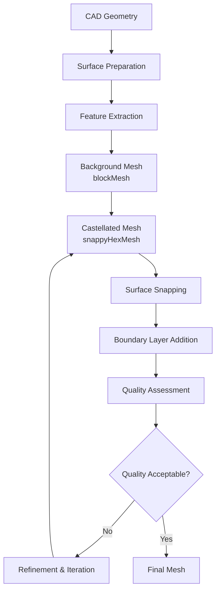

# 🔧 คู่มือการกำหนดค่า snappyHexMesh ขั้นสูง

**วัตถุประสงค์การเรียนรู้**: ทำความเข้าใจการกำหนดค่า snappyHexMesh อย่างละเอียดสำหรับการสร้างเมช CFD คุณภาพสูงจากเรขาคณิตที่ซับซ้อน
**ข้อกำหนดเบื้องต้น**: ความเข้าใจพื้นฐานเกี่ยวกับ blockMesh, ความรู้เกี่ยวกับเรขาคณิต CAD, ประสบการณ์ OpenFOAM ระดับกลาง
**ทักษะเป้าหมาย**: การกำหนดค่า snappyHexMeshDict ขั้นสูง, การจัดการ boundary layers, การควบคุมคุณภาพเมช, การดำเนินการแบบขนาน

---

## ภาพรวม (Overview)

`snappyHexMesh` เป็นยูทิลิตี้การสร้างเมชแบบ ==Semi-structured== หลักของ OpenFOAM ที่รวมการสร้างเมชพื้นหลังแบบ Hexahedral เข้ากับการปรับแต่งพื้นผิวที่สอดรับกับเรขาคณิต (Surface-conforming refinement) โดยอัตโนมัติ

### ขัดแย้งการออกแบบ (Design Trade-offs)

| แนวทาง | ข้อดี | ข้อเสีย | Use Case |
|---------|--------|----------|----------|
| **Structured (blockMesh)** | คุณภาพสูง, ความเสถียรทางเชิงตัวเลข | ต้องการแรงงานสูงสำหรับเรขาคณิตซับซ้อน | โดเมนเรขาคณิตง่าย, ท่อ, ช่องทาง |
| **Semi-structured (snappyHexMesh)** | สมดุลระหว่างอัตโนมัติและการควบคุม | ต้องการการเตรียมพื้นผิวที่ดี | เรขาคณิตซับซ้อน, ชิ้นส่วนเครื่องยนต์ |
| **Unstructured (cfMesh)** | อัตโนมัติสมบูรณ์ | ความแม่นยำต่ำกว่าแบบโครงสร้าง | เรขาคณิตอินทรีย์, การแพทย์ |

### ขั้นตอนการทำงาน (Workflow)


> **Figure 1:** แผนภูมิแสดงขั้นตอนการทำงานของ `snappyHexMesh` ตั้งแต่การเตรียมเรขาคณิตพื้นผิว การสกัดคุณลักษณะเด่น การสร้างเมชพื้นหลัง ไปจนถึงขั้นตอนการเพิ่มชั้นขอบเขตและการประเมินคุณภาพเมชแบบวนซ้ำเพื่อให้ได้ผลลัพธ์ที่เหมาะสมที่สุดสำหรับการจำลอง

---

## ส่วนที่ 1: การเตรียมพื้นผิว (Surface Preparation)

### 1.1 การประมวลผลเรขาคณิต CAD

พื้นฐานของการจำลอง CFD ที่ประสบความสำเร็จเริ่มต้นจากการเตรียมเรขาคณิต CAD ที่เหมาะสม OpenFOAM รองรับหลายรูปแบบเรขาคณิต:

**รูปแบบ CAD ที่แนะนำ:**
```bash
# รูปแบบที่เหมาะสำหรับ OpenFOAM
STEP (.stp, .step)     # STEP Exchange Protocol - แนะนำ
IGES (.igs, .iges)     # Initial Graphics Exchange Specification
STL (.stl)           # StereoLithography (แบบสามเหลี่ยม)
VTK (.vtk)           # Visualization Toolkit (สำหรับอ้างอิง)
```

> [!INFO] **การเลือกรูปแบบไฟล์ (Format Selection)**
> - **STEP**: รูปแบบหลักที่แนะนำ - รักษาข้อมูลพาราเมตริกและความต่อเนื่องของพื้นผิว
> - **IGES**: ทางเลือกสำหรับระบบเดิม - อาจแนะนำความไม่สม่ำเสมอของพื้นผิว
> - **STL**: พื้นผิวแบบสามเหลี่ยม - ต้องการความเอาใจใส่ด้านคุณภาพและความหนาแน่น

**การตรวจสอบความถูกต้องของเรขาคณิต:**

```cpp
// รูปแบบโค้ดสำหรับการตรวจสอบความถูกต้องของเรขาคณิต
bool validateGeometry(const fileName& stlFile)
{
    if (!isFile(stlFile))
    {
        FatalErrorInFunction << "STL file not found: " << stlFile << exit(FatalError);
    }

    triSurface surface(stlFile);
    Info << "Surface contains " << surface.size() << " triangles" << nl;

    // ตรวจสอบขอบที่ไม่เป็น manifold
    labelHashSet nonManifoldEdges = surface.nonManifoldEdges();
    if (!nonManifoldEdges.empty())
    {
        Warning << "Found " << nonManifoldEdges.size() << " non-manifold edges" << endl;
    }

    return true;
}
```

กระบวนการตรวจสอบความถูกต้องประกอบด้วย:
- **เรขาคณิตที่กันรั่ว**: จำเป็นสำหรับการสร้างเมชปริมาตร
- **ขอบที่ไม่เป็น manifold**: อาจทำให้การสร้างเมชล้มเหลว
- **คุณภาพพื้นผิว**: มีผลต่อคุณภาพเมชขั้นสุดท้าย
- **การรักษาคุณสมบัติ**: สำคัญสำหรับฟิสิกส์การไหลที่แม่นยำ

### 1.2 การทำความสะอาดและซ่อมแซมพื้นผิว

**ปัญหา CAD ทั่วไปที่ต้องแก้ไข:**
```bash
# ปัญหา CAD ทั่วไปที่ต้องแก้ไข:
# 1. เรขาคณิต Non-manifold
# 2. พื้นผิวความหนาศูนย์
# 3. ปกติที่กลับด้าน
# 4. คุณสมบัติเล็กๆ (รู, ขอบ)
# 5. ช่องว่างแอสเซมบลี
# 6. หน่วยวัดที่ไม่สม่ำเสมอ
# 7. พื้นผิวที่ซ้อนทับกัน
```

**เวิร์กโฟลว์การทำความสะอาดพื้นผิว:**

```bash
# เวิร์กโฟลว์การซ่อมแซมเมชพื้นผิว
surfaceCleanPatch -case constant/triSurface/ geometry.stl
surfaceOrient geometry.stl newGeometry.stl

# การตรวจจับขอบคุณสมบัติ
surfaceFeatureExtract -case constant/triSurface/
```

การดำเนินการทำความสะอาดหลักประกอบด้วย:
- **การปิดช่องว่าง**: เติมรูเล็กๆ บนพื้นผิว
- **การจัดแนวปกติ**: ทำให้มั่นใจว่าเวกเตอร์ปกติชี้ออกด้านนอกอย่างสม่ำเสมอ
- **การลดจำนวน**: ลดจำนวนสามเหลี่ยมโดยยังคงรักษาคุณสมบัติไว้
- **การยุบขอบ**: ลบองค์ประกอบเรขาคณิตที่ซ้ำซ้อน

### 1.3 การดึงคุณลักษณะ (Feature Extraction)

การสกัดคุณลักษณะขึ้นอยู่กับเรขาคณิต โดยต้องการพารามิเตอร์ต่างกันสำหรับประเภทพื้นผิวต่างๆ:

```bash
# สกัดขอบคุณลักษณะสำหรับประเภทพื้นผิวต่างๆ
if [ "$SURFACE_TYPE" = "mechanical" ]; then
    # สกัดขอบจากคุณลักษณะทางกลไก
    surfaceFeatureEdges -case "$CASE_DIR" -angle 30 -includedAngle 30

elif [ "$SURFACE_TYPE" = "organic" ]; then
    # สกัดขอบจากพื้นผิวอินทรีย์/ซับซ้อน
    surfaceFeatureEdges -case "$CASE_DIR" -angle 15 -includedAngle 60

elif [ "$SURFACE_TYPE" = "terrain" ]; then
    # สกัดคุณลักษณะภูมิประเทศ (ridges, valleys)
    surfaceFeatureEdges -case "$CASE_DIR" -angle 45 -featureSet "ridges,valleys"
fi
```

> [!TIP] **ตัวบ่งชี้คุณภาพพื้นผิว (Surface Quality Indicators)**
> - **Manifoldness**: จำเป็นสำหรับการสร้างเมชปริมาตร
> - **ความสอดคล้องของเวกเตอร์ปกติ (Normal consistency)**: สำคัญสำหรับการระบุขอบเขตและการคำนวณฟลักซ์
> - **คุณภาพของสามเหลี่ยม (Triangle quality)**: ส่งผลต่อความแม่นยำของเมชขั้นสุดท้าย - มุ่งเป้าไปที่การกระจายแบบด้านเท่า

---

## ส่วนที่ 2: การกำหนดค่าพจนานุกรม snappyHexMesh (Dictionary Configuration)

### 2.1 snappyHexMeshDict พื้นฐาน

```cpp
// Complete snappyHexMeshDict พร้อมคุณสมบัติทั้งหมด
FoamFile
{
    version     2.0;
    format      ascii;
    class       dictionary;
    object      snappyHexMeshDict;
}
// * * * * * * * * * * * * * * * * * * * //

// สวิตช์หลัก
castellatedMesh true;
snap true;
addLayers true;
snapTolerance 1e-6;
solveFeatureSnap true;
relativeLayersSizes (1.0);

// การนิยามเรขาคณิต
geometry
{
    model.stl
    {
        type triSurfaceMesh;
        name "model";
    }
}

// การควบคุมการปรับปรุงเมช (Refinement control)
castellatedMeshControls
{
    maxGlobalCells 10000000;
    maxLocalCells 1000000;
    minRefinementCells 10;
    nCellsBetweenLevels 2;

    // การรักษาคุณลักษณะ
    features
    (
        {
            file "model.extEdge";
            level 10;
        }
    );

    // การปรับปรุงพื้นผิว
    refinementSurfaces
    {
        model
        {
            level (2 2);
            patchInfo
            {
                type wall;
            }
        }
    }

    resolveFeatureAngle 30;
}

// การควบคุลการแนบ (Snapping controls)
snapControls
{
    nSmoothPatch 3;
    tolerance 2.0;
    nSolveIter 30;
    nRelaxIter 5;

    nFeatureSnapIter 10;
    implicitFeatureSnap true;
    explicitFeatureSnap false;
    multiRegionFeatureSnap true;
}

// การควบคุมชั้นขอบเขต (Boundary layer controls)
addLayersControls
{
    relativeSizes true;

    layers
    {
        model
        {
            nSurfaceLayers 15;
        }
    }

    expansionRatio 1.2;
    finalLayerThickness 0.3;
    minThickness 0.001;

    nGrow 0;
    featureAngle 120;
    nRelaxIter 3;
    nSmoothSurfaceNormals 3;
    nSmoothNormals 3;
    nSmoothThickness 10;

    maxFaceThicknessRatio 0.5;
    maxThicknessToMedialRatio 0.3;
    minMedianAxisAngle 90;
    nBufferCellsNoExtrude 0;
    nLayerIter 50;
}

// การควบคุมคุณภาพเมช (Mesh quality controls)
meshQualityControls
{
    maxNonOrthogonal 65;
    maxBoundarySkewness 20;
    maxInternalSkewness 4.5;
    minFaceWeight 0.05;
    minVol 1e-15;
    minTetQuality 0.005;
    minDeterminant 0.001;
}
```

### 2.2 การกำหนดค่าแบบหลายภูมิภาคขั้นสูง (Advanced Multi-Region)

```cpp
// Multi-region snappyHexMesh สำหรับชุดประกอบที่ซับซ้อน
FoamFile
{
    version     2.0;
    format      ascii;
    class       dictionary;
    object      snappyHexMeshDict;
}
// * * * * * * * * * * * * * * * * * * * //

castellatedMesh true;
addLayers true;

geometry
{
    assembly.stl
    {
        type triSurfaceMesh;
        name "assembly";
    }
}

refinementSurfaces
{
    fluid_region
    {
        level (2 3);      // 3 ระดับการปรับปรุงในของไหล
        patches
        {
            type wall;
            level (1);     // การปรับปรุงเพิ่มเติม
        }
    }

    solid_region
    {
        level (1);
        patches
        {
            type wall;
            name "solid_parts";
        }
    }
}

addLayersControls
{
    relativeSizes (1.0 1.0);  // ขนาดต่างกันสำหรับภูมิภาคต่างๆ
    expansionRatio (1.2 1.5);  // อัตราส่วนการขยายต่างกัน
    finalLayerThickness (0.001 0.002);  // ความหนาต่างกัน
    minThickness (0.0005 0.001);
    nGrow 1;
    maxFaceThicknessRatio 0.5;  // ป้องกันเซลล์ขอบเขตที่บางเกินไป
    featureAngle 120;              // การตรวจจับคุณลักษณะสำหรับชั้น
}

// คุณสมบัติขั้นสูง
features
(
    {
        file "assembly.extEdge";
        level 2;
        includeAngle 45;         // รวมมุมที่ตื้น
        excludedAngle 25;        // ไม่รวมมุมที่แหลมมาก
        nLayers 10;             // จำนวนชั้นขอบเขตสูงสุด
        layerTermination angle 90;    // หยุดการเพิ่มชั้นที่ 90 องศา
    }
);

// การควบคุลพิเศษ
snapControls
{
    // ใช้ Implicit snapping สำหรับเรขาคณิตที่ซับซ้อน
    useImplicitSnap true;     // แข็งแกร่งกว่าแต่ใช้ทรัพยากรมาก
    additionalReporting true;  // การบันทึกรายละเอียดเพื่อการดีบัก
}
```

---

## ส่วนที่ 3: ฟิสิกส์ชั้นขอบเขตและคณิตศาสตร์ (Boundary Layer Physics & Mathematics)

### 3.1 ตัวชี้วัดคุณภาพ (Quality Metrics)

รากฐานทางคณิตศาสตร์สำหรับการประเมินคุณภาพเมช:

$$\text{Non-orthogonality} = \arccos\left(\frac{\mathbf{d} \cdot \mathbf{n}}{\|\mathbf{d}\| \|\mathbf{n}\|}\right)$$

โดยที่ $\mathbf{d}$ คือเวกเตอร์ที่เชื่อมจุดศูนย์กลางเซลล์ และ $\mathbf{n}$ คือเวกเตอร์ปกติของหน้า

$$\text{Skewness} = \frac{\|\mathbf{x}_f - \mathbf{x}_{projected}\|}{\|\mathbf{x}_f - \mathbf{x}_{owner}\| + \|\mathbf{x}_f - \mathbf{x}_{neighbor}\|}$$

$$\text{Aspect Ratio} = \frac{\max(d_1, d_2, d_3)}{\min(d_1, d_2, d_3)}$$

### 3.2 ฟิสิกส์ชั้นขอบเขต (Boundary Layer Physics)

สำหรับการไหลที่ถูกจำกัดโดยผนัง การแก้ไขชั้นขอบเขตที่เหมาะสมเป็นสิ่งสำคัญ:

**การคำนวณความสูงของเซลล์แรก (First cell height)**:
$$\Delta y = \frac{y^+ \mu}{\rho u_\tau}$$

โดยที่:
- $u_\tau = U_\infty \sqrt{C_f/2}$ คือความเร็วเสียดทาน
- $C_f = 0.026 \cdot Re^{-0.139}$ คือสัมประสิทธิ์แรงต้านผิว (Blasius correlation)
- $\mu$ คือความหนืดจลน์

**อัตราส่วนการเจริญเติบโต (Growth ratio)** สำหรับเซลล์ชั้นขอบเขต:
$$h_{i+1} = r \cdot h_i$$

โดยที่ $h_i$ คือความสูงของเซลล์ และ $r$ คืออัตราส่วนการขยาย (โดยทั่วไปคือ $1.1 \leq r \leq 1.3$)

**ค่า $y^+$ ที่แนะนำ**:
- **Viscous sublayer**: $y^+ < 1$ สำหรับโมเดลความปั่นป่วนแบบ Low-Re
- **Buffer layer**: $1 < y^+ < 5$
- **Log-law region**: $30 < y^+ < 300$ สำหรับ Wall functions

**ฟังก์ชันผนังของ Reichardt** ให้คำแนะนำสำหรับการเมชชั้นขอบเขต:

$$u^+ = \frac{1}{\kappa} \ln(1 + \kappa y^+) + C \left(1 - e^{-y^+/A} - \frac{y^+}{A} e^{-b y^+}\right)$$

โดยที่ $\kappa \approx 0.41$ คือค่าคงที่ von Kármán

---

## ส่วนที่ 4: กลยุทธ์การปรับปรุงขั้นสูง (Advanced Refinement Strategies)

### 4.1 การควบคุมเมชแบบ Castellated (Castellated Mesh Controls)

```cpp
castellatedMeshControls
{
    // ระดับการปรับปรุงทั่วโลก
    maxGlobalCells 10000000;
    maxLocalCells 1000000;
    minRefinementCells 10;
    nCellsBetweenLevels 2;

    // การรักษาคุณลักษณะ
    features
    (
        {
            file "vehicle.extEdge";
            level 10;
        }
    );

    // การปรับปรุงพื้นผิว
    refinementSurfaces
    {
        vehicle
        {
            level (2 2);
            patchInfo
            {
                type wall;
            }
        }
    }

    // ภูมิภาคการปรับปรุงเฉพาะจุด
    refinementRegions
    {
        wakeBox
        {
            mode inside;
            levels ((1.0 2) (0.5 3));
        }

        refinementSphere
        {
            mode inside;
            levels ((0.2 3));
        }
    }

    // การตรวจจับคุณลักษณะ
    resolveFeatureAngle 30;
}
```

### 4.2 อัลกอริทึมการแนบสูงสุด (Supreme Snapping Algorithm)

อัลกอริทึมการแนบจัดชุดเมชให้สอดคล้องกับเรขาคณิตพื้นผิว:

$$\min_{\mathbf{x}_v} \|\mathbf{x}_v - \mathbf{x}_s(\mathbf{u}_v)\|^2$$

โดยที่ $\mathbf{x}_v$ คือตำแหน่งจุดยอด, $\mathbf{x}_s$ คือการพารามิเตอร์ไรซ์พื้นผิว, และ $\mathbf{u}_v$ คือพิกัด UV

```cpp
snapControls
{
    nSmoothPatch 3;           // จำนวนรอบการทำให้ Patch เรียบ
    tolerance 2.0;            // อัตราส่วนความอดทนในการแนบ
    nSolveIter 30;            // จำนวนรอบการคำนวณของตัวแก้
    nRelaxIter 5;             // จำนวนรอบการผ่อนคลาย (Relaxation)

    // การควบคุมคุณภาพขั้นสูง
    nFeatureSnapIter 10;      // จำนวนรอบการแนบคุณลักษณะ

    implicitFeatureSnap true; // การตรวจจับคุณลักษณะโดยนัย
    explicitFeatureSnap false;

    multiRegionFeatureSnap true; // การจัดการคุณลักษณะแบบหลายภูมิภาค
}
```

### 4.3 การสร้างชั้นขอบเขต (Boundary Layer Generation)

```cpp
addLayersControls
{
    relativeSizes true;

    layers
    {
        vehicle_wall
        {
            nSurfaceLayers 15;
        }
    }

    expansionRatio 1.2;
    finalLayerThickness 0.3;
    minThickness 0.001;

    // การควบคุมขั้นสูง
    nGrow 0;                  // จำนวนรอบการขยายชั้น
    featureAngle 120;         // มุมคุณลักษณะสูงสุดสำหรับการเพิ่มชั้น
    nRelaxIter 3;             // จำนวนรอบการผ่อนคลายเมช
    nSmoothSurfaceNormals 3;  // การทำให้เวกเตอร์ปกติพื้นผิวเรียบ
    nSmoothNormals 3;         // การทำให้เวกเตอร์ปกติเรียบ
    nSmoothThickness 10;      // การทำให้ฟิลด์ความหนาเรียบ

    // การเพิ่มชั้นตามคุณภาพ
    maxFaceThicknessRatio 0.5;
    maxThicknessToMedialRatio 0.3;
    minMedianAxisAngle 90;
    nBufferCellsNoExtrude 0;
    nLayerIter 50;            // จำนวนรอบการสร้างชั้นสูงสุด
}
```

**ตัวชี้วัดคุณภาพเมชชั้นขอบเขต:**
- **ความสูงของเซลล์แรก**: $y^+ = \frac{u_* \Delta y}{\nu} \approx 1$
- **อัตราการเจริญเติบโต**: ควบคุมโดยอัตราส่วนการขยาย
- **สัดส่วนภาพ**: รักษาให้ต่ำกว่าขีดจำกัดที่กำหนด
- **ความตั้งฉาก**: ช่วยให้มั่นใจในเสถียรภาพเชิงตัวเลข

---

## ส่วนที่ 5: การดำเนินการแบบขนาน (Parallel Execution)

### 5.1 เวิร์กโฟลว์ Parallel Meshing

```bash
#!/bin/bash
# การดำเนินการ snappyHexMesh แบบขนาน
NPROCS=4
CASE_DIR="complex_assembly"

echo "=== Parallel snappyHexMesh with $NPROCS processors ==="

# แยกโดเมน (Decompose domain)
echo "[1] Decomposing domain..."
decomposePar -case "$CASE_DIR" -force -nProcs $NPROCS

# รัน snappyHexMesh แบบขนาน
echo "[2] Running parallel snappyHexMesh..."
mpirun -np $NPROCS snappyHexMesh -overwrite -case "$CASE_DIR" | tee snappy_parallel.log

# รวมผลลัพธ์ (Reconstruct results)
echo "[3] Reconstructing parallel results..."
reconstructPar -case "$CASE_DIR" -latestTime

# ตรวจสอบผลลัพธ์
echo "[4] Checking parallel mesh..."
checkMesh -case "$CASE_DIR" -allTopology -allGeometry | tee check_parallel.log
```

การดำเนินการแบบขนานเป็นสิ่งจำเป็นสำหรับการสร้างเมชขนาดใหญ่ โดยลดเวลาการคำนวณอย่างมากผ่านการย่อยโดเมน เวิร์กโฟลว์มีการย่อยโดเมน ดำเนินการสร้างเมชแบบขนาน จากนั้นรวมผลลัพธ์ การตรวจสอบคุณภาพสุดท้ายรับประกันว่ากระบวนการสร้างเมชแบบขนานยังคงรักษาความสมบูรณ์และมาตรฐานคุณภาพของเมช

### 5.2 การกำหนดค่า Decomposition

```cpp
// system/decomposeParDict
numberOfSubdomains 4;

method scotch;
// method hierarchical;
// coeffs
// {
//     n 2;
//     m 2;
// }

simpleCoeffs
{
    n 2;
    delta 0.001;
}

hierarchicalCoeffs
{
    n 2;
    delta 0.001;
}
```

---

## ส่วนที่ 6: คู่มือการแก้ไขปัญหา (Troubleshooting Guide)

### 6.1 ปัญหาทั่วไปและวิธีแก้ไข

| ปัญหา | อาการ | วิธีแก้ไข |
|---------|----------|----------|
| **การตรวจจับช่องว่างล้มเหลว** | "No surface features found" | ตรวจสอบพารามิเตอร์การตรวจจับ: `featureAngle`, `minFeatureSize` |
| **การสร้างเซลล์ที่เป็นอนันต์** | "Zero or negative volume cells" | ตรวจสอบเวกเตอร์ปกติพื้นผิว, คุณภาพ CAD |
| **คุณภาพชั้นขอบเขตต่ำ** | "Boundary layer thickness variation" | ใช้การควบคุมชั้นด้วย `minThickness`/`maxThickness` |
| **ปัญหาคุณภาพเซลล์** | "High non-orthogonal cells" | ตรวจสอบการควบคุมคุณภาพ, ปรับการไล่ระดับ (Grading) |
| **ข้อผิดพลาดหน่วยความจำ** | "Insufficient memory for meshing" | ลดจำนวนเซลล์เป้าหมาย, ใช้การประมวลผลแบบขนาน |

### 6.2 การตรวจจับช่องว่างล้มเหลว (Gap Detection Failure)

ปัญหานี้มักเกิดขึ้นเมื่อ snappyHexMesh ไม่สามารถระบุคุณลักษณะพื้นผิวได้อย่างถูกต้อง อัลกอริทึมการตรวจจับขึ้นอยู่กับพารามิเตอร์ `featureAngle` ซึ่งกำหนดมุมระหว่างเวกเตอร์ปกติพื้นผิวที่ถือว่าเป็นขอบคุณลักษณะ

**ตัวอย่างการกำหนดค่า:**
```cpp
// ใน snappyHexMeshDict
castellatedMeshControls
{
    featureAngle 150;  // องศา - ตรวจจับคุณลักษณะที่แหลมคมกว่า
    minFeatureSize 0.001;  // ขนาดคุณลักษณะขั้นต่ำในหน่วยเมตร
}
```

### 6.3 การสร้างเซลล์ที่เป็นอนันต์ (Infinite Cell Creation)

เมื่อ snappyHexMesh สร้างเซลล์ที่มีปริมาตรเป็นศูนย์หรือติดลบ โดยปกติจะบ่งชี้ถึงปัญหากับเรขาคณิตพื้นผิวอินพุต สาเหตุทั่วไป ได้แก่ **เวกเตอร์ปกติกลับด้าน (Inverted normals)**, **ขอบที่ไม่ใช่ Manifold**, หรือ **พื้นผิวที่ตัดกันเอง (Self-intersecting surfaces)**

**ขั้นตอนการวินิจฉัย:**
```bash
# ตรวจสอบคุณภาพพื้นผิวด้วย surfaceCheck
surfaceCheck constant/triSurface/<geometry>.stl

# สิ่งที่ต้องค้นหา:
# - ขอบที่ไม่ใช่ Manifold
# - พื้นผิวที่ตัดกันเอง
# - การวางแนวหน้าที่ไม่สอดคล้องกัน
```

### 6.4 กลยุทธ์การปรับปรุงแบบก้าวหน้า (Progressive Refinement Strategy)

สำหรับเรขาคณิตที่ซับซ้อน ให้ใช้แนวทางการปรับปรุงแบบก้าวหน้าเพื่อระบุและแก้ไขปัญหาตั้งแต่เนิ่นๆ:

```cpp
// การปรับปรุงแบบก้าวหน้าใน snappyHexMeshDict
castellatedMeshControls
{
    // เริ่มต้นแบบหยาบ แล้วปรับปรุงทีละขั้น
    nRefinementLevels 3;

    // กำหนดภูมิภาคการปรับปรุง
    refinementRegions
    {
        "refinementBox1"
        {
            mode distance;
            levels ((0.1 1) (0.05 2) (0.025 3));
        }
    }
}
```

---

## ส่วนที่ 7: เวิร์กโฟลว์การประเมินคุณภาพ (Quality Assessment Workflow)

### 7.1 การตรวจสอบคุณภาพแบบอัตโนมัติ

```bash
#!/bin/bash
# การประเมินคุณภาพเมชแบบครอบคลุม
echo "Starting mesh quality assessment..."

# การตรวจสอบความสอดคล้องของเมชพื้นฐาน
checkMesh -case . -allGeometry -allTopology -time 0 > meshCheck.txt

# สกัดตัวชี้วัดคุณภาพ
grep -E "max:" meshCheck.txt > qualityMetrics.txt
grep -E "Failed|Error" meshCheck.txt > meshErrors.txt

# การประเมินคุณภาพอัตโนมัติด้วย Python
python3 << EOF
import re

# อ่านผลการตรวจสอบเมช
with open('meshCheck.txt', 'r') as f:
    content = f.read()

# สกัดตัวชี้วัดคุณภาพ
metrics = {}
patterns = {
    'non_orthogonal_cells': r'Non-orthogonal cells: (\d+)',
    'skewness_max': r'Max.*skewness = ([\d\.e-]+)',
    'aspect_ratio_max': r'Max.*aspect ratio = ([\d\.e-]+)',
    'determinant_min': r'Min.*determinant = ([\d\.e-]+)'
}

for key, pattern in patterns.items():
    match = re.search(pattern, content)
    if match:
        metrics[key] = float(match.group(1))

# การประเมินคะแนนคุณภาพ
quality_score = 100
if metrics.get('non_orthogonal_cells', 0) > 1000:
    quality_score -= 20
if metrics.get('skewness_max', 0) > 2:
    quality_score -= 30
if metrics.get('aspect_ratio_max', 0) > 100:
    quality_score -= 25
if metrics.get('determinant_min', 0) < 0.01:
    quality_score -= 25

print(f"Overall Mesh Quality Score: {quality_score}/100")
EOF

echo "Mesh quality assessment complete."
```

### 7.2 Python Script สำหรับการวิเคราะห์คุณภาพ

```python
#!/usr/bin/env python3
"""
เครื่องมือวิเคราะห์คุณภาพเมชแบบครบวงจรสำหรับ OpenFOAM meshes
"""

import numpy as np
import sys
import os
import subprocess
import matplotlib.pyplot as plt
from matplotlib.backends.backend_pdf import PdfPages

class MeshQualityAnalyzer:
    def __init__(self, case_dir):
        self.case_dir = case_dir
        self.mesh_data = {}
        self.load_mesh_data()

    def load_mesh_data(self):
        """โหลดข้อมูลเมชจากไดเรกทอรี case ของ OpenFOAM"""
        # รัน checkMesh และจับผลลัพธ์
        try:
            result = subprocess.run(
                ['checkMesh', '-case', self.case_dir, '-writeAllSurfaces', '-latestTime'],
                capture_output=True, text=True, check=True
            )
            self.checkmesh_output = result.stdout
        except subprocess.CalledProcessError as e:
            print(f"Error running checkMesh: {e}")
            self.checkmesh_output = ""

    def calculate_quality_metrics(self):
        """คำนวณเมตริกคุณภาพเมชแบบครบวงจร"""
        metrics = {}

        # แยกวิเคราะห์ผลลัพธ์ checkMesh สำหรับเมตริกคุณภาพ
        lines = self.checkmesh_output.split('\n')
        for line in lines:
            line = line.strip()

            # การวิเคราะห์ non-orthogonality
            if 'non-orthogonal' in line:
                if 'cells with non-orthogonality' in line:
                    metrics['non_orthogonal_cells'] = int(line.split()[0])
                if 'maximum non-orthogonality' in line:
                    metrics['max_non_orthogonality'] = float(line.split()[-1])

            # การวิเคราะห์ skewness
            if 'skewness' in line:
                if 'skewness cells' in line:
                    metrics['skewness_cells'] = int(line.split()[0])
                if 'maximum skewness' in line:
                    metrics['max_skewness'] = float(line.split()[-1])

            # การวิเคราะห์ aspect ratio
            if 'aspect ratio' in line:
                if 'maximum aspect ratio' in line:
                    metrics['max_aspect_ratio'] = float(line.split()[-1])

            # นับเซลล์และสถิติเมช
            if 'total cells' in line:
                metrics['total_cells'] = int(line.split()[0])
            if 'total faces' in line:
                metrics['total_faces'] = int(line.split()[0])
            if 'total points' in line:
                metrics['total_points'] = int(line.split()[0])

        return metrics

    def identify_problematic_cells(self, quality_metrics):
        """ระบุเซลล์ที่มีปัญหาคุณภาพ"""
        problematic_cells = []

        # กำหนดค่าเกณฑ์คุณภาพ
        thresholds = {
            'max_non_orthogonality': 70.0,  # องศา
            'max_skewness': 4.0,
            'max_aspect_ratio': 1000.0
        }

        # ตรวจสอบแต่ละเกณฑ์
        if quality_metrics.get('max_non_orthogonality', 0) > thresholds['max_non_orthogonality']:
            problematic_cells.append({
                'type': 'non_orthogonality',
                'value': quality_metrics['max_non_orthogonality'],
                'threshold': thresholds['max_non_orthogonality']
            })

        if quality_metrics.get('max_skewness', 0) > thresholds['max_skewness']:
            problematic_cells.append({
                'type': 'skewness',
                'value': quality_metrics['max_skewness'],
                'threshold': thresholds['max_skewness']
            })

        if quality_metrics.get('max_aspect_ratio', 0) > thresholds['max_aspect_ratio']:
            problematic_cells.append({
                'type': 'aspect_ratio',
                'value': quality_metrics['max_aspect_ratio'],
                'threshold': thresholds['max_aspect_ratio']
            })

        return problematic_cells
```

---

## สรุปแนวทางปฏิบัติที่ดีที่สุด (Best Practices Summary)

> [!TIP] **คำแนะนำหลัก**
>
> 1. **คุณภาพพื้นผิว**: ตรวจสอบความถูกต้องของเรขาคณิต CAD เสมอก่อนการทำเมช
> 2. **การตรวจจับคุณลักษณะ**: ปรับพารามิเตอร์ `featureAngle` ตามความซับซ้อนของเรขาคณิต
> 3. **กลยุทธ์การปรับปรุง**: ใช้การปรับปรุงแบบก้าวหน้าสำหรับกรณีที่ซับซ้อน
> 4. **ชั้นขอบเขต**: คำนวณความสูงของเซลล์แรกตามข้อกำหนดของ $y^+$
> 5. **การประมวลผลแบบขนาน**: เปิดใช้งานการทำงานแบบขนานสำหรับเมชที่มีขนาดมากกว่า 10⁶ เซลล์
> 6. **Quality Gates**: ใช้การตรวจสอบคุณภาพอัตโนมัติก่อนการรัน Solver
> 7. **แนวทางแบบทำซ้ำ**: ปรับปรุงคุณภาพเมชผ่านการวนซ้ำอย่างเป็นระบบ

---

## เอกสารอ้างอิง (References)

- [[01_🎯_Overview_Mesh_Preparation_Strategy]] - กลยุทธ์เมชโดยรวม
- [[03_🎯_BlockMesh_Enhancement_Workflow]] - การสร้างเมชพื้นหลัง
- [[04_🎯_snappyHexMesh_Workflow_Surface_Meshing_Excellence]] - เวิร์กโฟลว์เมชพื้นผิว
- [[05_🔧_Advanced_Utilities_and_Automation]] - เครื่องมืออัตโนมัติ
- [[02_🏗️_CAD_to_CFD_Workflow]] - การแปลง CAD เป็น CFD
