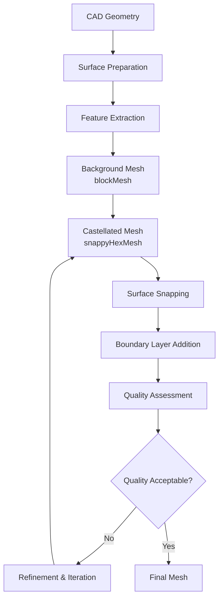

# 🔧 คู่มือการกำหนดค่า snappyHexMesh ขั้นสูง

**วัตถุประสงค์การเรียนรู้**: ทำความเข้าใจการกำหนดค่า snappyHexMesh อย่างละเอียดสำหรับการสร้างเมช CFD คุณภาพสูงจากเรขาคณิตที่ซับซ้อน
**ข้อกำหนดเบื้องต้น**: ความเข้าใจพื้นฐานเกี่ยวกับ blockMesh, ความรู้เกี่ยวกับเรขาคณิต CAD, ประสบการณ์ OpenFOAM ระดับกลาง
**ทักษะเป้าหมาย**: การกำหนดค่า snappyHexMeshDict ขั้นสูง, การจัดการ boundary layers, การควบคุมคุณภาพเมช, การดำเนินการแบบขนาน

---

## ภาพรวม (Overview)

`snappyHexMesh` เป็นยูทิลิตี้การสร้างเมชแบบ ==Semi-structured== หลักของ OpenFOAM ที่รวมการสร้างเมชพื้นหลังแบบ Hexahedral เข้ากับการปรับแต่งพื้นผิวที่สอดรับกับเรขาคณิต (Surface-conforming refinement) โดยอัตโนมัติ

### ขัดแย้งการออกแบบ (Design Trade-offs)

| แนวทาง | ข้อดี | ข้อเสีย | Use Case |
|---------|--------|----------|----------|
| **Structured (blockMesh)** | คุณภาพสูง, ความเสถียรทางเชิงตัวเลข | ต้องการแรงงานสูงสำหรับเรขาคณิตซับซ้อน | โดเมนเรขาคณิตง่าย, ท่อ, ช่องทาง |
| **Semi-structured (snappyHexMesh)** | สมดุลระหว่างอัตโนมัติและการควบคุม | ต้องการการเตรียมพื้นผิวที่ดี | เรขาคณิตซับซ้อน, ชิ้นส่วนเครื่องยนต์ |
| **Unstructured (cfMesh)** | อัตโนมัติสมบูรณ์ | ความแม่นยำต่ำกว่าแบบโครงสร้าง | เรขาคณิตอินทรีย์, การแพทย์ |

### ขั้นตอนการทำงาน (Workflow)


> **Figure 1:** แผนภูมิแสดงขั้นตอนการทำงานของ `snappyHexMesh` ตั้งแต่การเตรียมเรขาคณิตพื้นผิว การสกัดคุณลักษณะเด่น การสร้างเมชพื้นหลัง ไปจนถึงขั้นตอนการเพิ่มชั้นขอบเขตและการประเมินคุณภาพเมชแบบวนซ้ำเพื่อให้ได้ผลลัพธ์ที่เหมาะสมที่สุดสำหรับการจำลอง

---

## ส่วนที่ 1: การเตรียมพื้นผิว (Surface Preparation)

### 1.1 การประมวลผลเรขาคณิต CAD

พื้นฐานของการจำลอง CFD ที่ประสบความสำเร็จเริ่มต้นจากการเตรียมเรขาคณิต CAD ที่เหมาะสม OpenFOAM รองรับหลายรูปแบบเรขาคณิต:

**รูปแบบ CAD ที่แนะนำ:**
```bash
# Formats compatible with OpenFOAM
STEP (.stp, .step)     # STEP Exchange Protocol - recommended
IGES (.igs, .iges)     # Initial Graphics Exchange Specification
STL (.stl)           # StereoLithography (triangular format)
VTK (.vtk)           # Visualization Toolkit (for reference)
```

> [!INFO] **การเลือกรูปแบบไฟล์ (Format Selection)**
> - **STEP**: รูปแบบหลักที่แนะนำ - รักษาข้อมูลพาราเมตริกและความต่อเนื่องของพื้นผิว
> - **IGES**: ทางเลือกสำหรับระบบเดิม - อาจแนะนำความไม่สม่ำเสมอของพื้นผิว
> - **STL**: พื้นผิวแบบสามเหลี่ยม - ต้องการความเอาใจใส่ด้านคุณภาพและความหนาแน่น

**การตรวจสอบความถูกต้องของเรขาคณิต:**

```cpp
// Code pattern for geometry validation
bool validateGeometry(const fileName& stlFile)
{
    // Check if STL file exists and is readable
    if (!isFile(stlFile))
    {
        FatalErrorInFunction << "STL file not found: " << stlFile << exit(FatalError);
    }

    // Load triangulated surface from file
    triSurface surface(stlFile);
    Info << "Surface contains " << surface.size() << " triangles" << nl;

    // Check for non-manifold edges that can cause meshing issues
    // Non-manifold edges have more than two faces connected
    labelHashSet nonManifoldEdges = surface.nonManifoldEdges();
    if (!nonManifoldEdges.empty())
    {
        Warning << "Found " << nonManifoldEdges.size() << " non-manifold edges" << endl;
    }

    return true;
}
```

<details>
<summary>📖 คำอธิบายโค้ด (Code Explanation)</summary>

**แหล่งที่มา**: แนวคิดการตรวจสอบเรขาคณิตจาก OpenFOAM surface mesh utilities

**คำอธิบาย**:
- **ฟังก์ชัน validateGeometry**: ใช้ตรวจสอบความถูกต้องของไฟล์ STL ก่อนนำไปใช้ในการสร้างเมช
- **การตรวจสอบไฟล์**: ใช้ `isFile()` เพื่อตรวจสอบว่าไฟล์มีอยู่จริงและสามารถอ่านได้
- **การโหลดพื้นผิว**: ใช้คลาส `triSurface` เพื่อโหลดและจัดการข้อมูลพื้นผิวสามเหลี่ยม
- **การตรวจสอบ non-manifold edges**: ขอบที่ไม่ใช่ manifold เป็นปัญหาทั่วไปที่ทำให้การสร้างเมชล้มเหลว

**แนวคิดสำคัญ**:
- **Manifold edges**: ขอบปกติที่มีหน้าเชื่อมต่อได้สูงสุด 2 หน้า
- **Non-manifold edges**: ขอบที่มีหน้าเชื่อมต่อมากกว่า 2 หน้า หรือมีโครงสร้างที่ผิดปกติ
- **ขอบเขตการใช้งาน**: การตรวจสอบเบื้องต้นก่อนการสร้างเมชเพื่อประหยัดเวลาและทรัพยากร

</details>

กระบวนการตรวจสอบความถูกต้องประกอบด้วย:
- **เรขาคณิตที่กันรั่ว**: จำเป็นสำหรับการสร้างเมชปริมาตร
- **ขอบที่ไม่เป็น manifold**: อาจทำให้การสร้างเมชล้มเหลว
- **คุณภาพพื้นผิว**: มีผลต่อคุณภาพเมชขั้นสุดท้าย
- **การรักษาคุณสมบัติ**: สำคัญสำหรับฟิสิกส์การไหลที่แม่นยำ

### 1.2 การทำความสะอาดและซ่อมแซมพื้นผิว

**ปัญหา CAD ทั่วไปที่ต้องแก้ไข:**
```bash
# Common CAD problems that must be fixed:
# 1. Non-manifold geometry
# 2. Zero-thickness surfaces
# 3. Inverted normals
# 4. Small features (holes, edges)
# 5. Assembly gaps
# 6. Inconsistent units
# 7. Overlapping surfaces
```

**เวิร์กโฟลว์การทำความสะอาดพื้นผิว:**

```bash
# Surface mesh repair workflow
surfaceCleanPatch -case constant/triSurface/ geometry.stl
surfaceOrient geometry.stl newGeometry.stl

# Feature edge detection
surfaceFeatureExtract -case constant/triSurface/
```

<details>
<summary>📖 คำอธิบายโค้ด (Code Explanation)</summary>

**แหล่งที่มา**: OpenFOAM surface preparation utilities

**คำอธิบาย**:
- **surfaceCleanPatch**: ยูทิลิตี้สำหรับทำความสะอาดแพตช์พื้นผิว โดยการปิดรูเล็กๆ และซ่อมแซมความไม่สมบูรณ์
- **surfaceOrient**: จัดแนวเวกเตอร์ปกติของพื้นผิวให้สอดคล้องกัน (ชี้ออกด้านนอก)
- **surfaceFeatureExtract**: สกัดขอบคุณลักษณะจากพื้นผิวเพื่อใช้ในการปรับปรุงเมช

**แนวคิดสำคัญ**:
- **Consistent orientation**: เวกเตอร์ปกติที่สอดคล้องกันจำเป็นสำหรับการคำนวณฟลักซ์และการระบุขอบเขต
- **Feature preservation**: การรักษาคุณลักษณะสำคัญของเรขาคณิตในขณะทำความสะอาด
- **Automated repair**: ใช้เครื่องมืออัตโนมัติเพื่อลดเวลาและความผิดพลาดจากการแก้ไขด้วยมือ

</details>

การดำเนินการทำความสะอาดหลักประกอบด้วย:
- **การปิดช่องว่าง**: เติมรูเล็กๆ บนพื้นผิว
- **การจัดแนวปกติ**: ทำให้มั่นใจว่าเวกเตอร์ปกติชี้ออกด้านนอกอย่างสม่ำเสมอ
- **การลดจำนวน**: ลดจำนวนสามเหลี่ยมโดยยังคงรักษาคุณสมบัติไว้
- **การยุบขอบ**: ลบองค์ประกอบเรขาคณิตที่ซ้ำซ้อน

### 1.3 การดึงคุณลักษณะ (Feature Extraction)

การสกัดคุณลักษณะขึ้นอยู่กับเรขาคณิต โดยต้องการพารามิเตอร์ต่างกันสำหรับประเภทพื้นผิวต่างๆ:

```bash
# Extract feature edges for different surface types
if [ "$SURFACE_TYPE" = "mechanical" ]; then
    # Extract edges from mechanical features
    surfaceFeatureEdges -case "$CASE_DIR" -angle 30 -includedAngle 30

elif [ "$SURFACE_TYPE" = "organic" ]; then
    # Extract edges from organic/complex surfaces
    surfaceFeatureEdges -case "$CASE_DIR" -angle 15 -includedAngle 60

elif [ "$SURFACE_TYPE" = "terrain" ]; then
    # Extract terrain features (ridges, valleys)
    surfaceFeatureEdges -case "$CASE_DIR" -angle 45 -featureSet "ridges,valleys"
fi
```

<details>
<summary>📖 คำอธิบายโค้ด (Code Explanation)</summary>

**แหล่งที่มา**: OpenFOAM feature extraction utilities

**คำอธิบาย**:
- **Mechanical parts**: ใช้มุม 30 องศาเพื่อจับคุณลักษณะที่ชัดเจนจากการแมชชีน
- **Organic shapes**: ใช้มุมต่ำกว่า (15 องศา) และรวมมุมกว้างกว่าเพื่อจับรูปร่างที่ซับซ้อน
- **Terrain**: ใช้มุมสูงกว่าและระบุชนิดคุณลักษณะเฉพาะสำหรับภูมิประเทศ

**แนวคิดสำคัญ**:
- **Feature angle**: มุมระหว่างเวกเตอร์ปกติของหน้าสองหน้าที่กำหนดขอบคุณลักษณะ
- **Included angle**: มุมที่รวมในการตรวจจับคุณลักษณะ
- **Adaptive extraction**: การปรับพารามิเตอร์การสกัดตามประเภทของเรขาคณิต

</details>

> [!TIP] **ตัวบ่งชี้คุณภาพพื้นผิว (Surface Quality Indicators)**
> - **Manifoldness**: จำเป็นสำหรับการสร้างเมชปริมาตร
> - **ความสอดคล้องของเวกเตอร์ปกติ (Normal consistency)**: สำคัญสำหรับการระบุขอบเขตและการคำนวณฟลักซ์
> - **คุณภาพของสามเหลี่ยม (Triangle quality)**: ส่งผลต่อความแม่นยำของเมชขั้นสุดท้าย - มุ่งเป้าไปที่การกระจายแบบด้านเท่า

---

## ส่วนที่ 2: การกำหนดค่าพจนานุกรม snappyHexMesh (Dictionary Configuration)

### 2.1 snappyHexMeshDict พื้นฐาน

```cpp
/*--------------------------------*- C++ -*----------------------------------*\
| =========                 |                                                 |
| \\      /  F ield         | OpenFOAM: The Open Source CFD Toolbox           |
|  \\    /   O peration     | Version:  v2306                                 |
|   \\  /    A nd           | Website:  www.openfoam.com                      |
|    \\/     M anipulation  |                                                 |
\*---------------------------------------------------------------------------*/
FoamFile
{
    version     2.0;
    format      ascii;
    class       dictionary;
    object      snappyHexMeshDict;
}
// * * * * * * * * * * * * * * * * * * * //

// Main switches for meshing stages
castellatedMesh true;    // Enable castellated mesh generation
snap true;              // Enable surface snapping
addLayers true;         // Enable boundary layer addition
snapTolerance 1e-6;     // Tolerance for snapping to surface
solveFeatureSnap true;  // Solve for feature snapping
relativeLayersSizes (1.0);

// Geometry definition - import CAD surface
geometry
{
    model.stl
    {
        type triSurfaceMesh;   // Triangular surface mesh type
        name "model";          // Internal name for geometry
    }
}

// Refinement control for castellated mesh
castellatedMeshControls
{
    // Global cell count limits
    maxGlobalCells 10000000;     // Maximum total cells in mesh
    maxLocalCells 1000000;       // Maximum cells per processor
    minRefinementCells 10;       // Minimum cells to trigger refinement
    nCellsBetweenLevels 2;       // Buffer cells between refinement levels

    // Feature edge preservation
    features
    (
        {
            file "model.extEdge";  // Feature edge file
            level 10;               // Refinement level at features
        }
    );

    // Surface refinement settings
    refinementSurfaces
    {
        model
        {
            level (2 2);           // (minLevel maxLevel)
            patchInfo
            {
                type wall;         // Boundary condition type
            }
        }
    }

    resolveFeatureAngle 30;     // Angle to resolve features
}

// Snapping controls for surface conformity
snapControls
{
    nSmoothPatch 3;             // Number of patch smoothing iterations
    tolerance 2.0;              // Snapping tolerance as fraction of local cell size
    nSolveIter 30;              // Number of solver iterations
    nRelaxIter 5;               // Number of relaxation iterations

    // Advanced quality controls
    nFeatureSnapIter 10;        // Feature snapping iterations

    implicitFeatureSnap true;   // Use implicit feature detection
    explicitFeatureSnap false;

    multiRegionFeatureSnap true; // Handle multi-region features
}

// Boundary layer generation controls
addLayersControls
{
    relativeSizes true;         // Use relative sizing

    layers
    {
        model
        {
            nSurfaceLayers 15;   // Number of boundary layers
        }
    }

    expansionRatio 1.2;         // Layer growth ratio
    finalLayerThickness 0.3;    // Thickness of final layer
    minThickness 0.001;         // Minimum layer thickness

    // Advanced controls
    nGrow 0;                    // Layer expansion iterations
    featureAngle 120;           // Max feature angle for layer addition
    nRelaxIter 3;               // Mesh relaxation iterations
    nSmoothSurfaceNormals 3;    // Surface normal smoothing
    nSmoothNormals 3;           // Normal field smoothing
    nSmoothThickness 10;        // Thickness field smoothing

    // Quality-based layer addition
    maxFaceThicknessRatio 0.5;
    maxThicknessToMedialRatio 0.3;
    minMedianAxisAngle 90;
    nBufferCellsNoExtrude 0;
    nLayerIter 50;              // Maximum layer iteration count
}

// Mesh quality controls - validation criteria
meshQualityControls
{
    maxNonOrthogonal 65;        // Max non-orthogonality angle
    maxBoundarySkewness 20;     // Max boundary face skewness
    maxInternalSkewness 4.5;    // Max internal face skewness
    minFaceWeight 0.05;         // Min face weight metric
    minVol 1e-15;               // Min cell volume
    minTetQuality 0.005;        // Min tetrahedral quality
    minDeterminant 0.001;       // Min transformation determinant
}
```

<details>
<summary>📖 คำอธิบายโค้ด (Code Explanation)</summary>

**แหล่งที่มา**: OpenFOAM snappyHexMeshDict dictionary format

**คำอธิบาย**:
- **FoamFile header**: ส่วนหัวมาตรฐานของไฟล์พจนานุกรม OpenFOAM ที่ระบุเวอร์ชันและประเภทไฟล์
- **Main switches**: สวิตช์หลักที่ควบคุมขั้นตอนการสร้างเมช (castellated, snap, addLayers)
- **Geometry section**: นิยามเรขาคณิตที่จะใช้ในการสร้างเมช
- **castellatedMeshControls**: ควบคุมการสร้างเมช castellated และการปรับปรุง
- **snapControls**: ควบคุมการแนบเมชไปยังพื้นผิว
- **addLayersControls**: ควบคุมการเพิ่มชั้นขอบเขต
- **meshQualityControls**: กำหนดเกณฑ์คุณภาพเมช

**แนวคิดสำคัญ**:
- **Three-stage process**: Castellated mesh → Snapping → Layer addition
- **Refinement levels**: การปรับปรุงแบบลำดับชั้น (hierarchical refinement)
- **Quality criteria**: การตรวจสอบคุณภาพเมชหลายมิติ

</details>

### 2.2 การกำหนดค่าแบบหลายภูมิภาคขั้นสูง (Advanced Multi-Region)

```cpp
/*--------------------------------*- C++ -*----------------------------------*\
| =========                 |                                                 |
| \\      /  F ield         | OpenFOAM: The Open Source CFD Toolbox           |
|  \\    /   O peration     | Version:  v2306                                 |
|   \\  /    A nd           | Website:  www.openfoam.com                      |
|    \\/     M anipulation  |                                                 |
\*---------------------------------------------------------------------------*/
FoamFile
{
    version     2.0;
    format      ascii;
    class       dictionary;
    object      snappyHexMeshDict;
}
// * * * * * * * * * * * * * * * * * * * //

// Multi-region meshing switches
castellatedMesh true;
addLayers true;

geometry
{
    assembly.stl
    {
        type triSurfaceMesh;
        name "assembly";
    }
}

// Multi-region refinement configuration
refinementSurfaces
{
    fluid_region
    {
        level (2 3);      // 3 refinement levels in fluid
        patches
        {
            type wall;
            level (1);     // Additional refinement
        }
    }

    solid_region
    {
        level (1);
        patches
        {
            type wall;
            name "solid_parts";
        }
    }
}

// Multi-region boundary layer controls
addLayersControls
{
    relativeSizes (1.0 1.0);  // Different sizes for different regions
    expansionRatio (1.2 1.5);  // Different expansion ratios
    finalLayerThickness (0.001 0.002);  // Different thicknesses
    minThickness (0.0005 0.001);
    nGrow 1;
    maxFaceThicknessRatio 0.5;  // Prevent overly thin boundary cells
    featureAngle 120;              // Feature detection for layers
}

// Advanced features
features
(
    {
        file "assembly.extEdge";
        level 2;
        includeAngle 45;         // Include shallow angles
        excludedAngle 25;        // Exclude very sharp angles
        nLayers 10;             // Max boundary layer count
        layerTermination angle 90;    // Stop layer addition at 90 degrees
    }
);

// Special controls
snapControls
{
    // Use implicit snapping for complex geometry
    useImplicitSnap true;     // More robust but resource-intensive
    additionalReporting true;  // Detailed logging for debugging
}
```

<details>
<summary>📖 คำอธิบายโค้ด (Code Explanation)</summary>

**แหล่งที่มา**: OpenFOAM multi-region meshing configuration

**คำอธิบาย**:
- **Multi-region support**: การสนับสนุนการสร้างเมชหลายภูมิภาค (fluid/solid)
- **Region-specific parameters**: พารามิเตอร์ที่แตกต่างกันสำหรับแต่ละภูมิภาค
- **Layer termination**: การหยุดการเพิ่มชั้นตามเกณฑ์มุม
- **Implicit snapping**: การใช้อัลกอริทึมการแนบโดยนัยสำหรับเรขาคณิตที่ซับซ้อน

**แนวคิดสำคัญ**:
- **Conjugate heat transfer**: การสร้างเมชร่วมกันระหว่างภูมิภาคของไหลและของแข็ง
- **Adaptive refinement**: การปรับปรุงที่แตกต่างกันตามความต้องการของแต่ละภูมิภาค
- **Feature preservation**: การรักษาคุณลักษณะเฉพาะในแต่ละภูมิภาค

</details>

---

## ส่วนที่ 3: ฟิสิกส์ชั้นขอบเขตและคณิตศาสตร์ (Boundary Layer Physics & Mathematics)

### 3.1 ตัวชี้วัดคุณภาพ (Quality Metrics)

รากฐานทางคณิตศาสตร์สำหรับการประเมินคุณภาพเมช:

$$\text{Non-orthogonality} = \arccos\left(\frac{\mathbf{d} \cdot \mathbf{n}}{\|\mathbf{d}\| \|\mathbf{n}\|}\right)$$

โดยที่ $\mathbf{d}$ คือเวกเตอร์ที่เชื่อมจุดศูนย์กลางเซลล์ และ $\mathbf{n}$ คือเวกเตอร์ปกติของหน้า

$$\text{Skewness} = \frac{\|\mathbf{x}_f - \mathbf{x}_{projected}\|}{\|\mathbf{x}_f - \mathbf{x}_{owner}\| + \|\mathbf{x}_f - \mathbf{x}_{neighbor}\|}$$

$$\text{Aspect Ratio} = \frac{\max(d_1, d_2, d_3)}{\min(d_1, d_2, d_3)}$$

### 3.2 ฟิสิกส์ชั้นขอบเขต (Boundary Layer Physics)

สำหรับการไหลที่ถูกจำกัดโดยผนัง การแก้ไขชั้นขอบเขตที่เหมาะสมเป็นสิ่งสำคัญ:

**การคำนวณความสูงของเซลล์แรก (First cell height)**:
$$\Delta y = \frac{y^+ \mu}{\rho u_\tau}$$

โดยที่:
- $u_\tau = U_\infty \sqrt{C_f/2}$ คือความเร็วเสียดทาน
- $C_f = 0.026 \cdot Re^{-0.139}$ คือสัมประสิทธิ์แรงต้านผิว (Blasius correlation)
- $\mu$ คือความหนืดจลน์

**อัตราส่วนการเจริญเติบโต (Growth ratio)** สำหรับเซลล์ชั้นขอบเขต:
$$h_{i+1} = r \cdot h_i$$

โดยที่ $h_i$ คือความสูงของเซลล์ และ $r$ คืออัตราส่วนการขยาย (โดยทั่วไปคือ $1.1 \leq r \leq 1.3$)

**ค่า $y^+$ ที่แนะนำ**:
- **Viscous sublayer**: $y^+ < 1$ สำหรับโมเดลความปั่นป่วนแบบ Low-Re
- **Buffer layer**: $1 < y^+ < 5$
- **Log-law region**: $30 < y^+ < 300$ สำหรับ Wall functions

**ฟังก์ชันผนังของ Reichardt** ให้คำแนะนำสำหรับการเมชชั้นขอบเขต:

$$u^+ = \frac{1}{\kappa} \ln(1 + \kappa y^+) + C \left(1 - e^{-y^+/A} - \frac{y^+}{A} e^{-b y^+}\right)$$

โดยที่ $\kappa \approx 0.41$ คือค่าคงที่ von Kármán

---

## ส่วนที่ 4: กลยุทธ์การปรับปรุงขั้นสูง (Advanced Refinement Strategies)

### 4.1 การควบคุมเมชแบบ Castellated (Castellated Mesh Controls)

```cpp
/*--------------------------------*- C++ -*----------------------------------*\
| =========                 |                                                 |
| \\      /  F ield         | OpenFOAM: The Open Source CFD Toolbox           |
|  \\    /   O peration     | Version:  v2306                                 |
|   \\  /    A nd           | Website:  www.openfoam.com                      |
|    \\/     M anipulation  |                                                 |
\*---------------------------------------------------------------------------*/
castellatedMeshControls
{
    // Global refinement levels
    maxGlobalCells 10000000;     // Maximum total cells
    maxLocalCells 1000000;       // Maximum cells per processor
    minRefinementCells 10;       // Minimum cells for refinement
    nCellsBetweenLevels 2;       // Buffer between refinement levels

    // Feature preservation
    features
    (
        {
            file "vehicle.extEdge";  // Feature edge file
            level 10;                 // Refinement at features
        }
    );

    // Surface refinement
    refinementSurfaces
    {
        vehicle
        {
            level (2 2);             // (minLevel maxLevel)
            patchInfo
            {
                type wall;           // Boundary type
            }
        }
    }

    // Localized refinement regions
    refinementRegions
    {
        wakeBox
        {
            mode inside;             // Refine inside region
            levels ((1.0 2) (0.5 3));  // (distance level) pairs
        }

        refinementSphere
        {
            mode inside;             // Refine inside sphere
            levels ((0.2 3));         // Single refinement level
        }
    }

    // Feature detection
    resolveFeatureAngle 30;         // Angle for feature resolution
}
```

<details>
<summary>📖 คำอธิบายโค้ด (Code Explanation)</summary>

**แหล่งที่มา**: OpenFOAM castellated mesh controls

**คำอธิบาย**:
- **Global refinement**: การปรับปรุงทั่วทั้งโดเมน
- **Feature preservation**: การรักษาคุณลักษณะสำคัญด้วยการปรับปรุงเพิ่มเติม
- **Refinement regions**: การปรับปรุงเฉพาะพื้นที่ (wake regions, boundary layers)
- **Distance-based refinement**: การปรับปรุงตามระยะห่างจากพื้นผิว

**แนวคิดสำคัญ**:
- **Gradation control**: การควบคุมการไล่ระดับของขนาดเซลล์
- **Local refinement**: การปรับปรุงเฉพาะที่ที่ต้องการความละเอียดสูง
- **Feature detection**: การตรวจจับและรักษาคุณลักษณะเรขาคณิต

</details>

### 4.2 อัลกอริทึมการแนบสูงสุด (Supreme Snapping Algorithm)

อัลกอริทึมการแนบจัดชุดเมชให้สอดคล้องกับเรขาคณิตพื้นผิว:

$$\min_{\mathbf{x}_v} \|\mathbf{x}_v - \mathbf{x}_s(\mathbf{u}_v)\|^2$$

โดยที่ $\mathbf{x}_v$ คือตำแหน่งจุดยอด, $\mathbf{x}_s$ คือการพารามิเตอร์ไรซ์พื้นผิว, และ $\mathbf{u}_v$ คือพิกัด UV

```cpp
/*--------------------------------*- C++ -*----------------------------------*\
| =========                 |                                                 |
| \\      /  F ield         | OpenFOAM: The Open Source CFD Toolbox           |
|  \\    /   O peration     | Version:  v2306                                 |
|   \\  /    A nd           | Website:  www.openfoam.com                      |
|    \\/     M anipulation  |                                                 |
\*---------------------------------------------------------------------------*/
snapControls
{
    nSmoothPatch 3;           // Number of patch smoothing iterations
    tolerance 2.0;            // Snapping tolerance as fraction of local cell size
    nSolveIter 30;            // Number of solver iterations
    nRelaxIter 5;             // Number of relaxation iterations

    // Advanced quality controls
    nFeatureSnapIter 10;      // Number of feature snapping iterations

    implicitFeatureSnap true; // Use implicit feature detection
    explicitFeatureSnap false;

    multiRegionFeatureSnap true; // Handle multi-region features
}
```

<details>
<summary>📖 คำอธิบายโค้ด (Code Explanation)</summary>

**แหล่งที่มา**: OpenFOAM snapping algorithm controls

**คำอธิบาย**:
- **Patch smoothing**: การทำให้แพตช์เรียบก่อนการแนบ
- **Snapping tolerance**: ความอดทนในการแนบเป็นเศษส่วนของขนาดเซลล์เฉพาะที่
- **Implicit feature snap**: การใช้การตรวจจับคุณลักษณะโดยนัยซึ่งแข็งแกร่งกว่า
- **Multi-region support**: การจัดการคุณลักษณะในหลายภูมิภาค

**แนวคิดสำคัญ**:
- **Surface conformity**: การให้เมชสอดคล้องกับพื้นผิวอย่างแม่นยำ
- **Quality preservation**: การรักษาคุณภาพเมชในระหว่างการแนบ
- **Robust snapping**: อัลกอริทึมที่แข็งแกร่งสำหรับเรขาคณิตที่ซับซ้อน

</details>

### 4.3 การสร้างชั้นขอบเขต (Boundary Layer Generation)

```cpp
/*--------------------------------*- C++ -*----------------------------------*\
| =========                 |                                                 |
| \\      /  F ield         | OpenFOAM: The Open Source CFD Toolbox           |
|  \\    /   O peration     | Version:  v2306                                 |
|   \\  /    A nd           | Website:  www.openfoam.com                      |
|    \\/     M anipulation  |                                                 |
\*---------------------------------------------------------------------------*/
addLayersControls
{
    relativeSizes true;       // Use relative sizing

    layers
    {
        vehicle_wall
        {
            nSurfaceLayers 15; // Number of boundary layers
        }
    }

    expansionRatio 1.2;       // Layer growth ratio
    finalLayerThickness 0.3;  // Final layer thickness
    minThickness 0.001;       // Minimum layer thickness

    // Advanced controls
    nGrow 0;                  // Layer expansion iterations
    featureAngle 120;         // Max feature angle for layers
    nRelaxIter 3;             // Mesh relaxation iterations
    nSmoothSurfaceNormals 3;  // Surface normal smoothing
    nSmoothNormals 3;         // Normal field smoothing
    nSmoothThickness 10;      // Thickness field smoothing

    // Quality-based layer addition
    maxFaceThicknessRatio 0.5;
    maxThicknessToMedialRatio 0.3;
    minMedianAxisAngle 90;
    nBufferCellsNoExtrude 0;
    nLayerIter 50;            // Maximum layer iteration count
}
```

<details>
<summary>📖 คำอธิบายโค้ด (Code Explanation)</summary>

**แหล่งที่มา**: OpenFOAM boundary layer generation controls

**คำอธิบาย**:
- **Layer specification**: การระบุจำนวนชั้นสำหรับแต่ละพื้นผิว
- **Expansion ratio**: อัตราส่วนการขยายของความหนาชั้น
- **Quality controls**: การควบคุมคุณภาพเพื่อป้องกันเซลล์ที่มีคุณภาพต่ำ
- **Smoothing iterations**: การทำให้เรียบของฟิลด์ความหนาและเวกเตอร์ปกติ

**แนวคิดสำคัญ**:
- **Y+ compliance**: การปฏิบัติตามข้อกำหนด Y+ สำหรับโมเดลความปั่นป่วน
- **Growth control**: การควบคุมอัตราการเจริญเติบโตของชั้น
- **Feature handling**: การจัดการคุณลักษณะที่ซับซ้อนในการเพิ่มชั้น

</details>

**ตัวชี้วัดคุณภาพเมชชั้นขอบเขต:**
- **ความสูงของเซลล์แรก**: $y^+ = \frac{u_* \Delta y}{\nu} \approx 1$
- **อัตราการเจริญเติบโต**: ควบคุมโดยอัตราส่วนการขยาย
- **สัดส่วนภาพ**: รักษาให้ต่ำกว่าขีดจำกัดที่กำหนด
- **ความตั้งฉาก**: ช่วยให้มั่นใจในเสถียรภาพเชิงตัวเลข

---

## ส่วนที่ 5: การดำเนินการแบบขนาน (Parallel Execution)

### 5.1 เวิร์กโฟลว์ Parallel Meshing

```bash
#!/bin/bash
# Parallel snappyHexMesh execution workflow
# Usage: ./parallel_snappy.sh <case_dir> <nprocs>

NPROCS=4
CASE_DIR="complex_assembly"

echo "=== Parallel snappyHexMesh with $NPROCS processors ==="

# Step 1: Decompose domain for parallel processing
echo "[1] Decomposing domain..."
decomposePar -case "$CASE_DIR" -force -nProcs $NPROCS

# Step 2: Run snappyHexMesh in parallel
echo "[2] Running parallel snappyHexMesh..."
mpirun -np $NPROCS snappyHexMesh -overwrite -case "$CASE_DIR" | tee snappy_parallel.log

# Step 3: Reconstruct parallel results
echo "[3] Reconstructing parallel results..."
reconstructPar -case "$CASE_DIR" -latestTime

# Step 4: Check final mesh quality
echo "[4] Checking parallel mesh..."
checkMesh -case "$CASE_DIR" -allTopology -allGeometry | tee check_parallel.log
```

<details>
<summary>📖 คำอธิบายโค้ด (Code Explanation)</summary>

**แหล่งที่มา**: OpenFOAM parallel meshing workflow

**คำอธิบาย**:
- **Decomposition**: การย่อยโดเมนเป็น subdomains สำหรับการประมวลผลแบบขนาน
- **Parallel execution**: การรัน snappyHexMesh แบบขนานด้วย MPI
- **Reconstruction**: การรวมผลลัพธ์จาก subdomains กลับเป็นเมชเดียว
- **Quality verification**: การตรวจสอบคุณภาพเมชหลังการประมวลผลแบบขนาน

**แนวคิดสำคัญ**:
- **Domain decomposition**: การแบ่งโดเมนเพื่อใช้ประโยชน์จากหลาย processor
- **Load balancing**: การกระจายภาระงานอย่างสมดุล
- **Scalability**: ความสามารถในการขยายขนาดไปยัง processors จำนวนมาก

</details>

การดำเนินการแบบขนานเป็นสิ่งจำเป็นสำหรับการสร้างเมชขนาดใหญ่ โดยลดเวลาการคำนวณอย่างมากผ่านการย่อยโดเมน เวิร์กโฟลว์มีการย่อยโดเมน ดำเนินการสร้างเมชแบบขนาน จากนั้นรวมผลลัพธ์ การตรวจสอบคุณภาพสุดท้ายรับประกันว่ากระบวนการสร้างเมชแบบขนานยังคงรักษาความสมบูรณ์และมาตรฐานคุณภาพของเมช

### 5.2 การกำหนดค่า Decomposition

```cpp
/*--------------------------------*- C++ -*----------------------------------*\
| =========                 |                                                 |
| \\      /  F ield         | OpenFOAM: The Open Source CFD Toolbox           |
|  \\    /   O peration     | Version:  v2306                                 |
|   \\  /    A nd           | Website:  www.openfoam.com                      |
|    \\/     M anipulation  |                                                 |
\*---------------------------------------------------------------------------*/
// system/decomposeParDict
numberOfSubdomains 4;

// Decomposition method selection
method scotch;                // Recommended: automatic load balancing
// method hierarchical;       // Alternative: structured decomposition
// coeffs
// {
//     n 2;
//     m 2;
// }

// Simple method coefficients (for method simple;)
simpleCoeffs
{
    n 2;                      // Number of subdivisions in each direction
    delta 0.001;              // Cell skewness tolerance
}

// Hierarchical method coefficients
hierarchicalCoeffs
{
    n 2;                      // Number of subdivisions
    delta 0.001;              // Cell skewness tolerance
}
```

<details>
<summary>📖 คำอธิบายโค้ด (Code Explanation)</summary>

**แหล่งที่มา**: OpenFOAM domain decomposition configuration

**คำอธิบาย**:
- **numberOfSubdomains**: จำนวน subdomains ที่ต้องการแบ่ง
- **Method selection**: วิธีการ decompose (scotch, hierarchical, simple, etc.)
- **Scotch method**: วิธีอัตโนมัติที่ให้ load balancing ที่ดี
- **Coefficients**: พารามิเตอร์เฉพาะสำหรับแต่ละวิธี

**แนวคิดสำคัญ**:
- **Load balancing**: การกระจายเซลล์อย่างสม่ำเสมอใน subdomains
- **Minimize communication**: ลดการสื่อสารระหว่าง processors
- **Decomposition quality**: คุณภาพของการแบ่งโดเมนมีผลต่อประสิทธิภาพ

</details>

---

## ส่วนที่ 6: คู่มือการแก้ไขปัญหา (Troubleshooting Guide)

### 6.1 ปัญหาทั่วไปและวิธีแก้ไข

| ปัญหา | อาการ | วิธีแก้ไข |
|---------|----------|----------|
| **การตรวจจับช่องว่างล้มเหลว** | "No surface features found" | ตรวจสอบพารามิเตอร์การตรวจจับ: `featureAngle`, `minFeatureSize` |
| **การสร้างเซลล์ที่เป็นอนันต์** | "Zero or negative volume cells" | ตรวจสอบเวกเตอร์ปกติพื้นผิว, คุณภาพ CAD |
| **คุณภาพชั้นขอบเขตต่ำ** | "Boundary layer thickness variation" | ใช้การควบคุมชั้นด้วย `minThickness`/`maxThickness` |
| **ปัญหาคุณภาพเซลล์** | "High non-orthogonal cells" | ตรวจสอบการควบคุมคุณภาพ, ปรับการไล่ระดับ (Grading) |
| **ข้อผิดพลาดหน่วยความจำ** | "Insufficient memory for meshing" | ลดจำนวนเซลล์เป้าหมาย, ใช้การประมวลผลแบบขนาน |

### 6.2 การตรวจจับช่องว่างล้มเหลว (Gap Detection Failure)

ปัญหานี้มักเกิดขึ้นเมื่อ snappyHexMesh ไม่สามารถระบุคุณลักษณะพื้นผิวได้อย่างถูกต้อง อัลกอริทึมการตรวจจับขึ้นอยู่กับพารามิเตอร์ `featureAngle` ซึ่งกำหนดมุมระหว่างเวกเตอร์ปกติพื้นผิวที่ถือว่าเป็นขอบคุณลักษณะ

**ตัวอย่างการกำหนดค่า:**
```cpp
/*--------------------------------*- C++ -*----------------------------------*\
| =========                 |                                                 |
| \\      /  F ield         | OpenFOAM: The Open Source CFD Toolbox           |
|  \\    /   O peration     | Version:  v2306                                 |
|   \\  /    A nd           | Website:  www.openfoam.com                      |
|    \\/     M anipulation  |                                                 |
\*---------------------------------------------------------------------------*/
// In snappyHexMeshDict
castellatedMeshControls
{
    featureAngle 150;  // degrees - detect sharper features
    minFeatureSize 0.001;  // minimum feature size in meters
}
```

<details>
<summary>📖 คำอธิบายโค้ด (Code Explanation)</summary>

**แหล่งที่มา**: OpenFOAM feature detection configuration

**คำอธิบาย**:
- **featureAngle**: มุมขั้นต่ำสำหรับการตรวจจับขอบคุณลักษณะ (มุมที่แหลมกว่าจะถูกตรวจจับ)
- **minFeatureSize**: ขนาดคุณลักษณะขั้นต่ำที่จะถูกรักษาไว้

**แนวคิดสำคัญ**:
- **Feature sensitivity**: ความไวต่อคุณลักษณะสามารถปรับได้ด้วยพารามิเตอร์
- **Geometry complexity**: เรขาคณิตที่ซับซ้อนอาจต้องการพารามิเตอร์ที่แตกต่างกัน
- **Detection threshold**: การตั้งค่า threshold ที่เหมาะสมเพื่อตรวจจับคุณลักษณะที่สำคัญ

</details>

### 6.3 การสร้างเซลล์ที่เป็นอนันต์ (Infinite Cell Creation)

เมื่อ snappyHexMesh สร้างเซลล์ที่มีปริมาตรเป็นศูนย์หรือติดลบ โดยปกติจะบ่งชี้ถึงปัญหากับเรขาคณิตพื้นผิวอินพุต สาเหตุทั่วไป ได้แก่ **เวกเตอร์ปกติกลับด้าน (Inverted normals)**, **ขอบที่ไม่ใช่ Manifold**, หรือ **พื้นผิวที่ตัดกันเอง (Self-intersecting surfaces)**

**ขั้นตอนการวินิจฉัย:**
```bash
# Check surface quality with surfaceCheck utility
surfaceCheck constant/triSurface/<geometry>.stl

# Things to look for:
# - Non-manifold edges
# - Self-intersecting surfaces
# - Inconsistent face orientation
```

<details>
<summary>📖 คำอธิบายโค้ด (Code Explanation)</summary>

**แหล่งที่มา**: OpenFOAM surface diagnostic utilities

**คำอธิบาย**:
- **surfaceCheck**: ยูทิลิตี้สำหรับตรวจสอบคุณภาพพื้นผิว
- **Non-manifold edges**: ขอบที่มีความซับซ้อนเกินไปทำให้เกิดปัญหาการสร้างเมช
- **Self-intersection**: พื้นผิวที่ตัดกันเองทำให้เกิดความกำกวม

**แนวคิดสำคัญ**:
- **Preventive checking**: การตรวจสอบก่อนการสร้างเมชเพื่อป้องกันปัญหา
- **Geometry preparation**: การเตรียมเรขาคณิตที่ดีเป็นสิ่งสำคัญ
- **Diagnostic tools**: การใช้เครื่องมือวินิจฉัยเพื่อระบุปัญหา

</details>

### 6.4 กลยุทธ์การปรับปรุงแบบก้าวหน้า (Progressive Refinement Strategy)

สำหรับเรขาคณิตที่ซับซ้อน ให้ใช้แนวทางการปรับปรุงแบบก้าวหน้าเพื่อระบุและแก้ไขปัญหาตั้งแต่เนิ่นๆ:

```cpp
/*--------------------------------*- C++ -*----------------------------------*\
| =========                 |                                                 |
| \\      /  F ield         | OpenFOAM: The Open Source CFD Toolbox           |
|  \\    /   O peration     | Version:  v2306                                 |
|   \\  /    A nd           | Website:  www.openfoam.com                      |
|    \\/     M anipulation  |                                                 |
\*---------------------------------------------------------------------------*/
// Progressive refinement in snappyHexMeshDict
castellatedMeshControls
{
    // Start coarse, then refine progressively
    nRefinementLevels 3;

    // Define refinement regions
    refinementRegions
    {
        "refinementBox1"
        {
            mode distance;                    // Distance-based refinement
            levels ((0.1 1) (0.05 2) (0.025 3));  // (distance level) pairs
        }
    }
}
```

<details>
<summary>📖 คำอธิบายโค้ด (Code Explanation)</summary>

**แหล่งที่มา**: OpenFOAM progressive refinement strategy

**คำอธิบาย**:
- **Progressive refinement**: การเริ่มต้นด้วยเมชหยาบแล้วปรับปรุงทีละขั้น
- **Distance-based**: การปรับปรุงตามระยะห่างจากพื้นผิวหรือคุณลักษณะ
- **Level specification**: การระบุระดับการปรับปรุงสำหรับแต่ละระยะห่าง

**แนวคิดสำคัญ**:
- **Iterative improvement**: การปรับปรุงแบบวนซ้ำเพื่อคุณภาพที่ดีขึ้น
- **Resource management**: การจัดการทรัพยากรโดยการปรับปรุงแบบก้าวหน้า
- **Early problem detection**: การตรวจจับปัญหาตั้งแต่เนิ่นๆ

</details>

---

## ส่วนที่ 7: เวิร์กโฟลว์การประเมินคุณภาพ (Quality Assessment Workflow)

### 7.1 การตรวจสอบคุณภาพแบบอัตโนมัติ

```bash
#!/bin/bash
# Comprehensive mesh quality assessment script
# Usage: ./mesh_quality_assessment.sh <case_dir>

echo "Starting mesh quality assessment..."

# Check basic mesh consistency
checkMesh -case . -allGeometry -allTopology -time 0 > meshCheck.txt

# Extract quality metrics
grep -E "max:" meshCheck.txt > qualityMetrics.txt
grep -E "Failed|Error" meshCheck.txt > meshErrors.txt

# Automated quality assessment with Python
python3 << EOF
import re

# Read mesh check results
with open('meshCheck.txt', 'r') as f:
    content = f.read()

# Extract quality metrics
metrics = {}
patterns = {
    'non_orthogonal_cells': r'Non-orthogonal cells: (\d+)',
    'skewness_max': r'Max.*skewness = ([\d\.e-]+)',
    'aspect_ratio_max': r'Max.*aspect ratio = ([\d\.e-]+)',
    'determinant_min': r'Min.*determinant = ([\d\.e-]+)'
}

for key, pattern in patterns.items():
    match = re.search(pattern, content)
    if match:
        metrics[key] = float(match.group(1))

# Calculate quality score
quality_score = 100
if metrics.get('non_orthogonal_cells', 0) > 1000:
    quality_score -= 20
if metrics.get('skewness_max', 0) > 2:
    quality_score -= 30
if metrics.get('aspect_ratio_max', 0) > 100:
    quality_score -= 25
if metrics.get('determinant_min', 0) < 0.01:
    quality_score -= 25

print(f"Overall Mesh Quality Score: {quality_score}/100")
EOF

echo "Mesh quality assessment complete."
```

<details>
<summary>📖 คำอธิบายโค้ด (Code Explanation)</summary>

**แหล่งที่มา**: OpenFOAM quality assessment workflow

**คำอธิบาย**:
- **checkMesh utility**: ยูทิลิตี้มาตรฐานสำหรับตรวจสอบคุณภาพเมช
- **Metric extraction**: การสกัดตัวชี้วัดคุณภาพจากผลลัพธ์
- **Quality scoring**: การให้คะแนนคุณภาพอัตโนมัติ

**แนวคิดสำคัญ**:
- **Automated validation**: การตรวจสอบคุณภาพอัตโนมัติ
- **Quality gates**: การตั้งเกณฑ์คุณภาพเพื่อการตัดสินใจ
- **Continuous assessment**: การประเมินคุณภาพอย่างต่อเนื่อง

</details>

### 7.2 Python Script สำหรับการวิเคราะห์คุณภาพ

```python
#!/usr/bin/env python3
"""
Comprehensive mesh quality analyzer for OpenFOAM meshes
Provides detailed analysis and visualization of mesh quality metrics
"""

import numpy as np
import sys
import os
import subprocess
import matplotlib.pyplot as plt
from matplotlib.backends.backend_pdf import PdfPages

class MeshQualityAnalyzer:
    """Mesh quality analyzer class for OpenFOAM meshes"""

    def __init__(self, case_dir):
        """
        Initialize analyzer with case directory

        Parameters:
        -----------
        case_dir : str
            Path to OpenFOAM case directory
        """
        self.case_dir = case_dir
        self.mesh_data = {}
        self.load_mesh_data()

    def load_mesh_data(self):
        """
        Load mesh data from OpenFOAM case directory
        Runs checkMesh and captures output for analysis
        """
        # Run checkMesh and capture output
        try:
            result = subprocess.run(
                ['checkMesh', '-case', self.case_dir,
                 '-writeAllSurfaces', '-latestTime'],
                capture_output=True, text=True, check=True
            )
            self.checkmesh_output = result.stdout
        except subprocess.CalledProcessError as e:
            print(f"Error running checkMesh: {e}")
            self.checkmesh_output = ""

    def calculate_quality_metrics(self):
        """
        Calculate comprehensive mesh quality metrics
        Parses checkMesh output for quality metrics

        Returns:
        --------
        dict
            Dictionary containing quality metrics
        """
        metrics = {}

        # Parse checkMesh output for quality metrics
        lines = self.checkmesh_output.split('\n')
        for line in lines:
            line = line.strip()

            # Parse non-orthogonality
            if 'non-orthogonal' in line:
                if 'cells with non-orthogonality' in line:
                    metrics['non_orthogonal_cells'] = int(line.split()[0])
                if 'maximum non-orthogonality' in line:
                    metrics['max_non_orthogonality'] = float(line.split()[-1])

            # Parse skewness
            if 'skewness' in line:
                if 'skewness cells' in line:
                    metrics['skewness_cells'] = int(line.split()[0])
                if 'maximum skewness' in line:
                    metrics['max_skewness'] = float(line.split()[-1])

            # Parse aspect ratio
            if 'aspect ratio' in line:
                if 'maximum aspect ratio' in line:
                    metrics['max_aspect_ratio'] = float(line.split()[-1])

            # Count cells and mesh statistics
            if 'total cells' in line:
                metrics['total_cells'] = int(line.split()[0])
            if 'total faces' in line:
                metrics['total_faces'] = int(line.split()[0])
            if 'total points' in line:
                metrics['total_points'] = int(line.split()[0])

        return metrics

    def identify_problematic_cells(self, quality_metrics):
        """
        Identify cells with quality issues

        Parameters:
        -----------
        quality_metrics : dict
            Dictionary of quality metrics

        Returns:
        --------
        list
            List of problematic cell descriptions
        """
        problematic_cells = []

        # Define quality thresholds
        thresholds = {
            'max_non_orthogonality': 70.0,  # degrees
            'max_skewness': 4.0,
            'max_aspect_ratio': 1000.0
        }

        # Check each threshold
        if quality_metrics.get('max_non_orthogonality', 0) > thresholds['max_non_orthogonality']:
            problematic_cells.append({
                'type': 'non_orthogonality',
                'value': quality_metrics['max_non_orthogonality'],
                'threshold': thresholds['max_non_orthogonality']
            })

        if quality_metrics.get('max_skewness', 0) > thresholds['max_skewness']:
            problematic_cells.append({
                'type': 'skewness',
                'value': quality_metrics['max_skewness'],
                'threshold': thresholds['max_skewness']
            })

        if quality_metrics.get('max_aspect_ratio', 0) > thresholds['max_aspect_ratio']:
            problematic_cells.append({
                'type': 'aspect_ratio',
                'value': quality_metrics['max_aspect_ratio'],
                'threshold': thresholds['max_aspect_ratio']
            })

        return problematic_cells
```

<details>
<summary>📖 คำอธิบายโค้ด (Code Explanation)</summary>

**แหล่งที่มา**: Custom Python mesh quality analyzer

**คำอธิบาย**:
- **MeshQualityAnalyzer class**: คลาสสำหรับวิเคราะห์คุณภาพเมช
- **load_mesh_data**: โหลดข้อมูลเมชจาก checkMesh output
- **calculate_quality_metrics**: คำนวณเมตริกคุณภาพเมช
- **identify_problematic_cells**: ระบุเซลล์ที่มีปัญหาคุณภาพ

**แนวคิดสำคัญ**:
- **Automated analysis**: การวิเคราะห์อัตโนมัติด้วย Python
- **Threshold-based**: การใช้เกณฑ์ในการตรวจสอบคุณภาพ
- **Extensible framework**: กรอบงานที่สามารถขยายได้

</details>

---

## สรุปแนวทางปฏิบัติที่ดีที่สุด (Best Practices Summary)

> [!TIP] **คำแนะนำหลัก**
>
> 1. **คุณภาพพื้นผิว**: ตรวจสอบความถูกต้องของเรขาคณิต CAD เสมอก่อนการทำเมช
> 2. **การตรวจจับคุณลักษณะ**: ปรับพารามิเตอร์ `featureAngle` ตามความซับซ้อนของเรขาคณิต
> 3. **กลยุทธ์การปรับปรุง**: ใช้การปรับปรุงแบบก้าวหน้าสำหรับกรณีที่ซับซ้อน
> 4. **ชั้นขอบเขต**: คำนวณความสูงของเซลล์แรกตามข้อกำหนดของ $y^+$
> 5. **การประมวลผลแบบขนาน**: เปิดใช้งานการทำงานแบบขนานสำหรับเมชที่มีขนาดมากกว่า 10⁶ เซลล์
> 6. **Quality Gates**: ใช้การตรวจสอบคุณภาพอัตโนมัติก่อนการรัน Solver
> 7. **แนวทางแบบทำซ้ำ**: ปรับปรุงคุณภาพเมชผ่านการวนซ้ำอย่างเป็นระบบ

---

## เอกสารอ้างอิง (References)

- [[01_🎯_Overview_Mesh_Preparation_Strategy]] - กลยุทธ์เมชโดยรวม
- [[03_🎯_BlockMesh_Enhancement_Workflow]] - การสร้างเมชพื้นหลัง
- [[04_🎯_snappyHexMesh_Workflow_Surface_Meshing_Excellence]] - เวิร์กโฟลว์เมชพื้นผิว
- [[05_🔧_Advanced_Utilities_and_Automation]] - เครื่องมืออัตโนมัติ
- [[02_🏗️_CAD_to_CFD_Workflow]] - การแปลง CAD เป็น CFD
