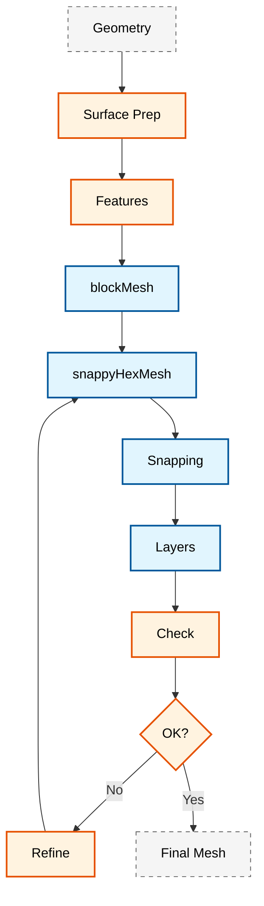

# 🔧 Advanced snappyHexMesh Configuration Guide

**Learning Objectives**: Gain detailed understanding of snappyHexMesh configuration for generating high-quality CFD meshes from complex geometries
**Prerequisites**: Basic understanding of blockMesh, CAD geometry knowledge, intermediate OpenFOAM experience
**Target Skills**: Advanced snappyHexMeshDict configuration, boundary layer management, mesh quality control, parallel execution

---

## Overview

`snappyHexMesh` is OpenFOAM's primary ==semi-structured== meshing utility that combines hexahedral background mesh generation with automatic surface-conforming refinement

### Design Trade-offs

| Approach | Advantages | Disadvantages | Use Case |
|---------|-----------|---------------|----------|
| **Structured (blockMesh)** | High quality, numerical stability | High labor for complex geometry | Simple geometric domains, pipes, channels |
| **Semi-structured (snappyHexMesh)** | Balance of automation and control | Requires good surface preparation | Complex geometries, engine parts |
| **Unstructured (cfMesh)** | Fully automatic | Lower accuracy than structured | Organic geometries, biomedical |

### Workflow


> **Figure 1:** Flowchart showing the complete snappyHexMesh workflow from surface geometry preparation, through feature extraction and background mesh generation, to boundary layer addition and iterative quality assessment for optimal simulation results

---

## Part 1: Surface Preparation

### 1.1 CAD Geometry Processing

Successful CFD simulation begins with proper CAD geometry preparation. OpenFOAM supports multiple geometry formats:

**Recommended CAD Formats:**
```bash
# Formats compatible with OpenFOAM
STEP (.stp, .step)     # STEP Exchange Protocol - recommended
IGES (.igs, .iges)     # Initial Graphics Exchange Specification
STL (.stl)           # StereoLithography (triangular format)
VTK (.vtk)           # Visualization Toolkit (for reference)
```

> [!INFO] **Format Selection**
> - **STEP**: Primary recommended format - preserves parametric information and surface continuity
> - **IGES**: Alternative for legacy systems - may introduce surface inconsistencies
> - **STL**: Triangular surface - requires attention to quality and density

**Geometry Validation:**

```cpp
// Code pattern for geometry validation
bool validateGeometry(const fileName& stlFile)
{
    // Check if STL file exists and is readable
    if (!isFile(stlFile))
    {
        FatalErrorInFunction << "STL file not found: " << stlFile << exit(FatalError);
    }

    // Load triangulated surface from file
    triSurface surface(stlFile);
    Info << "Surface contains " << surface.size() << " triangles" << nl;

    // Check for non-manifold edges that can cause meshing issues
    // Non-manifold edges have more than two faces connected
    labelHashSet nonManifoldEdges = surface.nonManifoldEdges();
    if (!nonManifoldEdges.empty())
    {
        Warning << "Found " << nonManifoldEdges.size() << " non-manifold edges" << endl;
    }

    return true;
}
```

<details>
<summary>📖 Code Explanation</summary>

**Source**: OpenFOAM surface mesh utilities validation concept

**Explanation**:
- **validateGeometry function**: Validates STL files before meshing operations
- **File checking**: Uses `isFile()` to verify file existence and readability
- **Surface loading**: Uses `triSurface` class to load and manipulate triangular surface data
- **Non-manifold edge checking**: Non-manifold edges are common problems causing meshing failure

**Key Concepts**:
- **Manifold edges**: Normal edges with maximum 2 face connections
- **Non-manifold edges**: Edges with more than 2 face connections or abnormal structure
- **Application scope**: Pre-meshing validation to save time and resources

</details>

The validation process includes:
- **Watertight geometry**: Essential for volumetric mesh generation
- **Non-manifold edges**: Can cause meshing failure
- **Surface quality**: Affects final mesh quality
- **Feature preservation**: Important for accurate flow physics

### 1.2 Surface Cleaning and Repair

**Common CAD Problems to Fix:**
```bash
# Common CAD problems that must be fixed:
# 1. Non-manifold geometry
# 2. Zero-thickness surfaces
# 3. Inverted normals
# 4. Small features (holes, edges)
# 5. Assembly gaps
# 6. Inconsistent units
# 7. Overlapping surfaces
```

**Surface Cleaning Workflow:**

```bash
# Surface mesh repair workflow
surfaceCleanPatch -case constant/triSurface/ geometry.stl
surfaceOrient geometry.stl newGeometry.stl

# Feature edge detection
surfaceFeatureExtract -case constant/triSurface/
```

<details>
<summary>📖 Code Explanation</summary>

**Source**: OpenFOAM surface preparation utilities

**Explanation**:
- **surfaceCleanPatch**: Utility for cleaning surface patches by closing small holes and repairing imperfections
- **surfaceOrient**: Orients surface normals consistently (pointing outward)
- **surfaceFeatureExtract**: Extracts feature edges from surfaces for mesh refinement

**Key Concepts**:
- **Consistent orientation**: Consistent normals are essential for flux calculations and boundary identification
- **Feature preservation**: Maintaining important geometry features while cleaning
- **Automated repair**: Using automated tools to reduce time and manual error

</details>

Key cleaning operations include:
- **Gap closing**: Fill small holes in surfaces
- **Normal orientation**: Ensure normals point outward consistently
- **Decimation**: Reduce triangle count while preserving features
- **Edge collapse**: Remove redundant geometric elements

### 1.3 Feature Extraction

Feature extraction depends on geometry, requiring different parameters for different surface types:

```bash
# Extract feature edges for different surface types
if [ "$SURFACE_TYPE" = "mechanical" ]; then
    # Extract edges from mechanical features
    surfaceFeatureEdges -case "$CASE_DIR" -angle 30 -includedAngle 30

elif [ "$SURFACE_TYPE" = "organic" ]; then
    # Extract edges from organic/complex surfaces
    surfaceFeatureEdges -case "$CASE_DIR" -angle 15 -includedAngle 60

elif [ "$SURFACE_TYPE" = "terrain" ]; then
    # Extract terrain features (ridges, valleys)
    surfaceFeatureEdges -case "$CASE_DIR" -angle 45 -featureSet "ridges,valleys"
fi
```

<details>
<summary>📖 Code Explanation</summary>

**Source**: OpenFOAM feature extraction utilities

**Explanation**:
- **Mechanical parts**: Use 30° angle to capture clear machining features
- **Organic shapes**: Use lower angle (15°) and wider included angle for complex shapes
- **Terrain**: Use higher angle and specify specific feature types for terrain

**Key Concepts**:
- **Feature angle**: Angle between face normals defining feature edges
- **Included angle**: Angle included in feature detection
- **Adaptive extraction**: Adjusting extraction parameters based on geometry type

</details>

> [!TIP] **Surface Quality Indicators**
> - **Manifoldness**: Essential for volumetric mesh generation
> - **Normal consistency**: Critical for boundary identification and flux calculations
> - **Triangle quality**: Affects final mesh accuracy - aim for equilateral distribution

---

## Part 2: Dictionary Configuration

### 2.1 Basic snappyHexMeshDict

```cpp
/*--------------------------------*- C++ -*----------------------------------*\
| =========                 |                                                 |
| \\      /  F ield         | OpenFOAM: The Open Source CFD Toolbox           |
|  \\    /   O peration     | Version:  v2306                                 |
|   \\  /    A nd           | Website:  www.openfoam.com                      |
|    \\/     M anipulation  |                                                 |
\*---------------------------------------------------------------------------*/
FoamFile
{
    version     2.0;
    format      ascii;
    class       dictionary;
    object      snappyHexMeshDict;
}
// * * * * * * * * * * * * * * * * * * * //

// Main switches for meshing stages
castellatedMesh true;    // Enable castellated mesh generation
snap true;              // Enable surface snapping
addLayers true;         // Enable boundary layer addition
snapTolerance 1e-6;     // Tolerance for snapping to surface
solveFeatureSnap true;  // Solve for feature snapping
relativeLayersSizes (1.0);

// Geometry definition - import CAD surface
geometry
{
    model.stl
    {
        type triSurfaceMesh;   // Triangular surface mesh type
        name "model";          // Internal name for geometry
    }
}

// Refinement control for castellated mesh
castellatedMeshControls
{
    // Global cell count limits
    maxGlobalCells 10000000;     // Maximum total cells in mesh
    maxLocalCells 1000000;       // Maximum cells per processor
    minRefinementCells 10;       // Minimum cells to trigger refinement
    nCellsBetweenLevels 2;       // Buffer cells between refinement levels

    // Feature edge preservation
    features
    (
        {
            file "model.extEdge";  // Feature edge file
            level 10;               // Refinement level at features
        }
    );

    // Surface refinement settings
    refinementSurfaces
    {
        model
        {
            level (2 2);           // (minLevel maxLevel)
            patchInfo
            {
                type wall;         // Boundary condition type
            }
        }
    }

    resolveFeatureAngle 30;     // Angle to resolve features
}

// Snapping controls for surface conformity
snapControls
{
    nSmoothPatch 3;             // Number of patch smoothing iterations
    tolerance 2.0;              // Snapping tolerance as fraction of local cell size
    nSolveIter 30;              // Number of solver iterations
    nRelaxIter 5;               // Number of relaxation iterations

    // Advanced quality controls
    nFeatureSnapIter 10;        // Feature snapping iterations

    implicitFeatureSnap true;   // Use implicit feature detection
    explicitFeatureSnap false;

    multiRegionFeatureSnap true; // Handle multi-region features
}

// Boundary layer generation controls
addLayersControls
{
    relativeSizes true;         // Use relative sizing

    layers
    {
        model
        {
            nSurfaceLayers 15;   // Number of boundary layers
        }
    }

    expansionRatio 1.2;         // Layer growth ratio
    finalLayerThickness 0.3;    // Thickness of final layer
    minThickness 0.001;         // Minimum layer thickness

    // Advanced controls
    nGrow 0;                    // Layer expansion iterations
    featureAngle 120;           // Max feature angle for layer addition
    nRelaxIter 3;               // Mesh relaxation iterations
    nSmoothSurfaceNormals 3;    // Surface normal smoothing
    nSmoothNormals 3;           // Normal field smoothing
    nSmoothThickness 10;        // Thickness field smoothing

    // Quality-based layer addition
    maxFaceThicknessRatio 0.5;
    maxThicknessToMedialRatio 0.3;
    minMedianAxisAngle 90;
    nBufferCellsNoExtrude 0;
    nLayerIter 50;              // Maximum layer iteration count
}

// Mesh quality controls - validation criteria
meshQualityControls
{
    maxNonOrthogonal 65;        // Max non-orthogonality angle
    maxBoundarySkewness 20;     // Max boundary face skewness
    maxInternalSkewness 4.5;    // Max internal face skewness
    minFaceWeight 0.05;         // Min face weight metric
    minVol 1e-15;               // Min cell volume
    minTetQuality 0.005;        // Min tetrahedral quality
    minDeterminant 0.001;       // Min transformation determinant
}
```

<details>
<summary>📖 Code Explanation</summary>

**Source**: OpenFOAM snappyHexMeshDict dictionary format

**Explanation**:
- **FoamFile header**: Standard OpenFOAM dictionary file header specifying version and file type
- **Main switches**: Main switches controlling mesh generation stages (castellated, snap, addLayers)
- **Geometry section**: Definition of geometry to be used for meshing
- **castellatedMeshControls**: Controls castellated mesh generation and refinement
- **snapControls**: Controls mesh snapping to surfaces
- **addLayersControls**: Controls boundary layer addition
- **meshQualityControls**: Defines mesh quality criteria

**Key Concepts**:
- **Three-stage process**: Castellated mesh → Snapping → Layer addition
- **Refinement levels**: Hierarchical refinement levels
- **Quality criteria**: Multi-dimensional mesh quality checking

</details>

### 2.2 Advanced Multi-Region Configuration

```cpp
/*--------------------------------*- C++ -*----------------------------------*\
| =========                 |                                                 |
| \\      /  F ield         | OpenFOAM: The Open Source CFD Toolbox           |
|  \\    /   O peration     | Version:  v2306                                 |
|   \\  /    A nd           | Website:  www.openfoam.com                      |
|    \\/     M anipulation  |                                                 |
\*---------------------------------------------------------------------------*/
FoamFile
{
    version     2.0;
    format      ascii;
    class       dictionary;
    object      snappyHexMeshDict;
}
// * * * * * * * * * * * * * * * * * * * //

// Multi-region meshing switches
castellatedMesh true;
addLayers true;

geometry
{
    assembly.stl
    {
        type triSurfaceMesh;
        name "assembly";
    }
}

// Multi-region refinement configuration
refinementSurfaces
{
    fluid_region
    {
        level (2 3);      // 3 refinement levels in fluid
        patches
        {
            type wall;
            level (1);     // Additional refinement
        }
    }

    solid_region
    {
        level (1);
        patches
        {
            type wall;
            name "solid_parts";
        }
    }
}

// Multi-region boundary layer controls
addLayersControls
{
    relativeSizes (1.0 1.0);  // Different sizes for different regions
    expansionRatio (1.2 1.5);  // Different expansion ratios
    finalLayerThickness (0.001 0.002);  // Different thicknesses
    minThickness (0.0005 0.001);
    nGrow 1;
    maxFaceThicknessRatio 0.5;  // Prevent overly thin boundary cells
    featureAngle 120;              // Feature detection for layers
}

// Advanced features
features
(
    {
        file "assembly.extEdge";
        level 2;
        includeAngle 45;         // Include shallow angles
        excludedAngle 25;        // Exclude very sharp angles
        nLayers 10;             // Max boundary layer count
        layerTermination angle 90;    // Stop layer addition at 90 degrees
    }
);

// Special controls
snapControls
{
    // Use implicit snapping for complex geometry
    useImplicitSnap true;     // More robust but resource-intensive
    additionalReporting true;  // Detailed logging for debugging
}
```

<details>
<summary>📖 Code Explanation</summary>

**Source**: OpenFOAM multi-region meshing configuration

**Explanation**:
- **Multi-region support**: Support for multi-region meshing (fluid/solid)
- **Region-specific parameters**: Different parameters for each region
- **Layer termination**: Stopping layer addition based on angle criteria
- **Implicit snapping**: Using implicit snapping algorithm for complex geometry

**Key Concepts**:
- **Conjugate heat transfer**: Joint meshing of fluid and solid regions
- **Adaptive refinement**: Different refinement for each region's needs
- **Feature preservation**: Preserving region-specific features

</details>

---

## Part 3: Boundary Layer Physics & Mathematics

### 3.1 Quality Metrics

Mathematical foundation for mesh quality assessment:

$$\text{Non-orthogonality} = \arccos\left(\frac{\mathbf{d} \cdot \mathbf{n}}{\|\mathbf{d}\| \|\mathbf{n}\|}\right)$$

Where $\mathbf{d}$ is the vector connecting cell centers and $\mathbf{n}$ is the face normal vector

$$\text{Skewness} = \frac{\|\mathbf{x}_f - \mathbf{x}_{projected}\|}{\|\mathbf{x}_f - \mathbf{x}_{owner}\| + \|\mathbf{x}_f - \mathbf{x}_{neighbor}\|}$$

$$\text{Aspect Ratio} = \frac{\max(d_1, d_2, d_3)}{\min(d_1, d_2, d_3)}$$

### 3.2 Boundary Layer Physics

For wall-bounded flows, proper boundary layer resolution is critical:

**First Cell Height Calculation**:
$$\Delta y = \frac{y^+ \mu}{\rho u_\tau}$$

Where:
- $u_\tau = U_\infty \sqrt{C_f/2}$ is the friction velocity
- $C_f = 0.026 \cdot Re^{-0.139}$ is the skin friction coefficient (Blasius correlation)
- $\mu$ is the dynamic viscosity

**Growth Ratio** for boundary layer cells:
$$h_{i+1} = r \cdot h_i$$

Where $h_i$ is the cell height and $r$ is the expansion ratio (typically $1.1 \leq r \leq 1.3$)

**Recommended $y^+$ Values**:
- **Viscous sublayer**: $y^+ < 1$ for Low-Re turbulence models
- **Buffer layer**: $1 < y^+ < 5$
- **Log-law region**: $30 < y^+ < 300$ for wall functions

**Reichardt's Wall Function** provides guidance for boundary layer meshing:

$$u^+ = \frac{1}{\kappa} \ln(1 + \kappa y^+) + C \left(1 - e^{-y^+/A} - \frac{y^+}{A} e^{-b y^+}\right)$$

Where $\kappa \approx 0.41$ is the von Kármán constant

---

## Part 4: Advanced Refinement Strategies

### 4.1 Castellated Mesh Controls

```cpp
/*--------------------------------*- C++ -*----------------------------------*\
| =========                 |                                                 |
| \\      /  F ield         | OpenFOAM: The Open Source CFD Toolbox           |
|  \\    /   O peration     | Version:  v2306                                 |
|   \\  /    A nd           | Website:  www.openfoam.com                      |
|    \\/     M anipulation  |                                                 |
\*---------------------------------------------------------------------------*/
castellatedMeshControls
{
    // Global refinement levels
    maxGlobalCells 10000000;     // Maximum total cells
    maxLocalCells 1000000;       // Maximum cells per processor
    minRefinementCells 10;       // Minimum cells for refinement
    nCellsBetweenLevels 2;       // Buffer between refinement levels

    // Feature preservation
    features
    (
        {
            file "vehicle.extEdge";  // Feature edge file
            level 10;                 // Refinement at features
        }
    );

    // Surface refinement
    refinementSurfaces
    {
        vehicle
        {
            level (2 2);             // (minLevel maxLevel)
            patchInfo
            {
                type wall;           // Boundary type
            }
        }
    }

    // Localized refinement regions
    refinementRegions
    {
        wakeBox
        {
            mode inside;             // Refine inside region
            levels ((1.0 2) (0.5 3));  // (distance level) pairs
        }

        refinementSphere
        {
            mode inside;             // Refine inside sphere
            levels ((0.2 3));         // Single refinement level
        }
    }

    // Feature detection
    resolveFeatureAngle 30;         // Angle for feature resolution
}
```

<details>
<summary>📖 Code Explanation</summary>

**Source**: OpenFOAM castellated mesh controls

**Explanation**:
- **Global refinement**: Refinement across the entire domain
- **Feature preservation**: Preserving important features with additional refinement
- **Refinement regions**: Localized refinement (wake regions, boundary layers)
- **Distance-based refinement**: Refinement based on distance from surfaces

**Key Concepts**:
- **Gradation control**: Control of cell size gradation
- **Local refinement**: Refinement only where high resolution is needed
- **Feature detection**: Detecting and preserving geometric features

</details>

### 4.2 Supreme Snapping Algorithm

The snapping algorithm conforms the mesh to surface geometry:

$$\min_{\mathbf{x}_v} \|\mathbf{x}_v - \mathbf{x}_s(\mathbf{u}_v)\|^2$$

Where $\mathbf{x}_v$ is the vertex position, $\mathbf{x}_s$ is the surface parameterization, and $\mathbf{u}_v$ are the UV coordinates

```cpp
/*--------------------------------*- C++ -*----------------------------------*\
| =========                 |                                                 |
| \\      /  F ield         | OpenFOAM: The Open Source CFD Toolbox           |
|  \\    /   O peration     | Version:  v2306                                 |
|   \\  /    A nd           | Website:  www.openfoam.com                      |
|    \\/     M anipulation  |                                                 |
\*---------------------------------------------------------------------------*/
snapControls
{
    nSmoothPatch 3;           // Number of patch smoothing iterations
    tolerance 2.0;            // Snapping tolerance as fraction of local cell size
    nSolveIter 30;            // Number of solver iterations
    nRelaxIter 5;             // Number of relaxation iterations

    // Advanced quality controls
    nFeatureSnapIter 10;      // Number of feature snapping iterations

    implicitFeatureSnap true; // Use implicit feature detection
    explicitFeatureSnap false;

    multiRegionFeatureSnap true; // Handle multi-region features
}
```

<details>
<summary>📖 Code Explanation</summary>

**Source**: OpenFOAM snapping algorithm controls

**Explanation**:
- **Patch smoothing**: Smoothing patches before snapping
- **Snapping tolerance**: Snapping tolerance as fraction of local cell size
- **Implicit feature snap**: Using implicit feature detection which is more robust
- **Multi-region support**: Handling features in multiple regions

**Key Concepts**:
- **Surface conformity**: Precise mesh conformance to surfaces
- **Quality preservation**: Maintaining mesh quality during snapping
- **Robust snapping**: Robust algorithms for complex geometry

</details>

### 4.3 Boundary Layer Generation

```cpp
/*--------------------------------*- C++ -*----------------------------------*\
| =========                 |                                                 |
| \\      /  F ield         | OpenFOAM: The Open Source CFD Toolbox           |
|  \\    /   O peration     | Version:  v2306                                 |
|   \\  /    A nd           | Website:  www.openfoam.com                      |
|    \\/     M anipulation  |                                                 |
\*---------------------------------------------------------------------------*/
addLayersControls
{
    relativeSizes true;       // Use relative sizing

    layers
    {
        vehicle_wall
        {
            nSurfaceLayers 15; // Number of boundary layers
        }
    }

    expansionRatio 1.2;       // Layer growth ratio
    finalLayerThickness 0.3;  // Final layer thickness
    minThickness 0.001;       // Minimum layer thickness

    // Advanced controls
    nGrow 0;                  // Layer expansion iterations
    featureAngle 120;         // Max feature angle for layers
    nRelaxIter 3;             // Mesh relaxation iterations
    nSmoothSurfaceNormals 3;  // Surface normal smoothing
    nSmoothNormals 3;         // Normal field smoothing
    nSmoothThickness 10;      // Thickness field smoothing

    // Quality-based layer addition
    maxFaceThicknessRatio 0.5;
    maxThicknessToMedialRatio 0.3;
    minMedianAxisAngle 90;
    nBufferCellsNoExtrude 0;
    nLayerIter 50;            // Maximum layer iteration count
}
```

<details>
<summary>📖 Code Explanation</summary>

**Source**: OpenFOAM boundary layer generation controls

**Explanation**:
- **Layer specification**: Specifying number of layers for each surface
- **Expansion ratio**: Expansion ratio of layer thickness
- **Quality controls**: Quality controls to prevent low-quality cells
- **Smoothing iterations**: Smoothing of thickness field and normal vectors

**Key Concepts**:
- **Y+ compliance**: Compliance with Y+ requirements for turbulence models
- **Growth control**: Control of layer growth rate
- **Feature handling**: Handling complex features in layer addition

</details>

**Boundary layer mesh quality metrics**:
- **First cell height**: $y^+ = \frac{u_* \Delta y}{\nu} \approx 1$
- **Growth rate**: Controlled by expansion ratio
- **Aspect ratio**: Keep below defined limits
- **Orthogonality**: Ensures numerical stability

---

## Part 5: Parallel Execution

### 5.1 Parallel Meshing Workflow

```bash
#!/bin/bash
# Parallel snappyHexMesh execution workflow
# Usage: ./parallel_snappy.sh <case_dir> <nprocs>

NPROCS=4
CASE_DIR="complex_assembly"

echo "=== Parallel snappyHexMesh with $NPROCS processors ==="

# Step 1: Decompose domain for parallel processing
echo "[1] Decomposing domain..."
decomposePar -case "$CASE_DIR" -force -nProcs $NPROCS

# Step 2: Run snappyHexMesh in parallel
echo "[2] Running parallel snappyHexMesh..."
mpirun -np $NPROCS snappyHexMesh -overwrite -case "$CASE_DIR" | tee snappy_parallel.log

# Step 3: Reconstruct parallel results
echo "[3] Reconstructing parallel results..."
reconstructPar -case "$CASE_DIR" -latestTime

# Step 4: Check final mesh quality
echo "[4] Checking parallel mesh..."
checkMesh -case "$CASE_DIR" -allTopology -allGeometry | tee check_parallel.log
```

<details>
<summary>📖 Code Explanation</summary>

**Source**: OpenFOAM parallel meshing workflow

**Explanation**:
- **Decomposition**: Decomposing domain into subdomains for parallel processing
- **Parallel execution**: Running snappyHexMesh in parallel with MPI
- **Reconstruction**: Reconstructing results from subdomains into single mesh
- **Quality verification**: Verifying mesh quality after parallel processing

**Key Concepts**:
- **Domain decomposition**: Dividing domain to utilize multiple processors
- **Load balancing**: Even distribution of workload
- **Scalability**: Ability to scale to many processors

</details>

Parallel execution is essential for large mesh generation, dramatically reducing computation time through domain decomposition. The workflow involves decomposing the domain, parallel mesh generation, then reconstructing results. Final quality verification ensures the parallel meshing process maintains mesh integrity and quality standards.

### 5.2 Decomposition Configuration

```cpp
/*--------------------------------*- C++ -*----------------------------------*\
| =========                 |                                                 |
| \\      /  F ield         | OpenFOAM: The Open Source CFD Toolbox           |
|  \\    /   O peration     | Version:  v2306                                 |
|   \\  /    A nd           | Website:  www.openfoam.com                      |
|    \\/     M anipulation  |                                                 |
\*---------------------------------------------------------------------------*/
// system/decomposeParDict
numberOfSubdomains 4;

// Decomposition method selection
method scotch;                // Recommended: automatic load balancing
// method hierarchical;       // Alternative: structured decomposition
// coeffs
// {
//     n 2;
//     m 2;
// }

// Simple method coefficients (for method simple;)
simpleCoeffs
{
    n 2;                      // Number of subdivisions in each direction
    delta 0.001;              // Cell skewness tolerance
}

// Hierarchical method coefficients
hierarchicalCoeffs
{
    n 2;                      // Number of subdivisions
    delta 0.001;              // Cell skewness tolerance
}
```

<details>
<summary>📖 Code Explanation</summary>

**Source**: OpenFOAM domain decomposition configuration

**Explanation**:
- **numberOfSubdomains**: Number of subdomains to divide into
- **Method selection**: Decompose method (scotch, hierarchical, simple, etc.)
- **Scotch method**: Automatic method providing good load balancing
- **Coefficients**: Parameters specific to each method

**Key Concepts**:
- **Load balancing**: Even distribution of cells in subdomains
- **Minimize communication**: Reducing inter-processor communication
- **Decomposition quality**: Decomposition quality affects efficiency

</details>

---

## Part 6: Troubleshooting Guide

### 6.1 Common Problems and Solutions

| Problem | Symptoms | Solution |
|---------|----------|----------|
| **Gap detection failure** | "No surface features found" | Check detection parameters: `featureAngle`, `minFeatureSize` |
| **Infinite cell creation** | "Zero or negative volume cells" | Check surface normals, CAD quality |
| **Low boundary layer quality** | "Boundary layer thickness variation" | Use layer controls with `minThickness`/`maxThickness` |
| **Cell quality problems** | "High non-orthogonal cells" | Check quality controls, adjust grading |
| **Memory errors** | "Insufficient memory for meshing" | Reduce target cell count, use parallel processing |

### 6.2 Gap Detection Failure

This problem occurs when snappyHexMesh cannot properly identify surface features. The detection algorithm depends on the `featureAngle` parameter, which defines the angle between surface normals considered a feature edge.

**Configuration Example:**
```cpp
/*--------------------------------*- C++ -*----------------------------------*\
| =========                 |                                                 |
| \\      /  F ield         | OpenFOAM: The Open Source CFD Toolbox           |
|  \\    /   O peration     | Version:  v2306                                 |
|   \\  /    A nd           | Website:  www.openfoam.com                      |
|    \\/     M anipulation  |                                                 |
\*---------------------------------------------------------------------------*/
// In snappyHexMeshDict
castellatedMeshControls
{
    featureAngle 150;  // degrees - detect sharper features
    minFeatureSize 0.001;  // minimum feature size in meters
}
```

<details>
<summary>📖 Code Explanation</summary>

**Source**: OpenFOAM feature detection configuration

**Explanation**:
- **featureAngle**: Minimum angle for feature edge detection (sharper angles are detected)
- **minFeatureSize**: Minimum feature size to be preserved

**Key Concepts**:
- **Feature sensitivity**: Sensitivity to features adjustable via parameters
- **Geometry complexity**: Complex geometries may require different parameters
- **Detection threshold**: Setting appropriate threshold for feature detection

</details>

### 6.3 Infinite Cell Creation

When snappyHexMesh creates cells with zero or negative volume, this typically indicates problems with the input surface geometry. Common causes include **inverted normals**, **non-manifold edges**, or **self-intersecting surfaces**.

**Diagnostic Steps:**
```bash
# Check surface quality with surfaceCheck utility
surfaceCheck constant/triSurface/<geometry>.stl

# Things to look for:
# - Non-manifold edges
# - Self-intersecting surfaces
# - Inconsistent face orientation
```

<details>
<summary>📖 Code Explanation</summary>

**Source**: OpenFOAM surface diagnostic utilities

**Explanation**:
- **surfaceCheck**: Utility for checking surface quality
- **Non-manifold edges**: Overly complex edges cause meshing problems
- **Self-intersection**: Self-intersecting surfaces create ambiguity

**Key Concepts**:
- **Preventive checking**: Checking before meshing to prevent problems
- **Geometry preparation**: Good geometry preparation is essential
- **Diagnostic tools**: Using diagnostic tools to identify problems

</details>

### 6.4 Progressive Refinement Strategy

For complex geometries, use a progressive refinement approach to identify and fix problems early:

```cpp
/*--------------------------------*- C++ -*----------------------------------*\
| =========                 |                                                 |
| \\      /  F ield         | OpenFOAM: The Open Source CFD Toolbox           |
|  \\    /   O peration     | Version:  v2306                                 |
|   \\  /    A nd           | Website:  www.openfoam.com                      |
|    \\/     M anipulation  |                                                 |
\*---------------------------------------------------------------------------*/
// Progressive refinement in snappyHexMeshDict
castellatedMeshControls
{
    // Start coarse, then refine progressively
    nRefinementLevels 3;

    // Define refinement regions
    refinementRegions
    {
        "refinementBox1"
        {
            mode distance;                    // Distance-based refinement
            levels ((0.1 1) (0.05 2) (0.025 3));  // (distance level) pairs
        }
    }
}
```

<details>
<summary>📖 Code Explanation</summary>

**Source**: OpenFOAM progressive refinement strategy

**Explanation**:
- **Progressive refinement**: Starting with coarse mesh then refining stepwise
- **Distance-based**: Refinement based on distance from surfaces or features
- **Level specification**: Specifying refinement levels for each distance

**Key Concepts**:
- **Iterative improvement**: Iterative refinement for better quality
- **Resource management**: Managing resources through progressive refinement
- **Early problem detection**: Detecting problems early

</details>

---

## Part 7: Quality Assessment Workflow

### 7.1 Automated Quality Checking

```bash
#!/bin/bash
# Comprehensive mesh quality assessment script
# Usage: ./mesh_quality_assessment.sh <case_dir>

echo "Starting mesh quality assessment..."

# Check basic mesh consistency
checkMesh -case . -allGeometry -allTopology -time 0 > meshCheck.txt

# Extract quality metrics
grep -E "max:" meshCheck.txt > qualityMetrics.txt
grep -E "Failed|Error" meshCheck.txt > meshErrors.txt

# Automated quality assessment with Python
python3 << EOF
import re

# Read mesh check results
with open('meshCheck.txt', 'r') as f:
    content = f.read()

# Extract quality metrics
metrics = {}
patterns = {
    'non_orthogonal_cells': r'Non-orthogonal cells: (\d+)',
    'skewness_max': r'Max.*skewness = ([\d\.e-]+)',
    'aspect_ratio_max': r'Max.*aspect ratio = ([\d\.e-]+)',
    'determinant_min': r'Min.*determinant = ([\d\.e-]+)'
}

for key, pattern in patterns.items():
    match = re.search(pattern, content)
    if match:
        metrics[key] = float(match.group(1))

# Calculate quality score
quality_score = 100
if metrics.get('non_orthogonal_cells', 0) > 1000:
    quality_score -= 20
if metrics.get('skewness_max', 0) > 2:
    quality_score -= 30
if metrics.get('aspect_ratio_max', 0) > 100:
    quality_score -= 25
if metrics.get('determinant_min', 0) < 0.01:
    quality_score -= 25

print(f"Overall Mesh Quality Score: {quality_score}/100")
EOF

echo "Mesh quality assessment complete."
```

<details>
<summary>📖 Code Explanation</summary>

**Source**: OpenFOAM quality assessment workflow

**Explanation**:
- **checkMesh utility**: Standard utility for checking mesh quality
- **Metric extraction**: Extracting quality metrics from results
- **Quality scoring**: Automated quality scoring

**Key Concepts**:
- **Automated validation**: Automated quality checking
- **Quality gates**: Setting quality criteria for decision making
- **Continuous assessment**: Continuous quality assessment

</details>

### 7.2 Python Script for Quality Analysis

```python
#!/usr/bin/env python3
"""
Comprehensive mesh quality analyzer for OpenFOAM meshes
Provides detailed analysis and visualization of mesh quality metrics
"""

import numpy as np
import sys
import os
import subprocess
import matplotlib.pyplot as plt
from matplotlib.backends.backend_pdf import PdfPages

class MeshQualityAnalyzer:
    """Mesh quality analyzer class for OpenFOAM meshes"""

    def __init__(self, case_dir):
        """
        Initialize analyzer with case directory

        Parameters:
        -----------
        case_dir : str
            Path to OpenFOAM case directory
        """
        self.case_dir = case_dir
        self.mesh_data = {}
        self.load_mesh_data()

    def load_mesh_data(self):
        """
        Load mesh data from OpenFOAM case directory
        Runs checkMesh and captures output for analysis
        """
        # Run checkMesh and capture output
        try:
            result = subprocess.run(
                ['checkMesh', '-case', self.case_dir,
                 '-writeAllSurfaces', '-latestTime'],
                capture_output=True, text=True, check=True
            )
            self.checkmesh_output = result.stdout
        except subprocess.CalledProcessError as e:
            print(f"Error running checkMesh: {e}")
            self.checkmesh_output = ""

    def calculate_quality_metrics(self):
        """
        Calculate comprehensive mesh quality metrics
        Parses checkMesh output for quality metrics

        Returns:
        --------
        dict
            Dictionary containing quality metrics
        """
        metrics = {}

        # Parse checkMesh output for quality metrics
        lines = self.checkmesh_output.split('\n')
        for line in lines:
            line = line.strip()

            # Parse non-orthogonality
            if 'non-orthogonal' in line:
                if 'cells with non-orthogonality' in line:
                    metrics['non_orthogonal_cells'] = int(line.split()[0])
                if 'maximum non-orthogonality' in line:
                    metrics['max_non_orthogonality'] = float(line.split()[-1])

            # Parse skewness
            if 'skewness' in line:
                if 'skewness cells' in line:
                    metrics['skewness_cells'] = int(line.split()[0])
                if 'maximum skewness' in line:
                    metrics['max_skewness'] = float(line.split()[-1])

            # Parse aspect ratio
            if 'aspect ratio' in line:
                if 'maximum aspect ratio' in line:
                    metrics['max_aspect_ratio'] = float(line.split()[-1])

            # Count cells and mesh statistics
            if 'total cells' in line:
                metrics['total_cells'] = int(line.split()[0])
            if 'total faces' in line:
                metrics['total_faces'] = int(line.split()[0])
            if 'total points' in line:
                metrics['total_points'] = int(line.split()[0])

        return metrics

    def identify_problematic_cells(self, quality_metrics):
        """
        Identify cells with quality issues

        Parameters:
        -----------
        quality_metrics : dict
            Dictionary of quality metrics

        Returns:
        --------
        list
            List of problematic cell descriptions
        """
        problematic_cells = []

        # Define quality thresholds
        thresholds = {
            'max_non_orthogonality': 70.0,  # degrees
            'max_skewness': 4.0,
            'max_aspect_ratio': 1000.0
        }

        # Check each threshold
        if quality_metrics.get('max_non_orthogonality', 0) > thresholds['max_non_orthogonality']:
            problematic_cells.append({
                'type': 'non_orthogonality',
                'value': quality_metrics['max_non_orthogonality'],
                'threshold': thresholds['max_non_orthogonality']
            })

        if quality_metrics.get('max_skewness', 0) > thresholds['max_skewness']:
            problematic_cells.append({
                'type': 'skewness',
                'value': quality_metrics['max_skewness'],
                'threshold': thresholds['max_skewness']
            })

        if quality_metrics.get('max_aspect_ratio', 0) > thresholds['max_aspect_ratio']:
            problematic_cells.append({
                'type': 'aspect_ratio',
                'value': quality_metrics['max_aspect_ratio'],
                'threshold': thresholds['max_aspect_ratio']
            })

        return problematic_cells
```

<details>
<summary>📖 Code Explanation</summary>

**Source**: Custom Python mesh quality analyzer

**Explanation**:
- **MeshQualityAnalyzer class**: Class for mesh quality analysis
- **load_mesh_data**: Loads mesh data from checkMesh output
- **calculate_quality_metrics**: Calculates mesh quality metrics
- **identify_problematic_cells**: Identifies cells with quality issues

**Key Concepts**:
- **Automated analysis**: Automated analysis with Python
- **Threshold-based**: Using thresholds for quality checking
- **Extensible framework**: Extensible framework

</details>

---

## Best Practices Summary

> [!TIP] **Key Recommendations**
>
> 1. **Surface Quality**: Always validate CAD geometry before meshing
> 2. **Feature Detection**: Adjust `featureAngle` parameters according to geometry complexity
> 3. **Refinement Strategy**: Use progressive refinement for complex cases
> 4. **Boundary Layers**: Calculate first cell height according to $y^+$ requirements
> 5. **Parallel Processing**: Enable parallel processing for meshes > 10⁶ cells
> 6. **Quality Gates**: Use automated quality checking before running solvers
> 7. **Iterative Approach**: Improve mesh quality through systematic iteration

---

## References

- [[01_🎯_Overview_Mesh_Preparation_Strategy]] - Overall mesh strategy
- [[03_🎯_BlockMesh_Enhancement_Workflow]] - Background mesh generation
- [[04_🎯_snappyHexMesh_Workflow_Surface_Meshing_Excellence]] - Surface meshing workflow
- [[05_🔧_Advanced_Utilities_and_Automation]] - Automation utilities
- [[02_🏗️_CAD_to_CFD_Workflow]] - CAD to CFD conversion